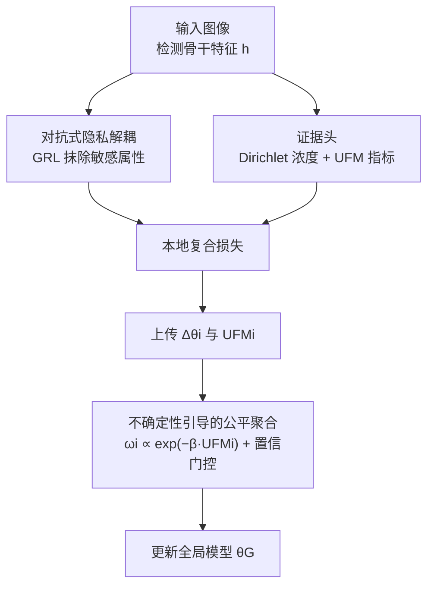

# RESFL: An Uncertainty-Aware Framework for Responsible Federated Learning by Balancing Privacy, Fairness and Utility

**会议**: ICLR 2026  
**OpenReview**: [https://openreview.net/forum?id=Wfz7gpoDSl](https://openreview.net/forum?id=Wfz7gpoDSl)  
**代码**: 无  
**领域**: AI安全 / 联邦学习 / 公平性  
**关键词**: 联邦学习, 隐私-公平权衡, 证据不确定性, 梯度反转, 公平聚合

## 一句话总结
RESFL 把"对抗式隐私解耦"和"不确定性引导的公平聚合"塞进同一条联邦学习流水线，用证据神经网络算出一个尺度无关的群组公平指标 UFM 来给客户端更新加权，在自动驾驶目标检测上同时压低隐私泄露、缩小群组差距，且几乎不掉精度。

## 研究背景与动机
**领域现状**：联邦学习（FL）让多客户端在不上传原始数据的前提下协作训练，天然降低了集中式聚合的隐私风险，已经在医疗、金融、智慧城市等敏感领域铺开。为了进一步加固隐私，主流做法是叠加差分隐私（DP）、安全多方计算、同态加密等机制。

**现有痛点**：这些隐私机制和"公平性"是天生冲突的。差分隐私靠注入噪声、隐藏敏感属性（肤色、性别、年龄）来防泄露，但公平性干预恰恰需要直接访问这些敏感属性去检测和纠偏——属性一被藏起来，少数群体的数据模式就被噪声糊掉，反而让群组间性能差距更大。反过来，做公平 re-weighting 又容易把敏感信息暴露出去。绝大多数 FL 方法只优化其中一个目标、牺牲另一个，而且很少在"对抗客户端"存在时检验自己的保证还成不成立。

**核心矛盾**：隐私（藏属性）和公平（需要属性纠偏）之间存在直接的 trade-off，再叠加真实世界的不确定性（传感器噪声、天气光照、域偏移）——这些不确定性会不均匀地打击弱势子群体（比如雾天、暗光下对深肤色行人的漏检率更高），把差距进一步放大。服务器又看不到敏感属性，没法直接度量偏差。

**本文目标**：在一条端到端的 FL 流水线里同时优化隐私和群组公平，且不牺牲效用（utility），还要在良性和对抗两种客户端设定下都能撑住。

**切入角度**：作者的关键观察是——不用直接拿到敏感属性，也能间接度量公平性。如果某个群组的预测"认知不确定性（epistemic uncertainty）"明显高于其他群组，就说明模型对这个群组没学好、存在差距。于是把"群组间的不确定性差异"当作公平性的代理信号，既绕开了对敏感属性的直接访问，又能驱动聚合。

**核心 idea**：用证据神经网络量化每个群组的认知不确定性，构造尺度无关的不确定性公平指标 UFM，按 $\omega_i \propto \exp(-\beta\,\text{UFM}_i)$ 给客户端更新加权，同时用梯度反转层在表征里抹掉敏感属性，三个目标在一个复合损失里联合优化。

## 方法详解

### 整体框架
RESFL 是一个标准的"客户端本地训练 + 服务器加权聚合"的 FL 循环，但在客户端和服务器两侧各加了一套机制。客户端这边：检测骨干（改造的 YOLOv8）先抽出特征表示 $h$，一路经过梯度反转层（GRL）接一个敌手分类器做对抗隐私解耦，把敏感属性从 $h$ 里挤出去；另一路把标准 softmax 检测头换成证据头，输出 Dirichlet 浓度向量，算出每个群组的认知不确定性，进而汇成本地的公平指标 $\text{UFM}_i$。本地用一个把检测损失、对抗损失、不确定性损失加权相加的复合损失训练，最后把参数更新 $\Delta\theta_i$ 和 $\text{UFM}_i$ 一起发给服务器。服务器这边：不再做 FedAvg 的等权平均，而是按 $\omega_i \propto \exp(-\beta\,\text{UFM}_i)$ 给更新加权——群组差距越小、越自信的客户端权重越大，并用一道确定性的置信门控把验证精度过低（可能被投毒）的客户端权重压到近 0，再更新全局模型。

### 关键设计

**1. 证据不确定性与 UFM 指标：不碰敏感属性也能量化群组公平**

这一步针对的痛点是"服务器拿不到敏感属性、没法直接度量偏差"。RESFL 让每个客户端把检测头从 softmax 换成证据输出层，预测一个非负浓度向量 $\alpha=(\alpha_1,\dots,\alpha_C)$，它参数化了类别概率单纯形上的 Dirichlet 分布，于是认知不确定性可以闭式算出来，不用蒙特卡洛采样或深度集成。总证据 $\alpha_0=\sum_c \alpha_c$ 直接给出近似认知方差 $\sigma^2_{\text{epi},c}\sim 1/\alpha_0$——$\alpha_0$ 越大、不确定性越低。为保证正性和数值稳定，logits 经 $\alpha_c = 1 + \text{softplus}(z_c)$ 变换。

有了每张图的平均总证据，再按群组求均值 $\bar\alpha_{0,g}$（只统计匹配到群组 $g$ 真值的检测），就能定义群组间的不确定性差距和归一化的不确定性公平指标：

$$\Delta_u = \max_g\Big(\frac{1}{\bar\alpha_{0,g}}\Big) - \min_g\Big(\frac{1}{\bar\alpha_{0,g}}\Big),\qquad \text{UFM} = \frac{\Delta_u}{\frac{1}{G}\sum_{g=1}^{G}\frac{1}{\bar\alpha_{0,g}} + \epsilon}$$

UFM 越高表示群组差距越大、越不公平。关键在于它是尺度无关的（分母做了归一化），且只依赖证据、不依赖敏感属性的显式标签。作者还从理论上证明，控制 UFM 能收紧置信度调整后的群组泛化界，并通过混合论证把它抬到联邦评估层面，为后面"按 UFM 加权"提供了理论支撑。

**2. 对抗式隐私解耦：用梯度反转把敏感属性从表征里挤出去**

针对"共享表征/梯度里残留敏感属性、容易被属性推断攻击还原"的痛点，RESFL 在特征提取器 $f(x;\theta)$ 和一个敌手分类器 $A(h;\phi)$ 之间嵌入梯度反转层 $R_{\lambda_{\text{adv}}}$。敌手努力从表征 $h$ 里预测敏感属性 $s$，而特征提取器被训练成尽量让这个预测失败，于是学到的表征对 $s$ 不变。GRL 在前向时是恒等映射，反向时把梯度乘以 $-\lambda_{\text{adv}}$，从而把"最小化-最大化"的博弈用一次普通反传实现：

$$\min_\theta \max_\phi\ \mathbb{E}_{(x,s)\sim D_i}\Big[-\lambda_{\text{adv}}\sum_{k=1}^{K}\mathbf{1}\{s=k\}\log A_k\big(R_{\lambda_{\text{adv}}}(f(x;\theta));\phi\big)\Big]$$

作者不声称 $(\epsilon,\delta)$-DP 保证，但给了信息论解读：最大化对抗损失等价于降低表征 $H$ 与敏感属性 $S$ 的互信息 $I(H;S)$；由 Fano 不等式，当 $I(H;S)\to 0$ 时任何属性推断攻击的准确率都被压到随机水平 $\approx 1-1/K$。和差分隐私"无差别注噪糊掉所有信息"不同，这种解耦是有针对性地只抹敏感属性、尽量保留检测任务需要的判别信息，因此对效用的伤害更小。

**3. 不确定性引导的公平聚合 + 置信门控：让差距小、又自信的客户端说话更响**

针对"FedAvg 等权平均会让高差距、低置信甚至被投毒的客户端污染全局模型"的痛点，服务器用温度缩放的指数权重做聚合：

$$\omega_i = \frac{\exp(-\beta\,\text{UFM}_i)}{\sum_{j=1}^{N}\exp(-\beta\,\text{UFM}_j)},\qquad \theta_G^{(t+1)} = \theta_G^{(t)} + \eta\sum_{i=1}^{N}\omega_i\,\Delta\theta_i$$

温度 $\beta$ 控制公平偏好的锐度：$\beta\to 0$ 退化成等权平均，$\beta$ 越大越把权重集中到群组差距最小的客户端上。理论上这条加权规则被证明能让全局差距的代理界单调下降。此外还有一道确定性置信门控：若某客户端的验证精度低于固定下限，就把它上报的公平统计量直接钳到最差值，强制 $\omega_i\approx 0$——这既挡住了一致性低置信的客户端抢权重，也限制了投毒/伪造证据的对抗更新的影响力，是 RESFL 能在对抗设定下撑住的关键。

### 损失函数 / 训练策略
每个客户端在本地最小化一个复合损失，把检测精度、属性混淆、不确定性偏差控制三者绑在一起：

$$\mathcal{L}_{\text{local}}(\theta,\phi) = \mathcal{L}_{\text{task}}(\theta) + \lambda_{\text{priv}}\,\mathcal{L}_{\text{adv}}(\theta,\phi) + \lambda_{\text{fair}}\,\mathcal{L}_{\text{uncertainty}}(\theta)$$

其中 $\lambda_{\text{priv}}$ 缩放对抗隐私损失、$\lambda_{\text{fair}}$ 加权证据不确定性项。实践中在每个本地 SGD 步内交替更新 $\phi$（最大化）和 $\theta$（最小化）。训练用改造的 YOLOv8 骨干配证据浓度头，$K=4$ 个客户端、$T=100$ 轮通信，每轮每客户端本地训 1 个 epoch；超参取 $\lambda_{\text{priv}}=0.1$、$\lambda_{\text{fair}}=0.01$、$\beta=2.0$（经网格搜索），结果对 3 个随机种子取平均。作者建议沿评测出的权衡点凸包选 $(\lambda_{\text{priv}},\lambda_{\text{fair}})$，从而在满足隐私和公平阈值的同时尽量少牺牲任一目标。

## 实验关键数据

### 主实验
在 FACET 数据集（32,000 张真实图像、5 万+ 行人实例，按十级 Monk 肤色刻度分群）上，沿效用（mAP↑）、公平（$|1-\text{DI}|$、$\Delta$EOP↓）、隐私攻击（MIA/AIA 成功率↓）、鲁棒（BA AD、DPA EODD↓）四个维度对比：

| 方法 | mAP↑ | $\lvert1-\text{DI}\rvert$↓ | $\Delta$EOP↓ | MIA SR↓ | AIA SR↓ |
|------|------|------|------|------|------|
| FedAvg | 0.6378 | 0.2159 | 0.2362 | 0.3341 | 0.4431 |
| FedAvg-DP ($\epsilon=1$) | 0.4612 | 0.3945 | 0.2879 | 0.2364 | 0.2627 |
| FairFed | 0.7013 | 0.2496 | 0.2562 | 0.4409 | 0.5256 |
| PUFFLE | 0.4192 | 0.3721 | 0.2976 | 0.2725 | 0.2909 |
| PFU-FL | 0.3952 | 0.3356 | 0.3446 | 0.2409 | 0.2546 |
| **RESFL（本文）** | **0.6654** | **0.2287** | **0.1959** | **0.2093** | **0.1832** |

RESFL 的 mAP 0.6654 逼近最高的 FairFed（0.7013），却把 FairFed 那糟糕的隐私（MIA 0.4409 / AIA 0.5256）压到 0.2093 / 0.1832；相对 FedAvg 把 MIA 降约 37%、$\Delta$EOP 降约 17%。和 DP 类方法（FedAvg-DP / PUFFLE / PFU-FL 都掉到 0.4 出头的 mAP）相比，RESFL 几乎不掉精度。CARLA 仿真下从 0% 到 100% 的云、雨、雾扰动中，RESFL 的 mAP 衰减最慢、公平/隐私分数始终更低；雾是最难的设定（遮边缘、藏远物），所有方法都被物理极限压垮，但 RESFL 仍靠证据下限、温度控制和"空泛度掩码"放缓了差距与攻击成功率的上升。

### 消融实验
扫 $\lambda_{\text{fair}}$ 与 $\lambda_{\text{priv}}$（任务损失固定为 1）：

| $\lambda_{\text{fair}}$ | $\lambda_{\text{priv}}$ | mAP↑ | $\lvert1-\text{DI}\rvert$↓ | $\Delta$EOP↓ | MIA SR↓ |
|------|------|------|------|------|------|
| 1 | 0 | 0.6278 | 0.2258 | 0.2062 | 0.3341 |
| 0 | 1 | 0.5856 | 0.2571 | 0.2846 | 0.1025 |
| 0.1 | 0.01 | **0.6654** | 0.2287 | 0.1959 | 0.2093 |
| 0.1 | 1 | 0.5839 | 0.3862 | 0.4146 | 0.1176 |

可以看到调大 $\lambda_{\text{fair}}$ 会把模型容量从主流群体挪向高不确定性/少数切片，公平变好但平均 mAP 下降，存在偏差-方差权衡；调大 $\lambda_{\text{priv}}$ 能进一步压低 MIA（如 $\lambda_{\text{priv}}=1$ 时 MIA 降到 0.10 出头）但会牺牲精度和公平。最优组合 $\lambda_{\text{fair}}=0.1,\lambda_{\text{priv}}=0.01$ 取得整体最佳的效用-公平-隐私平衡。

## 相关工作与局限

**相关工作**：RESFL 处在"隐私-公平联合优化的 FL"这条线上。隐私侧有差分隐私、安全多方计算、同态加密；公平侧分客户端公平（各数据孤岛性能均衡）和群组公平（敏感人群间结果公平）。联合方法有 FairDP-SGD、FairPATE（集中式）、FPFL（DP 下强群组公平但通信开销高）、PUFFLE、PFU-FL 等。另一条线是用认知/证据不确定性做校准与个性化（多见于医学影像）。RESFL 的差异在于把隐私解耦和群组公平聚合融进一条端到端算法，并显式在良性与对抗两种设定下评测。

**局限**：方法虽宣称域无关，但实验只在自动驾驶（FACET + CARLA）单一场景验证；浓雾等极端低能见度下受物理极限制约，所有方法（含 RESFL）都大幅退化，RESFL 只能放缓而非阻止差距与攻击成功率的恶化；对抗隐私解耦不提供形式化的 $(\epsilon,\delta)$-DP 保证，只有互信息层面的信息论解读；UFM 把"群组不确定性差异"当公平代理，在群组覆盖退化或证据被刻意伪造时的可靠性仍依赖置信门控这类启发式防护。

<!-- RELATED:START -->

## 相关论文

- [\[ICLR 2026\] Federated Learning of Quantile Inference under Local Differential Privacy](federated_learning_of_quantile_inference_under_local_differential_privacy.md)
- [\[ICLR 2026\] PateGAIL++: Utility Optimized Private Trajectory Generation with Imitation Learning](pategail_utility_optimized_private_trajectory_generation_with_imitation_learning.md)
- [\[ICLR 2026\] Convergent Differential Privacy Analysis for General Federated Learning](convergent_differential_privacy_analysis_for_general_federated_learning.md)
- [\[ICLR 2026\] Fairness via Independence: A General Regularization Framework for Machine Learning](fairness_via_independence_a_general_regularization_framework_for_machine_learnin.md)
- [\[ICLR 2026\] Rethinking LoRA for Privacy-Preserving Federated Learning in Large Models](rethinking_lora_for_privacy-preserving_federated_learning_in_large_models.md)

<!-- RELATED:END -->
