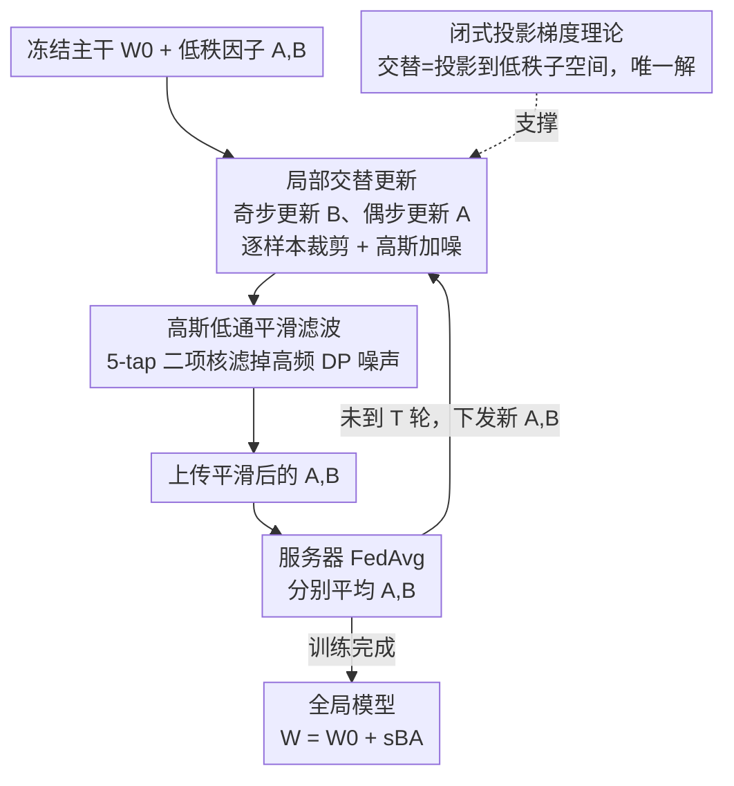

# Rethinking LoRA for Privacy-Preserving Federated Learning in Large Models

**会议**: ICLR 2026  
**OpenReview**: [https://openreview.net/forum?id=BPzSV4uw0x](https://openreview.net/forum?id=BPzSV4uw0x)  
**代码**: https://github.com/junkangLiu0/LA-LORA  
**领域**: AI 安全 / 差分隐私 / 联邦学习 / 参数高效微调  
**关键词**: 差分隐私联邦学习, LoRA, 梯度解耦, 噪声放大, 平坦最小值

## 一句话总结
针对差分隐私联邦学习（DPFL）中直接套用 LoRA 会性能崩塌的问题，本文剖析出梯度耦合、噪声乘性放大、聚合后陷入尖锐解三大病根，提出 LA-LoRA——在每个本地轮内交替更新两个低秩矩阵、并用一个固定高斯低通滤波器平滑带噪梯度，在 Swin Transformer 和 RoBERTa 上都拿到 SOTA（Swin-B / Tiny-ImageNet / $\epsilon=1$ 比最好基线 RoLoRA 高 16.83%）。

## 研究背景与动机

**领域现状**：把 GPT、BERT、ViT 这类基础模型适配到下游任务，越来越依赖分散在各方、互不共享的隐私数据。联邦学习（FL）让多个客户端不交换原始数据就能协同训练，而 LoRA 这类参数高效微调（PEFT）通过冻结主干、只训练两个低秩矩阵 $A、B$，把通信量压到全模型的 0.1% 以下，于是「LoRA + FL」成了大模型隐私适配的主流范式。

**现有痛点**：FL 即便不传原始数据，传梯度/模型更新仍可能被攻击者反推出隐私样本，因此必须叠加差分隐私（DP）——对每条样本梯度裁剪到固定 $\ell_2$ 范数、再加高斯噪声。但作者发现，一旦把 LoRA 放进 DPFL，性能会严重退化，在视觉大模型（LVM）上尤其惨烈。这个退化此前被笼统归因于「DP 有损」，根因没被讲清。

**核心矛盾**：作者把 LoRA 在 DPFL 下失效拆成三个被忽视的结构性病根：(1) **梯度耦合**——$A、B$ 角色不对称（$A$ 降维、$B$ 升维），它们的梯度互为参数（$\nabla_A L = sB^\top(\nabla_W L)$、$\nabla_B L = s(\nabla_W L)A^\top$），同步更新会让 $A$ 定义的隐空间基底漂移、而 $B$ 还在适配过期方向，在 DP 噪声和非独立同分布数据下震荡发散；(2) **噪声乘性放大**——给 $A、B$ 各自独立加噪后，乘积里多出一个非高斯的二阶交叉项 $N_{B}N_{A}$，随噪声尺度 $\sigma$ 二次增长，最终让 LoRA 的扰动超过全模型；(3) **聚合尖锐解**——各客户端的低秩因子方向不对齐，FedAvg 平均后落进高曲率、窄盆地的尖锐极小值，泛化变差，DP 噪声进一步加剧。

**本文目标**：在不改模型结构、不削弱 DP 保证的前提下，同时缓解上述三个病根，让 LoRA 在 DPFL 下既保隐私又能用。

**核心 idea**：从「优化层面」与「聚合前层面」两路下手——优化上**把两个低秩因子的紧耦合拆开**（交替更新），聚合前**滤掉 DP 扰动的高频成分**（低通平滑），由此得到 LA-LoRA（Local Alternating LoRA）。

## 方法详解

### 整体框架

LA-LoRA 的输入是冻结主干 $W_0$ 加上一对低秩因子 $(A,B)$，输出是经过 $T$ 轮联邦聚合的全局权重 $W^T = W_0 + sB^T A^T$，全程只动 $BA$、不动 $W_0$。它把标准 DP-LoRA 的「同步更新 + 直接聚合」改成两件事：在每个客户端的本地训练里**按本地步奇偶交替更新 $B$ 和 $A$**（一次只动一个、另一个冻住），并在聚合上传前用一个**固定高斯低通滤波器**平滑被 DP 噪声污染的梯度；服务器端仍是朴素 FedAvg 对 $A、B$ 分别取平均。三个贡献组件——局部交替更新、低通滤波、以及支撑它们的闭式投影梯度理论——分别针对前面三个病根。

### 关键设计

**1. 局部交替更新：一次只动一个低秩因子，从根上拆掉梯度耦合与同步噪声**

这是 LA-LoRA 的核心。它不再像 DP-LoRA 那样在同一步同时更新 $A、B$，而是在**每个本地轮内部**按本地步 $k$ 的奇偶交替：奇步固定 $A$、只更 $B$（$B^t_{i,k+1} = B^t_{i,k} - \eta_B \nabla_B L_i$），偶步固定 $B$、只更 $A$。注意它和 RoLoRA 的区别——RoLoRA 是**跨通信轮**交替（这一轮全更 $A$、下一轮全更 $B$），而 LA-LoRA 是**轮内逐步**交替，粒度细得多。

这一步同时解三个病根：对**梯度耦合**，每步只有一个矩阵在动，$A$ 定义的基底不会和 $B$ 的更新互相拉扯，Eq.(3) 的紧耦合被打断，作者实测 $\nabla_A L$ 与 $\nabla_B L$ 的余弦相似度显著高于同步更新；对**噪声放大**，因为每步只对一个矩阵加噪，那个致命的同步乘性项 $N_{B}N_{A}$ 根本不会出现——扰动退化成线性项 $N_{B_i}A_i$ 或 $B_i N_{A_i}$，去掉了二次增长的源头；对**尖锐解**，每步更新被约束在 $A_i$ 的列空间或 $B_i$ 的行空间这个结构化低维子空间里，相当于隐式正则，压低了对噪声和客户端异构的敏感度，Hessian 最大特征值实测明显更小（Swin-B / CIFAR-100 / $\epsilon=1$ 从 DP-LoRA 的 101.62 降到 64.77），意味着更平坦的损失面。

**2. 高斯低通平滑滤波：把 DP 噪声当高频扰动滤掉，进一步逼向平坦解**

交替更新解决了结构性放大，但每步仍要为 DP 加噪，残余方差还在。作者观察到 DP 噪声主要表现为**高频扰动**，于是在聚合上传前对 LoRA 梯度做一次轻量平滑：用固定的 5-tap 二项低通核 $G_s = \tfrac{1}{16}[1,4,6,4,1]$，对 $A \in \mathbb{R}^{r\times n}$ 沿输入特征维逐行卷积、对 $B \in \mathbb{R}^{m\times r}$ 沿输出维逐列卷积（带对称 padding），即 $\hat{\nabla}_A L_i[j,:] = G_s * \nabla_A L_i[j,:]$。

它的妙处在于「便宜且无副作用」：核是固定的、不引入可学参数，沿有意义的输入/输出特征轴平滑、又不混淆不同低秩分量。从优化视角看，这相当于沿滤波维度施加了一维平滑正则，惩罚相邻条目的剧烈跳变，把优化偏向平坦的全局解。关键是**它不削弱隐私**——噪声是在裁剪后的样本梯度上加的，滤波只是这些带噪更新的确定性后处理函数，由 DP 的后处理不变性，隐私预算分文不损。消融里这个滤波对 DP-LoRA 和 LA-LoRA 都能再涨点（Tiny-ImageNet/Swin-B 上 LA-LoRA(-filter) 的 53.07% 加滤波到 61.97%）。它是**可选**模块，但和交替更新叠加后增益最大。

**3. 闭式投影梯度与稳定特征学习：用理论说明「为什么交替更新是对的」**

作者给出一组理论保证，把交替更新从「工程 trick」抬成「有原理的更新」。Theorem 2 证明：在 $A_k、B_k$ 满秩时，对 $B、A$ 的更新等价于把全梯度 $\nabla_W L$ 分别投影到 $A_k$ 的列空间、$B_{k+1}$ 的行空间，且这个最小二乘投影有**唯一闭式解** $\tilde\nabla_{B_k}L = \tfrac{1}{s^2}\nabla_{B_k}L (A_kA_k^\top)^{-1}$、$\tilde\nabla_{A_k}L = \tfrac{1}{s^2}(B_{k+1}^\top B_{k+1})^{-1}\nabla_{A_k}L$，只需解一个 $r\times r$ 小系统、不用碰全模型梯度，$r \ll \min\{m,n\}$ 时开销极小。Theorem 3（稳定特征学习）进一步指出：用 $\eta = O(1)$ 学习率时交替更新仍稳定，而**同步更新**会引入一个二阶交叉项 $\eta^2 (B_k^\top B_k)^{-1}B_k^\top(\nabla_W L)(\nabla_W L)A_k^\top (A_kA_k^\top)^{-1}$，在无限宽网络下与一阶项同量级、不可忽略，破坏了「把全梯度投影到低秩子空间」的干净解释，这正是同步更新掉点的理论根源。此外 Theorem 1 给出 $(\epsilon,\delta)$-DP 保证 $\epsilon = O(b\sqrt{TK\log(2/\delta)\log(2T/\delta)}/\sigma)$，Theorem 4 在 RIP 假设下证明无动量 LA-LoRA 线性收敛 $L_c(B_{k+1},A_{k+1}) \le (1-\eta_c)^2 L_c(B_k,A_k)$。

### 损失函数 / 训练策略

训练目标就是各客户端私有数据上的标准任务损失 $L_i$，无额外正则项（平滑是作用在梯度上的算子，不是 loss 项）。本地流程：每个被选中客户端从冻结主干出发，初始化 $A^t_{i,1}\leftarrow A^{t-1}、B^t_{i,1}\leftarrow B^{t-1}$，跑 $K$ 个本地步，逐步交替更新；每步先算逐样本梯度、按阈值 $C$ 做逐样本 $\ell_2$ 裁剪、聚合后注入高斯噪声 $\tfrac{C}{bR}N(0,\sigma^2)$、再用 $G_s$ 平滑，最后梯度下降。服务器对参与客户端 $\mathcal{C}_t$ 的 $A、B$ 分别取平均。视觉任务用 SGD + LoRA rank $r=16$、$\alpha=16$、$N=8$ 客户端、Dirichlet $\beta=0.1$ 非独立同分布；语言任务用 AdamW + $r=\alpha=8$、$N=20$、$\beta=0.8$；隐私预算 $\epsilon\in\{3,2,1\}$、$\delta=10^{-5}$。

## 实验关键数据

### 主实验

视觉任务（Swin-T / Swin-B，CIFAR-100 与 Tiny-ImageNet），LA-LoRA 在所有隐私预算下全面领先：

| 模型 / 数据集 | $\epsilon$ | DP-LoRA | FFA-LoRA | RoLoRA | LA-LoRA |
|--------------|-----------|---------|----------|--------|---------|
| Swin-T / CIFAR-100 | 3 | 45.40 | 52.09 | 55.19 | **60.07** |
| Swin-T / Tiny-ImageNet | 3 | 32.27 | 44.62 | 50.87 | **60.97** |
| Swin-B / CIFAR-100 | 1 | 55.98 | 61.94 | 67.88 | **74.56** |
| Swin-B / Tiny-ImageNet | 1 | 30.20 | 39.33 | 43.85 | **60.68** |

最极端的一格：Swin-B / Tiny-ImageNet / $\epsilon=1$，LA-LoRA 比最好基线 RoLoRA 高 **16.83 个百分点**（60.68 vs 43.85），说明 LVM 在严格隐私下退化最重、本文增益也最大。语言任务（RoBERTa-Base / GLUE）同样全面领先，$\epsilon=1$ 时 QNLI 88.73%、MNLI 82.35%，均超 RoLoRA。

### 消融实验

固定 $\epsilon=3$，拆解交替更新与低通滤波两个组件（Swin-B / Tiny-ImageNet）：

| 配置 | Tiny-ImageNet | 说明 |
|------|--------------|------|
| DP-LoRA | 30.64 | 同步更新 + 无滤波（基线） |
| DP-LoRA(+filter) | 49.85 | 仅加滤波，+19.21 |
| LA-LoRA(-filter) | 53.07 | 仅交替更新，+22.43 |
| LA-LoRA | 61.97 | 两者叠加（完整） |

### 关键发现

- **交替更新贡献最大**：单独上交替更新就把 Tiny-ImageNet/Swin-B 从 30.64% 拉到 53.07%（+22.43），是三大病根中结构性放大问题的主要解药。
- **滤波是有效的加法项**：单独加滤波也能从 30.64% 升到 49.85%，且和交替更新叠加后继续从 53.07% 涨到 61.97%，两个组件不冲突、增益可叠加。
- **平坦解可视化与量化吻合**：损失面可视化里 LA-LoRA 是平滑宽盆地、DP-LoRA 是尖锐不规则面；Hessian 最大特征值在各设置下 LA-LoRA 一致更小，验证「交替更新→更平坦→更鲁棒泛化」的逻辑链。
- **跨模型适用**：视觉（Swin）与语言（RoBERTa）两域、$\epsilon\in\{3,2,1\}$ 全覆盖都领先，方法不挑模态。

## 亮点与洞察
- **把「LoRA 在 DP 下崩」拆成三个可定位、可验证的结构病根**，而非笼统归咎 DP 有损——梯度耦合（余弦相似度量化）、乘性噪声 $N_BN_A$（Frobenius 范数随 $\sigma$ 二次增长曲线）、聚合尖锐（Hessian 特征值 + 损失面图），每个病根都有独立证据，这种「先解剖再开方」的叙事很扎实。
- **一个交替更新同时治三病**：轮内交替既断耦合、又消掉同步乘性噪声项、还把更新约束进低维子空间隐式正则，一招三用，且有 Theorem 2/3 的投影解释兜底。
- **滤波借 DP 后处理不变性「白嫖」精度**：在裁剪加噪之后再平滑，隐私预算一分不掉却能涨点，这个「免费午餐」对任何 DPFL 方法都可迁移——消融里它给 DP-LoRA 也涨了近 20 个点。
- **与 RoLoRA 的细粒度对比**：同样是交替，把「跨轮交替」改成「轮内逐步交替」就能拉开十几个点的差距，提示交替的粒度本身是个被忽视的设计维度。

## 局限与展望
- **滤波核是固定的、手工设计的**（5-tap 二项核 + 小 $\sigma_s$），没有自适应或可学版本，对不同任务/层是否最优未充分探讨。
- **理论假设偏强**：Theorem 2 需满秩、Theorem 3 在无限宽网络下论证、Theorem 4 依赖 RIP 假设，与实际有限宽、低秩可能不满秩的设定有差距。
- **规模与异构验证有限**：实验最大到 Swin-B / RoBERTa-Base，客户端数 8~20、轮数 100，作者自己也把「扩展到更大基础模型」「更强异构下的鲁棒性」列为未来工作。
- **交替更新隐含通信/收敛代价**：轮内每步只更新一半参数，达到同等效果可能需要更多本地步，论文未深入对比等计算预算下的收敛速度（虽 Table 1 标注 speed 为 fast）。

## 相关工作与启发
- **vs DP-LoRA**：DP-LoRA 同步更新 $A、B$ 并都加噪上传，本文指出这正是梯度耦合 + 乘性噪声 $N_BN_A$ 的来源；LA-LoRA 通过交替把这两个问题从结构上去掉。
- **vs FFA-LoRA**：FFA-LoRA 冻结 $A$ 只训 $B$，确实避免了乘性噪声，但牺牲了表达能力（Table 1 标 Exp. 为 low）；LA-LoRA 两个矩阵都训、只是分时更新，既避噪又保表达。
- **vs RoLoRA**：RoLoRA 跨通信轮交替 $A、B$、且不含 DP；LA-LoRA 改成轮内逐步交替并完整接入 DP，粒度更细、隐私更完备，实验上大幅领先。
- **vs FedSA-LoRA**：FedSA-LoRA 只上传 $A$、$B$ 留本地做个性化；本文聚焦的是 DP 噪声鲁棒性而非个性化，两者关注点正交，可作为后续结合方向。

## 评分
- 新颖性: ⭐⭐⭐⭐⭐ 把 LoRA-in-DPFL 失效拆成三病根并用一个轮内交替 + 后处理滤波同时解决，理论与诊断都有原创性
- 实验充分度: ⭐⭐⭐⭐ 视觉+语言双域、三档隐私预算、含损失面与 Hessian 分析，但模型规模与异构强度偏保守
- 写作质量: ⭐⭐⭐⭐⭐ 「先解剖三病根再逐一对症」结构清晰，每个论点都配量化证据
- 价值: ⭐⭐⭐⭐⭐ DPFL + 大模型 PEFT 是刚需场景，$\epsilon=1$ 下 +16.83% 的增益与可迁移的滤波 trick 实用价值高

<!-- RELATED:START -->

## 相关论文

- [\[ICLR 2026\] Privacy Beyond Pixels: Latent Anonymization for Privacy-Preserving Video Understanding](privacy_beyond_pixels_latent_anonymization_for_privacy-preserving_video_understa.md)
- [\[ICLR 2026\] Federated Learning of Quantile Inference under Local Differential Privacy](federated_learning_of_quantile_inference_under_local_differential_privacy.md)
- [\[ICCV 2025\] FedMeNF: Privacy-Preserving Federated Meta-Learning for Neural Fields](../../ICCV2025/ai_safety/fedmenf_privacy-preserving_federated_meta-learning_for_neural_fields.md)
- [\[ICLR 2026\] RESFL: An Uncertainty-Aware Framework for Responsible Federated Learning by Balancing Privacy, Fairness and Utility](resfl_an_uncertainty-aware_framework_for_responsible_federated_learning_by_balan.md)
- [\[ICLR 2026\] Convergent Differential Privacy Analysis for General Federated Learning](convergent_differential_privacy_analysis_for_general_federated_learning.md)

<!-- RELATED:END -->
