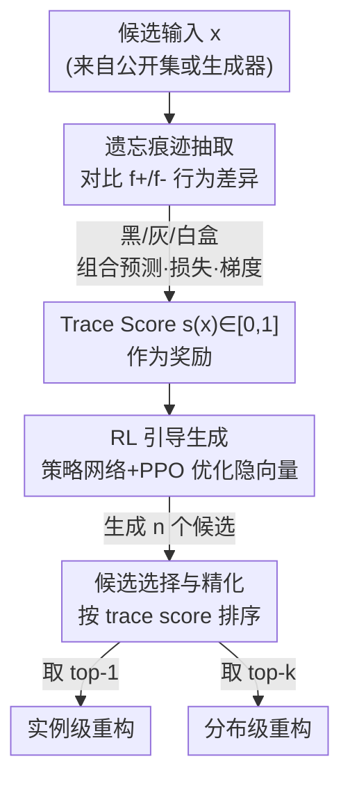

# ReTrace: Reinforcement Learning-Guided Reconstruction Attacks on Machine Unlearning

**会议**: ICLR 2026  
**OpenReview**: [https://openreview.net/forum?id=wKi4Jeqqrb](https://openreview.net/forum?id=wKi4Jeqqrb)  
**代码**: 待确认  
**领域**: AI 安全 / 隐私攻击 / 机器遗忘  
**关键词**: 机器遗忘, 重构攻击, 强化学习, 遗忘痕迹, 隐私泄露

## 一句话总结
把"被遗忘数据"的恢复建模成强化学习问题——用遗忘前后两个模型之间残留的差异（trace）当作奖励信号，引导一个生成器在输入空间里搜索高奖励区域，从而在 ResNet 和 DistilBERT 等大模型上重构出本该被删除的样本与类别分布，实例级恢复成功率最高达 73.1%。

## 研究背景与动机

**领域现状**：为满足 GDPR "被遗忘权" 的合规需求，机器遗忘（machine unlearning）成了刚需。精确遗忘（exact unlearning）通过在剔除目标样本后的数据集上从头重训来保证删除，但对今天的大模型代价过高；于是主流转向近似遗忘（approximate unlearning），直接改动已训模型的参数/梯度来抹掉特定数据的影响，在效率和遗忘强度之间取得折中。

**现有痛点**：近似遗忘几乎不可能"干净地"抹掉数据——它会在模型里留下可辨认的残留痕迹（residual traces）。更糟的是，遗忘动作本身可能起到反效果：它不是把数据藏起来，反而像在大海里高亮了那根针，让攻击者更容易定位敏感记录。这在医疗等场景后果严重：哪怕病人申请删除病历影像，重构攻击仍可能还原出可识别的细节。

**核心矛盾**：已有的针对遗忘的重构攻击都受限于访问条件或模型规模。一类基于闭式参数分析（如 HRec），能精确恢复但只适用于线性/简单模型；另一类基于更新差异（如 UIA），需要白盒梯度，且只能做实例级恢复，多次删除时无法泛化。没有一个框架能同时做到：利用深层模型里的遗忘痕迹、支持多种访问级别、并兼顾实例级与分布级恢复。

**本文目标**：构造一个通用的重构攻击框架，把"遗忘痕迹 → 被删数据"的恢复在大规模深度模型（CNN + Transformer）上跑通，并且同时给出实例级（恢复单个样本）和分布级（逼近被删类别的整体分布）两种结果。

**切入角度**：关键观察是——遗忘前模型 $f^+$ 与遗忘后模型 $f^-$ 在被删数据上的行为差异，本身就是一个可量化、可优化的信号。如果把这个差异当作"奖励"，那么"找回被删数据"就等价于"在输入空间里寻找让奖励最大的点"，这正是强化学习擅长的探索问题。

**核心 idea**：用 RL 把残留痕迹当奖励，引导生成器主动探索输入空间、收敛到被遗忘数据的分布——即"以痕迹为奖励、以生成器为策略，把数据重构变成策略优化"。

## 方法详解

### 整体框架

ReTrace 假设攻击者同时拿到了遗忘前后的两个模型 $f^+$、$f^-$（在模型版本管理、API 更新等真实场景中常见），但拿不到原始训练集 $D$ 或被删集 $D_{del}$，只能用一个分布相近的公开辅助集 $D_{pub}$ 来初始化候选输入。整条管线分三步串行：先**抽取遗忘痕迹**，把两个模型在某个候选输入上的行为差异量化成一个 $[0,1]$ 的 trace score；再用 **RL 引导生成**，让策略网络在生成器的隐空间里搜索，把 trace score 当奖励、用 PPO 不断把隐向量推向高分区域；最后做**候选选择与精化**，根据 trace score 既可挑出单个最佳样本（实例级），也可取 top-k 逼近整体分布（分布级）。

整个攻击的"环境"就是冻结的 $(f^+, f^-)$ 这对模型，"动作"是改写隐向量、"状态"是生成图像，"奖励"则来自痕迹。ReTrace 还把访问级别拆成黑/灰/白盒三档，访问越深、可用的痕迹信号越丰富。

### 关键设计

**1. 多级遗忘痕迹抽取：把"删过的痕迹"量化成可优化的奖励**

这一步直接对应"残留痕迹可被利用"的核心洞察。攻击者无法直接看到被删数据，但能用候选输入 $x$ 去探查两个模型的行为差。ReTrace 按访问级别从浅到深定义了三种痕迹：黑盒下用预测向量的 $\ell_2$ 距离 $\delta_{pred}(x)=\|f^+(x)-f^-(x)\|_2$；灰盒下追加损失差 $\delta_{loss}(x)=|\ell(f^+(x),\hat y)-\ell(f^-(x),\hat y)|$，其中伪标签 $\hat y$ 取自 $f^+$；白盒下再加输入梯度的余弦距离 $\delta_{grad}(x)=1-\cos(\nabla_x\ell(f^+),\nabla_x\ell(f^-))$。组合后得到痕迹向量 $T(x)$，并加权聚合成标量奖励

$$r(x_i)=-\alpha\,\delta_{pred}(x_i)-\beta\,\delta_{loss}(x_i)-\gamma\,\delta_{grad}(x_i),$$

再经 min-max 归一化成 $s(x_i)\in[0,1]$。trace score 越高，说明 $x_i$ 越靠近被遗忘数据的流形。之所以有效，是因为遗忘只在被删样本附近显著改变了模型行为——在这些点上 $f^+$ 与 $f^-$ 的差异天然被放大，痕迹因此成了指向被删数据的"导航信号"，而访问越深、信号越锐利（白盒梯度给出最清晰、最稳定的区分）。

**2. RL 引导的隐空间生成：用 PPO 把生成器推向高痕迹区域**

痛点在于：trace score 只是个打分器，并不会自己生成被删样本；需要一个机制主动去"找"那些高分输入。ReTrace 把这变成策略优化——从先验 $z_0\sim\mathcal N(0,I)$ 出发，策略网络 $\pi_\theta$（一个 MLP）把它映射成新隐向量 $z_1=\pi_\theta(z_0)$，送入冻结的 DCGAN/GPT-2 生成器 $G$ 合成样本 $x_1=G(z_1)$，环境据此返回奖励 $s(x_1)$。优化用 actor-critic 版的 PPO：不直接用绝对奖励，而是用优势 $A_{i+1}=s(x_i)-V_\psi(z_i)$，其中 critic $V_\psi$ 估计当前隐状态的期望痕迹分，充当可学习基线稳定训练。裁剪后的代理目标为

$$L_{PPO}(\theta)=\mathbb E_{z_i}\big[\min(r_\theta(z_i)A_{i+1},\ \mathrm{clip}(r_\theta(z_i),1-\epsilon,1+\epsilon)A_{i+1})\big].$$

正优势意味着这一步把生成结果推得更接近被删流形、该方向应继续；随着训练推进 $s(x_i)$ 与 $V_\psi$ 同步上升、优势趋近 0 表示收敛。和此前需要白盒梯度反推、或只能做闭式分析的方法相比，这套 RL 框架对生成器和模型都是黑箱友好的——它只需要能查询奖励，因此能扩展到 ResNet、DistilBERT 这类复杂架构。

**3. 双级候选选择：同一套生成结果同时支持实例级与分布级恢复**

策略训练好后，ReTrace 用 $n$ 个独立初始隐向量生成 $n$ 个候选 $\{d_i\}$，逐个算 trace score。实例级时取最高分候选 $\hat d=\arg\max_{d_i} s(d_i)$ 作为某个被删样本的最佳近似；分布级时按分数排序取 top-k 集合 $\hat D_{forget}=\{d_i\mid i\in I_k\}$ 去逼近 $P_{del}$。这一设计的巧妙处在于"一鱼两吃"：同一份生成 + 同一个打分器，仅靠选取策略不同就覆盖了两种攻击目标，避免为分布级单独训练。理论上作者还证明了 RL 目标收敛到指数倾斜分布 $\pi^\star(x)\propto p_0(x)\exp(s(x)/\tau)$，它会放大高痕迹区域的概率质量，从而保证：候选数足够多时实例级以高概率命中（覆盖界 $1-(1-p^\star)^k$），且重构经验分布在偏差-方差分解下收敛到 $P_{del}$（偏差由痕迹可分性 margin $\Delta$ 控制，方差随 $k$ 衰减）。

### 损失函数 / 训练策略

奖励为归一化痕迹分 $s(x)\in[0,1]$；策略优化用 PPO 裁剪目标，裁剪系数 $\epsilon$ 通常取 0.1 或 0.2；权重 $\alpha,\beta,\gamma\ge 0$ 控制三类痕迹的相对贡献。整体复杂度 $O(I\cdot N\cdot C_f+N\log N)$，主要由 $I$ 轮 RL 迭代、每轮 $N$ 个候选的生成与痕迹评估主导（$C_f$ 为单次前/反向传播代价），实际运行开销与标准对抗训练或 RL 生成管线相当。

## 实验关键数据

### 主实验

数据集：CIFAR-100、Food-101、PathMNIST，分类器为 ResNet-18，遗忘按类进行（class 0 为被遗忘类），同时测精确遗忘与近似遗忘；图像生成器用 DCGAN，文本任务用 GPT-2 生成器 + DistilBERT 被遗忘模型。实例级用 MSE / 成功率 SR / 余弦相似度 CS 评估，分布级用 FID / KL 评估。

实例级恢复（白盒、近似遗忘列，越深的访问效果越好）：

| 数据集 | 访问级别 | MSE↓ | SR↑ | CS↑ | 类内基准 MSE |
|--------|---------|------|-----|-----|------|
| CIFAR-100 | 黑盒 | 0.24 | 55.9% | 0.46 | 0.16 |
| CIFAR-100 | 白盒 | 0.17 | 73.1% | 0.50 | 0.16 |
| Food-101 | 白盒 | 0.16 | 65.3% | 0.49 | 0.13 |
| PathMNIST | 白盒 | 0.19 | 59.7% | 0.33 | 0.13 |

与两个 SOTA baseline（UIA、HRec，均只支持白盒）对比，近似遗忘场景：

| 数据集 | 指标 | UIA | HRec | ReTrace |
|--------|------|-----|------|---------|
| CIFAR-100 | MSE↓ / SR↑ | 0.33 / 59.5% | 0.32 / 43.0% | **0.17 / 73.1%** |
| Food-101 | MSE↓ / SR↑ | 0.31 / 41.4% | 0.45 / 30.2% | **0.16 / 65.3%** |
| PathMNIST | MSE↓ / SR↑ | 0.39 / 37.4% | 0.44 / 37.1% | **0.19 / 59.7%** |

分布级（CIFAR-100，近似遗忘）FID 从黑盒 125.3 降到白盒 99.1、KL 降到 2.53，全面优于两个 baseline。

### 消融实验

| 配置 / 维度 | 关键指标 | 说明 |
|------|---------|------|
| 不同被遗忘类（Aquarium fish/Bed/Bridge） | SR 59%→约 70%、MSE 0.16–0.23 | 换类别仍稳定，验证鲁棒性 |
| 访问级别 黑→灰→白 | trace 信号逐级增强 | 梯度级痕迹分离度最高 |
| 精确 vs 近似遗忘 | 近似遗忘指标普遍更好 | 近似遗忘留下的痕迹更易被利用 |
| 文本任务（AG News，DistilBERT） | BLEU 2.8→4.6、MMD 0.46→0.32 | 跨模态泛化，结构化文本也能重构 |

### 关键发现

- **访问越深、痕迹越锐**：黑盒仅靠预测差异就已让被删类落在分数高分位，灰盒加损失差、白盒加梯度差，逐级把"被遗忘 vs 保留"的对比拉开，白盒分离最清晰。
- **近似遗忘比精确遗忘更脆弱**：近似遗忘只改参数/梯度、抹得不彻底，留下的残差更易被 RL 捕捉，因此 ReTrace 在近似遗忘下反而恢复得更好（CIFAR-100 SR 从精确的 62.4% 升到 73.1%）。
- **跨模态可迁移**：在文本遗忘这一更难的高维结构化任务上，BLEU 相比黑盒 baseline 提升近 100%，且 DistilBERT 是迄今被攻击的最大规模架构，说明该范式不限于图像。

## 亮点与洞察

- **把"删数据留下的副作用"反转成攻击杠杆**：遗忘本意是抹除信息，ReTrace 却指出"遗忘前后模型差异"本身就是高信噪比的定位信号——这是最让人"啊哈"的视角，等于说越认真删、越留痕。
- **奖励即痕迹、策略即生成器**：把重构问题套进 RL，省去了对白盒梯度反推的依赖，使攻击对模型/生成器都更黑箱友好，是能扩展到大模型的关键。
- **理论与实证闭环**：指数倾斜分布 $\pi^\star\propto p_0 e^{s/\tau}$ 给出了"为什么会收敛到被删流形"的解释，并配实例级覆盖界与分布级偏差-方差分解，让攻击不只是经验有效。
- **可迁移的 trick**：多级痕迹（预测/损失/梯度）按访问深度叠加的设计，可直接搬到成员推断、模型反演等其他隐私攻击里做"访问自适应"的信号工程。

## 局限与展望

- 威胁模型要求攻击者同时持有 $f^+$ 与 $f^-$ 两个模型，并能拿到分布相近的公开辅助集——在不暴露版本历史的部署下未必成立。
- 实例级 MSE 仍高于类内基准（如 CIFAR-100 0.17 vs 0.16），即重构是"近似"而非像素级精确；文本任务 BLEU 绝对值仍偏低（约 4），结构化重构质量有限。
- 评测集中在按类遗忘（class-wise）与 class 0 等设定，多样本/交叉删除、更大规模 LLM 上的可扩展性尚未充分验证。
- 防御侧反思：结果强烈暗示需要"可证明私有"的遗忘机制，未来可研究如何在遗忘时主动消除或扰乱这些可被奖励化的残差痕迹。

## 相关工作与启发

- **vs HRec（闭式参数分析）**：HRec 靠遗忘前后参数差闭式求解，能精确恢复但只在线性/简单模型成立；ReTrace 用 RL 探索输入空间，把攻击带到 ResNet/DistilBERT 这类深层非线性模型，代价是恢复为近似而非精确。
- **vs UIA（更新/梯度反推）**：UIA 需要白盒梯度且只能做实例级恢复、多次删除时失效；ReTrace 支持黑/灰/白盒三档访问，并用同一套生成同时给出实例级与分布级结果，泛化性更强。
- **vs 成员推断攻击（MIA）**：MIA 常用于评估遗忘是否彻底、只判定"某样本是否被记住"；ReTrace 更进一步，直接把被删数据重构出来，威胁等级更高，也说明"通过 MIA 评估遗忘"并不足以保证隐私。

## 评分
- 新颖性: ⭐⭐⭐⭐⭐ 首个把遗忘数据重构形式化为 RL、并配指数倾斜分布理论的框架，视角新颖。
- 实验充分度: ⭐⭐⭐⭐ 三数据集 + 三访问级别 + 精确/近似遗忘 + 跨模态文本，较全面，但 LLM 规模与多删除场景仍待扩展。
- 写作质量: ⭐⭐⭐⭐ 理论与实证衔接清晰，痕迹定义和奖励设计交代到位。
- 价值: ⭐⭐⭐⭐⭐ 揭示了机器遗忘的关键隐私漏洞，对"被遗忘权"合规与可证明私有遗忘机制有直接警示意义。

<!-- RELATED:START -->

## 相关论文

- [\[ICLR 2026\] Label Smoothing Improves Machine Unlearning](label_smoothing_improves_machine_unlearning.md)
- [\[ICLR 2026\] No Prior, No Leakage: Revisiting Reconstruction Attacks in Trained Neural Networks](no_prior_no_leakage_revisiting_reconstruction_attacks_in_trained_neural_networks.md)
- [\[ICLR 2026\] Beware Untrusted Simulators -- Reward-Free Backdoor Attacks in Reinforcement Learning](beware_untrusted_simulators_--_reward-free_backdoor_attacks_in_reinforcement_lea.md)
- [\[ICLR 2026\] Machine Unlearning under Retain–Forget Entanglement](machine_unlearning_under_retainforget_entanglement.md)
- [\[ICLR 2026\] Distributional Machine Unlearning via Selective Data Removal](distributional_machine_unlearning_via_selective_data_removal.md)

<!-- RELATED:END -->
