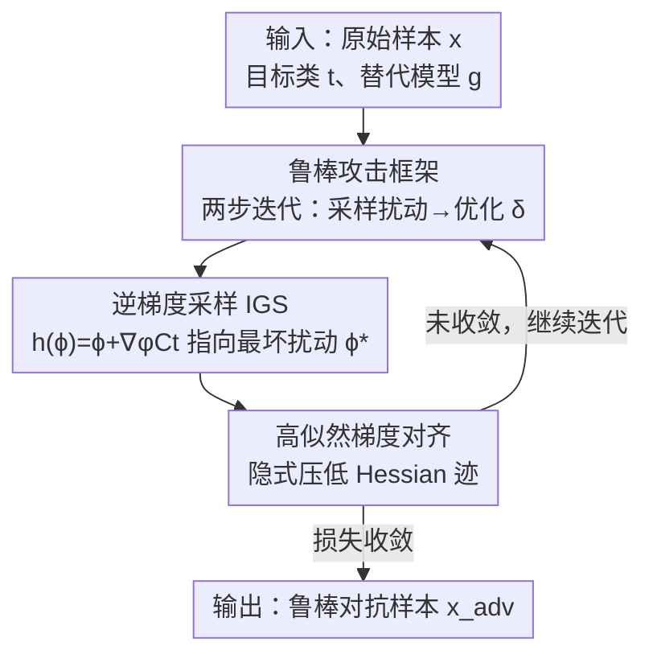

# Robust Adversarial Attacks Against Unknown Disturbances via Inverse Gradient Sample

**会议**: ICLR 2026  
**OpenReview**: [https://openreview.net/forum?id=WhFS8mxWJh](https://openreview.net/forum?id=WhFS8mxWJh)  
**代码**: https://github.com/nimingck/IGSA  
**领域**: AI安全 / 对抗攻击  
**关键词**: 对抗样本, 鲁棒攻击, 逆梯度采样, 迁移性, 未知扰动

## 一句话总结
提出 IGSA（Inverse Gradient Sample-based Attack），用"逆梯度采样"主动找到对抗样本邻域内最具破坏性的扰动方向，再沿该方向做扰动引导优化，从而生成在各种**未知扰动**（模糊、JPEG、旋转、透视等）下仍能保持攻击成功率的鲁棒对抗样本，理论与实验都显著超过 EOT 等现有方法。

## 研究背景与动机

**领域现状**：对抗攻击在白盒、黑盒（迁移）场景里都已经能把深度网络打到接近 100% 的攻击成功率（ASR）。一个"真正有威胁"的对抗样本需要同时满足三点：可迁移性（黑盒有效）、隐蔽性（躲过检测）、以及鲁棒性（在各种扰动下仍然有效）。

**现有痛点**：现有迁移攻击极其"脆"——对抗样本一旦在送进目标模型前经历哪怕很轻微的扰动（二次采集、客户端预处理、内置防御如 JPEG 压缩 / 缩放 / 随机变换），攻击效果就大幅崩塌，尤其是定向攻击。论文 Table 1 里 PGD、MI-FGSM 这类经典方法在旋转、组合变换下 ASR 直接掉到个位数甚至 0。

**核心矛盾**：要鲁棒，就得在训练对抗样本时模拟各种扰动并优化。主流做法是 EOT（Expectation over Transformation）——从一个固定分布里**随机采样**扰动求期望损失。但随机采样有三个本质问题：(i) **采样覆盖不足**，蒙特卡洛样本数有限，对扰动空间覆盖差，对未见扰动泛化糟糕；(ii) **分布失配**，训练时假设的扰动分布和现实扰动分布不一致，攻击就失效；(iii) **迁移性未显式建模**，黑盒下还要保证跨模型可迁移。

**切入角度**：作者把"对抗鲁棒性"重新形式化成"设计一个映射函数 $h(\phi, x+\delta)$ 把先验扰动 $\phi$ 映射到最具破坏性的扰动"这一问题。关键观察是：与其随机撒点希望撞上坏扰动，不如**用梯度主动指向"最坏方向"**——即邻域内让损失最大的扰动 $\phi^* = \arg\max_{\|\phi\|<r} C_t(x+\delta+\phi)$。

**核心 idea**：用"逆梯度采样"（沿 $\nabla_\phi C_t$ 走一步）逼近最具破坏性扰动 $\phi^*$，取代 EOT 的随机采样；理论证明同等误差下所需采样数比 EOT 少约 $10^8$ 倍，同时这一过程隐式压低损失曲面的 Hessian 迹，既提升数据分布似然（鲁棒）又平滑损失曲面（可迁移）。

## 方法详解

### 整体框架

IGSA 把"造一个鲁棒对抗样本"建模成一个**两步迭代**过程：给定原始样本 $x$、目标类 $t$ 和替代模型 $g$，反复地 (1) 在当前对抗样本 $x+\delta$ 的邻域里采样扰动并用逆梯度把它推向"最坏"，(2) 让对抗样本在这个最坏扰动下仍被分到目标类，从而更新 $\delta$。整个优化目标是最小化扰动分布上的期望损失 $\min_\delta \mathbb{E}_{\phi\sim B}[C_t(x+\delta+h(\phi,x+\delta))]$，其中映射函数被设计为 $h(\phi,x+\delta)=\phi+\nabla_\phi C_t(x+\delta+\phi)$。

与 EOT 从固定分布随机取 $\eta$ 不同，这里的 $h$ 能同时适配当前对抗样本和替代模型，为每个样本生成专属的"最具破坏性扰动"。理论上还证明这一更新规则隐式最小化 $C_t$ 的 Hessian 迹，使对抗样本在自然数据分布 $P_D$ 下保持高似然（更鲁棒）并让损失曲面更平滑（更可迁移）。

### 关键设计

**1. 鲁棒攻击框架：把"抗扰动"重写成映射函数设计问题**

针对"现有攻击对未知扰动一碰就碎"的痛点，作者先搭了一个通用框架：第一步从先验分布 $B$ 采样一批初始扰动 $\phi$，经映射函数 $h(\phi,x+\delta)$ 转成实际加到对抗样本上的扰动；第二步把扰动后的样本 $x+\delta+h(\phi,x+\delta)$ 喂给替代模型 $g$，用交叉熵 $C_t$ 度量是否被分到目标类 $t$，并对扰动分布求期望后最小化 $\min_\delta \mathbb{E}_{\phi\sim B}[C_t(\cdot)]$。借助 LOTUS 定理，$\mathbb{E}_{\phi\sim B}[C_t(x+\delta+h(\phi,x+\delta))]=\mathbb{E}_{\eta\sim P}[C_t(x+\delta+\eta)]$，于是"抵抗各种扰动"被等价转化为"设计一个好的映射函数 $h$"。

这个框架的价值在于它是**即插即用**的：可以套到任何已有攻击上（论文实验里就把 IGSA 接到 DIM、DTA、SMI-FGRM、ILPD 上）。它也把前面那三个挑战（采样覆盖、分布失配、迁移性）清晰地归结到 $h$ 的设计上，为后面 IGS 出场铺路。

**2. 逆梯度采样 IGS：用梯度主动撞向"最坏扰动"，省下 $10^8$ 倍采样**

这是论文的核心，直接打"采样覆盖不足"的痛点。EOT 把 $h(\phi,x+\delta)=\phi$，即直接用随机采样的扰动；但鲁棒性本质上取决于训练用的扰动集合 $\{h(\phi_i,x+\delta)\}$ 能否逼近真正最具破坏性的扰动 $\phi^*$。IGS 把映射定义成 $h(\phi,x+\delta)=\phi+\nabla_\phi C_t(x+\delta+\phi)$——在随机扰动 $\phi$ 的基础上**再沿损失对扰动的梯度走一步**，把采样点主动拉向损失更大的方向（即更接近 $\phi^*$）。对应迭代式为
$$\delta_{i+1}=\delta_i-\alpha\cdot\nabla_\delta\Big(\tfrac{1}{N}\textstyle\sum_{j=1}^N C_t(x+\delta_i+h(\phi_j,x+\delta))\Big).$$

为什么有效，论文给了硬核理论：定理 1 证明 EOT 随机采样的期望误差随采样数 $n$ 以 $n^{-1/m}$ 幂律衰减（$m$ 是输入维度），要把误差减半需把采样数乘 $2^m$，高维下几乎不可承受；定理 2 进一步推出 IGS 的误差是 EOT 的 $(1-\gamma)$ 倍，从而达到同等误差所需采样比 $n_\text{EOT}/n_\text{IGS}=(1-\gamma)^{-m}$。在 ImageNet（$m=256\times256\times3$、$\gamma\approx10^{-4}$）上这个比值约 $3.5\times10^8$——也就是 IGS 用极少采样就能捕捉最坏扰动，从根上缓解了覆盖不足。

**3. 高似然梯度对齐：隐式压低 Hessian 迹，同时换来鲁棒与迁移**

这一设计同时回应"分布失配"和"迁移性"两个挑战。作者先定义**鲁棒边界** $K_S^\tau$（改变模型预测所需的最小扰动量）做诊断，观察到干净样本的 $K_S^\tau$ 一致大于对抗样本，于是猜想：在自然数据分布 $P_D$ 下似然越高的样本越鲁棒。但 $P_D(x_\text{adv})$ 不可直接计算，作者转而通过梯度对齐来间接提升似然——定理 3 证明 $\nabla_\delta \mathbb{E}[(\nabla_\delta C_t)^T\nabla_\delta P_D]=-\nabla_\delta\mathbb{E}[\text{tr}(H[C_t])]$，即**最小化 $C_t$ 的 Hessian 迹**就能让替代模型梯度 $\nabla_\delta C_t$ 与数据分布梯度 $\nabla_\delta P_D$ 对齐，从而抬高对抗样本在 $P_D$ 下的似然。

关键是，IGS 的迭代规则**天然就在做这件事**：定理 4 展开后得 $\nabla_\delta\mathbb{E}_\phi[C_t(x+\delta+\phi+\nabla_\phi C_t)]=\nabla_\delta C_t+\|\nabla_\delta C_t\|^2+\tfrac{\sigma^2}{2}\nabla_\delta\text{tr}(H[C_t])+O(\sigma^4)$，说明 IGS 在优化过程中隐式压低了 $\text{tr}(H[C_t])$（提升 $P_D$ 似然 → 鲁棒）并减小 $\|\nabla_\delta C_t\|^2$（损失曲面更平滑）。而损失曲面平滑正是 Ge et al. (2023) 证明能显著增强迁移性的性质——于是同一个机制一箭双雕。

### 损失函数 / 训练策略

落地见 Algorithm 1，有三个实用技巧：(1) **采样分布**用高斯 $\phi\sim N(0,\sigma^2)$，收敛更快更稳；(2) **高效梯度估计**——为避开式中的二阶导，用一阶近似 $\nabla_\delta\mathbb{E}_\phi[C_t(x+\delta+\phi+\nabla_\phi C_t)]\approx\mathbb{E}_{\phi\sim N(0,\sigma^2)}[C_t(\cdot)\cdot\nabla_\delta\log N(x+\delta+\phi;x+\delta,\sigma^2)]$，把二阶计算转成对数似然加权的一阶项；(3) **梯度幅度控制**——用 sign-based 更新 $x_\text{adv}=x_\text{adv}-\alpha\cdot\text{sign}(d_\text{sum})$，并在损失里对 $\delta$ 加 $\ell_2$ 约束项 $\lambda\cdot|\delta|$ 压低扰动幅度。每轮把 $\delta$ clamp 到 $[-\epsilon,\epsilon]$，直到损失收敛。主要超参：采样点 $N=20$、$\alpha=1.6/255$、$\epsilon$ 在 ImageNet 取 $16/255$、CIFAR-10/CelebA 取 $8/255$、$\lambda=0.1$（ImageNet）。

## 实验关键数据

### 主实验

ImageNet 上对 VGG19 / ResNet34 / ViT 做定向攻击，在加性扰动（高斯模糊 GSB、JPEG）与非加性扰动（旋转 RT、组合变换 CB）下比 ASR：

| 攻击方法 | VGG19-RT | ResNet34-CB | ViT-Avg(GSB) | 平均耗时(s) |
|----------|----------|-------------|--------------|-------------|
| PGD | 43.8 | 0.0 | 9.3 | 0.025 |
| MI-FGSM | 72.9 | 0.0 | 67.4 | 0.025 |
| DIM | 66.7 | 12.5 | 89.3 | 0.020 |
| BSR | 83.3 | 8.3 | 71.7 | 0.203 |
| PGD+EOT | 79.2 | 22.9 | 87.6 | 0.461 |
| **IGSA (ours)** | **96.7** | **50.8** | **92.2** | 0.423 |

可以看到最难的非加性组合变换 CB 上，其他方法基本崩到个位数，IGSA 在 ResNet34 上仍有 50.8%，全面领先。

针对**防御模型**（ARES 2.0 对抗训练的 ResNet50 / ViT）的攻击，定向（tar）场景差距最明显：

| 攻击方法 | ResNet50-tar | ViT-untar | ViT-tar |
|----------|--------------|-----------|---------|
| TIM | 18.60 | 62.52 | 2.90 |
| BSR | 18.20 | 68.43 | 2.90 |
| GRA | 16.10 | 72.45 | 4.90 |
| **IGSA (ours)** | **27.30** | **90.94** | **23.90** |

其他方法在防御模型的定向攻击下几乎全军覆没（<19%），IGSA 把 ViT 定向 ASR 拉到 23.9%。

### 消融实验

| 配置 / 超参 | 关键指标 | 说明 |
|------------|---------|------|
| 采样点 $N=5$ | ASR 94.4% | 邻域信息不足 |
| 采样点 $N=25$ | ASR 100% | 采样越多覆盖越好 |
| $\lambda=0.02$ | ASR 100% | $\ell_2$ 约束弱 |
| $\lambda=0.30$ | ASR 5.56% | 约束过强压垮攻击 |
| $\alpha=1.6/255$ | ASR 99% | 步长最优区间峰值 |
| IGS vs EOT (SNR=10) | IGS 5 次采样 >80% / EOT 50 次仅 ~60% | IGS 效率与效果双赢 |

### 关键发现
- **IGS 是最大功臣**：在强扰动（SNR=10）下，IGS 仅 5 次采样就破 80% ASR，EOT 用 50 次采样才到 ~60%，直接验证了"逆梯度主动找最坏扰动"远胜随机采样。
- **超参敏感性**：迭代数 >50 后 ASR 稳定 >90%；采样点 $N$ 从 5→25 把 ASR 从 94.4% 推到 100%；$\lambda$ 是双刃剑，太大（0.3）会把扰动压到攻不动（ASR 5.56%），$\mu$ 影响相对最小（96%~98.7%）。
- **即插即用增益**：把 IGSA 接到 DIM/DTA/SMI-FGRM/ILPD 上，黑盒 ResNet34 上 ASR 分别 +13.0% / +16.3% / +20.9% / +3.0%，ViT 上 +19.0% / +12.4% / +22.9% / +3.0%，说明框架可叠加在现有迁移攻击之上。

## 亮点与洞察
- **"逆梯度采样"把随机撒点变成定向爆破**：用一步 $\nabla_\phi C_t$ 把采样点拉向最坏扰动，这个小改动带来理论上 $10^8$ 量级的采样效率提升，是非常漂亮的"用梯度信息换采样数"的思路。
- **一个机制同时拿下鲁棒与迁移**：通过 Hessian 迹这个桥梁，把"提升数据分布似然（鲁棒）"和"平滑损失曲面（迁移）"统一到 IGS 的隐式正则上，避免了两个目标各自加 loss 互相打架。
- **诊断指标 $K_S^\tau$（鲁棒边界）可迁移**：用"改变预测所需最小扰动量"来量化样本鲁棒性，并据此提出"高似然=高鲁棒"的猜想，这个视角可以借鉴到其他防御/检测研究里。

## 局限与展望
- 整套理论保证（定理 1-4）建立在凸性 / Lipschitz / 邻域内唯一极值等假设上，非凸情形只在附录给了扩展，真实深度网络损失曲面是否满足、$\gamma\approx10^{-4}$ 这种数量级估计的稳健性值得进一步检验。
- $10^8$ 倍采样效率是理论估计的上界，实际墙钟时间 IGSA（0.423s）与 PGD+EOT（0.461s）相近，并非真的快 $10^8$ 倍——理论增益主要体现在"同等采样下覆盖更好"。
- 作为更强攻击，本质上也是双刃剑：它能打穿对抗训练防御，反过来也提示防御方需要针对"最坏扰动方向"重新设计，论文未深入讨论对应防御。

## 相关工作与启发
- **vs EOT (Athalye et al. 2018)**: EOT 从固定分布随机采样扰动求期望，IGSA 改为逆梯度主动逼近最坏扰动 $\phi^*$；区别在"被动覆盖 vs 主动指向"，IGSA 在采样效率（理论 $10^8$ 倍）和未知扰动鲁棒性上全面占优。
- **vs PGN / 平滑类迁移攻击 (Ge et al. 2023)**: PGN 等显式追求平坦损失区域来增强迁移，IGSA 则证明自己的 IGS 迭代隐式减小 $\|\nabla_\delta C_t\|^2$ 自动平滑曲面，且同时兼顾鲁棒性，是"顺带得到"而非单独优化。
- **vs DIM / DTA / SMI-FGRM 等输入变换迁移攻击**: 这些是启发式增强、对扰动类型敏感，IGSA 是带理论保证的通用框架，且能**叠加**在它们之上进一步涨点。

## 评分
- 新颖性: ⭐⭐⭐⭐⭐ 逆梯度采样替代随机采样，并用 Hessian 迹统一鲁棒与迁移，理论与方法都很新。
- 实验充分度: ⭐⭐⭐⭐ 覆盖分类+人脸、白盒/黑盒/防御模型、多种扰动与即插即用增益，但墙钟时间与理论增益的落差可再说明。
- 写作质量: ⭐⭐⭐⭐ 四大挑战→四个定理→算法的逻辑闭环清晰，理论部分稍密。
- 价值: ⭐⭐⭐⭐⭐ 提供了即插即用、有理论保证的鲁棒攻击框架，对 AI 安全攻防双方都有参考价值。

<!-- RELATED:START -->

## 相关论文

- [\[ICLR 2026\] Robust Spiking Neural Networks Against Adversarial Attacks](robust_spiking_neural_networks_against_adversarial_attacks.md)
- [\[ICLR 2026\] Reliable Poisoned Sample Detection against Backdoor Attacks Enhanced by Sharpness-Aware Minimization](reliable_poisoned_sample_detection_against_backdoor_attacks_enhanced_by_sharpnes.md)
- [\[ICLR 2026\] Sample-Efficient Distributionally Robust Multi-Agent Reinforcement Learning via Online Interaction](sample-efficient_distributionally_robust_multi-agent_reinforcement_learning_via_.md)
- [\[ICLR 2026\] Defending against Backdoor Attacks via Module Switching](defending_against_backdoor_attacks_via_module_switching.md)
- [\[ICLR 2026\] Protection against Source Inference Attacks in Federated Learning](protection_against_source_inference_attacks_in_federated_learning.md)

<!-- RELATED:END -->
