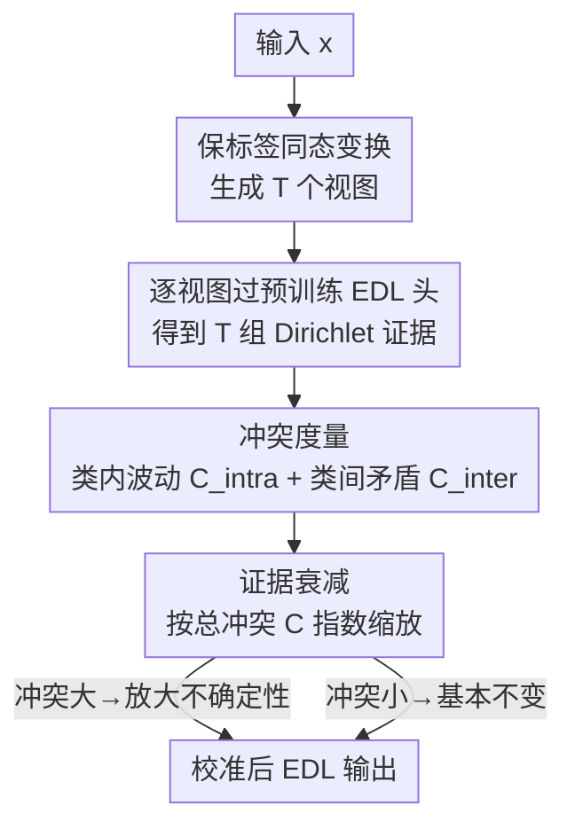

# Robust Adversarial Quantification via Conflict-Aware Evidential Deep Learning

**会议**: ICLR 2026  
**OpenReview**: [https://openreview.net/forum?id=27oJibuygA](https://openreview.net/forum?id=27oJibuygA)  
**代码**: https://github.com/team-daniel/cedl  
**领域**: AI安全 / 不确定性量化 / 对抗鲁棒性  
**关键词**: 证据深度学习, 不确定性量化, 冲突感知, OOD检测, 对抗鲁棒性

## 一句话总结
针对证据深度学习（EDL）在对抗扰动下会"自信地犯错"的痛点，本文提出一个无需重训的后处理方法 C-EDL：对每个输入生成多个保标签的变换视图，量化这些视图在证据空间里的"冲突"，并据此按需衰减证据来放大不确定性，从而把 OOD 数据的覆盖率最多降 ≈55%、对抗数据覆盖率最多降 ≈90%，同时几乎不损失 ID 精度与推理效率。

## 研究背景与动机

**领域现状**：在医疗、自动驾驶这类高风险场景里，模型必须"知道自己什么时候不可信"，因此不确定性量化（UQ）是核心需求。贝叶斯神经网络、变分推断、深度集成、MC Dropout 等是主流路线，但它们要么计算昂贵，要么需要多次前向，难以部署到边缘设备。证据深度学习（EDL）用一个 Dirichlet 分布来建模类别概率，单次前向就能同时给出认知不确定性（epistemic）和偶然不确定性（aleatoric），因而轻量高效，特别适合实时/资源受限场景下的 OOD 检测。

**现有痛点**：EDL 的命门恰恰是它的"确定性单次前向"。面对对抗扰动输入时，梯度攻击可以把一个 OOD 样本推到模型眼里的"分布内"（ID）区域，让证据强度虚高、不确定性虚低——模型于是**自信地把对抗样本当成正常样本**。一旦做出过度自信的错误，单次前向的 EDL 没有任何"第二视角"来纠偏。后续大量 EDL 改进（I-EDL、H-EDL、R-EDL、DA-EDL 等）主要在改进 OOD 检测，却都没碰"单次确定性前向"这个根，因此对抗鲁棒性依旧脆弱；少数针对对抗的 Smoothed EDL 也只是局部正则，强攻击下仍然过度自信。

**核心矛盾**：EDL 的高效来自"只看一次"，而对抗鲁棒性恰恰需要"多看几眼、看证据稳不稳"。如何在**不放弃单次前向高效性、不重训模型**的前提下，给 EDL 注入"多视角校验"的能力？

**本文目标**：设计一个后处理（post-hoc）模块，挂在任意预训练 EDL 模型之后，做到：(1) 对 OOD 与对抗输入显著提高不确定性；(2) 不损害 ID 精度与 ID 覆盖率；(3) 推理开销可忽略。

**切入角度**：作者借用 Dempster-Shafer 证据理论（DST）的朴素原则——**聚合多个证据来源能得到更可靠的信念**。既然单视角不可靠，就为每个输入主动制造多个"语义等价但像素不同"的视图，看模型在这些视图上给出的证据是否一致；一致说明知识稳固，矛盾则说明知识脆弱，应当上调不确定性。

**核心 idea**：用"保标签变换 + 证据冲突量化 + 按冲突衰减证据"替代单次前向，把视图间的分歧转化为不确定性信号。

## 方法详解

### 整体框架
C-EDL 是挂在预训练 EDL 模型后面的纯推理期模块，全程不改动也不重训原模型。对每个新输入，它做三件事：先用一组保标签的同态变换（metamorphic transformations）把输入变成 $T$ 个语义等价的视图，逐一过同一个 EDL 头得到 $T$ 组 Dirichlet 证据；再用两个互补的冲突度量（类内波动 + 类间矛盾）算出一个总冲突分 $C$；最后用 $C$ 对聚合后的证据做指数衰减——冲突大就大幅削证据、放大不确定性，冲突小就基本保持原样。最终的信念、不确定性质量、期望概率都基于衰减后的证据重算。对 ID 输入，多个视图证据一致、$C$ 接近 0，输出几乎等同原始 EDL；对 OOD/对抗输入，视图间证据互相打架、$C$ 升高，不确定性被放大，从而被阈值拒绝。

### 关键设计

**1. 保标签同态变换生成证据集：用"语义等价的多视角"替代单次前向**

EDL 脆弱的根源是只看一次输入、拿不到第二意见。C-EDL 对输入 $x$ 施加一组同态变换 $\{\tau_1,\dots,\tau_T\}$，每个变换都满足保标签约束 $f^*(\tau_t(x)) = f^*(x)$，即只在像素层面改动、不改变真实类别。每个 $\tau_t(x)$ 独立过同一个预训练 EDL 头，得到一组 Dirichlet 向量 $\alpha^{(t)} = (\alpha^{(t)}_1,\dots,\alpha^{(t)}_K)$，最终汇成证据集 $A = \{\alpha^{(1)},\dots,\alpha^{(T)}\}$。

这一步的妙处在于：变换在输入空间只是小扰动，但因为网络对局部结构敏感，可能在内部特征上引发很大差异。一个真正学到鲁棒决策特征的模型，应该对这些语义等价视图给出**一致**的证据；反之，如果证据在视图间剧烈波动，就暴露了模型知识的脆弱（认知不确定性）。变换强度被刻意控制得很小（见原文 Table 11），使得引入的随机性主要充当"稳定性探针"而非改变语义。这与多视角学习思路相通，但 C-EDL 是纯后处理、单模态、测试时诱导视图，不像 ECML 那样要求多模态输入并为每个视图单独训练证据模型。

**2. 双重冲突度量：类内波动 + 类间矛盾，精确刻画"证据在打架"**

有了证据集，需要把"分歧"量化出来。C-EDL 用两个互补的角度：

类内波动 $C_{\text{intra}}$ 衡量同一个类别的证据在各变换间抖得多厉害，用每个类别 Dirichlet 参数的变异系数（标准差/均值）再按类平均：

$$C_{\text{intra}} = \frac{1}{K}\sum_{k=1}^{K} \frac{\sigma(\{\alpha^{(t)}_k\}_{t=1}^T)}{\mu(\{\alpha^{(t)}_k\}_{t=1}^T) + \epsilon}$$

其中 $\epsilon$ 是防止除零的小正数（也用于证明 $C_{\text{intra}}$ 的有界性与连续性）。模型若对同一类别在不同视图上给出忽高忽低的信念，$C_{\text{intra}}$ 就会变大。

类间矛盾 $C_{\text{inter}}$ 则捕捉"多个类别同时被高证据支持"的情形（模型在两类之间摇摆），对每个视图计算类别两两之间的竞争程度：

$$C_{\text{inter}} = \frac{1}{T}\sum_{t=1}^{T}\left(1 - \exp\left(-\beta \sum_{k=1}^{K}\sum_{j=k+1}^{K}\left(\frac{\min(\alpha^{(t)}_k,\alpha^{(t)}_j)}{\max(\alpha^{(t)}_k,\alpha^{(t)}_j)} \times \frac{\min(\alpha^{(t)}_k,\alpha^{(t)}_j)}{\sum_{k=1}^{K}\alpha^{(t)}_k}\times 2\right)^2\right)\right)$$

$\beta>0$ 调节惩罚的锐度，乘 2 保证项落在 $[0,1]$。设计上 $C_{\text{inter}}$ 对称、有界，且只在两类**既势均力敌、又都有非平凡证据**时才升高——比值项刻画类别间相对平衡，强度归一化项则压制"所有类证据都很低"造成的虚假冲突。这个精心构造避免了简单公式在"普遍低证据"边缘情形下夸大冲突，同时保持对定理 1 可解析。

**3. 冲突感知的证据衰减：按冲突分缩放证据，按需放大不确定性**

两个度量通过容斥原理合并为单一总冲突分 $C$：

$$C = C_{\text{inter}} + C_{\text{intra}} - C_{\text{inter}}C_{\text{intra}} - \lambda(C_{\text{inter}} - C_{\text{intra}})^2$$

$\lambda \in [0,1]$ 控制对非对称分歧的惩罚。该构造保证 $C \in (0,1]$，当且仅当所有变换都给出集中在单一类别的同一 Dirichlet 参数时 $C \to 0$，并随任一冲突来源单调不减。原文定理 1 进一步给出在 $\lambda \in [0,\tfrac12]$ 时 $C$ 的有界性与单调性保证。

拿到 $C$ 后，先把各视图的 Dirichlet 参数平均聚合 $\bar\alpha_k = \frac{1}{T}\sum_{t=1}^T \alpha^{(t)}_k$，再施加指数衰减：

$$\tilde\alpha_k = \bar\alpha_k \times \exp(-\delta C)$$

$\delta>0$ 是控制调整灵敏度的超参。这个衰减的精巧之处在于：它**只缩放证据的幅度、不改变分布形状**——也就是保留模型最可能的预测类别，但等比例削弱"自信程度"。随后所有 EDL 量都用衰减后的参数重算：

$$\tilde S = \sum_{k=1}^K \tilde\alpha_k,\quad \tilde b_k = \frac{\tilde\alpha_k - 1}{\tilde S},\quad \tilde u = \frac{K}{\tilde S},\quad \mathbb{E}[\tilde p_k] = \frac{\tilde\alpha_k}{\tilde S}$$

冲突高时，Dirichlet 总强度 $\tilde S$ 被压低，不确定性质量 $\tilde u = K/\tilde S$ 随之放大；冲突低时 $\tilde S$ 几乎等于原始强度 $S$，不确定性基本不受影响。这正是 C-EDL 能在 ID 上"装聋作哑"、在 OOD/对抗上"拉响警报"的机制核心。

### 损失函数 / 训练策略
C-EDL 是纯后处理方法，**不引入任何训练损失、不重训原模型**，全部计算发生在推理期。它直接复用预训练 EDL 头的输出，额外开销仅来自 $T$ 次变换的前向，实测推理开销可忽略。主要超参为变换数 $T$、衰减灵敏度 $\delta$、类间惩罚锐度 $\beta$、容斥惩罚 $\lambda$。

## 实验关键数据

### 主实验
在 MNIST、FashionMNIST、KMNIST、EMNIST、CIFAR10/100、SVHN、Oxford Flowers、Deep Weeds、Tiny-ImageNet、CUB 等多个数据集、近/远 OOD 场景、梯度与非梯度攻击下，对比 Posterior Network、EDL、I-EDL、S-EDL、H-EDL、R-EDL、DA-EDL，跑 10 次独立实验。核心指标是覆盖率（coverage，固定阈值下被接受的比例，越低越好对 OOD/对抗而言）与 AUROC。所有方法 ID 精度都保持在 95-99% 接近天花板，说明 UQ 改进没有牺牲分类性能。

| 数据集对 | 指标 | EDL | C-EDL (Meta) | 改善 |
|--------|------|------|----------|------|
| MNIST→FashionMNIST | 对抗覆盖率 ↓ | 52.21% | 15.51% | 大幅降低 |
| MNIST→KMNIST | 对抗覆盖率 ↓ | 20.88% | 3.01% | ~7倍 |
| MNIST→EMNIST* | 对抗覆盖率 ↓ | 7.81% | 1.41% | ~5倍 |
| CIFAR10→SVHN | 对抗覆盖率 ↓ | 20.00% | 1.25% | ~16倍 |
| CIFAR10→CIFAR100* | 对抗覆盖率 ↓ | 14.02% | 3.17% | ~4倍 |
| CIFAR10→SVHN | OOD 覆盖率 ↓ | 10.91% | 4.69% | 显著降低 |

（*为近 OOD；对抗攻击为 L2PGD）C-EDL 在 ID 覆盖率上只有边际下降（如 MNIST→FashionMNIST 从 96.61% 到 94.18%），却换来 OOD/对抗覆盖率的成倍下降，trade-off 明显优于所有基线。

### 消融实验
作者设计 EDL++（只做变换聚合、去掉冲突调整）与 MC 版本（用 MC Dropout 替代同态变换）来拆解各组件贡献：

| 配置 | CIFAR10→SVHN OOD Cov ↓ | CIFAR10→SVHN Adv Cov ↓ | 说明 |
|------|------|------|------|
| EDL（基线） | 10.91% | 20.00% | 单次前向 |
| EDL++ (Meta) | 6.59% | 2.35% | 仅多视角平均，无冲突调整 |
| C-EDL (MC) | 6.66% | 9.39% | 冲突调整 + MC Dropout 视图 |
| C-EDL (Meta) | 4.69% | 1.25% | 完整模型 |

### 关键发现
- **冲突调整本身是关键，不只是"视图多样性"在起作用**：EDL++（只平均）已经能降一部分覆盖率，但加上冲突感知衰减后的 C-EDL 进一步显著降低，证明"量化分歧并据此削证据"这一步独立贡献很大。
- **同态变换优于 MC Dropout**：C-EDL (Meta) 全面优于 C-EDL (MC)，说明语义可控的结构化扰动比随机 dropout 更适合探测认知不确定性，印证了保标签变换作为多视角来源的原则性优势。
- **后处理优于改训练**：后处理路线（S-EDL、C-EDL）整体优于改训练流程的方法（DA-EDL、H-EDL、R-EDL），支持"解耦预测与不确定性估计"的设计哲学。
- **跨攻击类型泛化**：在 L2PGD、FGSM、椒盐噪声三种梯度/非梯度攻击、不同扰动强度 $\epsilon$ 下，C-EDL (Meta) 始终保持最低对抗覆盖率（L2PGD 在 $\epsilon=1.0$ 时 EDL 飙到近 70%，C-EDL 仍低于 20%）。
- **对决策阈值鲁棒**：在差分熵、总证据、互信息三种 ID-OOD 阈值下 C-EDL 都显著低于基线，性能不依赖阈值选择。拒绝判定的 $\Delta$ 分析也显示 C-EDL (Meta) 在对抗样本上给出更强的负向分离（如 MNIST→FashionMNIST 对抗 $\Delta=-5.50$ vs EDL 的 $-2.89$）。

## 亮点与洞察
- **"按需放大不确定性"的衰减只动幅度不动形状**：$\tilde\alpha_k = \bar\alpha_k \exp(-\delta C)$ 保留了最可能的预测类别，只削证据强度，因此 ID 上几乎无副作用、OOD 上警报响亮——这是 trade-off 优秀的根本原因，也是一个可复用的"温和校准"技巧。
- **把"模型对语义等价输入的不一致"当成认知不确定性信号**，是一个干净且可证明的视角：保标签变换天然不该改变类别，证据却变了，那就是模型知识脆弱的铁证。
- **纯后处理 + 零重训 + 可忽略开销**：C-EDL 能直接挂到任意预训练 EDL 模型上，部署门槛极低，对边缘 AI 友好；这种"插件式 UQ 增强"思路可迁移到其他单次前向的 UQ 范式。
- **双冲突度量的工程细节考究**：$C_{\text{inter}}$ 用强度归一化压制"普遍低证据"的假冲突，避免了朴素公式的边缘失效，同时还保持对定理可解析——既实用又有理论保证。

## 局限与展望
- 作者承认未来要把方法从分类扩展到检测任务，并进一步降低对变换的依赖（减少所需变换数量）。
- 方法严格限定在分类设定，且依赖"存在一组保标签变换"的假设——在变换不易构造或语义易被破坏的模态/任务上，适用性存疑。
- 引入了 $T、\delta、\beta、\lambda$ 等多个超参，虽然论文显示对阈值鲁棒，但这些超参本身的调参成本与跨数据集稳健性需要更系统的研究。
- 推理需多过 $T$ 次前向，虽说"开销可忽略"，但在极端实时场景下相对单次 EDL 仍是 $T$ 倍前向成本，$T$ 与鲁棒性的权衡值得更细致的分析。

## 相关工作与启发
- **vs EDL（Sensoy et al., 2018）**：EDL 单次确定性前向、对抗下过度自信无法纠偏；C-EDL 在其之上加多视角冲突校验，保留高效的同时补上对抗鲁棒性。
- **vs Smoothed EDL（Kopetzki et al., 2021）**：S-EDL 也是后处理、用局部扰动正则提升对抗鲁棒，但强攻击下仍过度自信；C-EDL 用显式的冲突量化与证据衰减，对抗覆盖率压得更低。
- **vs I-EDL / H-EDL / R-EDL / DA-EDL**：这些改进主要提升 OOD 检测、却不碰"单次确定性前向"这个根，对抗鲁棒性受限；且多为改训练流程，部署不如后处理灵活。
- **vs MC Dropout / 深度集成**：同样靠多视角，但需随机前向或多模型，开销大；C-EDL 用语义可控的同态变换，更轻量也更有针对性。
- **vs ECML（多视角证据学习）**：ECML 假设多模态输入、每视角训独立证据模型、训练期用冲突；C-EDL 是单模态、测试期诱导视图、纯后处理，思路相通但定位正交。

## 评分
- 新颖性: ⭐⭐⭐⭐ 把 DST"多证据更可靠"原则落地为后处理的保标签变换 + 冲突衰减，角度清晰且有定理支撑
- 实验充分度: ⭐⭐⭐⭐⭐ 11 数据集、近/远 OOD、三类攻击、多阈值、10 次重复 + 完整组件消融，非常扎实
- 写作质量: ⭐⭐⭐⭐ 动机—机制—验证链条清楚，公式与图示配合到位
- 价值: ⭐⭐⭐⭐⭐ 零重训、可忽略开销、即插即用，对安全攸关的边缘 AI 部署实用价值高

<!-- RELATED:START -->

## 相关论文

- [\[AAAI 2026\] Credal Ensemble Distillation for Uncertainty Quantification](../../AAAI2026/ai_safety/credal_ensemble_distillation_for_uncertainty_quantification.md)
- [\[ICLR 2026\] On Optimal Hyperparameters for Differentially Private Deep Transfer Learning](on_optimal_hyperparameters_for_differentially_private_deep_transfer_learning.md)
- [\[ICLR 2026\] PE-SGD: Differentially Private Deep Learning via Evolution of Gradient Subspace for Text](pe-sgd_differentially_private_deep_learning_via_evolution_of_gradient_subspace_f.md)
- [\[ICLR 2026\] Robust Spiking Neural Networks Against Adversarial Attacks](robust_spiking_neural_networks_against_adversarial_attacks.md)
- [\[ICLR 2026\] Identifying Robust Neural Pathways: Few-Shot Adversarial Mask Tuning for Vision-Language Models](identifying_robust_neural_pathways_few-shot_adversarial_mask_tuning_for_vision-l.md)

<!-- RELATED:END -->
