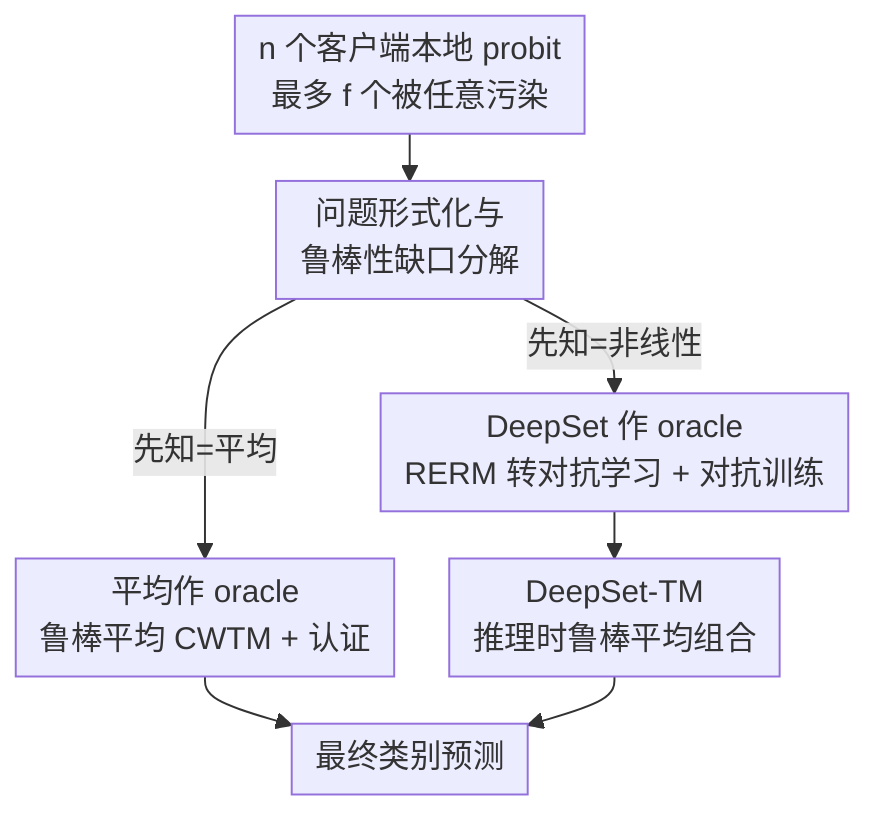

# Robust Federated Inference

**会议**: ICLR 2026  
**OpenReview**: [https://openreview.net/forum?id=47eKYCaBIV](https://openreview.net/forum?id=47eKYCaBIV)  
**代码**: https://github.com/sacs-epfl/robust-federated-inference  
**领域**: AI安全 / 鲁棒性 / 联邦学习  
**关键词**: 联邦推理, 拜占庭鲁棒, 对抗训练, DeepSet, 鲁棒聚合

## 一句话总结
本文首次形式化「鲁棒联邦推理」问题——多个本地模型的预测在服务器端被聚合，但其中最多 $f<n/2$ 个客户端的输出可能被任意篡改——并给出第一份鲁棒性分析：当聚合器是平均型时推导出可证认证，当聚合器是非线性神经网络时把问题转化为对抗学习，进而用 DeepSet + 对抗训练 + 推理时鲁棒平均的组合（DeepSet-TM）把最差情形准确率比现有鲁棒聚合方法提升 4.7–22.2 个百分点。

## 研究背景与动机

**领域现状**：把多个客户端本地模型的预测在中心服务器聚合成一个答案，这件事被反复发明过很多名字——one-shot 联邦学习、边缘集成、联邦集成，最近又因为开源大模型涌现而出现了 LLM 集成。本文把它们统称为「联邦推理」（federated inference）：客户端保留私有的本地模型，服务器只能黑盒地查询它们拿到预测，再用某种聚合器 $\psi$ 把 $n$ 个本地概率向量合并成最终类别。聚合方式要么是基于平均的（取各客户端 probit 的均值再 argmax），要么是服务器端训练的聚合神经网络。

**现有痛点**：联邦推理一路在涨热度，但它的鲁棒性几乎无人问津。现实里客户端故障、模型失效、输出被投毒几乎是不可避免的，而鲁棒统计与拜占庭鲁棒机器学习早就证明：没有防御的模型即便面对很简单的攻击也会崩。换句话说，一个本该带来「集成多个模型」技术优势的系统，可能因为没人防御而变成一个显著的安全漏洞。

**核心矛盾**：直觉上，把平均换成「鲁棒平均」（如逐坐标截尾均值 CWTM）就能防住污染——它能保证输出在 $\ell_2$ 范数上接近诚实客户端的真实均值。但本文指出这并不够：因为最终决策要过一个 $\arg\max$，而 $\arg\max$ 是不连续的，聚合输出哪怕在欧氏距离上离真实均值任意近，也可能因为跨过决策边界而给出完全不同的类别。鲁棒「估计均值」和鲁棒「保住决策」之间存在缺口。

**本文目标**：(1) 把鲁棒联邦推理形式化，并量化「鲁棒性缺口」到底由什么决定；(2) 在平均型聚合器下给出可证认证；(3) 针对更强的非线性聚合器，设计一个真正抗攻击的聚合方案。

**切入角度**：作者用一个「先知聚合器」（oracular aggregator，即假设能拿到未污染 probit 时的最优聚合器）作参照，把鲁棒推理风险拆成「无污染风险 + 鲁棒性缺口」。这个分解让问题变得可分析；而对于非线性聚合器，它进一步把鲁棒推理等价成一个对抗样本防御问题——而且是个比图像域对抗更友好的版本，因为输入被天然约束在概率单纯形上。

**核心 idea**：把「抗投毒的鲁棒推理」转化为「probit 空间上的对抗训练」，再用排列不变的 DeepSet 架构把对抗者枚举的组合复杂度压下去，最后在推理时再叠一层鲁棒平均兜底。

## 方法详解

### 整体框架

系统里有 $n$ 个客户端，每个客户端 $i$ 持有一个把输入映射到 $K$ 类概率单纯形 $\Delta_K$ 的本地分类器 $h_i$。服务器要设计聚合器 $\psi:(\Delta_K)^n\to[K]$，在最多 $f<n/2$ 个客户端（身份未知、每次查询都可能不同）返回任意污染向量的情况下，仍尽量在全局分布上分类正确。形式化地，定义鲁棒联邦推理风险

$$R_{\mathrm{adv}}(\psi) := \mathbb{E}_{(x,y)\sim D}\Big[\max_{z\in\Gamma_f(x)} \mathbf{1}\{\psi(z)\neq y\}\Big],$$

其中 $\Gamma_f(x)$ 是把任意至多 $f$ 个客户端 probit 换成任意单纯形向量后的所有可能输入集合。

本文的分析骨架是引入「先知聚合器」$\psi_o$（拿到未污染 probit 时的最优聚合器），把鲁棒风险上界拆成 $R_{\mathrm{adv}}(\psi_{\mathrm{rob}})\le R(\psi_o)+\mathbb{E}[\ell^{\mathrm{adv}}_{\psi_{\mathrm{rob}}}(x,\hat y_o)]$，后一项就是「鲁棒性缺口」——最坏情况下鲁棒聚合器与先知聚合器的分歧概率。整篇方法围绕两种先知聚合器展开：当先知是**平均**时，用鲁棒平均替代并给出认证；当先知是**非线性 DeepSet** 时，把问题转成对抗学习并用对抗训练 + 推理时鲁棒平均求解。后者（DeepSet-TM）是达到 SOTA 的主方法。

### 关键设计

**1. 鲁棒联邦推理的形式化与「鲁棒性缺口」分解：把抗投毒拆成可分析的两块**

直接优化最坏情况风险 $R_{\mathrm{adv}}$ 很难，因为它对每个样本都要在污染集合 $\Gamma_f(x)$ 上取 $\max$。本文的关键观察是引入一个「先知聚合器」$\psi_o$（在假想的、能拿到全部未污染 probit 的理想场景下最优）作为参照，并证明（Lemma 1）对任意鲁棒聚合器 $\psi_{\mathrm{rob}}$ 都有

$$R_{\mathrm{adv}}(\psi_{\mathrm{rob}})\le R(\psi_o)+\mathbb{E}_{(x,y)\sim D}\big[\ell^{\mathrm{adv}}_{\psi_{\mathrm{rob}}}(x,\hat y_o)\big],\quad \hat y_o=\psi_o(h(x)).$$

第一项是无污染下的固有学习误差，第二项才是污染带来的额外代价，被命名为**鲁棒性缺口**：它是「最多 $f$ 个 probit 被污染时，$\psi_{\mathrm{rob}}$ 与先知聚合器作出不同决策」的最坏概率。这个分解把「设计鲁棒聚合器」转化为「设计一个在污染下尽量不与先知分歧的聚合器」，是后面所有分析的支点。

**2. 平均作先知：鲁棒平均替换 + 可证认证，并点破「估计准 ≠ 决策对」**

当先知就是简单平均（对未污染 probit 取均值再 $\arg\max$）时，自然的鲁棒化是把平均换成满足 $(f,\kappa)$-鲁棒平均性质的 ROBAVG（如 CWTM）：它保证输出在 $\ell_2$ 上接近诚实向量的真实均值，误差被「诚实输入的经验方差乘以系数 $\kappa$」界住。但作者用一个三客户端三类的反例说明这远远不够——构造的估计 $\hat v$ 可以让 $\|\bar h(x)-\hat v\|_2=\sqrt 2\,\varepsilon$ 任意小，却仍有 $\arg\max_k[\bar h(x)]_k\neq\arg\max_k[\hat v]_k$，因为 $\arg\max$ 不连续。

这促使作者引入两个真正决定鲁棒性的量：聚合 probit 的**间隔** $\mathrm{MARGIN}(z)=z_{(1)}-z_{(2)}$（最大与次大坐标之差），以及客户端间的**逐点模型不相似度** $\sigma_x^2=\max_k \frac1n\sum_i([h_i(x)]_k-[\bar h(x)]_k)^2$。Theorem 1 给出 CWTM 下的认证：鲁棒性缺口被「平均 probit 的间隔小于某个阈值」的概率界住，而该阈值正比于 $\sigma_x$ 并随污染比例 $f/n$、$\kappa$ 增长。直白地说——**诚实客户端越一致（$\sigma_x$ 小）、赢家越领先（间隔大）、坏人越少，平均型聚合就越安全可证**。

**3. DeepSet 作先知：把鲁棒推理转成对抗学习，用排列不变性压掉组合爆炸**

非线性可训练聚合器在无污染时往往比平均更准，所以更值得鲁棒化。本文直接去最小化鲁棒经验风险（RERM），并指出它等价于一个对抗样本防御问题：输入是一个 $K\times n$ 矩阵（每列在 $\Delta_K$ 内），扰动被限制为最多污染 $f$ 列，即 $\psi_{\mathrm{rob}}\in\arg\min_\psi\frac1{|D_{\mathrm{train}}|}\sum\max_{\|V\|_0\le f}\mathbf 1\{\psi(H(x)+V)\neq y\}$。相比图像域对抗，这个问题更可控，因为每个被污染列仍被约束在概率单纯形里。

但朴素对抗训练仍然不可行：要枚举「哪 $f$ 个客户端是对抗者」需考虑 $\sum_m {}^nP_m$ 这种带排列的天文数字。作者的破局点是选用**对输入顺序不变**的 DeepSet 架构 $\phi_\theta(z)=\mu_{\theta_2}\big(\frac1n\sum_i\rho_{\theta_1}(z_i)\big)$：既然聚合输出与客户端顺序无关，枚举对抗者就从排列 $\binom{n}{f}\times f!$ 降到组合 $\binom{n}{f}$。实践中进一步只对每次迭代随机采样的 $N\ll\binom{n}{f}$ 组对抗者做近似（Algorithm 1）：按正比于 $\binom{n}{m}$ 的概率选扰动人数 $m\le f$，用多步 FGSM 在 probit 上生成对抗扰动（softmax 投影回单纯形），再更新网络参数使其在扰动下仍分对。这样把指示函数换成交叉熵、把最坏情况 $\max$ 换成有限采样近似，对抗训练就跑得动了。

**4. DeepSet-TM：推理时把鲁棒平均嵌进 DeepSet，且只在推理时叠加不抬高训练成本**

光靠对抗训练的 DeepSet 对污染 probit 仍偏敏感。本文的点睛之笔是把鲁棒平均与 DeepSet **组合**起来：把 DeepSet 内部的「均值池化」替换成鲁棒平均，得到

$$\psi_{\mathrm{rob}}(z)=\arg\max_k\Big[\mu_{\theta_2^*}\big(\mathrm{ROBAVG}(\rho_{\theta_1^*}(z_1),\dots,\rho_{\theta_1^*}(z_n))\big)\Big]_k.$$

关键巧思是**这层鲁棒平均只在推理时加入**——训练阶段仍用普通均值池化做对抗训练，因为若在训练时也算 ROBAVG 会显著抬高对抗训练成本。理论上（Theorem 2 + 附录 D）这个组合把 DeepSet 的鲁棒性缺口界进与平均情形同样的三个量（$f/n$、$\sigma_x$、聚合间隔），只多一个刻画非线性放大扰动的灵敏度因子 $L_\mu L_\rho$；而引入 ROBAVG 还能消掉原始 DeepSet 对污染程度的依赖。本文用 CWTM 作 ROBAVG，把该方法记为 **DeepSet-TM**，它把对抗 ML 与鲁棒 ML 两套文献的「鲁棒元件」拼到了一起。

### 损失函数 / 训练策略

把 RERM 里的 0-1 指示损失换成交叉熵 $\ell(\phi_\theta(z),y)$ 以便可导；最坏情况的内层 $\max$ 用「随机采样 $N$ 组对抗者 + 多步 FGSM」近似（Algorithm 1）。$\mu,\rho$ 各是带 ReLU 的两层 MLP。评测中固定用 CWTM 作鲁棒平均。

## 实验关键数据

数据集：CIFAR-10（客户端从头训 ResNet-8）、CIFAR-100（微调 ViT-B/32）、AG-News（微调 DistilBERT），覆盖视觉与语言。默认 $n=17$、$f=4$，用 Dirichlet $\mathrm{Dir}_n(\alpha)$ 划分数据（$\alpha$ 越小越异质）。共 6 种攻击（4 白盒 + 2 黑盒），包括本文新提的 **SIA（Strongest Inverted Attack）**：对抗者把预测改成「次大概率且非真值」的类，专门利用次优类去翻转 $\arg\max$ 决策。

### 主实验

worst case = 该方法在 6 种攻击下的最低准确率（CIFAR-10, $\alpha=0.5$, $n=17$, $f=4$）：

| 聚合方法 | SIA | PGD-cw | Worst case |
|----------|-----|--------|------------|
| Mean | 42.7 | 24.6 | 24.6 |
| CWMed | 49.3 | 27.8 | 27.8 |
| GM | 45.3 | 25.4 | 25.4 |
| CWTM | 44.8 | 27.2 | 27.2 |
| **DeepSet-TM** | **51.4** | **48.2** | **48.2** |

DeepSet-TM 在最差情形上比最强基线高 **+4.7 到 +22.2 个百分点**（随数据集而异，CIFAR-10 上对 CWMed 是 +20.4）；在 18 个「数据集×攻击」组合里有 14 个取得最高准确率，其余 4 个落后也 $\le2.3$ 点。优势在强攻击（SIA 白盒、PGD-cw）下尤为明显：基线在 PGD-cw 下掉 35–40 点，本文只掉 20–30 点；AG-News 上 PGD-cw 仍保 83.2%，而基线只有 53–55%。

### 消融实验

「鲁棒元件」拆解（$n=17,f=4$，worst-case 准确率 %）：

| DeepSet | CWTM | 对抗训练 | CIFAR-10 | CIFAR-100 | AG-News |
|:---:|:---:|:---:|:---:|:---:|:---:|
| ✓ | ✗ | ✗ | 46.0 | 47.4 | 76.4 |
| ✓ | ✓ | ✗ | 47.0 | 67.0 | 76.7 |
| ✓ | ✗ | ✓ | 48.6 | 65.1 | 76.7 |
| ✓ | ✓ | ✓ | **51.4** | **68.0** | **77.5** |

### 关键发现

- **两个元件缺一不可，且互补**：只加 CWTM 或只加对抗训练都有明显增益（CIFAR-100 从 47.4 跳到 65–67），但二者同时启用才达到最佳（68.0），说明「训练时抗扰动」与「推理时鲁棒平均」防的是不同侧面的攻击。
- **CWTM 在 CIFAR-100 上贡献巨大**：类数多（间隔天然小）时，推理时鲁棒平均把次优类翻转攻击压住的效果尤其突出（+19.6 点）。
- **probit 空间让对抗「饱和」**：因为输入被约束在单纯形里，测试时给对抗者更多 PGD 迭代（强于训练时）并不会让性能继续退化——这是把对抗搬到 probit 空间相比图像域的一个实在好处。
- **可扩展性**：在 $n=\{10,17,25\}$ 的规模研究中 DeepSet-TM 保持领先（如 $n=10,f=3$ 的 CIFAR-100 worst case 33.2 vs CWTM 24.0）。

## 亮点与洞察

- **「估计准 ≠ 决策对」这个反例非常精炼**：它一针见血地说明为什么鲁棒平均（$\ell_2$ 意义下的好估计）不足以保证鲁棒分类——因为 $\arg\max$ 不连续。这把鲁棒性的关键从「估计误差」转到了「间隔 vs 不相似度」，是整篇分析的认知拐点。
- **用排列不变性消组合爆炸**：把「枚举哪 $f$ 个是对抗者」从 $\binom nf f!$ 降到 $\binom nf$ 再到采样 $N$ 组，是个干净利落的工程×理论结合点，DeepSet 在这里既是模型也是降复杂度的工具。
- **「鲁棒平均只在推理时插入」是省钱又有效的设计**：训练时不付 ROBAVG 的代价，推理时才兜底，理论上还能消掉对污染程度的依赖——这种「训练/推理解耦的鲁棒化」思路可迁移到其他需要对抗训练的集成系统。
- 把「对抗 ML 文献的对抗训练」和「拜占庭鲁棒 ML 文献的鲁棒平均」缝在一起，是难得的跨社区组合。

## 局限与展望

- **威胁模型限定在分类的 probit 空间**：方法依赖输入被约束在单纯形上的良性结构，对回归、生成、或直接在 logit/文本空间的 LLM 集成是否同样有效未充分验证（附录虽把 SIA 适配到了 logit 空间用于和 COPUR 比较）。
- **需要服务器端验证数据训练聚合器**：DeepSet-TM 要预留 10% 训练数据在服务器训聚合网络，这在「客户端模型完全私有、服务器无标注数据」的极端场景下未必成立。
- **$f<n/2$ 的硬约束**：超过半数客户端被污染时方法不再有保证，且实验规模 $n\le25$（cross-silo 设定），cross-device 大规模下的表现待考。
- **对抗训练的近似采样数 $N$ 的选取**与最坏情况覆盖度之间的权衡缺乏更系统的指导。

## 相关工作与启发

- **vs COPUR (Liu et al., 2022)**：COPUR 用自编码器 + 块稀疏优化在 logit 空间「净化」污染响应再聚合，但纯净化对更强攻击脆弱、且对输入幅度高度敏感。本文在 probit 空间工作并把鲁棒性做进聚合器本身，对 SIA / PGD-cw 等强攻击更稳。
- **vs 拜占庭分布式学习**：经典拜占庭鲁棒关注**训练**阶段、且常假设固定的恶意身份；本文关注**推理**阶段、不假设固定身份（每次查询攻击者可任意变化），但复用了其中「鲁棒平均」这一核心工具。
- **vs EXPGUARD / FEDMDR 等鲁棒投票**：它们要么跨轮追踪客户端行为，要么要求客户端在公共集上报告准确率来加权，这些假设在「客户端每次推理都可任意行为」的本文设定下不成立。

## 评分
- 新颖性: ⭐⭐⭐⭐⭐ 首次形式化鲁棒联邦推理并给出第一份鲁棒性分析，「转对抗学习 + DeepSet 降复杂度 + 推理时鲁棒平均」的组合有原创性。
- 实验充分度: ⭐⭐⭐⭐ 三数据集双模态、6 种攻击（含自提 SIA）、5 随机种子、消融与可扩展性齐全；规模偏 cross-silo（$n\le25$）。
- 写作质量: ⭐⭐⭐⭐ 问题动机与反例清晰，理论与实验衔接好；部分理论细节需查附录。
- 价值: ⭐⭐⭐⭐⭐ 给一个被忽视却现实的安全缺口立了 benchmark 和首套防御，对联邦/边缘/LLM 集成的可信部署有直接意义。

<!-- RELATED:START -->

## 相关论文

- [\[ICLR 2026\] Protection against Source Inference Attacks in Federated Learning](protection_against_source_inference_attacks_in_federated_learning.md)
- [\[ICLR 2026\] Federated Learning of Quantile Inference under Local Differential Privacy](federated_learning_of_quantile_inference_under_local_differential_privacy.md)
- [\[ICLR 2026\] Robust Fine-Tuning from Non-Robust Pretrained Models: Mitigating Suboptimal Transfer with Epsilon-Scheduling](robust_fine-tuning_from_non-robust_pretrained_models_mitigating_suboptimal_trans.md)
- [\[AAAI 2026\] Diversifying Counterattacks: Orthogonal Exploration for Robust CLIP Inference](../../AAAI2026/ai_safety/diversifying_counterattacks_orthogonal_exploration_for_robust_clip_inference.md)
- [\[ICLR 2026\] Get RICH or Die Scaling: Profitably Trading Inference Compute for Robustness](get_rich_or_die_scaling_profitably_trading_inference_compute_for_robustness.md)

<!-- RELATED:END -->
