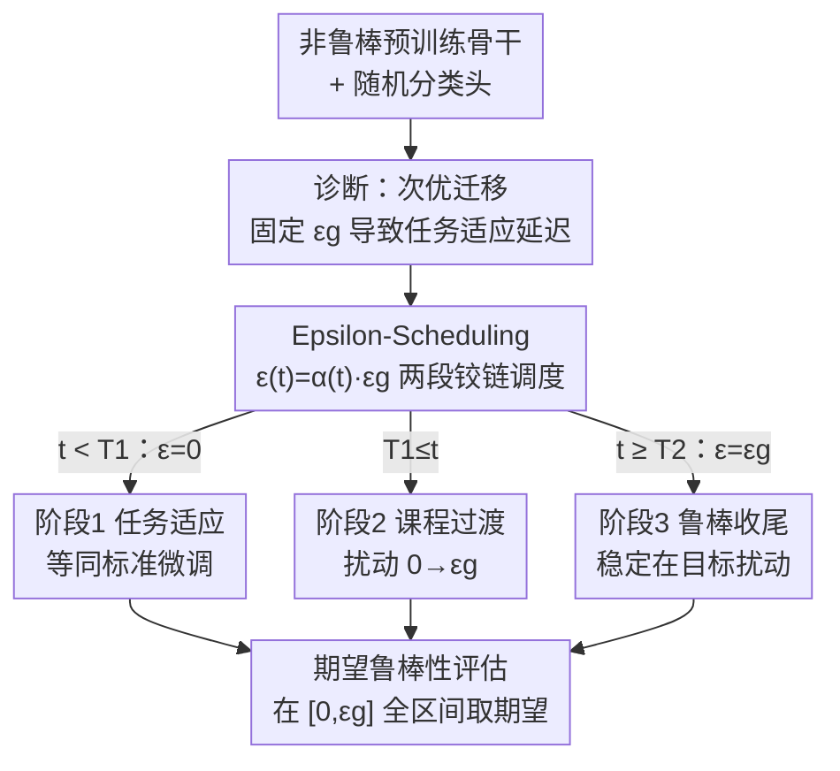

# Robust Fine-Tuning from Non-Robust Pretrained Models: Mitigating Suboptimal Transfer with Epsilon-Scheduling

**会议**: ICLR 2026  
**OpenReview**: [https://openreview.net/forum?id=aIBFTh2ThF](https://openreview.net/forum?id=aIBFTh2ThF)  
**代码**: https://github.com/ngnawejonas/EpsilonScheduling  
**领域**: 对抗鲁棒性 / 鲁棒微调 / 迁移学习  
**关键词**: 鲁棒微调, 对抗训练, 次优迁移, 扰动调度, 期望鲁棒性

## 一句话总结
本文发现从**非鲁棒预训练模型**做鲁棒微调（RFT）时，哪怕用很小的对抗扰动也会出现"次优迁移"——干净精度大幅低于普通微调甚至接近随机；作者把根因归到"任务适应被延迟"，提出 **Epsilon-Scheduling**（训练扰动强度先 0、再线性爬升到目标值的两段铰链调度）来先适应任务再上鲁棒约束，并提出 **期望鲁棒性**指标更全面地刻画精度-鲁棒性权衡，在 6 个骨干 × 5 个数据集上一致改善。

## 研究背景与动机
**领域现状**：微调预训练骨干是机器学习的标准范式。在安全敏感场景里还要求模型抗对抗样本，于是把对抗训练（AT, Madry et al. 2018）嵌进微调，得到鲁棒微调（RFT）。RFT 要同时做两件事：适应下游任务 + 获得鲁棒性。

**现有痛点**：几乎所有 RFT 工作（TWINS、AutoLoRA、RoLi）都**假设有一个鲁棒预训练骨干**可用。但现实里开源仓库里绝大多数预训练模型都是**非鲁棒**的，鲁棒预训练代价高、很少见。更糟的是，前人（Liu et al. 2023; Hua et al. 2024）甚至直接断言"鲁棒预训练是下游鲁棒的必要前提"——也就是说从非鲁棒骨干出发被认为是走不通的。

**核心矛盾**：本文系统验证了从非鲁棒骨干做 RFT 会发生一个被命名为"**次优迁移（suboptimal transfer）**"的现象：用固定目标扰动 $\varepsilon_g$ 做对抗训练时，即使 $\varepsilon_g$ 很小（如 $1/255$），干净精度也会比普通微调掉最多 14%；在常用的 $4/255$ 下最小也掉 10%；难任务（如 Aircraft）甚至掉到 5% 以下，等于迁移失败。问题不在"鲁棒目标本身坏"，而在**训练动态**：鲁棒目标在训练早期就扭曲了任务相关特征，把任务适应硬生生推迟到后期，留给适应的有效 epoch 变少，最终欠拟合任务。

**本文目标**：让非鲁棒骨干也能成功 RFT——既不牺牲对任务的适应，又拿到目标鲁棒性。

**切入角度**：作者观测到一个关键现象——普通微调里验证精度第一个 epoch 就开始上升，而 RFT 里任务适应被推迟到很晚（Aircraft 上要到 30+ epoch 才动），而且**延迟时长与次优迁移严重程度的相关性高达 90%+**。既然延迟是病根，那就别让模型一上来就硬扛强扰动。

**核心 idea**：把训练扰动强度做成一条**课程化的时间表**——先 0 扰动让模型快速适应任务，再线性爬升到目标 $\varepsilon_g$，用"先学会任务、再变鲁棒"代替"全程死扛目标扰动"。

## 方法详解

### 整体框架
本文其实是"一诊断、一方法、一指标"三件套。诊断部分先用大量实验把"次优迁移 = 任务适应被延迟"这件事钉死；方法部分提出 Epsilon-Scheduling，把固定扰动 $\varepsilon_g$ 换成随 epoch 变化的 $\varepsilon(t)=\alpha(t)\,\varepsilon_g$；评估部分提出期望鲁棒性，把"只在目标阈值看一眼"扩展成"在 $[0,\varepsilon_g]$ 全区间取期望"。

训练流程本身是一条清晰的三阶段课程：标准微调热身 → 扰动线性爬升 → 在目标扰动下稳定收尾。

### 关键设计

**1. 次优迁移诊断：把"鲁棒微调变差"归因到任务适应延迟**

这一节解决的是"为什么从非鲁棒骨干做 RFT 会崩"。基线 RFT-fix 全程用固定扰动 $\varepsilon_g$ 最小化对抗风险

$$R_{\varepsilon_g}(f) = \mathbb{E}_{(x,y)\sim D}\Big[\max_{\|\delta\|_p<\varepsilon_g} L_{CE}(f(x+\delta),y)\Big]$$

作者在两个非鲁棒骨干（SWIN、ViT）× 五个数据集上扫 $\varepsilon_g\in[1/255,9/255]$，发现干净精度随 $\varepsilon_g$ 增大单调下滑，且严重程度高度依赖"骨干 × 任务"的交互（任务是更主导的因素）。真正的洞察在训练曲线上：普通微调（$\varepsilon_g=0$）第一个 epoch 验证精度就起飞，而 RFT-fix 把"任务适应起点"（验证精度首次超过 5% 的 epoch）推迟得很晚——$4/255$ 下 Caltech 约 epoch 10、Cars 约 25、Aircraft 30+。扰动越强、延迟越久、次优迁移越严重，延迟时长与严重程度相关性 >90%。换句话说，鲁棒目标在早期扭曲了任务相关特征，挤占了本该用来适应任务的有效训练窗口。这个"延迟"机制此前没人报告过，正是后面方法的立足点。

**2. Epsilon-Scheduling：两段铰链线性调度，先适应任务再上鲁棒**

既然病根是早期硬扛强扰动导致适应被延迟，那就让扰动强度随训练**逐步**加上去。本文不再固定 $\varepsilon_g$，而是让它按 epoch $t$ 走一条比例曲线 $\varepsilon(t)=\alpha(t)\,\varepsilon_g$，其中

$$\alpha(t)=\begin{cases}0 & t<T_1\\[2pt]\dfrac{t-T_1}{T_2-T_1} & T_1\le t<T_2\\[4pt]1 & t\ge T_2\end{cases}$$

含义很直白：前 $T_1$ 个 epoch 纯做标准微调（零扰动）让模型先把任务学会，再在 $[T_1,T_2]$ 把扰动从 0 线性拉到 $\varepsilon_g$，最后从 $T_2$ 起稳定在目标扰动收尾。$T_1$ 是"适应期"长度，$T_2$ 控制过渡陡峭程度。这条曲线**严格泛化了前人的 linear warmup**（取 $T_1=0$ 即退化为 warmup，取 $T_1=T_2=0$ 即退化为 RFT-fix）。从迁移学习视角看，它就是一条课程学习：先喂"容易样本"（弱扰动）再喂"难样本"（强扰动）。$T_1,T_2$ 不需逐任务调——作者用最严重的次优迁移实例（SWIN-Aircraft）测出适应期约 epoch 11、平均延迟约 epoch 37，于是固定 $T_1=12$（约 25% 总 epoch）、$T_2=37$（约 75%），就在 6×5 全配置上通用。

**3. 期望鲁棒性：用全区间积分代替单点鲁棒精度**

标准评估只在目标阈值 $\varepsilon_g$ 看一次鲁棒精度，会掩盖中间扰动强度下的表现，也无法刻画"精度-鲁棒性权衡"的形状。本文提出期望鲁棒性，把准确率对 $[0,\varepsilon_g]$ 上均匀分布的扰动取期望：

$$\mathrm{Acc}_{[0,\varepsilon_g]}(f) := \mathbb{E}_{\varepsilon\sim U[0,\varepsilon_g]}\big[\mathrm{Acc}_\varepsilon(f)\big] = \frac{1}{\varepsilon_g}\int_0^{\varepsilon_g}\mathrm{Acc}_\varepsilon(f)\,d\varepsilon = \frac{1}{\varepsilon_g}\mathrm{AUC}_{\varepsilon_g}(f)$$

即准确率-扰动曲线下面积除以 $\varepsilon_g$，用梯形法数值积分即可。它对应一个更现实的威胁模型：输入可能被扰动、也可能没被扰动，扰动幅度在 $[0,\varepsilon_g]$ 内随机；干净精度（扰动恒为 0）和最坏情况鲁棒精度（扰动恒为 $\varepsilon_g$）都只是它的两个极端特例。这个指标的价值在于：当两个模型在 $\varepsilon_g$ 处鲁棒精度相近、但干净精度差很多时，期望鲁棒性能把中间区间的优势量化出来，给模型选择提供依据——也正是 Epsilon-Scheduling 即便最坏情况鲁棒精度持平或略低时仍胜出的原因。

### 损失函数 / 训练策略
训练 50 epoch，对抗样本用 APGD（训练 7 步、评估 10 步）配交叉熵损失生成，无需手调步长。评估在 $\ell_\infty$ 范数下用 $\varepsilon_g=4/255$（中等）和 $8/255$（高强度）两档，报告干净精度、APGD 鲁棒精度（adv.）和区间期望鲁棒精度（E. adv.）。由于对抗精度过拟合可忽略，直接取训练结束时的模型。

## 实验关键数据

### 主实验
六个非鲁棒骨干（SWIN/ViT/ConvNext/ResNet-50/CLIP-ViT/CLIP-ConvNext）× 五个细粒度数据集。下表摘 $\varepsilon_g=4/255$ 下 fix vs scheduler 的对比（Clean / Adv. / E.adv.，单位 %）：

| 配置 | 设置 | Clean | Adv. | E. adv. |
|------|------|-------|------|---------|
| ViT-Cars | fix | 12.70 | 4.90 | 8.20 |
| ViT-Cars | **sched** | **73.40** | **19.10** | **46.71** |
| ViT-Aircraft | fix | 6.40 | 2.80 | 4.48 |
| ViT-Aircraft | **sched** | **58.60** | **13.20** | **34.95** |
| ClipViT-Cars | fix | 4.90 | 3.00 | 3.74 |
| ClipViT-Cars | **sched** | **86.70** | **58.60** | **75.01** |
| SWIN-Cars | fix | 60.20 | 29.70 | 44.74 |
| SWIN-Cars | **sched** | **84.70** | **43.20** | **66.41** |

在中等扰动下，scheduler 在干净精度上往往是数量级的改善（ViT-Cars 12.7%→73.4%、ClipViT-Cars 4.9%→86.7%），且 adv. 与 E. adv. 同步提升——即它不是用鲁棒性换干净精度，而是两头都赢。

### 高强度扰动（$\varepsilon_g=8/255$）

| 配置 | 设置 | Clean | Adv. | E. adv. |
|------|------|-------|------|---------|
| SWIN-Aircraft | fix | 4.20 | 2.70 | 3.47 |
| SWIN-Aircraft | **sched** | **69.20** | **22.40** | **45.12** |
| CNX-Cub | fix | 5.02 | 2.28 | 3.56 |
| CNX-Cub | **sched** | **80.69** | **24.28** | **53.07** |
| R50-Cars | fix | 1.50 | 1.20 | 1.34 |
| R50-Cars | **sched** | **57.10** | **8.50** | **29.56** |

$8/255$ 下 RFT-fix 在多数难任务上**整体失败**（干净精度个位数），而 scheduler 把它救回到 50%~80%，期望鲁棒性也大幅领先。

### 关键发现
- **任务是比骨干更主导的难度因素**：易任务（Caltech）掉点小、难任务（Aircraft，类间高度相似）掉点严重；且"任务难度"是模型-数据交互的产物（Dogs 对 SWIN 比 Cub 易、对 ViT 反而更难）。
- **延迟与严重程度相关性 >90%**：任务适应起点越晚，次优迁移越重，这是把方法对准"延迟"的直接证据。
- **scheduler 即使最坏情况鲁棒精度持平/略低也更优**：R50-Caltech 上 $4/255$ 时 fix 的 adv. 40.0% 略高于 sched 的 34.7%，但 sched 干净精度 76.6% vs 67.5%、期望鲁棒性 55.7% vs 53.7% 反超——期望鲁棒性正是为捕捉这种权衡而设计。
- **超参可跨配置通用**：$T_1,T_2$ 由单个最差实例标定后在全 30 个配置上不再调整即生效。

## 亮点与洞察
- **把"鲁棒微调失败"从静态结论变成动态机制**：前人只看终态精度低就断言"非鲁棒骨干不行"，本文盯训练曲线发现是"任务适应被推迟"，从而把不可能变成可解——洞察层面的贡献。
- **方法极简但有理论归属**：Epsilon-Scheduling 只是一条两段折线，却严格泛化了 linear warmup 和 RFT-fix，等于把零散的 warmup 技巧统一进一个可解释的课程框架。
- **期望鲁棒性是可复用的评估工具**：把"单点鲁棒精度"升级成"区间 AUC 期望"，对任何研究精度-鲁棒性权衡的工作都能直接拿来用，且对应一个更现实的随机扰动威胁模型。
- 课程学习"先易后难"的思路被迁移到"先适应任务、再上对抗约束"，这个映射可以推广到其他多目标冲突的微调场景（如鲁棒性 vs 公平性）。

## 局限与展望
- 调度形状固定为两段线性铰链，$T_1,T_2$ 虽通用但由单一最差实例标定，未必对所有威胁模型/数据规模最优；自适应或样本级调度可能进一步提升但代价更高。
- 期望鲁棒性默认用均匀分布加权，作者也承认实际威胁模型的扰动分布可能非均匀（可换成其他分布甚至 Dirac 退化回干净/最坏精度），但论文未深入探讨非均匀情形。
- 实验集中在 $\ell_\infty$ 范数、细粒度图像分类与 50-epoch 全量微调；对 $\ell_2$、检测/分割等任务、参数高效微调（LoRA 等）下是否成立尚待验证。
- 方法本质是"延后上强度"，对训练总预算很短（epoch 很少）的场景，留给鲁棒收尾的窗口可能不够。

## 相关工作与启发
- **vs TWINS / AutoLoRA / RoLi（鲁棒骨干 RFT）**：它们都假设有鲁棒预训练特征，AutoLoRA 还依赖更难扩展的 TRADES 损失；本文是**首个针对非鲁棒骨干**的 RFT 方法，直接挑战了"鲁棒预训练是必要前提"的共识。
- **vs Linear Warmup / PGDLS（对抗训练里调扰动强度）**：前人多用于从零训练，且 warmup 在 ResNet 上收益有限、PGDLS 只在很大扰动（$24/255$）才见效；本文聚焦迁移学习、严格泛化了 warmup，并用期望鲁棒性证明收益跨任务/架构一致。
- **vs 标准对抗评估（单点鲁棒精度）/ average-case 鲁棒指标**：单点评估掩盖中间扰动行为，average-case 多针对随机/自然扰动且不捕捉干净-最坏权衡；期望鲁棒性把"准确率随扰动递减"形式化为 $[0,\varepsilon_g]$ 上的积分期望，填补了二者之间的空白。

## 评分
- 新颖性: ⭐⭐⭐⭐⭐ 首次系统刻画非鲁棒骨干 RFT 的次优迁移，并把根因落到"任务适应延迟"这一前人未报告的机制。
- 实验充分度: ⭐⭐⭐⭐⭐ 6 骨干 × 5 数据集 × 2 扰动档全覆盖，附 AutoAttack 验证与延迟相关性分析。
- 写作质量: ⭐⭐⭐⭐ 诊断-方法-指标三段逻辑清晰，但核心方法本身较简单，部分篇幅靠现象描述支撑。
- 价值: ⭐⭐⭐⭐⭐ 把"非鲁棒骨干不能做鲁棒微调"的共识打开，方法极简可即插即用，期望鲁棒性指标也有独立复用价值。

<!-- RELATED:START -->

## 相关论文

- [\[ICLR 2026\] Robust Federated Inference](robust_federated_inference.md)
- [\[ICLR 2026\] Identifying Robust Neural Pathways: Few-Shot Adversarial Mask Tuning for Vision-Language Models](identifying_robust_neural_pathways_few-shot_adversarial_mask_tuning_for_vision-l.md)
- [\[ICLR 2026\] Eliciting Harmful Capabilities by Fine-Tuning on Safeguarded Outputs](eliciting_harmful_capabilities_by_fine-tuning_on_safeguarded_outputs.md)
- [\[ICLR 2026\] Reducing Information Dependency Does Not Cause Training Data Privacy. Adversarially Non-Robust Features Do.](reducing_information_dependency_does_not_cause_training_data_privacy_adversarial.md)
- [\[ICLR 2026\] Discrete Latent Features Ablate Adversarial Attack: A Robust Prompt Tuning Framework for VLMs](discrete_latent_features_ablate_adversarial_attack_a_robust_prompt_tuning_framew.md)

<!-- RELATED:END -->
