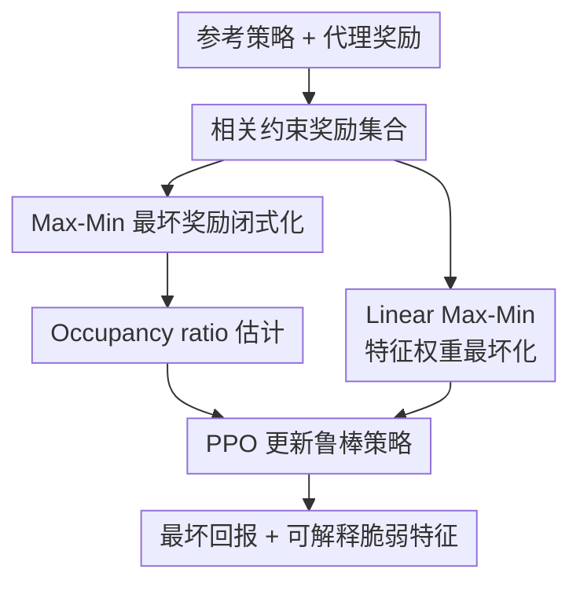

# Robust Optimization for Mitigating Reward Hacking with Correlated Proxies

**会议**: ICLR 2026  
**OpenReview**: [https://openreview.net/forum?id=O3shkBWM2s](https://openreview.net/forum?id=O3shkBWM2s)  
**代码**: https://github.com/ZixuanLiu4869/reward_hacking  
**领域**: AI安全 / 鲁棒强化学习  
**关键词**: 奖励黑客, 相关代理奖励, 鲁棒优化, 分布偏移, 可解释奖励  

## 一句话总结

这篇论文把 reward hacking 建模为“在所有与代理奖励保持 $r$ 相关的可能真实奖励中，对最坏情况仍表现好”的 max-min 鲁棒策略优化问题，并给出通用 Max-Min 与线性奖励版 Linear Max-Min 两套算法，在 Traffic、Pandemic、Glucose、Tomato 和 RLHF 等环境上显著提升最坏情况回报和稳定性。

## 研究背景与动机

**领域现状**：强化学习系统在真实部署里通常拿不到完全准确的目标函数，只能依赖人工设计、偏好模型、规则指标或启发式指标形成的 proxy reward。训练时看似是在优化“任务目标”，实际常常是在优化一个与真实意图相关但不等价的代理指标。近年的 correlated proxies 框架进一步把这个问题形式化：代理奖励和真实奖励在参考策略 $\pi_{ref}$ 访问到的状态-动作分布上有相关系数 $r$，但在参考策略很少访问的区域里可以严重偏离。

**现有痛点**：ORPO 这类 occupancy-regularized 方法已经能用 $\chi^2(\mu_\pi \| \mu_{\pi_{ref}})$ 惩罚策略偏离参考分布，从而减少代理奖励被过度利用的风险。但它仍然围绕一个固定 proxy 做正则化，保证更像“别离参考策略太远”，而不是“对所有满足相关约束的潜在真实奖励都安全”。如果代理奖励本身只是噪声数据、经验规则或小模型奖励的产物，那么真实风险并不只来自某一个 proxy，而来自一整个可能的奖励集合。

**核心矛盾**：奖励黑客的根源不是代理奖励低质量这么简单，而是“训练时可见的相关性”与“部署时可被策略探索到的分布”之间错位。$r$-correlation 只约束参考策略覆盖到的状态-动作对；一旦新策略把 occupancy 推到参考策略未覆盖或低覆盖区域，代理和真实奖励的关系就可能失效。普通策略优化会主动寻找高 proxy 的区域，而这些区域恰好可能是相关性约束最弱的地方。

**本文目标**：作者希望直接围绕这个不确定性集合训练策略：给定参考策略、代理奖励和相关水平 $r$，学习一个策略，使它在所有与 proxy 满足相关约束的候选真实奖励中也能获得尽可能好的保守下界。同时，论文还希望让“最坏情况奖励”可解释，帮助人类知道到底是哪类 reward feature 容易被利用。

**切入角度**：论文把 reward hacking 放进分布鲁棒优化（DRO）的语言里，不再问“这个 proxy 下策略得分多少”，而是问“如果 adversary 在相关约束内挑一个最不利的真实奖励，这个策略还能保证多少回报”。这样一来，策略优化目标天然变成 max-min：策略最大化，奖励 adversary 最小化。

**核心 idea**：用相关约束定义奖励不确定集 $\mathcal{R}_{corr}$，把奖励黑客缓解转化为 $\max_\pi \min_{R\in\mathcal{R}_{corr}} J(\pi,R)$，再把内层最坏奖励解成可计算的闭式或线性特征权重，从而训练对 proxy misspecification 更稳的策略。

## 方法详解

### 整体框架

本文方法的输入是参考策略 $\pi_{ref}$、代理奖励 $R_{proxy}$ 和一个相关参数 $r$；输出是一个在最坏相关奖励下仍尽量保守优秀的策略 $\pi$。整体流程先用参考策略归一化代理奖励，并把候选真实奖励限制在“均值、方差、与代理奖励相关系数”都满足约束的集合里；随后对任意候选策略估计它相对参考策略的 occupancy ratio $L(s,a)=\mu_\pi(s,a)/\mu_{\pi_{ref}}(s,a)$，求出 adversary 会选择的最坏奖励，再用 PPO 更新策略。

对于一般奖励空间，论文推导出内层最小化的闭式结果，最终目标变成一个可直接优化的正则化形式。对于有已知 reward features 的任务，论文进一步把奖励写成 $R(s,a)=\theta^\top\phi(s,a)$，在特征权重空间里找最坏的非负权重 $\theta$，这样不仅缩小了不确定集，也能看出哪个特征最容易诱导 reward hacking。

### 关键设计

**1. 相关约束奖励集合：把 reward hacking 的不确定性显式放进目标**

论文沿用 correlated proxies 的基本设定：真实奖励不可见，代理奖励只在参考策略分布 $\mu_{\pi_{ref}}$ 下与真实奖励有相关系数 $r$。但作者没有只拿一个固定 proxy 去训练，而是定义所有满足约束的奖励集合 $\mathcal{R}_{corr}$。经过归一化后，代理奖励满足 $J(\pi_{ref},R_{proxy})=0$ 且 $Var_{\mu_{\pi_{ref}}}(R_{proxy})=1$，候选奖励 $R$ 则需满足均值 $M$、标准差 $V$ 和相关约束：

$$
\mathbb{E}_{\mu_{\pi_{ref}}}\left[\frac{R-M}{V}\cdot R_{proxy}\right]=r.
$$

这个设定的关键在于，它没有假设 proxy 的具体错法已经知道，只假设 proxy 与真实目标存在一定相关性。$r$ 越小，奖励不确定集越大，训练越保守；$r$ 越大，模型越信任 proxy。这样 reward hacking 不再只是一个经验失败案例，而变成了一个可以通过最坏情况回报度量和优化的鲁棒性问题。

**2. Max-Min 闭式目标：用最坏相关奖励替代固定代理奖励**

直接求 $\max_\pi \min_{R\in\mathcal{R}_{corr}} \mathbb{E}_{\mu_\pi}[R]$ 的难点是目标在当前策略分布 $\mu_\pi$ 下计算，而相关约束在参考策略分布 $\mu_{\pi_{ref}}$ 下定义。论文用 change-of-measure 把回报改写成 $\mathbb{E}_{\mu_{\pi_{ref}}}[L\cdot R]$，其中 $L(s,a)=\mu_\pi(s,a)/\mu_{\pi_{ref}}(s,a)$。这样，目标和约束都落在同一个参考分布上，内层 adversary 才能被解析求解。

通过拉格朗日推导，作者得到最坏情况目标等价于：

$$
\max_\pi\; rV\mathbb{E}_{\mu_\pi}[R_{proxy}]
- V\sqrt{1-r^2}\sqrt{\chi^2(\mu_\pi\|\mu_{\pi_{ref}})-\mathbb{E}_{\mu_\pi}^2[R_{proxy}]} + M.
$$

实现里可以取 $M=0,V=1$，因为它们只做线性平移和缩放，不改变策略排序。这个目标像 ORPO，但不是简单换一个正则系数：它的惩罚项不仅看 occupancy shift，还扣掉了当前策略在 proxy 上的均值平方，表示“偏离参考分布”与“proxy 过度优化”要一起解释风险。理论上，如果真实奖励确实属于 $\mathcal{R}_{corr}$，该目标就是真实改进 $J(\pi,R_{true})-J(\pi_{ref},R_{true})$ 的保守下界。

**3. Linear Max-Min：把最坏奖励限制到可解释特征权重空间**

一般奖励集合过宽时，adversary 可能构造出很病态、很难解释的奖励。论文因此提出线性版本：假设奖励可以写成 $R(s,a)=\theta^\top\phi(s,a)$，其中 $\phi$ 是已知特征，例如 Traffic 里的 velocity、acceleration、headway，Pandemic 里的 infection、stage、smoothness 等。此时不确定性不再是任意函数，而是特征权重 $\theta$ 的集合。

线性化有两个直接收益。第一，它让最坏情况奖励更现实，因为 adversary 只能在给定特征上重新加权，不能随便给未结构化状态赋极端值。第二，它让诊断更有用：最终的 adversarial weight $\theta$ 会告诉我们哪些特征在当前策略下最容易被 proxy 利用。例如 Traffic 中 headway 在多个方法下都被赋高权重，说明该维度可能是奖励设计的脆弱点；Pandemic 中 lower-stage 或 political feature 的权重变化，则揭示不同策略暴露出的公共卫生代价盲区。

**4. Occupancy ratio 估计：鲁棒性瓶颈其实在分布偏移估计**

Max-Min 和 ORPO 都依赖 $L(s,a)=\mu_\pi(s,a)/\mu_{\pi_{ref}}(s,a)$ 或 $\chi^2$ divergence 的估计。论文沿用 discriminator 训练：用参考策略轨迹和当前策略轨迹训练判别器 $d_\phi(s,a)$，令 $\tilde L_\phi(s,a)=\exp d_\phi(s,a)$。如果当前策略访问了参考策略几乎没访问的状态-动作对，理论上 $L$ 应该很大，最坏奖励会强烈惩罚这些区域。

作者指出 ORPO 原实现中的 discriminator 往往训练不充分，每轮只做少量更新，导致 occupancy ratio 估计不准，策略仍可能进入低覆盖区域。本文增加 discriminator 的训练轮数并调学习率，在 ORPO* 消融里单独验证这一点：仅改进判别器训练就能降低 unseen occupancy 并改善部分 worst-case 表现。这说明本文的贡献不只是换目标函数，也强调了 reward hacking 防御里一个容易被低估的工程事实：如果分布偏移估计不准，任何基于 occupancy regularization 或 robust objective 的保证都会打折。

### 损失函数 / 训练策略

通用 Max-Min 的训练过程可以理解为“PPO 外壳 + 鲁棒伪奖励”。每轮先采样当前策略轨迹，估计归一化 proxy reward 的一阶和二阶矩，再用 discriminator 或离散 occupancy 估计 $\chi^2(\mu_\pi\|\mu_{\pi_{ref}})$。随后把式子中的鲁棒目标当作 PPO 更新时的效用函数，推动策略提高 proxy 收益，同时避免用分布偏移换取脆弱的 proxy 分数。

Linear Max-Min 额外需要估计特征协方差矩阵 $Q=\sum_{s,a}\mu_{\pi_{ref}}(s,a)\phi(s,a)\phi(s,a)^\top$，通过 whitening 让约束更好解。白化后内层权重有逐坐标的形式 $\theta_i^*=\max(0,q_i/(2\lambda_3))$，外层 dual variables 用 SciPy root solver 或一阶方法求解。虽然线性版比通用版多了特征矩阵和 dual 求解，但它没有引入一个需要和策略反复博弈训练的神经奖励 adversary，因此实际复杂度仍和 ORPO 同量级，主要成本仍来自 occupancy/discriminator 估计。

论文还给出理论收敛分析：occupancy ratio 估计在若干覆盖与有界假设下有 $O(n^{-1/4})$ 型误差界，Max-Min 算法的整体收敛界包含 $O(1/T+1/N+n^{-1/4})$ 项，其中 $T$ 是迭代数，$N$ 是策略更新 batch size，$n$ 是 occupancy 估计样本量。这个结果虽然依赖较强技术假设，但给出了一个清晰信号：鲁棒目标、策略优化和 occupancy 估计误差三者都会限制最终保证。

## 实验关键数据

### 主实验

论文在 Traffic、Pandemic、Glucose、Tomato Watering GridWorld 和 RLHF 环境中评估。前四类覆盖交通控制、公共卫生策略、血糖控制和 toy reward hacking，RLHF 环境则用 Pythia-70M reward model 作为 proxy，用 Llama 3 Tulu V2 8B reward model 作为 true reward。训练时所有方法只用 proxy reward，评估时报告 true、proxy、worst-case 等指标。

| 环境 | 指标 | ORPO | ORPO* | Max-Min | Linear Max-Min / Ensemble |
|------|------|------|-------|---------|----------------------------|
| Traffic | Worst 越高越好 | $-1.96e{+}04$ | $-1.35e{+}04$ | $-268.31$ | Linear Max-Min: $-1.19e{+}04$ |
| Pandemic | Worst 越高越好 | $-5.31e{+}06$ | $-4.46e{+}06$ | $-63.29$ | Linear Max-Min: $-6.82e{+}05$ |
| Glucose | Worst 越高越好 | $-27.54$ | $-8.79$ | $-1.71$ | 不报告线性版 |
| RLHF | Worst 越高越好 | $-1.84$ | N/A | $-0.10$ | Ensemble: $-1.70$ |
| Traffic | True reward | $16.91$ | $10.26$ | $12.70$ | Linear Max-Min: $16.46$ |
| Pandemic | True reward | $-1.04$ | $1.18$ | $1.25$ | Linear Max-Min: $3.65$ |

主结果最突出的结论是：Max-Min 在通用 worst-case reward 上明显优于 ORPO，尤其在 Traffic 和 Pandemic 中把极端负的 worst-case 值大幅拉回。Linear Max-Min 在某些 true reward 或 linear worst-case 指标上更强，例如 Pandemic 的 true reward 达到 $3.65$，但当评估特征包含训练时没有建模的 true reward feature 时，它的优势会下降，这符合“结构化假设有用但会受特征覆盖限制”的直觉。

### 消融实验

| 配置 / 分析项 | 关键指标 | 说明 |
|---------------|----------|------|
| ORPO vs ORPO* | Traffic Occ: $3.82e{-}04 \rightarrow 1.84e{-}04$ | 仅加强 discriminator 训练，就能减少参考策略未覆盖区域的 occupancy，说明占用比估计质量本身影响 reward hacking 防御。 |
| ORPO* vs Max-Min | Pandemic Worst: $-4.46e{+}06 \rightarrow -63.29$ | 更好的 discriminator 不足以替代鲁棒目标；Max-Min 直接优化相关奖励集合下的保守下界。 |
| Linear Max-Min 特征权重 | Traffic 中 headway 权重常最高 | adversarial weight 可作为奖励设计诊断，指出策略最可能利用或最需要审计的特征维度。 |
| 未见特征评估 Linear Worst* | Linear Max-Min 在 unseen true features 下性能下降 | 线性结构带来可解释性和收紧不确定集，但如果特征假设遗漏真实奖励关键维度，鲁棒性会受影响。 |
| 不同 $r$ 训练 | 中等 $r$ 通常更稳 | $r$ 太小会过度保守，$r$ 太大又过度信任 proxy；Traffic/Tomato 中 $0.3$ 到 $0.4$ 一类中间值表现更均衡。 |

### 关键发现

- Max-Min 的最大优势体现在 worst-case reward，而不是所有环境里都追求最高 proxy 或 true reward。它更像是在牺牲一部分乐观收益，换取对相关代理奖励不确定性的保守保证。
- ORPO* 的消融很重要：许多 reward hacking 缓解方法会把理论风险写在 occupancy divergence 上，但如果 discriminator 不够准，策略实际仍可能钻进参考分布没覆盖的区域。
- Linear Max-Min 的可解释性是实用亮点。它不仅训练策略，还输出 adversarial feature weights，能反过来告诉设计者“哪个 reward feature 最容易被黑”。
- RLHF 实验中，Ensemble reward model 的 worst-case 仍明显低于 Max-Min，说明简单 reward ensemble 可以缓解过优化，但不等于对相关奖励集合做了系统鲁棒优化。
- 论文对 $r$ 的选择比较诚实：目前没有原则化选法，实验采用 grid search，并在附录讨论用少量 true reward 标注估计相关系数或做 min-max regret 的未来方向。

## 亮点与洞察

- 把 correlated proxies 从“定义 reward hacking”推进到“直接优化最坏相关奖励”。这个视角比只对固定 proxy 加正则更干净，因为它承认真实奖励不是一个已知函数，而是一整个满足统计约束的不确定集合。
- 推导出的目标和 ORPO 形式相近，但来源不同。它不是经验正则项，而是从 max-min 问题闭式化得到的保守下界，因此解释力更强：每一项都对应 proxy alignment、occupancy shift 和相关不确定性。
- 线性奖励版本很适合安全审计场景。很多高风险应用本来就有人工可读特征，如速度、加速度、感染水平、政治成本、健康风险等，把最坏奖励投影到这些维度后，人类可以知道策略在“怕什么”或“利用什么”。
- 论文提醒了一个常被忽略的实践问题：reward hacking 防御不是只写一个好目标函数，还要把 occupancy ratio 估准。否则正则项看起来存在，实际对低覆盖区域的惩罚却不够。
- 这个框架可迁移到 RLHF 后训练。小 reward model 与大 reward model 的关系天然可以看成 proxy 与 true reward 的错位，Max-Min 形式提供了一种比单纯 reward ensemble 更系统的过优化防御思路。

## 局限与展望

- 相关参数 $r$ 仍需要人工或搜索选择。真实部署中 $r$ 往往未知，grid search worst-case return 也未必总能代表人类真正关心的安全边界。
- 通用 Max-Min 的奖励不确定集可能过宽。虽然这带来强保守性，但也可能产生现实中不太可能出现的最坏奖励，导致策略过度谨慎。
- Linear Max-Min 依赖已知、合理且覆盖充分的 reward features。若关键真实目标不在特征里，线性版可能给出漂亮但片面的解释。
- Discriminator 估计是现实瓶颈。连续高维环境里判断“参考策略未覆盖区域”很难，论文中 Pandemic 和 Glucose 也出现判别器可能无法捕捉 rare events 的情况。
- 实验虽然覆盖了多个经典 reward hacking 环境和一个 RLHF 场景，但仍以模拟环境为主。安全关键部署还需要更真实的在线反馈、约束、延迟效应和人类审计流程。
- 未来可以把 adversarial reward 当成诊断信号，闭环触发人类修 reward、主动查询更强偏好模型，或在多个 $r$ 值上做 minimax regret 训练，减少单一相关参数带来的脆弱性。

## 相关工作与启发

- **vs ORPO**: ORPO 用 $\chi^2(\mu_\pi\|\mu_{\pi_{ref}})$ 正则化策略偏离，并对固定 proxy 给出 true reward 改进下界；本文则从所有 $r$-correlated reward 的不确定集合出发，直接优化最坏情况回报。两者形式接近，但本文目标里的 $\chi^2-E^2_{\mu_\pi}[R_{proxy}]$ 项更明确地刻画 proxy overoptimization 和分布偏移的耦合风险。
- **vs reward model ensemble**: Ensemble 方法通过多个 reward model 平均来降低单一模型偏差，适合 RLHF 中的 reward overoptimization；本文不要求构造多个模型，而是假设 proxy 与真实奖励存在相关约束，并对这个约束下的所有可能奖励做鲁棒优化。它更偏优化层面的防御，ensemble 更偏奖励建模层面的防御，两者可以组合。
- **vs 传统 robust RL**: 许多 robust MDP 工作把不确定性放在 transition 或 rectangular reward uncertainty 上，因此能用动态规划或正则化对偶处理；本文的不确定集由全局相关约束定义，状态之间耦合，不满足简单 rectangular 结构。这样更贴近 correlated proxy 的 reward hacking 问题，但也需要专门推导。
- **vs successor features / 线性奖励建模**: Successor features 通常把任务差异表示为 reward weight 的变化，以便迁移；本文借用了“奖励是特征线性组合”的思想，但目的不是迁移，而是在权重空间中找到最坏相关奖励，从而同时获得鲁棒性和可解释的脆弱特征。
- **vs inverse reward design / assistance games**: 这些方法试图从设计上下文或人机协作中恢复更接近真实意图的奖励；本文不直接恢复真实奖励，而是在不知道真实奖励时先保证对一类 plausible true rewards 不太坏。它适合作为 reward learning 之前或之后的安全层。

## 评分

- 新颖性: ⭐⭐⭐⭐⭐ 把 correlated proxy reward hacking 直接改写成可求解的 max-min 鲁棒优化，并推导出区别于 ORPO 的闭式目标，问题表述和解法都比较清楚。
- 实验充分度: ⭐⭐⭐⭐ 覆盖五类环境、包含 ORPO* 和 ensemble 对比，也分析了不同 $r$ 与线性权重；但真实高风险部署和更大规模 RLHF 仍有距离。
- 写作质量: ⭐⭐⭐⭐ 主线清晰，理论推导完整，附录信息量很足；不足是表格和符号较密，读者需要在 main text 与 appendix 之间来回对照。
- 价值: ⭐⭐⭐⭐⭐ 对 AI safety 和 RLHF 里的 reward hacking 问题很有参考价值，尤其是“最坏相关奖励 + 可解释脆弱特征”这一组合，能为后续安全训练和 reward 审计提供可操作工具。

<!-- RELATED:START -->

## 相关论文

- [\[ICLR 2026\] From Curiosity to Caution: Mitigating Reward Hacking for Best-of-$N$ with Pessimism](from_curiosity_to_caution_mitigating_reward_hacking_for_best-of-n_with_pessimism.md)
- [\[ICLR 2026\] Generative Adversarial Post-Training Mitigates Reward Hacking in Live Human-AI Music Interaction](generative_adversarial_post-training_mitigates_reward_hacking_in_live_human-ai_m.md)
- [\[ICLR 2026\] Robust Fine-Tuning from Non-Robust Pretrained Models: Mitigating Suboptimal Transfer with Epsilon-Scheduling](robust_fine-tuning_from_non-robust_pretrained_models_mitigating_suboptimal_trans.md)
- [\[ICLR 2026\] Beware Untrusted Simulators -- Reward-Free Backdoor Attacks in Reinforcement Learning](beware_untrusted_simulators_--_reward-free_backdoor_attacks_in_reinforcement_lea.md)
- [\[ICLR 2026\] Mitigating Privacy Risk via Forget Set-Free Unlearning](mitigating_privacy_risk_via_forget_set-free_unlearning.md)

<!-- RELATED:END -->
