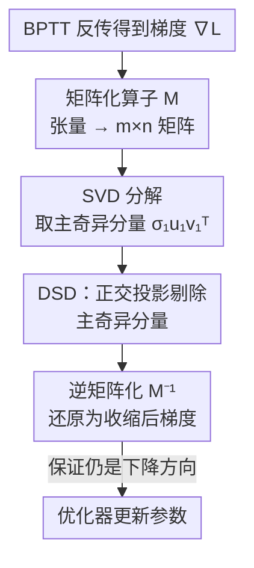

# Robustify Spiking Neural Networks via Dominant Singular Deflation under Heterogeneous Training Vulnerability

**会议**: ICLR 2026  
**OpenReview**: [https://openreview.net/forum?id=EIYltBaUzL](https://openreview.net/forum?id=EIYltBaUzL)  
**代码**: https://github.com/Apple26419/SNN_DSD  
**领域**: AI 安全 / 对抗鲁棒性 / 脉冲神经网络  
**关键词**: 脉冲神经网络, 对抗鲁棒性, 异构训练, Hessian 谱半径, 梯度收缩

## 一句话总结
作者发现脉冲神经网络（SNN）在"直接编码 + BPTT"主流训练范式下存在**异构训练脆弱性**——只要训练中混进一个分布略有差异的 batch 就会导致整网崩溃，并从理论上把根因归结为 Hessian 谱半径随时间步线性增长；据此提出无超参的 **Dominant Singular Deflation（DSD）**，在每步反传时正交剔除梯度的主奇异分量来压低谱半径，在同构与异构训练下都显著提升了 SNN 的对抗鲁棒性。

## 研究背景与动机

**领域现状**：SNN 用离散脉冲做事件驱动计算，省去 ANN 那种密集矩阵乘法，能耗极低，被广泛用在自动驾驶、边缘计算、机器人控制等对安全可靠性要求很高的场景。当前增强 SNN 鲁棒性的主流做法几乎都是**同构训练（homogeneous training）**：要么只用干净样本做 vanilla 训练，要么所有输入都加等强度扰动做对抗训练（AT）。

**现有痛点**：同构训练假设训练数据来自单一、均匀的分布，这在现实里站不住脚。真实部署中数据天然不可预测、异质，攻击者还会用各种投毒策略故意打破分布均匀性。作者把这种更现实的设定称为**异构训练（hetero-training）**，并观察到一个触目惊心的现象（Observation 1）：在 SNN 训练中，**哪怕只用一个分布略不同的 batch 做一次反向传播，就足以触发整网灾难性崩溃**——准确率瞬间跳水、loss 完全退化、之后剧烈震荡。同构训练（无论全干净还是全扰动）轨迹都很稳，可一旦插进一个异质 batch 就崩。

**核心矛盾**：通过控制变量实验（训练范式 × 编码方式 × 网络结构），作者定位出崩溃**与网络结构和训练阶段无关，强依赖于训练范式（BPTT）和编码方式（直接编码）**：BPTT 比 SLTT 崩得严重得多，直接编码比速率编码崩得严重得多，而 ANN 只是温和退化不会崩。这说明问题出在 "BPTT + 直接编码" 这对组合本身，会间歇性地把参数推进极尖锐的局部极小值——即 loss Hessian 的谱半径异常大。

**本文目标**：(1) 解释 SNN 为什么在异构训练下崩溃；(2) 在**不依赖操纵输入数据**的前提下，设计一个能缓解崩溃、同时提升鲁棒性的方法。

**切入角度**：既然崩溃源于尖锐极小值（大谱半径），那就直接在优化层面压制曲率增长。作者从理论上刻画了谱半径如何随时间步 $T$ 增长，发现它被梯度里一个**秩一主奇异分量**主导——这给了一个干净的下手点：把这个主导项削掉。

**核心 idea**：用"正交剔除梯度主奇异分量"代替"调时间步/加正则/换编码"，无超参地压低 Hessian 谱半径，从而避免 SNN 落入尖锐极小值。

## 方法详解

### 整体框架

DSD 的整体思路分两步：**先诊断、再开方**。诊断部分通过两条定理把异构训练崩溃量化为"Hessian 谱半径随时间步线性增长，并被一个秩一方向主导"；开方部分则是一个即插即用的梯度修正操作——在每次反向传播得到梯度后、送进优化器之前，把梯度矩阵化、做 SVD、用正交投影剔掉那个最大奇异值对应的秩一分量，再还原回去送去更新参数。整个过程没有任何超参数，也不改网络结构、不引入额外模型，推理时零开销。

为什么剔掉主奇异分量就能止崩？理论分析表明：直接编码下输入逐时间步保持平稳，BPTT 的递归 Jacobian 近似时不变，反复作用产生"幂迭代效应"，让各时间步的梯度全部对齐到一个共同的秩一方向上；谱半径正是被这个方向的最大奇异值 $\sigma_1$ 平方所主导。把它削掉，最大奇异值降到次大的 $\sigma_2$，谱半径严格下降，参数就不再被推向尖锐极小值。

### 关键设计

**1. 异构训练脆弱性的理论根因：把崩溃归到谱半径随 $T$ 线性增长**

这条设计回答"SNN 为什么崩"。作者用两条定理刻画 Gauss–Newton（GN）Hessian 块 $H(W^l)\approx\sum_{t=1}^{T}(J^W_t)^\top H_t J^W_t$ 的谱行为。**定理 1** 证明在 LIF 神经元的收缩动力学下，每个时间步的 BPTT 梯度贡献 $\|g_t\|=\|G_t J^W_t\|\le C_G C_J$ 是 $O(1)$ 有界的，于是谱半径至多随时间步线性增长：$\lambda_{\max}(H(W^l))\le C_B^2 C_z C_J^2 \cdot T$。**定理 2** 进一步指出**直接编码会让这个上界变紧**：由于直接编码每步输入平稳、递归算子近似时不变，反复作用产生幂迭代效应，使所有 $J^W_t$ 沿一个共同的秩一方向集中，可写成 $J^W_t=\alpha_t ab^\top + R_t$（残差 $\sum_t\|R_t\|^2=o(T)$），从而下界也以同样线性率增长，得到 $\lambda_{\max}(H(W^l))=\Theta\!\left(\sum_{t=1}^T \alpha_t^2\right)=\Theta(T)$。

这套分析把"BPTT 建立 $O(T)$ 上界、直接编码把它收紧到 $\Theta(T)$"讲清楚了：谱半径既然随 $T$ 线性膨胀，异构训练里哪怕一点分布偏差也会沿这些被放大的尖锐方向不成比例地累积，迅速引发崩溃。实验（Fig. 3）也佐证：时间步越大、异构训练下退化越严重，但单纯减小时间步又会让同构性能暴跌——所以必须主动压制曲率增长，而不是回避直接编码。

**2. Dominant Singular Deflation：正交剔除梯度的主奇异分量**

这是方法的核心操作，针对的正是设计 1 揭示的"谱半径被秩一主奇异分量主导"。对参数集 $\theta$，先把梯度张量 $\nabla_\theta L(\theta)\in\mathbb{R}^{d_1\times\cdots\times d_k}$ 用确定性矩阵化算子 $\mathcal{M}$ 摊成矩阵（$m=d_1,\,n=\prod_{j\ge2}d_j$），做 SVD：$\mathcal{M}(\nabla_\theta L)=U\Sigma V^\top=\sum_{i=1}^r \sigma_i u_i v_i^\top$，其中 $\sigma_1 u_1 v_1^\top$ 即主奇异分量。然后用正交投影算子把它精确剔除：

$$D(A)=\frac{\langle A, u_1 v_1^\top\rangle_F}{\|u_1 v_1^\top\|_F^2}\,u_1 v_1^\top,\qquad \widetilde{\nabla_\theta L}=\mathcal{M}^{-1}\!\big(\mathcal{M}(\nabla_\theta L)-D(\mathcal{M}(\nabla_\theta L))\big)$$

剔除后 Jacobian 的最大奇异值从 $\sigma_1$ 降到 $\sigma_2$，于是 $\lambda_{\max}\big(H(W^l;\widetilde{\nabla_\theta L})\big)<\lambda_{\max}\big(H(W^l;\nabla_\theta L)\big)$，谱半径严格下降。它和已有防御的根本区别在于：StoG/DLIF/HoSNN/FEEL 这些方法要么靠随机门控、要么改 LIF 漏电动力学、要么加正则，**只在经验上提鲁棒、却没触及"直接编码 + BPTT 诱发脆弱性"的底层机制**；DSD 则直接在梯度空间确定性地拔掉那个主导曲率的项，且**无超参、无辅助模型、推理零开销**，部署友好。谱半径降下来还能间接收紧网络 Lipschitz 常数上界，进一步利于鲁棒性与泛化。

**3. 下降性保持：剔分量但不破坏优化收敛**

直接动梯度自然让人担心：削掉一个分量会不会让更新方向不再下降？这条设计给出确定性保证。沿更新方向 $d=-\widetilde{\nabla_\theta L}$ 的方向导数为 $\mathcal{D}L(\theta)[d]=\langle\nabla_\theta L, d\rangle$。利用正交投影算子 $D$ 的自伴随与幂等性（$\langle A, D(A)\rangle_F=\|D(A)\|_F^2$），可化简得

$$\mathcal{D}L(\theta)[d]=-\big\|\mathcal{M}(\widetilde{\nabla_\theta L})\big\|_F^2\le 0$$

只要收缩后梯度非零，不等式就严格成立。也就是说 DSD 的更新方向**始终是非增（下降）方向**，并在梯度非零时严格下降。作者特别强调（Remark 1）这一结论只依赖 Hilbert 空间中正交投影的一般性质，**不依赖 SNN、BPTT 或交叉熵的任何特殊结构**——所以收敛保证是普适的，换网络换损失都成立。这让 DSD 不像很多"魔改梯度"的技巧那样有发散风险。

### 损失函数 / 训练策略
DSD 不改损失函数，而是作为一层梯度后处理嵌进标准 SNN 训练（直接编码 + BPTT）。它确定性、无超参，训练时仅引入一次 SVD 的额外开销（附录 E 报告），推理时完全无额外开销。实验在 vanilla 训练与对抗训练（AT，白盒 FGSM $\epsilon=2/255$）两种同构设定，以及多种异构投毒设定下统一启用 DSD。

## 实验关键数据

数据集涵盖静态图像 CIFAR-10 / CIFAR-100 / TinyImageNet / ImageNet，以及动态视觉传感器（DVS）数据集 DVS-CIFAR10 / DVS-Gesture；攻击包括 FGSM、PGD、更强的 APGD（CE/DLR）与黑盒替身攻击。

### 主实验：同构训练下的白盒鲁棒性（Table 1，准确率 %）

| 设定 | 数据集 | 攻击 | 本文 DSD | 之前最佳 baseline | 提升 |
|------|--------|------|----------|-------------------|------|
| Vanilla | CIFAR-100 | FGSM | 23.81 | 13.48 (HoSNN) | ▲10.33 |
| Vanilla | CIFAR-100 | PGD | 8.09 | 2.04 (FEEL) | ▲6.05 |
| Vanilla | TinyImageNet | FGSM | 19.50 | 9.59 (FEEL) | ▲9.91 |
| AT | CIFAR-10 | FGSM | 74.43 | 63.98 (HoSNN) | ▲10.45 |
| AT | TinyImageNet | FGSM | 30.87 | 8.19 (SNN) | ▲22.68 |
| AT | TinyImageNet | PGD | 18.21 | 2.97 (SNN) | ▲15.24 |
| AT | ImageNet | FGSM | 26.83 | 15.74 (SNN) | ▲10.09 |

DSD 在几乎所有数据集与攻击下都拿到最高鲁棒准确率，多处提升超过 10%；代价是干净准确率略降（多数列 ▼1~5%），作者承认这是此类防御的通病。更强的 APGD 攻击（Table 2）下 DSD 也几乎全面领先，仅 CIFAR-100 AT 的 APGD$_{\text{DLR}}$ 略逊 DLIF。DVS 数据集（Table 3）上同样超过 SOTA 方法 SR，如 DVS-Gesture 的 FGSM 从 39.24 提到 90.28。

### 异构训练与谱半径分析（Table 4，Hessian 评估）

| 推理设定 | 数据集 | 指标 | SNN | DSD | 变化 |
|----------|--------|------|-----|-----|------|
| Clean | CIFAR-10 | $\lambda_{\max}(H)$ | 261.94 | 209.90 | ▼52.04 |
| Clean | CIFAR-10 | $\Pr(H)$ | 0.98 | 0.35 | ▼0.63 |
| PGD | TinyImageNet | $\lambda_{\max}(H)$ | 2072.77 | 1793.12 | ▼279.65 |
| FGSM | ImageNet | $\lambda_{\max}(H)$ | 162.57 | 111.77 | ▼50.80 |

异构训练（Fig. 5/6）下，DSD 的浮动条最短（退化最小），且 $b=1$ 注入时绝对准确率明显高于 RAT/DLIF/FEEL；即便把投毒强度提到 $b=5$，CIFAR-10 在 FGSM 下仍能维持约 30% 准确率，无一例完全崩溃。Hessian 评估直接验证了机制：DSD 一致地降低谱半径 $\lambda_{\max}(H)$ 与其在 top-5 特征值中的占比 $\Pr(H)$，证明它确实抹平了 loss landscape 的尖锐度。

### 关键发现
- **崩溃的"开关"是 BPTT + 直接编码这对组合，而非网络结构或训练阶段**：ResNet-18 与 VGG-11 崩溃程度相当，SLTT 与速率编码都明显缓和，说明根因在优化/编码而非架构。
- **谱半径与时间步 $T$ 正相关**：时间步越大异构退化越严重，但减小时间步会牺牲同构性能，这正是需要 DSD 这种"主动压曲率"机制的原因。
- **DSD 不是靠梯度混淆造假鲁棒**：通过 Athalye 等人的 5 项 checklist（Table 5）全部通过——迭代 PGD 比单步 FGSM 更强、白盒比黑盒更狠、增大扰动能持续提升攻击成功率，说明鲁棒性是真实的。

## 亮点与洞察
- **把"训练崩溃"翻译成"谱半径 $\Theta(T)$ 增长"再翻译成"秩一主奇异分量"**：这条从现象到机制再到可操作量的推理链非常干净，最终落到一个能直接动手剔除的对象上，是全文最"啊哈"的地方。
- **无超参 + 推理零开销 + 普适下降保证**：DSD 不像 SAM、生成式防御那样需要调参或挂辅助模型；下降性证明只用正交投影性质，与具体网络/损失无关，迁移到 ANN 或其他优化场景也成立。
- **可迁移 trick**："在梯度空间确定性剔除主奇异分量来压 Hessian 谱半径"这一思路，本质是对锐度的轻量替代，原则上可用于任何想避开尖锐极小值、提升鲁棒/泛化的训练，而无需 SAM 那样的双前向开销。

## 局限与展望
- **作者承认的局限**：DSD 故意让实际施加的梯度偏离理想梯度，因此在干净数据上不可避免地带来轻微精度下降（Table 1 多列 ▼1~5%）；作者指出这是现有 SOTA 防御的共性问题，需后续研究突破。
- **自己发现的局限**：理论保证（定理 2 的谱半径收紧、秩一对齐）紧密绑定"直接编码 + LIF + BPTT"的平稳性假设，换成速率编码或其他神经元动力学时，主奇异分量是否仍主导曲率、DSD 收益是否还在，文中未充分验证。
- **改进思路**：每步做一次 SVD 在大模型上可能成为瓶颈，可探索用幂迭代/随机化 SVD 只估计 $\sigma_1 u_1 v_1$ 以降本；也可考虑自适应地剔除 top-$k$ 而非固定秩一，以在鲁棒性与干净精度间更细地权衡。

## 相关工作与启发
- **vs StoG / DLIF / HoSNN / FEEL（SNN 防御）**：它们分别靠随机门控、改 LIF 漏电动力学、噪声敏感正则、自适应阈值等，只在经验上提鲁棒，**没触及"直接编码+BPTT 诱发脆弱性"的底层机制**；DSD 直接在梯度空间消除主导曲率项，机理清晰且无超参，异构训练下抗崩溃能力明显更强。
- **vs Parseval 网络 / 谱范数正则 / Lipschitz-margin / Jacobian 正则**：这些通过约束权重或 Jacobian 的大奇异值来控制谱增长，但往往作用间接、依赖辅助模型或敏感超参；DSD 直接、确定性、可证下降，部署更简单。
- **vs SAM / 生成式防御**：SAM 通过双前向找锐度方向，生成式防御把对抗输入投回数据流形，二者都增加显著开销或额外模型；DSD 用一次梯度收缩近似达到"避开尖锐极小值"的效果，训练开销小、推理无开销。

## 评分
- 新颖性: ⭐⭐⭐⭐⭐ 首次定位 SNN 异构训练脆弱性并给出谱半径 $\Theta(T)$ 的理论刻画，再用秩一收缩对症下药，机制与方法都新。
- 实验充分度: ⭐⭐⭐⭐ 覆盖 4 个静态 + 2 个 DVS 数据集、FGSM/PGD/APGD/黑盒多攻击、谱半径与梯度混淆诊断，较完整；但 ImageNet 上多数 baseline 缺失对比、干净精度损失偏大。
- 写作质量: ⭐⭐⭐⭐ 诊断→理论→方法的逻辑链清晰，定理与图表互证；公式密集，部分附录依赖较重。
- 价值: ⭐⭐⭐⭐⭐ 无超参、推理零开销、带普适下降保证，对 SNN 安全部署很实用，思路也可外溢到一般鲁棒训练。

<!-- RELATED:START -->

## 相关论文

- [\[ICLR 2026\] Robust Spiking Neural Networks Against Adversarial Attacks](robust_spiking_neural_networks_against_adversarial_attacks.md)
- [\[ICLR 2026\] Time Is All It Takes: Spike-Retiming Attacks on Event-Driven Spiking Neural Networks](time_is_all_it_takes_spike-retiming_attacks_on_event-driven_spiking_neural_netwo.md)
- [\[ICML 2026\] Singular Bayesian Neural Networks](../../ICML2026/ai_safety/singular_bayesian_neural_networks.md)
- [\[CVPR 2026\] Towards Reliable Evaluation of Adversarial Robustness for Spiking Neural Networks](../../CVPR2026/ai_safety/towards_reliable_evaluation_of_adversarial_robustness_for_spiking_neural_network.md)
- [\[AAAI 2026\] MPD-SGR: Robust Spiking Neural Networks with Membrane Potential Distribution-Driven Surrogate Gradient Regularization](../../AAAI2026/ai_safety/mpd-sgr_robust_spiking_neural_networks_with_membrane_potential_distribution-driv.md)

<!-- RELATED:END -->
