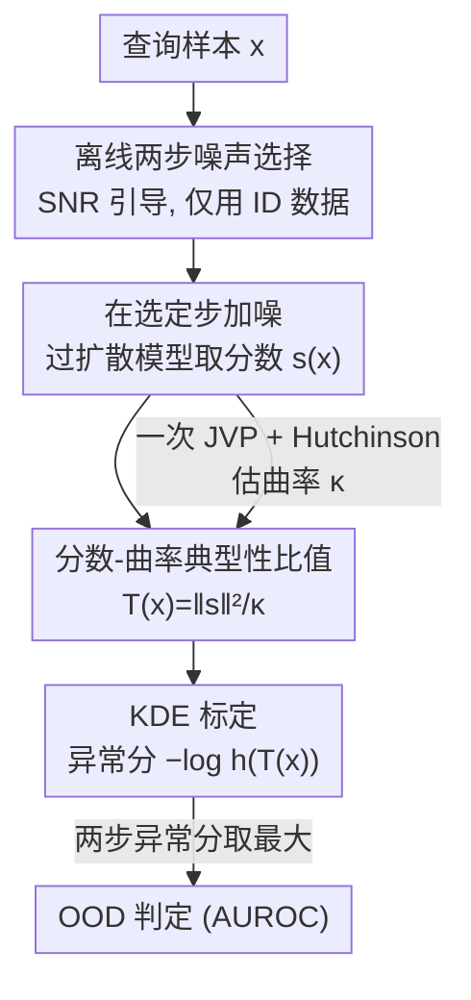

# SCOPED: Score–Curvature Out-of-Distribution Proximity Evaluator for Diffusion

**会议**: ICLR 2026  
**OpenReview**: [https://openreview.net/forum?id=TMLiG9Rk2J](https://openreview.net/forum?id=TMLiG9Rk2J)  
**代码**: https://github.com/CLeARoboticsLab/SCOPED  
**领域**: AI安全 / OOD检测 / 扩散模型  
**关键词**: OOD检测, 扩散模型, 分数函数, 曲率, 典型集, 信息几何

## 一句话总结
SCOPED 把扩散模型分数函数的「平方范数 / 雅可比迹（曲率）」组成一个单一统计量 $T(x)$ 来判断样本是否在分布内，靠 Hutchinson 估计器把曲率压成一次 JVP，只需 1~2 次前向评估就能逼近最强扩散类 OOD 方法的精度，比依赖完整去噪轨迹的方法少一个数量级的模型评估。

## 研究背景与动机
**领域现状**：OOD（分布外）检测是把机器学习系统安全部署到视觉、机器人、强化学习等真实场景的前提——模型常对异常或无关输入给出高置信度，带来安全隐患。无监督方法只需要分布内数据，因此最受欢迎，而生成模型（尤其是扩散模型）天然适合刻画数据分布，成了 OOD 检测的主流工具。

**现有痛点**：基于似然的方法有出了名的病理现象——会给 OOD 数据集分配比训练集更高的似然；基于重建的自编码器/扩散重建方法严重依赖精心调过的信息瓶颈，实践中很脆弱；更新的基于轨迹几何的扩散方法（如 DiffPath）需要沿整条去噪路径反复评估模型，计算量极大。这些方法普遍要 10~1000 次模型调用，对实时、算力受限的应用是硬伤。

**核心矛盾**：精度和计算成本之间存在 trade-off。轨迹类方法之所以贵，是因为它要走概率流 ODE 做串行积分，每一步依赖上一步，既不能减少步数也无法并行——成本随轨迹长度线性增长。

**本文目标**：设计一个既准又快的扩散类 OOD 检测器，把模型评估次数砍掉一个数量级，并且评估之间互相独立、可完全并行。

**切入角度**：作者借用信息几何的一个基本直觉——在分布的「典型集」附近（即分布内样本），对数概率密度的局部曲率与分数函数的范数是相关的。扩散模型本来就直接学分数 $s_\theta(x_t,t)\approx\nabla_x\log p_t(x_t)$，那么曲率信息就能通过一次 JVP 高效拿到。

**核心 idea**：用「分数范数²/曲率」这个比值 $T(x)$ 作为典型性的度量——在典型集上它恒等于 1，偏离典型集就显著偏离 1，从而把信息论里抽象的「典型集」转成一个可由扩散模型一次算出的、可落地的 OOD 判据。

## 方法详解

### 整体框架
SCOPED 的目标是：给定一个在多样数据上训练好的扩散模型，对任意查询样本 $x$ 输出一个「它有多 OOD」的异常分。整条流水线是离线 + 在线两段。离线阶段：用分布内（ID）数据估计前向扩散的信噪比（SNR），挑出做检测的噪声步（视觉任务取早期 $t=1$ 和中期 $t=300$ 两步），并在这些步上对 ID 数据的 $T(x)$ 值拟合一个核密度估计（KDE）。在线阶段：对测试样本在选定噪声步上加噪、过一次扩散模型拿分数 $s$、再做一次 JVP 拿曲率 $\kappa$，组成统计量 $T(x)$，代入 KDE 取负对数似然 $-\log h(T(x))$ 当作异常分；两步各算一个异常分，取最大值作为最终判据。

整个过程的关键在于：典型性比值 $T(x)$ 提供原始信号，但它在不同数据集/噪声步/模型间不可比，所以要靠 KDE 把它「标定」成一个可比较的异常分。下图给出从输入到异常分的流向。

### 关键设计

**1. 分数–曲率典型性比值：用信息几何把「是否在典型集」写成一个标量**

OOD 检测最根本的难点是「在分布内」没有清晰定义。作者用信息论的典型集来锚定它：高维分布的几乎全部概率质量并不集中在密度最大的众数处，而是集中在一层满足 $-\log p(x)=H(p)$ 的薄壳（高斯环面定理）上——这正好解释了为什么基于似然的方法会失效（高密度点可能落在壳外、反而是非典型的）。定义分数 $s(x):=-\nabla_x\log p(x)$、局部曲率 $\kappa(x):=\mathrm{Tr}(\nabla_x s(x))=-\mathrm{Tr}(\nabla_x^2\log p(x))$。由 Fisher 信息的经典恒等式 $\mathbb{E}_p[\mathrm{Tr}(\nabla_x s(x))]=\mathbb{E}_p[\lVert s(x)\rVert^2]$，在分布内样本上期望的分数范数与期望曲率相匹配。据此构造统计量

$$T(x)=\frac{\lVert s(x)\rVert^2}{\kappa(x)}.$$

直觉是：高维分布几乎所有质量都落在典型样本上，那里 $-\log p(x)\approx H(p)$，于是 $T(x)\approx 1$。以各向同性高斯 $x\sim\mathcal{N}(0,\sigma^2 I_d)$ 为例，$s(x)=x/\sigma^2$、$\kappa(x)=d/\sigma^2$，则 $T(x)=\lVert x\rVert^2/(d\sigma^2)$；因为 $\lVert x\rVert^2$ 在高维下尖锐集中于 $d\sigma^2$，典型集上 $T(x)$ 紧贴 1，而远离薄壳的样本则显著偏离。一个微妙之处：分子的平方范数丢掉了方向，而分母雅可比迹保留符号，导致存在全局符号歧义，作者用一个全局符号因子校正（附录 D），并验证这个校正对视觉任务的稳定 OOD 性能是必要的。

**2. 一次 JVP + Hutchinson 估计器：把曲率算成「一次额外前向」的成本**

朴素地算雅可比迹 $\mathrm{Tr}(\nabla_x s(x))$ 在高维里贵得离谱（要显式构造雅可比矩阵）。作者用 Hutchinson 随机迹估计器 $\mathrm{Tr}(\nabla_x s)\approx\mathbb{E}_v[v^\top(\nabla_x s)v]$：用随机投影 $v$ 形成无偏估计，成本只与维度线性相关，每个探针只需对分数网络做一次 JVP（雅可比–向量积），完全避免显式构造雅可比。实践中单个探针往往就够用，多取几个探针求平均可进一步降方差。由于一次 JVP 的成本约等于一次前向（$1J\approx 1F$），在给定噪声步上算 SCOPED 的代价只相当于多做一次前向，即 $1F+1J$。这正是 SCOPED 相对 DiffPath 这类路径方法的根本优势：后者要沿概率流 ODE 串行积分、步与步强依赖、无法并行；而 SCOPED 在任意噪声步独立探测、不重建完整去噪路径，于是评估次数少一个数量级，且能在样本和时间步两个维度上完全并行——实际墙钟时间的收益比 NFE 计数本身还要大。

**3. KDE 标定：把不可比的原始 $T(x)$ 转成可比的异常分**

虽然 $T(x)$ 度量了典型性，但它的绝对值在不同数据集、噪声步、模型间并不通用——一个固定阈值并不可靠（作者用 humanoid-stand vs walk 的 RL 例子说明：易分情形直接卡阈值就行，但数据不易分时必须谨慎选阈值）。由于训练时总能拿到 ID 样本，作者在 ID 数据上算出一堆 $T(x)$ 值，用核密度估计 KDE 在每个观测值周围放高斯核，拟合出 ID 统计量分布 $h$，无需假设任何参数形式。最终异常分定义为

$$\text{score}(x)=-\log h\big(T(x)\big),$$

即测试样本的 $T(x)$ 在 ID 密度下的负对数似然。这一步把「典型性」转成了一个标定过的异常分，且 KDE 离线预先拟合、在线只需算 $T(x)$，几乎零额外开销。

**4. SNR 引导的离线两步噪声选择：只用 ID 数据、不在 OOD 上调参**

噪声步选得好不好直接决定「保留多少信号 vs 注入多少噪声」。作者强调全程只用 ID 数据来选步，绝不在 OOD 基准上 sweep 超参（这是和 DiffPath 等方法的关键区别——后者在 OOD 上调参会造成评估泄漏）。对本体感知的 D4RL/DMC 任务，单噪声步取在噪声调度约 3/4 处即可让 $T(x)$ 平凡可分。对视觉任务，离线估计 $p_t(x_t)$ 的 SNR（仅用 ID 数据）：SNR 随 $t$ 单调衰减，早期步保细节、晚期步趋近纯噪声主导；于是在两点取值——早期步 $t=1$ 最大化细节信息，中期步 $t=300$（约 95% 信号尚存、SNR 进入近线性下降、保留粗结构而抑制部分细节）。对每个测试样本在两步各算异常分并取最大值作为最终分。作者还定义两个参照变体：SCOPED (Single) 固定单步 $t=300$（$1F+1J$，少一些鲁棒性但更省）；SCOPED (Oracle) 假设已知每个 ID/OOD 对的最佳步（信息性上界，实践不可得）。

### 损失函数 / 训练策略
SCOPED 本身不引入新的训练损失——它复用一个已训练好的标准扩散模型（视觉实验用与最强 baseline 一致的、在 CelebA 上无条件训练的 DDPM；RL 实验用各任务上拟合的 EDM denoiser）。所有「学习」都体现在离线的 SNR 估计、噪声步选择和 KDE 拟合上，全部仅依赖 ID 数据。

## 实验关键数据

### 主实验（视觉 AUROC，越高越好）
在 CIFAR-10、SVHN、CelebA、CIFAR-100 四个基准上跨数据集对评估，骨干是 CelebA 上训练的无条件 DDPM。计算成本记为 #F+#J（F 前向、J 一次 JVP）。

| 方法 | 平均 AUROC | 计算成本 | 说明 |
|------|-----------|----------|------|
| MSMA | 0.928 | 10F + 0J | 扩散类强 baseline |
| DiffPath | 0.918 | 10F + 0J | 路径几何，串行不可并行 |
| LMD | 0.868 | 104F + 0J | 扩散重建 |
| DDPM-OOD | 0.742 | 350F + 0J | |
| NLL（扩散似然） | 0.652 | 1000F + 0J | 似然病理 |
| **SCOPED** | **0.892** | **2F + 2J** | 两步默认变体，可全并行 |
| SCOPED (Single) | 0.884 | 1F + 1J | 固定单步 $t=300$ |
| SCOPED (Oracle) | 0.944 | 1F + 1J | 已知最佳步的上界 |

SCOPED 以约 2F+2J（甚至 1F+1J）的成本，平均 AUROC 逼近 MSMA/DiffPath 等需 10F~1000F 的最强方法，且因评估互相独立可完全并行，实际墙钟时间远低于路径方法。

### 消融 / 分析

| 配置 | 现象 | 说明 |
|------|------|------|
| 两步 vs 单步 | 两步更鲁棒 | 早+中两步取 max 在不同数据集对上更稳；单步省一半成本但牺牲鲁棒性 |
| 早–中步对扫描（附录 I） | AUROC 稳定 | 不同早–中步组合下 AUROC 始终很高，说明两步法对具体步选择不敏感 |
| 中步选择扫描（附录 H） | 性能不敏感 | 中步取值变化对性能影响小 |
| 符号校正（附录 D/J） | 必要 | 去掉全局符号校正会破坏视觉任务的稳定 OOD 性能 |

### 关键发现
- **更多样的训练数据不一定更好**：D4RL 上用最多样的 medium-replay 训出的检测器在 Hopper/Walker 上反而最差。原因是终止条件把随机/半训练 agent 约束在状态空间窄区、replay 混入噪声轨迹，使表面多样的 buffer 更纠缠、更难分；而 expert 这类高水平策略生成「广而连贯」的覆盖，反而锐化了 ID/OOD 边界。视觉里「覆盖更广更好」的直觉不能直接迁移到 RL。
- **SCOPED 对细微分布差异敏感**：DMC 上即便 reacher、finger-turn 这类动力学相同、奖励结构相近、状态-动作分布重叠的任务对，SCOPED 仍能完美分离，说明该统计量捕捉的不止奖励层面的差异。
- **效率与鲁棒性可兼得**：作者强调精度和计算成本不必 trade-off，几何统计量本身就是强信号。

## 亮点与洞察
- **把「典型集」落地成一次 JVP**：最漂亮的地方是用 Fisher 信息恒等式把抽象的信息论典型性，转成扩散模型一次前向+一次 JVP 就能算的标量 $T(x)\approx 1$ 判据，理论动机清晰、实现极简。
- **独立探针 = 可并行**：相比路径方法的串行积分，SCOPED 在样本×时间步上都独立，能吃满现代加速器的并行能力——这是它墙钟收益大于 NFE 收益的根因。
- **「不在 OOD 上调参」的诚实设定**：噪声步全靠 ID 数据 + SNR 单调性选，避免了部分前作在 OOD 基准上 sweep 造成的评估泄漏，消融展示的是鲁棒性而非调参。
- **跨域可迁移**：同一方法既做视觉 OOD，又能在共享状态/动作空间的机器人控制里识别奖励函数和训练 regime 的分布漂移，是少数在 RL 基准（D4RL、DMC）上验证扩散类 OOD 检测的工作之一。

## 局限与展望
- **依赖训练分布选择**：作者承认标定效果强烈依赖训练扩散模型用的数据集（不必等于 ID 数据），在视觉和部分本体感知任务上，可分性受训练分布的多样性/覆盖影响很大。
- **JVP 至少翻倍名义成本**：每次评估是 $1F+1J$（约两次前向），相对纯前向方法名义成本翻倍，收益完全押注在「可并行」上；在不能并行的部署环境里优势会缩水。
- **个别数据集对偏弱**：表 1 里 SCOPED 在 C10 vs SVHN（0.814）、C10 vs C100（0.477）等对上明显落后 Oracle，说明单组固定步并非对所有对都最优。
- **改进方向**：作者提出可结合更高级的噪声步选择、与 RL 探索策略集成，或扩展到自回归模型和多模态域。

## 相关工作与启发
- **vs DiffPath（Heng et al. 2024）**：都用扩散几何做 OOD，但 DiffPath 沿概率流 ODE 走完整去噪轨迹、串行积分、NFE 随轨迹长度线性增长且无法并行；SCOPED 在任意噪声步独立探测，评估少一个数量级且可全并行，用相同骨干模型说明效率提升来自算法而非数据/模型差异。
- **vs 基于似然的方法（WAIC / Typicality / Likelihood Ratio）**：这些方法受似然病理之苦（OOD 反而高似然）；SCOPED 用分数范数与曲率的比值绕开了绝对似然，把判据建立在典型集几何上。
- **vs 重建类（DDPM-OOD / LMD / 自编码器）**：重建方法依赖精调的信息瓶颈、脆弱且评估成本高（数百~上千次前向）；SCOPED 不做重建，只取分数与曲率的局部几何。

## 评分
- 新颖性: ⭐⭐⭐⭐⭐ 用信息几何把分数范数与曲率的比值锚定到典型集，给扩散类 OOD 提供了简洁且理论自洽的全新统计量。
- 实验充分度: ⭐⭐⭐⭐ 视觉四基准 + RL（DMC/D4RL）双域验证，消融覆盖噪声步/符号校正，但个别数据集对偏弱、RL 主要作为 case study。
- 写作质量: ⭐⭐⭐⭐⭐ 从信息论直觉到可计算判据的推导链条清晰，效率分析与诚实设定交代到位。
- 价值: ⭐⭐⭐⭐⭐ 一次前向+一次 JVP 就能逼近最强扩散类方法，对实时/算力受限的安全部署很实用。

<!-- RELATED:START -->

## 相关论文

- [\[ICLR 2026\] AP-OOD: Attention Pooling for Out-of-Distribution Detection](ap-ood_attention_pooling_for_out-of-distribution_detection.md)
- [\[ICLR 2026\] Optimal Transport-Induced Samples against Out-of-Distribution Overconfidence](optimal_transport-induced_samples_against_out-of-distribution_overconfidence.md)
- [\[ICLR 2026\] Dataless Weight Disentanglement in Task Arithmetic via Kronecker-Factored Approximate Curvature](dataless_weight_disentanglement_in_task_arithmetic_via_kronecker-factored_approx.md)
- [\[ICLR 2026\] GradPCA: Leveraging NTK Alignment for Reliable Out-of-Distribution Detection](gradpca_leveraging_ntk_alignment_for_reliable_out-of-distribution_detection.md)
- [\[CVPR 2026\] RankOOD: Class Ranking-based Out-of-Distribution Detection](../../CVPR2026/ai_safety/rankood_-_class_ranking-based_out-of-distribution_detection.md)

<!-- RELATED:END -->
