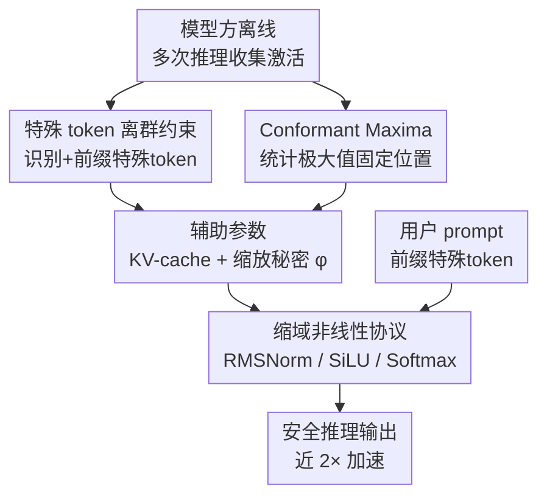

# Secure Outlier-Aware Large Language Model Inference

**会议**: ICLR 2026  
**OpenReview**: [https://openreview.net/forum?id=Tmrjxq4d7w](https://openreview.net/forum?id=Tmrjxq4d7w)  
**领域**: AI安全 / 隐私保护推理 / LLM效率  
**关键词**: 安全多方计算, MPC, LLM 推理, 离群值, 非线性协议

## 一句话总结
本文提出 SOAL 框架，发现 LLM 非线性层（归一化 / 激活 / Softmax）也普遍存在"离群激活"现象，并通过给输入前缀特殊 token 把离群值"关进"固定位置、再针对收窄后的输入域重设计 MPC 非线性协议，在不微调模型的前提下把安全推理中 RMSNorm 提速约 2×、SiLU 约 2×、Softmax 超 3×，整体加速近 2×。

## 研究背景与动机
**领域现状**：安全多方计算（MPC）让用户能在不暴露输入、模型方也不暴露权重的前提下完成 LLM 推理，是云端隐私保护推理的核心方案。但 MPC 下的 Transformer 推理极慢——用 CrypTen 跑 Llama2-7B 一个 64-token 输入要 169.76 秒，512-token 更是飙到 428.95 秒，而明文不到 1 秒。

**现有痛点**：慢的根源在非线性层（Softmax、激活 SiLU/GeLU、归一化 LayerNorm/RMSNorm）。这些协议的复杂度来自"在很宽的输入域上要保证精度"：LLM 激活值能横跨 $10^{-5}$ 到 $10^3$ 好几个数量级，直接用查找表（LUT）协议需要 32-bit 宽，而 LUT 复杂度是 $O(2^n)$，极其昂贵；用 Goldschmidt 之类迭代法则需要更多轮迭代。

**核心矛盾**：现有两条路线都不理想。一条改密码学原语（FSS、VOLE 等）治标不治本；另一条（MPCFormer、SecFormer）干脆把非线性算子换成 MPC 友好的低次多项式，再用知识蒸馏重训——这会改动模型权重、引入训练开销，还让新模型的质量与可信度打问号。

**本文目标**：能不能不改模型、不微调，直接为 MPC LLM 推理设计高效的非线性协议？

**切入角度**：作者借鉴了量化领域的关键洞察——Dettmers 等人发现 LLM 激活/权重呈强烈的"偏态分布"：绝大多数值挤在一个很窄的范围里，只有极少数"离群值"特别大；单独处理这些离群值就能用 FP8 替代 FP32。作者把这个观察从线性层延伸到**非线性层**，发现归一化、激活、Softmax 的输入也都存在同样的离群现象，而正是这些离群值撑大了 MPC 协议必须覆盖的输入域。

**核心 idea**：只要把离群值"管住"，剩下激活的偏态集中分布就能被利用来缩小输入域，从而为非线性算子设计更快的协议。

## 方法详解

### 整体框架
SOAL 面向标准的两方计算（2PC，一个可信 dealer）：$P_0$ 是持有输入 prompt 的用户，$P_1$ 是持有权重的模型方，二者要在不泄露任何中间信息的前提下算出输出。整个框架分两阶段：**准备阶段**由模型方离线完成，利用非线性层的离群观察提取"模型相关的辅助参数"；**推理阶段**用户与模型方按重设计的非线性协议在线跑 MPC，享受缩窄输入域带来的提速。

关键逻辑是一条"离群 → 缩域 → 提速"的链：准备阶段先用前缀特殊 token 把归一化/激活的离群值约束到固定位置（并存进 KV-cache），再统计出 Softmax 输入极大值的固定位置规律（Conformant Maxima）；这两件事都让在线阶段每个非线性算子面对的输入域显著变窄，于是 RMSNorm、SiLU、Softmax 都能用"更少迭代 + 更小查找表"的新协议算出来。

### 关键设计

**1. 特殊 token 离群约束：把归一化/激活的离群值"赶进"前缀位置**

痛点是归一化层激活有长尾——少数离群值横跨好几个数量级，逼着倒数平方根协议覆盖极宽输入域。作者观察到这些离群值的出现与"特殊 token"高度绑定：在 Llama2-7B 里离群值正好落在 `.`（句号）、`\n`（换行）、`<s>`（句首 BOS）这些 token 的位置上。识别办法是统计每个 token 的逐 token 最大激活值 $M\in\mathbb{R}^T$（$T$ 为词表大小），若某 token 的最大值与其余 token 最大值中位数之比超过阈值 $\eta$（设 $M_i/\text{median}(M)>\eta$，取 $\eta=8$），就记为特殊 token。

拿到特殊 token 后，把它们**前缀**到用户 prompt 之前，利用 LLM 的自回归性质，离群值就只在这些前缀位置出现、不再污染用户真实 token 的激活。Violin plot 显示前缀后各层的长尾消失，激活紧密集中在层中心。更妙的是这些前缀 token 的计算可以存成 KV-cache 离线复用，避免在线重复计算；整个识别过程模型方离线几分钟就能搞定，比起为不同任务微调整个模型代价低得多。

**2. Conformant Maxima：用固定位置的局部极大替代 Softmax 的精确 max**

Softmax 在 MPC 下有三大障碍——求 max、求 exp、求倒数，其中**求最大值**最棘手，因为它的通信代价随实际输入长度 $n$ 呈 $O(n\log n)$ 对数线性增长。作者发现 Softmax 输入的极大值位置也有规律：对 $L\times L$ 的注意力 logits 画热力图，前缀特殊 token 后极大值集中出现在 `<bos>` 位置、每行的首 token 以及末两个 token——这正是 StreamLLM 指出的 attention sink 现象。

由此定义 **Conformant Maxima**：只从这几个预定义位置（bos、首位、末两位）采集激活并取局部极大，作为 Softmax 减去的"伪最大值" $\tau$。统计显示超过 90% 的精确极大值位置落在这些预定义位置里，即便不匹配，差值也很小。由于推理时减去的 max 数学上可以替换成任意值 $\tau$（减 max 本是为训练反传时防数值爆炸），用 Conformant Maxima 当 $\tau$ 就能把 $O(n\log n)$ 的精确求 max 整个省掉，让 Softmax 协议对任意输入长度都保持**固定通信代价与轮数**。

**3. 缩域非线性协议：在收窄的输入域上少迭代/小查找表算 RMSNorm、SiLU、Softmax**

离群被管住后，三类非线性算子都能重写成更便宜的协议。**RMSNorm**：激活集中在层中心后，再用逐层秘密缩放值 $\varphi$ 把输入域进一步压窄（缩放因子后续在除法中自动抵消），即把 $\text{RMSNorm}(x)$ 改写为 $\gamma\cdot\frac{\varphi_i\cdot x}{\sqrt{\frac{1}{F}\sum_j(\varphi_i x_j)^2+\epsilon}}+\beta$；输入域缩小后，倒数平方根只需用一个以 $x=1$ 为中心的三次多项式（系数由 BFGS+MSE 拟合，$a=0.913389,b=-0.860195,c=1.028723,d=-0.359165$）给初值，再做**两次** Newton-Raphson 迭代即可——对比 CrypTen 为保精度要 11 次迭代。

**SiLU**：把 sigmoid 改写到以 2 为底 $\sigma(x)=\frac{2^{-x_i\cdot(1-\xi)}}{2^{-x_i(1-\xi)}+2^{x_f}\cdot 2^{x_i\xi}}$（$x_i,x_f$ 为整数/小数部分，$\xi=\mathbb{1}\{x<0\}$），整数部分用小 LUT 查表、分母落在 $(1,2.5)$ 窄域内用二次多项式给倒数初值，只需一次 NR 迭代。**Softmax**：配合设计 2 的 Conformant Maxima，再用一个能处理正负输入的新指数协议（本地截断拿整数/小数部分、product-of-powers 规则各方本地算 $2^{x_f}$、额外 $s$ bit 让小 LUT 覆盖更宽域），并直接取分母最高有效位把倒数缩到小域、两次 NR 算出。这些协议都与具体密码学方案解耦，ASS 与 FSS 都能用。

### 损失函数 / 训练策略
SOAL **不需要任何微调或重训练**——它只在用户输入前加几个特殊 token、并由模型方离线准备辅助参数（特殊 token 列表、KV-cache、缩放秘密 $\varphi$），不改动模型权重。多项式协议的系数（如倒数平方根的 $a,b,c,d$、sigmoid 倒数的 $e,f,g$）由 BFGS 配 MSE 损失离线拟合一次性确定。

## 实验关键数据

### 主实验
512-token prompt 安全推理的时间与通信代价（5 次平均），SOAL vs CrypTen：

| 模型 | 方法 | Softmax 时间(s) | Norm 时间(s) | Activation 时间(s) | 总时间(s) | 总通信(GB) |
|------|------|------|------|------|------|------|
| GPT-2 | CrypTen | 30.79 | 3.07 | 10.89 | 48.86 | 76.79 |
| GPT-2 | **SOAL** | **6.80** | 2.99 | 9.17 | **23.30** | **24.64** |
| Llama2-7B | CrypTen | 199.99 | 27.86 | 87.30 | 428.95 | 702.44 |
| Llama2-7B | **SOAL** | **26.62** | **14.87** | **37.13** | **193.59** | **261.15** |
| Mixtral 8x7B | CrypTen | 242.98 | 65.86 | 264.52 | 1104.46 | 1611.20 |
| Mixtral 8x7B | **SOAL** | **39.66** | **31.25** | **104.44** | **668.23** | **984.50** |

Softmax 提速最猛（GPT-2 30.79→6.80s，超 4×），整体近 2× 加速，且在 MoE 结构的 Mixtral 上同样有效。FSS 方案下（GPT-2，对比 Sigma）：

| Tokens | Sigma 时间(s) | SOAL 时间(s) | Sigma KeySize(GB) | SOAL KeySize(GB) |
|--------|------|------|------|------|
| 512 | 10.048 | **7.577** | 86.686 | **61.830** |
| 1024 | 25.136 | **18.486** | 256.449 | **165.093** |

SOAL 在 FSS 下主要大幅压缩了每次推理需传输的 key size（1024-token 从 256→165 GB），在线时间也更短。

### 消融实验
精度评估（Llama2-7B，SOAL vs 原模型），验证"不掉点"：

| 指标 | Origin | SOAL | 说明 |
|------|--------|------|------|
| Arc Challenge ↑ | 0.4334 | 0.4343 | 基本持平 |
| Arc Easy ↑ | 0.7635 | 0.7618 | 基本持平 |
| HellaSwag ↑ | 0.5713 | 0.5730 | 略升 |
| PIQA ↑ | 0.7807 | 0.7769 | 基本持平 |
| Winograde ↑ | 0.6938 | 0.6993 | 略升 |
| PPL(WikiText) ↓ | 5.55 | 5.58 | 几乎不变 |

跨模型困惑度（WikiText-2 / C4）中，GPT-2、Llama2-7B、Mixtral 的 PPL 与原模型都只差 0.02~1.25，说明前缀特殊 token 几乎不损质量。

### 关键发现
- **Softmax 收益最大、且随序列变长越赚**：Conformant Maxima 把 $O(n\log n)$ 的求 max 降成固定代价，输入序列越长省下的时间越多（Figure 7），这也是整体加速的主要来源。
- **不微调却几乎零掉点**：因为只改用户输入而非模型权重，5 个下游基准与 PPL 基本持平，规避了 MPCFormer/SecFormer 那 1-2% 的退化。
- **RMSNorm 提速靠"缩域换迭代"**：输入域被特殊 token + 缩放秘密 $\varphi$ 双重压窄后，倒数平方根从 11 次 NR 降到 2 次。

## 亮点与洞察
- **把量化里的"离群值"洞察迁到 MPC**：原本 LLM.int8/SmoothQuant 用离群值做量化，本文第一次系统指出非线性层也有离群、且与特殊 token 绑定，进而用它做"输入域缩减"——这是一个非常自然却没人做过的跨领域迁移。
- **"前缀特殊 token"是个极轻量的杠杆**：不动权重、不微调、可存 KV-cache 复用，却同时解决了归一化、激活两类离群和 Softmax 求 max 三个问题，性价比极高。
- **Conformant Maxima 把概率近似变成确定性优化**：利用 attention sink 把"找最大值"这种本质上数据相关的操作降为查固定位置，对任意长度都恒定代价，这个思路可迁移到其他需要安全 reduce/argmax 的协议。

## 局限与展望
- 方法依赖"离群与特殊 token 强绑定"这一经验现象，主要在 decoder-only Transformer（GPT-2/Llama2/Mixtral）上验证；作者也明说 BERT 这类 encoder-decoder 不具备上述现象，方法不适用。
- 特殊 token 阈值 $\eta=8$、各非线性协议的多项式系数都是经验拟合，换新模型需模型方重新离线统计；虽然只要几分钟，但仍是模型相关的准备成本。
- Conformant Maxima 只覆盖 >90% 的精确极大位置，剩余 mismatch 虽差值小，但在极端注意力分布下是否始终安全/精确，论文未给最坏情况分析。
- 评测以效率与 PPL/常识基准为主，缺少更长生成、更复杂任务下隐私-效率-质量三者的压力测试。

## 相关工作与启发
- **vs MPCFormer / SecFormer**：它们把非线性换成低次多项式 + 知识蒸馏重训，改了模型权重、有训练开销、质量存疑；SOAL 不改权重、不微调，只缩输入域并重设计协议，精度几乎无损。
- **vs CrypTen / Sigma（密码学原语路线）**：这些工作优化底层原语或截断协议，但仍按最宽输入域设计非线性算子；SOAL 正交地从"先缩小输入域"入手，可叠加在 ASS（CrypTen）和 FSS（Sigma）等不同方案之上。
- **vs LLM.int8 / SmoothQuant（量化里的离群处理）**：同样利用离群与特殊 token，但目标从"低比特量化"换成"MPC 非线性协议提速"，把同一观察用到了完全不同的下游。

## 评分
- 新颖性: ⭐⭐⭐⭐⭐ 首次把非线性层离群现象与 MPC 协议设计打通，前缀 token + Conformant Maxima 都是新点子。
- 实验充分度: ⭐⭐⭐⭐ 覆盖三种模型、两种密码学方案、效率与精度双评估，但缺最坏情况与长生成压力测试。
- 写作质量: ⭐⭐⭐⭐ 动机链清晰、协议算法给得完整，少量符号（如 $v_1$ 复用）略易混。
- 价值: ⭐⭐⭐⭐⭐ 不微调即近 2× 加速、零掉点，对隐私保护 LLM 推理落地很实用。

<!-- RELATED:START -->

## 相关论文

- [\[AAAI 2026\] SecMoE: Communication-Efficient Secure MoE Inference via Select-Then-Compute](../../AAAI2026/ai_safety/secmoe_communication-efficient_secure_moe_inference_via_select-then-compute.md)
- [\[ACL 2026\] On the (In-)Security of the Shuffling Defense in the Transformer Secure Inference](../../ACL2026/ai_safety/on_the_in-security_of_the_shuffling_defense_in_the_transformer_secure_inference.md)
- [\[ICML 2025\] SecEmb: Sparsity-Aware Secure Federated Learning of On-Device Recommender System with Large Embedding](../../ICML2025/ai_safety/secemb_sparsity-aware_secure_federated_learning_of_on-device_recommender_system_.md)
- [\[ICML 2026\] Differentially Private Preference Data Synthesis for Large Language Model Alignment](../../ICML2026/ai_safety/differentially_private_preference_data_synthesis_for_large_language_model_alignm.md)
- [\[ICML 2026\] FuseFSS: Efficient Secure LLM Inference with Function Secret Sharing](../../ICML2026/ai_safety/fusefss_efficient_secure_llm_inference_with_function_secret_sharing.md)

<!-- RELATED:END -->
