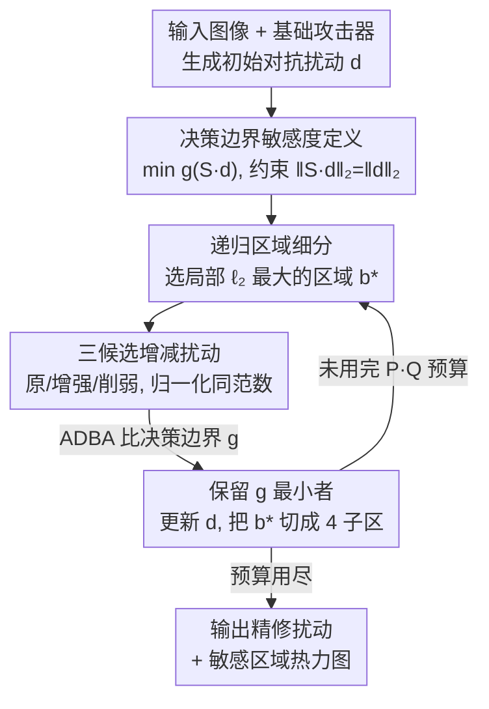

# SeRI: Gradient-Free Sensitive Region Identification in Decision-Based Black-Box Attacks

**会议**: ICLR 2026  
**OpenReview**: [https://openreview.net/forum?id=OQOmOIIX9F](https://openreview.net/forum?id=OQOmOIIX9F)  
**代码**: https://github.com/BUPTAIOC/SeRI  
**领域**: AI安全 / 对抗攻击 / 决策型黑盒攻击  
**关键词**: 决策型黑盒攻击, 敏感区域, 连续敏感度, 决策边界, 扰动优化

## 一句话总结
在只能拿到 top-1 标签、查询预算极紧的决策型黑盒攻击场景下，SeRI 提出一种基于"决策边界"的连续像素敏感度定义，并用递归区域细分 + 局部扰动增减的方式给每个像素估出敏感度权重，作为即插即用的扰动优化器，让 HSJA / CGBA / RayS / ADBA 等主流攻击在相同查询下把 $\ell_2$ 扰动再压低约 15%~30%。

## 研究背景与动机

**领域现状**：决策型黑盒攻击（decision-based attack）是对抗鲁棒性里最苛刻的设定——攻击者拿不到梯度、拿不到置信度、也没有代理模型，只能看到模型对输入的 top-1 预测标签，并且查询次数被严格限制。在这种约束下，主流方法（Boundary Attack、HSJA、CGBA、RayS、ADBA 等）的目标是：在保证误分类的前提下，把扰动的 $\ell_2$（或 $\ell_\infty$）范数压到最小。

**现有痛点**：大量研究早已表明，把扰动集中到图像的"敏感区域"（如鹰的头部这类对预测起决定作用的显著物体），比在全图均匀加噪声效率高得多。但在决策型设定下，怎么找到敏感区域本身就是难题。现有两条路都不够好：①**代理模型/迁移路线**（SGA、AoA、SRA）用白盒可解释性技术在代理模型上生成热力图，但 ViT 和 ResNet 关注的区域往往不同，代理模型的热力图对不上目标模型的关键区域；②**决策型估计路线**，代表是 PAR——它逐块删除扰动、查询模型，按硬标签把区域**二值地**标成"敏感/不敏感"。

**核心矛盾**：PAR 的二值 keep/remove 决策太粗。现实中不同像素对扰动的响应是**连续**的、强弱不一，应当按敏感度成比例地加权扰动，而不是"整块要么全保留、要么全删掉"。更要命的是，已有的连续敏感度定义（Occlusion、SRA、PAR 的压缩比 $S_{\text{PAR}}$）刻画的都是"局部扰动改动 → 模型输出（分数或标签）变化"的局部关系，**没有说清"局部调整如何影响整体扰动的全局有效性"**，因此无法作为平滑迭代细化扰动的连续缩放因子——把某块压到 PAR 阈值会让样本只是勉强成功，再动别处就立刻失败。

**本文目标**：给决策型设定一个真正可用的连续、细粒度敏感度定义，并据此设计一个查询高效、能逐像素自适应优化扰动的方法。

**切入角度**：既然攻击的最终目标是减小决策边界 $g(d)$，那么敏感度就该**直接用"它对决策边界的影响"来定义**，而不是用置信度下降或压缩比这类间接量。

**核心 idea**：定义一个像素级敏感度张量 $S$，使得变换后的扰动 $S \cdot d$ 在保持总能量不变的前提下能最小化决策边界 $g(S \cdot d)$；再用递归区域细分把这个高维优化问题拆成一连串"选区域 → 增/减扰动 → 比决策边界"的低成本迭代。

## 方法详解

### 整体框架

SeRI 不是一个独立攻击，而是接在基础攻击器（HSJA / CGBA / RayS / ADBA）之后的**即插即用扰动优化器**：总查询预算 $Q$ 按比例 $P$ 切分，$(1-P)\cdot Q$ 给基础攻击器先生成一个成功的初始对抗扰动 $d$，剩下 $P\cdot Q$（论文取 $P=20\%$）交给 SeRI 去精修这个扰动。

SeRI 的核心是一个**递归区域细分的迭代循环**。从整图作为初始区域 $b_0$ 出发，每一轮：在当前区域集合里挑出局部 $\ell_2$ 范数最大的区域 $b^\*$；对这个区域同时造出"增强扰动"和"削弱扰动"两个候选，连同原扰动一共三个，用一种低成本的决策边界近似法（ADBA）比谁的决策边界 $g$ 最小，留下最优的;然后把 $b^\*$ 切成四个子区域，进入更细粒度的下一轮。如此往复，扰动被逐像素推向各自的最优敏感度，同时全局 $\ell_2$ 能量保持不变。整个过程不需要梯度、置信度或代理模型，最终还能从精修后的扰动里读出一张敏感区域热力图。

### 关键设计

**1. 基于决策边界的连续敏感度定义：让"敏感度"直接对齐攻击目标**

这是全文的根基，针对"现有敏感度定义说不清局部调整如何影响全局有效性"这个痛点。给定能成功欺骗模型的初始扰动 $d$（即 $I(x+d)=1$），SeRI 把模型的对抗扰动敏感度定义成一个张量 $S \in \mathbb{R}^{C\times W\times H}$，每个元素 $s_{c,w,h}\ge 0$ 是该像素的敏感度权重。优化目标是找一个逐元素相乘后的扰动 $S\cdot d$，在**保持总能量不变**（$\ell_2$ 约束 $\|S\cdot d\|_2 = \|d\|_2$）的前提下最小化决策边界：

$$\arg\min_{S}\; g(S\cdot d),\quad \text{s.t.}\; \|S\cdot d\|_2 = \|d\|_2.$$

其中决策边界定义为 $g(d) = \min\{r>0 : I(x + r\cdot \frac{d}{\|d\|_2}) = 1\}$，即沿扰动方向能成功攻击所需的最小半径。这个定义的妙处在于：它不是去解释模型（像 Grad-CAM、Occlusion），而是**直接用"对决策边界的影响"来衡量像素重不重要**——把更多能量分给真正能拉低 $g$ 的像素、把背景像素的能量收回来。相比 PAR 给每块一个二值标签、或给一个无法当连续缩放因子用的压缩比 $S_{\text{PAR}}(b)$，这里的 $S$ 是连续、逐像素、且天然指导"该怎么重新分配扰动强度"的。

**2. 递归区域细分 + 局部 $\ell_2$ 启发式选区：把高维优化拆成可解的迭代**

直接在 $\mathbb{R}^{C\times W\times H}$ 上优化 $S$ 是个超高维连续问题，几乎无从下手。SeRI 用**迭代区域分裂**来管理复杂度：维护一个互不重叠的块集合 $B_i$，从整图 $b_0=\{1{:}C,1{:}W,1{:}H\}$、$B_0=\{b_0\}$ 开始，每一轮只在**单个块**内调整扰动，调完再把这个块切成四等份子区进入下一轮，于是控制粒度越来越细。

选哪个块来动？用一个简单的启发式：选局部扰动 $\ell_2$ 范数最大的块 $b^\* = \arg\max_{b\in B_i}\|d^i_{[b]}\|_2$，其中 $d^i_{[b]}$ 是把 $d^i$ 限制到区域 $b$ 上。直觉是——局部扰动越大的区域，越有"还能往下压"的潜力，优先去那里抠能量收益最大。论文还说明四等分这个选择对效率基本不敏感（Appendix B.1），所以不是个需要精调的超参。

**3. 三候选增/减扰动 + ADBA 低成本比边界：用极少查询逼出每个像素的最优强度**

选定 $b^\*$ 后，怎么判断它该加扰动还是减扰动？SeRI 在该区域内构造三个候选：原扰动 $d^i_0=d^i$、削弱版 $d^i_1$（用因子 $\check k<1$ 缩小 $b^\*$ 内扰动）、增强版 $d^i_2$（用因子 $\hat k>1$ 放大），论文取 $\check k=0.2,\ \hat k=1.8$。三者都重新归一化到与 $d^i$ 相同的 $\ell_2$ 范数，保证比较时总能量公平：

$$d^i_1 = \frac{\|d^i\|_2}{\|d^i+(\check k-1)d^i\odot M_{b^\*}\|_2}\big(d^i+(\check k-1)d^i\odot M_{b^\*}\big),$$

增强版 $d^i_2$ 把 $\check k$ 换成 $\hat k$ 即可（$M_{b^\*}$ 是 $b^\*$ 的二值掩码，$\odot$ 为逐元素乘）。然后取 $j^\star=\arg\min_{j\in\{0,1,2\}} g(d^i_j)$ 更新 $d^{i+1}=d^i_{j^\star}$：选到 1 说明该区域过敏感、扰动该减；选到 2 说明欠扰动、该加；选到 0 说明已接近局部最优、不动。

要比三个候选的决策边界，关键是别把查询预算烧光。SeRI 借用 ADBA（Approximation Decision Boundary Approach）做低成本的决策边界近似比较——它专为"用极少查询比谁的边界更小"设计。效果非常省：论文给的例子里，优化一张图跑 504 轮 SeRI 迭代总共只用 2001 次查询，约 $2001/504\approx 3.97$ 次/轮。论文还证明了这套更新策略能让决策边界距离**单调下降**并收敛到平稳扰动（Appendix A）。代价是 SeRI 继承了 ADBA 的三条假设：决策边界局部 Lipschitz 连续、局部曲率有界、模型硬标签输出确定——前两条对现代 CNN/ViT 通常成立，第三条排除了随机化防御（如 randomized smoothing）。

## 实验关键数据

### 主实验

在 ImageNet（VGG19、ViT）和 CIFAR-100（对抗训练的 WideResNet）三个模型上，每模型随机选 1000 张测试图，比较 HSJA / CGBA / RayS / ADBA 四个基础攻击器单独、+PAR、+SeRI 三种配置在 2000/5000/10000 查询下的平均（中位数）$\ell_2$ 扰动范数，越小越好。

ImageNet + VGG19（节选）：

| 配置 | 非目标@2k | 非目标@10k | 目标@2k | 目标@10k |
|------|-----------|------------|---------|----------|
| HSJA | 8.18(5.29) | 3.39(1.91) | 72.3(66.5) | 33.7(20.8) |
| HSJA+PAR | 6.65(3.61) | 3.08(1.82) | 53.0(50.1) | 20.4(14.0) |
| HSJA+SeRI | 6.47(3.55) | 2.85(1.51) | **48.3(46.5)** | **18.5(12.3)** |
| CGBA | 3.91(2.02) | 1.19(0.75) | 77.4(74.9) | 40.2(33.1) |
| CGBA+PAR | 2.81(1.55) | 1.03(0.64) | 58.3(55.1) | 23.1(15.6) |
| CGBA+SeRI | 2.92(1.39) | **0.96(0.54)** | **53.0(50.0)** | **21.1(13.3)** |

ImageNet + ViT（非目标，节选）：CGBA+SeRI 在 5k/10k 查询上一致取得最低平均与中位 $\ell_2$（如 10k 时 1.27(0.85) vs CGBA+PAR 1.40(0.94)）；2k 目标攻击下 HSJA+SeRI 最佳。

### 消融 / 对抗训练模型

| 配置（CIFAR-100 WRN，非目标） | @2k | @5k | @10k |
|------|------|------|------|
| HSJA | 3.26(2.22) | 1.75(1.15) | 1.26(0.88) |
| HSJA+PAR | 2.59(1.74) | 1.52(0.79) | 1.18(0.83) |
| HSJA+SeRI | 2.08(1.41) | 1.40(0.70) | 1.13(0.63) |
| RayS | 3.17(2.22) | 2.68(1.84) | 2.49(1.69) |
| RayS+PAR | 2.54(1.79) | 2.29(1.70) | 2.15(1.49) |
| RayS+SeRI | **1.79(1.28)** | **1.55(1.08)** | **1.44(1.01)** |

### 关键发现
- **"Attacker + SeRI" 在几乎所有设定下都优于单独攻击器及其 +PAR 版本**：对任一基础攻击器，加 SeRI 都比加 PAR 强，验证了连续敏感度估计确实提升了查询效率。
- **在对抗训练模型上增益更大**：CIFAR-100 WRN 上 "+SeRI" 相比 "+PAR" 把 $\ell_2$ 再降约 30%，而在普通 VGG/ViT 上约 15%。原因是更强防御需要更精准、更自适应的扰动分配，PAR 的二值机制在这里更吃亏，SeRI 的细粒度搜索优势被放大。
- **热力图可解释**：随迭代推进，高强度（红）区域逐渐收敛聚焦到真正的显著物体（lacewing 本体、鹰头与左翼），背景被标为低强度（蓝），与人类视觉感知吻合；目标攻击则聚焦到目标类物体（minivan 的车轮、车门）。作者也提醒这些热力图是优化的副产物，不应当作模型行为的完整解释。

## 亮点与洞察
- **把"敏感度"重新锚定到攻击的真实目标（决策边界）**：以往可解释性指标解释的是"模型为什么这么判"，但攻击真正关心的是"动哪些像素最能拉低决策边界"。用 $g(S\cdot d)$ 当目标，让敏感度定义和攻击目标天然对齐，是这篇最关键的认知转变。
- **范数归一化的"能量守恒"比较很巧**：三个候选都拉回同一 $\ell_2$ 范数再比边界，相当于在"总扰动预算固定"下问"能量该往哪挪"，避免了简单加大扰动带来的虚假提升，使每轮都是真正的重分配而非加码。
- **递归四分 + 局部 $\ell_2$ 选区**把一个 $C\times W\times H$ 维连续优化变成几乎线性、每轮约 4 次查询的搜索，且有单调下降保证——这套"先粗后细、按潜力选区"的思路可迁移到其他需要在硬标签下做空间自适应优化的任务。

## 局限与展望
- **依赖稳定的硬标签输出**：继承 ADBA 的确定性假设，对随机化/随机平滑类防御不适用（作者明确排除）。
- **对弱显著结构图像增益有限**：杂乱、纹理主导的场景里区域敏感度信息量低，SeRI 相比基础攻击器只有小幅提升。
- **需要一定查询预算**：极低预算（如 <50 次查询）下区域划分太粗，细化无从谈起，改进收益骤减。
- **目前限于图像分类**：作者指出核心思想可推广到检测/分割等多输出任务，需把决策边界比较换成基于分数或多输出的比较——这是有潜力但尚未验证的方向。

## 相关工作与启发
- **vs PAR**: 两者都是决策型区域敏感度优化器、都能当作其他攻击的即插即用模块；但 PAR 用二值 keep/remove 的逐块删除策略，粒度粗、无法反映区域内连续重要性，且其压缩比无法当作平滑细化的缩放因子。SeRI 用连续像素级敏感度 + 增/减双向调整，在所有设定下稳定胜出，对抗训练模型上差距更大。
- **vs 代理/迁移路线（SGA、AoA、SRA）**: 它们靠白盒注意力图或代理模型生成敏感度，需要白盒访问或已知目标数据集，且代理与目标模型关注区域常常不一致；SeRI 完全在硬标签下工作，不需要任何外部模型。
- **vs HardBeat**: HardBeat 只搜一个脆弱 patch 并只扰动它，当多个区域共同影响分类时就不完整；SeRI 通过递归细分覆盖全图、对每个像素连续加权，更全面。

## 评分
- 新颖性: ⭐⭐⭐⭐⭐ 首个给决策型黑盒攻击赋予连续像素级敏感度、并把敏感度定义直接锚定到决策边界的工作
- 实验充分度: ⭐⭐⭐⭐ 2 数据集 3 模型 4 基础攻击器 × 目标/非目标 × 三档预算，对比 PAR 充分；但缺与更多区域感知攻击的横向比较
- 写作质量: ⭐⭐⭐⭐ 动机层层递进、定义与公式清晰，热力图直观；个别符号略密
- 价值: ⭐⭐⭐⭐ 即插即用、对现有 SOTA 攻击普遍有效，对评估模型鲁棒性与防御研究有实用意义

<!-- RELATED:START -->

## 相关论文

- [\[ICLR 2026\] A General Framework for Black-Box Attacks Under Cost Asymmetry](a_general_framework_for_black-box_attacks_under_cost_asymmetry.md)
- [\[ICLR 2026\] Black-Box Privacy Attacks on Shared Representations in Multitask Learning](black-box_privacy_attacks_on_shared_representations_in_multitask_learning.md)
- [\[ICLR 2026\] Traceable Black-box Watermarks for Federated Learning](traceable_black-box_watermarks_for_federated_learning.md)
- [\[AAAI 2026\] Robust Watermarking on Gradient Boosting Decision Trees](../../AAAI2026/ai_safety/robust_watermarking_on_gradient_boosting_decision_trees.md)
- [\[CVPR 2026\] SEBA: Sample-Efficient Black-Box Attacks on Visual Reinforcement Learning](../../CVPR2026/ai_safety/seba_sample-efficient_black-box_attacks_on_visual_reinforcement_learning.md)

<!-- RELATED:END -->
