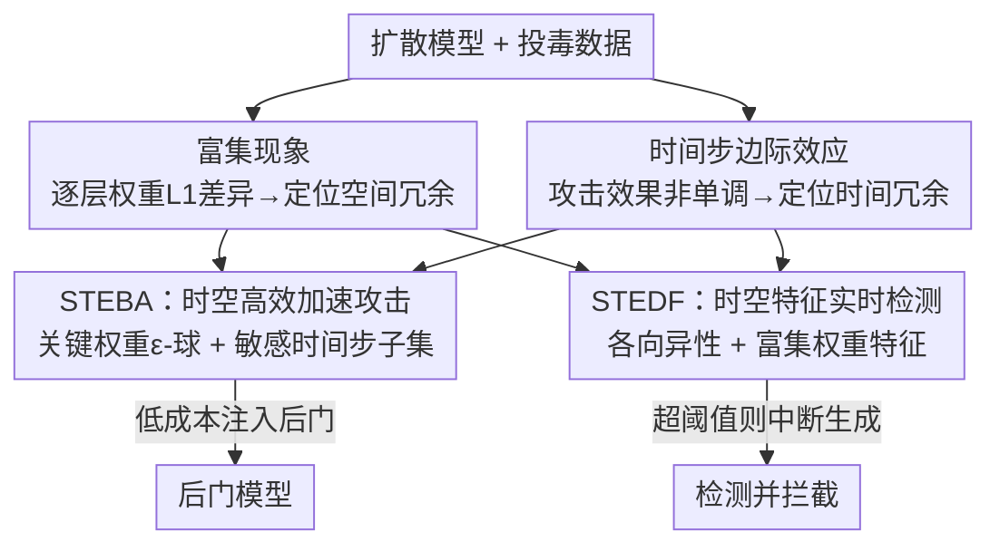

# STEDiff：揭示文生图扩散模型后门攻击中的时空冗余

**会议**: ICLR 2026  
**OpenReview**: [https://openreview.net/forum?id=O02qsgSUtY](https://openreview.net/forum?id=O02qsgSUtY)  
**代码**: https://github.com/paoche11/STEDiff  
**领域**: AI安全 / 扩散模型后门 / 攻击与防御  
**关键词**: 后门攻击, 扩散模型, 时空冗余, 富集现象, 后门检测

## 一句话总结
作者首次揭示扩散模型后门攻击中存在大量"时空冗余"——只有少数关键权重（富集现象）和少数关键时间步（边际效应）真正参与后门注入；据此提出统一框架 STEDiff，攻击端 STEBA 把后门注入加速最高 15.07× 并省 82% 显存，防御端 STEDF 利用时空特征实现最高 99.8% 的实时后门检测。

## 研究背景与动机

**领域现状**：扩散模型是当前图像生成的主流，但已被证明易受后门攻击——攻击者把带触发器（trigger）的投毒样本混进训练集微调模型，上传到 GitHub / Hugging Face 谎称无害，用户下载后一旦输入含触发器，模型就生成攻击者预设的恶意目标（色情、暴力、违法内容）。触发器可注入噪声空间（如 BadDiffusion）或 prompt 空间（如 BadT2I、RickRolling）。

**现有痛点**：后门攻击虽威胁巨大，但执行成本一直很高——无论用 LoRA 还是 DreamBooth，攻击者仍要对整个模型做反向传播和全参数梯度计算，注入一个后门所需资源几乎等同于一次完整微调，这是攻击落地的天然门槛。防御侧也有短板：现有检测方法（如 T2IShield）依赖大量后门样本，而真实威胁模型里攻击者根本不会公开触发器；且它们只能事后判定输入性质，缺乏实时阻断能力，等检测出来恶意输出往往已经送到用户面前。

**核心矛盾**：以往攻防双方都默认"后门注入必须改全部权重、覆盖全部时间步"。作者质疑这个前提：后门注入过程里到底哪些计算是真正有用的、哪些是冗余的？如果存在大量冗余，那既能让攻击变得更轻量（攻击者视角），又能把冗余暴露出的"指纹"用于检测（防御者视角）。

**切入角度**：作者从两个实验观察切入。其一，比较良性模型、后门模型、普通微调模型的逐层权重 L1 差异，发现后门模型的梯度更新异常集中在少数关键权重上——称为**富集现象（enrichment phenomenon）**，说明后门有强烈的空间冗余。其二，后门攻击效果并不随被投毒的时间步数量单调上升，反而投毒过多会损害模型可用性、稀释触发信号——称为**时间步边际效应**，说明存在时间冗余。

**核心 idea**：把后门注入从"改全部权重、覆盖全部时间步"压缩为"只改关键权重、只投毒关键时间步子集"，由此构建攻防一体的 STEDiff——同一份时空冗余洞察，既是更高效攻击 STEBA 的依据，也是更鲁棒防御 STEDF 的特征来源。

## 方法详解

### 整体框架
STEDiff 围绕"后门注入存在时空冗余"这一核心洞察展开：先用两个实验发现（空间上的富集现象、时间上的边际效应）刻画冗余的位置，再分别用于攻击与防御两条线。攻击线 STEBA 把优化收缩到关键权重的 $\epsilon$-球内、只在敏感时间步子集上投毒，从而大幅降低注入成本；防御线 STEDF 在关键层挂 hook 抓取扩散过程的隐状态，建模"各时间步的各向异性 + 富集权重特征"，用一个前馈分类器在推理过程中**实时**判定并拦截后门扩散。两条线共享同一套时空特征，互为镜像。

### 关键设计

**1. 富集现象：揭示后门注入的空间冗余**

针对"后门攻击必须改全部权重、成本高得吓人"这一痛点，作者先用一个度量把冗余可视化出来。对模型 $M$ 与良性基线 $M_{be}$，逐层累加权重差异的 L1 范数 $D_{L1}(M, M_{be}) = \sum_{l=1}^{L} \lVert \theta_M^{(l)} - \theta_{be}^{(l)} \rVert_1$，分别取 $M$ 为微调模型 $M_{ft}$ 和后门模型 $M_{ba}$。结果发现后门模型的更新异常集中堆积在少数关键权重 $\theta_{key}$ 上，远比普通微调更不均匀，作者把这种"全局参数上的异质堆积"命名为富集现象。它的含义是：以往全参数后门攻击里，大量与后门扩散无关的权重也卷进梯度计算，纯属无意义开销。更重要的是，这一现象在 UNet 架构（SD v1.5）和 DiT 架构（SD v3.5、Flux）上都一致出现，说明它是扩散模型后门的**内禀属性**而非个例，为"只改关键权重"提供了可迁移的依据。

**2. 时间步边际效应：揭示后门注入的时间冗余**

针对"后门必须覆盖所有时间步"这一另一个默认前提，作者观察到攻击效果并不随被投毒时间步数 $T$ 单调上升——恰恰相反，投毒过多反而会拉低模型可用性、稀释触发信号，造成攻击成功率下降。其根源与扩散推理的时间冗余一脉相承：扩散模型先在高噪声阶段确定全局布局、再在后续细化局部细节，因此并非每个时间步都对后门映射同等重要。作者发现只让一个时间步子集 $t_b \in T$（通常是中后段）参与后门训练，反而能显著增强攻击。这揭示了一个关键权衡：朴素地"攻击更多时间步"是次优策略，精挑细选最优子集才能在不破坏核心功能的前提下最大化攻击效力。

**3. STEBA：把攻击收缩到关键权重与敏感时间步**

把上面两个发现落到攻击算法上，就是 STEBA。空间上，攻击者不再优化全参数，而是在关键参数附近搜索最小优化边界：$\theta^* = \arg\min_{\theta} \mathcal{L}(\theta)$，约束 $\theta \in B(\theta_{key}, \epsilon)$，其中 $B(\theta_{key}, \epsilon) = \{\theta \mid \lVert \theta - \theta_{key} \rVert_2 \le \epsilon\}$ 是以 $\theta_{key}$ 为心的 $\epsilon$-球——只让真正承载后门的少数权重参与更新。时间上，把时间步集合划分为两个不相交子集 $T = T' \cup T^*$，$|T^*| \ll |T|$，只在 $t^* \in T^*$ 上注入。两者合并为 STEBA 损失：

$$\mathcal{L}_{STEBA} = \mathbb{E}_{t^* \in T^*,\, \epsilon \sim \mathcal{N}(0,I)} \left[ \lVert \epsilon - \epsilon_{\theta^*}(x_t, t^*, c) \rVert_2^2 + \lambda \lVert \epsilon - \epsilon_{\theta^*}(\hat{x}_t, t^*, \hat{c}) \rVert_2^2 \right]$$

其中第一项保良性生成、第二项注入后门（$\hat{x}_t$ 是目标输出、$\hat{c}$ 是含触发器的 prompt），$\lambda$ 为投毒率。STEBA 是通用策略，可套用到离散时间步、SDE、ODE、flow-matching 等大多数扩散框架与采样器上。正因为同时砍掉了空间和时间两类冗余，它能把后门注入加速最高 15.07×、省 82% 显存，甚至在消费级 GPU（如 2060、1080）上也能执行，真正把攻击门槛打下来。

**4. STEDF：用时空特征实现实时检测与拦截**

防御端 STEDF 复用同一套时空冗余洞察——既然冗余会在隐状态里留下"指纹"，就用隐特征而非输出信号来检测，这比依赖输出更鲁棒、更可迁移，因为后门激活与权重分布带来的偏置不随触发器样式改变。具体地，对模块 $m$ 内各层隐状态 $z$，计算相邻时间步的 L2 范数差异 $\Delta_l(t) = \sqrt{\sum_{c,h,w} (z_{l,c,h,w}^{(t)} - z_{l,c,h,w}^{(t-1)})^2}$，再对模块内各层取平均得 $\Delta_m(t) = \frac{1}{|L_m|} \sum_{l \in L_m} \Delta_l(t)$。作者观察到后门一旦被触发，扩散过程的时间特征会在高频噪声区出现显著偏差，即**各向异性（anisotropy）**，且这偏差正源自富集现象对应的权重区域。STEDF 把"权重差异特征 + 时间步打分特征"拼成输入 $\zeta$，喂给一个前馈分类器 $f(\zeta)$，按阈值 $\Gamma$ 判定良性（$y=0$）或恶意（$y=1$），用二分类交叉熵训练。落地上，防御者在关键层预插 hook，检测与推理**并行**进行；当恶意置信度 $P(\zeta)$ 超过阈值 $\Gamma$，框架立刻中断生成，从而在恶意图像成形前就拦截、还省下后续算力。这正好补上了现有方法"依赖大量后门样本、且无法实时阻断"的两个短板。

## 实验关键数据

实验在 COCO-Caption 上、以 SD v1.5 / SD v2.1-base / Realistic Vision v4.0 三个扩散模型为基线，A40（48GB）上完成；学习率 1e-4、AdamW。

### 主实验：攻击效果（STEBA）

评估同时看图像质量（FID）、攻击成功率（ASR）、感知相似度（SSIM/LPIPS），并引入两个专门刻画冗余消减的指标——空间冗余加速比（SRA）与时间冗余加速比（TRA）。

| 方法 | 基线 | FID ↓ | ASR (%) ↑ | SRA ↑ | TRA ↑ |
|------|------|-------|-----------|-------|-------|
| RickRolling | SD v1.5 | 38.72 | 97.9 | 3.07× | 2.96× |
| VillanDiffusion | SD v1.5 | 27.58 | 99.4 | 1.00× | 1.00× |
| **STEBA (Ours)** | SD v1.5 | **22.06** | **99.6** | **5.55×** | **15.07×** |
| **STEBA (Ours)** | SD v2.1 | 27.58 | 98.6 | 4.60× | 15.01× |
| **STEBA (Ours)** | RV v4.0 | 26.86 | 95.4 | 4.41× | 10.66× |

STEBA 在保持甚至降低 FID（图像质量更好）、攻击成功率不降的同时，把时间维加速推到 15.07×，证明被砍掉的时空冗余对攻击效果几乎无损、有时反而有益。

### 检测效果（STEDF）

在词、短语、特殊字符、符号、随机乱码五类触发器词表上评估，指标含后门检测率（BDR）、TPR、FPR、TNR、FNR，以及衡量能否成功中断恶意传播的拦截成功率（CSR）。

| 方法 | 触发器类型 | BDR (%) ↑ | FPR (%) ↓ | CSR (%) ↑ |
|------|-----------|-----------|-----------|-----------|
| T2IShield | Phrases | 92.6 | 7.5 | - |
| T2IShield | Special Chars | 94.8 | 6.1 | - |
| **STEDF (Ours)** | Phrases | **99.8** | **0.5** | 99.8 |
| **STEDF (Ours)** | Special Chars | **100** | **0** | 100 |
| **STEDF (Ours)** | Random/Garbled | 98.1 | 2.9 | 81.0 |

STEDF 在各类触发器上 BDR 普遍逼近 99-100%，FPR 压到接近 0，且具备 T2IShield 没有的实时拦截能力（CSR），并能在恶意扩散过程中至少省下 20% 算力。

### 关键发现
- **冗余可砍且近乎无损**：消除空间/时间冗余对攻击成功率几乎没有负面影响，甚至 FID 还更低——直接证明以往全参数、全时间步后门是在做大量无意义计算。
- **富集现象跨架构通用**：UNet（SD v1.5）与 DiT（SD v3.5、Flux）上都出现，说明它是扩散后门的内禀属性，攻防结论可迁移。
- **时间步"越多越好"是错觉**：投毒过多时间步会损害模型可用性、稀释触发信号，反而拉低攻击成功率，最优子集多落在中后段。
- **隐特征检测优于输出检测**：基于各向异性的时空特征不随触发器样式变化，因此对乱码等各类触发器都稳健，且无需依赖大量后门样本。

## 亮点与洞察
- **同一洞察打通攻防**：把"时空冗余"这一发现同时变成更高效的攻击和更鲁棒的防御，攻击暴露的指纹恰好是防御的特征来源，攻防一体的设计很优雅。
- **富集现象 + 边际效应是可复用的分析工具**：逐层权重 L1 差异定位关键权重、攻击效果对时间步的非单调性定位关键时间步，这两套度量可迁移到分析其他生成模型的后门/微调行为。
- **hook 并行检测 + 实时拦截**：把检测嵌进推理过程而非事后判定，在恶意图像成形前中断，既安全又省算力，对真实部署很有现实意义。

## 局限与展望
- **STEDF 不做触发器反演**：它定位为监控与拦截框架，不还原触发器本身——作者承认这一点，但认为不影响其阻断后门的有效性。
- **防御依赖白盒权限**：STEDF 需要在关键层插 hook、访问中间激活和权重，属于防御者拥有完整模型权限的设定，对纯黑盒部署场景适用性有限。
- **关键权重/时间步选择的稳健性**：$\theta_{key}$ 与敏感时间步子集 $T^*$ 的选取策略（论文部分细节放在附录）对不同模型族是否都最优、是否会被自适应攻击者规避，仍有待更系统的验证。
- **双刃剑风险**：STEBA 显著降低了后门攻击门槛，虽配套了 STEDF，但其攻击能力本身具有被滥用的伦理风险。

## 相关工作与启发
- **vs VillanDiffusion / RickRolling（攻击）**：它们仍做全参数、全时间步注入，STEBA 把优化收缩到关键权重 $\epsilon$-球与敏感时间步子集，在 ASR 不降、FID 更优的前提下实现 15× 量级的时间加速与 82% 显存节省。
- **vs T2IShield / TERD / Elijah（防御）**：T2IShield 依赖大量后门样本、靠 UNet 注意力的"同化现象"检测且无实时拦截；STEDF 改用跨时间步隐状态的各向异性 + 富集权重特征，不依赖投毒样本、BDR 更高（最高 99.8% vs ~94.8%），并能在生成中途中断恶意扩散。

## 评分
- 新颖性: ⭐⭐⭐⭐⭐ 首次揭示扩散后门的时空冗余，并用同一洞察打通攻防两端。
- 实验充分度: ⭐⭐⭐⭐ 三基线 + 五类触发器 + 多指标，攻防都验证；但更强自适应攻击与黑盒场景验证偏少。
- 写作质量: ⭐⭐⭐⭐ 动机与发现讲得清楚，部分公式与符号（如 $\theta_{key}$ 选取）细节放在附录。
- 价值: ⭐⭐⭐⭐⭐ 同时揭示"攻击门槛被低估"与"实时防御可行"，对扩散模型安全有现实警示意义。

<!-- RELATED:START -->

## 相关论文

- [\[ICLR 2026\] Dataless Weight Disentanglement in Task Arithmetic via Kronecker-Factored Approximate Curvature](dataless_weight_disentanglement_in_task_arithmetic_via_kronecker-factored_approx.md)
- [\[ICLR 2026\] TrojanTO: Action-Level Backdoor Attacks Against Trajectory Optimization Models](trojanto_action-level_backdoor_attacks_against_trajectory_optimization_models.md)
- [\[ICLR 2026\] Towards a Certificate of Trust: Task-Aware OOD Detection for Scientific AI](towards_a_certificate_of_trust_task-aware_ood_detection_for_scientific_ai.md)
- [\[ICLR 2026\] NatADiff: Adversarial Boundary Guidance for Natural Adversarial Diffusion](natadiff_adversarial_boundary_guidance_for_natural_adversarial_diffusion.md)
- [\[ICLR 2026\] Reliable Poisoned Sample Detection against Backdoor Attacks Enhanced by Sharpness-Aware Minimization](reliable_poisoned_sample_detection_against_backdoor_attacks_enhanced_by_sharpnes.md)

<!-- RELATED:END -->
