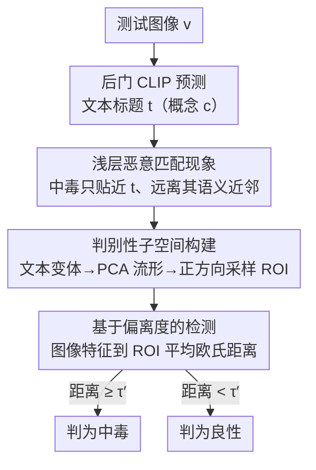

# Test-Time Poisoned Sample Detection by Exploiting Shallow Malicious Matching in Backdoored CLIP

**会议**: ICLR 2026  
**OpenReview**: [https://openreview.net/forum?id=Kpij6oOnJl](https://openreview.net/forum?id=Kpij6oOnJl)  
**领域**: AI 安全 / 后门防御 / 多模态 CLIP  
**关键词**: 后门攻击, 中毒样本检测, CLIP, 文本流形, 测试时防御

## 一句话总结
本文发现被植入后门的 CLIP 在中毒图像上只是"浅层恶意匹配"——图像特征贴近目标文本本身却远离它的语义近邻，据此提出 Subspace Detection：在测试时用文本变体重建预测概念的局部文本流形，沿正方向采样出一块判别性最强的"兴趣区域"，再用图像特征到该区域的欧氏距离把中毒样本检出来，在 7 种 SOTA 后门攻击、3 个数据集上 AUROC 大幅领先现有检测方法。

## 研究背景与动机

**领域现状**：CLIP 靠 4 亿图文对预训练得到强语义对齐能力，可零样本迁移到下游分类。但近期工作（BadCLIP、TrojVQA、Carlini & Terzis 等）证明 CLIP 极易被后门攻击：攻击者在预训练数据里掺入少量"带触发器图像 + 目标标签文本"的中毒对，微调后得到的后门 CLIP 会把任何带触发器的图像强行匹配到攻击者预设的目标标签，而对干净图像表现正常，隐蔽性极高。

**现有痛点**：测试时中毒样本检测（test-time detection）是一种重要防线，但现有方法如 STRIP、SCALE-UP、TeCo 大多为单模态模型设计，迁移到 CLIP 这类多模态模型上效果很差；少数多模态做法（单一文本变换如描述改写、字体变形、语言翻译）则严重依赖手工挑选的单个文本变体，对不同攻击缺乏泛化性——某种变换对 WaNet/BadCLIP 有效，换个攻击就失灵。

**核心矛盾**：后门 CLIP 究竟在中毒样本上"改变"了什么？作者观察到一个关键现象：后门 CLIP 走的是"捷径"。后门学习只是在 CLIP 原有良性匹配能力之上加了一层浅层的、脆弱的"触发器→目标文本"关联，CLIP 本身的语义理解被"锁死"没被真正改写。因此中毒图像与目标文本的恶意匹配**无法泛化到目标文本的语义等价变体**——这就是"浅层恶意匹配"。

**本文目标**：把"浅层匹配 vs 深层匹配"这个定性现象，转化成一个稳健、跨攻击通用的二分类检测器。

**切入角度**：CLIP 的文本特征位于一个低维流形上，同一概念的文本特征聚在同一块局部流形。于是"图像特征相对其预测概念的局部文本流形的位置关系"就成了判别良性/中毒的信号——良性图像贴近整片局部流形，中毒图像只贴近目标文本那一个点、却偏离整片流形。

**核心 idea**：用预测文本的语义等价变体重建局部文本流形，并在其中探测一块能最大化放大两类图像差异的"兴趣区域"，用图像特征到该区域的偏离度做检测。

## 方法详解

### 整体框架

方法要解决的是：给定一个后门 CLIP 和一张测试图像 $v$，判断它是否中毒。整体流程是先用后门模型预测出图像的文本标题 $t$（对应概念 $c$），再围绕 $t$ 重建概念 $c$ 的局部文本流形并在其中找出判别性最强的区域，最后量化图像特征到该区域的距离并卡阈值。核心动机（已在动机部分的实证中验证）是：良性图像因深层匹配会贴近整片局部流形，中毒图像因浅层匹配只贴近 $t$ 一个点，因此对图像-流形位置关系做放大就能把两者拉开。

为避免依赖单个手工文本变体，作者不是只比一两个变体，而是从局部流形中采样大量文本特征，用图像特征到它们的平均距离作为更稳定的检测度量。整条流水线如下：

### 关键设计

**1. 浅层恶意匹配 vs 深层良性匹配：把后门痕迹定位到"语义近邻"上**

这是全文的地基，针对的是"后门 CLIP 到底留下了什么可检测的痕迹"这个根本问题。作者定义两种图文匹配模式：深层匹配（deep matching）指图像特征不仅靠近某一个具体文本特征，还靠近该文本在局部流形上的整片语义等价变体邻域，体现真正的、对语义保持变换鲁棒的理解；浅层匹配（shallow matching）则是图像特征只对齐到流形上孤立的一个点、却远离它的语义近邻，是脆弱的表层对齐——任何对文本的语义保持改动都会打破它。

作者据此提出假设：良性图像走深层匹配，特征贴近预测概念的整片局部文本流形；中毒图像走浅层匹配，特征偏离目标概念的局部流形。验证方式很直接：对预测标题做三类语义保持变换（描述改写、字体变形、语言翻译），分别计算图像特征到"原文本"和到"变体文本"的欧氏距离。结果很有意思——对原文本，中毒图像到目标文本的距离甚至比良性图像还略小（说明中毒图像对目标文本过拟合）；但一旦换成语义等价变体，中毒图像到变体的距离显著增大，而良性图像依然贴近变体。这个"对原文本贴得很近、对变体突然变远"的反差，正是浅层匹配的指纹，也是后续检测的全部依据。

**2. 判别性子空间构建：用文本变体重建流形，再沿正方向采样放大差异**

这一步针对的痛点是：只比单个手工变体既不稳健也不通用。作者把它拆成三小步。① 变体收集：对预测文本 $t$ 施加三类变换——$m_f$ 个字体变形、$m_d$ 个描述改写、$m_l$ 个语言翻译，共 $m=m_f+m_d+m_l$ 个手工变体，得到它们的特征集合 $Z'_t$。② 流形近似：令 $z_t=\hat f_t(t)$，对 $Z_t=\{z_t\}\cup Z'_t$ 做主成分分析（PCA），拟合出一个 $K$ 维仿射子空间 $S$ 作为局部文本流形的线性近似。

但 $S$ 太宽泛，直接均匀采样会采到偏离原概念太远、失去判别力的点。于是 ③ 兴趣区域刻画：对每个手工变体特征，先定义"正方向"为从预测文本特征 $z_t$ 指向该变体特征的向量；然后从每个变体出发、沿正方向**继续远离** $z_t$ 采样 $n$ 个新文本特征，并只保留那些与 $z_t$ 余弦相似度仍接近原变体水平的样本（防止语义跑偏）。把新采样点与手工变体并起来用一个高斯分布 $p$ 建模，就近似出兴趣区域。其巧妙之处在于：兴趣区域被刻意往"远离 $z_t$ 的方向"推——良性图像本就贴近整个语义邻域（星点+变体），所以仍靠近这块区域；中毒图像只贴近 $z_t$ 这个星点、本来就离变体较远，把区域再往外推就进一步放大了它与判别区域的距离。为放松单高斯假设，作者把"采样-过滤-建模"重复 $L$ 次，得到 $L$ 个高斯混合成均匀混合分布 $p_{mix}$，更贴合真实兴趣区域。

**3. 基于偏离度的检测：图像特征到兴趣区域的平均欧氏距离卡阈值**

有了 $p_{mix}$，检测就归结为量化测试图像特征 $z_v=\hat f_v(v)$ 相对兴趣区域的偏离。作者从 $p_{mix}$ 采样 $n_s$ 个特征 $\{z_d^{(i)}\}$，以 $z_v$ 到它们的平均欧氏距离作为检测度量，再卡阈值 $\tau'$：

$$
B(z_v, z_t)=\mathbb{I}\!\left(\frac{1}{n_s}\sum_{i=1}^{n_s} d_2\!\left(z_v - z_d^{(i)}\right)\ge \tau'\right)
$$

其中 $\mathbb{I}(\cdot)$ 为指示函数，$B=1$ 判为中毒、$B=0$ 判为良性，$d_2(\cdot)$ 为 L2 范数。阈值 $\tau'$ 由防御者持有的一小份良性参考集 $D_{ref}$ 标定。相比只比单个变体距离，"到一整片判别区域的平均距离"把噪声平均掉、并把浅层匹配的脆弱性集中到一个稳定标量上，这正是它跨攻击通用的原因。

### 损失函数 / 训练策略
本方法是**测试时检测**，不训练、不改动后门 CLIP，也不需要触发器或中毒样本的先验。防御者只需能查询模型得到图文特征，外加一小份良性下游数据作为参考集 $D_{ref}$ 来标定阈值 $\tau'$。关键超参为子空间维度 $K$、每类变换数量 $m_f/m_d/m_l$、沿正方向采样数 $n$、兴趣区域建模重复次数 $L$（实验取 $L=3$）与检测采样数 $n_s$。

## 实验关键数据

### 主实验
模型为开源 CLIP（视觉编码器 ResNet-50），在 CC3M 的 50 万图文对上注入后门，于 ImageNet-1K / ImageNet-R / ImageNet-Sketch 的零样本分类上评测；攻击覆盖 7 种 SOTA（BadNets、Blended、SIG、WaNet、TrojVQA、Carlini & Terzis、BadCLIP），指标用 AUROC 与 F1。下表为三个数据集上各方法的平均 AUROC / F1：

| 数据集 | 指标 | SCALE-UP | STRIP | 描述改写 | 字体变形 | 语言翻译 | Subspace（本文） |
|--------|------|----------|-------|----------|----------|----------|------------------|
| ImageNet-1K | AUROC | 0.577 | 0.456 | 0.686 | 0.600 | 0.589 | **0.922** |
| ImageNet-1K | F1 | 0.696 | 0.668 | 0.686 | 0.697 | 0.690 | **0.913** |
| ImageNet-R | AUROC | 0.543 | 0.480 | 0.651 | 0.525 | 0.538 | **0.858** |
| ImageNet-Sketch | AUROC | 0.427 | 0.466 | 0.649 | 0.525 | 0.543 | **0.873** |

单模态方法（SCALE-UP、STRIP）对多模态攻击几乎失效，且在 ImageNet-R/Sketch 这类更难的数据集上进一步退化；单一文本变换（字体/语言）只对 WaNet、BadCLIP 等部分攻击有效，缺乏跨攻击泛化。Subspace Detection 在所有数据集×攻击组合上均稳定领先，例如在 ImageNet-1K 上对 Carlini & Terzis 攻击 AUROC 达 0.994、对 BadCLIP 达 0.966。

### 消融实验

| 配置 | 关键指标（典型攻击 AUROC） | 说明 |
|------|---------------------------|------|
| 正方向采样 | BadNets 0.962 / C&T 0.994 / WaNet 0.931 | 完整设计 |
| 负方向采样 | BadNets 0.525 / C&T 0.702 / WaNet 0.246 | 采样方向反向后大幅崩塌 |
| 仅单一变换（最差） | BadNets 0.749 / WaNet 0.543 | 单变换泛化差 |
| 字体+描述 | BadNets 0.953 / WaNet 0.913 | 两两组合明显抬高下限 |
| 三变换联合 | 进一步提升 | 收益主要来自变换间协同 |
| 建模次数 $L$:1→2→3→4 | 随 $L$ 上升、1→2 提升最明显 | 综合算力取 $L=3$ |

### 关键发现
- **采样方向是命门**：正方向（远离原文本）把兴趣区域往中毒图像反方向推，AUROC 高达 0.93-0.99；一旦反向（负方向），WaNet 上 AUROC 暴跌到 0.246，说明"沿正方向放大差异"是检测有效的根本机制。
- **多变换协同 > 单变换**：单一文本变换泛化性差（WaNet 上描述改写仅 0.543），但两两组合就把最差情形显著抬高，三变换联合再升一截——性能增益主要来自变换间的协同而非某一种变换。
- **场景差异**：在更抽象的 ImageNet-Sketch、ImageNet-R 上整体略有下滑，但本方法仍稳定优于所有对比方法；对传统 SIG 攻击相对偏弱（如 ImageNet-1K 上 AUROC 0.692），是相对短板。

## 亮点与洞察
- **把"后门痕迹"重新定义在语义近邻上**：以往检测盯着像素扰动一致性或预测熵，本文转而盯"图像特征对预测文本的语义等价变体是否同样贴近"，把后门的脆弱性暴露在文本流形几何上——这个视角迁移性很强，凡是依赖"表层捷径"的多模态后门都可能留下类似痕迹。
- **正方向采样放大差异**：不是被动测距离，而是主动把判别区域往"良性近、中毒远"的方向推，相当于为检测构造了一个最优探针，这个"沿正方向探测兴趣区域"的思路可迁移到其他需要放大两类样本细微差异的检测任务。
- **完全测试时、零训练**：不需触发器先验、不改模型、不需中毒样本，只要能取特征 + 一小份良性参考集，部署成本极低。

## 局限与展望
- 方法依赖"后门只造成浅层匹配"这一假设，若出现专门让恶意匹配也能泛化到语义变体的自适应攻击（论文在附录 F.2 讨论了自适应攻击，正文未充分展开），检测信号可能被削弱。
- 对传统单模态触发器攻击 SIG 表现相对偏弱（AUROC 0.62-0.69），且在更抽象的 Sketch/R 数据集上有下滑，泛化边界仍受图像域影响。
- 文本变体由 GPT-4 等生成描述改写、阿拉伯语翻译、字体变形构成，变体质量与多样性直接影响流形近似，依赖外部 LLM 可能引入额外不确定性；计算开销（多次采样×建模）随 $L$、$n$ 增大，附录 F.4 有分析但正文未给精确数字。

## 相关工作与启发
- **vs STRIP / SCALE-UP**：二者为单模态后门设计，靠输入扰动后的预测熵/一致性判别；迁移到多模态 CLIP 上几乎失效（平均 AUROC 0.43-0.58），本文专为 CLIP 的图文流形几何设计，差距悬殊。
- **vs 单一文本变换检测（描述改写/字体变形/语言翻译）**：它们只比图像到"原文本 vs 单个变体"的相似度差，依赖手工挑变体、对不同攻击泛化差；本文把这些变换统一进 PCA 子空间 + 正方向采样 + 高斯混合，用"到整片判别区域的平均距离"取代单点比较，稳健性和通用性都更强。
- **vs BDetCLIP**：BDetCLIP 比较图像对"类相关描述"与"类扰动随机文本"的余弦相似度差，本文则从流形几何出发主动构造判别区域，附录 F.4 给出了对比。

## 评分
- 新颖性: ⭐⭐⭐⭐⭐ "浅层恶意匹配"这一现象的发现与"正方向采样放大差异"的设计都很有原创性
- 实验充分度: ⭐⭐⭐⭐ 覆盖 7 种攻击×3 个数据集 + 多项消融，但 ViT 编码器、自适应攻击、算力分析都放在附录，正文略单薄
- 写作质量: ⭐⭐⭐⭐⭐ 从现象→假设→验证→方法的逻辑链非常清晰，配图直观
- 价值: ⭐⭐⭐⭐⭐ 测试时零训练、可即插即用的 CLIP 后门防御，实用价值高

<!-- RELATED:START -->

## 相关论文

- [\[ICLR 2026\] Reliable Poisoned Sample Detection against Backdoor Attacks Enhanced by Sharpness-Aware Minimization](reliable_poisoned_sample_detection_against_backdoor_attacks_enhanced_by_sharpnes.md)
- [\[CVPR 2026\] When CLIP Sees More, It Fights Back Harder: Multi-View Guided Adaptive Counterattacks for Test-Time Adversarial Robustness](../../CVPR2026/ai_safety/when_clip_sees_more_it_fights_back_harder_multi-view_guided_adaptive_counteratta.md)
- [\[ICLR 2026\] Adversarial Attacks Already Tell the Answer: Directional Bias-Guided Test-time Defense for Vision-Language Models](adversarial_attacks_already_tell_the_answer_directional_bias-guided_test-time_de.md)
- [\[CVPR 2026\] TTP: Test-Time Padding for Adversarial Detection and Robust Adaptation on Vision-Language Models](../../CVPR2026/ai_safety/ttp_test-time_padding_for_adversarial_detection_and_robust_adaptation_on_vision-.md)
- [\[CVPR 2026\] A Provable Energy-Guided Test-Time Defense Boosting Adversarial Robustness of Large Vision-Language Models](../../CVPR2026/ai_safety/a_provable_energy-guided_test-time_defense_boosting_adversarial_robustness_of_la.md)

<!-- RELATED:END -->
