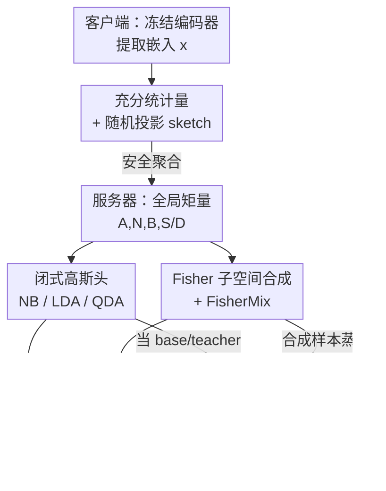

# The Gaussian-Head OFL Family: One-Shot Federated Learning from Client Global Statistics

**会议**: ICLR 2026  
**OpenReview**: [https://openreview.net/forum?id=qqoQKCulZt](https://openreview.net/forum?id=qqoQKCulZt)  
**代码**: 见论文附录 E（GH-OFL 实现仓库链接）  
**领域**: 联邦学习 / 隐私保护  
**关键词**: 单轮联邦学习, 高斯判别头, 充分统计量, Fisher 子空间, 数据无关合成

## 一句话总结
GH-OFL 让客户端只上传一次"类条件充分统计量"（计数、一阶/二阶矩），服务器据此直接拼出闭式高斯判别头（NB/LDA/QDA）并在 Fisher 子空间里合成无关数据训练两个轻量头（FisherMix、Proto-Hyper），在强非 IID 下用单轮通信就达到 OFL SOTA 精度，且全程不碰原始数据。

## 研究背景与动机
**领域现状**：经典联邦学习（如 FedAvg）靠"客户端本地训练 → 上传模型/梯度 → 服务器聚合"的多轮迭代来收敛。论文给出的实测数字很扎心：联邦 MNIST 在 IID 下要 18 轮到 99%、非 IID 下要 206 轮；CIFAR-10 要约 154 轮才到 75%、超过 425 轮才到 80%；CIFAR-100 近 700 轮才把精度从 40% 抬到 50%；在严重非 IID 切分下，CIFAR-10 哪怕只要 55% 精度都可能需要 1700+ 轮。

**现有痛点**：多轮通信意味着高带宽、强同步、对延迟敏感，而且反复传模型/梯度会暴露大量攻击面（梯度反演、成员推断、属性推断），在异构数据下还会进一步退化。为缓解这点出现了单轮联邦学习（OFL），但现有 OFL 方法要么依赖公开/代理数据集做知识蒸馏（FedMD、FedDF、DENSE），要么假设客户端模型同构、要么要上传额外数据或完整模型——都不够"干净"。

**核心矛盾**：要么把"学习"留在客户端（多轮、暴露面大），要么把"学习"挪到服务器但得借助公开数据或上传模型。能不能既只通信一次、又完全不碰任何真实数据（包括代理数据）、还能扛住强非 IID？

**本文目标**：构造一个 (1) 单轮、(2) 严格 data-free、(3) 不要求客户端推理、(4) 在强标签偏斜下依然稳的 OFL 方案。

**切入角度**：作者沿用 Guan et al. (2025) "为 OFL 捕获全局特征统计量"的思路并加以扩展——既然客户端都用一个**冻结的预训练编码器**把数据映射成嵌入向量，那么"类条件高斯"假设在这种嵌入空间里往往近似成立；而高斯模型的全部参数（类均值、类先验、协方差）都只需要**一阶和二阶矩**，而这些矩在客户端之间是**可加聚合**的。

**核心 idea**：客户端只上传可加聚合的类条件充分统计量，把"建模型"整体搬到服务器，用闭式高斯判别 + Fisher 子空间里的无关数据合成来恢复精度，让非 IID 在"类平衡合成"这一步被天然化解。

## 方法详解

### 整体框架
GH-OFL 是一个 server-centric（以服务器为中心）的方案，整条管线只有"客户端算统计量 → 安全聚合 → 服务器拼头"三大步，没有任何回环。

客户端侧：每个设备用冻结的 ImageNet 预训练骨干（如 ResNet-18，取倒数第二层 $d=512$ 维嵌入）把本地数据编码成嵌入 $x\in\mathbb{R}^d$，可选地用一个公开随机投影矩阵 $R\in\mathbb{R}^{d\times k}$（$k\ll d$，共享随机种子）把 $x$ 压成 $z=xR$，然后在 $z$（或 $x$）空间累积**类条件充分统计量**：类计数、类一阶矩、（按所选头需要的）二阶矩。这些量经安全聚合（secure aggregation）后，服务器只看得到跨客户端的全局和 $\sum_u(\cdot)$，看不到任何单个客户端贡献，也看不到原始样本或梯度。

服务器侧分两条腿（对应论文 GH-OFL-CF 和 GH-OFL-TR 两族）：一条腿直接从全局矩量解出三种**闭式高斯判别头**（NBdiag / LDA / QDA），即拼即用；另一条腿先用全局矩量估计一个 **Fisher 判别子空间**，在该子空间里按类条件高斯采样出"Fisher-ghost"合成样本，再用这些纯合成样本训练两个轻量头——线性头 **FisherMix** 和低秩残差头 **Proto-Hyper**（用闭式高斯头当老师做蒸馏）。整套训练只发生在服务器、只吃合成特征，因此严格 data-free。

### 关键设计

**1. 类条件充分统计量上传 + 随机投影 sketch：把"通信一次"做成可加聚合的矩量**

为了消掉多轮通信和模型/梯度暴露，客户端 $u$ 不传任何模型，只在本地数据 $D^{(u)}=\{(x_i,y_i)\}$ 上累积五种线性统计量：类一阶矩 $A_c^{(u)}=\sum_{i:y_i=c} x_i$、类计数 $N_c^{(u)}$、全局二阶矩 $B^{(u)}=\sum_i x_i x_i^\top$、类二阶矩 $S_c^{(u)}=\sum_{i:y_i=c} x_i x_i^\top$、类对角平方和 $D_c^{(u)}=\sum_{i:y_i=c}(x_i\odot x_i)$。它们对客户端求和即得全局量 $A_c=\sum_u A_c^{(u)}$ 等。这些矩量足以还原所有高斯参数：类均值 $\mu_c=A_c/N_c$、类先验 $\pi_c=N_c/\sum_j N_j$、共享协方差

$$\Sigma_{\text{pool}}=\frac{1}{N-C}\Big(B-\sum_c N_c\,\mu_c\mu_c^\top\Big),\qquad \Sigma_c=\frac{1}{N_c-1}\big(S_c-N_c\mu_c\mu_c^\top\big).$$

它之所以有效，关键在**划分不变性**：对数据集 $D$ 的任意客户端划分 $\{I_u\}$，安全聚合得到的全局矩量与"逐样本求和"完全相等，因此无论 Dirichlet $\alpha$ 取多小（即非 IID 多严重），服务器拿到的 $\mu_c,\pi_c,\Sigma_{\text{pool}},\Sigma_c$ 都一模一样。这就是 GH-OFL 在表 1 里"同一方法跨 $\alpha=0.05/0.10/0.50$ 精度恒定"的根因。为进一步省带宽和加隐私，客户端可用公开矩阵把统计量直接搬到投影空间：由线性性有 $A_c^z=A_cR,\ B^z=R^\top BR,\ S_c^z=R^\top S_cR$，每客户端载荷只 $O(Ck+k^2)$，与本地样本量无关。

**2. 闭式高斯判别头（NBdiag / LDA / QDA）：一个矩量、三种协方差假设，即拼即用**

第一条腿不训练任何参数，直接从全局矩量解出三种高斯头，区别只在对协方差的假设强弱。**NBdiag** 给每类一个对角协方差（用 $D_c/N_c-\mu_c\odot\mu_c$ 估逐维方差），只建模异方差、不建模维间相关，极轻且在嵌入近似轴对齐时鲁棒；**LDA** 假设所有类共享一个协方差 $\Sigma_{\text{pool}}$，判别函数对 $x$ 线性，权重 $W_c=\Sigma_{\text{pool}}^{-1}\mu_c$ 加对数先验，footprint 极小、推理快，还能当合成时的老师；**QDA** 给每类各自的满协方差 $\Sigma_c$，表达力最强，能刻画类相关的形状和相关性，但要存 $S$，代价 $O(Cd^2)$，在高维骨干（如 ResNet-50 的 $d=2048$）下常常不可行。三者都套同一套收缩（shrinkage）做数值稳定：

$$\tilde\Sigma=(1-\alpha)\Sigma+\alpha\,\frac{\operatorname{tr}(\Sigma)}{d}I,\quad \alpha\in[0,1],$$

对 $\Sigma_{\text{pool}}$（LDA/Fisher）和 $\Sigma_c$（QDA）都用，避免小样本下协方差求逆病态。这一族的价值在于"零训练即得一个不弱的全局模型"，并为第二条腿提供老师与基线。

**3. Fisher 子空间合成 + FisherMix：在最判别的方向上造无关数据、再训一个线性头**

闭式高斯头会有系统性偏差（嵌入并非严格高斯），但又不能用真实数据去纠偏。作者的做法是先压维再合成：判别结构往往集中在一个低维子空间里（类间散度压过类内散度），于是解广义特征问题 $S_B v=\lambda S_W v$（取 $S_W=\Sigma_{\text{pool}}$），用前 $k$ 个特征向量列成 $V$，把所有矩量投到 $z^f=V^\top x$。在这个 Fisher 子空间里，服务器按类条件高斯**采样合成样本**

$$z^f\sim\mathcal{N}\big(\mu_c^f,\ \tau^2\,\tilde\Sigma_c^f\big),$$

其中 $\tilde\Sigma_c^f$ 是有 $S_c$ 时的收缩类协方差、否则退化为收缩后的 pooled 协方差，$\tau$ 是全局散度缩放。这一步严格 data-free——没有任何真实样本或客户端推理。**FisherMix** 就是在这些合成对 $(z^f,y)$ 上用交叉熵训一个线性分类器 $\ell_{\text{FM}}=\mathrm{CE}(\mathrm{softmax}(Wz^f+b),y)$。它专治"原型不错但边界紧、闭式头略偏"的情况：在 Fisher 这个最判别的方向上重新打磨决策边界，且因为只吃合成特征，所以仍然单轮、data-free。由于合成分布 $Q$ 的参数都是划分不变矩量的确定函数，FisherMix 的总体目标 $\min_\theta\mathbb{E}_{(z^f,y)\sim Q}[L]$ 对任意 $\alpha$ 都相同，精度只受蒙特卡洛采样噪声影响。

**4. Proto-Hyper 低秩残差蒸馏头：保留闭式几何，只学一个小"修正量"**

FisherMix 是从零学线性头，而 Proto-Hyper 走另一条更保守的路——不推翻闭式高斯头，只给它加一个低秩残差去修正系统偏差。它在高斯基头（NBdiag/LDA/QDA）之上学一个紧凑残差 $h(z^f)=V_2U_1z^f$，学生 logits 为 $g_{\text{student}}(z^f)=g_{\text{base}}(z^f)+h(z^f)$，并用一个温度为 $T$ 的混合高斯老师（如 LDA 或 QDA）在 $z^f$ 上做 KD+CE 联合蒸馏：

$$\mathcal{L}_{\text{PH}}=\alpha\,T^2\,\mathrm{KL}\!\Big(\mathrm{softmax}\tfrac{g_{\text{teach}}}{T}\,\big\|\,\mathrm{softmax}\tfrac{g_{\text{student}}}{T}\Big)+(1-\alpha)\,\mathrm{CE}(\mathrm{softmax}\,g_{\text{student}},y).$$

直觉是"保几何、修偏差"：闭式高斯头给了稳定的几何骨架，残差只学一个低秩 delta 去补非高斯尾部、轻微相关、校准这些系统性失配。它参数极少、在合成数据上收敛快，对非 IID 和换骨干都很鲁棒，同时保住 data-free 契约。如果只有对角方差（来自 $D$），采样退化用 $\mathrm{diag}(\Sigma_c^f)$ 并改用 LDA 老师。

### 损失函数 / 训练策略
两个可训练头都**只在服务器、只在合成特征上**训练：FisherMix 用纯交叉熵，Proto-Hyper 用 KD+CE 混合（温度 $T$、权重 $\alpha$）。闭式头无需训练。非 IID 由 Dirichlet $\mathrm{Dir}(\alpha)$ 切分模拟（$\alpha$ 越小越偏斜），但因划分不变性，训练目标与 $\alpha$ 无关，非 IID 在"类平衡合成"这一步被天然抵消。

## 实验关键数据

### 主实验
四个图像分类基准：CIFAR-10、CIFAR-100、SVHN、以及做鲁棒性的 CIFAR-100-C（19 种损坏、severity 5 平均）。骨干默认 ResNet-18（ImageNet-1K 预训练，$d=512$）。下表为不同 Dirichlet $\alpha$ 下精度（%），GH-OFL 各方法因划分不变性在 $\alpha=0.05/0.10/0.50$ 下精度恒定，故只列一个值。

| 方法 | CIFAR-10 | CIFAR-100 | SVHN | 说明 |
|------|----------|-----------|------|------|
| FedAvg（50 轮，α=0.05）| 77.42 | 62.46 | 78.79 | 多轮基线，需 50 轮 |
| DENSE（OFL）| 31.26 | 14.31 | 37.49 | OFL 基线（α=0.05）|
| Co-Boosting（OFL）| 44.37 | 20.30 | 41.90 | OFL 基线（α=0.05）|
| FedCGS（OFL）| 63.95 | 39.95 | 57.77 | 之前 OFL SOTA（α 不变）|
| GH-NBdiag | 78.84 | 55.51 | 39.24 | 本文，对角协方差 |
| **GH-LDA** | **86.05** | 63.92 | **62.16** | 本文，CIFAR-10/SVHN 最佳 |
| GH-QDAfull | 84.40 | 66.52 | 55.30 | 本文，表达力最强 |
| **FisherMix** | 84.74 | **66.99** | 57.79 | 本文，CIFAR-100 最佳 |
| Proto-Hyper | 85.74 | 64.05 | 61.97 | 本文，残差头 |

GH-OFL 在 CIFAR-10/100 上单轮即超过 FedCGS 约 20+ 个点，甚至追平/超过跑了 50 轮的 FedAvg；唯一例外是 SVHN（数字在 Fisher 空间已近线性可分，闭式 LDA 已足够好，NBdiag 偏弱）。

### 消融实验
CIFAR-100-C（severity 5、19 种损坏平均）上的鲁棒性 + 所需上传统计量对比：

| 方法 | 上传统计量 | CIFAR-100-C 精度 | 说明 |
|------|-----------|------------------|------|
| FedCGS | A, B, N | 24.4 | 之前 SOTA |
| GH-NBdiag | A, D, N | 25.4 | 对角，最轻但偏弱 |
| GH-LDA | A, B, N | 37.6 | 共享协方差 |
| FisherMix | A, B, N, D | 40.1 | Fisher 线性头 |
| Proto-Hyper | A, B, N, D | 39.8 | Fisher 残差头 |
| GH-QDAfull | A, N, S | **64.3** | 类协方差，最鲁棒但 $O(Cd^2)$ |

### 关键发现
- **协方差建模在分布漂移下最关键**：干净数据上 LDA 这类共享协方差头已近 Pareto 前沿；但在 CIFAR-100-C 强损坏下，QDA（建模类专属协方差）一骑绝尘到 64.3%，因为损坏会按类不同地扰动几何，共享协方差假设变得过强。
- **Fisher 可训练头是"中间档"**：当 QDA 因 $O(Cd^2)$ 存储不可行（高维骨干）时，FisherMix/Proto-Hyper 只靠 pooled 协方差就能稳定超过 LDA、逼近 QDA，是表达力与内存的折中。
- **几何决定一切**：跨骨干消融显示精度随表征能力升（VGG16 < MobileNetV2 ≈ ResNet18 < EfficientNet-B0 < ResNet50），强骨干给出更大类间间隔、更好条件数的协方差估计。
- **预训练域漂移暴露闭式头偏差**：换成场景中心的 Places365 预训练后，闭式高斯头偏差增大，而 FisherMix/Proto-Hyper 因能学边界/低秩残差修正而相对更具竞争力——印证了第二条腿"纠偏"的设计动机。
- **对客户端数不敏感**：把 CIFAR-10 训练集分到 50/100 个客户端（同 $\alpha$），top-1 精度基本不变，符合矩量划分不变性。

## 亮点与洞察
- **把"非 IID"从难题变成无关变量**：因为全局矩量对任意客户端划分不变，方法精度对 Dirichlet $\alpha$ 完全恒定——这是个很漂亮的性质，等于在数学上绕开了联邦学习最头疼的标签偏斜。
- **充分统计量 = 单轮 + data-free + 低暴露面三合一**：只传一阶/二阶矩 + 安全聚合 + 公开随机投影，攻击面比传模型/梯度小得多（很多不同数据集能产生相同的投影后矩量，重构本质上是欠定的），还天然兼容服务器端差分隐私（聚合后只加一次噪声）。
- **"保几何、学残差"的蒸馏思路可迁移**：Proto-Hyper 不推翻闭式解、只学低秩 delta 去补失配，这种"用解析模型当骨架 + 小残差纠偏"的范式可以搬到任何"有不错闭式近似但略偏"的任务。
- **一套统计量、一族头按需取用**：同一份矩量能拼出 NB/LDA/QDA/FisherMix/Proto-Hyper 五个头，按带宽/内存/鲁棒性预算自由取用，工程上很灵活。

## 局限与展望
- **强依赖预训练编码器质量**：方法完全建立在"冻结编码器给出近高斯嵌入"之上。对象中心预训练（ImageNet）下闭式头就很强；场景中心（Places365）或域不匹配时，闭式高斯头偏差上升，得靠可训练 Fisher 头救场——没有好编码器，整套就会退化。
- **QDA 的存储墙**：最鲁棒的 QDA 要存类满协方差 $O(Cd^2)$，高维骨干下不可行，逼得只能退到 LDA/Fisher 头，鲁棒性打折。
- **隐私非绝对**：作者诚实指出在小 $N$ 或上传很细粒度的类二阶矩 $S_c$ 时，矩量仍可能泄露信息；需要叠加服务器端差分隐私才有形式化保证。
- **任务范围**：实验集中在图像分类。作者称合成与头是模态无关的、可扩展到结构化预测和多模态，但论文未充分验证。

## 相关工作与启发
- **vs FedCGS（Guan et al. 2025）**：本文是对它"为 OFL 捕获全局特征统计"思路的扩展。FedCGS 只到从矩量建闭式判别，本文额外加了 Fisher 子空间合成 + 两个可训练头（FisherMix/Proto-Hyper）来纠正闭式偏差，在 CIFAR-10/100 上大幅领先（如 CIFAR-10 86 vs 64）。
- **vs 基于知识蒸馏的 OFL（FedMD / FedDF / DENSE / Co-Boosting）**：它们要么依赖公开/代理数据集，要么靠生成 + 集成来合成代理数据；本文严格 data-free，只用类条件矩量驱动的高斯采样，不需要任何外部数据集，且通信只是矩量。
- **vs 参数/元学习单轮方案（One-Shot FL、MA-Echo、FedISCA）**：它们多需上传完整模型参数或做服务器端聚合训练；本文只上传低阶统计量、把训练完全留在服务器的合成特征上，暴露面更小。
- **vs 贝叶斯式 OFL（FedLPA 的逐层后验聚合）**：同属 data-free 概率派，但本文直接从矩量实例化高斯头，再用轻量可训练头补足，思路更"统计 + 判别"。

## 评分
- 新颖性: ⭐⭐⭐⭐ 把"充分统计量划分不变性"用成 OFL 的核心机制、并配上 Fisher 合成纠偏，组合很巧。
- 实验充分度: ⭐⭐⭐⭐ 四数据集 + 损坏鲁棒 + 五骨干 + 预训练漂移 + 客户端数扩展，覆盖全面；但只到图像分类。
- 写作质量: ⭐⭐⭐⭐ 公式与统计量交代清楚，五个头的取舍讲得明白；隐私讨论略冗长。
- 价值: ⭐⭐⭐⭐ 单轮、data-free、对非 IID 恒定的特性对边缘/隐私敏感部署很实用。

<!-- RELATED:START -->

## 相关论文

- [\[ICLR 2026\] Towards Privacy-Guaranteed Label Unlearning in Vertical Federated Learning: Few-Shot Forgetting without Disclosure](towards_privacy-guaranteed_label_unlearning_in_vertical_federated_learning_few-s.md)
- [\[CVPR 2026\] Federated Active Learning Under Extreme Non-IID and Global Class Imbalance](../../CVPR2026/ai_safety/federated_active_learning_extreme_noniid.md)
- [\[CVPR 2025\] FedAWA: Adaptive Optimization of Aggregation Weights in Federated Learning Using Client Vectors](../../CVPR2025/ai_safety/fedawa_adaptive_optimization_of_aggregation_weights_in_federated_learning_using_.md)
- [\[ICCV 2025\] Client2Vec: Improving Federated Learning by Distribution Shifts Aware Client Indexing](../../ICCV2025/ai_safety/client2vec_improving_federated_learning_by_distribution_shifts_aware_client_inde.md)
- [\[CVPR 2025\] Geometric Knowledge-Guided Localized Global Distribution Alignment for Federated Learning](../../CVPR2025/ai_safety/geometric_knowledge-guided_localized_global_distribution_alignment_for_federated.md)

<!-- RELATED:END -->
