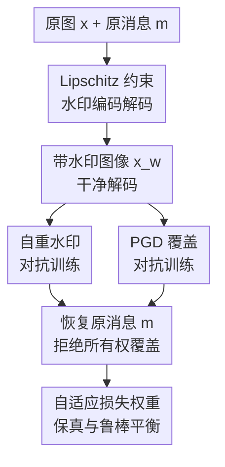

# The Self-Re-Watermarking Trap: From Exploit to Resilience

**会议**: ICLR 2026  
**OpenReview**: [https://openreview.net/forum?id=st1hrLTP14](https://openreview.net/forum?id=st1hrLTP14)  
**代码**: https://github.com/SVithurabiman/SRW  
**领域**: AI安全 / 图像水印鲁棒性  
**关键词**: 自重水印, 图像水印安全, 白盒攻击, Lipschitz约束, 对抗训练  

## 一句话总结
这篇论文指出深度图像水印系统会被“同一个编码器再次写入新水印”轻易覆盖原始所有权，并用带 Lipschitz 约束的自感知水印框架与重水印对抗训练，让原始水印在自重水印和 PGD 覆盖攻击后仍能被稳定恢复。

## 研究背景与动机
**领域现状**：深度学习图像水印通常采用 encoder-decoder 结构：编码器把一串比特消息嵌入图像，解码器再从带水印图像中恢复消息。相比传统 DWT/DCT/SVD 等方法，这类模型能在视觉质量、JPEG/裁剪/模糊等失真鲁棒性之间取得更好的经验表现，因此常被用作数字内容版权保护和来源验证的技术底座。

**现有痛点**：多数方法默认“水印只写一次”，训练时关心的是第一次嵌入后能否看不出来、常见图像处理后能否读出来，却没有认真处理“已经带水印的图像又被同一个编码器写一次”的情况。如果攻击者拿到模型，直接用原编码器把自己的消息 $m'$ 写进原水印图像 $x_w$，很多系统会让解码器更倾向读出新消息，原消息 $m$ 退化到接近随机猜测。

**核心矛盾**：自重水印比跨模型重水印更危险，因为攻击没有引入一个明显不同的嵌入模式。跨模型场景下，不同模型的嵌入痕迹和解码器不一致往往还能暴露异常；自重水印则是用系统自己的嵌入函数覆盖系统自己的旧消息，视觉上可以保持自然，却把所有权从原作者转移给攻击者。

**本文目标**：作者要先形式化这个白盒威胁模型，证明它不是个别模型的小瑕疵，而是当前深度水印设计的系统性漏洞；随后设计一个水印系统，使其在第一次嵌入时仍保持高保真和常规失真鲁棒性，同时在同编码器重写、PGD 目标消息攻击、相似模型覆盖等场景下仍优先恢复原始消息。

**切入角度**：论文的关键观察是，重写成功依赖模型对输入变化过于敏感：已经嵌入水印的图像只要再被编码器或梯度扰动稍微推一下，解码器 logit 就越过决策边界。与其事后检测每种攻击，不如在架构和训练目标里限制 encoder-decoder 的敏感度，让重写带来的扰动不足以翻转原始比特。

**核心 idea**：用 Lipschitz 约束降低水印模型对输入扰动的敏感性，再用自重水印和 PGD 覆盖样本做对抗训练，使“再次写入新水印”要么无法改变解码结果，要么会造成明显图像劣化，从而破坏攻击者的所有权劫持收益。

## 方法详解

### 整体框架
本文先把自重水印攻击写成一个明确的白盒覆盖过程：原图 $x$ 和原消息 $m$ 经过编码器得到 $x_w=E(x,m)$，攻击者再用同一个编码器把目标消息 $m'$ 写入，得到 $x'_w=E(x_w,m')$。防御端训练一个自感知 watermarking 系统，让解码器 $D$ 在看到 $x_w$、常规失真版本、PGD 扰动版本和 $x'_w$ 时都尽量恢复原始消息 $m$，而不是被目标消息牵引。

框架由四个贡献环节串起来：架构上对编码器和解码器施加谱归一化来控制敏感度；训练中显式模拟自重水印攻击；再加入 PGD 目标消息覆盖攻击；最后用自适应损失权重在视觉质量、干净解码和攻击鲁棒性之间调节训练重心。

编码器采用带 ResNet-50 辅助特征的 U-Net。消息先经过谱归一化线性层扩展为空间图，再与 RGB 图像拼接成 4 通道输入；编码器输出残差图像并加回原图。解码器是卷积网络，每个卷积块也使用谱归一化、GroupNorm 和 ReLU，最后输出 $L$ 个消息 logit。训练时还随机加入 JPEG、Gaussian blur、dropout、cropout、crop、flip、scaling、rotation 等可微或近似可微噪声，避免模型只对自重水印鲁棒而丢掉普通图像处理鲁棒性。

### 关键设计
**1. 自重水印威胁模型：把“同编码器覆盖”从直觉漏洞变成可测攻击**

论文将攻击者设为白盒对手，拥有编码器 $E$、解码器 $D$、训练流程甚至复现相似模型的能力。最核心的攻击是 Encoder-Based Self-Re-Watermarking：攻击者不需要训练新模型，也不需要破坏图像，只要把已经带水印的 $x_w$ 再送进同一个编码器并输入目标消息 $m'$，得到 $x'_w=E(x_w,m')$。如果解码器此时读出 $m'$ 或读不回 $m$，版权证明就被覆盖。

这个定义的重要性在于它把“模型泄露后还能不能信任旧水印”单独拎出来。很多论文只测试 JPEG、裁剪、噪声和去水印攻击，却忽略了水印工具本身被滥用的情况。作者在 HiDDeN、MBRS、SSL、ARWGAN、WFormer、VINE 等方法上测试后发现，自重水印后原始消息的 ACCorig 大多落在约 50% 附近，等价于随机猜测；同时图像重写前后的 PSNR 仍可高于 30dB，攻击不会明显暴露。

**2. Lipschitz 约束水印模型：用有界敏感度保护解码边界**

防御的理论核心是控制解码器对图像变化的响应幅度。论文假设解码器满足 $\|D(x_1)-D(x_2)\|_\infty \le K_D\|x_1-x_2\|_\infty$，并定义干净水印上的第 $i$ 个比特 margin 为 $\Delta_i(x,m)=m_iD_i(E(x,m))$。如果自重水印造成的图像扰动为 $\delta_\infty=\|x'_w-x_w\|_\infty$，那么只要 $K_D\delta_\infty < \Delta_i$，第 $i$ 个比特就不会被翻转。

因此，论文不是单纯让网络记住“重写样本长什么样”，而是用谱归一化约束卷积层和线性层的 operator norm，让 logit 变化受控。对应的误码率上界写成 $BER(x,m,m') \le \frac{1}{L}\sum_i \mathbf{1}(\Delta_i(x,m)\le K_D\delta_\infty)+\epsilon_{rec}$。这条式子给出了一个很直观的安全条件：干净解码 margin 要足够大，模型敏感度要足够低，重写扰动就不容易跨过决策边界。

**3. 自重水印与 PGD 覆盖对抗训练：训练时就让模型面对攻击者**

只有 Lipschitz 约束并不够，因为过强约束会牺牲嵌入容量、视觉质量和普通失真鲁棒性。作者在训练环里显式构造两类攻击样本：一类是把 $x_w$ 再喂给编码器并输入新消息 $m'$ 的自重水印样本；另一类是 PGD 目标攻击，在 $\ell_\infty$ 半径 $\epsilon$ 内寻找扰动 $\psi$，让 $D(x_w+\psi)$ 接近攻击者目标消息 $m_g$。

训练目标不是让解码器跟随攻击目标，而是要求它在这些攻击后仍恢复原始消息 $m$。这相当于把“攻击者会怎么覆盖水印”内化成训练分布，逼迫解码器学习对覆盖痕迹不敏感、对原始消息更稳定的特征。PGD 的训练强度还采用 curriculum：早期扰动预算接近 0，随后逐步升到最大 $\epsilon=0.05$、步长 $\alpha=0.009$、50 次迭代，避免训练一开始就被强攻击打崩。

**4. 自适应损失权重：避免安全性把水印可用性压垮**

论文的损失同时包含保真、干净恢复和鲁棒恢复三类目标。保真损失为 $L_{fid}=MSE(x,x_w)+\lambda_{lpips}LPIPS(x,x_w)$，干净恢复用 $L_{rec}=BCE(D(x_w),\phi(m))$，鲁棒项围绕自重水印和 PGD 攻击后仍恢复原始消息来优化。直接固定权重会很脆弱：保真权重太高，水印读不稳；鲁棒权重太高，图像质量和常规失真表现可能下降。

作者因此根据训练过程中干净 BER 和覆盖后 BER 动态调节 $\lambda_{lpips}$、$\lambda_{rec}$、$\lambda_{rob}$。直观上，模型还读不准干净水印时，训练更重视恢复；当干净恢复和覆盖鲁棒性逐渐稳定后，权重向视觉质量和整体平衡过渡。附录的 LPIPS 权重实验也说明 $\lambda_{lpips}=0.5$ 是较稳的折中：PSNR 达 34.03dB，SSIM 为 0.97，同时 JPEG、模糊、dropout、cropout、crop 等 ACCorig 仍保持较高水平。

### 一个完整示例
假设内容所有者把 30-bit 原始消息 $m$ 嵌入一张 COCO 图像，得到视觉上接近原图的 $x_w$。在普通水印系统里，如果攻击者拿到同一个 encoder，就可以把 $x_w$ 当成新的 cover image，再输入自己的 30-bit 消息 $m'$，得到 $x'_w$。对许多基线来说，$D(x'_w)$ 会更接近 $m'$，而 $m$ 的恢复准确率跌到约 50%，原始所有权证明基本失效。

在本文系统里，同样的 $x'_w$ 会被训练成“对解码器来说仍应指向原消息”的攻击样本。由于谱归一化压低了 $K_D$，干净水印又被训练出较大的 logit margin，自重水印导致的 logit 位移不足以系统性翻转比特。若攻击者继续反复重写，论文观察到图像会出现明显劣化：水印图与重水印图之间平均 PSNR 只有 10.21dB、SSIM 为 0.66，攻击者即使想声称新水印有效，也要付出肉眼可见的质量代价。

### 损失函数 / 训练策略
整体优化目标可概括为 $\min_{\theta_E,\theta_D}\mathbb{E}_{x,m,m'}[\lambda_{fid}L_{fid}+\lambda_{rec}L_{rec}+\lambda_{rob}L_{rob}]$。其中 $L_{fid}$ 保持 $x_w$ 与 $x$ 的视觉一致性，$L_{rec}$ 保证干净水印可读，$L_{rob}$ 要求自重水印样本和 PGD 扰动样本仍读回原始消息。训练数据使用 COCO 子集，包含 20,000 张训练图、1,000 张验证图和 3,000 张测试图，图像缩放到 $128\times128$，消息长度 $L=30$。

实现上，所有卷积层和线性层都加入谱归一化来落实 Lipschitz 控制；噪声模型在每次训练迭代随机采样一种常见图像扰动；推理阶段还可以用 Gaussian blur 加低幅值抑制的 post-processing 模块改善视觉质量。论文也测试了不用 post-processing 的版本，发现它牺牲一些 PSNR，但在强安全场景下可进一步保留攻击后恢复率。

## 实验关键数据

### 主实验
论文从三个角度验证方法：第一，现有 SOTA 在自重水印下是否真的失效；第二，本文方法在自重水印和 PGD 目标覆盖下能否保住原始消息；第三，常规图像处理鲁棒性和视觉质量有没有被牺牲。主表中 ACCorig 表示攻击或失真后恢复原始消息的比特准确率。

| 方法 | PSNR(dB) | SSIM | JPEG(50) | Gaussian Blur(2.0) | Self Re-embed | PGD Moderate | PGD Strong |
|------|----------|------|----------|---------------------|---------------|--------------|------------|
| HiDDeN | 33.55 | 0.92 | 63.00 | 96.00 | 51.29 | 52.03 | 51.45 |
| MBRS | 35.84 | 0.89 | 91.97 | 100.00 | 50.34 | 63.51 | 51.26 |
| ARWGAN | 35.87 | 0.96 | 93.98 | 99.99 | 51.94 | 50.68 | 50.73 |
| WFormer | 33.50 | 0.91 | 99.14 | 100.00 | 50.02 | 88.64 | 80.15 |
| VINE | 37.07 | 0.99 | 99.97 | 99.84 | 51.20 | 82.00 | 79.41 |
| Proposed | 34.03 | 0.97 | 95.06 | 99.66 | 100.00 | 99.95 | 99.37 |

这组结果说明，自重水印并不是“普通鲁棒性强就自然能防”的攻击。VINE 和 WFormer 在 JPEG、模糊等常规指标上很强，但同编码器重写后原始消息仍接近随机；本文方法的视觉质量不是最高 PSNR，却在 self re-embed、PGD moderate 和 PGD strong 上几乎保持满分恢复。

论文还报告了多数据集泛化结果：在 MIRFLICKR、CelebA、ImageNet 上，PSNR 约 33-35dB，SSIM 约 0.96-0.97，自重水印 ACCorig 约 99.87%-100.00%，PGD strong 也保持约 98.85%-99.10%。这表明方法不只是 COCO 测试集上的过拟合防御。

### 消融实验
| 配置 | PSNR | SSIM | ACCclean | Self OW 后 ACCorig | PGD Moderate 后 ACCorig | PGD Strong 后 ACCorig | 说明 |
|------|------|------|----------|--------------------|--------------------------|------------------------|------|
| Proposed | 34.03 | 0.97 | 100.00 | 100.00 | 99.95 | 99.37 | 完整方法，保真与安全平衡最好 |
| w/o Post Processing | 31.82 | 0.96 | 100.00 | 100.00 | 100.00 | 99.99 | 更偏安全，视觉质量略降但攻击恢复更强 |
| w/o Spectral Norm | 30.40 | 0.94 | 99.90 | 76.33 | 99.57 | 98.90 | 自重水印明显掉点，说明谱约束是关键 |

| 训练设置 | PSNR | SSIM | JPEG(50) | Gaussian Blur(2.0) | Dropout(30%) | Cropout(30%) | Crop(3.5%) | 结论 |
|----------|------|------|----------|---------------------|--------------|--------------|------------|------|
| $\lambda_{LPIPS}=0.3$ | 32.39 | 0.97 | 99.63 | 99.90 | 99.93 | 99.88 | 99.61 | 鲁棒性强但视觉质量较低 |
| $\lambda_{LPIPS}=0.5$ | 34.03 | 0.97 | 95.06 | 99.66 | 98.90 | 98.14 | 99.85 | 主实验采用，折中较好 |
| $\lambda_{LPIPS}=0.7$ | 39.51 | 0.99 | 88.08 | 99.15 | 99.48 | 99.53 | 92.06 | 视觉质量高但 JPEG 和 crop 下降 |

### 关键发现
- 自重水印是当前深度水印模型的共同短板：多种 SOTA 在 self re-embed 后 ACCorig 约 50%，说明攻击者用同一 encoder 重写时，原水印并没有被系统性保护。
- 谱归一化不是装饰性约束。去掉 spectral norm 后，模型在 PGD 下仍有较好表现，但 self overwrite 后 ACCorig 从 100.00 降到 76.33，正好对应论文“限制敏感度才能防同编码器覆盖”的核心论点。
- PGD 攻击并未完全失效，但可用攻击预算受视觉质量约束。论文按 30dB PSNR 作为可接受不可见阈值选择 $\epsilon$；当扰动预算继续增大，原始水印恢复会下降，但图像质量也跌破攻击者可隐蔽使用的范围。
- 重复或多阶段攻击仍有边界。若攻击者先用 CtrlRegen+ 等方法移除水印再重新嵌入，覆盖可变得更成功；但实验中 PSNR 只有 20.50-23.27、SSIM 只有 0.59-0.72，图像出现模糊和颜色不一致，说明这不是“无痕夺权”。

## 亮点与洞察
- 论文最有价值的地方是把一个很现实但容易被忽略的安全问题命名清楚：水印模型一旦泄露，最直接的攻击不是训练复杂去水印器，而是把模型自己的 encoder 当覆盖工具使用。这个威胁模型对实际部署很扎实，因为模型泄露、API 滥用和逆向都不是罕见假设。
- 理论分析虽然保守，但给出了可解释的防御方向。$K_D\delta_\infty < \Delta_{min}$ 这个条件把“为什么谱约束有效”讲得很直白：不是神秘地让模型更鲁棒，而是让攻击引起的 logit 位移难以跨过原始消息的 margin。
- 方法没有只追求攻击后读对，还让攻击者的重写图像变差。这个设计很巧妙：如果重写不能改变消息，攻击失败；如果反复重写造成明显伪影，攻击也难以伪装成合法版权声明。
- 自适应损失权重是一个可迁移的工程经验。安全约束、保真损失和恢复损失天然相互拉扯，用训练状态动态调权比固定一个“看起来合理”的权重更适合这类多目标安全模型。

## 局限与展望
- 论文主要聚焦直接的自重水印和 norm-bounded PGD 覆盖，对更复杂的“先移除、再重写、再修复视觉质量”的多阶段攻击还只是初步探索。附录显示这类攻击会带来明显质量损失，但未来如果生成式修复更强，仍需要更系统的防御。
- 当前实验主要围绕 $128\times128$、30-bit 和扩展的 $256\times256$、64-bit 设置。真实平台的高分辨率、压缩链路、社交媒体二次处理、截图传播等流程更复杂，部署前还需要更接近生产环境的评估。
- 防御依赖谱归一化和对抗训练，训练成本与调参复杂度高于普通水印模型。虽然推理 FLOPs 只有 7.73G、编码约 43.97 images/s、解码约 607.54 images/s，但 37.09M 参数主要来自消息上采样/下采样 FC 层，对轻量端侧部署仍可能偏重。
- 论文把白盒泄露当作核心威胁，这是合理且保守的；但如果攻击者可以同时修改 decoder、伪造验证协议或操纵链上登记流程，单纯图像水印鲁棒性不能覆盖完整版权治理问题。

## 相关工作与启发
- **vs HiDDeN / MBRS / WFormer**: 这些方法主要优化常规图像处理失真下的可恢复性，例如 JPEG、裁剪、模糊和 dropout。本文关注的是模型自身被复用后的所有权覆盖，因此从“抗图像处理”推进到“抗编码器滥用”。
- **vs VINE**: VINE 面向大规模图像编辑和生成先验带来的水印移除风险，在标准编辑攻击上很强；本文指出即便这类方法视觉质量和普通鲁棒性优秀，同编码器重写仍可能让原水印恢复接近随机。
- **vs dual watermarking / high-frequency overwriting defense**: 相关方法尝试用双水印或高频嵌入应对某些覆盖场景，但通常假设较窄。本文把 self-re-watermarking 单独建模，并用 Lipschitz 约束、攻击训练和理论 margin 分析构成一套更统一的防御逻辑。
- **对后续工作的启发**: 任何“模型可公开使用”的版权保护系统，都应测试模型被复用、被克隆、被微调后的安全性。类似思想也可迁移到音频水印、视频水印和生成式内容 provenance：不仅要问水印能否抗压缩，还要问工具本身泄露后会不会变成攻击工具。

## 评分
- 新颖性: ⭐⭐⭐⭐⭐ 把 self-re-watermarking 明确定义为独立威胁，并证明它是多种深度水印系统的共同漏洞，问题提出很有价值。
- 实验充分度: ⭐⭐⭐⭐☆ 覆盖 SOTA、自重水印、PGD、跨模型、多数据集和消融，整体扎实；但真实平台链路和多阶段生成式攻击仍可更深入。
- 写作质量: ⭐⭐⭐⭐☆ 论文主线清晰，理论条件和实验结论能互相支撑；个别损失符号和鲁棒项表述略显不够严谨，需要读者结合训练 pipeline 理解。
- 价值: ⭐⭐⭐⭐⭐ 对图像水印安全部署有直接提醒：模型泄露后，水印系统不能只依靠“别人不知道 encoder”这一假设，必须把自重写攻击纳入基准测试。

<!-- RELATED:START -->

## 相关论文

- [\[CVPR 2026\] The Coherence Trap: When MLLM-Crafted Narratives Exploit Manipulated Visual Contexts](../../CVPR2026/ai_safety/the_coherence_trap_when_mllm-crafted_narratives_exploit_manipulated_visual_conte.md)
- [\[ICLR 2026\] MUSE: Model-Agnostic Tabular Watermarking via Multi-Sample Selection](muse_model-agnostic_tabular_watermarking_via_multi-sample_selection.md)
- [\[AAAI 2026\] Robust Watermarking on Gradient Boosting Decision Trees](../../AAAI2026/ai_safety/robust_watermarking_on_gradient_boosting_decision_trees.md)
- [\[ECCV 2024\] Resilience of Entropy Model in Distributed Neural Networks](../../ECCV2024/ai_safety/resilience_of_entropy_model_in_distributed_neural_networks.md)
- [\[CVPR 2026\] AdvMark: Decoupling Defense Strategies for Robust Image Watermarking](../../CVPR2026/ai_safety/decoupling_defense_strategies_for_robust_image_watermarking.md)

<!-- RELATED:END -->
