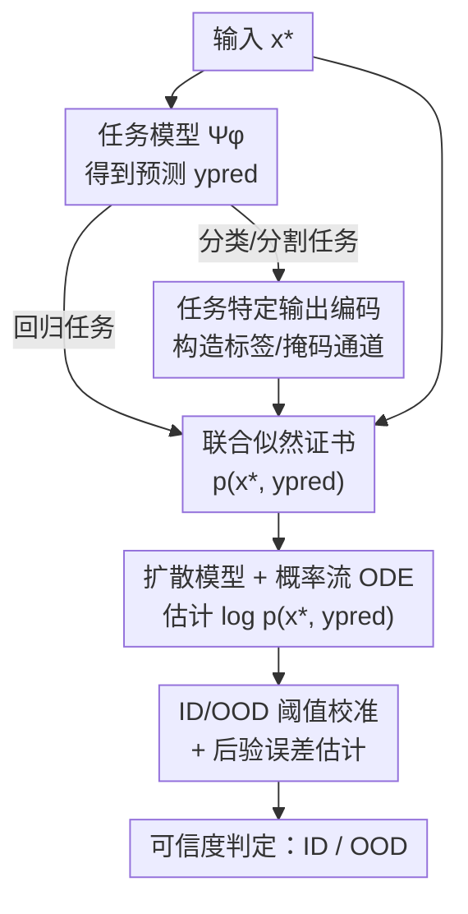

# Towards a Certificate of Trust: Task-Aware OOD Detection for Scientific AI

**会议**: ICLR 2026  
**OpenReview**: [https://openreview.net/forum?id=2RuSWLQK82](https://openreview.net/forum?id=2RuSWLQK82)  
**领域**: AI 安全 / 可信赖性 / OOD 检测 / 科学机器学习  
**关键词**: OOD 检测, 扩散模型, 联合似然, 可信度证书, 科学计算回归

## 一句话总结
针对科学计算里大量的回归任务，本文用一个在「输入+预测」联合分布 $p(x, y_{\text{pred}})$ 上训练的 score-based 扩散模型，把联合对数似然当作模型预测的「可信度证书」，证明它与真实预测误差强相关，从而无需任何测试集真值就能判断一个 AI 预测是否可信（ID/OOD），并在 PDE、卫星遥感、脑肿瘤分割等多种科学数据上验证有效。

## 研究背景与动机
**领域现状**：深度学习正在迅速渗透科学计算——天气预报、流体力学、PDE 求解等任务越来越多地用神经算子等数据驱动模型替代传统数值方法，因为它便宜、还能从历史数据里学到没有解析物理模型的规律。这些任务的绝大多数本质上是**回归**：从初值/边界条件预测一个随空间或时间变化的物理场。

**现有痛点**：纯数据驱动模型是「内插」的——它在训练分布内表现很好，但一旦遇到分布外（OOD）输入，精度会显著退化，而且它**不会主动告诉你它失准了**。物理模型即便在极端未见工况下也仍服从物理定律，神经网络却没有这种保证。换句话说，深度学习预测**缺一张可信度证书**，用户拿到一个预测，根本无从判断它准不准。

**核心矛盾**：OOD 检测领域过去十年主要围绕**图像分类**展开（energy score、softmax 置信度、密度估计、normalizing flow 等），但科学计算里压倒性多数任务是**回归**。分类任务里「OOD 检测」可以靠类别置信度、离散标签的密度等手段，回归任务里输出是连续高维场，既没有「类别置信度」，也很难定义什么叫「输出异常」。如何为回归任务做 OOD 检测，是一个基本未被解决的开放问题。

**本文目标**：构造一个量 $c(x^\star)$ 作为证书，使它（i）**不需要知道真值 $y^\star$** 就能算出来，并且（ii）与真实损失 $\ell(y^\star, \Psi_\varphi(x^\star))$ 相关——证书低就提示「这个预测可能不可信」。

**切入角度**：作者注意到，光看输入 $x$ 的密度 $p(x)$ 是**任务无关**的——同一个输入 $x$，任务可以是解 PDE 也可以是别的，输入分布并不包含「这个任务在这个点有多难」的信息。所以证书必须把**模型的预测**也纳进来。

**核心 idea**：用「输入 + 预测」的**联合似然** $p(x, y_{\text{pred}})$ 当证书，并用 score-based 扩散模型来估计这个联合密度——预测误差大的样本，联合似然就低，于是把它判为 OOD。

## 方法详解

### 整体框架
整个系统把「一个待评估的回归/分类模型 $\Psi_\varphi$」和「一个独立训练的 score-based 扩散去噪器 $D_\theta$」拼在一起：扩散模型在训练数据对 $(x_n, y_n)$ 上学习联合分布 $p(x,y)$（注意训练扩散模型时**完全不碰** $\Psi_\varphi$）。在线评估时，对任意新输入 $x^\star$，先用 $\Psi_\varphi$ 得到预测 $y_{\text{pred}}=\Psi_\varphi(x^\star)$，把 $(x^\star, y_{\text{pred}})$ 喂进扩散模型，通过概率流 ODE 沿路径积分算出联合对数似然 $\log p(x^\star, y_{\text{pred}})$，这个值就是证书 $c$；再拿它和一条从少量训练样本标定出来的 ID/OOD 边界比较，大于边界判 ID（可信）、小于边界判 OOD（不可信）。对于分类/分割这类离散输出任务，则在构造联合变量前先做一步任务特定的输出编码。

### 关键设计

**1. 联合似然证书：把「任务难度」编码进可信度度量**

作者要解决的痛点是「光看输入 $p(x)$ 无法反映任务有多难」。他们先在附录给了一个启发式推导，得到误差和似然的近似关系：

$$\log\big(\ell(y^\star, \Psi_\varphi(x^\star))\big) \le \alpha\log(\epsilon) - \log\big(p(x^\star, y_{\text{pred}})\big) + O(\epsilon^\beta)$$

其中 $\epsilon$ 是平均损失，$\alpha,\beta$ 为正常数。这个式子说明两件事：预测误差与联合似然 $p(x^\star, y_{\text{pred}})$ 负相关；数据稠密（似然高）处误差小，数据稀疏（似然低）处误差可能很大。关键在于联合似然能做如下分解：

$$\log p(x^\star, y_{\text{pred}}) = \log p(x^\star) + \log p(y_{\text{pred}} \mid x^\star)$$

第一项 $p(x^\star)$ 衡量输入本身是否落在训练分布里；**第二项条件似然 $p(y_{\text{pred}}\mid x^\star)$ 才是「任务感知」的核心**——它刻画了「从 $x^\star$ 预测出 $y_{\text{pred}}$ 这件事有多自然/多难」。正是这一项让证书超越了任务无关的 $p(x)$：实验里的 NS-Sines 数据集输入似然 $p(x)$ 很高，但下游 PDE 求解任务本身很难、误差很大，单看 $p(x)$ 会误判它可信；而联合似然因为引入了条件项，正确地给出了低分。这就是「task-aware」三个字的来源。

**2. score-based 扩散 + 概率流 ODE 估计联合似然**

联合密度 $p(x,y)$ 在高维场上根本无法解析求出，本文用扩散模型来近似。扩散模型把高斯先验映射到目标分布，其等价的概率流 ODE 为 $\frac{dz}{dt} = -\tfrac12\sigma_t^2\, s(z(t);t)$，其中 $s$ 是 score 函数。沿这条 ODE 路径积分即可得到精确的对数密度：

$$\log p_0(z(0)) = \log p_T(z(T)) - \int_0^T \tfrac12\sigma_t^2\,(\nabla\cdot s)(z(t);t)\,dt$$

本文把联合变量 $z=(x,y)$ 整体送进去，散度项 $\nabla\cdot s$ 用随机估计器近似，score 则由训练好的去噪器 $D_\theta$ 经 Tweedie 公式得到。这样设计的好处有三：一是似然是「算」出来而非「学」出来的标量头，理论上严格；二是扩散模型训练时不依赖被评估的回归模型 $\Psi_\varphi$，因此方法是**zero-shot 且模型无关**的——消融实验里把回归骨干从 CNO 换成 ViT、UNet、C-FNO，复用同一个扩散模型，似然-误差相关性依然成立；三是单样本证书计算只要零点几秒，远快于 MC-Dropout 这类需要多次随机前传的贝叶斯方法。

**3. ID/OOD 阈值校准与后验误差估计**

有了证书数值，还需要一条边界把样本分成可信/不可信。作者从训练分布取少量（如 32 个）「决策样本」，算出它们证书值的中位数 $l_e$ 和标准差 $\sigma_e$，定义证书大于 $l_e - 1.5\sigma_e$ 为 ID、低于则为 OOD，这在「误差 vs 证书」平面上画出一条竖直边界。再配上一条水平的误差阈值（如训练误差的 95 分位），平面被切成四象限：理想证书应当让区域 I（判 ID 却误差大）和区域 III（判 OOD 却误差小）里的样本尽量少。更进一步，若手头恰好有少量（约 64 个）测试真值，由于式 (2) 暗示误差与对数似然近似呈指数关系，作者就拟合一条带缩放和平移的指数曲线，从而把证书直接换算成**定量的后验误差估计**——这对科学应用尤其有用，用户不只知道「可不可信」，还能估出「误差大概多大」。作者还把 OOD 进一步细分为 critical（$l_e-3\sigma_e$ 到 $l_e-1.5\sigma_e$）和真正的 OOD（低于 $l_e-3\sigma_e$），用于刻画模型泛化最差的区域。

**4. 任务特定的输出编码：把方法迁移到分类与分割**

回归任务里 $y_{\text{pred}}$ 直接就是预测场，但分类/分割是离散输出，直接拼进扩散模型会很别扭。对分类，作者不取 argmax 类别，而是把预测变成一个标签通道：**逐像素从分类分布 $p(y\mid x)$ 中独立采样标签值**，再拼到图像通道后面。这样置信度低的预测会在标签通道里引入随机「污染」、被扩散模型判为低似然，而置信度高、预测正确的样本几乎不受影响——巧妙地把「分类置信度」翻译成了「联合似然」。对分割（逐像素分类），策略类似，但额外**在训练时用白噪声破坏非语义像素**，以降低无关背景对似然的干扰。正是这步设计，让一个为回归而生的证书框架同时覆盖了 CIFAR/MNIST 分类和 BraTS2020 脑肿瘤分割。

### 损失函数 / 训练策略
扩散去噪器 $D_\theta$ 用标准 denoising score matching 在数据对 $(x_n,y_n)$ 上训练（Wave 实验训 500 epoch）；回归模型 $\Psi_\varphi$ 用各自任务的损失（PDE 回归用 L1、分类用 softmax 交叉熵）独立训练。两者训练**互不耦合**。证书计算阶段无需再训练，只做一次概率流 ODE 积分。

## 实验关键数据

### 主实验
在 Wave、Navier-Stokes（含最难的 NS-MIX 混合分布）、MERRA-2 卫星湿度预报、脑肿瘤分割等数据上，把本文的联合似然证书 **JLBC** 与多个扩散类基线（JDPath 曲率、JSBDDM、本文提出的 JSFNS、JMSSM）及非扩散基线 OODC 对比（指标：ACC 准确率、FPR 假阳率、FDR、AUROC，越高越好除 FPR/FDR）：

| 数据集 | 指标 | JLBC(本文) | 最强扩散基线 | OODC |
|--------|------|-----------|-------------|------|
| NS-MIX（最难） | ACC | **0.947** | 0.788 | 0.424 |
| NS-MIX | AUROC | **0.992** | 0.918 | – |
| Wave | AUROC | 0.936 | **0.946**(JMSSM) | – |
| MERRA-2 | AUROC | 0.992 | 0.998 | – |
| Brain | AUROC | 0.808 | 0.808 | – |
| **平均** | ACC | **0.899** | 0.886 | 0.617 |
| 平均 | FPR | **0.033** | 0.043 | 0.224 |
| 平均 | AUROC | **0.945** | 0.927 | – |

JLBC 平均表现最好，尤其在训练/测试都是多分布混合的 NS-MIX 上大幅领先（ACC 0.947 vs 0.788），接近完美的 OOD 判别；非扩散基线 OODC 全面落后且还需测试真值。

### 消融实验

| 配置 | 关键发现 | 说明 |
|------|---------|------|
| 扩散模型训练程度 | 训得越久似然-误差相关性越强 | 约后 100 epoch 趋于稳定，足够后即可靠 |
| 决策样本数（4→32） | 4 个样本时偏保守（多判 OOD） | 样本增多后边界更稳定 |
| 回归骨干（CNO/ViT/UNet/C-FNO） | 各骨干下低似然均对应高误差 | 方法对回归架构鲁棒、无需匹配骨干 |
| 仅用 $p(x)$ 作证书 | NS-MIX 上似然与误差**无相关** | 任务无关证书全部失败，佐证联合似然必要性 |

### 关键发现
- **联合似然 vs 仅输入似然**：在 NS-MIX 上，$p(x)$ 与误差几乎不相关（NS-Sines 输入似然最高却误差最大），而联合 $p(x,y_{\text{pred}})$ 相关性清晰——这是全文最有说服力的「为什么必须 task-aware」的证据。
- **跨模态/跨视角 OOD**：脑肿瘤分割实验里，方法能正确把不同 MRI 模态（用 FLAIR 训练、测 T2）和未见解剖朝向（轴向训练、测 x 轴切片）的样本识别为 OOD。
- **速度**：单样本证书零点几秒，比 MC-Dropout、Rate-In 这类贝叶斯方法又快又准。

## 亮点与洞察
- **「证书」视角**：把 OOD 检测从「学一个判别器」重述为「算一个有理论支撑的联合似然」，并给出误差-似然的启发式不等式，让分数有明确含义而非黑箱评分——可迁移到任何需要可信度保证的回归任务。
- **联合似然分解 $p(x)+p(y\mid x)$**：一句话点破了为什么纯输入密度做 OOD 在科学回归里会失败，这个 insight 比具体算法更值得记。
- **离散任务的「软标签通道」技巧**：把分类置信度通过逐像素采样翻译成扩散似然，是一个很可复用的「把不连续输出塞进生成模型」的桥接手法。
- **zero-shot + 模型无关**：扩散模型与被评估模型解耦，意味着同一个证书器能给任意新模型「盖章」，工程上很友好。

## 局限与展望
- 误差-似然关系是**启发式近似**（式 2），作者明确说不存在精确公式，因此后验误差估计只在「有少量真值」时给出，且依赖指数拟合的强假设。
- 需要为每个任务额外训练一个扩散模型，且扩散模型本身在高维科学场上的训练成本不低；脑分割等更难任务上 AUROC（0.808）明显低于 PDE 任务，说明高维复杂分布的似然估计仍有瓶颈。
- ID/OOD 边界用 $l_e - 1.5\sigma_e$ 这类经验规则定，作者也承认可换更严格的 conformal/FPR 控制方法，当前阈值选择带主观性。
- 分割只验证了二值（肿瘤/非肿瘤）任务，多类分割、3D 时空联合分布等更复杂场景尚未覆盖。

## 相关工作与启发
- **vs DiffPath（Heng et al., 2024）/ Abdi et al.（医学 OOD）**：它们基于扩散路径的曲率/变化率做 OOD，且主要在输入分布上。本文把这些证书统一改写到「联合输入输出」设定（基线前缀 J），在同一框架下公平对比，结果显示纯似然 JLBC 平均最稳。
- **vs 基于 $p(x)$ 的密度法（normalizing flow / 高斯混合）**：本文核心论点就是 $p(x)$ 任务无关、在科学回归里会失败，必须引入条件项 $p(y\mid x)$。
- **vs 贝叶斯不确定性（MC-Dropout、Rate-In）**：那类方法靠多次随机前传估认知不确定性，本文在 Wave 上准确率、AUROC 更高且更快，因为似然是单次 ODE 积分算出来的。

## 评分
- 新颖性: ⭐⭐⭐⭐⭐ 首次系统地为科学回归任务做 task-aware OOD 检测，联合似然分解的视角很干净
- 实验充分度: ⭐⭐⭐⭐⭐ 覆盖 PDE/卫星/分类/分割多域，含跨模态、跨骨干、训练程度等扎实消融
- 写作质量: ⭐⭐⭐⭐ 理论动机清晰，但大量关键图表与推导塞在附录，正文略依赖 SI
- 价值: ⭐⭐⭐⭐⭐ 直击科学 AI 落地的「可信度」痛点，证书框架通用且工程友好

<!-- RELATED:START -->

## 相关论文

- [\[ICLR 2026\] AP-OOD: Attention Pooling for Out-of-Distribution Detection](ap-ood_attention_pooling_for_out-of-distribution_detection.md)
- [\[ICLR 2026\] Watermark-based Detection and Attribution of AI-Generated Content](watermark-based_attribution_of_ai-generated_content.md)
- [\[CVPR 2026\] Scaling Up AI-Generated Image Detection with Generator-Aware Prototypes](../../CVPR2026/ai_safety/scaling_up_ai-generated_image_detection_with_generator-aware_prototypes.md)
- [\[ICLR 2026\] Dataless Weight Disentanglement in Task Arithmetic via Kronecker-Factored Approximate Curvature](dataless_weight_disentanglement_in_task_arithmetic_via_kronecker-factored_approx.md)
- [\[ICLR 2026\] Tug-of-War No More: Harmonizing Accuracy and Robustness in Vision-Language Models via Stability-Aware Task Vector Merging](tug-of-war_no_more_harmonizing_accuracy_and_robustness_in_vision-language_models.md)

<!-- RELATED:END -->
