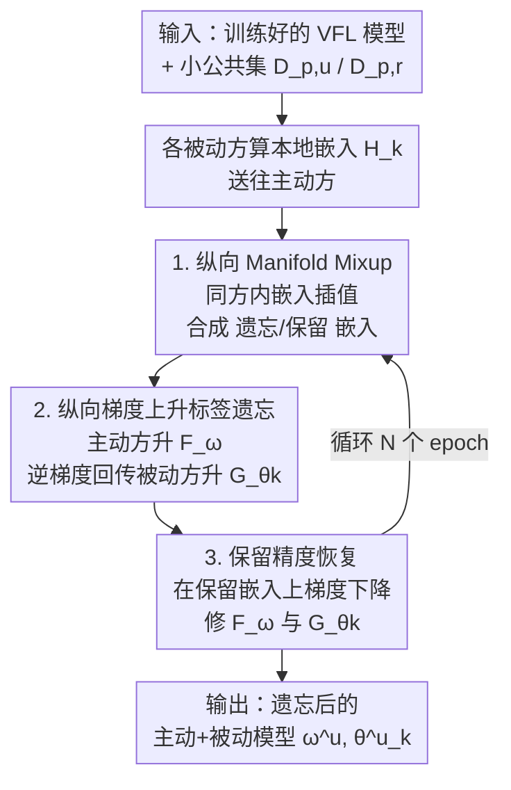

# Towards Privacy-Guaranteed Label Unlearning in Vertical Federated Learning: Few-Shot Forgetting without Disclosure

**会议**: ICLR 2026  
**OpenReview**: [https://openreview.net/forum?id=G1JdmhkicJ](https://openreview.net/forum?id=G1JdmhkicJ)  
**代码**: https://github.com/bryanhx/Towards-Privacy-Guaranteed-Label-Unlearning-in-Vertical-Federated-Learning  
**领域**: 联邦学习 / 机器遗忘 / 隐私安全  
**关键词**: 纵向联邦学习, 标签遗忘, few-shot, manifold mixup, 梯度上升

## 一句话总结
针对纵向联邦学习（VFL）中"标签既是输入又是隐私"的特殊困境，本文提出首个 VFL 标签遗忘方法：用一小撮公共数据做 manifold mixup 合成嵌入，再对主动方/被动方做梯度上升抹除目标标签、梯度下降恢复保留标签，整个遗忘过程几秒完成，比基线快 16–1200 倍且几乎不掉保留集精度。

## 研究背景与动机
**领域现状**：纵向联邦学习（VFL）让特征互补的多家机构（如银行、医院）在不共享原始数据的前提下联合建模——被动方（passive party）持有特征并训练底部模型 $G_{\theta_k}$，主动方（active party）持有标签并训练顶部模型 $F_\omega$，双方通过交换中间嵌入 $H_k$ 和梯度协同优化。GDPR、CCPA 等法规赋予用户"被遗忘权"，因此 VFL 也必须支持遗忘。

**现有痛点**：机器遗忘（MU）和联邦遗忘（FU）的研究几乎都集中在横向场景（HFL），而 VFL 这边仅有的几项工作只关注**特征遗忘**——即某个被动方整体退出时如何抹掉它的特征贡献。但 VFL 里标签身兼二职：它既是训练的必需输入，本身又是高度敏感信息（如"患者是否 HIV 阳性""贷款是否批准"）。**抹除标签**这一需求几乎无人触碰，更没有"由持有标签的主动方发起、各方都参与"的遗忘方案。

**核心矛盾**：VFL 的同步约束放大了遗忘的代价。各方在共同样本 ID 空间上持有不同特征，每一步训练都要交换并对齐中间结果，整个系统必须等最慢的参与方走完才能进入下一轮。若沿用"用全量遗忘数据重训/微调"的思路，遗忘开销会被这种同步等待成倍放大，根本不实用。

**本文目标**：在 VFL 中高效地把目标标签 $D_u$ 的影响从主动方和被动方模型里同时抹除，同时（i）保留集精度不塌、（ii）只需极少辅助数据、（iii）不做全量重训。

**切入角度**：作者观察到 few-shot 思想可以破局——样本少则前向、梯度更新都更快，但单纯用 40 个左右的小样本做遗忘信号又太弱。于是把本用于数据增强的 **manifold mixup** 重新利用：在隐藏嵌入层做插值，为小样本"造"出更丰富的遗忘/保留信号，从而让 few-shot 遗忘既快又有效。

**核心 idea**：用"嵌入级 mixup 造信号 + 梯度上升抹标签 + 梯度下降补精度"三步，只靠一小撮公共数据，在几秒内完成 VFL 标签遗忘，且被动方无需接触原始标签。

## 方法详解

### 整体框架
方法建立在一个已经训练好的 VFL 系统上：主动方持有标签和顶部模型 $F_\omega$，$K$ 个被动方各持特征和底部模型 $G_{\theta_k}$。当主动方请求遗忘一批样本（索引集 $I_u$，对应数据 $D_u$）时，整套流程只动用一个很小的公共标注集 $D_{p,u}$（遗忘标签）和 $D_{p,r}$（保留标签），分三步走：

第一步，各被动方先对小样本算出本地嵌入并送给主动方，主动方在**同一被动方**内部对嵌入做 manifold mixup，合成出增强的遗忘嵌入 $\vec{H}^u_k$ 与保留嵌入 $\vec{H}^r_k$，把稀疏的小样本"撑"成更密的信号。第二步，在合成的遗忘嵌入上做**梯度上升**：主动方先升 $F_\omega$，再把 $\partial \ell / \partial \vec{H}^u_k$ 回传给各被动方，让被动方用逆向梯度局部更新 $G_{\theta_k}$，从而在不触碰原始标签的情况下抹掉对应表示。第三步，在合成的保留嵌入上做**梯度下降**恢复保留集精度。三步在每个 epoch 内串行循环执行。

### 关键设计

**1. 纵向 Manifold Mixup：把 few-shot 的稀疏信号在嵌入层"撑"密**

小公共集 $D_{p,u}$ 每个标签往往只有 40 个左右样本，直接拿来做遗忘信号太弱（消融里 GA-S 完全无法抹掉 $y^u$）。作者没有在原始特征上 mixup（VFL 里各方特征异构、根本不能直接混），而是在**隐藏嵌入**上插值：每个被动方先把小样本编码成 $H^{p,u}_{k,i}=G_{\theta_k}(x^{p,u}_{k,i})$，主动方再在**同一被动方**的嵌入之间做线性混合

$$\text{Mix}_\lambda(a,b)=\lambda\cdot a+(1-\lambda)\cdot b,\quad \lambda\in[0,1],$$

并对标签做同样的混合 $\text{Mix}_\lambda(y^{p,u}_i,y^{p,u}_j)$。优化目标是在这些合成"嵌入-标签对"上**最大化**主任务损失（为后续遗忘铺路）。关键巧思在于：mixup 只在同一被动方内部进行，各方共享同一个 $\lambda$ 即可保持一致，**无需被动方之间额外协调**，天然贴合 VFL 的隐私边界；而 manifold mixup 能"拉平状态分布"，使合成嵌入覆盖更广的表示空间，让小样本也能提供足够丰富的遗忘/恢复信号。

**2. 纵向梯度上升标签遗忘：主动方升、被动方逆梯度局部抹**

有了合成遗忘嵌入 $\{\vec{H}^u_k\}$，遗忘本身用一招简洁的梯度上升完成。主动方先把所有嵌入拼成 $\vec{H}^u=[\vec{H}^u_1,\dots,\vec{H}^u_K]$，对顶部模型做上升

$$\omega=\omega+\eta\nabla_\omega \ell(F_\omega(\vec{H}^u),\vec{y}^u),$$

沿着"放大遗忘损失"的方向把目标标签信息从 $F_\omega$ 里推走。随后主动方算出 $\partial\ell/\partial\vec{H}^u_k$ 回传给被动方，被动方用链式法则 $\theta_k=\theta_k+\eta\nabla_{\vec{H}^u}\ell\cdot\nabla_{\theta_k}\vec{H}^u_k$ 更新自己的底部模型——**全程只收到关于嵌入的梯度，碰不到原始标签**，这正是"无披露遗忘"的关键。作者还用 Theorem 1 给了理论背书：当模型已收敛（训练损失被小量 $\epsilon$ 界住）时，用公共数据合成嵌入算出的遗忘梯度，与用**全量**遗忘数据算出的梯度方向内积为正，即二者正向对齐——说明只用一小撮公共数据做梯度上升，能近似全量遗忘的效果。

**3. 保留精度恢复：在保留嵌入上反向下降补回掉的精度**

单纯做梯度上升只盯着抹除目标标签，会顺带把保留集 $D_r$ 的精度也带塌（消融里 GA-S+mixup 仍有"中度退化"）。为此第三步用同样的小保留集 $D_{p,r}$，对主动/被动模型在合成保留嵌入上做**主任务损失的梯度下降**：

$$\omega=\omega-\eta\nabla_\omega \ell(F_\omega(\vec{H}^r),\vec{y}^r),\qquad \theta_k=\theta_k-\eta\nabla_{\vec{H}^r}\ell\cdot\nabla_{\theta_k}\vec{H}^r_k.$$

这一步和遗忘步在每个 epoch 内交替进行，相当于"一边推走遗忘标签、一边把保留标签拉回来"，最终让模型既忘得干净又几乎不掉点。消融显示，正是这个恢复模块把 $D_r$ 精度从 88.11% 补回到 89.29%（与完整数据训练持平），同时 $y^u$ 精度保持在 0%。

### 损失函数 / 训练策略
整套流程在 Algorithm 1 中以 $N$ 个 epoch 的外循环组织：每个 epoch 内依次执行 manifold mixup（生成 $\vec{H}^u_k,\vec{H}^r_k$）→ 梯度上升遗忘（升 $\omega$、回传梯度、被动方升 $\theta_k$）→ 梯度下降恢复（降 $\omega$ 与 $\theta_k$），学习率 $\eta$、batch size $b$ 为主要超参。每标签仅需约 40 个公共样本即可达到接近全量数据的效果，整个遗忘在数秒内完成。

## 实验关键数据

### 主实验
七个数据集（MNIST / CIFAR-10 / CIFAR-100 / ModelNet / Brain Tumor MRI / COVID-19 Radiography 图像 + Yahoo Answers 文本），ResNet18 / Vgg16 / MixText 架构。评估三项：保留集 $D_r$ 精度（越高越好）、遗忘标签 $y^u$ 精度（越接近 0 越好）、MIA 攻击成功率 ASR（应略低于重训模型）。下表摘取 ResNet18 单标签遗忘代表性结果：

| 数据集 | 指标 | Baseline(遗忘前) | Retrain | SSD | 本文 |
|--------|------|------|------|------|------|
| CIFAR-10 | $D_r$↑ | 90.61 | 91.26 | 87.17 | **89.29** |
| CIFAR-10 | $y^u$↓ | 93.10 | 0.00 | 0.00 | **0.00** |
| ModelNet | $D_r$↑ | 94.26 | 93.90 | 81.89 | **87.69** |
| Brain MRI | $D_r$↑ | 97.46 | 98.81 | 85.93 | **93.79** |
| COVID-19 | $D_r$↑ | 92.82 | 93.85 | 81.11 | **92.35** |

本文在"既忘得干净（$y^u\to0$）又保得住（$D_r$ 最接近 Retrain）"上全面优于 Fine-Tuning、Fisher、Amnesiac、UNSIR、Boundary Unlearning、SSD 等基线：Fisher 严重损伤 $D_r$、Amnesiac 在标签丰富数据集上拖垮 $D_r$、Fine-Tuning 在 CIFAR 上遗忘不彻底。文本侧 Yahoo Answers 上，$y^u$ 从 41.63% 降到 1.41%，$D_r$ 掉幅 <2%，证明跨模态鲁棒。

### 消融实验
ResNet18 + CIFAR-10 单标签遗忘，逐模块拆解（Figure 3）：

| 配置 | $D_r$ 精度 | $y^u$ 精度 | 说明 |
|------|---------|---------|------|
| GA-A（全量 5000 样本梯度上升） | 86.87 | 0 | 忘得掉但 $D_r$ 明显塌 |
| GA-S（仅 40 样本，无 mixup/恢复） | 89.29 | 40.48 | 保留住但**根本忘不掉** |
| GA-S + Manifold Mixup（无恢复） | 88.11 | 0 | 能忘掉但 $D_r$ 仍中度退化 |
| Ours（全模块，40 样本） | **89.29** | **0** | 既忘干净又不掉点 |

### 关键发现
- **Mixup 是"能否在 few-shot 下遗忘"的开关**：去掉它（GA-S）$y^u$ 高达 40.48%，加上后直接归零——小样本信号不足的瓶颈正是靠嵌入级插值补上的。
- **恢复模块负责"不掉点"**：GA-S+mixup→Ours 把 $D_r$ 从 88.11% 拉回 89.29%（与全量持平），证明梯度下降恢复步不可省。
- **速度碾压**：在 CIFAR-10 上比基线快 **16–1200 倍**，遗忘耗时随被动方数量线性增长（因 mixup 在各被动方嵌入上独立执行），1–8 方下始终最快。
- **对隐私机制鲁棒**：在差分隐私、梯度压缩两种隐私保护 VFL 下仍有效；多标签遗忘（CIFAR-100 抹 4 个标签）下也保持强效。

## 亮点与洞察
- **把数据增强工具改造成遗忘工具**：manifold mixup 本是用来"造样本提升泛化"的，本文反向用它"造信号以便抹除"，且选在嵌入层而非特征层做插值，恰好绕开 VFL 特征异构、不能共享原始数据的硬约束——一个很漂亮的"旧工具新用法"。
- **被动方全程不见标签**：遗忘信号以"嵌入梯度"的形式回传，被动方只更新自己的底部模型，天然满足 VFL 的隐私边界，这也是标题"without disclosure"的落点。
- **理论与工程双保险**：Theorem 1 证明公共数据合成梯度与全量遗忘梯度方向对齐，给"只用一小撮数据就够"提供了依据，而非纯经验调参。
- **可迁移性**："few-shot + 嵌入 mixup 合成信号"这套思路，可推广到其他需要"小数据驱动模型行为修改"的场景（如纵向场景下的概念编辑、偏见消除）。

## 局限与展望
- **依赖一个高质量小公共集**：方法需要标签可用的 $D_{p,u}$/$D_{p,r}$，若公共数据分布与真实遗忘数据偏差大，Theorem 1 的"梯度对齐"前提可能不成立。
- **梯度上升的副作用**：ASR 在部分数据集（Brain MRI 45.71、COVID-19 39.21）仍偏高，且 0% ASR 可能触发 Streisand effect（模型把所有 $y^u$ 都错判成同一类，反而泄露信息），如何把 ASR 精确控制在"略低于重训"是个微妙的平衡。
- **理论仅覆盖单标签**：Theorem 1 的证明针对单标签遗忘，多标签场景虽实验有效但缺理论保证。
- **同步约束未根本解除**：方法靠"少样本+快算"缓解了 VFL 同步开销，但每 epoch 仍需各方往返通信，超大规模被动方下通信成本仍可能成为瓶颈。

## 相关工作与启发
- **vs 横向联邦遗忘（HFU）**：HFU 已广泛研究 label/client/sample 三类遗忘，但样本按机构横向切分；本文处理的是特征纵向切分的 VFL，标签集中在单一主动方手里、且身兼隐私信息，遗忘机制完全不同。
- **vs 既有 VFL 遗忘（特征遗忘）**：Li et al. 2024、Wang et al. 2024、Han et al. 2025 等只解决"被动方整体退出时抹特征"，本文是首个解决"主动方发起、各方参与的**标签**遗忘"的工作。
- **vs 通用机器遗忘基线（SSD / Boundary / UNSIR 等）**：这些方法多为集中式设计，迁到 VFL 后要么掉点严重、要么遗忘不彻底、要么慢；本文借 few-shot + mixup 在效率与效果上同时领先。
- **vs few-shot 遗忘（Yoon et al. 2022 用模型反演）**：同样追求小数据遗忘，但本文用嵌入级 manifold mixup 造信号，更契合 VFL 的隐私约束，无需模型反演。

## 评分
- 新颖性: ⭐⭐⭐⭐⭐ 首个 VFL 标签遗忘方法，"mixup 改造为遗忘信号发生器"角度新颖。
- 实验充分度: ⭐⭐⭐⭐ 七数据集+多架构+多隐私机制+多标签，覆盖广；ASR 控制和大规模通信还可再探。
- 写作质量: ⭐⭐⭐⭐ 三步法清晰、配理论定理；部分表格信息量大略密集。
- 价值: ⭐⭐⭐⭐⭐ 直击 VFL 在医疗/金融落地时的"被遗忘权 + 标签隐私"刚需，且几秒级高效。

<!-- RELATED:START -->

## 相关论文

- [\[ICLR 2026\] Label Smoothing Improves Machine Unlearning](label_smoothing_improves_machine_unlearning.md)
- [\[ICLR 2026\] FaLW: A Forgetting-aware Loss Reweighting for Long-tailed Unlearning](falw_a_forgetting-aware_loss_reweighting_for_long-tailed_unlearning.md)
- [\[ICLR 2026\] Learnability and Privacy Vulnerability are Entangled in a Few Critical Weights](learnability_and_privacy_vulnerability_are_entangled_in_a_few_critical_weights.md)
- [\[ICLR 2026\] The Gaussian-Head OFL Family: One-Shot Federated Learning from Client Global Statistics](the_gaussian-head_ofl_family_one-shot_federated_learning_from_client_global_stat.md)
- [\[ICLR 2026\] Rethinking LoRA for Privacy-Preserving Federated Learning in Large Models](rethinking_lora_for_privacy-preserving_federated_learning_in_large_models.md)

<!-- RELATED:END -->
