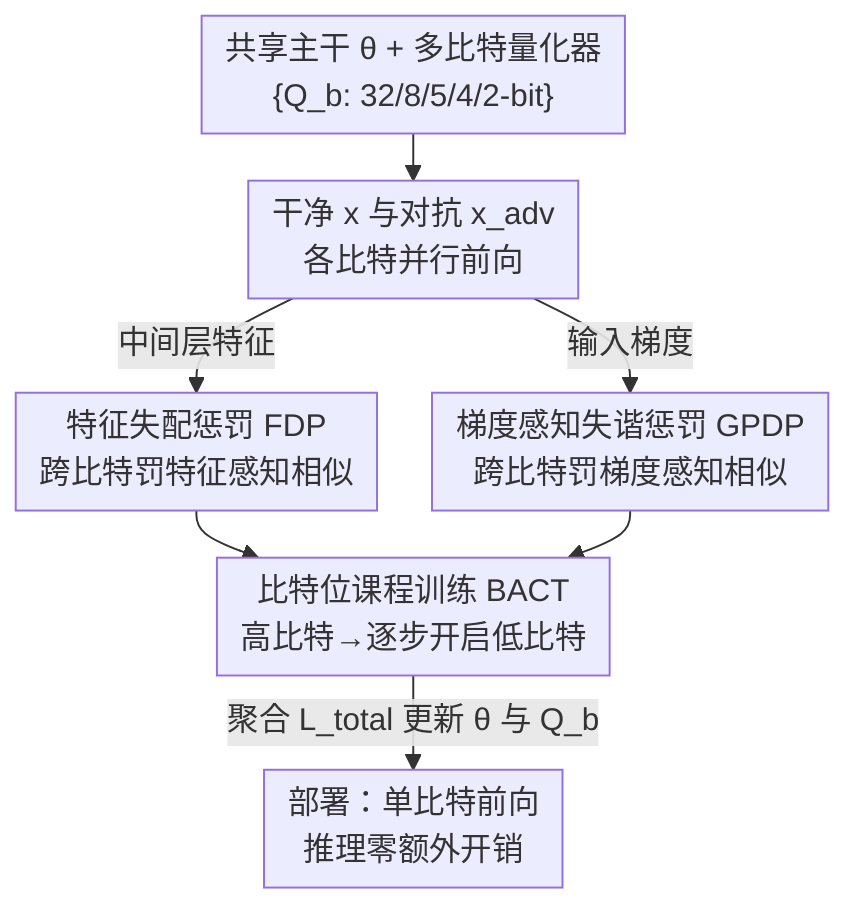

# TriQDef：扰乱语义与梯度对齐，阻断量化网络中的对抗补丁迁移

**会议**: ICLR 2026  
**OpenReview**: [https://openreview.net/forum?id=acQP99PU8y](https://openreview.net/forum?id=acQP99PU8y)  
**代码**: 无  
**领域**: AI安全 / 对抗鲁棒性 / 模型量化  
**关键词**: 对抗补丁、量化神经网络、迁移攻击、感知对齐、量化感知训练

## 一句话总结
本文发现对抗补丁能在不同比特宽度的量化网络之间高度迁移，根因是各比特模型在**中间特征**和**输入梯度**上仍保持很强的「感知对齐」；TriQDef 用两个感知失配正则（FDP + GPDP）外加一套比特位课程训练，在训练时主动打散这种跨比特对齐，使未见补丁/未见比特组合下的攻击成功率（ASR）下降 40% 以上，同时几乎不损失干净精度、推理零额外开销。

## 研究背景与动机

**领域现状**：量化神经网络（QNN）因为省内存、省算力被广泛部署在边缘设备上。学界一直有一种乐观看法——量化会扭曲梯度地形、引入量化噪声，从而天然削弱传统的像素级对抗攻击（梯度遮蔽效应）。

**现有痛点**：这种「量化即防御」的直觉对**对抗补丁**完全失效。补丁是一块局部、高显著性的图案，靠劫持模型注意力而非梯度敏感性来欺骗预测，对输入变换鲁棒、能跨架构泛化。作者实测发现：在全精度模型上生成的补丁，迁移到极端 2-bit 的 QNN 上仍能维持 73% 以上的 ASR（ResNet-56）。也就是说，量化降到 2-bit 都拦不住补丁。

**核心矛盾**：已有防御要么过拟合到某个特定量化设置（如 PBAT 只对训练时见过的补丁/比特宽度有效，换个比特宽度 ASR 暴涨 20%+），要么本质上只针对像素级噪声（DWQ、特征平滑、DiffPure 这类），都没有触及补丁「跨比特迁移」的根本原因。作者的分析揭示：补丁之所以能在不同比特间通用，是因为各比特模型的**内部特征**和**输入梯度信号**之间存在持续的对齐——共享了相同的结构性线索。

**本文目标**：在训练阶段直接拆掉这条「共享通道」，让不同比特宽度的模型学到彼此**不一致**的特征表示和梯度结构，从而让一块补丁无法同时骗倒多个比特版本。

**切入角度**：关键观察是——传统衡量梯度迁移性的工具（余弦相似度）会误判。作者测出不同比特模型之间梯度的余弦相似度其实很低（0.05~0.25，看似方向各异），但它们在**感知层面**（边缘结构、纹理朝向）的相似度极高（HOG 余弦相似度稳定在 0.80 以上）。这条「隐藏的感知对齐」才是补丁迁移的真正温床，而余弦相似度根本捕捉不到。

**核心 idea**：用两个可微的**感知相似度度量**（Edge IoU 与 HOG Cosine）显式地度量并**惩罚**跨比特的特征/梯度对齐，逼着不同比特模型「各想各的」，从结构和纹理层面破坏补丁迁移所依赖的共识。

## 方法详解

### 整体框架
TriQDef 的设定是：一个**共享主干** $\theta$（如 ResNet trunk）配上一组比特位专属的量化器 $\{Q_b\}$（$b \in \{32,8,5,4,2\}$，$Q_{32}$ 为恒等），同一份主干权重在不同比特下经过对应量化器（QAT + STE 直通估计器）就得到不同比特版本。训练时，干净输入 $x$ 和打了补丁的对抗输入 $x_{adv}$ 都会在多个比特下各跑一遍，产生「比特特定视图」。框架在两个层面对这些视图做对比并施加惩罚：中间层特征喂给 FDP，输入梯度喂给 GPDP。所有损失聚合成 $\mathcal{L}_{total}$ 来同时更新 $\theta$ 和 $\{Q_b\}$，整个过程由 BACT 课程调度逐步开启低比特量化器。推理时只用部署比特 $b^\star$ 跑一次前向，零运行时开销、保持纯整数部署。

补丁的构造方式为 $x_{adv} = x \odot (1-M) + P \odot M$，其中 $M$ 是补丁二值掩码，$P$ 默认从一个离线补丁池里随机采样（在全精度模型上预先生成，含不同尺寸/位置/目标类的多样补丁），也可选在线 EOT 优化。

### 关键设计

**1. 特征失配惩罚（FDP）：让各比特模型的中间特征「长得不一样」**

FDP 针对的是「语义对齐」——即便加了补丁，不同比特模型的内部表示在感知上依然高度相似（作者在 ImageNet 上用热力图证实，相邻比特如 5bit↔4bit 的 Edge IoU、HOG 相似度极高），这种表征不变性正是补丁能通用的根基。FDP 的做法是在选定的中间层 $l$ 上，对任意两个不同比特模型 $b_i \neq b_j$ 在对抗输入下的特征 $f^{(l)}_{b_i}(x_{adv})$ 做感知相似度计算，并把它当作惩罚项最小化：

$$\mathcal{L}_{FDP} = \sum_{l\in L}\sum_{\substack{b_i,b_j\in B\\ b_i\neq b_j}}\Big[\alpha\cdot \text{SoftDice}\big(S(E(f^{(l)}_{b_i})),\,S(E(f^{(l)}_{b_j}))\big) + \beta\cdot \cos\big(H(f^{(l)}_{b_i}),\,H(f^{(l)}_{b_j})\big)\Big]$$

这里用了两个互补的感知量：Edge IoU 走结构（Sobel 边缘图的重叠），HOG Cosine 走纹理朝向。由于原始 Edge IoU 的硬二值化、传统 HOG 都不可微，作者换成可微近似——边缘用 SoftDice 配「软二值化」 $S(A;\tau,k)=\sigma(k\cdot(A-\tau))$（锐度 $k{=}100$，阈值取 85 分位数），HOG 用平滑 HOG 描述子，从而端到端可训。$\alpha{=}0.5, \beta{=}1.0$。关键工程取舍是 **FDP 只施加在早中层（L1–L3）**，因为这些层主要编码边缘/纹理等结构线索；高层语义和分类头不受约束，再加上联合的交叉熵损失锚定类别判别性，这样既打散了跨比特的结构共识，又避免语义漂移（实测干净精度偏移 <1%，Grad-CAM 显示各比特仍看同一物体区域）。作者特意说明为何不用 LPIPS：LPIPS 面向人眼高层语义、要三通道大分辨率输入，无法直接作用于单通道/低分辨率的特征或梯度图。

**2. 梯度感知失谐惩罚（GPDP）：堵住余弦相似度看不见的梯度迁移通道**

GPDP 针对的是 FDP 抓不到的梯度层对齐。本文最反直觉的发现是：跨比特模型梯度的余弦相似度很低（0.05~0.25），按传统理论本不该迁移，但补丁照样能迁——因为梯度在**感知结构**上仍高度一致（HOG 余弦稳定 0.80+）。GPDP 直接惩罚这种「感知共识」：对每对比特模型，反传得到输入梯度 $\nabla^{b_i}_x = \nabla_x \mathcal{L}_{CE}(f_{b_i}(x_{adv}),y)$，再对梯度图施加和 FDP 同款的结构+纹理惩罚：

$$\mathcal{L}_{GPDP} = \sum_{\substack{b_i,b_j\in B\\ b_i\neq b_j}}\Big[\alpha\cdot \text{SoftDice}\big(\text{Sobel}(\nabla^{b_i}_x),\,\text{Sobel}(\nabla^{b_j}_x)\big) + \beta\cdot \cos\big(\text{SoftHOG}(\nabla^{b_i}_x),\,\text{SoftHOG}(\nabla^{b_j}_x)\big)\Big]$$

它专门盯着显著性集中的早层梯度结构，通过多样化梯度的边缘/朝向来削弱跨比特共享的对抗脆弱性。为不伤干净精度，**GPDP 只作用于对抗输入**。这一设计的意义在于：它指出梯度迁移性的度量标准本身需要升级——光看方向（余弦）会漏掉感知层的对齐，必须从结构和纹理上把梯度「打散」才算真正断掉迁移链路。

**3. 比特位课程训练（BACT）：让超低比特能稳定地从共享主干里长出来**

直接从零优化 2-bit 这种超低比特量化器会让训练崩掉，FDP/GPDP 的跨比特对比也无从谈起。BACT 的策略是**分阶段开启量化器、始终共享同一个 $\theta$**：先用高精度（32/8-bit）学到稳定特征，再逐步把低比特（5/4/2-bit）纳入当前活跃集合 $B_t$——新比特通过在留出子集上做短校准来初始化它的观测器（不复制权重），然后和已激活的比特一起联合微调。这样既不用维护多个主干（省内存），又通过共享 $\theta$ 强制了跨比特耦合，经验上提升鲁棒性并稳定了两个感知惩罚的优化。配合的总损失为：

$$\mathcal{L}_{total} = \mathcal{L}_{clean} + \lambda_{adv}\mathcal{L}_{adv} + \lambda_{FDP}\mathcal{L}_{FDP} + \lambda_{GPDP}\mathcal{L}_{GPDP}$$

其中 $\mathcal{L}_{clean}$、$\mathcal{L}_{adv}$ 分别是干净/对抗输入在活跃比特集 $B_t$ 上的平均交叉熵，每个 mini-batch 按比例 $\rho{=}0.5$ 打补丁以防过度正则。默认 $\lambda_{adv}{=}1$、$\lambda_{FDP}{=}0.8$、$\lambda_{GPDP}{=}0.5$。三者协同：FDP 断特征对齐、GPDP 断梯度对齐、BACT 提供让这两者得以在多比特上稳定计算的训练骨架。

### 损失函数 / 训练策略
- 量化采用 fake-quantization QAT + STE，权重 per-channel、激活 per-tensor 的对称均匀量化器，目标比特 $B=\{32,8,5,4,2\}$。
- CIFAR-10 训 200 epoch、ImageNet 训 120 epoch，SGD（动量 0.9，weight decay $1\times10^{-4}$），初始学习率 0.1，在 50%/75% 处各降 10×，batch size 128，A100。
- 补丁默认离线池采样（效率优先），消融/自适应设置下用 EOT 在线优化（随机位置 + 几何抖动 + 随机采样比特 $b\sim B_t$ 反传），防止过拟合到单一比特。

## 实验关键数据

### 主实验

跨比特鲁棒性（ASR %，越低越好），对比 PBAT 与 DWQ。TriQDef 在所有攻击/比特下 ASR 最低，且未见补丁下几乎不退化：

| 防御 | 数据集 | LAVAN-2bit | GAP-2bit | PatchAttack-2bit |
|------|--------|-----------|----------|------------------|
| PBAT | CIFAR-10 | 39.7 | 37.9 | 49.7 |
| DWQ | CIFAR-10 | 76.4 | 73.5 | 78.2 |
| **TriQDef** | CIFAR-10 | **26.2** | **17.2** | **20.7** |
| TriQDef（未见） | CIFAR-10 | 27.3 | 25.5 | 23.5 |
| PBAT（未见） | CIFAR-10 | 65.3 | 63.2 | 70.1 |

干净精度（%，越高越好）几乎不掉，优于 PBAT、贴近 Standard QAT：

| 防御 | 数据集 | 32bit | 5bit | 4bit | 2bit |
|------|--------|-------|------|------|------|
| Standard QAT | CIFAR-10 | 89.4 | 85.1 | 80.5 | 78.2 |
| PBAT | CIFAR-10 | 88.2 | 81.6 | 77.8 | 75.5 |
| **TriQDef** | CIFAR-10 | 89.4 | 83.3 | 78.2 | 75.8 |

对比推理时预处理防御（ImageNet ResNet-50，Robust Accuracy %，越高越好）：

| 防御 | 类型 | 32bit | 2bit |
|------|------|-------|------|
| JEDI (2023) | 预处理 | 64.3 | 23.4 |
| DiffPure (2024) | 预处理 | 41.7 | 19.6 |
| PBCAT (2025) | 训练 | 57.8 | 41.2 |
| **TriQDef** | 训练 | **78.3** | **65.8** |

预处理类防御在低比特下崩盘（熵图/特征粒度被量化破坏，DiffPure 还要 5.6~17 秒/图、>7GB 显存），而 TriQDef 是纯训练时防御、推理零开销。

### 消融实验

ASR（%，LAVAN，越低越好）：

| 配置 | 设定 | CIFAR-10 2bit | ImageNet 2bit |
|------|------|---------------|---------------|
| w/o FDP | Seen | 55.9 | 52.1 |
| w/o GPDP | Seen | 37.6 | 42.5 |
| Full TriQDef | Seen | **26.2** | **28.5** |
| Full TriQDef | Unseen | 27.3 | 30.7 |

### 关键发现
- **FDP 贡献最大**：去掉 FDP，ASR 在 2-bit 上从 26.2% 飙到 55.9%（CIFAR-10），说明跨比特语义对齐一旦保留，补丁立刻恢复强迁移。
- **GPDP 不可或缺**：去掉 GPDP，ASR 普遍上升 10%+，证实只断特征不断梯度仍有迁移漏洞；二者互补缺一不可。
- **量化本身远不够**：DWQ 这类只靠量化/精度随机化的方法 ASR 高达 70%+，印证了「量化即防御」的直觉是错的——必须显式做感知/结构失配。
- **泛化好**：未见补丁/未见比特下 TriQDef 仅 +2.1% 左右（GAP/CIFAR-10），而 PBAT 常 +15% 以上。

## 亮点与洞察
- **「余弦相似度会骗人」是全文最锋利的洞察**：低余弦≠不迁移，感知层（HOG 0.80+）的对齐才是补丁迁移的真凶。这把对抗迁移性的诊断工具从「方向」升级到「结构+纹理」，对其他迁移攻击研究也有借鉴价值。
- **把不可微的视觉描述子改造成可训正则**：用 SoftDice + 软二值化边缘、平滑 HOG，把 Edge IoU / HOG 这些经典 CV 度量塞进端到端训练，是个可复用的工程 trick。
- **共享主干 + 多量化器**的参数化很巧妙：一份 $\theta$ 在多比特间被「拉扯」，既省内存又天然制造跨比特耦合，让感知失配有施力对象，比维护多个独立模型优雅得多。
- **把防御成本全压到训练时**：推理单比特前向、零额外开销、保持整数部署，正好契合边缘场景对预处理类防御（DiffPure 慢、JEDI 依赖浮点）最忌讳的延迟约束。

## 局限与展望
- 实验集中在 CNN（ResNet/VGG 等）+ CIFAR-10/ImageNet，ViT（Swin/DeiT）只用于评估迁移性、未作为被保护对象训练，对 Transformer 类 QNN 的有效性尚未充分验证。
- 训练成本上升：每个 batch 要在多个比特下各跑前向、还要算梯度（GPDP 需二阶反传），多比特对比的开销随比特数增长，作者把 compute/memory 讨论放在附录，正文未给量化对比。
- 防御本质依赖「攻击者无法接触训练管线」的假设；虽然测了黑盒 PatchAttack，但对完全知道 TriQDef 训练细节、专门绕过感知失配的自适应白盒攻击者，鲁棒性边界仍待考。
- 多个超参（$\alpha,\beta,\lambda_{FDP},\lambda_{GPDP},\rho$、施加层 L1–L3）靠附录消融选定，跨数据集/架构的可迁移性和敏感性还需更系统的验证。

## 相关工作与启发
- **vs PBAT（Patch-Based Adversarial Training）**：PBAT 把补丁模式喂进训练做增强，只对见过的补丁/比特有效，换比特就失效（ASR +20%+）；TriQDef 不靠补丁增强，而是直接拆「跨比特对齐」这个迁移根因，因此对未见补丁/未见比特泛化得多。
- **vs DWQ / 随机精度推理 / 特征平滑**：这些方法本质针对像素级噪声，靠量化噪声或随机化制造梯度遮蔽，对结构化大补丁无能为力；TriQDef 显式建模补丁迁移的结构性来源。
- **vs JEDI / DiffPure 等推理时预处理**：它们在全精度下尚可，但量化后特征粒度被破坏、且引入浮点依赖与高延迟，不适合边缘 QNN；TriQDef 把防御搬到训练时、推理零开销。
- **启发**：把「跨模型一致性/对齐」当作迁移攻击的可优化目标来主动破坏，这一思路可迁移到模型集成防御、跨架构迁移防御、甚至后门防御等需要「打散共享脆弱性」的场景。

## 评分
- 新颖性: ⭐⭐⭐⭐⭐ 首次系统研究 QNN 中补丁的跨比特迁移，并指出余弦相似度的盲区、提出感知层失配防御，视角新颖
- 实验充分度: ⭐⭐⭐⭐ 覆盖两数据集、多架构、多攻击（含黑盒）与充分消融，但 ViT 防御与训练开销量化欠缺
- 写作质量: ⭐⭐⭐⭐ 动机—现象—方法的逻辑链清晰，公式与算法完整，部分细节压在附录
- 价值: ⭐⭐⭐⭐ 戳破「量化即防御」的迷思，给边缘 QNN 提供推理零开销的实用补丁防御方案

<!-- RELATED:START -->

## 相关论文

- [\[ICLR 2026\] Dataless Weight Disentanglement in Task Arithmetic via Kronecker-Factored Approximate Curvature](dataless_weight_disentanglement_in_task_arithmetic_via_kronecker-factored_approx.md)
- [\[ICLR 2026\] Sample-Efficient Distributionally Robust Multi-Agent Reinforcement Learning via Online Interaction](sample-efficient_distributionally_robust_multi-agent_reinforcement_learning_via_.md)
- [\[ICLR 2026\] Robustify Spiking Neural Networks via Dominant Singular Deflation under Heterogeneous Training Vulnerability](robustify_spiking_neural_networks_via_dominant_singular_deflation_under_heteroge.md)
- [\[ICLR 2026\] Risk-Sensitive Agent Compositions](risk-sensitive_agent_compositions.md)
- [\[ICLR 2026\] WARP: Weight Teleportation for Attack-Resilient Unlearning Protocols](warp_weight_teleportation_for_attack-resilient_unlearning_protocols.md)

<!-- RELATED:END -->
