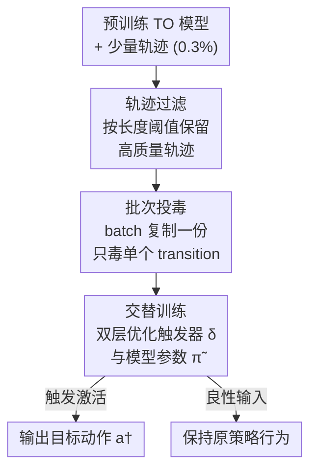

# TrojanTO: Action-Level Backdoor Attacks Against Trajectory Optimization Models

**会议**: ICLR 2026  
**OpenReview**: [https://openreview.net/forum?id=CNrU5kGJYG](https://openreview.net/forum?id=CNrU5kGJYG)  
**代码**: https://github.com/AndssY/TrojanTO （有）  
**领域**: AI安全 / 后门攻击 / 离线强化学习  
**关键词**: 后门攻击, 轨迹优化模型, 离线RL, 训练后攻击, Decision Transformer

## 一句话总结
针对 Decision Transformer 这类轨迹优化（TO）模型，提出首个动作级后门攻击 TrojanTO：作为一种"训练后"攻击，只需污染 0.3% 的轨迹、不碰奖励信号，用"轨迹过滤 + 批次投毒 + 交替训练"在预训练模型上植入触发器与目标动作的强耦合，在六个 D4RL 任务、三种 TO 架构上把综合得分 CP 从基线的 0.34 提到 0.70。

## 研究背景与动机

**领域现状**：离线强化学习（offline RL）能从已有数据集直接学策略而无需在线交互，其中以 Decision Transformer（DT）、Decision ConvFormer（DC）为代表的轨迹优化（TO）模型最受欢迎——它们把决策问题重写成序列建模问题，输入过去的 (动作, 状态, returns-to-go) 序列、输出下一个动作，靠最小化重构损失来拟合目标动作，已在机器人控制、具身智能等连续动作空间任务上取得成功。

**现有痛点**：RL 后门攻击此前几乎全是"训练时攻击"——通过在智能体训练过程中操纵奖励信号（reward manipulation）来植入后门，因为传统 RL 智能体基于 Bellman 方程、靠奖励最大化来优化策略，奖励就是关键攻击向量。但这套范式对 TO 模型几乎失效：其一，TO 模型直接拟合目标动作、最小化重构损失，根本不依赖奖励最大化，奖励操纵打不中要害；其二，TO 模型规模和训练成本越来越大，跟训练过程绑定的攻击越来越不现实。最相关的前作 Baffle 是数据投毒的策略级后门，需要高达 10% 的污染率，既不实用也不隐蔽。

**核心矛盾**：高维连续动作空间让精确操纵变得异常困难——动作是实值向量而非有限离散选项，要在低预算下可靠地把"触发器"和"某个具体目标动作"绑死，本身就很难；而 TO 模型对奖励不敏感又堵死了传统攻击路径。

**本文目标**：在不接触原始训练数据、不重训模型的前提下，仅修改预训练 TO 模型参数，用极低预算植入"动作级"后门——触发器一旦激活，模型就输出攻击者指定的目标动作，且良性输入下行为与原模型几乎无法区分。

**切入角度**：作者先做了一组实证研究，拆解影响 TO 后门的三个基本要素：(1) 目标动作的选择显著影响攻击成功率（边界动作如 '1'/'-1' 的 ASR 接近 100%，而动作区间内部的 '0' 在 Walk 上只有 0.11），所以评测必须覆盖多种目标动作；(2) 触发器设计（选哪几维、取什么值）至关重要，维度 (1,2,3) 的 ASR 可达 0.88-0.92，而 (1,10,14) 几乎为 0；(3) 奖励操纵对 TO 后门基本无效——改变目标动作关联的奖励值，ASR 和 BTP 几乎不变。这三条结论直接指向"该往触发器-动作耦合上发力，而不是奖励"。

**核心 idea**：把攻击从训练过程中解耦出来，做成一种**训练后（post-training）攻击**，用"一致性投毒"原则——轨迹过滤保性能、批次投毒保触发一致、交替训练强化触发器与目标动作的耦合——在已发布的预训练模型上精准植入后门。

## 方法详解

### 整体框架
TrojanTO 是一种供应链场景下的训练后攻击：攻击者拿到一个预训练好的 TO 模型和极少量（约 0.3%）轨迹，输出一个被植入后门的模型 $\tilde{\pi}$，使其在触发器 $\delta$ 激活时输出目标动作 $a^\dagger$，在良性输入下与原模型 $\pi$ 行为一致。整个流程由三个串联模块组成：先用**轨迹过滤**剔除偏离智能体真实行为分布的低质量轨迹，避免后门训练过拟合到糟糕行为而损害良性性能；再用**批次投毒**对每个 batch 复制一份、只投毒其中单个随机 transition，保证训练时触发器的上下文和评测时一致；同时用**交替训练**在触发器 $\delta$ 和模型参数 $\tilde{\pi}$ 之间做双层优化，把触发器与目标动作的耦合做强。

攻击的总目标可写成一个双目标损失：触发激活时逼近目标动作、良性时贴近原策略，

$$\min_{\tilde{\pi}} \sum_s \left\| \tilde{\pi}([a], [s]+\delta, [\hat{R}])_t - a^\dagger \right\| + \lambda \left\| \tilde{\pi}([a], [s], [\hat{R}])_t - \pi([a], [s], [\hat{R}])_t \right\|$$

其中 $[s]+\delta$ 表示只在最近一个状态 $s_t$ 上加触发器，$\lambda$ 平衡攻击有效性与隐蔽性。

### 关键设计

**1. 轨迹过滤（TF）：让投毒数据贴合高质量行为分布，守住良性性能**

离线 RL 的核心难题之一是分布偏移，后门训练在数据有限时尤其受其困扰——若拿次优轨迹投毒，模型会过拟合到糟糕行为，导致良性任务性能 BTP 下降。作者的处理基于一个朴素假设："更长的轨迹更能代表成功的行为"。于是给定初始 $N$ 条轨迹 $\{\tau_i\}_{i=1}^N$，只保留序列长度超过阈值的那些，构成过滤集 $F_\tau \triangleq \{\tau_i \mid N_s(\tau_i) \ge \epsilon\}$，其中 $N_s(\tau_i)$ 是轨迹 $i$ 的序列长度、$\epsilon$ 是预设最小长度阈值。后续的后门训练和触发器优化都**只在 $F_\tau$ 上进行**。这一步看似简单，却是隐蔽性的关键——消融显示去掉 TF 后 BTP 从 0.914 跌到 0.850，因为投毒分布若偏离评测时的高质量轨迹，模型良性表现就会被拖垮。

**2. 批次投毒（BP）：每批只毒一个 transition，消除训练与评测的上下文错配**

Transformer 类模型按序列处理、训练时普遍用 teacher-forcing，如果把整个 batch 的所有状态都加触发器，会给触发器带来 OOD 问题——训练时触发器所处的上下文和评测时单点激活的上下文差异巨大，导致后门在真实评测中失效。TrojanTO 因此采用"一致性投毒"策略：把每个 batch $B_c = ([a], [s], [\hat{R}])$ 复制成两份，一份保持干净，另一份只随机选**单个** transition 投毒（基于第 4 节结论，RTG 不改），得到 $B_p = ([a_{t-K:t-2}, a_{t-1}], [s_{t-K+1:t-1}, s_t+\delta], [\hat{R}])$。后门损失只盯着这个被毒的 transition，逼模型对它预测目标动作：

$$\mathcal{L}_p = \mathbb{E}_{B_p \sim F_\tau}\left[ \left\| \tilde{\pi}(B_p)_t - a^\dagger \right\|^2 \right]$$

同时在干净副本上做标准训练以维持主任务，得到干净损失 $\mathcal{L}_c = \mathbb{E}_{B_c \sim F_\tau}\left[\frac{1}{T}\sum_{t=0}^{T}(\tilde{\pi}(B_c)_t - a_t)^2\right]$，最终目标 $\mathcal{L} = \mathcal{L}_p + \lambda \mathcal{L}_c$。让训练时触发器只出现在单点、与评测时单步激活方式一致，正是 BP 同时撑住 ASR 和 BTP 的原因——消融显示去掉 BP 后 ASR 从 0.719 降到 0.528、BTP 从 0.914 降到 0.836。

**3. 交替训练（AT）：触发器与模型参数双层协同优化，把耦合做强**

要在高维连续空间里建立可靠的触发器-目标动作连接，光更新模型不够，还得同时优化触发器本身。TrojanTO 借鉴输入-模型协同优化（IMC）思想，把目标 $\min_{\delta, \tilde{\pi}} \mathbb{E}_{\tau \in F_\tau}[\mathcal{L}(\tau, \delta; \tilde{\pi})]$ 重写成双层优化：

$$\begin{cases} \delta^* = \arg\min_\delta \mathbb{E}_{\tau \in F_\tau}[\mathcal{L}_p(\tau, \delta; \tilde{\pi}^*)] \\ \tilde{\pi}^* = \arg\min_{\tilde{\pi}} \mathbb{E}_{\tau \in F_\tau}[\lambda \mathcal{L}_p(\tau, \delta^*; \tilde{\pi}) + (1-\lambda)\mathcal{L}_c(\tau; \tilde{\pi})] \end{cases}$$

它交替地优化触发器 $\delta$ 和模型参数 $\tilde{\pi}$。触发器学习阶段用动量迭代快速梯度符号法（MI-FGSM）生成 $\delta$，更新规则为 $g_{i+1} = \mu g_i + \frac{\nabla_\delta \mathcal{L}_p}{\|\nabla_\delta \mathcal{L}_p\|_1}$、$\delta^*_{i+1} = \text{clip}(\delta^*_i + \alpha \cdot \text{sign}(g_{i+1}), \delta_{\min}, \delta_{\max})$；之后再更新模型参数。为对抗 DRL 训练不稳定，两个阶段都用多步更新而非单步；并且在花掉一半训练预算后，优化转为只更新模型参数 $\tilde{\pi}$。AT 是攻击有效性的主要来源——消融显示去掉 AT 后 ASR 从 0.719 暴跌到 0.507。

### 损失函数 / 训练策略
最终训练目标是后门损失与干净损失的加权和 $\mathcal{L} = \mathcal{L}_p + \lambda \mathcal{L}_c$，$\lambda \in [0,1]$ 平衡攻击有效性与隐蔽性。整个流程作为训练后攻击，只在 $F_\tau$ 上运行、约占总轨迹 0.3% 的投毒预算，配合 MI-FGSM 触发器优化和多步交替更新，且在后半程切换为只更新模型参数以稳定收敛。

## 实验关键数据

### 主实验
在 6 个 D4RL 环境（Hopper、HalfCheetah、Walker2d、AntMaze、Kitchen、Pen）、3 种 TO 模型（DT、GDT、DC）上，对 3 个随机种子、3 种目标动作取平均，与 Baffle、IMC 对比。评测指标：ASR（攻击成功率）、BTP（良性任务性能，越接近 1 越隐蔽）、CP（ASR 与 BTP 的调和平均，综合衡量）。

| 方法 | 平均 ASR↑ | 平均 BTP↑ | 平均 CP↑ | 投毒率 |
|------|-----------|-----------|----------|--------|
| Baffle | 0.369 | 0.792 | 0.342 | 10% |
| IMC | 0.575 | 0.853 | 0.551 | — |
| **TrojanTO** | **0.719** | **0.914** | **0.701** | **0.3%** |

TrojanTO 的平均 CP 达 0.701，比 Baffle（0.342）提升约 105%、比 IMC（0.551）提升 27.2%；ASR 0.719 而投毒率仅 0.3%，而 Baffle 用 10% 投毒率才到 0.369 ASR。在 DC 架构上 TrojanTO 平均 CP 高达 0.814。基线在特定设置下会崩溃：IMC 在 DT+Hopp 上 CP 仅 0.013、DT+Ant 仅 0.133；Baffle 在 DT+Walk 上完全失效（CP=0.000）。

### 消融实验
对三个模块逐个去除（在三种模型上取平均）：

| 配置 | 平均 ASR | 平均 BTP | 平均 CP | 说明 |
|------|---------|---------|---------|------|
| TrojanTO（完整） | 0.719 | 0.914 | 0.701 | 完整模型 |
| w/o TF（去轨迹过滤） | 0.678 | 0.850 | 0.657 | BTP 掉 0.064，隐蔽性受损 |
| w/o BP（去批次投毒） | 0.528 | 0.836 | 0.517 | ASR 掉 0.191、BTP 掉 0.078，影响最全面 |
| w/o AT（去交替训练） | 0.507 | 0.911 | 0.517 | ASR 暴跌 0.212，攻击有效性主力 |

### 关键发现
- **AT 管"打得中"、TF/BP 管"藏得住"**：去掉 AT 让 ASR 从 0.719 跌到 0.507，说明交替训练是攻击有效性的主要贡献者；去掉 TF/BP 主要拖垮 BTP（从 0.914 分别降到 0.850/0.836），印证它们服务于"精准投毒、保住隐蔽性"。
- **目标动作与触发器维度是隐藏的敏感超参**：边界动作（'1'/'-1'）ASR 接近 100%，而区间内部动作（如 Walk 的 '0'）只有 0.11；触发器维度 (1,2,3) 的 ASR 0.88-0.92，(1,10,14) 几乎为 0——这也是论文主张评测必须覆盖多种目标动作的依据。
- **持续后门可维持 k 步**：触发器作用于 $s_{t-k}$ 时，目标动作能连续输出 k 步，CP 仅小幅退化；但上限受 TO 模型有限上下文窗口约束（如 <20 步），超出后触发器被挤出上下文、后门失活。
- **对触发器扰动鲁棒**：给触发器每维乘 $(1+\eta_d)$、$\eta_d \sim U(-\epsilon, \epsilon)$，即使 10% 噪声 ASR 仍平缓下降（Half 保持 1.000、Walk 从 0.980 降到 0.777），呈渐变而非骤崩，符合连续模型的平滑性——这放大了真实威胁，但也可能引发"伪触发器"反而损害隐蔽性。
- **防御**：测了权重剪枝、可证明防御、谱分析、激活聚类、微调等基线防御，只有微调最有效，其余基本无法缓解 TrojanTO。

## 亮点与洞察
- **"奖励操纵无效"是反直觉但关键的实证发现**：传统 RL 后门把宝押在奖励信号上，本文用实验证明 TO 模型作为"条件行为克隆"模型对奖励近乎免疫，于是把火力全转向触发器-动作耦合——这个 negative result 直接重塑了攻击设计方向。
- **训练后攻击 + 0.3% 投毒率的威胁模型很现实**：不需重训大模型、不碰原始数据集，正好契合"下载预训练模型直接部署"的供应链场景，门槛远低于 Baffle 的 10% 投毒。
- **"一致性投毒"思想可迁移**：每批只毒单个 transition 来消除训练-评测上下文错配，这个针对序列模型 teacher-forcing 特性的设计，对其他基于 Transformer 的序列决策后门同样有借鉴价值。
- **跨三种 TO 架构（DT/GDT/DC）通用**，说明攻击锚定的是 TO 范式的共性弱点而非某个具体网络。

## 局限与展望
- **持续后门受上下文窗口硬约束**：触发器被挤出上下文窗口（如 20 步）后后门即失活，无法实现真正长时程的持续操纵。
- **触发器需要在推理时注入观测**：攻击假设攻击者能在推理时操纵智能体的输入观测来插入触发器，这在某些真实部署中未必成立。
- **目标动作/触发器维度敏感性高**：ASR 强依赖目标动作是否为边界动作、触发器选哪几维，泛化到任意目标动作时效果会明显下降（如内部动作 ASR 仅 0.11）。
- **微调可有效防御**：作为攻击方法，被简单微调即可缓解是其实用性上的隐忧；后续可探索对微调更鲁棒的后门构造。
- **鲁棒性的双刃剑**：对扰动的鲁棒性虽放大威胁，但也会催生伪触发器、反过来削弱隐蔽性，二者的张力尚未充分刻画。

## 相关工作与启发
- **vs Baffle（Gong et al., 2024b）**：Baffle 是离线 RL 的数据投毒、策略级后门，靠预训练的对抗策略生成恶意轨迹注入训练集，投毒率高达 10%、且属预训练阶段攻击。TrojanTO 是训练后、动作级攻击，投毒率仅 0.3%，CP 提升约 105%，威胁模型更贴近供应链现实。
- **vs IMC（Pang et al., 2020）**：IMC 提出输入-模型协同优化思想，TrojanTO 借鉴其双层优化框架做交替训练，但在 TO 模型上 IMC 缺少 TF/BP 的隐蔽性保障，在 DT+Hopp 等设置下 CP 崩到 0.013，而 TrojanTO 用一致性投毒稳住了 BTP，平均 CP 0.701 vs IMC 0.551。
- **vs 传统 RL 后门（TrojDRL 等）**：传统范式依赖训练时奖励操纵，本文证明该路径对不靠奖励最大化的 TO 模型基本无效，转而锚定触发器设计——这是从"操纵奖励"到"操纵输入-动作耦合"的范式转变。

## 评分
- 新颖性: ⭐⭐⭐⭐⭐ 首个针对 TO 模型的动作级、训练后后门攻击，并用实证推翻"奖励操纵"这一传统攻击向量
- 实验充分度: ⭐⭐⭐⭐⭐ 覆盖 6 任务×3 架构×3 目标动作×3 种子，含持续攻击、扰动鲁棒、五种防御等全面分析
- 写作质量: ⭐⭐⭐⭐ 动机推导清晰、三模块分工明确，但部分实证结论分散在附录
- 价值: ⭐⭐⭐⭐ 揭示 TO 模型在供应链场景的现实安全威胁，对决策大模型的安全研究有警示意义

<!-- RELATED:START -->

## 相关论文

- [\[ICLR 2026\] Defending against Backdoor Attacks via Module Switching](defending_against_backdoor_attacks_via_module_switching.md)
- [\[ICLR 2026\] Reliable Poisoned Sample Detection against Backdoor Attacks Enhanced by Sharpness-Aware Minimization](reliable_poisoned_sample_detection_against_backdoor_attacks_enhanced_by_sharpnes.md)
- [\[CVPR 2026\] FlowHijack: A Dynamics-Aware Backdoor Attack on Flow-Matching Vision-Language-Action Models](../../CVPR2026/ai_safety/flowhijack_a_dynamics-aware_backdoor_attack_on_flow-matching_vision-language-act.md)
- [\[CVPR 2026\] Towards Human-Imperceptible Backdoor Attacks on Text-to-Image Diffusion Models](../../CVPR2026/ai_safety/towards_human-imperceptible_backdoor_attacks_on_text-to-image_diffusion_models.md)
- [\[CVPR 2026\] Eliminate Distance Differences Induced by Backdoor Attacks: Layer-Selective Training and Clipping to Mask Backdoor Models](../../CVPR2026/ai_safety/eliminate_distance_differences_induced_by_backdoor_attacks_layer-selective_train.md)

<!-- RELATED:END -->
