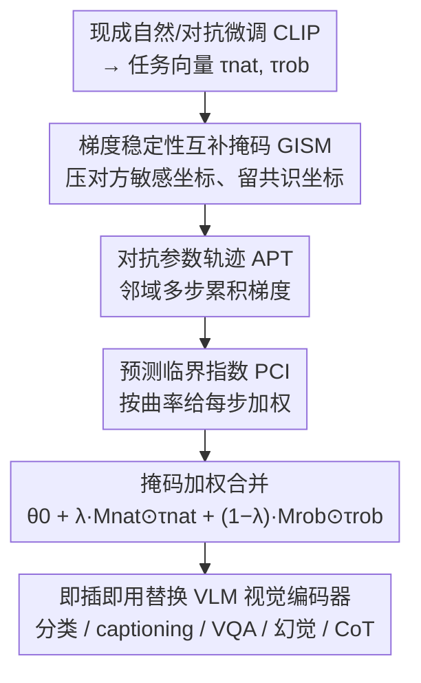

# Tug-of-War No More: Harmonizing Accuracy and Robustness in Vision-Language Models via Stability-Aware Task Vector Merging

**会议**: ICLR 2026  
**OpenReview**: [https://openreview.net/forum?id=KOO1cDm2bt](https://openreview.net/forum?id=KOO1cDm2bt)  
**领域**: 多模态VLM / 对抗鲁棒性 / 模型合并  
**关键词**: 任务向量合并, 对抗鲁棒性, CLIP, 干净-鲁棒权衡, 梯度稳定性  

## 一句话总结
针对「让 VLM 变鲁棒就一定掉干净精度」这个老大难权衡，本文提出 PISTOLE——不重训，而是把现成的「自然微调」和「对抗微调」CLIP 的任务向量按**预测稳定性**有选择地合并：用互补的梯度稳定性掩码压住会互相打架的坐标、用曲率敏感的指标加权对抗参数轨迹，从而把原本接近直线的干净-鲁棒前沿「掰弯」出更好的甜点，在 14 个数据集上同时把干净和鲁棒精度抬高约 5%。

## 研究背景与动机

**领域现状**：CLIP 这类基础视觉-语言模型在各种 benchmark 上表现亮眼，但对对抗扰动极度脆弱，一点点输入扰动就能让性能崩塌。主流补救手段是**对抗微调**（TeCoA、FARE、PMG 等），把对抗样本塞进训练里换取鲁棒性。

**现有痛点**：对抗微调几乎总是以牺牲干净精度为代价，而且要找到一个能接受的「干净-鲁棒」折中点，往往得做昂贵的超参搜索 + 多次重训，扩展性很差。这个**干净精度与对抗鲁棒性的权衡**被反复证明是个顽固的根本张力，即使模型越做越大也消不掉。

**核心矛盾**：作者先问了一个很自然的问题——既然参数空间的「模型合并」能不重训就融合多个微调模型，那能不能把自然微调和对抗微调两个**互相冲突**的目标也合并起来？但他们的初步实验发现：直接把两个任务向量做线性相加（vanilla merging），得到的是一条**近乎直线**的干净-鲁棒折中曲线，根本没有甜点。原因在于朴素相加对所有坐标**一视同仁**，分不清哪些参数对两个目标都有利、哪些会制造冲突。

**切入角度**：作者通过梯度分析（图 1）观察到，自然损失和对抗损失的梯度方向**只有中等程度的一致性，且随攻击半径增大而退化**——也就是说，兼容方向和冲突方向是**共存**的。既然如此，合并就不该均匀加，而应**有选择地**保留共识坐标、压制对抗坐标。

**核心 idea**：把**预测稳定性**当作「跨目标兼容性」的代理信号——一个参数若在对方目标下扰动不变，就该保留；若对方目标会强烈改动它，就该衰减。据此构造互补掩码筛选任务向量，再合并，得到 PISTOLE（PredIction STability-aware mOdeL mErging）。

## 方法详解

### 整体框架
PISTOLE 的输入是两个**现成的**微调 CLIP 视觉编码器：一个在干净数据上经验风险最小化得到的自然模型 $\theta_{nat}$，一个经对抗微调（默认用 PMG，10 步 PGD，$\ell_\infty,\ \epsilon=2/255$）得到的鲁棒模型 $\theta_{rob}$。相对预训练 $\theta_0$，它们各自定义任务向量 $\tau_{nat}=\theta_{nat}-\theta_0$、$\tau_{rob}=\theta_{rob}-\theta_0$。目标是不做任何重训，仅靠对这两个任务向量做**逐坐标的有选择合并**，得到一个干净-鲁棒折中更好的编码器 $\theta_{\text{PISTOLE}}$。

整条管线分三步：先用两个目标的梯度幅值估出每个参数的稳定性，构造一对**互补稳定性掩码**（GISM），压住对方目标想大改的坐标；再沿**对抗参数轨迹**（APT）多步累积梯度，把单点估计扩展到邻域、捕捉高曲率口袋；累积时用**预测临界指数**（PCI）给每一步加权，让脆弱（高曲率）的预测多贡献。最后把两条任务向量分别乘上各自的 path-refined 掩码、按混合系数 $\lambda$ 相加，叠回 $\theta_0$ 得到合并模型。

### 关键设计

**1. GISM 梯度稳定性互补掩码：让两个目标互不踩脚**

朴素相加之所以画出直线，是因为它不区分哪些坐标对方目标会强烈改动。GISM 的思路是：梯度幅值大的坐标，就是该目标「想动」的敏感坐标；为避免合并时重新引入对抗，**用一方的敏感坐标去抑制另一方的任务向量**。具体先把两个目标的期望梯度逐层归一化（除以该层最大幅值再做 $\gamma$ 次幂压缩动态范围），得到 $\tilde g_{nat},\tilde g_{rob}\in[0,1]^d$，再构造互补掩码

$$M_{nat}=(1-\tilde g_{rob})^{\kappa},\qquad M_{rob}=(1-\tilde g_{nat})^{\kappa},$$

其中 $\kappa\ge1$ 用来锐化选择性。直觉是：施加到 $\tau_{nat}$ 上的掩码 $M_{nat}$ 由**鲁棒目标**的梯度决定——鲁棒目标越想改的坐标，越被压低。为了给「稳定性预算」一个可控上界，再逐层做分位数封顶（把每层最敏感的 top-$q$ 坐标截到 $q$-分位数）。论文用 Theorem 1 证明：经对方掩码过滤后，跨目标的一阶干扰被一个可调因子 $\rho\le1$ 上界住，且 $\kappa$ 越大、封顶越紧，$\rho$ 单调变小（Corollary 1 说明这相对无掩码相加是严格收缩）。这就是把直线前沿「掰弯」的数学根据。

**2. APT 对抗参数轨迹：把单点稳定性扩展到邻域**

GISM 的掩码只看了 $(\theta_{nat},\theta_{rob})$ **单点**的梯度幅值，能捕捉一阶不稳定，但会漏掉附近「高曲率口袋」——那些单点平稳、稍一挪动就敏感飙升的坐标。APT 用**参数空间的对抗扰动**来补这个洞：对每个目标 $s$，在以 $\theta_s$ 为中心、半径 $\eta\|\theta_s\|_F$ 的 Frobenius 球内，沿局部最坏方向做 $K$ 步投影梯度上升

$$\theta_s^{(i+1)}\leftarrow \Pi_{\theta_s+V_{\theta_s}}\big(\theta_s^{(i)}+\beta\, u_s^{(i)}\big),$$

其中 $u_s^{(i)}$ 是归一化的损失梯度方向。自然目标走干净输入、鲁棒目标走对抗输入。沿这条轨迹把梯度累积起来，重建出 path-integrated 的稳定性分数 $\tilde g_s^{\text{path}}$，再按和 GISM 同样的方式做互补掩码与封顶。直觉很朴素：在最坏方向的参数轻推下还稳的坐标，留着才安全；沿轨迹梯度大的坐标是脆弱的，合并时要衰减。

**3. PCI 预测临界指数：让脆弱的预测多说话**

沿轨迹累积梯度时，每一步该等权吗？不该——平坦、置信度饱和的区域贡献应弱化，高曲率、脆弱的区域应放大。PCI 就是这样一个曲率感知的标量，衡量预测对参数微扰有多敏感：

$$\text{PCI}(x,c,\theta)=\mathbb{E}_{\Delta\in V_\theta}\frac{p_c(x;\theta+\Delta)-p_c(x;\theta)}{p_c(x;\theta)},$$

即在参数球 $V_\theta$ 内各向同性采样扰动 $\Delta$，看真值类置信度的相对变化期望。PCI 大说明这个预测「一碰就变」（脆弱知识），小则说明稳健。用它加权 path-integrated 梯度（式 10），高 PCI 样本在累积梯度里被上调，把合并引向那些「不处理就会主导融合后误差」的脆弱预测。论文用 Theorem 2 给出 PCI 的二阶刻画：在小 $\eta$ 下 $\text{PCI}\approx \frac{\sigma^2}{2}\frac{\mathrm{Tr}(H_c(\theta))}{p_c(x;\theta)}$，即 PCI 正比于 Hessian 迹（曲率）。这把 PCI 加权和「偏向平坦极小、更好泛化」严格挂钩——曲率分析（图 5）也证实 PISTOLE 全程把损失-参数曲率压得比 vanilla 低，且操作点 $\lambda=0.2$ 处曲率最低、折中最好。

### 损失函数 / 训练策略
PISTOLE **本身不训练**，是个无重训的合并算子。底座是 ViT-L/14 的 CLIP，自然向量来自干净数据 ERM、鲁棒向量来自 PMG（10 步 PGD，$\ell_\infty,\epsilon=2/255$，步长 $1/255$）。合并的最终位移为

$$\tau^*(\lambda)=\lambda\,(M_{nat}^{\text{path}}\odot\tau_{nat})+(1-\lambda)\,(M_{rob}^{\text{path}}\odot\tau_{rob}),\quad \theta_{\text{PISTOLE}}=\theta_0+\tau^*(\lambda),$$

默认混合系数 $\lambda=0.2$。鲁棒性用 AutoAttack 评测；下游迁移时直接把 LLaVA-1.5-7B / OpenFlamingo-9B 的视觉编码器换成合并后的编码器、其余冻结。

## 实验关键数据

### 主实验
14 个数据集上的 zero-shot 分类（CLIP ViT-L/14，AutoAttack $\ell_\infty,\epsilon=2/255$，Sum = Clean+Robust 平均）：

| 方法 | Clean | Robust | Sum |
|------|-------|--------|-----|
| TeCoA | 61.56 | 43.26 | 104.82 |
| PMG | 64.46 | 45.74 | 110.20 |
| FARE | 65.50 | 42.97 | 108.47 |
| TGA | 62.11 | 45.19 | 107.30 |
| **PISTOLE** | **69.24** | **47.65** | **116.89** |

相对最强对抗微调基线，干净精度约 +5%、鲁棒精度约 +5.8%。换 backbone（ViT-H/14、ViT-B/32）、加大扰动半径（$\epsilon=3/255,4/255$）、以及配 LoRA 的 PEFT 设定下，PISTOLE 的 Sum 均保持领先（如 ViT-H/14：126.06 vs FARE 120.80）。

下游迁移（即插即用换编码器）同样全面领先：

| 任务 | 指标 | 最强基线 | PISTOLE |
|------|------|----------|---------|
| COCO captioning (LLaVA) | CIDEr Sum | 156.4 (FARE) | 165.5 |
| VQAv2 (LLaVA) | Acc Sum | 104.8 (FARE) | 110.6 |
| POPE 幻觉 (ViT-L) | F1 均值 | 80.8 (FARE) | 83.0 |
| ScienceQA CoT (ViT-L) | Acc 均值 | 52.4 (FARE) | 54.1 |

### 消融实验
三个核心模块的逐步叠加（14 数据集平均，Table 8）：

| 配置 | Clean | Robust | Sum | 说明 |
|------|-------|--------|-----|------|
| vanilla 相加 | 66.57 | 44.54 | 111.11 | 基线 |
| +GISM | 67.78 | 45.69 | 113.47 | 互补稳定性掩码 |
| +GISM+PCI | 68.36 | 46.47 | 114.83 | 加曲率加权 |
| +GISM+APT | 67.64 | 47.11 | 114.75 | 加对抗轨迹（主要提鲁棒） |
| **Full (GISM+PCI+APT)** | **69.24** | **47.65** | **116.89** | 完整模型 |

### 关键发现
- **GISM 是地基**：单加掩码就同时把干净和鲁棒抬上去（Sum +2.36），印证「互相抑制敏感坐标」是把直线前沿掰弯的关键。
- **PCI 偏干净、APT 偏鲁棒**：PCI 主要靠优先处理脆弱预测把干净侧多拉一点，APT 靠邻域梯度细化估计把鲁棒侧多拉一点，二者互补，合起来才到最优。
- **自然向量来源**：用「自然微调」模型比用「零样本预训练」模型当自然向量更好（Sum 116.89 vs 114.93），因为 ERM 的任务校准位移更贴近鲁棒目标的共识方向。
- **$\lambda=0.2$ 是甜点**：该点损失-参数曲率最低、折中最好，与 Theorem 1/2「偏向平坦极小」的预测吻合。

## 亮点与洞察
- **把「稳定性」当兼容性代理**很巧：不直接去优化两个冲突目标，而是用「对方目标会不会强烈改动这个坐标」当过滤信号，避开了联合重训，纯靠现成模型做后处理。
- **理论-实践闭环漂亮**：Theorem 1 给掩码一个可调的一阶干扰收缩界，Theorem 2 把 PCI 和 Hessian 迹挂钩，再用曲率实测（图 5）三方对上，不是纯堆 trick。
- **可迁移的 trick**：「互补梯度掩码 + 沿对抗参数轨迹累积 + 曲率加权」这套思路不限于干净-鲁棒，原则上能用到任何两个**部分冲突目标**的无重训合并（如公平 vs 精度、多任务冲突）。
- 幻觉率也降了，作者归因于稳定性掩码抑制了「过自信、脆弱」的特征——这点说明对抗稳定性和减幻觉之间可能共享底层机制。

## 局限与展望
- **依赖现成的高质量对抗微调模型**：PISTOLE 不重训，但需要先有一个好的 $\theta_{rob}$（默认 PMG）。Table 10 显示换不同鲁棒来源（TeCoA/FARE/PMG）会显著改变 InD/OOD 鲁棒的相对趋势，说明合并质量受上游微调质量牵制。
- **只动视觉编码器**：方法只合并 CLIP 视觉塔的任务向量，文本塔和下游 LLM 都冻结，权衡空间被限定在视觉侧。
- **超参不少**：$\kappa$、分位数 $q$、轨迹步数 $K$、半径 $\eta$、温度 $\gamma$、$\lambda$ 都要设；虽省了重训，但掩码构造本身的调参成本和敏感性论文主要放在附录，正文给的直觉多于系统扫描。
- **一阶/局部理论**：Theorem 1 是一阶非干扰界、Theorem 2 是小 $\eta$ 近似，远离微调解的大位移下保证会松。

## 相关工作与启发
- **vs 对抗微调（TeCoA / FARE / PMG / TGA）**：它们靠把对抗样本塞进训练换鲁棒，普遍掉干净精度且要重训+调参；PISTOLE 把它们的产物当**现成零件**，无重训地有选择融合，Sum 全面更高。
- **vs 朴素任务向量相加（Task Arithmetic）/ WiSE-FT 线性插值**：朴素相加对所有坐标等权，对冲突目标只能画出近直线前沿；PISTOLE 用梯度互补掩码做逐坐标再加权，把前沿掰出甜点。
- **vs Ties-Merging / AdaMerging**：这两者也处理合并冲突，但 Ties 靠符号/幅值裁剪解冲突、AdaMerging 学自适应系数，都**忽略了参数空间扰动和局部损失几何**；PISTOLE 的差异化在于引入对抗参数轨迹和曲率感知的 PCI，把「局部稳定性/曲率」显式纳入合并。

## 评分
- 新颖性: ⭐⭐⭐⭐⭐ 首次把任务向量合并用于「干净 vs 对抗鲁棒」这对冲突目标，且稳定性代理 + 曲率理论自成一体。
- 实验充分度: ⭐⭐⭐⭐⭐ 14 数据集 + 多 backbone + 多扰动半径 + LoRA + 4 类下游迁移 + 三模块消融 + 曲率分析，覆盖很全。
- 写作质量: ⭐⭐⭐⭐ 动机和理论清晰，但符号和掩码细节较密，正文超参分析偏少需翻附录。
- 价值: ⭐⭐⭐⭐⭐ 无重训、即插即用、可迁移到下游，对部署侧很实用。

<!-- RELATED:START -->

## 相关论文

- [\[ICLR 2026\] Identifying Robust Neural Pathways: Few-Shot Adversarial Mask Tuning for Vision-Language Models](identifying_robust_neural_pathways_few-shot_adversarial_mask_tuning_for_vision-l.md)
- [\[ICLR 2026\] MoReBench: Evaluating Procedural and Pluralistic Moral Reasoning in Language Models, More than Outcomes](morebench_evaluating_procedural_and_pluralistic_moral_reasoning_in_language_mode.md)
- [\[CVPR 2026\] A Provable Energy-Guided Test-Time Defense Boosting Adversarial Robustness of Large Vision-Language Models](../../CVPR2026/ai_safety/a_provable_energy-guided_test-time_defense_boosting_adversarial_robustness_of_la.md)
- [\[ICLR 2026\] Towards a Certificate of Trust: Task-Aware OOD Detection for Scientific AI](towards_a_certificate_of_trust_task-aware_ood_detection_for_scientific_ai.md)
- [\[CVPR 2026\] FlowHijack: A Dynamics-Aware Backdoor Attack on Flow-Matching Vision-Language-Action Models](../../CVPR2026/ai_safety/flowhijack_a_dynamics-aware_backdoor_attack_on_flow-matching_vision-language-act.md)

<!-- RELATED:END -->
