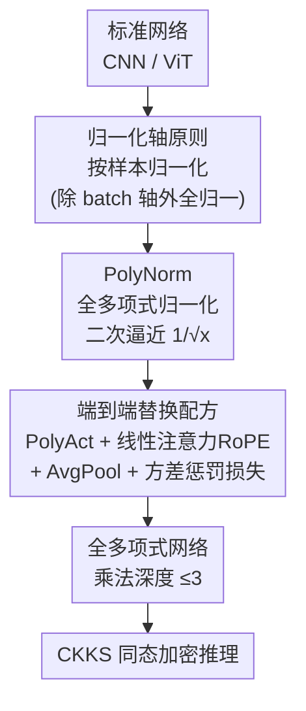

# ULD-Net: Enabling Ultra-Low-Degree Fully Polynomial Networks for Homomorphically Encrypted Inference

**会议**: ICLR 2026  
**OpenReview**: [https://openreview.net/forum?id=Jngc6oTe8R](https://openreview.net/forum?id=Jngc6oTe8R)  
**代码**: https://github.com/xiexi51/ULD-Net  
**领域**: 隐私保护推理 / 同态加密 / AI 安全  
**关键词**: 同态加密, 全多项式网络, 超低次多项式, 归一化, 隐私保护推理

## 一句话总结
ULD-Net 提出一套从零训练「全多项式网络」的方法，用只含加法和乘法的归一化层 PolyNorm 把激活值稳稳压在良态区间，从而首次让乘法深度 ≤3 的超低次全多项式模型扩展到 ViT/ImageNet 规模（ViT-Small 在 ImageNet 上 76.70% top-1），并相比此前 SOTA 取得 2.76× 的同态加密推理加速。

## 研究背景与动机

**领域现状**：机器学习越来越多以服务形式（MLaaS）交付，用户数据与模型权重的机密性成为刚需。同态加密（HE，尤其是适合机器学习的 CKKS 方案）允许直接在密文上做加法和乘法，是隐私保护推理的理想底座。但深度网络里到处是 ReLU、GELU、LayerNorm、Softmax 这类非多项式算子，它们在 HE 下要么极其昂贵、要么根本不支持。

**现有痛点**：主流做法是在训练完成后，用高次多项式去逼近这些非多项式算子，或者把它们卸载到别的安全协议。但高次/级联多项式会显著抬高 HE 的「乘法深度」——而乘法深度正是决定 HE 计算速度的首要因素，它随多项式次数的对数增长。更糟的是，这类逼近在大模型、大数据集上训练极其脆弱：Lee 等人为了在 ImageNet 上稳定训练 ResNet-18，级联多项式的等效次数高达 6075，对 HE 推理来说是灾难性的开销；SMART-PAF 把级联次数降到 81，但训练流水线复杂、难以迁移，作者实测难以扩展到全多项式 ViT。

**核心矛盾**：全多项式网络面临一个稳定性 ↔ 效率的两难。次数 ≥2 的多项式在输入超出狭窄区间时会爆炸式增长，深层堆叠后这种不稳定性会逐层放大、把优化带偏，尤其在高方差的大数据集上。要稳定，就得用高次/级联多项式把逼近误差压在目标区间里——但这又直接顶高了 HE 成本。

**本文目标**：从第一性原理重新审视——能不能不做事后逼近，而是直接从零训练一个「每一层都是低次多项式」的网络，既保住精度，又把 HE 成本压到最低？

**切入角度**：作者观察到，全多项式模型的数值约束主要靠归一化层来施加：归一化把输入压到零均值、单位方差，放在多项式层前面就能防止多项式输入的绝对值变得过大、避免输出发散。于是问题转化为：如何设计一个**只用加法和乘法**、又能稳稳控制激活范围的归一化层，并配上合适的归一化轴。

**核心 idea**：用一个全多项式的归一化层 PolyNorm（核心是把 $1/\sqrt{x}$ 用二次函数逼近）替代 LayerNorm/BatchNorm，配合「按样本归一化」的轴选择原则，再把激活、注意力、池化都换成超低次多项式算子，从而在不依赖任何高次逼近的前提下，从零训练出乘法深度 ≤3 的全多项式网络。

## 方法详解

### 整体框架

ULD-Net 不改原网络的宏观结构，而是把网络里每一个非多项式算子逐一替换成超低次（每个算子乘法深度 ≤3）的多项式替身，最终得到一个「只含 + 和 ×」的全多项式网络，可直接喂给 CKKS HE 推理引擎。整套替换的灵魂是 PolyNorm：它在每个多项式层前把激活值压回良态区间，保证深层堆叠不发散；其余算子（激活、注意力、池化）则各自换成对应的低次多项式形式，并辅以方差感知的惩罚损失把训练稳住。

### 关键设计

**1. 归一化轴原则：让每个样本用自己的归一化参数，才不会被少数样本拖爆**

全多项式网络要稳，归一化是闸门，但**沿哪个轴归一化**会带来截然不同的稳定性。作者通过方差分析给出了一个干净的结论：必须按样本（per-sample）归一化，即对每个样本在「除 batch 轴外的所有轴」上统计均值方差——CNN 的 `[B,C,H,W]` 张量沿 `[C,H,W]` 归一，ViT 的 `[B,N,D]` 张量沿 `[N,D]` 归一。

为什么？考虑 $n$ 对「归一化层 + 多项式层」串联，假设两个样本 $X\sim\mathcal{N}(\mu,\sigma^2 I)$ 与 $X'\sim\mathcal{N}(\mu,\sigma'^2 I)$ 都套用由 $X$ 决定的归一化参数。$X'$ 过第一层后方差变成 $v'_1=(\sigma'/\sigma)^2=r$，此后每过一对层，方差近似按

$$v'_{i+1}\approx c\,(v'_i)^d,\qquad c=\frac{a_d^2\,\mathrm{Var}[Z^d]}{\mathrm{Var}[p(Z)]}$$

递推（$d$ 是多项式次数，用最高次项近似）。展开后 $v'_n\approx c^{\frac{d^n-1}{d-1}} r^{d^n}$：当 $r>c^{-1/(d-1)}>1$ 时方差呈 $O(r^{d^n})$ 的**层数指数级**增长，最终爆炸。也就是说，如果不对每个样本单独算归一化参数，总有一部分方差偏大的样本会数值爆炸，而且爆炸概率随模型深度和样本数一起上升——这正是全多项式模型难以 scale 的根因。按样本归一化把每个样本各自压回单位方差，从源头掐掉了这条指数链。

**2. PolyNorm：用一个二次函数逼近 $1/\sqrt{x}$，把归一化变成纯加乘运算**

普通归一化 $\mathrm{Norm}[x]=\frac{x-E[x]}{\sqrt{\mathrm{Var}[x]+\epsilon}}$ 里，$E[x]$ 和 $\mathrm{Var}[x]=E[x^2]-E[x]^2$ 都是多项式运算，唯一的「拦路虎」是 $f(x)=1/\sqrt{x}$ 这个非多项式开方求倒。PolyNorm 的做法是把它换成一个二次函数 $g(x)=a(x-b)^2+c$。

关键在于怎么定 $a,b,c$。作者不追求全局逼近（二次函数形状和 $1/\sqrt{x}$ 差太远），而是聚焦在某个正点 $\mu$ 附近：强制 $g$ 在 $\mu$ 处与 $f$ **函数值和导数都相等**，并令 $b=k\mu$，要求 $g$ 开口向上、恒正。解出

$$a=-\frac{1}{4(1-k)\mu^{5/2}},\quad c=\frac{5-k}{4\mu^{1/2}},\quad k\in(1,5).$$

再加一条「数值约束」要求：在 $(0,k\mu)$ 上恒有 $g(x)\le f(x)$（可证等价于在 $x=k\mu$ 处成立），化简得 $(5-k)\sqrt{k}\le 4$，把 $k$ 收窄到 $[2.438,5)$。$g\le f$ 这一条很重要——它保证 PolyNorm 对方差不超过历史均值 $k$ 倍的输入，都能压到零均值、方差 ≤1，从而具备真正的「数值约束」能力，而不只是近似。

光有 $g$ 还不够，直接拿 $\mathrm{Var}[x]$ 喂进去未必落在 $g$ 表现最好的区间。作者再引入相对方差 $v=\mathrm{Var}[x]/\overline{\mathrm{Var}}$（$\overline{\mathrm{Var}}$ 是训练期方差的历史滑动平均），使 $v$ 期望为 1（实测 $v$ 服从均值约 1 的对数正态分布），于是 $\mu v$ 期望恰为 $\mu$、落在 $g$ 的甜点区。最终

$$\mathrm{PolyNorm}[x]=(x-E[x])\cdot g(\mu v)\cdot\sqrt{\mu/\overline{\mathrm{Var}}},$$

其中 $\sqrt{\mu/\overline{\mathrm{Var}}}$ 在推理时是可预计算的常数。超参上，$k$ 越大单调下降区间越宽、对长尾大 $v$ 越稳，$k$ 越小逼近 $f$ 越准——作者取 $k=4,\mu=2$ 折中（对应 $g(x)=0.01473x^2-0.23565x+1.11937$）。这样整个归一化只剩加法和乘法，乘法深度仅 3，原生兼容 HE。

**3. 端到端替换配方：激活、注意力、池化各换低次多项式，再用方差惩罚损失兜底**

光替换归一化不够，要让整网全多项式还得收拾激活、注意力、池化三块，且都坚持「次数 ≤3」。激活（ReLU/GELU）换成可训练低次多项式 $\mathrm{PolyAct}(x)=\mathrm{Dropout}(\sum_{i=0}^{n}\alpha_i c_i x^i)$，$\alpha_i$ 可训练、$c_i$ 是固定缩放因子，本文一律取 $i\le 3$，并用 dropout 抑制过拟合。ViT 里的 Softmax 注意力换成带旋转位置编码的线性注意力 $\mathrm{LinearAttn}(x)=\mathrm{RoPE}(Q)\cdot\mathrm{RoPE}(K)^\top\cdot V$——RoPE 全由运行时常数和线性运算组成，天然多项式；MaxPool 换成 AvgPool。

要把这些低次替身训稳，作者补了两个细节。其一是 warmup：为给历史方差 $\overline{\mathrm{Var}}$ 一个好的初始化，热身阶段仍用真实的非多项式归一化 Eq.(1)，之后再切到 PolyNorm。其二是两个方差感知惩罚损失，盯着每层的相对方差 $v_i$：

$$L_1=\frac{1}{N}\sum_{i=1}^{N}v_i\cdot\lambda_1,\qquad L_2=\frac{1}{N}\sum_{i=1}^{N}(v_i-1)^2\cdot\lambda_2.$$

$L_1$ 压制过大的 $v$ 增强稳定性，$L_2$ 把 $v$ 的分布拉向 1——也就是 $g(x)$ 表现最优的区域。这套配方架构无关（ResNet、VanillaNet、ViT 通吃），把「全多项式」从事后高次逼近变成了训练期就能稳定收敛的方案。

### 损失函数 / 训练策略
训练在明文下用与推理一致的多项式算子进行。总损失在标准分类损失外加上述方差惩罚 $L_1,L_2$。训练用 PyTorch 2.7、8 张 A100；HE 推理用 Microsoft SEAL 3.4.5 的 CKKS RNS 变体实现，多项式次数 $2^{15}$、模数 881，保证 128-bit 安全等级。

## 实验关键数据

### 主实验

ResNet-18 / ImageNet 上与 SOTA 全多项式方法对比（原模型精度 69.76%），ULD-Net 用次数 2 的二次激活就拿到最高精度和最快推理：

| 方法 | 激活次数 | Test Acc. | 整模型延迟(s) | 加速比 |
|------|---------|-----------|--------------|--------|
| Lee et al. (2021) | 6075 | 69.35% | 144896 | 3.50× |
| SMART-PAF | 81 | 69.40% | 114277 | 2.76× |
| **ULD-Net (Ours)** | **2** | **69.79%** | **41408** | — |

ViT-Small 上与 Transformer HE 加速框架 NEXUS 对比，非多项式算子总延迟降到 1/20：

| 数据集 | 方法 | Test Acc. | 非多项式算子总延迟(s) | 加速比 |
|--------|------|-----------|----------------------|--------|
| CIFAR-10 | NEXUS | 91.39% | 7995 | 20.5× |
| CIFAR-10 | **ULD-Net** | **91.48%** | **390** | — |
| Tiny-ImageNet | NEXUS | 60.52% | 24231 | 20.5× |
| Tiny-ImageNet | **ULD-Net** | **61.40%** | **1182** | — |

ULD-Net 是已知**首个**成功扩展到 ViT/ImageNet 规模的全多项式模型：ViT-Small/ViT-Base 在 ImageNet 上达 76.70%/75.20%，与原模型（76.5%/75.3%）相当。

### 消融实验

与部分多项式替换方法对比（ResNet-18 / CIFAR-100，原精度 77.84%），ULD-Net 把 ReLU 100% 替换却精度反超：

| 方法 | ReLU 替换比 | Test Acc. | 模型延迟(s) | 说明 |
|------|-----------|-----------|------------|------|
| SNL | 0.88 | 73.75% | 2052 | 部分替换 |
| AutoReP | 0.87 | 75.48% | 2053 | 部分替换 |
| **ULD-Net** | **1** | **78.81%** | **647** | 全替换，+3.33% 且 3.17× 加速 |

VanillaNet 家族进一步验证可扩展性（ImageNet）：VanillaNet-7 在激活次数 3 下达 76.40%，相比 ResNet-18 还有 7.4× 的 HE 延迟加速。

### 关键发现
- **乘法深度是 HE 速度的命门**：Lee 的等效次数 6075、SMART-PAF 的 81，对应延迟比 ULD-Net 的次数 2 高出几个量级；ULD-Net 把激活、PolyNorm、PolyAct 的乘法深度压到 2/3/3，直接换来 8.12× 激活加速、2.76× 整模型加速。
- **全替换反而精度更高**：二次激活提供的非线性让 ULD-Net 在 CIFAR-100 上比原模型还高 +0.97%、比 AutoReP 高 +3.33%——说明只要训练稳，低次多项式激活并不牺牲表达力。
- **稳定性来自按样本归一化 + PolyNorm 的协同**：方差分析表明不按样本归一化会指数爆炸；$g\le f$ 约束 + 相对方差 $v$ + 惩罚损失把激活牢牢锁在良态区间，这是能 scale 到 ImageNet 的关键。

## 亮点与洞察
- **把"开方求倒"这个 HE 死结，化简成一个能预计算的常数 + 一个二次函数**：$1/\sqrt{x}$ 本是全多项式归一化最大的障碍，作者用「局部一阶匹配 + $g\le f$ 单边约束 + 相对方差校准」三招把它变成乘法深度仅 3 的纯多项式，思路干净且可复用。
- **用方差递推的指数爆炸分析，把"为什么要按样本归一化"从经验讲成了定理**：$v'_n=O(r^{d^n})$ 这个结论直接解释了全多项式模型为何难 scale，也给出了精确的破解方向。
- **架构无关的配方**：PolyNorm + PolyAct + 线性注意力 + AvgPool 这套组合在 CNN 和 ViT 上一致工作，意味着任何想上 HE 的网络都能照搬，迁移成本低。

## 局限与展望
- **作者承认的局限**：目前验证到 ViT-Base（约 86M 参数）规模，更大的 ViT-Large、BERT-Large、GPT-2 尚未尝试，超低次多项式能否撑住更大模型仍是开放问题。
- **自己发现的局限**：实验里全多项式 ViT 的 ImageNet 数据主要在 ViT-Small/Base，CIFAR-10/Tiny-ImageNet 上和 NEXUS 对比；二次激活在更深 VanillaNet-7 上需要升到次数 3 才能保住精度（次数 2 时掉到 74.91%），暗示精度-次数的权衡仍会随深度收紧。
- **改进思路**：$k,\mu$ 目前是固定经验值，能否让它们随层/随训练自适应、或对长尾 $v$ 设计更稳的多项式（而非单一二次）值得探索；线性注意力替换 Softmax 在更长序列上的精度损失也需要更系统的评估。

## 相关工作与启发
- **vs Lee et al. (2021) / SMART-PAF（全多项式，事后高次逼近）**: 他们用级联高次多项式逼近激活以保精度，等效次数高达 6075 / 81，HE 乘法深度和延迟随之爆炸；ULD-Net 直接从零训练次数 ≤3 的全多项式网络，靠 PolyNorm 维稳，精度持平甚至更高而延迟降一大截。
- **vs SNL / AutoReP（部分多项式替换）**: 他们只替换部分 ReLU、保留一部分非多项式算子以降难度，但残留算子仍需昂贵的安全处理、且无法直接扩展到全多项式；ULD-Net 做到 100% 替换，反而精度更高、延迟更低，因为彻底全多项式省掉了 bootstrapping 需求、压低了整体电路深度。
- **vs NEXUS（Transformer HE 系统优化）**: NEXUS 靠迭代多项式逼近 + 底层 HE 工程加速 Transformer，但 Softmax/LayerNorm/GELU 的乘法深度仍高达 16/16/14；ULD-Net 用 RoPE 线性注意力 + PolyNorm + PolyAct 把对应深度压到 2/3/3，非多项式算子总延迟降 20.5×。

## 评分
- 新颖性: ⭐⭐⭐⭐⭐ 首个把全多项式模型 scale 到 ViT/ImageNet 的工作，PolyNorm 的二次逼近思路干净。
- 实验充分度: ⭐⭐⭐⭐ 覆盖 CNN/ViT、多数据集、与全/部分多项式及系统优化三类 SOTA 对比，但更大模型未验证。
- 写作质量: ⭐⭐⭐⭐ 动机—理论—方法链条清晰，方差爆炸分析是亮点。
- 价值: ⭐⭐⭐⭐⭐ 直接降低 HE 推理的乘法深度，对隐私保护推理落地有实打实的工程价值。

<!-- RELATED:START -->

## 相关论文

- [\[ICLR 2026\] Video Unlearning via Low-Rank Refusal Vector](video_unlearning_via_low-rank_refusal_vector.md)
- [\[NeurIPS 2025\] DESIGN: Encrypted GNN Inference via Server-Side Input Graph Pruning](../../NeurIPS2025/ai_safety/design_encrypted_gnn_inference_via_server-side_input_graph_pruning.md)
- [\[ICML 2025\] Fully Heteroscedastic Count Regression with Deep Double Poisson Networks](../../ICML2025/ai_safety/fully_heteroscedastic_count_regression_with_deep_double_poisson_networks.md)
- [\[ICLR 2026\] Robust Federated Inference](robust_federated_inference.md)
- [\[CVPR 2026\] All Vehicles Can Lie: Efficient Adversarial Defense in Fully Untrusted-Vehicle Collaborative Perception via Pseudo-Random Bayesian Inference](../../CVPR2026/ai_safety/all_vehicles_can_lie_efficient_adversarial_defense_in_fully_untrusted-vehicle_co.md)

<!-- RELATED:END -->
