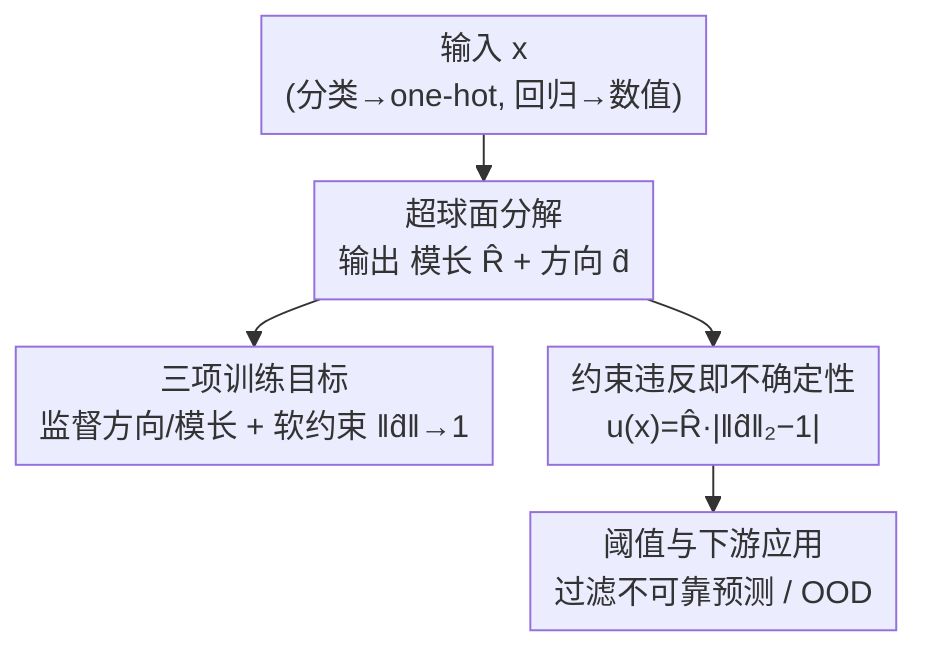

# Uncertainty Estimation via Hyperspherical Confidence Mapping

**会议**: ICLR 2026  
**OpenReview**: [https://openreview.net/forum?id=G4JYxxI23T](https://openreview.net/forum?id=G4JYxxI23T)  
**代码**: https://github.com/Abandoned-Puppy/HCM （CIFAR-10 / Two-Moons / 1D 回归）  
**领域**: AI 安全 / 不确定性估计 / 置信度校准  
**关键词**: 不确定性量化, 超球面分解, 校准, OOD 检测, 无采样推理

## 一句话总结
本文提出 Hyperspherical Confidence Mapping (HCM)，把网络输出拆成"模长 $R$ + 单位方向向量 $\hat{d}$"，再把 $\hat{d}$ 偏离单位球面的程度当作不确定性，从而实现**无采样、无分布假设**的确定性不确定性估计，在分类和回归上都能匹配甚至超过深度集成 / 证据学习，且推理开销最低。

## 研究背景与动机

**领域现状**：在自动驾驶、医疗诊断、半导体制造这类高风险场景里，光给预测值还不够，必须同时给出"这个预测有多可信"。目前主流的不确定性估计大致分四类：采样类（MC Dropout、Deep Ensembles）、分布类（高斯回归、Dirichlet、证据学习）、区间类（分位数回归、conformal prediction）、相似度类（基于特征空间距离/密度）。

**现有痛点**：每一类都有结构性缺陷。采样类要做多次随机前向或训练多个模型，计算和显存开销大，实时场景吃不消；分布类虽然单次推理，但要押注一个强先验（高斯/Dirichlet），遇到多峰或复杂不确定性就失真；区间类常需多组分位数输出和精心设计的目标，且只保证 marginal coverage、给不了 per-sample 的可信度；相似度类依赖类别原型或密度估计，天生只适合分类，没法自然延伸到回归。

**核心矛盾**：现有方法在"无采样 ↔ 无分布假设 ↔ 任务无关 ↔ 实时 ↔ 可解释"这五个属性上总是顾此失彼，没有一个框架能同时占齐（论文 Table 1 直接把这点摊开来比）。根因在于：大家都是在**预测分布或采样统计量**上做文章，而不是直接从输出的几何结构里读出可信度。

**本文目标**：找到一个确定性、轻量、对分类回归通用、且分数本身可解释的不确定性度量。

**切入角度**：作者观察到——如果把目标向量 $y$ 写成"模长 × 单位方向"的形式 $y=Rd$（$\|d\|_2=1$），那么模型学到的方向 $\hat{d}$ 是否落在单位球面上，本身就是一个天然的几何约束。当模型对某个输入没把握时，它预测的 $\hat{d}$ 就会偏离单位球面，这个偏离量不需要任何采样或分布假设就能算出来。

**核心 idea**：用"违反单位球面约束的程度"代替"采样方差/分布参数"来度量不确定性——即 $u(x):=\hat{R}(x)\,\big|\,\|\hat{d}(x)\|_2-1\,\big|$，并从理论上证明它是预测误差的下界。

## 方法详解

### 整体框架

HCM 把传统的"无约束回归"问题重新表述成一个"单位球面约束下的优化"问题，再把约束的违反程度直接读成不确定性。整条流水线是：先把任意任务（分类用 one-hot 当目标、回归直接用数值）统一塞进 $\mathbb{R}^D$ 的回归框架；模型对每个输入输出两路——一个标量模长 $\hat{R}$ 和一个方向向量 $\hat{d}$，最终预测是 $\hat{y}=\hat{R}\hat{d}$；训练时用一个三项损失同时监督方向、模长，并软性逼 $\|\hat{d}\|_2\to 1$；推理时则直接用 $\hat{d}$ 偏离单位球面的量算出确定性分数 $u(x)$，无需任何额外前向或采样。

### 关键设计

**1. 超球面分解：把输出拆成"模长 × 方向"，给预测装上几何约束**

传统预测是在 $\mathbb{R}^D$ 里无约束地回归目标值，没有任何结构能告诉你模型有没有把握。HCM 把目标 $y$ 重写成 $y=Rd$，其中 $R\in\mathbb{R}^+$ 是模长、$d\in\mathbb{R}^D$ 是满足 $\|d\|_2=1$ 的单位方向，让模型分别预测 $\hat{R}$ 和 $\hat{d}$ 再重建 $\hat{y}=\hat{R}\hat{d}$。作者强调这不是随手的启发式：单位球面约束是**无偏且无先验**的——它平等对待输出的每一个维度，不像别的约束会打破维度间的对称性、注入方向偏置。对标量回归（$D=1$），作者把目标复制成 $y_{\exp}=(y,y)$ 嵌入到最小的 $D=2$ 空间，这样同一套分解就能无缝用上，不用改核心公式。这一步也和此前只对分类 logits 加超球面约束的文本校准工作（如 Gong et al. 2022）划清界限：HCM 是**对目标本身**做模长-方向分解，因此能统一处理分类和回归。

**2. 约束违反即不确定性：从偏离单位球面的程度读出确定性分数**

有了分解后，预测问题就成了带约束的优化 $\min_{\hat{R},\hat{d}} \mathcal{L}(\hat{R}\hat{d},y)\ \text{s.t.}\ \|\hat{d}\|_2=1$。但作者并不把它当硬约束去强制满足——因为真值 $d$ 本身满足 $\|d\|_2=1$，训练目标会自然把 $\hat{d}$ 往单位范数上拉；那些仍残留的偏离，恰恰是模型可信度的信号。于是不确定性分数定义为

$$u(x):=\hat{R}(x)\,\Big|\,\|\hat{d}(x)\|_2-1\,\Big|.$$

这个分数只用模型输出就能确定性地算出来，不需要采样、标签或辅助网络，因此极其轻量。它的妙处在于把抽象的"不确定"翻译成了一个有明确几何含义的数：$\hat{d}$ 离单位球面越远，分数越大。在 Two-Moons 实验里，高 $u(x)$ 的样本恰好聚集在两类方向 $(1,0)$ 与 $(0,1)$ 的连线上、即决策边界附近——几何结构和"模糊样本"对上了。

**3. 误差下界保证：让分数不只是经验相关，而是可证明的误差代理**

为了让 $u(x)$ 可信而非玄学，作者证明了它和真实误差的单调关系（Proposition 1）：记 $\epsilon:=\frac{|e_R|}{\hat{R}\|e_d\|_2}$，则预测误差 $\|e_y\|_2\ge u(x)(1-\epsilon)$。推导用了三角与反三角不等式，并依赖 $\hat{R}\|e_d\|_2\ge u(x)$ 这一关键不等式。在训练良好的模型里，$|e_R|$ 通常远小于 $\hat{R}\|e_d\|_2$（即 $\epsilon\ll 1$），此时 $u(x)$ 就是真实误差的可靠下界：**$u(x)$ 大 ⟹ 误差必然大**。这给了分数一个干脆的可解释含义——分数越大，越是"数学上注定测不准"。作者还顺手定义了一个类方差量 $\hat{\sigma}^2(x):=\frac{1}{D-1}u(x)\big(\hat{R}(x)(1+\|\hat{d}(x)\|_2)\big)$，并证明在高斯噪声下 $\hat{\sigma}^2(x)=\sigma^2+O(\cdot)$，能确定性地追踪噪声水平、刻画 aleatoric 部分。

**4. 阈值化与训练目标：把分数落地成可用的判据**

光有分数还不能直接做决策，得有个"多大算高不确定"的判据，外加把分数学出来的训练目标。训练侧用三项损失

$$\mathcal{L}_{\text{total}}=\phi_d\big(R\|e_d\|_2\big)+\phi_R\big(e_R\big)+\lambda_{\text{norm}}\phi_{\text{norm}}\big(\|\hat{d}\|_2-1\big),$$

前两项分别监督方向和模长，最后一项以权重 $\lambda_{\text{norm}}$ 软性地逼单位范数约束；每个 $\phi_\star$ 取自同一损失族（power-$p$ / Huber / smooth-$\ell_1$），既统一又能灵活调曲率和鲁棒性。这其实是原始约束问题的软松弛，比硬约束的精确展开更稳。决策侧给两条阈值策略：任务**有**明确容差 $\varepsilon$ 时（工业/安全场景），因为 $u(x)$ 是误差下界，直接用 $u(x)>\varepsilon$ 标记违反容差的预测，阈值由业务需求决定而非拍脑袋；任务**无**明确容差时，用验证集上 $u(x)$ 的经验分布取一个高分位（如 95% 或 99%）当阈值，标出异常偏大的尾部。

### 损失函数 / 训练策略

核心损失即上式的三项 $\mathcal{L}_{\text{total}}$（方向 + 模长 + 单位范数软约束）。在大规模分类（CIFAR-10 OOD）上，作者额外引入 **HCM mix**：用 mixup 生成跨类插值样本。原版 HCM 在 one-hot 监督下会把预测过度推向单一类方向，限制了表达不确定性的能力；mixup 造出的插值标签在超球面分解下对应"落在两个类锚点之间"的方向，这些中间方向天然模长小于 1，从而让 HCM 更忠实地表达不确定性。作者特别指出这种提升是 HCM 几何结构独有的——对传统方法用 mixup 反而可能掉点。

## 实验关键数据

### 主实验

CIFAR-10 上的 OOD 检测（OpenOOD 协议，ResNet-18，5 个随机种子平均 AUROC）：

| 方法 | Near OOD | Far OOD | AVG |
|------|----------|---------|-----|
| MSP | 86.73 | 88.96 | 87.85 |
| Ensembles | 88.89 | 90.86 | 90.15 |
| MC Dropout | 85.21 | 90.50 | 88.33 |
| Energy | 87.52 | 89.36 | 88.62 |
| KNN | 88.07 | 92.59 | 90.97 |
| NCI | 86.49 | 92.49 | 90.36 |
| HCM | 82.23 | 86.45 | 85.04 |
| **HCM mix** | 87.90 | 90.12 | **89.44** |

HCM mix 的平均 AUROC 89.44%，与最强的 KNN（90.97%）、NCI（90.36%）相当，但**推理延迟在所有方法里最低**——这正是无采样、无分布假设带来的实打实收益。

NYU-v2 单目深度估计的回归校准（U-Net 编解码骨干）：

| 方法 | Pearson ↑ | Spearman ↑ | cov@1σ | ECEreg ↓ | RMSE ↓ |
|------|-----------|-----------|--------|----------|--------|
| EDL | 0.1084 | 0.1370 | 0.6906 | 0.0609 | 0.1241 |
| MC Dropout | 0.1932 | 0.2580 | 0.7019 | 0.0645 | 0.1189 |
| Ensembles | 0.2381 | 0.4684 | 0.6957 | 0.1838 | 0.1234 |
| HCM | **0.4919** | **0.5425** | 0.7433 | 0.2160 | 0.1485 |

HCM 在**不确定性与真实误差的对齐度**（Pearson / Spearman）上大幅领先，这正源自 Proposition 1 把分数直接和误差挂钩；代价是它在 coverage、ECEreg 和 RMSE 上略逊于显式估方差的基线——因为重建 $\hat{y}=\hat{R}\hat{d}$ 时两个分量的小误差会复合，导致预测误差略增。

### 消融实验

工业半导体晶圆几何回归（专有数据，MLP，分位数归一化）：

| 方法 | Pearson ↑ | Spearman ↑ | cov@2σ | RMSE ↓ |
|------|-----------|-----------|--------|--------|
| EDL | −0.2508 | −0.1837 | 0.8813 | 4.7909 |
| Ensemble | 0.3227 | 0.1220 | 0.8755 | 4.6783 |
| MC Dropout | −0.0785 | −0.0630 | 0.8961 | 6.5602 |
| HCM | **0.8435** | **0.7579** | 0.8667 | 5.4022 |

在工业噪声数据上差距被进一步放大：基线的相关性甚至出现负值（不确定性与误差反向），而 HCM 的 Pearson 0.8435 几乎把误差和分数锁死。作者还验证此数据集上 Proposition 1 的下界几乎是紧的，$u$ 紧贴真实误差。

### 关键发现
- **分数对齐 vs 覆盖率的取舍**：HCM 不去显式估方差，所以在 coverage / ECEreg / RMSE 上不占优，但换来了远强的"分数↔误差"单调对齐——对"挑出不可靠样本去过滤"的安全场景，这个对齐才是真正有用的属性。
- **mixup 对 HCM 是几何契合而非通用 trick**：one-hot 监督让方向过度饱和，mixup 造的中间方向模长天然 <1，恰好补上不确定性表达；对传统方法套 mixup 反而不稳。
- **决策边界即高不确定区**：Two-Moons 里高 $u(x)$ 样本精确聚在两类方向连线、投回输入空间正好压在决策边界上，几何直觉和分数定量对上。
- **训练动态敏感**：过大的 $\lambda$ 或过高学习率会破坏单位范数约束、把 $d$ 推离球面，反而干扰 $R$ 的学习。

## 亮点与洞察
- **把"不确定性"变成一个几何量**：模长-方向分解 + 单位球面约束违反，让不确定性有了确定性、可解释、可证下界的定义，而不是采样统计或分布参数——这是最"啊哈"的地方。
- **一个框架统吃分类与回归**：相似度/原型类方法天生偏分类，HCM 因为分解的是目标本身、把分类也当 $\mathbb{R}^D$ 回归，所以分类回归共用一套机制。
- **可迁移的思路**：任何"输出可拆成大小 × 方向"的任务，都能借这套"约束违反即不确定性"的范式做轻量 UQ；标量回归靠复制嵌入到 $D=2$ 的小技巧也能直接复用。
- **理论与工程闭环**：Proposition 1 不只是装饰，它直接解释了为什么 HCM 能在不看标签的情况下、仅凭 $u(x)$ 就过滤掉高误差工业样本。

## 局限与展望
- 作者承认：$u(x)$ 依赖训练动态，$\lambda$ 或学习率过大都会破坏单位范数约束；且它不显式区分 aleatoric 与 epistemic 不确定性。
- HCM 只在输出层工作、需要轻量微调，难以直接用到冻结或 zero-shot 的大语言模型上。
- 方法假设目标可做"模长-方向"分解，对本质多值输出的任务可能受限。
- 重建 $\hat{R}\hat{d}$ 带来的 RMSE 略增是结构性代价；coverage / ECEreg 偏弱也说明它不适合需要严格概率覆盖保证的场景。
- 展望：扩到更大/多模态模型、改进不确定性分解、用 $u(x)$ 标记高误差样本做主动学习。

## 相关工作与启发
- **vs 采样类（Deep Ensembles / MC Dropout）**: 它们靠多次前向/多模型估方差，准但贵；HCM 单次确定性推理、延迟最低，且在分数-误差对齐上更强，只是 coverage 略逊。
- **vs 分布类（证据学习 EDL / 高斯回归）**: 它们押注高斯/Dirichlet 先验，遇复杂不确定性失真且易过自信；HCM 无分布假设，校准谱覆盖整个 [0,1] 区间。
- **vs 超球面文本校准（Gong et al. 2022）**: 它们只对分类 logits 加超球面约束；HCM 对**目标本身**做模长-方向分解并从约束违反导出不确定性，因此能统一回归与分类。
- **vs 相似度类（KNN / Mahalanobis / Energy）**: 它们依赖类原型或密度估计，OOD 检测强但难延伸到回归；HCM 任务无关、回归分类通吃。

## 评分
- 新颖性: ⭐⭐⭐⭐⭐ 把不确定性重述为"超球面约束违反"，视角新且有理论支撑。
- 实验充分度: ⭐⭐⭐⭐ 覆盖分类 OOD、深度回归、真实工业数据，但回归 benchmark 偏少、缺更大模型验证。
- 写作质量: ⭐⭐⭐⭐ 动机清晰、Table 1 五属性对比一目了然，理论与实验闭环。
- 价值: ⭐⭐⭐⭐ 轻量确定性 UQ 对安全/工业部署实用价值高，但需微调、不适配冻结大模型。

<!-- RELATED:START -->

## 相关论文

- [\[AAAI 2026\] Credal Ensemble Distillation for Uncertainty Quantification](../../AAAI2026/ai_safety/credal_ensemble_distillation_for_uncertainty_quantification.md)
- [\[ICLR 2026\] Fair Decision Utility in Human-AI Collaboration: Interpretable Confidence Adjustment for Humans with Cognitive Disparities](fair_decision_utility_in_human-ai_collaboration_interpretable_confidence_adjustm.md)
- [\[ICLR 2026\] RESFL: An Uncertainty-Aware Framework for Responsible Federated Learning by Balancing Privacy, Fairness and Utility](resfl_an_uncertainty-aware_framework_for_responsible_federated_learning_by_balan.md)
- [\[ICML 2026\] Calibrating Uncertainty for Zero-Shot Adversarial CLIP](../../ICML2026/ai_safety/calibrating_uncertainty_for_zero-shot_adversarial_clip.md)
- [\[AAAI 2026\] Matrix-Free Two-to-Infinity and One-to-Two Norms Estimation](../../AAAI2026/ai_safety/matrix-free_two-to-infinity_and_one-to-two_norms_estimation.md)

<!-- RELATED:END -->
