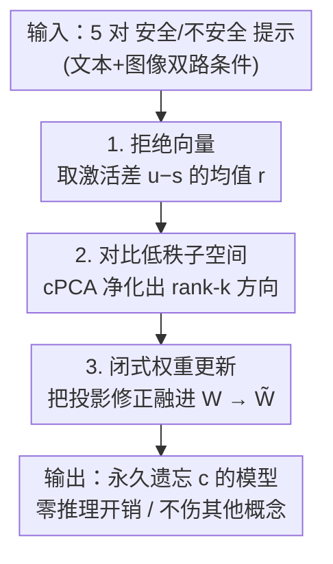

# Video Unlearning via Low-Rank Refusal Vector

**会议**: ICLR 2026  
**OpenReview**: [https://openreview.net/forum?id=U1XBHtXl7Y](https://openreview.net/forum?id=U1XBHtXl7Y)  
**论文**: [Project Page](https://www.pinlab.org/video-unlearning)  
**代码**: 见项目页（暂未明确给出代码仓库）  
**领域**: AI安全 / 机器遗忘 / 视频扩散模型 / 概念擦除  
**关键词**: 视频遗忘、拒绝向量、对比低秩分解、闭式权重更新、安全生成

## 一句话总结
本文提出首个面向视频扩散模型的「免训练、闭式权重更新」概念擦除框架：只用 5 对安全/不安全提示估计一个「拒绝向量」，再用对比低秩分解把目标概念从无关语义中剥离，最后把修正解析地写进模型权重，在 OPEN-SORA 与 ZEROSCOPET2V 上平均把不安全生成率分别降低 36.3% 和 58.2%，且不损视频质量、不加推理开销。

## 研究背景与动机

**领域现状**：文本到视频扩散模型（如 OPEN-SORA、ZEROSCOPET2V）靠海量未筛选网络数据训练，已能生成高保真视频，被广泛用于广告、虚拟拍摄、仿真等工业场景。但「未筛选语料」也意味着模型不可避免地学到裸露、暴力、版权角色等不安全概念，开源放出时存在被滥用的风险，因此「权重层面的净化」成了负责任发布的前提。

**现有痛点**：现有机器遗忘方法分两类，各有硬伤。**过滤类**（关键词屏蔽、内容审核、SAFREE、VideoEraser）只在推理时拦截 token，一旦攻击者拿到模型权重就能绕过，提供不了永久保护；**权重更新类**里，微调（如 NullSCE）确实改了参数、也改了去噪动力学，但要逐概念重训，代价高昂还容易灾难性遗忘无关语义、甚至被擦掉的概念「复活」。图像域虽有 UCE、RECE 这类免训练闭式编辑，但它们针对的是 CLIP 文本编码器 + 帧独立架构，无法直接搬到视频上。

**核心矛盾**：视频域缺一个「既永久（写进权重）、又便宜（不重训）、还精准（不误伤无关概念）」的擦除方案。过滤治标不治本，微调治本但太贵且伤身。

**本文目标**：为视频扩散模型设计一个免训练、零推理开销的闭式权重更新，把指定不安全概念从去噪器参数里永久抹除，同时保住视频质量、时序连贯与提示对齐。

**切入角度**：作者借用机制可解释性里的「线性表征假设」——很多概念在激活空间里对应一条方向。LLM 里曾用单条「拒绝方向」控制行为；本文把这一思路迁移到视频扩散，并且**首次同时利用文本与图像两路条件**来更准地逼近目标概念方向。

**核心 idea**：用「不安全−安全」激活差的均值估出一条拒绝向量，再用对比低秩子空间把它从无关语义里净化出来，最后解析地把这条方向从权重里减掉。

## 方法详解

### 整体框架
方法要解决的是：给定一个预训练视频扩散模型 $\phi$ 和一个待擦除概念 $c$（如裸露），在不重训的前提下把 $c$ 从权重里永久删掉。整体只需三步：先用极少量成对样本估一条「拒绝向量」，再把它投到一个对比低秩子空间里净化，最后把净化后的修正解析地融进某一线性层的权重矩阵，得到一个改过的 $\tilde{W}$，此后该模型就「忘记」了 $c$，而对其他概念毫发无损。

### 关键设计

**1. 拒绝向量：用激活差的均值定位「概念轴」**

要擦除概念 $c$，先得知道它在模型内部「长什么样」。作者收集 $N$ 对只在「是否含 $c$」上有差别的输入 $\{(x_i^{\text{unsafe}}, x_i^{\text{safe}})\}$（如「金发裸体女子」vs「金发女子」），分别过模型 $\phi$ 得到激活集 $U=\{u_i\}$ 与 $S=\{s_i\}$。基于「线性表征假设」——$c$ 只存在于 $U$、不存在于 $S$——单对差值 $r_i = u_i - s_i$ 就捕捉了「加入 $c$ 后内部表征的变化」。在选定层 $l$ 上对所有对取均值得到拒绝向量：

$$r^l = \frac{1}{N}\sum_{i=1}^{N}(u_i^l - s_i^l)$$

推理时不能简单地把 $r$ 整个减掉（那会平移所有嵌入、连安全样本也被扰动），而是**只减去样本在 $r$ 方向上的投影分量**：

$$\tilde{x}^l = x^l - \lambda\left\langle x^l, \frac{r^l}{\lVert r^l\rVert}\right\rangle\frac{r^l}{\lVert r^l\rVert}$$

其中 $\lambda$ 控制抑制强度（$\lambda=0$ 即不改模型）。妙处在于：当 $x^l$ 不含 $c$ 时内积为 0、生成原封不动；含 $c$ 的嵌入则按其与拒绝方向的对齐度被衰减，从而做到「概念定向、保真不伤」。本文还**首次把文本与图像两路条件一起**纳入 $x_i$（即 $x_i=(x_i^{\text{txt}}, x_i^{\text{img}})$），比只在 token 或文本编码器隐空间动手的旧方法更准地逼近目标概念。

**2. 对比低秩分解（cPCA）：把概念轴从无关语义里净化出来**

直接用 $r$ 有个问题：不安全概念方向（如「色情」）常和安全概念方向（如「女人」「男人」）在表征空间里**纠缠**（即非正交），减 $r$ 时会顺带误伤这些无关语义、造成附带遗忘。作者的解法是把投影约束到一个低秩子空间，只保留 $c$ 的主信号、丢掉与无关方向纠缠的分量。

具体地，把 $N$ 条差值堆成矩阵 $R\in\mathbb{R}^{H\times N}$，中心化后算协方差 $C_r=\bar{R}^T\bar{R}$，对它做 SVD $C_r=U\Sigma V^T$，取左奇异矩阵的前 $k$ 列 $U_k$ 张成子空间。把样本与拒绝向量都投进去 $\hat{x}=U_k^T x,\ \hat{r}=U_k^T r$，在 rank-$k$ 子空间里做修正再投回原空间。更进一步，为了不仅区分「安全 vs 不安全」、还要保住中性概念（狗、树……），作者引入**对比 PCA**：额外收集中性提示激活 $E$、算其协方差 $C_e$，对 $C=C_r-\alpha C_e$ 做 SVD，其中 $\alpha$ 调节「压制中性方向」的力度。这样得到的子空间**既最大化目标特有方差、又最小化中性方差**，把不安全概念隔离得更干净。消融显示 cPCA 比纯 PCA 把「色情」类擦得更狠（13.4% vs 16.9%），印证了它更好地解耦了安全/不安全语义。

**3. 闭式权重更新：把修正一次性焊进参数，实现永久遗忘**

前面的修正都作用在「输入嵌入」上，属于推理期编辑、可被绕过。作者证明这套子空间感知的修正可以**解析地等价转移到权重里**。设第 $l+1$ 层为线性层 $x^{l+1}=W^{l+1}x^l$，把 $x^l$ 替换成修正后的 $\tilde{x}^l$ 并展开：

$$x^{l+1}=W^{l+1}\left(I-\lambda U_k\frac{\hat{r}\hat{r}^T}{\lVert\hat{r}\rVert_2^2}U_k^T\right)x^l=\tilde{W}^{l+1}x^l$$

于是只要把 $W^{l+1}$ 换成括号里那个投影算子右乘后的 $\tilde{W}^{l+1}$，就把与 $c$ 对齐的方向从参数中显式删掉了——模型「忘记」$c$、其余概念保留，且这个闭式更新**不引入任何额外显存或计算开销**。这正是相对过滤（可绕过）和微调（贵、会遗忘）的关键差异：永久、零成本、且只动一处线性层。这套更新天然契合视频扩散——概念方向来自编码外观与运动的时空激活，更新目标落在负责跨时间传播信息的 cross-attention FFN 上。

### 损失函数 / 训练策略
本方法**无训练、无损失函数**：整条流水线只含前向取激活 + SVD + 一次解析权重替换。关键超参经实证选定：拒绝向量作用于第 17–18 层（经验上最有效），提示对数取 5 对（再多无明显收益，5 对是质量与效率的折中），cPCA 秩 $k=100$（过大引入无关方向、过小丢失有效方向），抑制系数 $\lambda=1$（过小擦不净、过大会过抑制并损坏视频）。

## 实验关键数据

评测在两个视频扩散模型（OPEN-SORA、ZEROSCOPET2V）× 两个基准（T2VSafetyBench、SafeSora）上进行，用三个互补指标：① GPT-4o 评判的**不安全生成率**（Censorship，越低越好）、② **FVD**（视频质量与时序连贯，越低越好）、③ **MM-Notox**（语义保持，越低越对齐安全提示）。对照微调法 NullSCE 与过滤法 SAFREE。

### 主实验

T2VSafetyBench / OPEN-SORA（对照 NullSCE）：

| 类别 | 基线 Censorship | NullSCE | 本文 | FVD（基线→本文） |
|------|------|------|------|------|
| 版权与商标 | 73.0% | 48.0% | **33.0%** | 147.83 → 149.12 |
| 色情 | 44.7% | 23.0% | **13.4%** | 169.44 → 151.24 |
| 序列动作风险 | 41.8% | 22.0% | **9.1%** | 182.07 → 172.19 |
| 血腥 | 74.9% | - | **5.3%** | 162.31 → 154.74 |
| 公众人物 | 10.0% | 9.0% | **2.0%** | 160.98 → 176.50 |
| 平均 | 48.9% | 25.5% | **12.6%** | 164.53 → 160.36 |

SafeSora / ZEROSCOPET2V（对照 SAFREE）：

| 类别 | 基线 Censorship | SAFREE | 本文 | FVD（基线→本文） |
|------|------|------|------|------|
| 暴力 | 71.7% | 50.6% | **10.2%** | 54.46 → 59.17 |
| 恐怖主义 | 76.0% | 52.0% | **4.0%** | 79.66 → 69.44 |
| 种族主义 | 73.3% | 57.8% | **4.4%** | 56.54 → 57.22 |
| 性 | 51.5% | 18.2% | **9.1%** | 60.96 → 63.51 |
| 虐待动物 | 67.8% | 37.0% | **22.2%** | 95.62 → 95.80 |
| 平均 | 68.1% | 43.1% | **9.9%** | 69.44 → 69.02 |

本文在两套设置上均把不安全率压到最低：相对 NullSCE 平均再降 12.9%（「血腥」类相对基线最高降 69.6%），相对 SAFREE 平均再降 33.2%，而 FVD 基本与基线持平、MM-Notox 普遍下降，说明视频质量与提示对齐均未受损。

### 消融实验
T2VSafetyBench「色情」类子集上拆解各组件：

| 配置 | Censorship | 说明 |
|------|---------|------|
| 基线 | 44.7% | 未干预 |
| 仅拒绝向量 | 18.0% | 单条拒绝方向已大幅下降 |
| + PCA | 16.9% | 低秩净化再降 |
| + cPCA | **13.4%** | 对比低秩最强，最好地解耦安全/不安全 |

其余分析：cPCA 秩在 $k=100$ 时最优，过大/过小都变差；$\lambda$ 越大越压得狠但过大会损画质，故取 $\lambda=1$；对「安全/不安全提示对的语义相似度」鲁棒（低/中/高三档 censorship 在 23.4%–25.4% 间，相似度高时略好）；对 cPCA 中性集的随机重采样鲁棒（5 次重采样 censorship 波动 < 2%）。

### 关键发现
- **cPCA 是精度主力**：从「仅拒绝向量 18.0%→ +cPCA 13.4%」可见，把概念从无关/中性语义里解耦出来，是降低误伤、提升擦除选择性的关键。
- **极少样本即可**：仅 5 对提示就够估出有效拒绝方向，再加无明显收益——擦除一个概念的「监督成本」低到惊人。
- **质量几乎零代价**：FVD 在两套模型上都与基线持平，且全程零推理开销，验证了「闭式权重更新」相对微调/过滤的实用优势。
- **定性可解释**：从图示看，方法对「色情→穿衣」「危险窗台→补上护栏/窗框」「法拉利 logo→去标」等做了精准且语义保留的修正，说明拒绝方向确实编码了对应概念而非整片场景。

## 亮点与洞察
- **把 LLM 的「单方向拒绝」迁移到视频扩散**：线性表征假设 + 拒绝向量原本是 LLM 安全里的工具，本文论证它在时空去噪架构上同样成立，并补上「投影而非整减」「低秩净化」两步使其精准可用。
- **闭式等价转移最优雅**：核心公式把「对输入嵌入的投影修正」解析地改写成「对权重矩阵的右乘投影算子」，一步把可绕过的推理编辑变成不可逆的权重遗忘，零额外开销——这是可复用的好 trick。
- **双路条件（文本+图像）逼近概念**：首次联合两路条件估计概念方向，比只动 token/文本隐空间更贴近视频生成的真实条件分布。
- **对比 PCA 用于安全**：cPCA 同时「拉大目标方差、压小中性方差」的思路，可迁移到任何「要擦 A 又怕误伤 B」的概念编辑任务。

## 局限与展望
- **逐概念、逐层超参**：每个概念需各自估拒绝向量，层位（17–18）、$k=100$、$\lambda=1$ 等超参靠经验搜得，跨模型/概念是否稳定迁移尚需更多验证。
- **「虐待动物」类擦除偏弱**（22.2%，明显高于其他类），说明对某些纠缠较深或视觉特征分散的概念，单条低秩方向仍不够，可能需要多方向或更高秩子空间。
- **评测依赖 GPT-4o 评判**：不安全率由自动评判给出，虽称与人类一致，但仍可能在边界类别上有偏差。
- **公众人物 FVD 略升**（160.98→176.50）：个别类别擦除会轻微影响该类视频分布，质量保持并非对所有类别完全无损。
- **改进思路**：可探索一次性多概念联合擦除、自适应选层/选秩，以及对「概念复活」攻击（重新激活被擦概念）的鲁棒性评估。

## 相关工作与启发
- **vs SAFREE / VideoEraser（过滤类）**：它们只在推理时屏蔽不安全 token、不改权重，拿到权重即可绕过；本文把概念从去噪器参数里永久删除，提供持久保护，且平均擦除率显著更优（SafeSora 上 9.9% vs SAFREE 43.1%）。
- **vs NullSCE（微调类）**：NullSCE 用负噪声引导 + 微调改去噪动力学，是真·权重级方法但要逐概念重训、代价高；本文同样改权重却**免训练、闭式、零推理开销**，且 T2VSafetyBench 上平均擦除更彻底（12.6% vs 25.5%）。
- **vs UCE / RECE（图像域闭式编辑）**：它们面向 CLIP 文本编码器 + 帧独立架构、编辑 cross-attention 嵌入，无法直接迁移到时空去噪的视频模型；本文针对视频时空激活与跨时间 FFN 专门设计了低秩闭式更新。

## 评分
- 新颖性: ⭐⭐⭐⭐⭐ 首个视频扩散免训练闭式权重遗忘框架，把拒绝向量 + cPCA 迁移并落地。
- 实验充分度: ⭐⭐⭐⭐ 两模型两基准 + 多维度消融，但概念/类别覆盖与对照方法仍可更广。
- 写作质量: ⭐⭐⭐⭐ 动机—方法—闭式推导链条清晰，公式与定性图互证。
- 价值: ⭐⭐⭐⭐⭐ 极低成本、零推理开销、永久擦除，对开源视频模型的安全发布有直接实用价值。

<!-- RELATED:START -->

## 相关论文

- [\[NeurIPS 2025\] Spectral Perturbation Bounds for Low-Rank Approximation with Applications to Privacy](../../NeurIPS2025/ai_safety/spectral_perturbation_bounds_for_low-rank_approximation_with_applications_to_pri.md)
- [\[ICLR 2026\] Jailbreaking on Text-to-Video Models via Scene Splitting Strategy](jailbreaking_on_text-to-video_models_via_scene_splitting_strategy.md)
- [\[ICLR 2026\] ULD-Net: Enabling Ultra-Low-Degree Fully Polynomial Networks for Homomorphically Encrypted Inference](uld-net_enabling_ultra-low-degree_fully_polynomial_networks_for_homomorphically_.md)
- [\[ICLR 2026\] Privacy Beyond Pixels: Latent Anonymization for Privacy-Preserving Video Understanding](privacy_beyond_pixels_latent_anonymization_for_privacy-preserving_video_understa.md)
- [\[ICLR 2026\] Tug-of-War No More: Harmonizing Accuracy and Robustness in Vision-Language Models via Stability-Aware Task Vector Merging](tug-of-war_no_more_harmonizing_accuracy_and_robustness_in_vision-language_models.md)

<!-- RELATED:END -->
