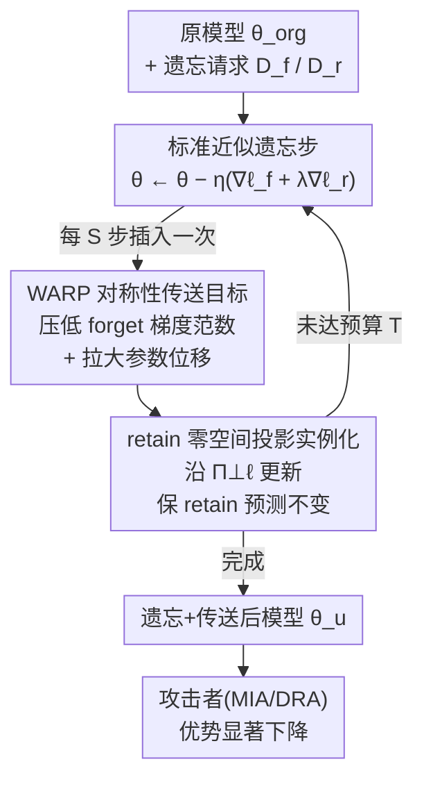

# WARP: Weight Teleportation for Attack-Resilient Unlearning Protocols

**会议**: ICLR 2026  
**OpenReview**: [https://openreview.net/forum?id=404TzkOCUD](https://openreview.net/forum?id=404TzkOCUD)  
**代码**: https://github.com/mammadmaheri7/WARP_Unlearning  
**领域**: AI安全 / 机器遗忘 / 隐私攻击与防御  
**关键词**: 近似遗忘, 成员推断, 数据重构, 权重传送, 网络对称性

## 一句话总结
本文指出近似机器遗忘会反过来泄漏被遗忘的数据，把泄漏归因到「遗忘样本梯度范数大」与「遗忘后参数离原模型太近」两个根因，并提出即插即用的 WARP 防御：利用神经网络的保损对称性把模型「传送」到损失等值面上的另一点，同时压低遗忘梯度范数、拉大参数位移，在六种遗忘算法上把黑盒攻击 AUC 最多降 64%、白盒最多降 92% 而几乎不损精度。

## 研究背景与动机
**领域现状**：机器遗忘（machine unlearning, MU）要落实「被遗忘权」——让训练好的模型彻底抹掉某个 forget-set $D_f$ 的影响，理想结果等价于在剩余 retain-set $D_r$ 上从头重训。从头重训代价太高，于是**近似遗忘**成为主流：直接在原模型 $\theta_{org}$ 上微调，最大化 forget-set 的损失、同时用 retain-set 把精度拉住，以效率换取（放弃）形式化保证。代表方法有 NegGrad+、SCRUB、SalUn、PGU、BadTeacher、SRF-ON 等。

**现有痛点**：遗忘本意是保护隐私，却可能讽刺地泄漏它本想抹掉的数据。攻击者一旦同时拿到遗忘前 $\theta_{org}$ 与遗忘后 $\theta_u$ 两个模型，就能做**差分攻击**：参数差 $\Delta\theta = \theta_u - \theta_{org}$ 在一阶意义下近似就是被遗忘样本的梯度，等于把这个样本「交」给了攻击者，可被梯度反演直接重构出原图。即便原本扛得住成员推断（MIA）的模型，做完遗忘后也会变得可攻。

**核心矛盾**：泄漏来自两个被以往遗忘工作忽视的因素。其一，被遗忘样本的隐私风险与它在原模型里的**梯度范数**正相关——梯度大的样本被删除时会引起更大的参数变动，因而更易被 MIA 识别、更易被重构。其二，近似遗忘为了保住 retain 精度只敢做**小步更新**，导致 $\theta_u$ 始终贴着 $\theta_{org}$，参数差 $\Delta\theta$ 因此编码了遗忘数据的强信号。两者叠加，遗忘反成攻击面。

**本文目标**：(1) 把这两个根因量化清楚，并设计专门针对遗忘场景的 MIA/DRA 攻击来证明威胁真实存在；(2) 给出一个能挂到任意梯度型遗忘算法上、无需训练期统计量的防御。

**切入角度**：作者注意到深度网络存在大量**保损对称性**（rescaling、置换、换基等变换），它们移动参数却不改变预测。既然遗忘后的危险来自「参数离得近 + 遗忘梯度大」，那就用对称性把模型「传送」到损失等值面上的另一个点——预测不变，但参数被移走、遗忘梯度被压小，攻击者就难以把「遗忘」和「传送」拆开。

**核心 idea**：用保损对称性传送 $\theta \leftarrow g\cdot\theta$ 重参数化遗忘后的模型，在不改变预测的前提下同时缩小 forget-set 梯度能量、增大参数离散度，从而抹掉 $\Delta\theta$ 中可被攻击利用的信号。

## 方法详解

### 整体框架
本文有两条线。**攻击线（审计工具）**：构造遗忘专用的成员推断与数据重构攻击，证明现有方法在黑盒/白盒下都漏。**防御线（核心方法 WARP）**：把保损对称性当成「传送」算子挂进遗忘流程。下面的框架图描绘的是核心方法 WARP 的防御管线——输入是原模型 $\theta_{org}$ 与遗忘请求 $D_f$，在标准近似遗忘的迭代里每隔 $S$ 步插入一次传送步，传送步求解一个「压低遗忘梯度 + 拉大参数位移」的对称性变换，并用 retain 零空间投影把变换限制在不动 retain 预测的子空间内；最终输出一个既忘掉了 $D_f$、又被移出 $\theta_{org}$ 邻域的 $\theta_u$，让 MIA/DRA 的优势大幅下降。攻击线作为衡量防御好坏的标尺，不在管线图内。

### 关键设计

**1. 把泄漏归因到两个根因，并据此造出能打穿现有方法的定制重构攻击**

作者先把「遗忘为何泄漏」拆成两条可量化的根因：forget 样本梯度范数大（图 1 显示梯度范数与 U-LiRA 测出的隐私风险明显正相关）、以及遗忘后参数与原模型过近。光说不够，作者据此设计了专门的攻击来证明威胁。黑盒侧把 LiRA 适配成 U-LiRA，用与目标同算法、同超参的影子模型做强自适应审计；白盒侧把高斯梯度差检验扩展到遗忘场景，对比同一样本在 $\theta_{org}$ 与 $\theta_u$ 上的梯度作为残余成员信号。

真正的难点在**重构攻击**：观测到的 $\Delta\theta$ 并非纯遗忘梯度，而是 retain 与 forget 梯度的混合，$\Delta\theta \approx -\eta\,(g_r - \alpha g_f)$，直接对它做梯度反演会被 $g_r$ 污染、重构质量很差。作者的关键招是**正交子空间过滤**：在一个探针集上对原模型/遗忘模型分别取梯度快照 $G_{org},G_u$，做薄 SVD 取主导左奇异向量得到投影子 $\Pi_{org}=U_{org}U_{org}^\top$、$\Pi_u^\perp = I-U_uU_u^\top$，再做

$$\tilde g_f = \Pi_{org}\,\Pi_u^\perp\!\left(-\tfrac{1}{\eta}\Delta\theta\right).$$

直觉是：遗忘抑制了 forget 方向但 retain 方向在两个模型里都还在，所以 $\Pi_u^\perp$ 滤掉「遗忘后仍存在」的 retain 分量、$\Pi_{org}$ 保留「遗忘前活跃」的方向，二者一夹就把 $\alpha g_f$ 以高信噪比抠出来。拿过滤后的 $\tilde g_f$ 当反演目标 $\hat x_f \in \arg\min_x D(\nabla_\theta\ell(f(x;\theta_{org}),y),\,\tilde g_f)$，重构成功率显著高于直接打 $\Delta\theta$。这一设计既是攻击，也是衡量后续防御是否真有效的标尺。

**2. WARP：用保损对称性把「压低遗忘梯度」和「拉大参数位移」写成一个传送目标**

针对上面两个根因，防御要同时做两件相反方向的事：让遗忘梯度变小（堵根因二）、让参数离 $\theta_{org}$ 变远（堵根因一），还不能动预测。作者用网络的保损对称性 $G$——满足 $L(X,\theta)=L(g\cdot(X,\theta))$ 的一族变换——把这两件事统一成一次「传送」$\theta\leftarrow g\cdot\theta$（沿损失等值面移动）。选哪个 $g$ 由下式决定：

$$g^\star \in \arg\min_{g\in G}\;\Big\{\underbrace{\textstyle\sum_{(x,y)\in D_f}\|\nabla_\theta\ell(f(x;g\cdot\theta),y)\|_2^2}_{\text{缩小 forget 梯度}} - \beta\,\underbrace{\|g\cdot\theta-\theta\|_2^2}_{\text{增大参数离散度}}\Big\}\quad \text{s.t. } \ell_r(g\cdot\theta\mid D_r)\le \ell_r(\theta\mid D_r)+\varepsilon.$$

第一项直接压低 forget 样本的平方梯度范数（对应根因二），第二项用对称性保持的随机扰动把参数推离 $\theta_{org}$、注入「无害噪声」（对应根因一），约束项保证 retain 性能基本不动。妙处在于：因为整个变换沿损失等值面走、预测不变，攻击者看到的 $\Delta\theta$ 里就混入了与遗忘无关的传送位移，无法再把「忘了什么」从「传送到哪」里干净地分离出来——这正是定制攻击赖以工作的信号被抹掉了。该目标对具体用哪种对称性是无关（agnostic）的，任意保预测对称族都能实例化。

**3. retain 零空间投影实例化 + 即插即用交错调度**

抽象目标要在现代网络上高效求解，不能真的去枚举群作用。作者采用基于 retain 零空间投影的传送来实例化 $T_\phi$。先把传送损失写成 $L_{tel}(\theta)=\sum_{(x,y)\in B_f}\|\nabla_\theta\ell(f(x;\theta),y)\|_2^2-\beta\|\theta-\theta_{org}\|_2^2$；再对每一层用 retain minibatch 的层输入矩阵 $R_\ell$ 做薄 SVD，取前 $k$ 个左奇异向量 $B_\ell$ 张成 retain 子空间，构造其正交补投影 $\Pi_\ell^\perp = I - B_\ell B_\ell^\top$，传送步只在这个补空间里更新权重：

$$W_\ell^{t+1} \leftarrow W_\ell^{t} - \eta_{tel}\,\Pi_\ell^\perp\big(\nabla_{W_\ell}L_{tel}(\theta^t)\big).$$

这样既沿 $L_{tel}$ 下降压低了 forget 梯度，又因为运动被限制在「与 retain 表示正交」的方向上而几乎不动 retain 预测——$k$ 取到覆盖 95%–99% retain 方差时，预测漂移落在数值误差内，正好满足约束里的 $\varepsilon$。这就是「保损」在工程上的落地方式（论文另在附录 D 给了无需 SVD 的换基对称实例，说明 WARP 不绑定某一种对称）。最后是**即插即用**：传送步 $W_\ell$ 的更新与标准遗忘更新（式 6）交错，每 $S$ 步插一次，不需要任何训练期逐样本梯度或存储统计量，因此能直接挂到 NGP、SCRUB、SalUn、PGU、BT、SF 等任意梯度型后处理遗忘算法上。

### 损失函数 / 训练策略
近似遗忘本体优化复合目标 $\min_\theta \ell_f(\theta\mid D_f)+\lambda\,\ell_r(\theta\mid D_r)$（forget 项 + retain 正则，$\lambda$ 越大越贴近 $\theta_{org}$），迭代式为 $\theta_{t+1}=\theta_t-\eta_t(\nabla_\theta\ell_f+\lambda\nabla_\theta\ell_r)$；取 $\ell_f=-\ell_{train}$ 即退化为负梯度法。WARP 不改这个本体，只在其中每 $S$ 步插入一次传送步（式 8），用 $\beta$ 调「压梯度 vs 拉位移」、用 $k$ 调 retain 子空间秩；附录 P 的敏感性实验表明效果不依赖脆弱的超参选择。

## 实验关键数据

### 主实验
评测覆盖 CIFAR-10 / Tiny-ImageNet / ImageNet-1K，模型用 ResNet-18 与 ViT-B/16，forget-set 取每类约 1% 训练数据，六种遗忘算法（NGP、SCRUB、PGU、SalUn、SF、BT）下挂 WARP 对比。

黑盒 U-LiRA（T=64 影子模型，强自适应）下，WARP 在全体 forget 样本与「最易记住」1% 切片上都降低成员泄漏，低 FPR 区收益最大：

| 方法 | 指标 | base | + WARP | 相对改善 |
|------|------|------|--------|----------|
| NGP | AUC（全体） | 0.545 | 0.516 | 64.4% |
| NGP | TPR@1 | 0.030 | 0.014 | 80.0% |
| SCRUB | 记忆切片 AUC | 0.710 | 0.610 | 47.6% |
| SF | 记忆切片 AUC | 0.518 | 0.501（近随机） | 94.4% |
| BT | TPR@5（全体） | 0.287 | 0.219 | 28.7% |

白盒高斯梯度差检验（640 个遗忘模型）下 AUC 普遍下降，PGU 从 0.659→0.533（改善 **92.9%**）、BT 0.938→0.907、SCRUB 0.700→0.657；ROC 曲线在 $10^{-5}$–$10^{-2}$ FPR 区被压向随机线，说明传送抹掉了攻击赖以成功的高置信尾部。

### 消融 / 重构实验
重构攻击（ImageNet-1K，ResNet-18，NGP）下 WARP 让攻击者的重构质量明显变差（PSNR/SSIM 越高对攻击者越好，越低说明防得越好）：

| 配置 | PSNR↑ | LPIPS(Alex)↓ | SSIM↑ | Feat MSE↓ |
|------|-------|--------------|-------|-----------|
| 普通遗忘（攻击者视角） | 10.74 | 0.34 | 0.12 | 5.39 |
| + WARP | 7.38 | 0.46 | 0.08 | 11.28 |
| 防御改善 | +45.5% | +26.1% | +31.6% | +52.2% |

### 关键发现
- 没有任何一种遗忘算法在所有轴上占优：SF 黑盒审计下看着稳，白盒下却大漏，说明必须双威胁模型一起审计。
- 黑盒看着「robust」的 NGP/SF 在白盒梯度/权重证据下仍有可观泄漏——审计离不开梯度/权重级别的证据。
- WARP 的收益集中在 TPR@0.1 / TPR@1 这类低 FPR 区，因为 retain 零空间投影压低了 forget 梯度、收窄了极端 margin，正好削掉攻击者依赖的稀有高置信信号。
- 精度几乎无损，BT/SF 甚至略有提升；唯一明显掉点是 NGP（约 1 个百分点），作者在附录给了隐私-效用权衡分析。

## 亮点与洞察
- **把「保损对称性」从优化技巧变成隐私防御杠杆**：传送沿损失等值面移动、预测不变，却能同时压梯度、拉位移，等于免费给 $\Delta\theta$ 注入与遗忘无关的混淆位移——这个「预测不变性 = 防御自由度」的视角很可迁移。
- **正交子空间过滤是把双刃剑**：它既是作者最强的重构攻击（把 forget 梯度从 retain 污染里抠干净），也反过来定义了防御要抹掉的目标信号，攻防同源、逻辑闭环。
- **即插即用、零训练期统计量**：不碰原遗忘算法、不存逐样本梯度，能直接挂到六种风格迥异（梯度上升/正则/显著性/投影/蒸馏）的方法上，工程友好度高。
- retain 零空间投影「只在与 retain 表示正交的方向上动」的思路，可迁移到任何「想改模型某行为又不想动另一部分预测」的场景（如持续学习、防灾难性遗忘）。

## 局限与展望
- 防御与攻击都假设攻击者**同时持有** $\theta_{org}$ 与 $\theta_u$（强白盒/差分设定）；若攻击者只有单个模型，根因与防御的收益边界还需重新评估。
- 实验集中在图像分类（ResNet-18 / ViT-B/16，CIFAR/Tiny-ImageNet/ImageNet），未覆盖 LLM、生成模型等更受关注的遗忘场景，对称性传送在超大模型上的开销与可行性需进一步验证。
- NGP 上约 1 个百分点的精度损失提示「压梯度 + 拉位移」与效用之间仍有 trade-off；$\beta$、$k$、$S$ 的联合调参在不同算法上的稳健边界值得更系统的刻画。
- 防御主要是**经验上**降低攻击成功率（附录给了信息论界），缺乏对「差分隐私式」形式化保证的直接对接，与校准的 DP-Langevin 遗忘相比是另一条技术路线。

## 相关工作与启发
- **vs 差分攻击 / 梯度反演（Hu et al., Bertran et al.）**: 他们证明 $\Delta\theta$ 近似遗忘梯度、可被反演重构；本文不仅复现并强化（正交子空间过滤），更进一步给出抹掉该信号的防御，从「揭示威胁」走到「堵住威胁」。
- **vs 网络传送 / 对称性优化（Armenta et al., Zhao et al.）**: 他们把保损对称性用于优化加速/损失景观分析；本文首次把它用作隐私防御，目标函数显式写进「压 forget 梯度 + 拉参数位移」。
- **vs DP-Langevin 遗忘（Chien et al.）**: 那是基于校准噪声的形式化路线；WARP 是无需训练期统计量、保预测的对称性路线，附录给出二者对比，定位为更轻、即插即用的替代/补充。

## 评分
- 新颖性: ⭐⭐⭐⭐⭐ 把保损对称性传送用作遗忘隐私防御、并配套同源的正交子空间过滤攻击，视角新颖自洽。
- 实验充分度: ⭐⭐⭐⭐ 三数据集、两架构、六算法、黑盒+白盒+重构三类攻击，覆盖面广；但限于视觉分类、未触及 LLM。
- 写作质量: ⭐⭐⭐⭐ 根因—攻击—防御的逻辑链清晰，公式与动机对应紧密，部分关键实现细节下放附录。
- 价值: ⭐⭐⭐⭐⭐ 即插即用、几乎无损精度地缓解近似遗忘的隐私泄漏，对落实「被遗忘权」有直接实用价值。

<!-- RELATED:START -->

## 相关论文

- [\[ICLR 2026\] Dataless Weight Disentanglement in Task Arithmetic via Kronecker-Factored Approximate Curvature](dataless_weight_disentanglement_in_task_arithmetic_via_kronecker-factored_approx.md)
- [\[CVPR 2025\] NoT: Federated Unlearning via Weight Negation](../../CVPR2025/ai_safety/not_federated_unlearning_via_weight_negation.md)
- [\[ICLR 2026\] Label Smoothing Improves Machine Unlearning](label_smoothing_improves_machine_unlearning.md)
- [\[ICLR 2026\] Machine Unlearning under Retain–Forget Entanglement](machine_unlearning_under_retainforget_entanglement.md)
- [\[ICLR 2026\] Distributional Machine Unlearning via Selective Data Removal](distributional_machine_unlearning_via_selective_data_removal.md)

<!-- RELATED:END -->
