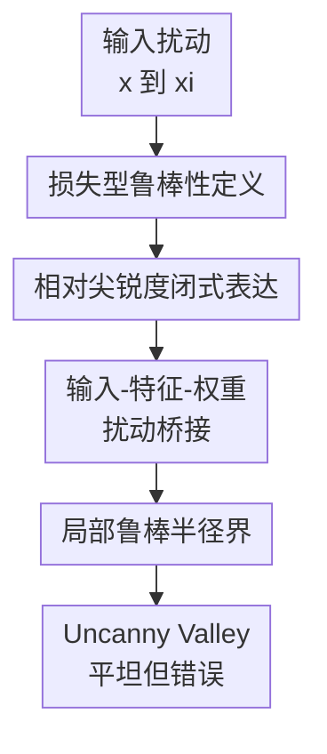

# When Flatness Does (Not) Guarantee Adversarial Robustness

**会议**: ICLR2026  
**OpenReview**: [https://openreview.net/forum?id=sptCQnKS9X](https://openreview.net/forum?id=sptCQnKS9X)  
**代码**: 未公开  
**领域**: AI安全 / 对抗鲁棒性理论  
**关键词**: 对抗鲁棒性、平坦性、相对尖锐度、损失景观、梯度遮蔽  

## 一句话总结
这篇论文把“平坦极小值是否带来对抗鲁棒性”从经验直觉改写成可证明的问题，结论是平坦性确实能给单点附近的局部损失稳定性提供下界，但无法推出全局鲁棒性，因为对抗样本常会落入高置信、低曲率、但分类错误的平坦区域。

## 研究背景与动机
**领域现状**：对抗鲁棒性里，一个经典观察是神经网络对很小的输入扰动很脆弱；而泛化理论里，另一个长期流行的观察是更平坦的参数空间极小值往往更容易泛化。于是很多工作自然把这两件事连起来：如果模型的 loss landscape 很平，那么输入被小幅扰动时，模型似乎也不该剧烈改变预测。

**现有痛点**：这个说法听起来合理，但中间隔着一个关键断层。平坦性通常是在参数空间里量化的，关心的是权重 $w$ 变化时损失怎么变；对抗样本却发生在输入空间，关心的是 $x$ 被扰动成 $x+\delta$ 后损失和预测怎么变。在线性模型里，可以把 $w(x+\delta_x)$ 重写成 $(w+\delta_w)x$，因此输入扰动像是某种权重扰动；但深度网络有非线性特征提取器，这个等价关系不再直接成立。

**核心矛盾**：平坦性既像是鲁棒性的证据，又可能只是置信度的副产品。尤其是交叉熵下，高置信预测本来就会让 Hessian 变小；如果模型在错误类别上也非常自信，那么它所在区域同样可能很平。这意味着“平坦”不一定等于“正确”，也不一定等于“全局上难以攻击”。

**本文目标**：作者想回答三个更精确的问题：第一，参数空间的相对平坦性到底能否形式化地约束输入空间扰动造成的损失变化；第二，这种约束是点态的还是数据集全局的；第三，为什么实际攻击中会出现“越攻击越平坦、但越错越自信”的现象。

**切入角度**：论文不直接分析整网所有参数的 Hessian，而是把网络拆成特征提取器 $\phi$ 和最后分类器 $g(w\phi(x))$，聚焦倒数第二层的相对尖锐度（relative sharpness）。这个选择很关键：最后分类层的 Hessian 可以写成闭式公式，既便于推导，又能把曲率、特征范数、权重范数和 softmax 置信度的关系暴露出来。

**核心 idea**：用倒数第二层的相对尖锐度把“参数空间平坦性”翻译成“输入空间局部损失稳定性”，再证明这种稳定性只覆盖样本附近的有限 basin，不能阻止攻击跨过边界后落入错误但同样平坦的高置信区域。

## 方法详解

### 整体框架
这篇论文的方法不是提出一个新的防御算法，而是建立一套理论-实验闭环：先把对抗鲁棒性改写成 loss-change 版本，再推导倒数第二层相对尖锐度的闭式表达，随后把输入扰动经特征提取器映射到特征扰动和权重扰动，最后用 Taylor 展开得到局部鲁棒半径，并用受控缩放实验验证这个半径的意义与边界。

整个逻辑可以概括为四步：定义上，从“预测是否翻转”转向“损失是否显著上升”；几何上，从倒数第二层的 Hessian trace 量化局部曲率；传播上，用 Lipschitz 特征提取器把输入扰动约束到特征空间；结论上，平坦性给出局部 basin，却不能保证 basin 外仍然正确。

### 关键设计
**1. 损失型对抗样本：让鲁棒性可以和曲率直接相连**

传统对抗样本定义只看预测标签是否变化：找最小扰动 $r^*$，使得 $f(x+r^*) \ne f(x)$。这个定义适合评测攻击成功率，却不适合分析 loss landscape，因为预测翻转是离散事件，中间的损失变化被隐藏了。论文因此引入 loss-change adversarial example：扰动 $r$ 只要让 $\ell(f(x+r), y)-\ell(f(x), y)>\epsilon$，就被视为对损失稳定性的破坏。

这个改写不是偷换概念，而是把经典定义连续化。若交叉熵损失在干净样本上很小，那么一次预测翻转通常对应正的损失增量；反过来，当阈值 $\epsilon$ 足够保守时，较大的损失增量也会推出预测翻转。这样一来，鲁棒性就可以写成：对所有 $\xi \in B_\delta(x)$，都有 $\ell(f(\xi),y)-\ell(f(x),y)\le \epsilon$。这个定义让后面的 Taylor 展开、Hessian trace 和扰动半径能够放在同一个公式里。

**2. 倒数第二层相对尖锐度：把平坦性拆成置信度、特征尺度和权重尺度**

论文沿用 Petzka 等人的 relative flatness 思路，但为了避免“越平越小”这个命名混乱，作者把实际使用的量称为相对尖锐度 $\kappa_{Tr}(w)$：

$$
\kappa_{Tr}(w)=\|w\|^2 Tr(H(w,S)).
$$

对单个样本和交叉熵损失，作者推导出最后分类层 Hessian 的闭式形式：

$$
H(w,\{(x,y)\})=(diag(\hat{y})-\hat{y}\hat{y}^T)\otimes \phi\phi^T,
$$

于是相对尖锐度变成

$$
\kappa_{Tr}(w)=\|w\|^2 \sum_{j=1}^{k}\hat{y}_j(1-\hat{y}_j)\sum_{i=1}^{d}\phi_i^2.
$$

这个式子是全文的核心透镜。它说明曲率不只是“参数几何”，还强烈受 softmax 置信度控制：当某个类别概率接近 $1$ 时，$\hat{y}_j(1-\hat{y}_j)$ 会趋近 $0$，Hessian trace 也会变小。换句话说，高置信预测天然容易显得平坦，不管这个预测是对还是错。

**3. 输入扰动到权重扰动的桥接：说明平坦性为何只给局部保证**

为了把输入空间扰动和参数空间平坦性接起来，论文假设特征提取器 $\phi$ 是 $L$-Lipschitz，且干净样本特征范数满足 $\|\phi(x)\|\ge r$。若 $\|\xi-x\|\le \delta$，则可以把特征扰动写成

$$
\phi(\xi)=\phi(x)+\Delta A\phi(x), \quad \Delta\le L\delta r^{-1},
$$

其中 $A$ 是正交矩阵。再利用最后线性分类层的结构，$w\phi(\xi)$ 可以重写为 $(w+\Delta wA)\phi(x)$。这一步给出了一个理论上干净的解释：在倒数第二层附近，输入扰动可以被等价地看成某类受控的分类层权重扰动。

随后作者对 $\ell(w+\Delta wA)$ 在 $w$ 处做 Taylor 展开。在模型已经收敛到局部极小值时，一阶项可以被处理掉，二阶项由 $\kappa_{Tr}^{\phi}(w)$ 控制，三阶余项则由类别数、特征维度和 Lipschitz 常数控制。最终得到的代表性界是：

$$
\ell(f(\xi),y)-\ell(f(x),y) \le \frac{\delta^2}{2r^2}L^2\kappa_{Tr}^{\phi}(w)+\frac{\delta^3}{24r^3}kmL^6.
$$

这个式子精确地点出“平坦性有用但有限”：降低 $\kappa_{Tr}$ 会扩大给定 $\epsilon$ 下可保证的扰动半径，但半径不会无限增长，因为三阶项和特征映射的几何仍然限制了 basin 的大小。

**4. Uncanny Valley：平坦区域可能是高置信错误区**

最有意思的反直觉结论来自攻击轨迹。PGD 攻击从干净样本出发时，样本附近可能确实比较平，随后接近决策边界时相对尖锐度升高；但一旦越过边界，攻击样本会落入另一个平坦谷地，那里模型对错误类别非常自信，损失平台化，Hessian trace 接近零。作者把这个现象称为 Uncanny Valley。

这个现象直接反驳了“平坦意味着正确鲁棒”的粗糙说法。平坦性可以描述一个点附近的损失是否稳定，却不携带“该稳定区域是否属于正确类别”的语义信息。对抗样本一旦进入错误侧的高置信区，平坦性指标反而会显得很好，甚至可能诱导一阶攻击梯度变弱，造成类似梯度遮蔽的评测假象。

### 一个完整示例
以 CIFAR-10 上的 ResNet-18 为例，可以把一次 PGD 轨迹想成穿过三个区域。开始时，干净图像位于正确类别附近的局部 basin；若放大最后分类层权重，使 softmax 更自信，loss 在这段轨迹上会更平，前若干步的损失几乎不动。继续攻击时，轨迹接近决策边界，模型不确定性升高，相对尖锐度快速达到峰值。

越过边界后，预测已经翻到错误类别，但攻击并不会停在“尖锐危险区”。相反，它常继续滑入一个很宽的错误高置信区域：loss 维持在高位，相对尖锐度却下降到接近零。此时如果只看 flatness，会误以为样本处在安全区域；但从分类语义上看，它已经是稳定的错误预测。这正是本文标题里 does not guarantee 的含义。

### 损失函数 / 训练策略
论文没有提出新的训练损失，而是用交叉熵作为理论主线，因为交叉熵能给出最后分类层 Hessian 的闭式表达。实验中，作者通过后验缩放倒数第二层分类权重 $w_s=sw$ 控制曲率，不重新训练模型：较大的 $s$ 会提高 softmax 置信度，使 $\hat{y}_j(1-\hat{y}_j)$ 变小，从而降低相对尖锐度。

主实验覆盖 ResNet-18、WideResNet-28-4、DenseNet-121、带 BatchNorm 的 VGG-11，以及 CIFAR-10 / CIFAR-100。标准训练采用 SGD、100 epochs、初始学习率 $0.1$、cosine schedule、weight decay $10^{-4}$。对抗训练补充实验使用 PGD-$\ell_\infty$，参数为 $10$ steps、$\epsilon=8/255$、步长 $2/255$；评测时还使用 PGD-$\ell_2$ 和 PGD-$\ell_\infty$ 来观察 basin 宽度、loss 增长和一阶攻击是否失效。

## 实验关键数据

### 主实验
| 实验问题 | 设置 | 主要观察 | 结论 |
|----------|------|----------|------|
| 平坦性是否降低局部损失增长 | ResNet-18 / CIFAR-10，PGD-$\ell_2$ 25 steps，$\epsilon=0.025$，步长 $0.001$，缩放 $s\in\{0.25,0.5,1,2.5,5,10,50\}$ | $s$ 越大，相对尖锐度越低，干净点到攻击终点的 loss increase 分布越靠近 $0$ | 平坦性确实扩大单点附近的低损失 basin |
| 原模型在弱 $\ell_2$ 攻击下的鲁棒精度 | 同上，未缩放原模型 | 原文报告原模型 robust test accuracy 为 $90.33\%$ | 弱攻击下仍能看到局部稳定性，不等同于强全局鲁棒 |
| 对抗训练后的 basin | PGD-$\ell_\infty$ 对抗训练 ResNet，评测用 PGD-$\ell_2$ 50 steps，$\epsilon=0.5$，步长 $0.01$ | basin 宽度按迭代距离约扩大 $20\times$；clean 与 adversarially trained 模型的局部 $Tr(H)$ 量级接近，文中例子约 $0.6$ vs. $1.0$ | 对抗训练主要扩大可承受扰动范围，但不把 flatness 变成全局正确性证书 |
| 一阶攻击失效现象 | ResNet-18，PGD-$\ell_\infty$ 10 steps，$\epsilon=8/255$，步长 $2/255$，缩放 $s$ 从 $1$ 到 $100$ | $s=1$ 时 robust accuracy 为 $0\%$，$s=100$ 时达到 $93\%$，接近 clean accuracy | 缩放能制造“看似不可攻击”的网络，但这更像梯度遮蔽 |
| 迁移攻击检验 | 使用 $s=1$ 找到的对抗样本迁移到其他缩放模型 | 原文报告迁移成功率为 $100\%$ | 漏洞没有消失，只是一阶梯度更难找到它 |

### 消融实验
| 配置 | 关键指标 | 说明 |
|------|---------|------|
| 小缩放 $s=0.25/0.5$ | loss 沿 PGD 轨迹更早上升 | 低置信或较尖锐设置下，局部 basin 窄，扰动更快触发损失变化 |
| 原始缩放 $s=1$ | 作为标准模型基线 | 能观察到从干净点、决策边界到错误高置信区的完整 sharpness 轨迹 |
| 大缩放 $s=10/50$ | loss increase 分布集中到更小范围 | 提高置信度会降低相对尖锐度，使局部 basin 变宽 |
| 极大缩放 $s=100$ | PGD-$\ell_\infty$ robust accuracy 达 $93\%$，但迁移攻击 $100\%$ 成功 | 说明 flatness 可诱导一阶攻击失败，不能直接当成鲁棒性提升 |
| 对抗训练模型 | basin 迭代宽度约扩大 $20\times$ | 真正的鲁棒训练改变了可达半径，但仍受局部保证限制 |
| 相对尖锐度阈值检测 | CIFAR-10 / WideResNet-28-4，5-fold decision stump 准确率 $[0.92,0.92,0.93,0.92,0.92]$ | sharpness 可作为检测信号，但作者明确没有把它发展成完整检测方法 |

### 关键发现
- 平坦性确实有局部意义：在给定样本附近，较低的 $\kappa_{Tr}$ 对应更小的 loss increase 和更宽的 basin，这与理论界一致。
- 平坦性没有全局语义：同样低曲率的区域可以对应正确高置信预测，也可以对应错误高置信预测。
- 决策边界附近通常最尖锐，因为 softmax 不确定性最大；越过边界后，模型重新变得自信，曲率又会塌缩。
- 单纯通过放大最后分类层权重降低 sharpness，会让一阶攻击更难优化，但迁移攻击显示真实对抗脆弱性仍然存在。
- 对抗训练扩大了 basin 宽度，但本文的理论和实验都表明，局部 basin 的存在不能替代全局鲁棒证书。

## 亮点与洞察
- 论文最强的地方是把一个常见口号拆成可检验命题：flatness does guarantee something，但 guarantee 的对象只是 loss-change 意义下的局部稳定半径，而不是整个数据分布上的预测正确性。
- 倒数第二层 Hessian 的闭式表达很有解释力。它把“平坦”从一个抽象几何词拆成 $\|w\|^2$、$\|\phi\|^2$ 和 $\hat{y}(1-\hat{y})$ 的组合，让人一眼看到 confidence 为什么会污染 flatness 指标。
- Uncanny Valley 是一个很好的概念命名：对抗样本不是一直待在尖锐危险区域，而是越过尖锐边界后进入错误类别的平坦谷。这解释了为什么一些 flatness-based 或 gradient-based 评测会把“攻不动”误解成“更鲁棒”。
- 后验缩放实验设计很干净。它不重新训练模型，只改变最后分类层尺度，因此能更直接地隔离“曲率/置信度变化”对局部攻击轨迹的影响。
- 对 AI 安全实践的启发是：安全指标不能只看局部几何漂亮不漂亮，还要验证错误区域、迁移攻击和强攻击下的可达性。一个区域平坦，只说明模型在那里稳定，不说明它稳定地对。

## 局限与展望
- 理论条件偏理想化。证明依赖 $L$-Lipschitz 特征提取器、特征范数下界、局部极小值、ReLU/仿射结构等假设；作者也指出 attention 会引入额外曲率，因此该“最后层决定曲率”的论证不能直接覆盖 Transformer。
- 鲁棒半径界主要是解释性而非实用证书。界中包含 $L$、$r$、类别数 $k$、特征维度 $m$ 和三阶项，真实网络上很难得到紧的可用数值。
- 实验集中在 CIFAR 图像分类和少量 LLM prompt attack 轨迹，足以支持几何现象，但还不能说明所有现代大模型安全场景都会呈现同样结构。
- 后验缩放会改变置信度和梯度尺度，带来明显梯度遮蔽风险。论文通过迁移攻击识别了这一点，但若未来把 flatness 用作防御目标，需要系统接入 AutoAttack、黑盒迁移、EOT 等更强评测。
- 下一步值得发展能区分“正确平坦”和“错误平坦”的指标，例如把特征提取器几何、分类边界 margin、数据流形方向和置信度项分开度量，而不是继续依赖单一 Hessian trace。

## 相关工作与启发
- **vs SAM / sharpness-aware training**: SAM 类方法优化参数空间尖锐度，常能改善泛化并带来一定鲁棒性；本文说明这种改善更准确地说是扩大局部稳定 basin，而不是自动获得全局对抗鲁棒。
- **vs Petzka et al. 的 relative flatness**: Petzka 等人把相对平坦性用于泛化理论，本文继承该 reparameterization-invariant 思路，并把倒数第二层 relative sharpness 推到对抗扰动分析里。
- **vs Stutz et al. 的鲁棒性-平坦极小值关联**: 早期工作强调鲁棒模型与平坦区域的经验相关性，本文进一步指出相关性成立的局部机制和它失效的全局盲区。
- **vs certified robustness / Lipschitz 约束**: 认证鲁棒性通常直接给输入扰动半径证书，本文更像解释参数空间几何为何影响输入空间局部稳定；它不能替代认证方法，但能帮助理解为什么一些局部证据不足以排除对抗样本。
- **vs 梯度遮蔽研究**: 大缩放模型 PGD 攻不动但迁移样本仍 $100\%$ 成功，这和经典梯度遮蔽警告一致。本文给出的新解释是：高置信导致 Hessian 塌缩，平坦性本身就可能参与制造这种假象。

## 评分
- 新颖性: ⭐⭐⭐⭐☆ 把 flatness 与 adversarial robustness 的关系做成闭式推导，并提出 Uncanny Valley 解释，理论视角清晰。
- 实验充分度: ⭐⭐⭐⭐☆ 覆盖多架构、多数据集、对抗训练和迁移检验，但强攻击体系和大模型实验仍可扩展。
- 写作质量: ⭐⭐⭐⭐☆ 主线很清楚，公式和图像实验能互相支撑；部分附录推导较密，需要读者有二阶优化背景。
- 价值: ⭐⭐⭐⭐⭐ 对“平坦性是否等于安全”给出非常有用的纠偏，尤其适合作为对抗鲁棒性理论和安全评测的概念参考。

<!-- RELATED:START -->

## 相关论文

- [\[ICLR 2026\] Reducing Information Dependency Does Not Cause Training Data Privacy. Adversarially Non-Robust Features Do.](reducing_information_dependency_does_not_cause_training_data_privacy_adversarial.md)
- [\[ICLR 2026\] On the Interaction of Compressibility and Adversarial Robustness](on_the_interaction_of_compressibility_and_adversarial_robustness.md)
- [\[CVPR 2026\] When CLIP Sees More, It Fights Back Harder: Multi-View Guided Adaptive Counterattacks for Test-Time Adversarial Robustness](../../CVPR2026/ai_safety/when_clip_sees_more_it_fights_back_harder_multi-view_guided_adaptive_counteratta.md)
- [\[ICLR 2026\] FERD: Fairness-Enhanced Data-Free Adversarial Robustness Distillation](ferd_fairness-enhanced_data-free_adversarial_robustness_distillation.md)
- [\[ICML 2026\] Flatness-Aware Stochastic Gradient Langevin Dynamics](../../ICML2026/ai_safety/flatness-aware_stochastic_gradient_langevin_dynamics.md)

<!-- RELATED:END -->
