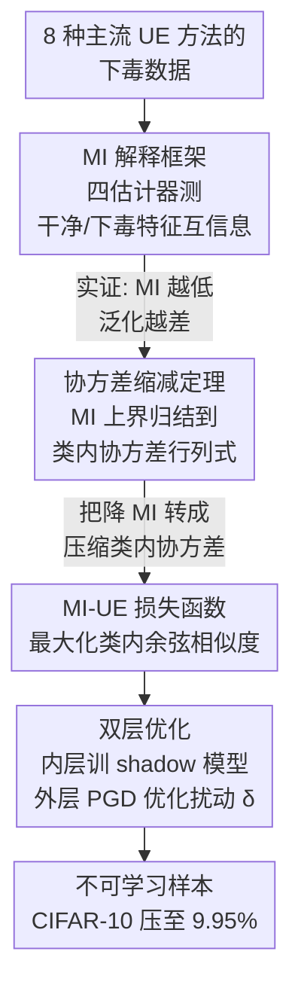

# Why Do Unlearnable Examples Work: A Novel Perspective of Mutual Information

**会议**: ICLR 2026  
**arXiv**: [2603.03725](https://arxiv.org/abs/2603.03725)  
**代码**: [github.com/hala64/mi-ue](https://github.com/hala64/mi-ue)  
**领域**: AI安全 / 数据隐私保护  
**关键词**: 不可学习样本, 互信息, 数据下毒, 协方差缩减, 隐私保护

## 一句话总结

从互信息（MI）降低的角度统一解释了所有不可学习样本（UE）的有效机制，并证明减小类内下毒特征的协方差可降低MI上界，据此提出 MI-UE 方法通过类内余弦相似度最大化实现协方差缩减，在 CIFAR-10 上将测试准确率压至 9.95%（接近随机猜测），且在对抗训练防御下仍大幅领先已有方法。

## 研究背景与动机

**领域现状**：互联网数据被大规模抓取用于训练商业模型（如 GPT-4、LAION-5B），已引发大量隐私侵权诉讼。不可学习样本（Unlearnable Examples, UE）作为一种"数据主动防御"手段受到关注——用户在发布数据前注入满足 $\|\delta\|_p \leq \epsilon$ 的不可感知扰动，使得未授权模型在该数据上训练后泛化能力急剧下降。代表方法 Error-Minimization（EM）可将 CIFAR-10 的测试准确率从 94.45% 降至 24.17%，但距随机猜测水平（10%）仍有显著差距。

**现有痛点**：现有 UE 方法几乎全靠经验直觉设计（如"欺骗模型认为无可学内容"、"注入非鲁棒特征"、"制造自回归信号"），缺乏统一的理论解释。主流的"线性可分性"假说存在两个根本缺陷：(1) 线性分类器在 UE 数据上仍可达 30%+ 准确率，但深度网络降到 10%——如果 UE 只是线性 shortcut，为何线性模型反而不受影响？(2) 自回归扰动（AR）的线性可分性甚至低于干净数据，却仍有强效的不可学习效果。这说明"线性可分性"只是表象，不是根因。

**核心矛盾**：UE 注入的扰动使训练数据偏离原始分布，打破了 i.i.d. 假设。但偏离多少、以何种方式偏离才导致泛化崩溃？缺少一个度量"分布偏移程度"与"泛化损失"之间关系的理论工具。

**本文目标** (1) 为所有 UE 方法提供统一的信息论解释框架；(2) 基于该框架设计原理驱动的更强 UE 方法；(3) 解释为什么网络越深、UE 效果越强的"深度效应"现象。

**切入角度**：借鉴表示学习中互信息（MI）度量两个分布间变量相关性的思路，作者提出用特征空间中干净特征 $g(X)$ 与下毒特征 $g(X')$ 之间的互信息 $I(g(X), g(X'))$ 作为"可学习性"的代理指标——MI 越低，模型越难从下毒数据中恢复原始分布的有用表示。

**核心 idea**：有效的 UE 必然降低干净/下毒特征间的互信息，通过最小化类内下毒特征的协方差（等价于最大化类内余弦相似度）可直接优化 MI 上界，产生最强不可学习效果。

## 方法详解

### 整体框架

整个工作分三个递进阶段。第一阶段是**实证发现**：在多种 MI 估计器上系统测量所有主流 UE 方法的 MI 降低量，验证"MI 降低 ↔ 泛化下降"的强正相关（Spearman 相关 0.7818）。第二阶段是**理论推导**：在高斯混合假设下，证明 MI 上界中包含类内协方差 $\log\det\Sigma_Y$ 项，从而将难以直接优化的 MI 问题转化为可优化的协方差缩减问题。第三阶段是**方法设计**：提出 MI-UE，通过双层优化同时训练 shadow 模型和优化扰动 $\delta$，外层目标为最大化类内余弦相似度、最小化类间余弦相似度的 $\mathcal{L}_{mi}$ 损失。这条链路里，三个递进阶段恰好对应下面三个关键设计——MI 解释框架（实证）→ 协方差缩减定理（理论）→ MI-UE 损失函数（方法）。

### 关键设计

**1. MI 解释框架：用一个能覆盖所有 UE 的统一指标取代各说各话的经验直觉**

把分类模型拆成 $f = h \circ g$（$g$ 是特征提取器，$h$ 是线性分类头），UE 之所以让模型学不到东西，本质是它压低了干净特征与下毒特征之间的互信息 $I(g(X), g(X'))$。为了验证这一点，作者对 EM、AP、NTGA、AR、REM、SEM、GUE、TUE 这 8 种主流 UE 方法逐一用其下毒数据训练 ResNet-18，再在特征空间里测量这个 MI。为避免被单一估计器的偏差带偏，他们同时用 Histogram、KDE、k-NN、MINE 四种估计方法，并配合 Sliced MI（SMI）把高维特征投影到一维再估计——四种独立估计器给出一致趋势，结论才足够可信。结果是所有有效 UE 的 MI 都显著低于 Clean 和 Random 基线，而且 MI Gap 越大、Acc Gap 越大。这个框架还顺带解释了"深度效应"：把模型从 Linear、2-NN、3-NN 一路换到 LeNet-5、VGG-11、ResNet-18，MI 降低与准确率下降严格同步——线性模型里 $g$ 退化成恒等映射，小范数扰动几乎改不动 $I(X, X')$；深层网络的 $g$ 则通过 error amplification 把扰动在特征空间里的影响放大，MI 才会大幅塌陷。

**2. 协方差缩减定理（Theorem 5.1）：把没法直接优化的 MI，换成一个能优化的代理量**

MI 在高维空间本身极难估计，已有方法都有严重统计偏差，SGD 直接优化 MI 也是有偏的，所以"降低 MI"虽然方向对，却无法当成训练目标直接拿来用。定理 5.1 给出了一条绕路：假设每个类别 $Y$ 的下毒特征 $g(X')|Y$ 近似服从高斯分布 $\mathcal{N}(\mu_Y, \Sigma_Y)$（与真实分布的 KL 散度 $\leq \epsilon$），则 MI 存在上界

$$I(g(X), g(X')) \leq \frac{d}{2}\log(2\pi e) + \frac{1}{2}\mathbb{E}_Y\log(\det\Sigma_Y) + H(g(X')|g(X)) + \mathbb{E}_Y C_Y\sqrt{\epsilon}.$$

其中第一项是常数，第三项在固定 UE 生成器 $\mathcal{G}$ 和训练算法 $\mathcal{A}$ 后也是常数，第四项是近似误差小量。真正能动的只剩类内协方差行列式 $\det\Sigma_Y$——只要把它压小，MI 上界就跟着下降。于是优化目标从抽象的"互信息"被降维成了具体的"类内特征有多散"，问题一下子变得可处理。

**3. MI-UE 损失函数：把"压缩类内协方差"翻译成一个能在带 BN 的网络里真正生效的 loss**

要缩小 $\det\Sigma_Y$，最直白的想法是把同类特征拉到一起，但纯欧氏距离最小化在带 BN/LN 的网络里会失效——归一化层会把特征重新缩放，把距离优化的梯度吞掉。MI-UE 的 $\mathcal{L}_{mi}$ 因此改用对归一化不敏感的余弦度量，并由两项构成。**相似度项**对 mini-batch 里的样本对取 log 比值：分子是同类样本对的 $\exp(\cos/\tau)$ 之和，分母是异类样本对的 $\exp(\cos/\tau)$ 之和——它在最大化类内余弦相似度（压缩类内协方差）的同时最小化类间相似度，后者起到排斥作用，防止所有类特征坍缩到同一点（一旦坍缩，泛化反而会被恢复）。**距离项** $\zeta \cdot \log(1 + \sum_k \|g(x_{b_j}+\delta_{b_j}) - g(x_{b_k}+\delta_{b_k})\|_2)$ 作为正则项增强鲁棒性，外面套 $\log(1+\cdot)$ 是为了稳定梯度。温度 $\tau$ 控制 softmax 锐度，$\zeta$ 平衡两项权重。

### 损失函数 / 训练策略

采用双层优化（bi-level min-min）：内层用交叉熵 $\mathcal{L}_{ce}$ 训练 shadow 模型参数 $\theta$，外层用 $\mathcal{L}_{mi}$ 优化扰动 $\delta$。扰动通过 PGD 迭代生成，每个 epoch 10 步 PGD，步长 0.2/255（CIFAR）或 0.4/255（ImageNet-subset），总 budget $\|\delta\|_\infty \leq 8/255$。CIFAR 上生成 100 epochs 约需 3.6 小时，约为 EM 的 1.5 倍。温度 $\tau$ 控制 softmax 锐度，平衡超参 $\zeta = 0.1$（消融显示 $\leq 0.1$ 时效果稳定，$\geq 10$ 时严重退化，说明余弦相似度项是核心驱动力）。

## 实验关键数据

### 主实验：三数据集 ResNet-18 对比

| 方法 | CIFAR-10 (%) | CIFAR-100 (%) | ImageNet-subset (%) |
|------|-------------|--------------|-------------------|
| Clean | 94.45 | 76.65 | 80.43 |
| EM | 24.17 | 2.09 | 1.26 |
| AP | 11.21 | 3.73 | 9.10 |
| NTGA | 23.11 | 3.08 | 8.42 |
| REM | 22.94 | 7.52 | 13.74 |
| SEM | 14.78 | 6.29 | 4.10 |
| TUE | 11.25 | 1.34 | 4.95 |
| **MI-UE** | **9.95** | **1.17** | **1.03** |

MI-UE 在三个数据集上均取得最低测试准确率。特别是 CIFAR-10 达到 9.95%，几乎等于 10 类随机猜测水平。

### MI 与准确率关系（CIFAR-10，Histogram 估计器）

| 方法 | 测试准确率 (%) | Acc Gap (%) | MI | MI Gap |
|------|-------------|------------|------|--------|
| Clean | 94.45 | - | 0.7122 | - |
| Random | 94.11 | 0.34 | 0.6747 | 0.0375 |
| EM | 24.17 | 70.28 | 0.6400 | 0.0722 |
| AP | 11.21 | 83.24 | 0.5871 | 0.1251 |
| NTGA | 23.11 | 71.34 | 0.6126 | 0.0996 |
| AR | 17.41 | 77.04 | 0.5622 | 0.1500 |
| SEM | 14.78 | 79.67 | 0.5747 | 0.1375 |
| GUE | 12.04 | 82.41 | 0.5895 | 0.1227 |
| TUE | 11.25 | 83.20 | 0.6094 | 0.1028 |
| **MI-UE** | **9.95** | **84.50** | **0.4969** | **0.2153** |

MI-UE 的 MI Gap（0.2153）远超所有基线，直接印证了"更低 MI → 更强不可学习性"的核心论点。

### 跨架构迁移性（CIFAR-10）

| 模型 | Clean | EM | AP | AR | SEM | GUE | TUE | MI-UE |
|------|-------|-----|-----|-----|------|------|------|-------|
| ResNet-18 | 94.45 | 24.17 | 11.21 | 17.41 | 14.78 | 12.04 | 11.25 | **9.95** |
| ResNet-50 | 95.16 | 23.57 | 11.66 | 15.28 | 13.61 | 12.99 | 10.01 | **9.98** |
| DenseNet-121 | 94.91 | 24.87 | 11.80 | 16.50 | 15.19 | 12.46 | 11.41 | **9.93** |
| ViT-B | 90.92 | 27.35 | 24.21 | 24.16 | 25.52 | 17.72 | 35.54 | **15.51** |
| LeNet-5 | 80.68 | 26.30 | 31.38 | 73.33 | 22.94 | 13.30 | 28.37 | **10.80** |
| 3-NN | 62.12 | 28.54 | 61.03 | 62.02 | 54.44 | 16.97 | 56.55 | **14.16** |
| 2-NN | 56.15 | 32.50 | 55.78 | 56.75 | 50.79 | 22.08 | 48.75 | **17.82** |

MI-UE 在所有架构上均最优。值得注意的是 AP、AR、TUE 等方法在浅层网络上几乎失效（3-NN 上 AP 为 61.03%），而 MI-UE 在 3-NN 上仍达 14.16%，展现出跨深度的鲁棒迁移性。

### 对抗训练防御（CIFAR-10）

| 方法 | AT-8 | AT-6 | AT-4 | AT-2 | ST |
|------|------|------|------|------|----|
| Clean | 85.10 | 87.54 | 89.77 | 91.95 | 94.45 |
| EM | 84.57 | 85.42 | 84.29 | 52.81 | 24.17 |
| SEM | 85.99 | 86.82 | 29.77 | 19.41 | 14.78 |
| REM | 85.99 | 81.91 | 39.45 | 30.64 | 22.94 |
| TUE | 84.10 | 86.07 | 89.29 | 91.70 | 11.25 |
| **MI-UE** | **70.56** | **45.55** | **31.79** | **17.39** | **9.95** |

在最具挑战性的 AT-8（与 UE 同等 budget 的对抗训练）下，MI-UE 仍将准确率压到 70.56%，而其他方法几乎完全恢复到 Clean 水平。AT-6 下 MI-UE 达到 45.55%，远低于次优的 REM（81.91%），差距高达 36 个百分点。

### 消融实验

| 配置 | CIFAR-10 (%) | CIFAR-100 (%) | ImageNet-S (%) |
|------|-------------|--------------|---------------|
| MI-UE（完整） | 9.95 | 1.17 | 1.03 |
| w/o 距离项 | 10.09 | 2.52 | 1.46 |
| w/o 相似度项 | 51.65 | 26.72 | 23.38 |

去掉相似度项后准确率从 9.95% 飙升到 51.65%，证明余弦相似度驱动的类内协方差缩减是 MI-UE 的核心机制。距离项的边际贡献较小但仍正面（CIFAR-100 上从 2.52% → 1.17%）。

### 关键发现

- **MI 与有效性的强正相关**：四种独立 MI 估计器一致显示，MI Gap 越大、Acc Gap 越大，Spearman 相关达 0.7818
- **深度效应的信息论解释**：浅层网络的 $g$ 接近恒等映射，小范数扰动几乎不改变 $I(X, X')$；深层网络的 $g$ 通过 error amplification 放大扰动在特征空间中的影响，导致 MI 大幅下降
- **相似度项 >> 距离项**：去掉相似度项后效果崩溃，但去掉距离项几乎不影响，证明协方差缩减（而非简单拉近特征点）才是关键。这也侧面验证了 BN/LN 会吞噬纯欧氏距离优化的梯度
- **MI 正则化实验**：在 EM 和 AP 基础上加 MINE 网络做 MI 正则化，都进一步降低了 MI 和准确率（EM: 24.17% → 15.62%，AP: 11.21% → 10.01%），但仍不如 MI-UE（9.95%），说明直接优化 MI 下界不如通过协方差缩减间接优化有效
- **超参鲁棒性**：$\zeta \in [0, 0.1]$ 时效果稳定（~10%），$\zeta \geq 10$ 时急剧退化至 45%+，说明过大的距离权重会干扰核心的相似度优化
- **Budget 鲁棒性**：扰动预算从 4/255 到 16/255，CIFAR-10 准确率始终约 10%，CIFAR-100 约 1%，说明 MI-UE 对 budget 不敏感

## 亮点与洞察

- **MI 视角的统一性**：所有已知有效 UE（EM、AP、AR、NTGA、REM、SEM、GUE、TUE）本质上都在降低 MI，只是路径和程度不同。这是首个能覆盖所有 UE 方法的统一解释框架，包括此前无法被"线性可分性"解释的 AR 方法
- **理论-方法桥接的优雅性**：从 MI → 协方差行列式 → 余弦相似度，逐层将抽象的信息论目标转化为具体可优化的 loss 项。特别是引入余弦度量而非欧氏距离来规避归一化层的干扰，这一设计在 BN 普遍使用的现代网络中具有普适参考价值
- **跨深度鲁棒迁移**：AP、TUE 等方法在浅层网络上近乎失效，而 MI-UE 在 2-NN 上仍比 Clean 低 38 个百分点，说明 MI 降低机制不依赖特定网络架构

## 局限与展望

- **专用防御下仍存在瓶颈**：ISS、AVA 等专门设计的 UE 防御可将所有 UE（包括 MI-UE）恢复到 80%+ 准确率。MI-UE 在最差情况下为 86.18%（AVA），虽然比其他方法好，但仍远未达到不可学习。突破专用防御是 UE 领域的根本挑战
- **仅验证图像分类**：文本、语音、时序数据等模态的适用性未探索。MI 降低框架理论上是模态无关的，但具体的协方差缩减实现需要针对不同数据类型重新设计
- **高斯混合假设的局限**：Theorem 5.1 假设类内特征近似高斯，但深度网络的特征分布可能是多峰或重尾的。虽然作者在附录中讨论了近似的合理性，但严格的分布偏离分析尚缺
- **计算开销**：MI-UE 生成时间约为 EM 的 1.5 倍（双层优化 + PGD），大规模数据集上的可扩展性有待验证
- **与机器遗忘的关联**：MI-UE 是"训练前"的数据保护，能否与"训练后"的机器遗忘方法结合使用，值得探索

## 相关工作与启发

- **vs EM (Huang et al., 2020)**：EM 通过最小化训练 loss 让模型"认为无可学内容"，MI Gap 仅 0.0722。MI-UE 直接优化特征空间的 MI 降低，Gap 达 0.2153，准确率从 24.17% → 9.95%
- **vs AP (Fowl et al., 2021)**：AP 注入对抗性扰动（adversarial poisons），MI Gap 0.1251。AP 在深层网络效果好（11.21%）但在浅层网络几乎失效（3-NN: 61.03%），说明其依赖深层网络的特定行为；MI-UE 在 3-NN 上仍达 14.16%
- **vs SEM/REM（鲁棒 UE）**：SEM 和 REM 专为对抗训练防御设计，在 AT-4 下表现良好，但仅在 budget < poison budget/2 时有效。MI-UE 在全范围 AT（AT-2 到 AT-8）上均优，展现更强的防御鲁棒性
- **vs TUE (Ren et al., 2022)**：TUE 基于 SimCLR 的无监督 backbone 生成可迁移扰动，在深层网络上效果优秀但浅层完全失效。MI-UE 的迁移能力更均衡
- **与数据隐私保护的关系**：本文的 MI 框架为数据保护提供了信息论上的理论指导——未来的 UE 设计应以最大化 MI 降低为核心目标，而非依赖特定的经验直觉

## 评分

- 新颖性: ⭐⭐⭐⭐ MI 解释框架和协方差缩减定理是实质贡献，将经验性的 UE 设计提升到信息论高度
- 实验充分度: ⭐⭐⭐⭐⭐ 四种 MI 估计器 × 多种网络深度 × 8 种基线 × 3 个数据集 × 多种防御，交叉验证非常全面
- 写作质量: ⭐⭐⭐⭐ 从实证→理论→方法的递进逻辑清晰，图表丰富
- 价值: ⭐⭐⭐⭐ 为 UE 领域提供了统一理论框架和 SOTA 方法，但专用防御下的瓶颈限制了直接实用价值

<!-- RELATED:START -->

## 相关论文

- [\[ICLR 2026\] Reducing Information Dependency Does Not Cause Training Data Privacy. Adversarially Non-Robust Features Do.](reducing_information_dependency_does_not_cause_training_data_privacy_adversarial.md)
- [\[ICML 2026\] Dual-branch Robust Unlearnable Examples](../../ICML2026/ai_safety/dual-branch_robust_unlearnable_examples.md)
- [\[ICML 2025\] Generalization in Federated Learning: A Conditional Mutual Information Framework](../../ICML2025/ai_safety/generalization_in_federated_learning_a_conditional_mutual_information_framework.md)
- [\[ICLR 2026\] Adaptive Methods Are Preferable in High Privacy Settings: An SDE Perspective](adaptive_methods_are_preferable_in_high_privacy_settings_an_sde_perspective.md)
- [\[ICLR 2026\] Nasty Adversarial Training: A Probability Sparsity Perspective for Robustness Enhancement](nasty_adversarial_training_a_probability_sparsity_perspective_for_robustness_enh.md)

<!-- RELATED:END -->
