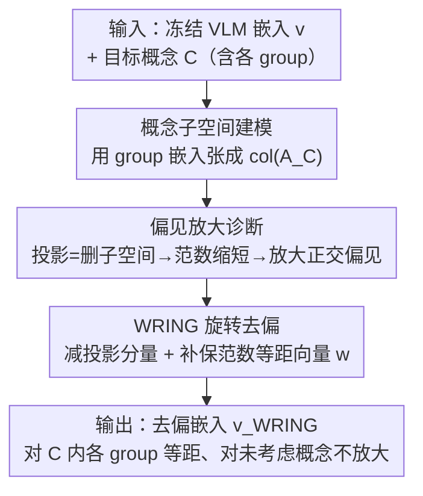

# Wring Out the Bias: A Rotation-Based Alternative to Projection Debiasing

**会议**: ICLR 2026  
**论文**: Published as a conference paper at ICLR 2026  
**代码**: 无（缓存未提供）  
**领域**: AI 安全 / 公平性去偏 / 多模态VLM  
**关键词**: VLM 去偏, CLIP, 投影去偏, 旋转去偏, whac-a-mole, 偏见放大

## 一句话总结
针对 CLIP 等视觉语言模型常用的"投影去偏"会把偏见从一个概念偷偷搬到另一个未考虑概念上（whac-a-mole 困境），本文从线性代数上证明投影**必然**放大正交子空间的偏见，并提出用"在相关子空间内旋转嵌入"替代"删除子空间"的 WRING 方法，在消除目标概念偏见的同时几乎不放大未考虑概念的偏见。

## 研究背景与动机
**领域现状**：CLIP 这类视觉语言模型（VLM）被广泛用于零样本分类、图像检索、人脸识别，但它们会编码大量偏见——典型的是"spurious correlation"，比如把图像背景（室内/室外）当成判别狗的依据，而不是看狗本身。主流去偏方法（尤其是后处理类）走的是**投影去偏**（projection debiasing）：先找到目标概念（如"背景"）对应的子空间，再把嵌入投影到该子空间的正交补上，让嵌入与这个概念方向正交，从而"删掉"该概念的信息。

**现有痛点**：投影去偏对**被显式考虑的那个概念**确实有效，但作者指出它会在**未考虑的概念**上放大偏见。例子很直观：把"背景"信息从嵌入里删掉后，模型反而更依赖"狗的品种"这个捷径——背景偏见消失了，品种偏见却变大了。

**核心矛盾**：这正是已知的 **whac-a-mole（打地鼠）困境**——为一个概念去偏，剩下的偏见捷径会被放大。此时模型并没有真正变公平，偏见只是被**转移并隐藏**到别处。而现实中不可能枚举所有可能的偏见概念，也就没有标签去显式优化它们，于是被放大的偏见会在评估时**悄无声息地逃过检测**。

**本文目标**：设计一种去偏方法，对一组已知概念去偏的同时，让嵌入与所有**未考虑概念**的关系**几乎不变**——即不放大任何未知偏见。这要在没有未考虑概念标签的前提下做到。

**切入角度**：作者先回到机制层面追问"投影为什么会放大偏见"。关键观察是：投影会**缩短**嵌入的范数（$\|v-P_Cv\|<\|v\|$），而偏见是用余弦相似度之差定义的，范数变化会按比例放大其它方向上的相对偏见。既然"删除子空间 + 改变范数"是病根，那就换一种**保范数**的操作。

**核心 idea**：用"旋转"代替"投影"——不删除目标概念子空间，而是把嵌入在该子空间内旋转到一个与各 group 等距的位置，使嵌入对该概念内每个 group 的相似度都相等（从而无偏），同时保持范数和正交方向的角度不变（从而不放大未考虑偏见）。

## 方法详解

### 整体框架
方法叫 **WRING（Weighted Rotational debiasING，加权旋转去偏）**。它是一个后处理操作：输入一个已经训练好的冻结 VLM 的嵌入 $v$ 和要去偏的目标概念 $C$（如"背景"，含若干 group 如 indoors/outdoors），输出一个去偏后的嵌入 $v_{\text{WRING},C}$，使它对 $C$ 内各 group 无偏，且对 $C$ 之外的概念关系尽量不变。

整条逻辑分三步串起来：先**刻画概念子空间**（用 group 嵌入张成的矩阵 $A_C$ 定义子空间 $\text{col}(A_C)$）；再**诊断投影为何放大偏见**（推导投影后偏见的解析式，分离出"放大项"和"改变项"，证明正交时必放大）；最后**用旋转替换投影**（把"减掉投影分量"补上一个保范数、且与各 group 等距的向量 $w$），让放大项消失。

### 关键设计

**1. 概念子空间建模：用 group 方向把"偏见"定位成一个低维子空间**

去偏的前提是先把"偏见"具体化为可操作的对象。作者沿用线性假设：VLM 把概念近似线性编码，同一概念的嵌入方差主要落在一个低维子空间里。对目标概念 $C$（如背景），取它每个 group（如 indoors、outdoors）的方向嵌入 $c_1,\dots,c_m$，拼成矩阵 $A_C\in\mathbb{R}^{n\times m}$，子空间就定义为列空间 $\text{col}(A_C)$。group 方向 $c_i$ 有两种取法：用 group 名字的**文本嵌入**（"a photo of indoors"），或用**图像嵌入**（取与查询最相似的 $k=100$ 张参考图像的平均嵌入）；作者发现**图像方向在实践中更好**，因为它更贴合实际数据分布。偏见本身被定义成余弦相似度之差：$\text{bias}(v,c_1,c_2):=\cos\_\text{sim}(v,c_1)-\cos\_\text{sim}(v,c_2)$，即嵌入对 group $c_1$ 比 $c_2$ 更亲近的程度。这个定义是后面所有推导的基础。

**2. 偏见放大诊断：证明投影必然放大正交子空间的偏见**

这是本文的理论核心，也是动机的"实锤"。设投影去偏后的嵌入为 $v_{\backslash C}=v-P_Cv$，其中 $P_C=A_C(A_C^\top A_C)^{-1}A_C^\top$ 是 $A_C$ 的正交投影矩阵。作者推导出：对另一个概念 $D\neq C$ 的两个方向 $d_1,d_2$，投影后偏见为

$$\text{bias}(v_{\text{PROJ},C},d_1,d_2)=\underbrace{\frac{\|v\|}{\|v-P_Cv\|}}_{\text{放大项}}\cdot\text{bias}(v,d_1,d_2)+\underbrace{\frac{\Delta P_Cv}{\|v-P_Cv\|}}_{\text{改变项}}.$$

第一项是**放大项**：因为投影删掉了一部分分量，$\|v-P_Cv\|<\|v\|$，所以这个系数恒 $>1$，会把任何已有偏见**等比放大**。第二项是**改变项**，符号不定，只有当它足够大且方向相反时才可能抵消放大项。最关键的结论是：当 $D$ 与 $C$ 的子空间**正交**时，改变项恰好为 $0$，于是投影**一定**放大偏见。而高维空间里随机方向**大概率正交**，所以这种"必然放大"在实践中频繁发生。这就解释了 whac-a-mole 困境的根因——病灶不是"找错了概念"，而是"删除子空间 + 范数缩短"这个操作本身。

**3. WRING 旋转去偏：用保范数的等距向量替换被删掉的分量**

既然病根是"删子空间改范数"，WRING 就不删，而是**替换**。它把投影掉的分量补回来，但换成一个特制的单位向量 $w$：

$$v_{\text{WRING},C}:=v-P_Cv+\|P_Cv\|\cdot w.$$

$w$ 需满足两条性质：(1) $w\in\text{col}(A_C)$，即仍落在目标概念子空间内——这保证 $\|v_{\text{WRING},C}\|=\|v\|$（范数不变），从而所有与 $\text{col}(A_C)$ 正交的方向的夹角都不变，**与 $C$ 无关的概念偏见完全不动**；(2) $w$ 与每个 group 嵌入 $c_i$ 等距，即 $\text{bias}(w,c_i,c_j)=0\ \forall i,j$——这保证去偏后的嵌入对 $C$ 内每个 group 一视同仁，不偏向任何一个。满足这两条的解（差一个尺度）唯一，形式为 $\tilde w=A_C(A_C^\top A_C)^{-1}\mathbf{1}$（推导见原文附录，⚠️ 以原文为准）。直观上，这相当于把嵌入在目标子空间内**旋转**到"各 group 等角"的位置，而不是把它压扁到正交补上。

对应地，WRING 后未考虑概念 $D$ 的偏见变为：

$$\text{bias}(v_{\text{WRING},C},d_1,d_2)=\text{bias}(v,d_1,d_2)+\underbrace{\frac{\|v-P_Cv\|}{\|v\|}\cdot\frac{\Delta P_Cv}{\|v-P_Cv\|}}_{\text{被抑制的改变项}}-\underbrace{\Delta w}_{\text{阻尼项}}.$$

和投影的式子对比有三处改善：**没有放大项**——原始偏见 $\text{bias}(v,d_1,d_2)$ 前面不再乘任何 $>1$ 的系数；**改变项被压缩**——被一个 $<1$ 的系数缩小；**新增阻尼项** $\Delta w$，符号与改变项相反，进一步抵消偏见。最干净的结论：当 $D\perp C$ 时，改变项和阻尼项**双双为 0**，WRING 对正交子空间的偏见**完全不放大**——恰好补上了投影"正交必放大"的硬伤。

### 损失函数 / 训练策略
WRING 是**无训练、无标签**的纯后处理操作：直接对冻结预训练 VLM 的嵌入做一次闭式线性变换（投影分量 + 等距向量 $w$ 的解析解），不需要微调编码器，也不需要未考虑概念的标签。这也是它相比 FairerCLIP（需要标签和训练）在实用场景上的优势——后者拿不到去偏目标之外概念的标签时就用不了。

## 实验关键数据

### 主实验
评测在 4 个数据集上展开，每个数据集选一个概念做去偏目标 $C_{\text{debias}}$、另一个做未考虑概念 $C_{\text{uncon}}$，核心看：去偏目标偏见降下来的同时，未考虑概念的偏见百分比变化（越接近 0 越好）。骨干用三种 CLIP（ViT-B/32、ViT-L/14、L/14-laion2B），全部冻结。

| 数据集 | 去偏概念 | 投影对未考虑概念的影响 | WRING 对未考虑概念的影响 |
|--------|---------|----------------------|------------------------|
| FairFace | 性别/种族 | 偏见显著放大、方差大 | 放大幅度远小、方差更低 |
| CelebA | 性别/种族 | 偏见放大 | 放大被显著抑制 |
| Spawrious | 狗品种/背景 | 放大品种/背景偏见 | 几乎不放大 |
| Fashion | 季节/颜色/性别 | 放大 | 抑制（去色彩偏见可视化明显） |

关键对照（CelebA 发色任务，去性别偏后评最差 group 准确率）：

| 方法 | 最差组准确率↑(性别) | 准确率差距↓(性别) | 说明 |
|------|------------------|-----------------|------|
| Baseline CLIP | 72.78 | 17.02 | 原始模型 |
| FairerCLIP | 84.78 | 11.71 | 最强但**需标签+训练** |
| Projection | 78.89 | 11.87 | 投影去偏 |
| WRING | 80.56 | **9.24** | 无需训练，差距最小 |

### 消融实验

| 配置 | 关键指标 | 说明 |
|------|---------|------|
| WRING (img) | 去偏更彻底 | 用图像嵌入定义 group 方向，实践最佳 |
| WRING (txt) | 去偏略弱 | 用文本嵌入定义方向，弱于 img |
| Projection (img/txt) | 未考虑偏见大幅放大 | 同样方向下，放大远超 WRING |
| SFID | 未考虑偏见变化小但目标几乎没去掉 | 改动小但**没真正去偏**，不算成功 |
| 替换进非线性去偏管线 | 未考虑偏见变化更小 | 把管线里的投影换成 WRING 即可更稳 |

### 关键发现
- **图像方向 > 文本方向**：无论投影还是 WRING，用图像嵌入定义 group 方向都比用文本描述去偏更彻底，因为图像方向更贴近真实数据分布。
- **SFID 的"假稳定"**：SFID 对未考虑概念改动小，但它对目标概念也几乎没去偏——稳定是因为它根本没怎么动，不能算成功去偏；WRING 是"既去掉了目标偏见、又不放大未知偏见"。
- **WRING 方差更小**：投影"不一定每次都放大、但不可预测"，WRING 则一致地几乎不放大，方差显著更低，印证理论分析。
- **可即插替换**：把现有去偏管线（如非线性 VLM 去偏 Gerych et al. 2024）里的投影操作直接换成 WRING 旋转，就能在保持目标去偏效果的同时大幅减少未考虑概念的偏见漂移。

## 亮点与洞察
- **把"打地鼠"困境从经验现象升级为可证明的机制**：作者用一行线性代数指出根因是"投影缩短范数 → 放大项恒 >1"，并证明正交子空间必被放大。这种"先解析诊断、再对症下药"的路线比堆经验 trick 更有说服力。
- **保范数旋转是关键技巧**：去偏不一定要"删信息"，把嵌入在子空间内旋到等距位置同样能消偏，而且天然不动正交方向——这个"replace instead of remove"的思路可迁移到词向量去偏、属性编辑等其它表示空间操作。
- **无训练无标签**：纯闭式后处理，对未考虑概念零标签需求，这正是现实去偏最难的部分（你根本不知道还有哪些偏见），WRING 用"不放大"绕开了"枚举不完"。
- **即插即用**：作为操作原语，能直接替换任意依赖投影的去偏管线，落地成本极低。

## 局限与展望
- **依赖线性概念假设**：WRING 建立在"概念被 VLM 线性编码、可用低维子空间表示"之上；对高度非线性纠缠的概念，子空间定义和旋转的有效性可能下降（作者也只在"非线性去偏管线"里验证了替换，而非完全非线性的概念结构）。
- **group 方向的质量决定上限**：去偏效果对 group 方向怎么定义敏感（img 明显优于 txt），方向选得不好会直接影响等距向量 $w$ 的合理性。
- **只保证"不放大"，不保证主动消除未知偏见**：WRING 的卖点是不把偏见搬到别处，但对那些它没显式去偏的概念，原有偏见仍然存在，只是没被放大。
- **下游精度提升有限**：在最差组准确率上 WRING 优于投影、但不及需要训练的 FairerCLIP；当能拿到标签时，训练类方法仍有上限优势。
- **改进思路**：把等距约束推广到非线性/核化子空间；在多概念联合去偏时研究旋转操作的复合是否仍保范数、是否会相互干扰。

## 相关工作与启发
- **vs 投影去偏（Bolukbasi 2016 / Chuang 2023a / Seth 2023）**：他们删除概念子空间使嵌入正交于概念方向，本文证明这会缩短范数从而放大未考虑偏见；WRING 改为子空间内旋转、保范数，区别在于"replace vs remove"，优势是正交方向偏见完全不变。
- **vs SFID（Jung 2024）**：SFID 用随机森林特征重要性选维度、把高重要维替换成低置信样本均值，改动小但去偏也弱；WRING 在去偏强度和不放大之间同时占优。
- **vs FairerCLIP（Dehdashtian 2024）**：FairerCLIP 下游最差组准确率最高，但需要标签和训练，不适用于"无法枚举/标注所有概念"的设定；WRING 无训练无标签，更通用。
- **启发**：whac-a-mole 困境（Li 2023）在 VLM 去偏里被本文给出了解析解释，提示"评估时看不到的偏见放大"是后处理去偏的系统性风险，未来去偏方法应把"对未考虑概念的影响"作为标准评测维度。

## 评分
- 新颖性: ⭐⭐⭐⭐⭐ 把经验性的"打地鼠"困境证明成投影的必然性质，并给出保范数旋转这一干净替代
- 实验充分度: ⭐⭐⭐⭐ 4 数据集 × 3 骨干 × 多查询类型 + 合成数据验证理论，但下游任务相对有限
- 写作质量: ⭐⭐⭐⭐ 理论推导清晰、图示直观，公式细节需查附录
- 价值: ⭐⭐⭐⭐⭐ 即插即用替换投影，对所有依赖投影的去偏管线都有直接价值

<!-- RELATED:START -->

## 相关论文

- [\[ICLR 2026\] Adaptive Logit Adjustment for Debiasing Multimodal Language Models](adaptive_logit_adjustment_for_debiasing_multimodal_language_models.md)
- [\[ICLR 2026\] Prior-based Noisy Text Data Filtering: Fast and Strong Alternative for Perplexity](prior-based_noisy_text_data_filtering_fast_and_strong_alternative_to_perplexity.md)
- [\[AAAI 2026\] Alternative Fairness and Accuracy Optimization in Criminal Justice](../../AAAI2026/ai_safety/alternative_fairness_and_accuracy_optimization_in_criminal_j.md)
- [\[CVPR 2026\] Bias at the End of the Score](../../CVPR2026/ai_safety/bias_at_the_end_of_the_score.md)
- [\[ICLR 2026\] Person-Centric Annotations of LAION-400M: Auditing Bias and Its Transfer to Models](person-centric_annotations_of_laion-400m_auditing_bias_and_its_transfer_to_model.md)

<!-- RELATED:END -->
