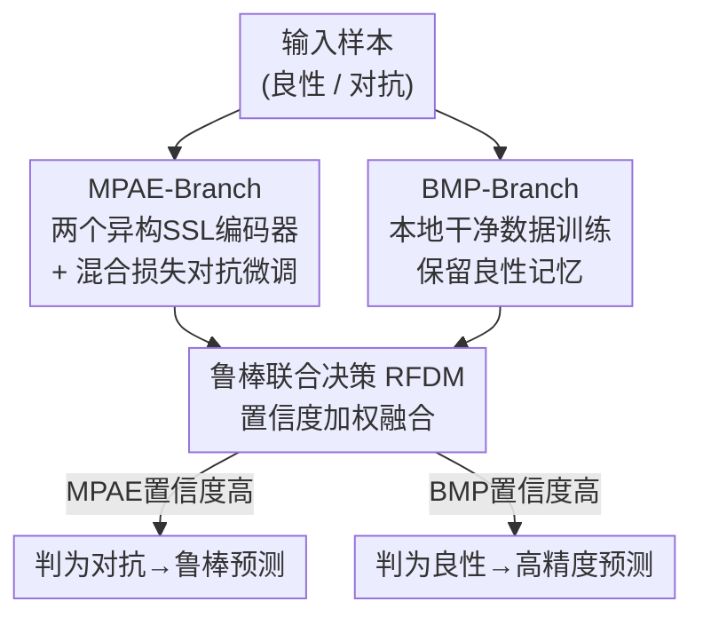

# Zero-Sacrifice Persistent-Robustness Adversarial Defense for Pre-Trained Encoders

**会议**: ICLR 2026  
**OpenReview**: [https://openreview.net/forum?id=AYFUmgCpkB](https://openreview.net/forum?id=AYFUmgCpkB)  
**代码**: https://github.com/Lawliet0o/ZePAD  
**领域**: AI安全 / 对抗防御 / 自监督预训练编码器  
**关键词**: 对抗防御, 下游无关对抗样本(DAE), 预训练编码器, 置信度, 双分支

## 一句话总结
ZePAD 用两条互补分支（对抗微调的多编码器分支 + 只在干净数据上训练的良性分支）加一套基于置信度的联合决策机制，让预训练编码器**只微调一次**就能在多个下游任务上同时抵御"下游无关对抗样本"且不掉甚至提升干净精度，顺带还能免费检测对抗样本。

## 研究背景与动机
**领域现状**：自监督学习（SSL）训出来的公开预训练编码器（CLIP、各类 SimCLR/BYOL/DINO 等）已经成为下游任务的标配基座——用户直接拿来微调一个分类头就能用，省去从头训练的巨大成本。

**现有痛点**：这些公开编码器存在一个严重安全漏洞——**下游无关对抗样本（Downstream-Agnostic Adversarial Examples, DAE）**。攻击者不需要知道下游任务是什么，只针对编码器构造扰动（如 PAP、AdvEncoder），生成的对抗样本就能迁移到任意使用该编码器的下游模型上，即使下游已经在本地数据上微调过也照样失效。现有防御几乎都靠"任务专属的对抗微调"，但这带来两个代价：一是**干净精度大幅下降**（论文举例 Gen-AF 把鲁棒精度从 35.58% 提到 62.28%，却把良性精度从 81.99% 砸到 68.69%），二是**每换一个下游任务就得重新微调一次**，泛化性极差。

**核心矛盾**：对抗鲁棒性优化和干净性能之间存在内在冲突——对抗微调让模型偏向对抗样本分布，必然牺牲它对良性样本的敏感度。过去所有工作都在这个 trade-off 上找平衡点，没人能在"不牺牲（甚至提升）干净精度"的前提下提升鲁棒性。

**本文目标**：作者把目标抬到一个更苛刻的标准——**零牺牲（Zero-Sacrifice）+ 持久鲁棒（Persistent-Robustness）**：① 干净精度不降反升；② 抵御 DAE；③ 不依赖外部数据或额外算力；④ **一次微调，处处可防**，无需任务专属重训。

**切入角度**：作者跳出"对抗微调里硬调 trade-off"的思路，转而利用神经网络的一个固有特性——网络对**和训练数据分布一致的输入会给出更高置信度**（这是对数据特性的记忆所致）。既然如此，与其逼一个编码器同时擅长良性和对抗两种样本，不如**让不同的编码器各司其职**，再靠置信度差异把它们的判断融合起来。

**核心 idea**：用一条"对抗增强分支"专门记住对抗样本、一条"良性记忆分支"专门记住干净样本，推理时谁的置信度高就听谁的——用分工 + 置信度仲裁代替单编码器的鲁棒/精度妥协。

## 方法详解

### 整体框架
ZePAD（Zero-Sacrifice Persistent-Robustness Adversarial Defense）是一个**双分支结构**，整个流程分两步：**Step 1 编码器准备**——防御者在本地构建两条分支：多模式对抗增强分支（MPAE-Branch，含两个用不同 SSL 方法预训练、再做对抗微调的编码器）和良性记忆保留分支（BMP-Branch，本地只用干净数据训练的编码器）；**Step 2 鲁棒联合决策机制（RFDM）**——推理时每条分支各出一个预测和置信度，RFDM 按"输入与该分支训练分布的吻合程度"给出的置信度对三个子编码器加权融合，得到最终预测。最终整套编码器 $E$ 由三个子编码器组成：$E_{a,1}$、$E_{a,2}$（公开共享 + 对抗微调）和 $E_b$（本地良性训练），各自配一个分类头 $H_{a,1}, H_{a,2}, H_b$。

关键观察支撑了这套设计：良性样本上 BMP-Branch 置信度最高（它只见过干净数据），对抗样本上则反转成 MPAE-Branch 置信度最高（它专门被对抗微调过）。这种**互补的置信度分离**就是融合决策的基础，也让 ZePAD 不用专门训练就能区分良性/对抗样本。

### 关键设计

**1. MPAE-Branch：用异构编码器的多样性让攻击者找不到公共漏洞**

DAE 之所以能跨下游迁移，是因为它抓住了某个编码器对特定纹理/模式的敏感性。作者的反制思路是：单个编码器有固定的脆弱模式，但**用不同 SSL 方法训练出来的多个编码器，其特征表示差异很大，攻击者很难找到一个在所有编码器上都通用的公共脆弱模式**。因此 MPAE-Branch 用两个公开预训练编码器（默认场景里受害编码器之外再选 BYOL 作辅助编码器，若受害者本身是 BYOL 则改用 NNCLR），都做对抗微调以增强抗扰动能力。

难点在于预训练编码器对微调极其敏感，硬做对抗微调会破坏原有表征知识。为此作者设计了一个**混合损失**在"保留预训练知识"和"提升鲁棒性"之间取平衡：

$$L = L_c + \lambda L_f$$

其中 $L_c = L_{CE}(F_\phi(E_\theta(x+\delta)), y)$ 是对抗样本的分类交叉熵损失，$L_f$ 是对抗样本的编码特征损失。$L_f$ 的核心是让对抗样本编码后的特征分布逼近其对应良性样本的特征分布——先用余弦距离定义样本对之间的特征距离 $D_{ij}$（并剔除最近邻样本，避免局部高密度数据主导损失、更好刻画全局结构）：

$$D_{ij} = \frac{2 - (\cos(x_i, x_j) - \rho_{x_j})}{\sum_{k \neq j}(2 - \cos(x_i, x_k) - \rho_{x_k})}$$

再用类 KL 散度形式约束对抗对距离 $D^a_{ij}$ 向良性对距离 $D^b_{ij}$ 对齐：

$$L_f = \sum_i \sum_j \left[ D^b_{ij}\log\frac{D^b_{ij}}{D^a_{ij}} + (1-D^b_{ij})\log\frac{1-D^b_{ij}}{1-D^a_{ij}} \right]$$

这样对抗样本经编码后的特征结构会被拉回到良性样本的结构上，从而在鲁棒微调的同时尽量不破坏原表征。

**2. BMP-Branch：用一条只见过干净数据的分支托住良性精度**

对抗微调天然会损害模型对干净样本的敏感度（消融里去掉这条分支后 BA 会跌破不防御的基准）。作者的解法直接而有效：在本地**只用良性数据**单独训练一个额外编码器 $E_b$。因为它从头到尾只接触干净数据，能充分记忆并捕捉对良性分类至关重要的特征，保持对干净输入的高敏感度。这条分支不参与对抗鲁棒性，专职"守住精度"——它和 MPAE-Branch 形成职责互补：一个管鲁棒、一个管精度，而不是逼一个编码器同时干两件互相冲突的事。这正是 ZePAD 能做到"零牺牲"乃至提升干净精度的关键。

**3. RFDM 鲁棒联合决策：用非线性置信度仲裁把两类分支拼成无缝整体**

有了两类各有所长的分支，如何融合它们的输出才能在良性和对抗两种输入上都拿到对的那一支？作者基于"网络对训练分布内样本给高置信度、对分布外/对抗输入给低置信度"这一隐式后验估计特性来仲裁。设第 $i$ 条分支输出概率向量的最大值为 $m_i$，其置信值 $c_i$ 定义为：

$$c_i = m_i e^{3(m_i - 0.5)}$$

这是个**非线性放大**：作者认为置信度不随最大概率线性变化，而是当最大概率趋近 1 时增长速率应加快，指数项就起到这个作用。最终各分支权重做归一化：

$$W_i = \frac{c_i}{\sum_{k=1}^{3} c_k}$$

于是良性样本上 BMP-Branch 因置信度最高自动主导决策、给出高精度预测；对抗样本上 MPAE-Branch 置信度最高、给出鲁棒预测。整个仲裁不需要任何"判断是不是对抗样本"的额外训练，纯靠分支间天然的置信度分离完成。

**4. 免训练的 DAE 检测：置信度差直接当检测器用**

既然 MPAE 和 BMP 分支对良性/对抗样本呈现出方向相反的置信度高低，作者顺手把这个现象变成一个**零额外训练的对抗样本检测器**：当 MPAE-Branch 的置信度比 BMP-Branch 高出阈值 0.1 时，就判该样本为 DAE。这不是论文的主攻点，却几乎白送——在微调与下游数据一致（CIFAR10）时检测准确率平均 82.52%，不一致（ANIMALS10）时也有 79.04%。

### 损失函数 / 训练策略
对抗微调跑 20 个 epoch，batch size 256，Adam 优化，分类头是 3 层全连接。攻击者扰动上限设为 10/255。骨干网络统一用 ResNet18，编码器取自 solo-learn 库的公开预训练权重。MPAE-Branch 用混合损失 $L = L_c + \lambda L_f$ 微调，BMP-Branch 仅在本地良性数据上训练。

## 实验关键数据

在 **11 种 SSL 方法**（W-MSE / BYOL / NNCLR / SimCLR / MoCo v2+/v3 / SupCon / RESSL / DINO / SwAV / VibCreg）和 **6 个数据集**（CIFAR10 / STL10 / ANIMALS10 / GTSRB / ImageNet20 / SVHN）上验证，攻击方法含 AdvEncoder、PAP、UAP、UAPGD、SSP。指标用 BA（干净精度）、RA（鲁棒精度）、ASR（攻击成功率）。

### 主实验：零牺牲 + 持久鲁棒
半黑盒场景下，ZePAD 相对未防御 baseline 同时拉高 BA 和 RA（部分场景 baseline 的 RA 跌破 10%，凸显 DAE 威胁之大）。

| 设置（预训练→下游） | 指标 | baseline 均值 | ZePAD 均值 | 提升 |
|--------------------|------|--------------|-----------|------|
| ImageNet→SVHN | BA | 66.41 | 94.59 | **+29.20** |
| CIFAR10→ANIMALS10 | BA | 65.99 | 98.03 | +32.03 |
| CIFAR10→SVHN | RA | 13.11 | 86.97 | **+73.86** |
| ImageNet→SVHN | RA | 12.79 | 85.84 | +73.05 |

跨任务（对抗微调集 ≠ 下游集）时依然有效：在 GTSRB 上微调后，CIFAR10 / ANIMALS10 下游的 BA 仍平均涨 +21.70 / +23.82；在 CIFAR10 上微调后，STL10 / ANIMALS10 下游 RA 平均达 73.19 / 73.94——证明"一次微调、跨任务可防"的持久鲁棒性成立。

### 消融实验（DINO@CIFAR10 微调，ANIMALS10 测试）

| 对抗微调 | MPAE分支 | BMP分支 | BA | RA | ASR |
|:---:|:---:|:---:|------|------|------|
| × | × | × | 85.01 | 35.46 | 63.35 |
| × | ✓ | ✓ | 90.84 | 59.40 | 38.89 |
| ✓ | × | ✓ | 91.57 | 70.35 | 26.71 |
| ✓ | ✓ | × | 84.51 | 72.47 | 19.36 |
| ✓ | ✓ | ✓ | **91.66** | **74.71** | 21.99 |

### 关键发现
- **去掉对抗微调**：RA 大跌、ASR 大涨，说明对抗微调是鲁棒性的主要来源；但即便如此 BA/RA 仍优于不防御基准，印证"不同 SSL 编码器特征互补"本身就有增益。
- **去掉 MPAE-Branch**：RA 明显下降而 BA 几乎不动——MPAE 专司鲁棒、不伤泛化。
- **去掉 BMP-Branch**：BA 直接跌破不防御基准（84.51 < 85.01），坐实"对抗训练会损害泛化"，BMP-Branch 是守住干净精度的命门。
- **对比 SOTA 防御**（ImageNet 预训练→STL10 下游，SimCLR）：ZePAD 全面碾压。

| 方法 | BA | RA(AdvEncoder) |
|------|------|------|
| PGD-AT (2018) | 22.19 | 19.04 |
| MART (2019) | 42.79 | 42.36 |
| TRADES (2019) | 50.79 | 50.66 |
| Gen-AF (2024 S&P) | 68.69 | 62.28 |
| **ZePAD** | **82.07** | **73.26** |

## 亮点与洞察
- **把"网络对训练分布内样本更自信"这一记忆特性变成防御杠杆**：不去硬调鲁棒/精度的 trade-off，而是让不同分支各记一类分布，再用置信度仲裁——这是整篇论文最"啊哈"的地方，思路干净且可迁移。
- **职责解耦的双分支设计可复用**：当两个目标互相冲突（这里是鲁棒 vs 干净精度）时，与其逼一个模型妥协，不如各训一个专家再用一个轻量仲裁器融合。这套"专家分工 + 置信度路由"模式可迁移到很多 trade-off 场景。
- **对抗检测几乎白送**：检测能力是置信度分离现象的副产物，不引入任何额外训练任务就有 ~80% 检测率，说明好的表征分离本身就蕴含了判别信息。
- **异构 SSL 编码器的多样性是抗迁移攻击的天然护盾**：用多个训练范式不同的编码器，让攻击者无法定位公共脆弱点，这个观察对所有"集成式防御"都有参考价值。

## 局限与展望
- 作者承认 ZePAD 的可解释性还不够，希望未来能更透彻地理解框架和 DAE 本身的机理。
- **额外的存储与推理开销**：维护三个子编码器 + 三个分类头，比单编码器防御更重；论文把算力对比放在附录，正文未充分展开。
- **当前仅验证下游分类任务**：附录提到扩展到检测/分割理论可行但尚未充分验证；对多模态预训练编码器的泛化性作者也指出存在困难。
- **RFDM 的置信度公式 $c_i = m_i e^{3(m_i-0.5)}$ 中的系数 3 与检测阈值 0.1 都是经验设定**，对超参敏感性、不同攻击强度下的稳健性还需更多探讨。

## 相关工作与启发
- **vs Gen-AF（2024 S&P）**：Gen-AF 也针对预训练编码器做安全微调，但它走的是"单编码器对抗微调 + 在鲁棒/精度间找平衡"的老路，结果干净精度大幅下滑且需任务专属重训；ZePAD 用双分支分工把这个 trade-off 直接绕开，做到零牺牲且一次微调跨任务可用。
- **vs PGD-AT / TRADES / MART**：这些经典对抗训练方法面向通用对抗样本、需任务专属训练，且在预训练编码器的 DAE 场景下 BA/RA 都很低（BA 多在 20–50%）；ZePAD 把 BA 稳在 80% 以上、RA 在六种攻击下均超 70%。
- **启发**：当防御目标和性能目标存在结构性冲突时，"训练分布即专长"的思想（让每个模块只记住它该擅长的那类数据，再靠分布吻合度路由）可能比在单一模型里硬调权衡更优。

## 评分
- 新颖性: ⭐⭐⭐⭐⭐ 把神经网络的记忆/置信度特性转化为"零牺牲 + 持久鲁棒"双分支防御，视角新颖且自洽。
- 实验充分度: ⭐⭐⭐⭐⭐ 11 种 SSL × 6 数据集 × 5 攻击 × 4 防御对比 + 消融 + 检测 + 跨任务，覆盖极广。
- 写作质量: ⭐⭐⭐⭐ 动机和方法讲得清楚，但正文表格密度极高、部分关键细节（算力、白盒）压进附录。
- 价值: ⭐⭐⭐⭐⭐ 直击公开预训练编码器的现实安全痛点，"一次微调处处可防"对实际部署很有吸引力。

<!-- RELATED:START -->

## 相关论文

- [\[ICLR 2026\] On the Interaction of Compressibility and Adversarial Robustness](on_the_interaction_of_compressibility_and_adversarial_robustness.md)
- [\[CVPR 2025\] Split Adaptation for Pre-trained Vision Transformers](../../CVPR2025/ai_safety/split_adaptation_for_pre-trained_vision_transformers.md)
- [\[AAAI 2026\] Privacy Auditing of Multi-Domain Graph Pre-Trained Model under Membership Inference Attack](../../AAAI2026/ai_safety/privacy_auditing_of_multi-domain_graph_pre-trained_model_under_membership_infere.md)
- [\[ICLR 2026\] DRIFT: Divergent Response in Filtered Transformations for Robust Adversarial Defense](drift_divergent_response_in_filtered_transformations_for_robust_adversarial_defe.md)
- [\[ICLR 2026\] FERD: Fairness-Enhanced Data-Free Adversarial Robustness Distillation](ferd_fairness-enhanced_data-free_adversarial_robustness_distillation.md)

<!-- RELATED:END -->
