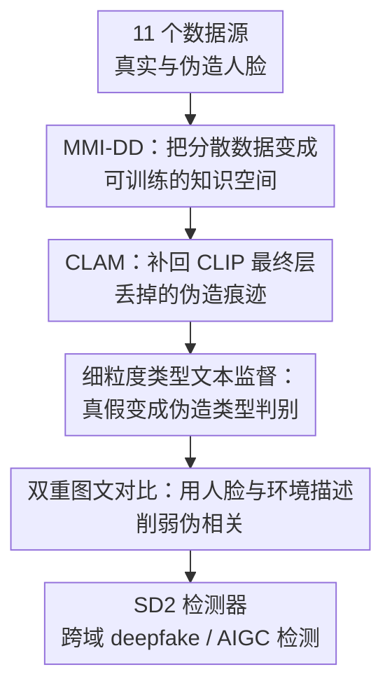

# A Rich Knowledge Space for Scalable Deepfake Detection

**会议**: ICLR2026  
**OpenReview**: [https://openreview.net/forum?id=hNd5L7WnjC](https://openreview.net/forum?id=hNd5L7WnjC)  
**代码**: 无公开代码  
**领域**: AIGC检测 / Deepfake检测  
**关键词**: 深度伪造检测, AIGC检测, CLIP微调, 多模态数据集, 跨域泛化

## 一句话总结
这篇论文把 11 个深度伪造与真实人脸数据源整合成 360 万图像规模的 MMI-DD 数据集，并提出 SD2 用 CLIP 的层级视觉特征、细粒度伪造类型文本标签和 VLM 生成描述联合训练，使 deepfake 检测器在大规模异构数据上不再越训越退化，而是获得更强的跨域与 AIGC 泛化能力。

## 研究背景与动机
**领域现状**：deepfake 检测长期依赖人脸取证数据集和专门设计的检测器。早期方法通常从空间伪影、频域异常、时序不一致或者重建误差中找线索；近年的方法开始借助 CLIP 这类视觉语言模型，把预训练视觉表征迁移到真实 / 伪造二分类或伪造类别识别上。

**现有痛点**：问题不在于这个领域没有数据，而在于数据彼此分散。FaceForensics++、DFDC、KoDF、DF40、DFFD 等 benchmark 往往被单独训练或单独评测，许多论文沿用“在一个源数据集训练、去另一个数据集测试”的范式。这样训练出的模型只见过有限的伪造算法、有限的人脸分布和有限的后处理方式，一旦遇到真实场景里混杂的来源、压缩、身份、背景和生成方式，泛化能力就容易崩。

**核心矛盾**：直觉上，更多数据应该带来更强 detector；但作者实际观察到，直接把 CLIP、CLIP-LoRA、CLIP-SVD 等适配方法放到越来越大的异构 deepfake 数据上训练，性能并不会稳定上升，甚至会退化。根本原因是大规模数据带来的是“更丰富的知识”和“更强的分布混乱”同时增加：如果监督信号仍是粗糙真假标签，模型很容易记住数据集特定伪影、背景偏差或文本标签之间的模糊边界。

**本文目标**：作者要解决三个子问题。第一，如何把已有 deepfake benchmark 统一成一个能真正用于大规模训练的资源，而不是只做零散评测。第二，如何让 CLIP 在检测中学习“哪类伪造”而不只是“真假”。第三，如何利用图文监督扩展伪造知识，同时避免模型把背景、光照、身份等非取证因素当成捷径。

**切入角度**：论文的观察是，deepfake 检测不应只是一个二分类问题，而应被看作一个包含伪造类型、面部属性、环境上下文和低层伪影的“知识空间”构建问题。CLIP 已经具备图文对齐能力，但原始 CLIP 的最终视觉层更偏语义，不一定保留细粒度伪造痕迹；文本端也需要比“a real/fake photo”更细的类别锚点。

**核心 idea**：用大规模多源多模态数据集 MMI-DD 提供丰富监督，再用 SD2 把 CLIP 改造成面向 deepfake 检测的可扩展图文学习器，让模型同时学会伪造类型边界、跨层视觉伪影和人脸 / 环境语义对齐。

## 方法详解

### 整体框架
本文的方法由两部分组成：先构建 MMI-DD，把 11 个数据源统一预处理成 360 万张人脸图像，并给每张图像标注真实或四类伪造类型；再训练 SD2，在 CLIP 图像编码器和文本编码器上使用 LoRA 微调，用 CLAM 融合中间视觉层，并同时优化分类、文本标签分离和双重图文对比目标。

最终测试时，模型不需要复杂后处理。给定一张图像，SD2 提取视觉表征，与 REAL、Face Swapping、Face Reenactment、Entire Face Synthesis、Face Editing 五类文本标签的嵌入计算相似度；如果 REAL 相似度最高则判为真，否则判为伪造，并可得到对应伪造类型。

### 关键设计
**1. MMI-DD：把分散数据变成可训练的知识空间**

作者首先做了一个数据层面的整合：把 DF40、DFF、DFFD、DFDCP、KoDF、FF++、TIMIT 等 deepfake 数据与 CelebA、CelebA-HQ、CelebV-HQ、FFHQ 等真实人脸数据放到统一流程里处理，得到约 153 万真实图像和 205 万伪造图像，总量约 358 万张。所有 deepfake 图像都经过一致的人脸裁剪与清理，目标是让模型看到尽可能宽的伪造来源，而不是在某个单一 benchmark 的局部规律上过拟合。

更重要的是，MMI-DD 不只给出 REAL / FAKE 二分类标签，而是把伪造细分为 Face Swapping、Face Reenactment、Entire Face Synthesis、Face Editing 四类。这个设计把 deepfake 检测从“看起来假不假”推进到“假在哪里、属于哪种生成机制”。对于 CLIP 这类图文模型，这等于给文本端提供了更具体的语义锚点，使图像表征可以围绕不同伪造类型形成更清晰的决策边界。

**2. CLAM：补回 CLIP 最终层丢掉的伪造痕迹**

CLIP 的最终视觉表示擅长表达语义，比如“这是一张人脸照片”，但 deepfake 检测需要的很多线索恰恰是低层或中层细节，例如局部纹理不连续、边缘融合痕迹、压缩后的伪影、面部区域和背景之间的不自然关系。只拿最后一层 `[CLS]` token 做分类，容易把这些细粒度取证信号洗掉。

CLAM 的做法是从 CLIP 图像编码器的每个 Transformer 层取出 `[CLS]` token，形成一个层级特征序列 $f_{cls}=[f_{cls}^{(1)}, f_{cls}^{(2)},...,f_{cls}^{(L)}]$，再用多头自注意力在不同层之间建模依赖关系。经过注意力后的序列被平均池化成 $f'_{sat}$，再与最终层表示 $f_{final}$ 拼接，通过轻量 adapter 得到最终视觉表示 $f$：

$$
f = W_2 \cdot GELU(W_1 \cdot Concat([f'_{sat}, f_{final}]))
$$

这个模块的价值在于，它不是粗暴地“多拿几层特征”，而是让模型自己选择哪些层的取证线索对当前目标更有用。对于大规模异构训练尤其重要，因为不同伪造类型留下的痕迹层级不同：换脸可能更依赖边界和身份一致性，整脸合成可能更依赖纹理和语义自然度，编辑类伪造可能只出现在局部区域。

**3. 细粒度类型文本监督：让检测从真假二分类变成伪造类型判别**

SD2 的分类损失不是传统线性头上的真实 / 伪造二分类，而是图像表征和类型文本表征之间的相似度分类。每个 batch 中，模型为 REAL、FS、FR、EFS、FE 各采样一条文本标签，例如 Face Swapping 不只有 “a photo of a Face Swapping”，还会有更丰富的自然语言描述。图像 $x_i$ 的表示 $f_i$ 与对应类型文本嵌入 $u_{c_i}$ 计算余弦相似度，并用交叉熵优化：

$$
L_C = -\sum_i \log \frac{\exp(\tau \cdot sim(f_i,u_{c_i}))}{\sum_j \exp(\tau \cdot sim(f_i,u_{c_j}))}
$$

但作者还发现一个细节：这些人工能区分的文本标签，在 CLIP 文本嵌入空间里未必天然分得开。如果 “face swapping” 和 “face reenactment” 的文本向量过近，图像端再努力也会被模糊的文本边界拖住。因此论文加入 Text Label Separation Loss，把类型文本嵌入之间的相似度矩阵推向单位矩阵：

$$
L_S = \|sim(u,u^T)-I\|_F^2
$$

这相当于先把分类器的“文字类别坐标系”拉开，再让图像去对齐这个坐标系。它解决的是大规模多类型训练里很实际的问题：类别名相近、语义边界细，直接拿 CLIP 原始文本空间未必稳定。

**4. 双重图文对比：用人脸与环境描述削弱伪相关**

MMI-DD 还为每张图像生成两类 VLM 描述：一类描述人脸属性，一类描述环境背景。直觉上，背景、年龄、光照这类信息不是伪造证据；但在真实数据中，它们可能和某些数据源强相关，模型很容易把“某个背景风格”误当成“某类伪造”。作者没有简单丢弃这些上下文，而是显式把它们纳入图文对比学习，让模型知道哪些语义因素存在，并在对齐过程中减少对 spurious correlation 的盲目依赖。

具体地，每张图像同时与自己的人脸描述 $d_i^f$ 和环境描述 $d_i^e$ 构成正样本对，batch 中其他描述作为负样本。作者采用 SigLIP 风格的 sigmoid 二元交叉熵对比损失，而不是标准 InfoNCE，因为后者通常需要极大 batch 才稳定。双重损失 $L_D$ 让图像表示既能对齐面部细节，也能对齐场景上下文；这听起来像是引入更多非取证信息，但实验显示，恰恰是这种显式建模帮助模型把“上下文是什么”和“伪造证据是什么”区分开。

### 一个完整示例
假设训练样本是一张来自 Face Swapping 数据源的伪造人脸图像。MMI-DD 首先给它一个类型标签 FS，同时用 VLM 生成两条文本描述：人脸描述可能写着“成年男性、正面表情、短发、面部光照均匀”，环境描述可能写着“室内背景、浅色墙面、画面略有压缩痕迹”。这些文本不是直接告诉模型“哪里是假”，而是把图像中可见的语义因素拆出来。

训练时，CLAM 从 CLIP 图像编码器的所有层收集 `[CLS]` token，保留早期纹理和边缘线索，也保留高层人脸语义。分类损失会把这张图像推向 FS 文本标签，远离 REAL、FR、EFS、FE；文本标签分离损失会继续保证 FS 与其他类型文本在嵌入空间里不要挤在一起；双重对比损失则要求图像和自己的人脸 / 环境描述相互匹配，同时不要匹配 batch 中其他图像的描述。

到测试阶段，如果模型看到一张从未见过来源的伪造视频帧，它不再只问“这是不是某个训练集常见的假图模式”。它会同时利用低层伪影、伪造类型文本边界，以及训练中形成的面部 / 环境语义空间来判断这张图像更接近 REAL 还是某类 fake。这就是论文标题里“rich knowledge space”的具体含义。

### 损失函数 / 训练策略
SD2 的总目标为：

$$
L_{SD2}=\alpha \cdot L_C + L_S + L_D
$$

其中 $L_C$ 是细粒度图文分类损失，$L_S$ 是文本标签分离损失，$L_D$ 是双重图文对比损失，论文最终采用 $\alpha=2.0$。训练 backbone 是 CLIP-ViT-L/14，图像编码器和文本编码器都用 LoRA 微调，LoRA rank 为 8，学习率 $5e^{-7}$，batch size 通过梯度累积达到 1024，训练 4 个 epoch。作者还沿用 deepfake 检测中常见的数据增强，包括旋转、等比例 resize、亮度 / 对比度变化和压缩扰动。

测试时使用每类最简单的文本标签计算五类 logits，不额外训练复杂分类头。这样的测试协议让 SD2 的输出保持在 CLIP 图文匹配框架内，也方便它把训练时学到的类型文本空间直接用于检测。

## 实验关键数据

### 主实验
论文的主实验分成三类：同域 facial deepfake 检测、跨域 facial deepfake 检测，以及非人脸 AIGC 图像检测。最关键的是跨域结果，因为它直接检验模型是否摆脱了单一数据源伪影。

| 任务 / 数据集 | 指标 | SD2 | 之前最强基线 | 提升 |
|--------|------|------|----------|------|
| 同域 facial deepfake，11 个子集平均 | mAUC | 95.76 | SPSL 94.58 | +1.18 |
| 跨域 facial deepfake，UADFV / WildDeepFake / DFDC / DF40-Test 平均 | mAUC | 87.79 | CLIP-SVD 81.98 | +5.81 |
| GenImage 跨生成模型 AIGC 检测 | mACC | 88.50 | AIDE 86.88 | +1.62 |

| 跨域数据集 | 指标 | SD2 | CLIP-SVD | 观察 |
|--------|------|------|----------|------|
| UADFV | AUC | 96.44 | 95.47 | 小幅领先，说明传统 deepfake 视频帧上仍稳定 |
| WildDeepFake | AUC | 82.80 | 75.89 | 真实野外分布提升明显 |
| DFDC | AUC | 80.36 | 69.57 | 对复杂真实场景数据更鲁棒 |
| DF40-Test FE | AUC | 74.06 | 60.60 | 局部编辑类伪造提升最大之一 |
| DF40-Test 总体平均 | mAUC | 87.79 | 81.98 | 证明多模态训练改善跨域泛化 |

### 消融实验
| 配置 | 关键指标 | 说明 |
|------|---------|------|
| 仅分类损失 $L_C$ + 文本分离 $L_S$ | 80.24 mAUC | 已经超过不少传统 baseline，说明类型文本监督本身有效 |
| 加入 CLAM | 81.84 mAUC | 跨层视觉特征带来 +1.60，证明中间层伪影有价值 |
| 再加入人脸描述对比 $L_D$-Face | 84.34 mAUC | 面部语义描述提供更强泛化监督 |
| 同时加入人脸与环境描述对比 | 87.79 mAUC | 完整模型最佳，环境描述不是噪声，而是帮助识别并削弱上下文捷径 |

| 训练数据规模 | Xception | CLIP-LoRA | CLIP-SVD | SD2 |
|------|---------|-----------|----------|-----|
| 100K | 71.11 | 78.84 | 82.27 | 82.90 |
| 1M | 71.69 | 78.40 | 82.00 | 84.85 |
| 3M | 72.96 | 72.12 | 81.98 | 87.79 |

### 关键发现
- 最有说服力的发现是“规模曲线”：普通 CLIP-LoRA 从 100K 到 3M 反而从 78.84 掉到 72.12，而 SD2 从 82.90 稳定升到 87.79，说明本文解决的不是单纯模型容量问题，而是大规模异构监督如何被吸收的问题。
- CLAM 的提升幅度不如双重对比损失大，但它补的是 deepfake 检测的底层信号短板；如果只靠最终语义层，模型容易忽略局部伪影。
- 环境描述的作用有些反直觉。它并不是让模型根据背景判断真假，而是让模型在训练中显式看见背景因素，从而减少把背景当伪造证据的风险。
- 在 GenImage 上，SD2 只用视觉编码器做线性探测仍超过 AIDE，说明从人脸 deepfake 学到的取证知识有一定外溢能力，可以迁移到更一般的合成图像检测。

## 亮点与洞察
- **数据整合本身就是核心贡献**：MMI-DD 不只是把图片堆大，而是统一了真实 / 四类伪造标签和 VLM 描述。这个资源让研究者可以真正讨论“detector 是否能随数据规模变强”。
- **论文抓住了 CLIP 迁移的失败模式**：作者没有假设 foundation model 天然可扩展，而是先展示 CLIP 适配方法在大数据下会饱和或退化，再针对这个失败模式设计监督目标。
- **文本标签分离是一个小但关键的稳定器**：很多图文分类方法默认文本 prompt 足够分离，但在细粒度 deepfake 类型上并不成立。显式拉开文本类别空间，是一个可迁移到细粒度多模态分类的 trick。
- **环境描述的使用方式值得借鉴**：与其删掉所有可能 spurious 的上下文，不如把上下文显式建模，让模型知道它们是什么。这对医疗影像、遥感伪造检测、跨设备图像取证等任务也可能有启发。
- **AIGC 检测可以从人脸取证中迁移知识**：GenImage 结果说明，人脸 deepfake 训练出的视觉编码器并不只会看人脸，它可能学到了一类关于合成痕迹、纹理统计和生成分布的通用表征。

## 局限与展望
- MMI-DD 仍以人脸图像为中心，虽然在 GenImage 上验证了非人脸迁移，但训练数据本身并没有覆盖更广泛的文本生成图像、视频生成、3D 合成或多模态伪造场景。
- 论文主要讨论图像级检测，对视频级时序不一致、音视频同步、跨帧身份漂移等 deepfake 信号没有展开。面对更强的视频生成模型时，单帧视觉语言知识空间可能还不够。
- VLM 生成描述的质量虽然经过抽样审计，但大规模自动描述仍可能带有模型偏见、幻觉或遗漏。特别是环境描述如果错误，可能会给对比学习引入噪声。
- SD2 的训练成本不低：360 万图像、CLIP-ViT-L/14、双编码器 LoRA、8 张 RTX 3090，对于普通实验室复现仍有门槛。
- 后续可以把 MMI-DD 扩展为跨模态伪造知识库，例如加入音频、视频片段、生成模型来源、压缩链路、社交平台再编码信息，让 detector 从“图像真伪”进一步走向“内容来源与传播链路取证”。

## 相关工作与启发
- **vs Xception / SPSL / RECCE**: 这些方法分别依赖 CNN 空间特征、频域相位线索或重建式伪影追踪，优势是结构明确、训练成本相对可控；SD2 的区别是把检测问题放进 CLIP 图文空间，并利用多源数据和文本监督学习更宽的伪造知识。
- **vs CLIP-LoRA**: CLIP-LoRA 说明参数高效微调本身不够。在数据规模从 100K 增加到 3M 时，CLIP-LoRA 性能下降，说明没有合适的任务监督时，更多异构数据会带来更强混乱。
- **vs CLIP-SVD / Effort**: CLIP-SVD 试图在适配 deepfake 检测时保留预训练知识，表现强于普通 CLIP 适配；SD2 的优势在于进一步引入类型文本、层级视觉伪影和 VLM 描述，使模型不仅保留知识，还能组织新的检测知识。
- **vs UnivFD / AIDE**: 这些方法关注通用 AI 生成图像检测，通常从 CLIP 表征或局部伪影增强入手；SD2 虽从人脸 deepfake 出发，但在 GenImage 上表现更好，提示“多类型取证监督 + 图文对齐”可能比单纯检测某个生成器痕迹更可扩展。
- **启发**: 这篇论文适合被看作 deepfake 检测的数据中心化路线：当生成模型越来越多、伪造类型越来越杂，关键不只是发明一个更敏感的伪影模块，而是构建能承载多类伪造知识的训练空间。

## 评分
- 新颖性: ⭐⭐⭐⭐☆ 数据集整合、类型文本监督和双重描述对比的组合很完整，单个模块不算激进，但问题定义抓得准。
- 实验充分度: ⭐⭐⭐⭐⭐ 覆盖同域、跨域、规模曲线、消融、超参和 GenImage 迁移，证据链比较扎实。
- 写作质量: ⭐⭐⭐⭐☆ 主线清楚，图表有说服力；但数据构建细节很多放在附录，读者需要来回查。
- 价值: ⭐⭐⭐⭐⭐ 对 deepfake/AIGC 检测很有实际价值，尤其是证明了“更多数据需要更合适的监督结构”这一点。

<!-- RELATED:START -->

## 相关论文

- [\[CVPR 2026\] Investigating Self-Supervised Representations for Audio-Visual Deepfake Detection](../../CVPR2026/aigc_detection/investigating_self-supervised_representations_for_audio-visual_deepfake_detectio.md)
- [\[ICLR 2026\] RelayFormer: A Unified Local-Global Attention Framework for Scalable Image and Video Manipulation Localization](relayformer_a_unified_local-global_attention_framework_for_scalable_image_and_vi.md)
- [\[CVPR 2026\] Inconsistency-aware Multimodal Schrodinger Bridge for Deepfake Localization](../../CVPR2026/aigc_detection/inconsistency-aware_multimodal_schrodinger_bridge_for_deepfake_localization.md)
- [\[CVPR 2026\] NOWA: Null-space Optical Watermark for Invisible Capture Fingerprinting and Tamper Localization](../../CVPR2026/aigc_detection/nowa_null-space_optical_watermark_for_invisible_capture_fingerprinting_and_tampe.md)
- [\[ICLR 2026\] Beyond Raw Detection Scores: Markov-Informed Calibration for Boosting Machine-Generated Text Detection](beyond_raw_detection_scores_markov-informed_calibration_for_boosting_machine-gen.md)

<!-- RELATED:END -->
