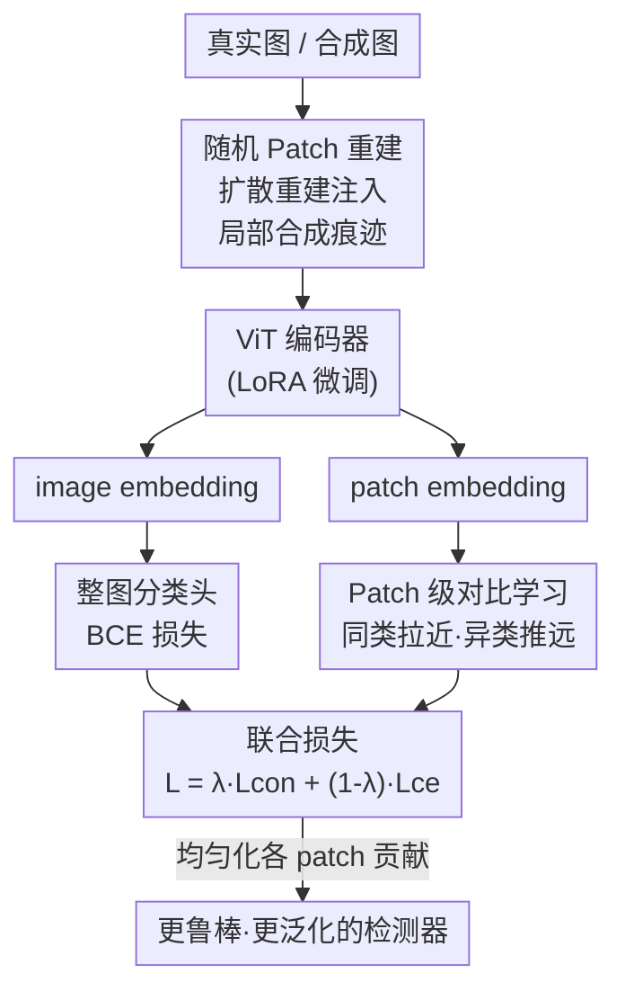

# All Patches Matter, More Patches Better: Enhance AI-Generated Image Detection via Panoptic Patch Learning

**会议**: ICLR2026  
**OpenReview**: [https://openreview.net/forum?id=ob7PJs8kPU](https://openreview.net/forum?id=ob7PJs8kPU)  
**代码**: 待确认  
**领域**: AIGC 检测 / AI 生成图像鉴别  
**关键词**: AIGI 检测, Patch 级学习, 对比学习, 扩散重建, 泛化性

## 一句话总结
本文提出"所有 patch 都重要、用得越多越好（All Patches Matter, More Patches Better）"的检测原则，发现现有 AI 生成图像（AIGI）检测器存在"少数 patch 偏置（Few-Patch Bias）"——只盯着极少数 patch 做判断；据此设计 Panoptic Patch Learning（PPL）框架，用随机 patch 重建 + patch 级对比学习把判别能力摊平到全图所有 patch，在 GenImage、DRCT-2M、AIGCDetectBenchmark 和真实场景 Chameleon 上都把跨生成器泛化性和鲁棒性显著刷高（CLIP backbone 在 GenImage 上 mAcc 97.2%、std 仅 1.7）。

## 研究背景与动机
**领域现状**：AI 生成图像检测是一个典型的"猫鼠游戏"——生成模型架构不断涌现、已有模型频繁更新，不可能把所有合成数据都拿来训练，因此检测器必须有强泛化性，能在没见过的生成器上仍然判得准。当前主流做法分两条线：局部方法（patch-wise / pixel-wise，假设真假图在低层特征上有差异）和全局方法（如用 CLIP 视觉编码器提整图特征的 UnivFD、加频率适配器的 FatFormer、用对比损失强化难例的 DRCT）。

**现有痛点**：AIGI 有一个传统分类任务没有的特殊性质——**伪影的普遍分布（Universal Artifact Distribution）**。因为整张合成图是由生成模型按统一流程一次性生成的，所以判别性特征不像物体识别那样集中在前景目标上，而是**均匀地散落在每一个 patch 里**。也就是说，每个 patch 都带着合成痕迹、都是有价值的检测线索（作者把单个 patch 复制铺满全图去测，在 GenImage 的 SDv1.4 子集上仍能拿到 90% 准确率）。但现有检测器并没有用好这个性质。

**核心矛盾**：作者用反事实分析揭露了一个普遍存在的毛病——**Few-Patch Bias（少数 patch 偏置）**。三条证据：(1) 朴素训练的 ViT 注意力图高度集中在极少数 patch 上，换 backbone、上 LoRA 都改不掉，说明这是模型无关的系统性偏置；(2) 检测器对特定 patch 极度脆弱，遮掉单个 patch 平均掉 18.7%±4.1% 的准确率；(3) 用因果推断工具 CDE（Controlled Direct Effect）量化每个 patch 的贡献，发现分布严重倾斜——少数 patch 的 CDE 很高、大多数 patch 贡献极低，明明它们也含伪影却被闲置。根因被归结为**"懒惰学习者（Lazy Learner）"效应**：一旦某些 patch 里有"好学"的伪影能快速把 loss 压下去，模型就抄近路只用这几个 patch，不去探索更广的区域。

**本文目标**：把检测器从"只盯几个 patch"逼成"均匀利用全图所有 patch"，从而堵住盲点、提升跨生成器泛化。这要解决两个子问题——(1) 怎么打掉模型对少数主导 patch 的依赖；(2) 怎么让所有 patch（无论原来受不受关注）都具备一致的判别能力。

**切入角度**：既然伪影本就遍布全图，那阻止"抄近路"的办法就是主动制造一种局面——让模型无法靠固定的几个 patch 蒙混过关，并在表示空间里把所有同类 patch 拉到一起，使判别能力被"摊平"。

**核心 idea**：用"随机 patch 重建（RPR）"把合成痕迹随机注入到真实图的若干 patch 里，强迫模型对随机区域都能判别；再用"patch 级对比学习（PCL）"对齐同标签 patch 的表示，让全图 patch 的判别贡献趋于均匀。

## 方法详解

### 整体框架
Panoptic Patch Learning（PPL）把"All Patches Matter, More Patches Better"两条原则同时落到**数据策略**和**学习策略**两个层面上。整体流程是：训练时，对一部分真实图执行 **Randomized Patch Reconstruction（RPR）**——通过扩散重建把合成痕迹注入随机选中的 patch，得到"只有局部含伪影"的训练样本，迫使模型不能只盯固定区域；同时主干 ViT 编码器输出 image-level 和 patch-level 两套 embedding，image embedding 走线性头做整图真假分类（BCE 损失），patch embedding 走 **Patch-wise Contrastive Learning（PCL）**——按 patch 级标签把同类 patch 在特征空间里拉近、异类推远，使"主导 patch"被稀释、判别能力扩散到非主导 patch。两个分支的损失加权求和联合优化。直观效果（论文 Fig. 5）是：随训练推进，旧的主导 patch 被"挤出去"，新主导 patch 不断出现，CDE 分布越来越均匀。

### 关键设计

**1. 检测原则与 Few-Patch Bias 诊断：用 CDE 量出"被闲置的 patch"**

这一步是整篇论文的根基，它把"应该怎么做"先论证清楚。原则有两半：**All Patches Matter**——每个 patch 都由生成器生成、都含伪影，单 patch 都足以判别（复制单 patch 铺满全图仍有 90% 准确率）；**More Patches Better**——用更多 patch 能捕捉互补的伪影模式、减少对特定区域的过度依赖，从而提升跨生成器泛化。为了证明现有检测器违背了这条原则，作者引入因果推断里的 **Controlled Direct Effect（CDE）** 来量化每个 patch 的因果贡献。对位于第 $i$ 行第 $j$ 列的 patch，其 CDE 定义为遮掉该 patch 前后分类 logit 之差：

$$\text{CDE} := \delta_{I} - \delta_{I-(i,j)}, \qquad \delta := \text{logit}_{\text{synth}} - \text{logit}_{\text{real}}$$

其中 $I$ 是原图，$I-(i,j)$ 是把第 $(i,j)$ 个 patch 置零后的图。逐 patch 算 CDE 画成热力图后能清楚看到：弱检测器（如 UnivFD）只有零星几个高 CDE patch、其余几乎不贡献；强检测器（如 DRCT）激活的 patch 更多、CDE 分布更均匀——这直接坐实了"CDE 分布越均匀、泛化越强"，也把后续两个模块的优化目标锚定为"把 CDE 分布摊平"。

**2. Randomized Patch Reconstruction（RPR）：用扩散重建把合成痕迹随机种进真实图**

RPR 直接针对"懒惰学习者只盯主导 patch"的痛点。做法是：先对整张真实图做一次扩散重建（用 SDv1.4 inpainting，生成强度 $s=0.25$、50 步、guidance scale 7.5）得到一张"重建版"；再从原真实图里随机选出比例为 $r_{rpr}$ 的 patch，用对应位置的重建结果替换掉，得到一张"只有被选 patch 含合成痕迹、整体语义保持不变"的合成样本。每张原始训练里的 fake 图有 $p_{rpr}=0.9$ 的概率被替换成 RPR 图，默认 $r_{rpr}=50\%$、重建 patch 尺寸 $14\times14$（与 ViT patch 对齐）。

这里有个关键的设计取舍：**为什么用扩散重建而不是直接把现成合成 patch 缝进去？** 因为直接拼贴会破坏全局语义、产生"语义割裂"的图，模型容易过拟合到这种不自然的拼接痕迹上；而扩散重建出的图和原图高度相似，只在局部注入了真实的合成纹理，既保住了全局语义连贯，又把"合成痕迹"种到了随机位置。由于被注入的 patch 是随机的、且会变，模型没法再靠固定几个 patch 抄近路，只能学会在任意区域识别伪影——这正是"More Patches Better"的可操作化。消融也证实：扩散重建作为注入机制明显优于随机替换原始合成 patch。

**3. Patch-wise Contrastive Learning（PCL）：把判别能力摊平到所有 patch**

PCL 落实"All Patches Matter"。它对 ViT 输出的 patch embedding 施加 patch 级对比，让同标签 patch（都真或都假）在特征空间里聚拢、不同标签 patch 被一个 margin 推开。用的是基于 margin 的对比损失：

$$L_{con} = \sum_{i,j:\,i\neq j}\Big[\, Y\cdot d^{2} + (1-Y)\cdot \max\big(0,\ \alpha - d^{2}\big)\,\Big]$$

其中 $i,j$ 是一个 batch 内 patch token 的索引，$d$ 是两个 patch embedding 间的欧氏距离，$\alpha$ 是负样本对的最小间隔阈值，$Y$ 标记两个 patch 是否同标签（同则拉近、异则推远）。这样做的效果是：哪怕图里存在某个"含好学伪影"的主导 patch，对比损失也会把其余合成 patch 往同一簇里拽，从而把它们的判别能力一并拉起来，迫使模型对所有 patch 都给出一致的判别响应，进而稀释少数主导 patch 的支配地位。总损失是整图交叉熵与 patch 级对比损失的加权组合：

$$L_{total} = \lambda L_{con} + (1-\lambda) L_{ce}$$

默认 $\lambda=0.3$、margin $\alpha=1.0$。注意 patch 级标签 $\text{patch}_{gt}$ 是天然可得的——因为 RPR 明确知道哪些 patch 被重建注入了合成痕迹、哪些仍是真实的，这让 patch 级监督不需要额外标注。

### 损失函数 / 训练策略
主干用 CLIP 与 DINOv2 两个视觉基础模型，均以 LoRA 微调。训练时随机裁剪到 $224\times224$，测试时中心裁剪到同尺寸。整体优化目标即上式 $L_{total} = \lambda L_{con} + (1-\lambda) L_{ce}$，$L_{ce}$ 是 image-level 的 BCE 分类损失、$L_{con}$ 是 patch-level 对比损失。训练伪代码（论文 Alg. 1）：ViT 编码器输出 image/patch 两套 embedding → 线性头出整图 logit 算 BCE → patch embedding 配 patch 级标签算对比损失 → 两者按 $\lambda$ 加权后反传。

## 实验关键数据

### 主实验
跨生成器泛化是核心评测：所有方法均在 GenImage 的 SDv1.4 子集上训练，测其余生成器上的准确率。

| 数据集 / 设置 | 指标 | 本文 (CLIP) | 本文 (DINOv2) | 之前最好 | 提升 |
|--------|------|------|------|----------|------|
| GenImage 跨模型 | mAcc | **97.2 ± 1.7** | 95.9 ± 3.0 | C2P-CLIP 95.8 ± 4.0 | +1.4，std 大幅收窄 |
| DRCT-2M 跨模型 | mAcc | **99.50 ± 0.1** | 99.06 ± 0.1 | DRCT 91.35 ± 4.7 | +8.15，std 47×↓ |
| AIGCDetectBenchmark | mAcc | 93.36 ± 6.3 | **94.41 ± 4.2** | AIDE 92.77 ± 7.7 | 仅用扩散数据训练仍超越在 GAN 上训练的基线 |
| Chameleon（真实野外） | Acc | 69.33 | **72.07** | AIDE 65.77 | +6.3，多数基线只略高于 50% 随机 |

几个关键点：(1) PPL 不只是平均准确率高，**标准差显著更小**（GenImage 上 CLIP 版 std 仅 1.7，DRCT-2M 上 0.1），说明它对不同生成器的判别稳定，没有明显短板；(2) 跨架构泛化极强——只在扩散生成数据上训练，却能检测 GAN 生成图，甚至超过直接在 GAN 数据上训练的基线；(3) 在真实世界采集的 Chameleon 上，绝大多数现有方法几乎接近随机猜测，而 PPL 是少数能上 70% 的方法。

### 消融实验

| 配置 | 结论 | 说明 |
|------|---------|------|
| 完整 PPL（RPR + PCL） | 最佳 | 两个模块组合提升远大于单独使用 |
| 仅 RPR / 仅 PCL | 均有提升但弱于组合 | 各自有效、互补 |
| 注入方式：扩散重建 vs 随机替换合成 patch | 扩散重建更优 | 验证"保全局语义"的设计取舍 |
| $\lambda$（对比损失权重） | $\lambda=0.3$ 峰值 | 太大太小都掉点 |
| $p_{rpr}$（替换概率） | 相对鲁棒 | 对该超参不敏感 |
| $r_{rpr}$（重建 patch 比例） | $\approx 50\%$ 最佳 | 比例过高反而掉点，说明不是"重建越多越好" |
| $s$（重建强度） | 越小越好 | 小 $s$ 既提精度又省算力 |

### 关键发现
- **RPR 与 PCL 强互补**：单用任一个都有效，但组合后提升"显著更强"，说明"制造分散伪影（数据侧）"和"摊平判别能力（学习侧）"是一对配合，而非冗余。
- **不是"重建越多越好"**：$r_{rpr}$ 在 50% 左右最优、过高反而掉点——若几乎所有 patch 都被注入合成痕迹，反而破坏了"真假 patch 共存、需要逐 patch 判别"的学习信号。
- **鲁棒性扎实**：在 JPEG 压缩（Q 低至 60）、强高斯模糊、缩放等常见退化下，CLIP 和 DINOv2 backbone 都能维持高准确率。
- **CDE 均匀性 ↔ 泛化性**正相关贯穿全文：从诊断（DRCT 比 UnivFD 高 CDE patch 更多、泛化更好）到方法目标（把 CDE 摊平）再到结果（PPL 注意力/CDE 分布最均匀、泛化最好），形成自洽闭环。

## 亮点与洞察
- **用因果工具 CDE 把"哪些 patch 真正在起作用"量化出来**：这比单看注意力图更硬核——注意力高不代表因果贡献大，而 CDE 通过"遮掉前后 logit 差"直接度量因果效应，把"Few-Patch Bias"从定性观察升级成可测量、可优化的目标。这个分析范式可迁移到任何"判别线索分布"问题。
- **把"懒惰学习者"问题转成数据增强 + 表示对齐的组合拳**：RPR 在数据侧主动制造"线索随机散落"的局面、PCL 在表示侧把判别能力扯平，两手都指向同一个"摊平 CDE"目标，思路干净。
- **"用扩散重建而非拼贴注入合成痕迹"是个可复用的 trick**：保全局语义、避免模型过拟合到拼接边界，这一取舍对任何需要"局部注入特定特征又不想破坏整体"的增强任务都有借鉴价值。
- **patch 级标签零成本**：因为 RPR 自己知道注入了哪些 patch，patch-level 监督天然可得，省掉了对比学习常见的标注/采样难题。

## 局限与展望
- **强依赖扩散重建**：RPR 必须靠扩散 inpainting 注入合成痕迹，因此训练流程绑定了一个扩散模型；论文中 AIGCDetectBenchmark 也因此只能在 GenImage SDv1.4 上训练，而非更 in-distribution 的 ProGAN 数据（虽然结果反而更强，但说明方法对训练数据形态有约束）。
- **超参敏感性不一致**：对 $r_{rpr}$ 较敏感（过高掉点），需要按数据调；好在对 $p_{rpr}$ 鲁棒、$s$ 偏小即可，整体可调性尚可。
- **"全图均匀生成"假设的边界**：方法立论于"整张图由 AI 生成、伪影均匀分布"这一主流设定（论文脚注明确）。对**局部编辑 / 部分合成（如换脸、局部 inpainting）** 的图，"All Patches Matter"未必成立，此时把判别能力强行摊平到所有 patch 可能反而稀释真正含痕迹的区域——这是一个值得验证的适用范围边界。
- **改进思路**：可探索自适应的 $r_{rpr}$（按图/按训练阶段动态调）、不依赖特定扩散模型的痕迹注入方式，以及把 CDE 直接做成可微的训练正则项而非仅作分析工具。

## 相关工作与启发
- **vs 局部 patch-wise 方法（SSP / PatchCraft / Breaking / TextureCrop）**：它们或只用单 patch（SSP）、或按熵/高频纹理**挑选**特定 patch，本质上仍在"选 patch"，作者指出这正是 Few-Patch Bias 的来源（信息利用不足）。PPL 反其道——不挑 patch，而是逼模型均匀用上所有 patch。
- **vs 全局方法（UnivFD / FatFormer / C2P-CLIP / DRCT）**：全局法用整图特征（CLIP 编码、频率适配、图文对、难例对比），优点是整体性强，但容易忽略细粒度局部伪影。PPL 在 CLIP/DINOv2 主干上叠加 patch 级监督，相当于把"全局表示"和"逐 patch 判别"结合起来；其中 DRCT 也用对比损失，但作用在难例图像级，PPL 的对比作用在 **patch 级**、目标是均匀化 patch 贡献，粒度和动机都不同。
- **vs pixel-wise 方法（NPR / FreqNet / SAFE）**：它们靠邻域像素关系或高频信号捕局部模式，但对小扰动敏感、鲁棒性受限；PPL 在退化鲁棒性实验里明显更稳。
- **启发**：把"模型抄近路只用少数线索"这一普遍问题，用因果度量诊断 + 数据增强制造分散线索 + 表示对齐摊平贡献的三段式范式，可迁移到伪造视频检测、医学图像异常检测、多示例学习等"判别线索分布不均"的任务。

## 评分
- 新颖性: ⭐⭐⭐⭐⭐ 用 CDE 因果度量诊断 Few-Patch Bias、并据此设计 RPR+PCL，原则清晰、方法自洽
- 实验充分度: ⭐⭐⭐⭐⭐ 4 大基准 + 真实野外 Chameleon + 鲁棒性 + 充分消融，跨生成器/跨架构泛化都验到位
- 写作质量: ⭐⭐⭐⭐⭐ "原则→诊断→方法→验证"主线贯穿，CDE 把动机量化得很扎实
- 价值: ⭐⭐⭐⭐ 显著刷高 AIGI 检测泛化与稳定性，trick 可复用；受"整图均匀生成"假设约束、对局部编辑图适用性待验

<!-- RELATED:START -->

## 相关论文

- [\[ICLR 2026\] FakeXplain: AI-Generated Image Detection via Human-Aligned Grounded Reasoning](fakexplain_ai-generated_image_detection_via_human-aligned_grounded_reasoning.md)
- [\[ICLR 2026\] Unveiling Perceptual Artifacts: A Fine-Grained Benchmark for Interpretable AI-Generated Image Detection](unveiling_perceptual_artifacts_a_fine-grained_benchmark_for_interpretable_ai-gen.md)
- [\[ICML 2026\] Dissect and Prune: Enhancing Robustness in AI-Generated Image Detection](../../ICML2026/aigc_detection/dissect_and_prune_enhancing_robustness_in_ai-generated_image_detection.md)
- [\[CVPR 2026\] Enabling Supervised Learning of Generative Signatures for Generalized AI-Generated Images Detection](../../CVPR2026/aigc_detection/enabling_supervised_learning_of_generative_signatures_for_generalized_ai-generat.md)
- [\[CVPR 2026\] PPM-CLIP: Probabilistic Prompt Modeling for Generalizable AI-Generated Image Detection](../../CVPR2026/aigc_detection/ppm-clip_probabilistic_prompt_modeling_for_generalizable_ai-generated_image_dete.md)

<!-- RELATED:END -->
