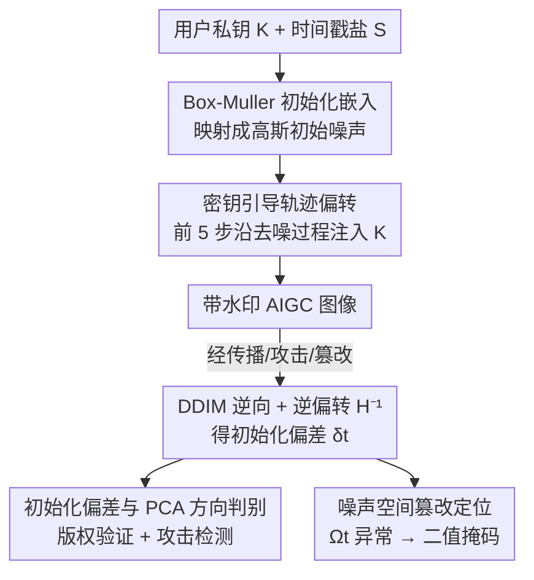

# Attack-Resistant Watermarking for AIGC Image Forensics via Diffusion-based Semantic Deflection

**会议**: ICLR 2026  
**OpenReview**: [https://openreview.net/forum?id=wyucYNGPiW](https://openreview.net/forum?id=wyucYNGPiW)  
**代码**: https://github.com/QingyuLiu/PAI  
**领域**: AIGC检测 / 数字水印 / 扩散模型取证  
**关键词**: 固有水印, 扩散模型, 版权取证, 篡改定位, DDIM 逆向

## 一句话总结
本文提出 PAI——一个免训练、即插即用的扩散模型固有水印框架，通过"初始化嵌入 + 密钥引导的去噪轨迹偏转"把用户身份和图像内容深度语义纠缠，再用 DDIM 逆向得到的"初始化偏差"作为统一取证信号，一举支撑版权验证、攻击检测与语义级篡改定位三件事，在 12 种攻击下平均验证准确率达 98.43%，比 SOTA 高 37.25%。

## 研究背景与动机
**领域现状**：随着扩散模型生成的 AIGC 图像泛滥，给用户生成的图像保护版权与溯源成为刚需。水印分两类：嵌入式水印（embedded）在生成后用编码-解码网络或频域变换注入信号，固有式水印（inherent）把水印直接揉进生成过程（如 Tree-Ring、Gaussian Shading 把水印写进扩散初始噪声）。固有式因为身份与内容语义耦合、无需额外训练，被认为是更实用的方向。

**现有痛点**：现实中的对手手段远比常见退化（压缩、模糊）凶猛——**移除攻击**（removal）擦掉所有权证据、**伪造攻击**（spoofing）伪造虚假归属、**局部篡改攻击**（如换脸）在保持外观真实的同时恶意改写语义。现有方案有两个硬伤：其一，它们用一维的标量判据（解码出的比特数、单一阈值）判定所有权，移除会把分数压到阈值之下、伪造会把分数顶到阈值之上，调阈值防住一头就漏掉另一头，形成**移除与伪造无法兼得的 trade-off**；其二，大多只能做二元的"是否有水印"，缺乏取证能力，更要命的是面对 Gemini 2.0 Flash 这类能在保持全局外观的同时做语义级编辑的工具，基于像素的篡改定位（如 EditGuard）直接失效。

**核心矛盾**：水印鲁棒性的根源在于水印信号与内容语义的耦合强度，但既有固有式方法只在**初始化噪声**这一个点注入，耦合还不够深；同时把对抗行为坍缩成一个标量，丢掉了区分不同攻击所需的方向信息。

**本文目标**：造一个免训练、即插即用的框架，同时做到 (1) 高置信度、绑定私钥的版权验证；(2) 抵抗移除/伪造/篡改/自适应等真实攻击；(3) 语义级篡改定位。

**切入角度**：作者的关键观察是——水印鲁棒性随着"水印信号与生成内容的语义耦合"增强而提升。既然只在初始噪声注入耦合不够，那就把密钥进一步注入到**去噪轨迹**里，让身份信号沿着生成过程逐步累积、和内容语义纠缠得更深。

**核心 idea**：用"密钥引导的轨迹偏转"代替"只在初始噪声埋点"，并把 DDIM 逆向产生的**初始化偏差**当成一个统一信号——它的大小判真伪、它在 PCA 子空间的方向分移除/伪造、它的空间异常定位篡改区域。

## 方法详解

### 整体框架
PAI 部署在服务商一侧，分"带水印生成"和"水印溯源"两段。**生成段**：把用户私钥 $K$ 和时间戳盐 $S$ 经 Box-Muller 变换嵌入到扩散模型的初始高斯噪声，再在去噪的前几步用密钥做轨迹偏转，输出一张肉眼无异、但身份与内容深度纠缠的带水印图像。**溯源段**：拿到一张待验证图像，用带逆偏转的 DDIM 逆向把它映回噪声空间，与理论初始噪声 $F(K,S)$ 相减得到**初始化偏差 $\delta_t$**；这一个信号同时驱动三个取证任务——按大小做版权验证、按 PCA 方向区分移除与伪造、按空间异常定位篡改区域。整个方案免训练，完全嵌进扩散采样框架，不需要任何额外编解码器。

### 关键设计

**1. Box-Muller 初始化嵌入：在不破坏高斯先验的前提下把身份塞进初始噪声**

扩散采样要求起点是标准高斯噪声 $x_t\sim N(0,1)$，可如果直接把密钥写进噪声，分布一旦偏离高斯，采样质量和多样性都会崩。作者用 Box-Muller 变换把均匀变量映成高斯变量来解决这个矛盾：定义初始化函数
$$x_t^{wm}=F(K,S)=\sqrt{-2\ln S}\cdot\cos\big(2\pi\cdot\Phi(K)\big),$$
其中 $K\sim N(0,1)$，$S\sim U(0,1)$，$\Phi(\cdot)$ 是把 $K$ 转成 $\Phi(K)\sim U(0,1)$ 的累积分布函数。由于 $\Phi(K)$ 与 $S$ 独立且都均匀分布，Box-Muller 保证 $x_t^{wm}$ 严格服从 $N(0,1)$。这里 $K$ 提供**可验证性**（身份的唯一凭证），时间戳盐 $S$ 以生成时刻为种子、存在图像元数据里，提供**多样性**——它给确定性采样器引入随机性，避免固定 prompt 下输出雷同；而且改 $S$ 不影响版权验证（验证锚定的是私钥 $K$）。

**2. 密钥引导的轨迹偏转：让身份信号沿去噪过程累积，与内容深度纠缠**

只在初始噪声埋点的旧方法，水印和内容的耦合太浅，逆向攻击容易剥离。本文的核心创新是在采样过程中做**渐进式注入**：把每一步预测的 $\hat{x}_0$ 替换成偏转函数 $H(K,x_t^{wm},t)$：
$$x_{t-1}^{wm}=\sqrt{\bar\alpha_{t-1}}\cdot H(K,x_t^{wm},t)+\sqrt{1-\bar\alpha_{t-1}}\cdot\epsilon_\theta(x_t^{wm},t),$$
其中 $H(K,x_t^{wm},t)=(\gamma K+1)\cdot\hat{x}_0$，括号里的 $(\gamma K+1)$ 是**偏转系数**，$\hat{x}_0$ 是当前步预测的目标图像。每一步用 $K$ 给轨迹施加一个微小偏转，逐步累积成语义连贯的水印；$\gamma$ 控制偏转强度。为兼顾画质与鲁棒性，作者取 $t=50$、只在**前 5 步**施加偏转、$\gamma=0.1$。这种"轨迹级耦合"把身份和内容纠缠到生成过程内部，使得任何密钥不匹配在逆向时都会产生**结构化偏差**，因而天然抗逆向攻击和高级语义攻击——攻击者想还原过程，必须先有正确的密钥才能重建初始状态。

**3. 初始化偏差与 PCA 方向判别：一个信号既判真伪又分清移除与伪造**

验证就是生成的逆过程：给定密钥 $K$，先用带逆偏转的 DDIM 逆向 $H^{-1}$ 把图像映回噪声空间得到 $\hat{x}_t^{wm}$，再用 $F(K,S)$ 重建理论初始点，二者之差即**初始化偏差** $\delta_t=\hat{x}_t^{wm}-F(K,S)$。**普通验证**用它的二阶矩做单边假设检验：$E[|\delta_t|^2]=\|\hat{x}_t^{wm}-F(K,S)\|^2<\tau_{vanilla}$，阈值由"无效密钥偏差近似高斯"假设和显著性水平 $\alpha$ 决定。作者还给出**密钥唯一性定理**（理想无建模误差下证明，实证补足）：当伪造密钥 $K_w$ 无限逼近有效密钥 $K_c$ 时，仍有 $\lim_{K_w\to K_c}E[|\delta_t^c|^2]<E[|\delta_t^w|^2]$——有效密钥只累积逆向过程的内禀时间误差，无效密钥还额外引入一个来自初始化不匹配的基线差，因此偏差不可能更小，连白盒梯度优化伪造密钥都无法把偏差压到阈值之下。

更巧的是**鲁棒验证**：移除和伪造虽然偏差幅度可能相近（标量分不开），但它们在高维潜空间里方向**相反**——移除从良性水印簇出发偏离，伪造从非水印图像簇朝反方向偏离。作者把 $\delta_t$ 投影到 PCA 空间（$k=2$），把良性偏差建模为 $z\sim N(\mu,\Sigma)$，用马氏距离 $D^2(z)$ 检验，在良性零假设下 $D^2(z)\sim\chi^2_k$，阈值取 $\tau_{robust}=\chi^2_2(1-\alpha)$，$D^2(z)>\tau_{robust}$ 即判为异常。攻击检测与所有权验证用不同的良性分布定义：检测时只用"无攻击的有效密钥逆向"，验证时把退化/移除样本也纳入良性分布（因为所有权由密钥而非后修改决定），从而既能识破移除攻击又保住合法归属。

**4. 噪声空间篡改定位：把 RGB 篡改映射成噪声空间异常，扛住全图语义编辑**

像素级定位面对全图语义编辑会失效，作者转到噪声空间。观察到 RGB 空间的区域差异与噪声空间的异常**一致对齐**：篡改图与原水印图在 RGB 的差为 $\Omega_0=x_0^{wm'}-x_0^{wm}$，逆向到噪声空间得 $\Omega_t=\hat{x}_t^{c'}-\hat{x}_t^{c}$。但 $\Omega_t$ 需要原始水印图（实际拿不到），于是改写为 $\Omega_t=\delta_t^{c'}-\delta_t^{c}$，再用非水印样本的平均内禀偏差 $\bar\Delta_t$ 近似 $\delta_t^c$，得到可计算的估计 $\hat\Omega_t=\delta_t^{c'}-\bar\Delta_t$。实验证明 $\hat\Omega_t$ 与真实 $\Omega_t$ 高度吻合，最后用滤波、形态学等传统图像处理把它精炼成精确标出篡改区域的二值掩码。这套噪声空间定位免任务特定训练，对 PS、换脸（Simswap）、Stable Inpainting 乃至 Gemini 2.0 Flash 的商业全图编辑都有效。

### 损失函数 / 训练策略
PAI **完全免训练**：水印注入只是改了扩散采样的迭代式（初始化函数 $F$ + 偏转函数 $H$），验证只是其逆过程加阈值/假设检验，没有需要学习的网络参数。关键超参为去噪总步 $t=50$、偏转步数（前 5 步）、偏转强度 $\gamma=0.1$，以及两个统计阈值 $\tau_{vanilla}$、$\tau_{robust}$（由显著性水平 $\alpha$ 自动决定）。

## 实验关键数据

实验在 CelebA-HQ、COCO、DDPM 上展开，无条件生成用 CelebA-HQ 上预训练的 DDPM，文生图用 Stable Diffusion v2.1。每个方法产 5000 张水印图、共享 5000 张非水印图。对比 4 个基线：嵌入式的 EditGuard、Stable Signature，固有式的 Tree-Ring、Gaussian Shading（仅 EditGuard 支持篡改定位）。

### 主实验

干净条件下 PAI(T2I) 验证准确率与画质都达到顶级：

| 数据集 | 指标 | PAI(T2I) | Gaussian Shading | Tree-Ring | EditGuard |
|--------|------|----------|------------------|-----------|-----------|
| COCO | ACC↑ | 100.0 | 100.0 | 99.72 | 99.69 |
| COCO | FPR↓ | 0.00 | 0.00 | 0.56 | 0.62 |
| CelebA-HQ | ACC↑ | 100.0 | 100.0 | 99.96 | 99.67 |

真正拉开差距的是攻击鲁棒性——既有方法存在明显 trade-off，PAI 两头都稳（移除 99% / 伪造 96.3% 所有权准确率）：

| 攻击类型 | 指标 | PAI(T2I) | Gaussian Shading | Stable Signature |
|----------|------|----------|------------------|------------------|
| 移除攻击（平均 O-ACC%）↑ | 所有权 | 99.00 | 99.93 | 43.95 |
| 伪造攻击（平均 O-ACC%）↑ | 所有权 | 96.33 | 15.77 | 99.92 |

可以看到 Gaussian Shading 抗移除（99.93）却垮在伪造（15.77），Stable Signature 反之（43.95 vs 99.92），只有 PAI 两边都高，印证了它确实打破了移除-伪造的二选一困境。

篡改定位上，面对全图语义编辑（Stable Inpainting）EditGuard 直接崩溃：

| 篡改类型 | 指标 | PAI | EditGuard |
|----------|------|-----|-----------|
| Stable Inpainting（全图） | O-ACC↑ | 100.0 | 0.08 |
| Stable Inpainting（全图） | F1↑ | 80.00 | 34.00 |
| 三类平均 | O-ACC↑ | 100.0 | 66.08 |
| 三类平均 | AUC↑ | 89.77 | 75.77 |

### 消融实验
论文正文未给单独的模块消融表（完整消融在附录 A.6.3），但通过攻击/自适应实验可读出各组件的必要性：

| 配置 / 设定 | 关键指标 | 说明 |
|------|---------|------|
| 完整 PAI（PCA 方向判别） | 移除 99% / 伪造 96.3% O-ACC | 方向建模是打破 trade-off 的关键 |
| 仅一维标量判据（基线做法） | 移除/伪造无法兼顾 | 标量分不开两类攻击 |
| 篡改时间戳盐 $S$ | 所有权验证仍 100% | 验证锚定私钥而非公开时间戳 |
| 白盒密钥提取攻击 | 优化不收敛，偏差仍高于阈值 | 密钥不可被提取/模仿 |
| 白盒 PCA 扰动攻击 | 所有权 100%、检测 ≈96–100% | 自适应攻击无法绕过 |

### 关键发现
- **PCA 方向判别是破局点**：移除与伪造幅度相近但方向相反，一维标量必然顾此失彼，把偏差投到二维 PCA 子空间后用马氏距离才能分清两类攻击，这是 PAI 同时拿下移除 99%、伪造 96.3% 的根本原因。
- **轨迹偏转带来的耦合扛得住白盒攻击**：即便攻击者拿到完整生成模型做梯度优化伪造密钥，也无法把初始化偏差压到有效密钥的水平——耦合进轨迹的身份信号无法被剥离或模仿。
- **噪声空间定位对全图编辑天然鲁棒**：EditGuard 这类像素级方法在 Stable Inpainting 下 O-ACC 仅 0.08%，而 PAI 因为在噪声空间找异常，对 Gemini 2.0 Flash 商业级全图语义编辑仍能给出可用掩码。

## 亮点与洞察
- **一个信号干三件事**：把 DDIM 逆向的"初始化偏差"当统一取证信号——大小判真伪、PCA 方向分移除/伪造、空间异常定位篡改，设计极其凝练，避免了为每个任务单独训练检测器。
- **Box-Muller 解决"埋密钥又不破坏高斯"的矛盾**：用一个经典统计变换巧妙地把任意密钥映射进严格 $N(0,1)$ 的初始噪声，既可验证又保多样性，这个 trick 可迁移到其他需要在高斯先验里注入可逆信息的场景。
- **"耦合越深越鲁棒"被工程化**：把"水印鲁棒性随语义耦合增强"这一观察落实为"沿去噪轨迹渐进注入密钥"，并配套可逆的偏转/逆偏转函数，给免训练固有水印提供了一条增强鲁棒性的通用路径。
- **方向 vs 幅度的视角转换**：把对抗攻击从"标量幅度"升维到"潜空间方向"，是本文最让人"啊哈"的地方——很多看似无法区分的对抗行为，换个表示空间就线性可分了。

## 局限与展望
- **依赖 DDIM 逆向的可逆性**：整套取证建立在逆向能较准确还原初始噪声之上，若底层采样器逆向误差大（如某些少步快速采样器），内禀偏差会变大，可能挤压有效/无效密钥的可分裕度。
- **部署假设较强**：方案部署在"可信服务商"一侧、私钥不泄露、信道安全；一旦密钥库被攻破，整个所有权体系失效，这是固有水印的共性约束。
- **篡改定位的 F1 并非全面领先**：在保留大部分原图的局部编辑（PS、Simswap）上，EditGuard 的 F1/IoU 仍高于 PAI（如 PS 上 F1 86.07 vs 66.24），PAI 的优势主要体现在全图语义编辑这种新威胁上，局部细粒度定位仍有提升空间。
- **超参对画质-鲁棒性的权衡敏感**：偏转强度 $\gamma$、偏转步数需要在画质与鲁棒之间手工平衡（论文取 $\gamma=0.1$、前 5 步），换底模或换分辨率可能要重新调。

## 相关工作与启发
- **vs Gaussian Shading / Tree-Ring（固有式）**：它们只在初始噪声埋水印、用一维判据判定所有权，所以抗移除却垮在伪造（或反之）；PAI 把密钥进一步注入去噪轨迹增强耦合，并用 PCA 方向判别同时识别两类攻击，打破了 trade-off。
- **vs EditGuard / Stable Signature（嵌入式）**：嵌入式靠对抗训练换鲁棒性、引入像素伪影且开销大，面对未见退化（如模糊）和全图语义编辑会失效；PAI 免训练、在噪声空间定位，对 Gemini 2.0 Flash 这类商业编辑仍有效。
- **vs 像素级篡改定位**：传统像素定位假设篡改是局部的、保留大部分原图，全图重写时彻底失灵（EditGuard O-ACC 0.08%）；PAI 把篡改映射成噪声空间异常 $\hat\Omega_t$，对全图语义编辑天然鲁棒。

## 评分
- 新颖性: ⭐⭐⭐⭐⭐ 把密钥注入去噪轨迹 + 用初始化偏差的"幅度/方向/空间"三重信息统一三个取证任务，思路新且自洽。
- 实验充分度: ⭐⭐⭐⭐ 覆盖 12 种攻击、3 个数据集、4 个基线及白盒自适应攻击，较全面；但正文模块消融偏少（在附录），局部篡改定位未全面超越 EditGuard。
- 写作质量: ⭐⭐⭐⭐ 动机-观察-方法链条清晰，配理论保证；公式密集，部分推导需查附录。
- 价值: ⭐⭐⭐⭐⭐ 免训练即插即用、打破移除-伪造 trade-off、扛住商业级全图编辑，对真实 AIGC 版权取证落地价值高。

<!-- RELATED:START -->

## 相关论文

- [\[ICLR 2026\] Spherical Watermark: Encryption-Free, Lossless Watermarking for Diffusion Models](spherical_watermark_encryption-free_lossless_watermarking_for_diffusion_models.md)
- [\[ICLR 2026\] Semantic Visual Anomaly Detection and Reasoning in AI-Generated Images](semantic_visual_anomaly_detection_and_reasoning_in_ai-generated_images.md)
- [\[ICLR 2026\] Omni-IML: Towards Unified Interpretable Image Manipulation Localization](omni-iml_towards_unified_interpretable_image_manipulation_localization.md)
- [\[ICLR 2026\] FakeXplain: AI-Generated Image Detection via Human-Aligned Grounded Reasoning](fakexplain_ai-generated_image_detection_via_human-aligned_grounded_reasoning.md)
- [\[ICLR 2026\] HSIC Bottleneck for Cross-Generator and Domain-Incremental Synthetic Image Detection](hsic_bottleneck_for_cross-generator_and_domain-incremental_synthetic_image_detec.md)

<!-- RELATED:END -->
