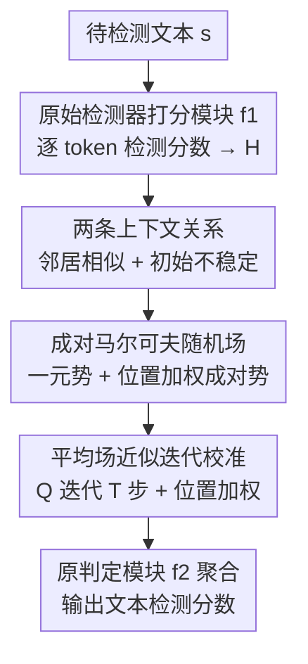

# Beyond Raw Detection Scores: Markov-Informed Calibration for Boosting Machine-Generated Text Detection

**会议**: ICLR2026  
**OpenReview**: [https://openreview.net/forum?id=Lzwkeg2o2z](https://openreview.net/forum?id=Lzwkeg2o2z)  
**代码**: https://github.com/tmlr-group/MRF_Calibration  
**领域**: 机器生成文本检测 / AIGC 检测  
**关键词**: MGT 检测, 分数校准, 马尔可夫随机场, 平均场近似, 度量法检测器

## 一句话总结
这篇论文指出主流"度量法"机器生成文本（MGT）检测器的 token 级分数会被 LLM 采样随机性污染，于是用马尔可夫随机场（MRF）刻画"相邻 token 分数相似、句首 token 分数不稳定"这两条规律，再通过平均场近似把它实现成一个只有 2×2 参数、可直接叠在任意现有检测器上的轻量迭代组件，在几乎不增加开销的前提下把各类基线检测器的 AUROC 大幅拉高（如 DetectGPT 在 Essay 上从 44% 提到 92%）。

## 研究背景与动机
**领域现状**：机器生成文本检测目前分两大流派。一类是**模型法（model-based）**，用人写/机生文本训一个二分类器（如 OpenAI detector、ChatGPT detector、SeqXGPT）；另一类是**度量法（metric-based）**，利用 LLM 在生成时留下的统计偏差直接打分，典型指标有对数似然（Log-Likelihood）、对数排名（Log-Rank）、熵（Entropy），以及通过扰动/重生成文本做对比的 DetectGPT、Fast-DetectGPT、DNA-GPT。度量法不需要训练大模型、与具体 LLM 无关，泛化性通常更好，因此更实用。

**现有痛点**：作者先把这些度量法放进一个统一框架（统一比较"数据 / 分数聚合 / 检测判定"三个维度）后发现，它们共享一个**阈值判定**机制——给文本算一个总分，超过阈值就判为机器生成。这意味着检测效果**完全取决于分数的精度**。但问题恰恰出在这里：LLM 采样过程本身带随机性，会让某些 token 偏离这些方法的底层假设（比如 Log-Rank 假设生成 token 排名都很高），导致 **token 级分数有偏、区分度低**。更糟的是，现有方法只是把这些可能不准的 token 分数**直接求和聚合**成文本总分，根本没有去纠正底层的逐 token 误差。

**核心矛盾**：检测好坏取决于分数精度，而分数精度被生成随机性破坏，且现有"naive 聚合"非但不修正反而把噪声一并带进阈值判定。换句话说，瓶颈不在于"用什么指标"，而在于"算出来的 token 分数本身就脏"。

**本文目标**：设计一个**与具体检测器解耦**的通用增强组件，去校准 token 级检测分数，从而无差别地提升所有度量法检测器的性能。

**切入角度**：既然检测分数绑定在 token 上，而 LLM 的自回归生成机制天然让 token 之间产生依赖，那么**上下文 token 的检测分数之间应该存在某种容易被忽略的关系**——揭示并建模这种关系，就能用上下文信息去纠偏单点分数。作者从一个单层单头 Transformer 的简化模型出发，理论 + 实证地揭示出两条规律：**邻居相似性（Neighbor Similarity）**——相邻 token 的检测分数方差更小、彼此接近；**初始不稳定性（Initial Instability）**——句子开头若干 token 的检测分数波动剧烈、不可靠。

**核心 idea**：把这两条规律编码进**马尔可夫随机场**，再用**平均场近似**将其落地成一个轻量迭代的神经网络层，叠在现有检测器之上做分数校准——用"上下文一致性"去修"单 token 噪声"。

## 方法详解

### 整体框架
方法整体是一个**可插拔的分数校准外挂**。给定待检测文本 $s$，先用任意现有检测器的"打分模块" $f_1$ 算出每个 token 的原始检测分数（并归一化成机/人两类的先验概率矩阵 $H$）；然后接入本文的 MRF 校准组件 $f_{mrf}$：它把 token 序列建成一个成对马尔可夫随机场，用**一元势**承接原始分数、用带**位置权重**的**成对势**编码"邻居相似 + 初始不稳定"，再用平均场近似把求解过程展开成 $T$ 步迭代更新；最后把校准后的分数交给原检测器的"判定模块" $f_2$ 聚合输出文本总分。整条链路写成 $f_{enh}(s) = f_1 \circ f_{mrf} \circ f_2(s)$，不改动原检测器任何结构，只新增一个 $2\times2$ 量级的参数。

### 关键设计

**1. 两条上下文关系：邻居相似性与初始不稳定性，给校准提供"先验"**

校准的前提是：到底该往哪个方向修分数？作者从一个单层单头 Transformer 的简化模型出发（注意力 $a_t = \mathrm{softmax}(1/t \cdot x_t W_Q W_K^\top X_{t-1}^\top) X_{t-1} W_V W_O$），证明了一个关于注意力分数上下界的定理（Theorem 1），并由"注意力 → $\log p(x_{t+1})$ 连续映射"推出两条可用于校准的规律。**邻居相似性**：相邻 token 的检测分数方差显著小于相隔很远的 token——因为定理刻画出一个类似模拟退火的正反馈回路，当前步分数高则下一步也倾向于高，反之亦然，分数无法在相邻步之间剧烈跳变。**初始不稳定性**：句首 token 的分数统计上更不稳定、波动大——因为定理的上下界与当前步 $t$ 强相关，$t$ 很小（靠前位置）时界中的 $\eta$ 与 $C$ 都很大，允许 $a_t$ 剧烈起伏。作者随后实证验证：检测分数距离（相隔 $k$ 跳的平均绝对差）随跳数单调增大、相邻 token 最相似；而相邻 token 的分数差在文本开头很大、随位置推进逐渐收敛稳定。这两条规律分别对应后面 MRF 的成对势与位置加权函数，是整个方法的物理依据。

**2. 成对马尔可夫随机场：用一元势 + 位置加权成对势把两条规律写进能量函数**

如何把"邻居该相似、句首该轻信"变成可优化的目标？作者给每个 token $s_t$ 赋一个二值随机变量 $y_{s_t}\in\{0,1\}$（人写/机生），把整段文本的 token 标签 $y_s$ 建成一个吉布斯分布 $P(y_s)=\frac{1}{Z}\exp(-E(s,y_s))$，最大化后验等价于最小化能量函数：

$$E(s, y_s)=\sum_{t=1}^{N}\Psi_U(s_t, y_{s_t})+\sum_{t=1}^{N}\sum_{s_j\in N(s_t)}\Psi_P(y_{s_t}, y_{s_j})$$

其中邻域只取直接相邻 token $N(s_t)=\{s_{t-1}, s_{t+1}\}$。**一元势** $\Psi_U(s_t, y_{s_t})=-\log p(s_t)$ 直接承接原检测器输出的概率（无概率输出的检测器则用 0-1 归一化分数），保证校准从原始分数出发。**成对势**编码邻居相似性：相邻 token 标签不同就罚、相同就奖，$\Psi_P(y_{s_t}, y_{s_j})=w\cdot(2\cdot I(y_{s_t}\neq y_{s_j})-1)$，$w\ge0$。为了进一步编码初始不稳定性，作者再乘一个位置加权函数 $\beta(t)$ 压低句首成对势的权重：

$$\Psi_P(y_{s_i}, y_{s_j})=\beta(j)\cdot w\cdot(2\cdot I(y_{s_i}\neq y_{s_j})-1),\quad \beta(t)=\frac{1}{1+\exp(-(t-t_0))}$$

$\beta(t)$ 是个 Sigmoid，中心在 $t_0$，让 $t_0$ 之前（句首不稳定区）的成对势被平滑抑制，从而避免不可靠的初始邻居把误差放大。这一步把两条经验规律严丝合缝地翻译成了能量项。

**3. 平均场近似：把 MRF 推断展开成 2×2 参数的轻量迭代层**

直接对 MRF 求后验需要在 $2^N$ 种标签组合上算配分函数 $Z$，不可行。作者用**平均场理论**做近似推断：用可分解分布 $Q(y_s)=\prod_t Q_{s_t}(y_{s_t})$ 逼近真实联合分布 $P(y_s)$，通过最小化 KL 散度并对每个 $Q_{s_t}$ 写拉格朗日量、求导置零，得到单 token 的最优更新式，再写成矩阵形式。一元势对应 $-\log H$（$H=[1-p(s), p(s)]$，两列分别是人/机标签）；成对势对应加权邻接矩阵 $A^{corr}$（其非零元就是相邻位置的 $\beta(\cdot)$）。值得注意的是，作者没有让所有"邻居关系"共用同一组奖惩权重，而是**放松权重**——引入一个 $W_{mrf}\in\mathbb{R}^{2\times2}_+$ 让机生邻居和人写邻居的影响可以不同，增强 MRF 的表达力。最终更新规则（用 softmax 实现 $\frac{1}{z}\exp(\cdot)$）为：

$$Q^t=\mathrm{softmax}\!\left(\log Q^{t-1}-A^{corr}Q^{t-1}\!\left(W_{mrf}\odot\begin{bmatrix}-1&1\\1&-1\end{bmatrix}\right)\right),\quad Q^0=H$$

由于 $Q$ 的计算依赖自身，需迭代 $T$ 步。迭代收敛后再用位置权重对最终分数二次抑制句首：$Q_{final}=[\beta(1),...,\beta(N)]\odot Q^T$。整个组件用稀疏-稠密矩阵乘实现，复杂度仅 $O(NT)$，相对原检测器开销可忽略；可学习参数只有 $W_{mrf}$ 这个 $2\times2$ 矩阵，用有监督交叉熵 $L=-\sum_s(Y_s\log f_{enh}(s)+(1-Y_s)\log(1-f_{enh}(s)))$ 训练。极少的参数量正是它**抗过拟合、跨域跨 LLM 泛化好**的关键——这一点在实验里与"直接用神经网络校准"的对照中体现得很明显。

### 损失函数 / 训练策略
唯一可学习量是 MRF 的 $2\times2$ 权重 $W_{mrf}$，迭代步数 $T$ 与位置中心 $t_0$ 为超参。训练用标准二分类交叉熵在训练集 $D_{train}$ 上端到端学习 $W_{mrf}$；推断按 Algorithm 1：构造 $A^{corr}$ → 取原检测器 token 分数初始化 $Q^0=H$ → 迭代 $T$ 步更新 $Q$ → 位置加权得 $Q_{final}$ → 交给 $f_2$ 聚合输出。

## 实验关键数据

### 主实验
在 Essay、Reuters、DetectRL、TruthfulQA 四个公开数据集上，对 10 个度量法检测器（Likelihood、Log-Rank、Entropy、DetectGPT、Fast-DetectGPT、DNA-GPT 等）做"叠加增强"对比，带本文方法的版本以 `-M` 后缀标记。指标用 AUROC 与低误报下的真正率 TPR@FPR-1%。下表为跨 LLM 设置（Essay 上以 GPT4All 文本训练、DetectRL 上以 Llama-2-70b 训练）的平均 AUROC（%）：

| 检测器 | Essay 原始 Avg | Essay +M | DetectRL 原始 Avg | DetectRL +M |
|--------|------|------|------|------|
| Likelihood | 96.17 | **97.79** | 72.20 | **80.84** |
| Log-Rank | 96.03 | **97.32** | 72.06 | **83.29** |
| Entropy | 83.93 | **89.01** | 63.34 | **67.02** |
| DetectGPT | 44.09 | **91.95** | 48.60 | **72.95** |
| Fast-DetectGPT | 69.08 | **79.92** | 60.97 | **61.68** |
| DNA-GPT | 95.26 | **98.07** | 67.79 | **69.75** |

提升对**弱检测器尤其显著**：在 Essay 单 LLM 设置中 DetectGPT 从 0.15% 飙到 37.18%（+37.03%）、Likelihood 从 52.4% 提到 77.86%（+25.46%），说明这些方法的打分假设本身合理，之前表现差主要源于分数估计误差被本文校准纠正了。跨域（arXiv / Writing / XSum / Yelp）、混合文本、Dipper/Polish 改写攻击等真实场景下，增强后检测器普遍获得更强的泛化与鲁棒性。

### 消融实验
方法含两个部件：MRF 层（建模邻居相似）与位置加权函数（建模初始不稳定），分别以 "w/o MRF"、"w/o Pos" 消融。

| 配置 | 效果 | 说明 |
|------|------|------|
| Full | 最佳 | MRF + 位置加权完整版 |
| w/o MRF | 明显下降但仍优于基线 | 去掉邻居相似建模 |
| w/o Pos | 明显下降但仍优于基线 | 去掉句首不稳定抑制 |

### 关键发现
- **两个部件去掉任一个都掉点，但保留任一个仍优于原始检测器**，证明两条规律各自有效。
- **部件贡献随检测器类型而变**：对 Likelihood、Log-Rank 这类单文本检测器，位置加权函数贡献最大（因为它们最受句首不稳定之害）；对 DetectGPT、Fast-DetectGPT 这类聚合多份文本分数的方法，随机性已被部分缓解，MRF 校准成为主要增益来源。
- **MRF vs 神经网络校准**：直接用三层 NN 校准（`-nn` 后缀）在同 LLM 内有时也不错，但跨 LLM 泛化大幅下降——说明 NN 是在过拟合训练数据，而本文极少参数的 MRF 才真正学到"通用纠分"能力。

## 亮点与洞察
- **把检测问题从"换更好的指标"转向"修更准的分数"**：作者用统一框架点破所有度量法共享阈值判定、且都败在 token 级噪声上，于是把发力点从指标设计移到分数校准，这是一个解耦且可复用的视角。
- **理论 → 经验 → 建模的闭环很干净**：从简化 Transformer 推出邻居相似 / 初始不稳定两条规律，再用 MRF 的成对势和位置权重一一对应地编码，最后用平均场近似落地，每一步都能对上动机，少见的"动机可验证"。
- **极简参数即护城河**：只有 $2\times2$ 的 $W_{mrf}$，$O(NT)$ 开销，可无缝叠在任意检测器上——这正是它跨域跨 LLM 不过拟合的原因，是个能直接迁移到其他"逐 token 打分再聚合"任务（如序列异常检测、token 级质量评估）的通用 trick。
- **"上下文一致性正则"的思想可外推**：用相邻单元标签平滑 + 对不可靠位置降权来纠正单点噪声，本质是把图像分割里 CRF/MRF 后处理那套搬到了文本检测，思路清晰可借鉴。

## 局限与展望
- 理论分析建立在**单层单头 Transformer 的简化模型**上，真实多层多头 LLM 的动力学是否严格满足两条规律只能靠实证近似支撑，定理与全尺度模型之间有 gap（作者也承认全尺度分析数学上不可行）。
- 邻域只取**直接相邻 token**（一阶马尔可夫），更长程的依赖（如句法/篇章级关系）未被建模，可能在长文本或结构化文本上留有空间。
- 位置加权用固定形状的 Sigmoid、中心 $t_0$ 与迭代步数 $T$ 为超参，不同语料/检测器下的最优值需调，论文未深入讨论其敏感性（仅在附录提及）。
- 仍是**有监督**校准，需要带标签的训练文本来学 $W_{mrf}$；面对全新、风格迥异的 LLM 是否需要重学权重值得进一步考察。

## 相关工作与启发
- **vs 模型法（ChatGPT-D / MPU / SeqXGPT）**：模型法直接训分类器，容易过拟合训练数据、对新 LLM 需重训；本文走度量法路线、模型无关，且用极少参数做校准，泛化与抗过拟合明显更好。
- **vs 原始度量法（Likelihood / Log-Rank / DetectGPT / DNA-GPT）**：它们各自设计不同指标但都"直接聚合 token 分数"、不纠正底层噪声；本文不替换它们的指标，而是作为**通用外挂**叠在其上校准分数，对其中最弱的 DetectGPT 增益最大。
- **vs 直接用神经网络校准分数**：NN 校准在跨 LLM 上泛化崩塌（过拟合），本文用结构化的 MRF + 平均场，仅 $2\times2$ 参数即获得稳定跨分布表现，体现了"用先验结构换泛化"的优势。

## 评分
- 新颖性: ⭐⭐⭐⭐⭐ 把 MRF/平均场这套结构化先验首次系统性引入 MGT 分数校准，且有理论支撑两条上下文规律
- 实验充分度: ⭐⭐⭐⭐⭐ 四数据集、十个检测器、跨 LLM/跨域/混合/改写攻击全覆盖，消融与 vs NN 对照齐全
- 写作质量: ⭐⭐⭐⭐ 统一框架 → 规律 → 建模 → 落地逻辑顺畅，公式较密但脉络清晰
- 价值: ⭐⭐⭐⭐⭐ 即插即用、开销可忽略、对弱检测器增益巨大，工程落地价值高

<!-- RELATED:START -->

## 相关论文

- [\[ACL 2026\] ExaGPT: Example-Based Machine-Generated Text Detection for Human Interpretability](../../ACL2026/aigc_detection/exagpt_example-based_machine-generated_text_detection_for_human_interpretability.md)
- [\[ACL 2026\] Beyond the Final Actor: Modeling the Dual Roles of Creator and Editor for Fine-Grained LLM-Generated Text Detection](../../ACL2026/aigc_detection/beyond_the_final_actor_modeling_the_dual_roles_of_creator_and_editor_for_fine-gr.md)
- [\[ACL 2026\] When Personalization Tricks Detectors: The Feature-Inversion Trap in Machine-Generated Text Detection](../../ACL2026/aigc_detection/when_personalization_tricks_detectors_the_feature-inversion_trap_in_machine-gene.md)
- [\[ICLR 2026\] D&R: Recovery-based AI-Generated Text Detection via a Single Black-box LLM Call](dr_recovery-based_ai-generated_text_detection_via_a_single_black-box_llm_call.md)
- [\[NeurIPS 2025\] DuoLens: A Framework for Robust Detection of Machine-Generated Multilingual Text and Code](../../NeurIPS2025/aigc_detection/duolens_a_framework_for_robust_detection_of_machine-generated_multilingual_text_.md)

<!-- RELATED:END -->
