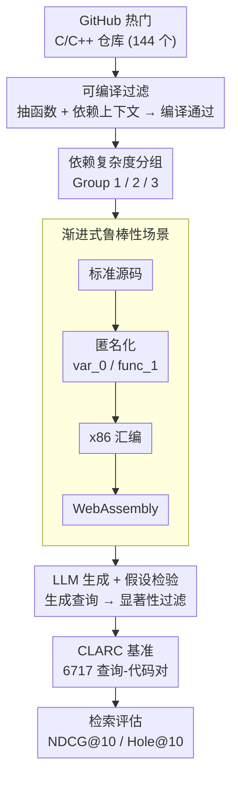

# CLARC: C/C++ Benchmark for Robust Code Search

**会议**: ICLR 2026  
**arXiv**: [2603.04484](https://arxiv.org/abs/2603.04484)  
**代码**: [GitHub](https://github.com/ClarcTeam/CLARC) / [HuggingFace](https://huggingface.co/datasets/ClarcTeam/CLARC)  
**领域**: AIGC检测  
**关键词**: 代码检索, C/C++ 基准, 编译验证, 代码嵌入, 汇编语言, 鲁棒性

## 一句话总结
构建首个可编译的 C/C++ 代码检索基准 CLARC（6717 查询-代码对），自动化 pipeline 从 GitHub 提取代码并用 LLM+假设检验生成/验证查询；覆盖标准/匿名化/汇编/WebAssembly 四种检索场景，揭示现有代码嵌入模型过度依赖词汇特征（匿名化后 NDCG@10 从 0.89 降至 0.67）且在二进制级别检索上严重不足。

## 研究背景与动机
**领域现状**：代码检索基准主要针对 Python/Java（如 CodeSearchNet、CoSQA、COIR），基于嵌入的检索模型（Voyage-code-3、OpenAI embedding 等）是大规模检索的标准。

**现有痛点**：
   - **语言覆盖偏颇**：C/C++ 是系统编程核心语言，但主流基准忽略/不重视 C/C++ 的 text-to-code 检索
   - **代码不可编译**：现有基准中很多代码片段缺少 include/依赖，无法编译——与实际工程实践脱节
   - **词汇依赖未被暴露**：基准很少测试标识符重命名/匿名化下的鲁棒性——高分可能来自变量名匹配而非语义理解
   - **二进制级别缺失**：安全审计、逆向工程需要在汇编/二进制级别搜索代码，但没有基准评估这类能力

**核心矛盾**：代码检索模型声称理解"代码语义"，但如果依赖的是变量名、函数名等词汇特征，那么在混淆代码/汇编代码上就会失灵

**核心 idea**：构建覆盖源码到二进制全栈的代码检索基准，用匿名化和编译到低级语言的方式系统性地测试语义理解 vs 词汇匹配

## 方法详解

### 整体框架

CLARC 是一条从 GitHub 源码到自然语言查询的自动化构建流水线：先从热门 C/C++ 仓库里抓取能独立编译的函数（**可编译过滤**），再按依赖复杂度把它们分成三组（**依赖复杂度分组**），然后把每个函数沿"源码→匿名化→汇编→WebAssembly"逐层抽象出四种检索场景（**渐进式鲁棒性场景**），最后用 LLM 生成查询、用统计假设检验把质量不达标的查询过滤掉（**LLM 生成 + 假设检验**）。最终得到 6717 个经过验证的查询-代码对。评估时配两个指标：**NDCG@10** 衡量 top-10 检索结果的排序质量（相关代码排得越靠前分数越高，是标准 IR 指标）；**Hole@10** 指 top-10 里缺失的相关文档占比（越低越好，专门捕捉"连前十都没把相关代码捞回来"的严重遗漏，这在汇编/二进制检索里尤其关键）。整套设计只为回答一个问题——模型拿高分是真懂代码语义，还是只在背变量名。

### 关键设计

**1. 可编译过滤：让基准贴近真实工程**

现有 C/C++ 基准最大的问题是代码片段缺 include、缺依赖定义，根本编译不过，与实际开发脱节。CLARC 从 144 个仓库（评估集 45 个、训练集 99 个）挖函数时，先建立一份标准库头文件白名单，再对每个函数沿调用图抽取它完整的依赖上下文（所需的类型定义、辅助函数等），只保留能在这套准备好的环境里真正编译通过的函数。这一步既保证了代码的完整性与可运行性，也为后续"编译到低级语言"的场景打下基础——没法编译的代码自然也没法生成汇编。

**2. 依赖复杂度分组：把检索难度拆成可控变量**

理解一个独立的小函数和理解一个层层调用、依赖自定义类型的复杂函数，难度完全不同。CLARC 据此把评估对分成三组：Group 1 是无任何自定义类型/辅助函数依赖的独立函数（526 对，平均 12.8 LOC），Group 2 依赖自定义类型但不依赖辅助函数（469 对，13.3 LOC），Group 3 同时依赖自定义类型和辅助函数（250 对，71.5 LOC，明显更长更复杂）。分组让"依赖上下文越多检索越难"这个假设变成可量化的对照实验，也使后面发现"独立函数在匿名化后反而掉得最狠"成为可能。

**3. 渐进式鲁棒性场景：层层剥离词汇线索逼出真语义**

模型在标准代码上拿高分，到底是因为懂语义，还是因为变量名 `compute_hash` 和查询里的关键词撞上了？CLARC 用四个抽象层级回答这个问题：**标准源码**保留原始命名；**匿名化**把所有变量、函数、类型名替换成 `var_0`、`func_1` 这类无意义标识符，物理上剥掉所有词汇线索只留控制流与结构；**汇编码**编译成 x86 汇编模拟逆向工程；**WebAssembly** 编译成 .wat 格式模拟 Web 安全审计。这条"源码→匿名化→汇编→Wasm"的递进链条，相当于逐级抹掉高级语言特征，每往下一层模型能依赖的表层信号就更少，从而把"词汇匹配"和"语义理解"的贡献分离开来。

**4. LLM 生成 + 假设检验把关查询质量**

查询由 LLM 以代码摘要的方式生成，但直接信任 LLM 会引入幻觉式的错配。CLARC 因此不只看 LLM 输出，还引入人工评分加统计假设检验：让评估者对生成查询与代码的匹配度打分，再检验这些分数是否显著高于随机基线，只有通过显著性检验的查询才被收录。这一步把"查询确实描述了这段代码"从主观印象变成了有统计依据的结论，避免基准本身被低质量查询污染。

## 实验关键数据

### 主实验（6 个模型 × 4 种场景）

| 模型 | 标准 NDCG@10 | 匿名化 NDCG@10 | 下降幅度 |
|------|-------------|---------------|---------|
| Voyage-code-3 | **0.89** | 0.67 | -24.7% |
| OpenAI-embed-large | 0.85 | 0.60 | -29.4% |
| CodeT5+ | 0.72 | 0.55 | -23.6% |
| OASIS | 0.68 | 0.54 | -20.6% |
| Nomic-emb-code | 0.78 | 0.58 | -25.6% |

### 汇编/WebAssembly 检索

| 指标 | 平均表现 |
|------|---------|
| 汇编 Hole@10（最佳模型） | ~17.1% |
| WebAssembly Hole@10 | 更高（性能更差） |

### 按依赖复杂度分析

| Group | 标准 NDCG@10 | 匿名化 NDCG@10 |
|-------|-------------|---------------|
| Group 1（独立函数） | 最高 | 下降最多 |
| Group 3（复杂依赖） | 次之 | 下降较少 |

### 关键发现
- **匿名化后所有模型一致大幅下降**（20-30%）——直接证明了模型依赖变量名/函数名等词汇特征而非真正理解代码语义
- **汇编级检索是重大挑战**：最好的模型也有 17.1% 的相关文档遗漏——这意味着安全审计/逆向工程场景下代码检索基本不可用
- Group 1（独立函数）在匿名化后下降最大——可能因为独立函数更依赖描述性命名
- 商业模型（Voyage-code-3）在标准场景领先但匿名化后优势缩小——说明其"语义理解"部分来自更好的词汇匹配
- 专门优化鲁棒性的 OASIS 下降最小但绝对水平也不高

## 亮点与洞察
- **"词汇依赖"的系统性证伪**：通过匿名化这个干净的实验设计，直接量化了模型有多少性能来自词汇特征 vs 真正的语义理解。这对代码检索社区是重要的警示
- **全栈覆盖**：从高级源码→匿名化→汇编→WebAssembly 的渐进式抽象剥离，是一个优雅的评估框架设计
- **可编译保证**的价值：确保代码完整且有上下文——这使基准更接近实际工程场景，也让依赖复杂度分析成为可能
- **自动化 pipeline**可复用——其他语言/项目可以用同样的流程构建类似基准

## 局限与展望
- 仅覆盖 C/C++，Python/Java/Rust 等语言的类似基准缺失
- 汇编级别仅测试了 x86 架构，ARM/RISC-V 等可能有不同特征
- 查询由 LLM 生成，可能与实际开发者搜索意图存在分布差异
- 评估集 1245 对的规模相对于 CodeSearchNet 等较小
- 未探索多阶段检索（先粗排再精排）或 RAG 场景

## 相关工作与启发
- **vs CodeSearchNet**：主要覆盖 Python/Go/Ruby 等，无 C/C++ text-to-code，不验证可编译性
- **vs COIR**：多任务代码检索基准但无匿名化/汇编级鲁棒性测试
- **vs XCodeEval**：有 C++ 但不来自真实项目
- **对代码嵌入模型的启示**：当前模型在匿名化后大幅退化，说明需要更好的语义建模方法（如程序分析、控制流图、数据流分析）而非纯文本嵌入

## 评分
- 新颖性: ⭐⭐⭐⭐ 首个覆盖源码到二进制的可编译 C/C++ 代码检索基准，匿名化-编译的渐进式设计新颖
- 实验充分度: ⭐⭐⭐⭐ 6 个模型 × 4 种场景 × 3 种依赖复杂度 + 假设检验验证
- 写作质量: ⭐⭐⭐⭐ Pipeline 描述详细，统计验证严谨
- 价值: ⭐⭐⭐⭐⭐ 数据集贡献对代码检索和安全社区有持续价值，揭示了模型的关键弱点

<!-- RELATED:START -->

## 相关论文

- [\[NeurIPS 2025\] DuoLens: A Framework for Robust Detection of Machine-Generated Multilingual Text and Code](../../NeurIPS2025/aigc_detection/duolens_a_framework_for_robust_detection_of_machine-generated_multilingual_text_.md)
- [\[ICLR 2026\] Unveiling Perceptual Artifacts: A Fine-Grained Benchmark for Interpretable AI-Generated Image Detection](unveiling_perceptual_artifacts_a_fine-grained_benchmark_for_interpretable_ai-gen.md)
- [\[ICLR 2026\] No Pixel Left Behind: A Detail-Preserving Architecture for Robust High-Resolution AI-Generated Image Detection](no_pixel_left_behind_a_detail-preserving_architecture_for_robust_high-resolution.md)
- [\[ICML 2026\] AutoBaxBuilder: Bootstrapping Code Security Benchmarking](../../ICML2026/aigc_detection/autobaxbuilder_bootstrapping_code_security_benchmarking.md)
- [\[AAAI 2026\] BAID: A Benchmark for Bias Assessment of AI Detectors](../../AAAI2026/aigc_detection/baid_a_benchmark_for_bias_assessment_of_ai_detectors.md)

<!-- RELATED:END -->
