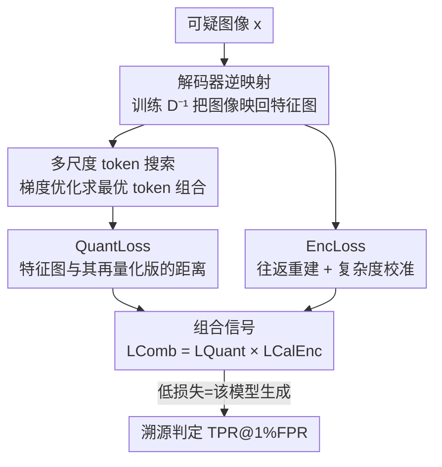

# Data Provenance for Image Auto-Regressive Generation

**会议**: ICLR2026  
**OpenReview**: [https://openreview.net/forum?id=qYu4wj7O3z](https://openreview.net/forum?id=qYu4wj7O3z)  
**代码**: 待确认  
**领域**: AIGC检测 / 数据溯源 / 图像自回归生成  
**关键词**: 数据溯源, 图像自回归模型, 码本量化, 解码器逆映射, 后验检测

## 一句话总结
不改动生成过程、也不需要水印，仅凭"图像自回归模型（IAR）生成的图像在码本量化空间留下的特征"，本文用训练好的逆解码器 + QuantLoss/EncLoss 两个互补信号，对 VAR、RAR、LlamaGen、Infinity 等主流 IAR 实现近 100% TPR@1%FPR 的后验溯源检测。

## 研究背景与动机
**领域现状**：图像自回归模型（Image Autoregressive models, IARs）借用了大模型的"下一个 token 预测"范式，把图像编码成离散 token 序列再逐个生成，已经能产出和真实照片难以区分的图像，VAR、RAR、LlamaGen、Infinity 是其中代表。随着这些模型大规模开放使用，"一张图到底是不是某个 IAR 生成的、是哪个模型生成的"成了刚需——它直接关系到打击虚假信息、识别欺诈、追责有害内容，以及防止生成图反过来污染训练数据导致的模型坍缩（model collapse）。

**现有痛点**：现有溯源手段几乎都属于**水印（watermark）**或**指纹（fingerprint）**两类，它们必须在训练或生成阶段往模型/图像里**主动嵌入额外信号**。这带来三个硬伤：(1) 嵌入会引入可感知或统计上的改动，损害生成质量；(2) 对那些**已经发布、且当初没打标记**的图像完全无能为力——你不可能回到过去补嵌信号；(3) 在鲁棒性、不可感知性、适用性之间反复 trade-off。已有的"重建式（reconstruction-based）"方法如 RONAN、LatentTracer、AEDR 虽然不嵌信号，但 RONAN 只对确定性生成有效（IAR 每步采样是随机的，不适用），LatentTracer 和 AEDR 在 IAR 上表现都很差。

**核心矛盾**：水印/指纹要求"事前介入"，而真实世界里需要溯源的图像往往是"事后捡到的、无标记的"——能介入的时候你没动机溯源，需要溯源的时候你已经无法介入。

**本文目标**：做一个**后验（post-hoc）、模型无关、不改生成流程**的溯源框架，对任意一张可疑图像，判断它是否由某个给定 IAR 生成。

**切入角度**：作者发现了一个有意思的现象——IAR 把图像编码成来自**固定码本（codebook）**的离散 token，这个量化步骤会在生成图里留下模型特有的"指纹"。具体说，生成图像的 token 表示**始终比自然图像更贴近码本里的条目**。因为生成图本来就是从这些码本条目"拼"出来的，自然图像却来自一个大得多、更多样的真实分布。

**核心 idea**：用"图像逆映射回潜空间后离码本条目有多近"作为溯源信号——生成图离得近（量化误差小），自然图或别的模型生成的图离得远（量化误差大）。把这个信号（QuantLoss）配合一个互补的编码-解码一致性信号（EncLoss），就能近乎完美地溯源。

## 方法详解

### 整体框架
先交代 IAR 的 tokenizer 结构（理解全文的前提）：它由**编码器 $E$**（CNN，把像素 $x\in\mathbb{R}^{H\times W\times 3}$ 投影成特征图 $f$）、**量化器 $Q$**（含码本 $Z\in\mathbb{R}^{N\times C}$，把每个空间特征 $f^{(i,j)}$ 映射到最近的码本条目得到离散 token $t_Z$）、**解码器 $D$**（把量化特征图 $f_Z$ 还原成图像）三部分组成。生成时走的是 $t_Z \xrightarrow{Q^{-1}} f_Z \xrightarrow{D} x_Z$，即从 token 反量化成特征图再解码成像素。

本文要解决的问题是：给一张可疑图像 $x$ 和一个 IAR 模型 $M$（白盒访问 $E,D,Q$），判断 $x$ 是否由 $M$ 生成——且只能事后做，不能改训练/生成。整体思路是把这条生成链路**反过来走**：从图像 $x$ 出发，先用一个训练好的**逆解码器 $D^{-1}$** 把它映回特征图，再**量化**到 token 空间，看它和码本贴合得有多紧（QuantLoss）；同时测一遍"图像→潜空间→图像"的往返一致性（EncLoss）。两个信号相乘得到最终的溯源判据。

### 关键设计

**1. QuantLoss：用"离码本有多近"作为溯源信号**

针对的痛点是：怎么把"生成图的 token 更贴近码本"这个观察变成一个可计算的判据。作者把它形式化为——若 $x$ 真由目标 IAR 生成，用理想的逆解码器 $D^{-1}$ 把它映回的特征图 $f$ 应该**本身就已经是量化好的**（每个特征向量恰好等于某个码本条目），于是再做一次量化 $f \xrightarrow{Q} t \xrightarrow{Q^{-1}} f_Z$ 几乎不引入误差，$f \approx f_Z$；反之，自然图或别的 IAR 生成的图无法对齐码本，量化误差就大。QuantLoss 直接定义为这个量化前后的距离：

$$\mathcal{L}_{\text{Quant}}(x) = \|f - f_Z\|_2 = \|f - Q^{-1}(Q(f))\|_2.$$

它有一个被作者反复强调的效率优势：QuantLoss **完全在自编码器的潜空间里计算，不需要解码回完整图像**，所以比重建基线快近 2 倍、比 AEDR 快近 4 倍，多数 IAR 上单图溯源耗时不到 10 毫秒。

**2. 解码器逆映射：训练 $D^{-1}$ 而不是直接复用编码器**

要算 QuantLoss 必须先把图像映回特征图，最朴素的做法是直接用 IAR 自带的编码器 $E$。但作者观察到 $E$ 对生成图来说**并不是 $D$ 的好逆映射**（Table 4 印证），原因是 $E$ 是在自然图像上训练的，对"生成图→其原始 token"这条路径拟合不好。于是作者**单独训练一个逆解码器**：用原编码器权重初始化，在该 IAR 生成的图像上微调，训练时冻结码本 $Z$ 和解码器 $D$，优化目标是让 $D^{-1}$ 能从 $D(f_Z)$ 重建出 $f_Z$：

$$\mathcal{L}_{\text{inv}} = \|f_Z - D^{-1}(D(f_Z))\|_2.$$

这一步是**纯后验**的——发布之后再做，不干预训练/生成；微调数据只用目标 IAR 自己生成的图，不需要额外昂贵的数据采集。一次微调出的 $D^{-1}$ 可以无限次复用来检测任意多张图。把数据增强加进微调数据、要求 $D^{-1}$ 对原图和增强图都产出一致的量化特征图，还能显著提升对常见图像扰动的鲁棒性。

**3. 多尺度 token 搜索：给 VAR 这类 next-scale 模型量身定做的反量化**

针对的痛点是：单尺度 IAR（如 RAR）每个特征对应唯一 token，反量化 $Q$ 就够了；但多尺度 IAR（如 VAR）把生成重定义为"下一尺度预测"——从低层特征的 token 开始，逐尺度生成高层细节，最后把各尺度 token 映射到码本、上采样、求和才得到特征图。VAR 原版量化用的是逐尺度贪心搜索，但**所有尺度的 token 都对每个空间特征有贡献**，贪心搜索没法把特征图反推回原始 token 组合。作者把它写成一个优化问题：给定目标特征图 $f$，找最优的多尺度 token 组合 $\{t_k\}_{k=1}^K$ 使重建误差最小：

$$\min_{\{t_k\}_{k=1}^K} \big\| f - \hat{f}(\{t_k\}_{k=1}^K) \big\|_2^2.$$

具体做法是给 token map 每个元素初始化 $N$ 个对应码本条目的 logits，按 logits 算出估计特征图，再用梯度下降逼近目标特征图。直觉是：对 VAR 真实生成的特征图，迭代会让原本生成的那些 token 的 logit 越来越高、QuantLoss 显著下降；非 VAR 生成的特征图无法被码本 token 很好地表示，优化后 QuantLoss 仍然高。消融里这一项记作 **QuantLoss Opt**，在 VAR 上把朴素 QuantLoss 的近乎 0 提升到 ~90%+。

**4. EncLoss：互补的往返一致性信号 + 复杂度校准**

QuantLoss 之外作者补了第二个信号 EncLoss，思路是：生成时 $f_Z \xrightarrow{D} x_Z$ 把低维潜空间映到高维像素空间，若用理想 $D^{-1}$ 把生成图压回 $f_Z$ 是无信息损失的；而自然图/别的模型生成的图压回潜空间会有不可忽略的压缩损失。于是定义往返重建误差 $\mathcal{L}_{\text{Enc}} = \|\text{Rec}(x) - x\|_2$，其中 $\text{Rec}(x) := D(D^{-1}(x))$。但这个损失不只跟数据来源有关，还跟**图像复杂度**有关——低复杂度的自然图信息密度低，往返损失也低，会造成假阳性。作者借鉴 AEDR 的思路加了一个**校准因子**：对图像再往返一次，用第二次的往返损失估计图像固有复杂度，做比值校准：

$$\mathcal{L}_{\text{Enc}}^{\text{Cal}} = \frac{\|\text{Rec}(x) - x\|_2}{\|\text{Rec}(\text{Rec}(x)) - \text{Rec}(x)\|_2}.$$

最后把两个信号组合。因为 $\mathcal{L}_{\text{Enc}}^{\text{Cal}}$ 是误差比值，作者用**乘积**作为最终判据：$\mathcal{L}_{\text{Comb}} = \mathcal{L}_{\text{Quant}} \times \mathcal{L}_{\text{Enc}}^{\text{Cal}}$。值得注意的是两个信号在不同模型上各有所长（如 EncLoss 在 VAR 上更强、QuantLoss 在 Infinity 上更强），组合后多数情况下取得最稳的结果——但并非永远更好（Infinity 上 EncLoss 反而拖累，见关键发现）。

### 损失函数 / 训练策略
唯一需要训练的只有逆解码器 $D^{-1}$，目标函数即上面的 $\mathcal{L}_{\text{inv}}$，训练时冻结码本和解码器、用原编码器权重初始化、仅用目标 IAR 生成图微调，可选地把数据增强加入以增强鲁棒性。整个框架除此之外无需任何对模型本体或生成流程的改动。

## 实验关键数据

### 主实验
评测在 LlamaGen、RAR、Taming、VAR、Infinity 五个 IAR 加一个向量量化扩散模型 VQ-Diffusion 上进行；真实图像来自 ImageNet / LAION / MS-COCO 各 1000 张，生成图各模型 1000 张。主指标是 **TPR@1%FPR**（1% 假阳率下的真阳率，强调避免误判）。每个目标模型用 3.3 节里表现最好的信号组合实例化。

| 目标模型 | 方法 | ImageNet | MS-COCO | RAR | Infinity |
|--------|------|------|------|------|------|
| LlamaGen | Reconstruction | 33.6 | 44.3 | 39.7 | 70.0 |
| LlamaGen | LatentTracer | 93.5 | 97.9 | 96.3 | 99.0 |
| LlamaGen | AEDR | 50.9 | 50.5 | 59.5 | 70.7 |
| LlamaGen | **Ours** | **100.0** | **100.0** | **100.0** | **100.0** |
| RAR | AEDR | 29.5 | 36.6 | — | 49.9 |
| RAR | **Ours** | **100.0** | **100.0** | — | **100.0** |
| Infinity | AEDR | 1.6 | 56.2 | 3.0 | — |
| Infinity | **Ours** | **99.4** | **99.4** | **99.5** | — |

本文方法在几乎所有模型/数据集上达到 100% 或近 100% TPR，把最强基线 LatentTracer/AEDR 在 RAR、VAR、Infinity 上 0~50% 的惨淡表现碾压。

### 消融实验
Table 3 拆解了 QuantLoss、EncLoss、二者乘积三种信号的贡献（TPR@1%FPR，绿色高亮为各模型最佳组合）：

| 模型 | QuantLoss | EncLoss | QuantLoss × EncLoss | 说明 |
|------|---------|---------|------|------|
| RAR | 99.9 | 98.2 | **100.0** | 组合最稳 |
| Taming | 99.6 | 100.0 | **100.0** | EncLoss 已饱和 |
| VAR（朴素 QuantLoss） | 0.4 | 100.0 | — | 朴素量化对 VAR 失效 |
| VAR（QuantLoss **Opt**） | 95.0 | 100.0 | **100.0** | 多尺度搜索救活 QuantLoss |
| Infinity | 99.4 | 0.0 | 0.0 | EncLoss 反而拖垮组合 |

Table 4 验证逆解码器的必要性：在 RAR 上用原编码器只有 6.2%（ImageNet），换成训练好的逆解码器后大幅跃升——证明"$E$ 不是 $D$ 的好逆映射"这一观察成立。

Table 2 是 RAR 上对常见后处理的鲁棒性（非归属图来自 ImageNet，用 QuantLoss）：

| 方法 | Noise(0.05) | JPEG(60) | Contrast(2.0) | Resize(0.5) |
|------|------|------|------|------|
| AEDR | 7.3 | 8.9 | 1.4 | 0.2 |
| Ours (w/o Aug) | 60.4 | 91.7 | 45.7 | 88.5 |
| Ours (w/ Aug) | **87.8** | **96.1** | **91.1** | **98.4** |

### 关键发现
- **没有单一信号通吃**：QuantLoss 在 Infinity 上强（99.4%）但 EncLoss 在 Infinity 上几乎归零（0.0%），组合后反被拖到 0.0；反过来 VAR 上 EncLoss 强、朴素 QuantLoss 近 0。这说明"两个信号相乘"是默认但非万能策略，需要按模型挑最佳实例化。
- **VAR 必须靠多尺度 token 搜索**：朴素 QuantLoss 在 VAR 上仅 0.4%，换成 QuantLoss Opt 后到 95%，是 next-scale 范式特有反量化难题的直接证据。
- **数据增强微调显著提升鲁棒性**：尤其在 Contrast（45.7→91.1）和 Resize（已高但更稳）上，加增强的逆解码器把抗扰动能力拉到实用水平。
- **效率优势来自潜空间计算**：QuantLoss 不解码回像素，比重建基线快近 2 倍、比 AEDR 快近 4 倍，多数模型 <10ms。

## 亮点与洞察
- **把"码本量化"本身变成指纹**：最让人"啊哈"的点是——IAR 用固定码本量化这件"为了生成而必须做的事"，反过来成了无需任何额外嵌入的天然指纹。生成图天生就贴着码本，自然图天生贴不上，溯源信号"免费"地写在了生成机制里。
- **后验、无水印、可追溯既往**：不改训练/生成、对已发布无标记内容仍可溯源，这恰好补上了水印/指纹"事前介入"的死角，实用价值高。
- **逆解码器的反直觉发现**：原编码器并不是解码器的好逆映射（因为它在自然图上训练），单独训一个逆解码器这一步看似多余却是性能关键，可迁移到其他"需要把生成图映回潜空间"的取证任务。
- **多尺度反量化写成可微优化**：把 next-scale 的 token 反推从贪心搜索改成梯度优化，思路可借鉴到任何"多尺度/层级量化需要反演"的场景。

## 局限与展望
- **白盒假设**：方法假设能白盒访问目标 IAR 的 $E,D,Q$。虽然很多 SOTA IAR 开源，但对闭源模型不适用。
- **每个目标模型都要单独训逆解码器**：虽然是一次性开销且可无限复用，但模型数量多时仍需逐个微调，缺乏跨模型泛化。
- **组合信号不稳健的失败模式**：Infinity 上 EncLoss 归零导致乘积失败，说明"哪个信号/组合最优"目前靠经验挑选，缺乏自动选择机制——理想情况下应能自适应判断该用 QuantLoss、EncLoss 还是组合。
- **对抗鲁棒性未充分探讨**：实验只覆盖常见后处理（噪声/JPEG/缩放等），面对刻意针对码本距离信号设计的自适应攻击是否仍鲁棒，未作评估。
- **与扩散模型的边界**：方法对向量量化扩散（VQ-Diffusion）有效，但对主流连续潜空间扩散模型是否适用未展开。

## 相关工作与启发
- **vs 水印/指纹（Fernandez 2023, Kim 2024 等）**: 它们在训练/生成阶段主动嵌入信号，损害画质且无法追溯既往；本文纯后验、不嵌信号、可对已发布无标记图溯源——优势是适用性，代价是需要白盒访问模型。
- **vs RONAN（Wang 2023）**: RONAN 把生成过程逆向回输入空间做归属，但只对确定性生成有效；IAR 每步是随机采样，RONAN 直接不适用。
- **vs LatentTracer（Wang 2024）**: 专为扩散模型设计、在解码器潜空间优化来溯源；虽可套用到 IAR 但表现次优且单图计算昂贵，本文在 RAR/VAR/Infinity 上远超它。
- **vs AEDR（Wang 2025a）**: 用双重重建校准重建损失提升扩散归属，本文借鉴了它的复杂度校准思路用于 EncLoss，但指出 AEDR 在 IAR 上整体性能不足。
- **vs 成员推断攻击（MIA）**: 二者解决根本不同的问题——MIA 判断某数据点是否在训练集里（审计隐私泄露），本文判断图像是否由模型生成（溯源合成内容）；且 IAR 的 MIA 方法通常还需类别标签/文本提示，野外生成图往往没有，本文只用图像本身就够。

## 评分
- 新颖性: ⭐⭐⭐⭐⭐ 首个针对 IAR 的后验溯源框架，"码本量化即指纹"的观察兼具洞见与实用性
- 实验充分度: ⭐⭐⭐⭐ 覆盖 6 个生成模型 × 多数据集 + 鲁棒性 + 信号消融，但缺自适应攻击与跨模型泛化评估
- 写作质量: ⭐⭐⭐⭐ 观察→形式化→信号设计的逻辑链清晰，公式与图示到位
- 价值: ⭐⭐⭐⭐⭐ 直击"已发布无标记生成图无法溯源"的现实痛点，对内容取证/防模型坍缩有直接意义

<!-- RELATED:START -->

## 相关论文

- [\[ACL 2025\] ChemActor: Enhancing Automated Extraction of Chemical Synthesis Actions with LLM-Generated Data](../../ACL2025/aigc_detection/chemactor_enhancing_automated_extraction_of_chemical_synthesis_actions_with_llm-.md)
- [\[ICLR 2026\] Omni-IML: Towards Unified Interpretable Image Manipulation Localization](omni-iml_towards_unified_interpretable_image_manipulation_localization.md)
- [\[ICLR 2026\] All Patches Matter, More Patches Better: Enhance AI-Generated Image Detection via Panoptic Patch Learning](all_patches_matter_more_patches_better_enhance_ai-generated_image_detection_via_.md)
- [\[ICLR 2026\] FakeXplain: AI-Generated Image Detection via Human-Aligned Grounded Reasoning](fakexplain_ai-generated_image_detection_via_human-aligned_grounded_reasoning.md)
- [\[ICLR 2026\] HSIC Bottleneck for Cross-Generator and Domain-Incremental Synthetic Image Detection](hsic_bottleneck_for_cross-generator_and_domain-incremental_synthetic_image_detec.md)

<!-- RELATED:END -->
