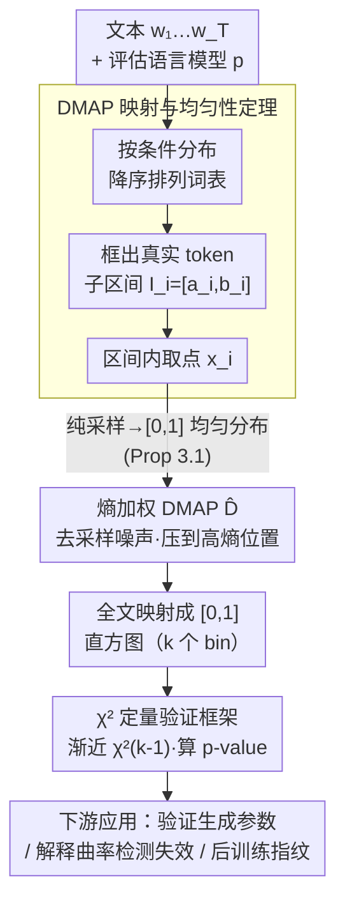

# DMAP: A Distribution Map for Text

**会议**: ICLR 2026  
**arXiv**: [2602.11871](https://arxiv.org/abs/2602.11871)  
**代码**: [https://github.com/Featurespace/dmap](https://github.com/Featurespace/dmap)  
**领域**: AIGC检测  
**关键词**: 文本分布图, 机器文本检测, 统计检验, token概率, 语言模型分析

## 一句话总结

提出 DMAP（Distribution Map），一种将文本经由语言模型的 next-token 概率排序映射为 $[0,1]$ 区间上 i.i.d. 样本的数学框架，理论证明纯采样文本产生均匀分布，由此可用 $\chi^2$ 检验验证生成参数、揭示概率曲率类检测器在纯采样下彻底失效的根本原因，并可视化后训练（SFT/RLHF）在下游模型中留下的统计指纹。

## 研究背景与动机

**领域现状**：语言模型的 next-token 概率分布蕴含大量文本统计信息。现有方法主要通过困惑度（perplexity）、log-likelihood、log-rank 等标量指标来分析文本特征或检测机器生成文本。DetectGPT 开创了"概率曲率"（probability curvature）思路——通过扰动文本并比较似然变化来判断是否为机器生成；FastDetectGPT 用条件概率归一化改进了效率；Binoculars 用双模型的概率比值做零样本检测。

**现有痛点**：所有基于概率曲率的方法都隐含一个关键假设——机器生成文本系统性地偏向概率分布的头部（即选择高概率 token），因而"概率曲率"与人类文本方向相反。但这个假设只在使用 top-k/top-p/低温度等截断采样策略时成立。当生成器使用纯采样（pure sampling, temperature=1.0, 无截断）时，该假设完全不成立：FastDetectGPT 的 AUROC 从 0.702 暴跌至 0.200，Binoculars 从 0.825 暴跌至 0.325，甚至不如随机猜测。更糟糕的是，作者发现现有检测文献中存在系统性数据错误——HuggingFace 曾默认开启 top-k=50，导致多篇顶会论文（DetectGPT、FastDetectGPT、Binoculars）在声称使用纯采样的实验中实际使用了 top-k=50。

**核心矛盾**：现有指标（perplexity、log-rank 等）存在"语境化"（contextualization）问题——一个 token 的 log-likelihood 是否"异常高"，取决于该位置条件分布的形状（即有多少合理的候选 token），而 perplexity 等指标完全忽略了这一上下文信息。不同文体（诗歌 vs 新闻 vs 技术写作）会系统性地影响条件分布的形状，导致同一个概率值在不同语境下含义截然不同。

**本文目标** (1) 建立一个同时编码 rank 和概率信息、且有严格数学保证的文本统计表示框架；(2) 用该框架揭示现有检测方法失败的根本原因；(3) 提供高效的数据完整性验证工具和后训练分析工具。

**切入角度**：将每个 token 按其在条件概率分布中的排序位置映射到 $[0,1]$ 区间上的一个子区间——高概率 token 对应左侧（接近 0），低概率 token 对应右侧（接近 1），区间长度等于该 token 的条件概率。这个映射本质上是概率积分变换（PIT）在离散分布上的动态排序扩展。

**核心 idea**：DMAP 将文本映射为 $[0,1]$ 上的分布，纯采样对应精确均匀分布，任何偏离均匀的模式都是生成策略或文本属性的可量化信号。

## 方法详解

### 整体框架

DMAP 想解决的问题是：现有标量指标（perplexity、log-rank）丢掉了"一个概率值在当前语境下到底算不算异常"的上下文信息，而检测方法又把"机器文本偏向概率头部"当成铁律。DMAP 换一个视角——不再把每个 token 压成一个标量，而是把它映射成 $[0,1]$ 区间上的一个点，让 rank 和概率同时显形。整条流水线对文本 $w_1 \cdots w_T$ 和一个评估语言模型 $p$ 逐位置运行：先按条件分布 $p(\cdot|w_1 \cdots w_{i-1})$ 把整个词表降序排列，再为真实 token $w_i$ 框出一个子区间 $I_i = [a_i, b_i] \subset [0,1]$，最后从 $I_i$ 上取一个点 $x_i$（基础版均匀采样，进阶版改用熵加权密度去噪）。把全文得到的 $x_1 \cdots x_T$ 丢进 $k$ 个等宽 bin 画直方图，就得到这段文本的"分布指纹"。这个指纹支撑三类应用：用 $\chi^2$ 检验验证生成参数、分析检测方法为何失效、可视化后训练（SFT/RLHF）留下的统计痕迹。

### 关键设计

**1. DMAP 映射与均匀性定理：把每个 token 映射成 $[0,1]$ 上一个点，纯采样恰好落成均匀分布**

这一步是整套框架的地基，要同时把"这个 token 排第几"和"它的概率多大"编码进同一个数。对位置 $i$，先取出比 $w_i$ 更可能的 token 集合 $V_i^+ = \{v \in V : p(v|w_1 \cdots w_{i-1}) > p(w_i|w_1 \cdots w_{i-1})\}$，把它们的概率累加得到左端点 $a_i = \sum_{v \in V_i^+} p(v|w_1 \cdots w_{i-1})$，右端点 $b_i = a_i + p(w_i|w_1 \cdots w_{i-1})$。于是区间 $I_i = [a_i, b_i]$ 的位置（左端点）反映 rank、长度反映概率，再令 $x_i \sim U(a_i, b_i)$。核心结论是 Proposition 3.1：当文本由模型 $p$ 纯采样生成时，$x_1 \cdots x_T$ 是 $[0,1]$ 上 i.i.d. 的均匀分布。证明只需几行——对落在某 token $v$ 区间 $[a,b)$ 内的任意子区间 $(c,d)$，

$$\mathbb{P}(x_i \in (c,d)) = p(v|\text{context}) \cdot \frac{d-c}{b-a} = (b-a) \cdot \frac{d-c}{b-a} = d-c$$

恰好等于子区间长度，正是均匀分布的定义。证明全程没对语言模型做任何假设，所以只要生成和评估用同一套解码策略，这条定理对截断/温度等改动后的分布同样成立。它的价值在于：给后续所有分析提供了一个精确的零假设——任何偏离均匀的模式，都必然编码着生成策略、模型差异或人类文本特性这类有意义的信号。

**2. 熵加权 DMAP（$\hat{D}$）：去掉采样噪声，把权重压到模型"犹豫"的高熵位置**

直接用 $x_i \sim U(a_i, b_i)$ 会引入随机性，而且像 "the"、"of" 这种高概率 token 的位置无论人写还是机器写选择都差不多，对区分毫无贡献（附录 F 显示只画低熵位置时 DMAP 图几乎完美均匀、信息量极低）。为此把随机采样换成一个确定的加权密度函数

$$\hat{D}(\underline{w}) = \frac{\sum_i h_i' \cdot \chi_{I_i}/|I_i|}{\sum_i h_i'}$$

其中 $h_i$ 是位置 $i$ 的 next-token 分布熵，$h_i' = \min(h_i, \lambda)$ 做了截断（$\lambda=2$），$\chi_{I_i}/|I_i|$ 是区间 $I_i$ 上的归一化指示函数。这样既消掉了随机噪声，又用熵当权重把信号集中到模型真正拿不准的高熵位置，灵敏度明显提升。

**3. $\chi^2$ 定量验证框架：把肉眼看直方图升级成严格的假设检验**

光看分布形状是定性的，作者进一步把均匀性定理变成可计算 p-value 的检验。把 $[0,1]$ 切成 $k$ 个等宽 bin（按 Terrell-Scott 规则取 $k = (2T)^{1/3}$），统计每个 bin 的频率 $f_i$，构造

$$\chi^2 = Tk \sum_{i=1}^{k}(f_i - 1/k)^2$$

由 Proposition 3.1 的 i.i.d. 均匀性，该统计量渐近服从 $\chi^2_{k-1}$ 分布，于是可以直接算出 p-value 来检验"文本是否真由指定生成策略产生"，经验上 $T \geq 10k$ 时 p-value 才可靠。正是靠这个工具，作者以极高置信度查出了多篇顶会论文里 top-k=50 的隐藏数据错误。

把这三件事串起来还能反推生成参数：不同解码策略会在 DMAP 上留下高度特征化的形状。纯采样给出均匀分布；top-p=$\pi$ 在 $[0, \pi]$ 上几乎平坦、随后急剧下降（因为 top-p 集合的总概率质量略大于 $\pi$）；top-k 在 $[0, 0.5]$ 附近近似平坦再平滑下降；温度采样 $\tau < 1$ 则产生左偏的平滑变形。这些形状由条件概率分布空间里 top-k/top-p 集合的统计规律决定，看一眼形状就能大致判断对方用了什么采样设置。

## 实验关键数据

### 主实验：概率曲率检测器在纯采样下彻底失效

| 方法 | 生成模型 | XSum (k=50) | XSum (纯采样) | SQuAD (k=50) | SQuAD (纯采样) | Writing (k=50) | Writing (纯采样) |
|------|---------|-------------|-------------|-------------|--------------|---------------|----------------|
| FastDetectGPT | Llama-3.1-8B | 0.702 | **0.200** | 0.739 | **0.208** | 0.915 | **0.289** |
| FastDetectGPT | Mistral-7B | 0.770 | 0.276 | 0.819 | 0.299 | 0.906 | 0.339 |
| FastDetectGPT | Qwen3-8B | 0.765 | 0.289 | 0.612 | 0.320 | 0.923 | 0.377 |
| DetectGPT | Llama-3.1-8B | 0.606 | 0.408 | 0.527 | 0.299 | 0.723 | 0.422 |
| DetectGPT | Mistral-7B | 0.679 | 0.486 | 0.586 | 0.365 | 0.688 | 0.457 |
| Binoculars | Llama-3.1-8B | 0.825 | **0.325** | 0.849 | **0.365** | 0.942 | **0.410** |
| Binoculars | Mistral-7B | 0.823 | 0.350 | 0.851 | 0.416 | 0.931 | 0.404 |
| Binoculars | Qwen3-8B | 0.857 | 0.416 | 0.752 | 0.467 | 0.949 | 0.492 |

### 后训练指纹分析（Pythia 1B + 不同 SFT 数据）

| SFT 数据 | DMAP 分布特征 | 解释 |
|---------|-------------|------|
| 无微调（Pythia base） | 明显右偏（tail-biased） | 基座模型的条件分布与小评估模型差异大 |
| OASST2 人类数据 | 轻微右偏 + 显著 tail-collapse | 人类写作的指令数据在 DMAP 上有独特的尾部急剧衰减 |
| OASST2 + Llama T=1.0 纯采样 | 接近基座模型，轻微右偏 | 纯采样数据的统计特征传递到了下游模型 |
| OASST2 + Llama T=0.7 温度采样 | **左偏（head-biased）** | 唯一出现左偏的模型，温度采样的头部偏好直接传递 |

### 关键发现

- **概率曲率假设在纯采样下完全反转**：所有三个检测器在纯采样下 AUROC < 0.5，意味着它们的判别方向与实际相反。这不是"检测变难了"，而是概率曲率假设在此设置下根本不成立——基座模型纯采样文本在跨模型评估时呈 tail-biased，与人类文本的方向一致甚至更极端
- **HuggingFace 默认 top-k=50 数据错误的波及范围巨大**：DMAP 的 $\chi^2$ 检验仅用 10000 个 token 就能以 $p < 10^{-10}$ 的置信度检出这一错误，而多篇顶会论文的实验结论建立在此错误数据之上
- **DMAP 对改述攻击鲁棒**：用 DIPPER 改述后的机器文本和人类文本在 DMAP 上仍然明显可区分，改述仅使分布略微趋于平坦，但特征形状保持
- **SFT 数据的统计指纹直接传递到下游模型**：用温度 0.7 采样的合成数据微调产生 head-biased 模型，而人类数据和纯采样数据微调均保持 tail-biased，说明训练数据的 DMAP 指纹忠实地传递到了生成分布中
- **指令微调模型尾部最后一个 bin 密度异常升高**：可能反映了轻微过拟合，DMAP 可用于指导 SFT 的早停策略
- **收敛迅速**：2000 个 token 即可呈现清晰的特征形状，20000 个 token 后噪声基本消除；对极短文本可通过减少 bin 数量（如 5 个 bin）来缓解

## 亮点与洞察

- **数学优雅性与实用性的完美结合**：Proposition 3.1 的证明仅需几行，但提供了一个精确的零假设（均匀分布），使得所有后续分析都有严格的统计基础。这种"简单定理 + 丰富应用"的范式在 ML 论文中非常难得
- **同时编码 rank 和概率信息是 DMAP 相对 PIT 的关键扩展**：经典 PIT 需要对类别变量有自然排序，而 DMAP 通过动态按模型概率重新排序 token 来消除这一限制。作者在附录中对比了随机排序的 PIT，证实无法从中提取有用信息，验证了动态排序的必要性
- **数据错误发现的元研究价值**：DMAP 不仅是分析工具，还充当了"数据审计器"——发现了 DetectGPT/FastDetectGPT/Binoculars 等多篇顶会论文因 HuggingFace 默认设置导致的系统性数据错误。这提示 LLM 实验中需要更严格的数据完整性验证流程
- **OPT-125m 即可有效运行**：DMAP 的计算仅需一次前向传播，配合 OPT-125m 等小模型就可在消费级硬件上几分钟内完成分析，极大降低了使用门槛

## 局限与展望

- **定位为分析工具而非检测器**：DMAP 本身不直接输出"人类/机器"二分类，在检测场景中需要在 DMAP 之上构建独立的决策器，但论文未提供这一方向的具体方案和 AUROC 数据
- **评估模型假设**：DMAP 需要指定评估语言模型，跨模型评估时基座模型之间天然出现 tail-biased 分布，可能淹没待分析的信号。作者建议在此场景下先用 DMAP 校准方向再设计检测器
- **短文本限制**：$\chi^2$ 检验要求 $T \geq 10k$（40 个 bin 需要至少 400 个 token），对于短文本（如单条推文、短评论）统计功效不足。虽然可以减少 bin 数量来缓解，但信息损失也随之增大
- **熵截断阈值 $\lambda$ 的选取**：论文固定 $\lambda=2$ 但未提供消融研究或自适应选取策略。不同领域（代码 vs 文学创作）的熵分布差异极大，固定阈值可能不是最优的
- **未探索更现代的自监督检测方法**：现有对比仅限于 DetectGPT 家族和 Binoculars，未与基于水印、训练式检测器（如 RoBERTa-based）或更新的方法（如 MOSAIC 的多观察者框架）进行全面对比

## 相关工作与启发

- **vs DetectGPT/FastDetectGPT**：基于概率曲率假设，DMAP 精确地解释了它们失效的条件——纯采样时跨模型评估呈 tail-biased，与概率曲率预期方向相反（AUROC < 0.5）。DMAP 提出的"先用可视化判断 head/tail bias 方向再设计检测器"的思路比直接假设曲率方向更合理
- **vs Binoculars**：使用双模型概率比值做归一化，但其理论基础不明确（作者原文指出 "the theoretical justification for their normalization scheme remains unclear"），而 DMAP 的均匀性定理提供了清晰的理论保证
- **vs GLTR**：同样做 token 级可视化，但 GLTR 仅根据 rank 做离散着色（top-10/100/1000），是 DMAP 的粗糙离散近似。DMAP 通过连续映射保留了完整的概率和 rank 信息
- **与模型校准文献的交叉**：DMAP 视角与"指令微调模型过度自信"的研究相补充——Luo et al. 2025、Shen et al. 2024 从校准角度研究过度自信，DMAP 则从生成分布的角度提供了可视化和量化工具，两者可以结合

## 评分

- 新颖性: ⭐⭐⭐⭐⭐ Proposition 3.1 的"纯采样=均匀分布"定理简洁有力，提供了一个全新的文本分析视角
- 实验充分度: ⭐⭐⭐⭐ 三个应用场景展示充分（参数验证、检测方法分析、SFT指纹），但作为独立检测器的定量对比偏弱
- 写作质量: ⭐⭐⭐⭐⭐ 数学推导简洁严谨，直觉解释清晰，附录极为详尽（提示敏感性、收敛分析、对抗鲁棒性都有覆盖）
- 价值: ⭐⭐⭐⭐⭐ 发现了多篇顶会论文的系统性数据错误，为文本分析和检测方法设计提供了严格的理论工具和新原则

<!-- RELATED:START -->

## 相关论文

- [\[ICLR 2026\] HLD: Approximate Hierarchical Linguistic Distribution Modeling for LLM-Generated Text Detection](hld_approximate_hierarchical_linguistic_distribution_modeling_for_llm-generated_.md)
- [\[ICLR 2026\] Learn-to-Distance: Distance Learning for Detecting LLM-Generated Text](learn-to-distance_distance_learning_for_detecting_llm-generated_text.md)
- [\[ICLR 2026\] TSM-Bench: Detecting LLM-Generated Text in Real-World Wikipedia Editing Practices](tsm-bench_detecting_llm-generated_text_in_real-world_wikipedia_editing_practices.md)
- [\[ICLR 2026\] EditLens: Quantifying the Extent of AI Editing in Text](editlens_quantifying_the_extent_of_ai_editing_in_text.md)
- [\[ICLR 2026\] D&R: Recovery-based AI-Generated Text Detection via a Single Black-box LLM Call](dr_recovery-based_ai-generated_text_detection_via_a_single_black-box_llm_call.md)

<!-- RELATED:END -->
