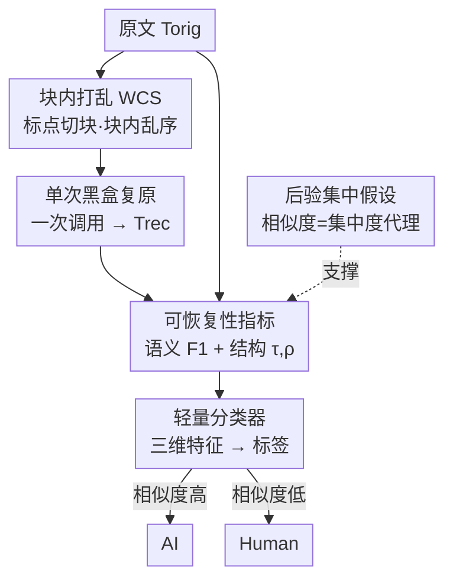

# D&R: Recovery-based AI-Generated Text Detection via a Single Black-box LLM Call

**会议**: ICLR2026  
**OpenReview**: [https://openreview.net/forum?id=FiMZSxo4DO](https://openreview.net/forum?id=FiMZSxo4DO)  
**代码**: https://github.com/Yuxia-Sun/D-R  
**领域**: AIGC检测 / AI生成文本检测 / 黑盒检测  
**关键词**: AI文本检测, 黑盒检测, 后验集中, 恢复相似度, 单次调用

## 一句话总结
D&R 把待测文本在标点切分的局部块内随机打乱（Within-Chunk Shuffling），只调用**一次**黑盒大模型去复原，然后测复原文本和原文的语义+结构相似度——AI 生成的文本更容易被"恢复"得几乎一模一样，人写的则更分散——用这个相似度差喂给轻量分类器即可判别，长文 AUROC 0.96、短文 0.87，且不需要概率访问、只花一次调用。

## 研究背景与动机

**领域现状**：AI 生成文本检测目前有几大流派。基于似然/熵的方法（Likelihood、Gehrmann 的 GLTR）直接看模型给每个 token 的概率；扰动类（DetectGPT、Fast-DetectGPT）对文本加噪后比对 log-likelihood 曲率；续写类（DNA-GPT）截断文本再让模型补全后半段做比对；改写类（RAIDAR）把整段文本让模型重写多遍、用版本间的编辑距离衡量一致性；还有一类是监督分类器（RoBERTa、OpenAI Text Classifier）和水印检测。

**现有痛点**：这些方法没有一个能同时满足真实场景的四个要求。似然/熵类**需要白盒概率访问**，在只给 API 的黑盒场景根本拿不到；扰动、续写、改写类虽然绕开了概率，但都要**多次调用模型**（一段文本跑 $k>1$ 次），成本高且不稳定，尤其在**短文本**上抖动严重；监督分类器**泛化差**，换一个没见过的生成模型就崩，还要不断重标注重训；水印**依赖模型提供方**配合，没法做事后检测。

**核心矛盾**：检测器想要"准"，往往就得牺牲"黑盒可用 / 高效 / 泛化 / 鲁棒"中的某一项——多次调用换来的精度提升，代价是效率和短文稳定性；白盒精度换来的是无法落地。四个目标之间存在结构性的取舍。

**本文目标**：做一个**同时**满足高精度、单次调用高效、纯黑盒、跨源模型泛化、对源-恢复错配鲁棒的检测框架。

**切入角度**：作者抓住一个关键观察——**后验集中（posterior concentration）**。如果用一种"保留语义、又契合大模型预训练归纳偏置"的方式去破坏文本，那么 AI 生成的文本被大模型"复原"出来的结果会**高度集中**在原文附近，而人写的文本由于写作过程更多样，复原结果会**更分散**。这个集中度差异，正好可以当成判别信号。

**核心 idea**：用"打乱—复原"的可恢复性代替"概率/多次改写"——把文本在局部块内打乱（一个无需调用模型的破坏操作），让大模型**一次**复原，测复原相似度作为后验集中度的可观测代理，相似度高判 AI、低判人。

## 方法详解

### 整体框架

D&R（Disrupt-and-Recover）的流水线非常短：输入一段原文 $T_{orig}$ 和一个黑盒大模型 $M$，输出 AI / Human 的二分类标签。中间四步是：(1) 用 Within-Chunk Shuffling 把 $T_{orig}$ 在标点切分的每个块内随机打乱 token、得到 $T_{shuf}$；(2) 把 $T_{shuf}$ 丢给 $M$ **单次调用**复原成 $T_{rec}$；(3) 计算 $T_{rec}$ 与 $T_{orig}$ 的语义相似度（BERTScore F1）和结构相似度（Kendall's $\tau$、Spearman's $\rho$）三个"可恢复性指标"；(4) 把这三个指标喂给一个轻量二分类器输出标签。整套方法的理论支撑是"后验集中假设"，并由两个定理证明恢复相似度是它的忠实代理。

### 关键设计

**1. Within-Chunk Shuffling（块内打乱）：用一个"契合预训练偏置"的破坏，把恢复任务锁进受限候选空间**

破坏方式决定了后续复原任务的性质，这是 D&R 的核心设计。作者没有用整段全局打乱，也没有打乱块的顺序，而是把 $T_{orig}$ 按标点切成若干 chunk，**保持块的顺序不变**，只在每个块内部随机置换 token。直觉是：如果破坏得太狠（全局乱序），AI 和人写的文本都难复原、集中度差被抹平；如果破坏得太轻，则区分度不够。WCS 恰好把复原问题约束在一个**局部置换的候选空间**里，而不是无约束的生成空间，这正好对齐了大模型预训练时"预测局部 token 顺序"的目标。于是对大模型来说，复原 WCS 后的文本几乎是"回忆原本的词序"那样轻松，复原结果会非常贴近原文。关键是它**完全不需要调用模型**，一个随机打乱函数就能实现，成本可忽略（$T_{shuffle}\approx 0$）。消融里作者也验证了 WCS 优于全局打乱和块序打乱，在恢复难度上取到了最大化集中度差的最优点。

**2. 单次黑盒复原：把"多次调用"压成"一次调用"，同时贴住预训练先验**

破坏完得到 $T_{shuf}$ 后，D&R 只用**一次**大模型调用做复原，prompt 直白地告诉模型"下面的文本在标点分隔的片段内被打乱了 token，请在不增删词的前提下恢复正确词序"，输出 $T_{rec}$。这一步是效率的来源：扰动/续写/改写类基线都要跑 $k>1$ 次（开销 $O(k\cdot T_{LLM})$），而 D&R 的总开销 $T_{D\&R}=T_{shuffle}+T_{LLM}+T_{similarity}$ 由这一次 LLM 调用主导（打乱和相似度计算都 $\ll T_{LLM}$），整体降到 $O(T_{LLM})$，是线性效率提升。之所以单次就够，是因为"预测局部词序"恰是预训练模型本来就极擅长的任务，不需要靠多次采样去稳定信号。复原既可走 API 黑盒模型（如 DeepSeek-v3），也可用本地小模型（如 Mistral-7B），两种都能保持强性能。

**3. 可恢复性指标：用语义+结构双重相似度，把"看不见的后验集中度"变成可观测信号**

后验集中是分布性质，单次复原采样观测不到，所以 D&R 用 $T_{rec}$ 与 $T_{orig}$ 的相似度间接估计它，且故意用**两个互补**维度。语义相似度用 BERTScore：取双方 token 的上下文嵌入 $\{x_i\}$、$\{y_j\}$，算精确率 $P=\frac{1}{n}\sum_j \max_i \cos(x_i,y_j)$、召回率 $R=\frac{1}{m}\sum_i \max_j \cos(x_i,y_j)$，取 $F_1=\frac{2PR}{P+R}$，衡量意义是否保住。结构相似度用基于排序的 Kendall's $\tau$ 和 Spearman's $\rho$ 衡量词序是否复原：当两文本长度不等或有重复 token 时，先用 token 归一化的最长公共子序列（LCS）做一对一对齐 $A=\{(i_k,j_k)\}$，再算 $\tau=\frac{C-D}{\frac{1}{2}\ell(\ell-1)}$（$C$、$D$ 为一致/不一致对数）和 $\rho=1-\frac{6\sum_k(r_k-s_k)^2}{\ell(\ell^2-1)}$。语义管"意思像不像"、结构管"词序复没复原"，两者都高才说明复原贴近原文。作者做了两个 sanity check 佐证：AI 文本在三个指标上分布都明显高于人写文本；且降低复原模型温度（输出更集中）会让相似度上升，证明指标确实正相关于后验集中度。

**4. 后验集中假设与理论证明：给"相似度差"一个可证的下界**

D&R 把判别建立在一条假设上——在"保语义、合预训练偏置"的破坏（如 WCS）之后，AI 生成文本的复原输出分布更集中在原文附近，人写文本更分散。作者用两个定理把它落到可观测量上。定义后验为 $(r,\delta)$-集中：$\Pr(d(T_{orig},T_{rec})\le r)\ge 1-\delta$，并设相似度 $S$ 对距离 $d$ 连续、连续模 $\omega(\cdot)$。**定理 1**（集中 ⇒ 高相似度）：若后验 $(r,\delta)$-集中，则以至少 $1-\delta$ 概率有 $S\ge 1-\omega(r)$，从而 $E[S]\ge(1-\delta)(1-\omega(r))$。**定理 2**（非平凡差距）：在相容性条件下，AI 与人写文本的期望相似度存在严格正间隔 $E[S^{AI}]\ge E[S^{Human}]+\epsilon$。三个指标各自对应一个 $\omega$（Kendall $\tau$ 取 $\omega(r)=2r$，Spearman $\rho$、BERTScore F1 也是线性界），所以理论与实际指标自洽。结论是：恢复相似度是后验集中度的忠实代理，给 D&R 提供了理论地基。最后把三维相似度 $[F_1,\tau,\rho]$ 喂给一个在带标签数据上训练的**轻量二分类器**输出 AI/Human——这是唯一需要监督的部件，但它只在三个低维特征上学习，不依赖具体生成模型，因此保留了零样本式的泛化性。

### 一个完整示例

以论文 Figure 1 的例子走一遍：原文是一段两句的研究综述描述。WCS 把它在标点块内打乱，得到像"this Study In, performance and that techniques survey annotated training..."这样块内乱序、块序仍在的 $T_{shuf}$。单次调用复原后，**若原文来自 AI**，$T_{rec}$ 几乎逐词复原原文，三指标 $(F_1,\tau,\rho)=(0.98,0.99,0.98)$，极高且集中；**若原文来自人**，复原会引入更多偏差（漏词、换序、改写），$(F_1,\tau,\rho)=(0.90,0.76,0.88)$，明显偏低、尤其结构 $\tau$ 掉得多。分类器看到前者三维特征都高、判 AI，后者偏低、判 Human。这就把"AI 文本被自己同类模型更容易复原"这一抽象现象，具象成了三个可比较的数字。

## 实验关键数据

### 主实验

长文本（>800 词）四数据集、六个源模型平均，恢复模型用 DeepSeek-v3，指标 AUROC：

| 方法 | ML-ArXiv | CNN-DM | IMDB | ROCStories | 平均 |
|------|----------|--------|------|-----------|------|
| Fast-DetectGPT（扰动·SOTA） | 0.724 | 0.584 | 0.728 | 0.639 | 0.669 |
| DNA-GPT（续写） | 0.640 | 0.595 | 0.649 | 0.623 | 0.627 |
| Text Fluoroscopy | 0.827 | 0.891 | 0.892 | 0.740 | 0.837 |
| RAIDAR（改写·最强基线） | 0.861 | 0.847 | 0.868 | 0.932 | 0.877 |
| **D&R（本文）** | **0.927** | **0.983** | **0.945** | **0.986** | **0.960** |

D&R 取得最高均值且方差最低（0.9602±0.0351），比最强基线 RAIDAR 高 **+0.08**。稳定性差异很明显：在 ML-ArXiv 上把源模型从 GPT-2 换成更强的 Grok-3，RAIDAR 从约 0.90 掉到 0.77，而 D&R 始终稳在 0.95 以上。

短文本（<350 词）三数据集、六源模型平均：

| 方法 | 平均 AUROC |
|------|-----------|
| Fast-DetectGPT | 0.656±0.113 |
| RAIDAR | 0.725±0.071 |
| **D&R（本文）** | **0.869±0.089** |

短文上 D&R 比 RAIDAR、Fast-DetectGPT 分别高 **+0.14**、**+0.21**；在早期源模型（GPT-2、GPT-Neo）上接近 0.99，强模型上虽整体下滑但仍保持明显领先。

### 消融实验

四长文数据集、强源模型上，去掉某一类相似度：

| 配置 | AUROC | 说明 |
|------|-------|------|
| Full model | 0.9614 | 语义+结构双相似度 |
| w/o 语义相似度 | ↓28.1% | 去掉 BERTScore F1，掉得最多 |
| w/o 结构相似度 | ↓19.8% | 去掉 Kendall τ / Spearman ρ |

### 关键发现

- **语义相似度贡献最大**：去掉它掉 28.1%，说明"意思有没有被复原"是主信号；结构相似度去掉也掉 19.8%，两者互补、缺一不可。
- **WCS 是最优破坏方式**：相比全局打乱、块序打乱，块内打乱在恢复难度上取到甜点，最大化 AI/人之间的集中度差。
- **源-恢复错配鲁棒**：源模型≠变换模型时，D&R 只退化 0.1–3.3%（均 1.9%），而 RAIDAR 退化 4.2–14.2%（均 9.4%），证明 D&R 几乎不依赖对源模型的先验。
- **恢复模型可换且可本地化**：从 API 的 DeepSeek-v3 换到本地 Mistral-7B，均值仅从 0.9614 降到 0.9359（约 2.5%），且 Mistral-7B 版的 D&R 仍超过用更大 DeepSeek-v3 的 RAIDAR。

## 亮点与洞察

- **"破坏的方式要契合预训练偏置"是真正巧妙的点**：WCS 不是随便加噪，而是刻意构造一个大模型预训练就擅长解的"局部词序还原"任务，从而把 AI/人的可恢复性差异放大到可判别——这个"用模型的强项当探针"的思路可迁移到其他检测任务。
- **把多次调用压成一次还涨点**：多数同类方法靠多次采样稳信号，D&R 反而单次调用就拿到 SOTA，核心是选对了一个"模型几乎确定能解"的复原任务，信号本身就稳，不需要平均。
- **理论与指标自洽**：后验集中是个看不见的分布性质，作者用两个定理把它和可观测的相似度（且每个指标都给出对应的连续模 $\omega$）绑定，让"为什么相似度能判别"不只是经验观察。
- **黑盒+泛化兼得**：唯一的监督部件是个只吃三维特征的轻量分类器，不碰生成模型内部，所以既纯黑盒又跨源泛化，规避了监督分类器"换模型就崩"的老问题。

## 局限与展望

- **依赖"恢复相似度=后验集中代理"假设**：定理 2 的非平凡差距建立在一组相容性/连续性条件上，若某些生成模型让人写文本也变得高度可恢复（如高度模板化的人类写作），集中度差可能被压缩。
- **强源模型下短文仍偏弱**：Qwen-Turbo / GPT-4.1 等强模型的短文 AUROC 普遍降到 0.73–0.85，离长文 0.96 还有差距，短文的人机分布重叠仍是硬骨头。
- **复原 prompt 与对抗鲁棒性**：方法依赖一个固定的复原 prompt，论文未充分讨论面对刻意规避（如生成时故意制造难复原的局部结构）的对抗鲁棒性。
- **改进方向**：可探索自适应分块/打乱粒度、多指标加权、或把单次复原扩展为极少次采样以在强模型短文场景再提一档，同时保持效率优势。

## 相关工作与启发

- **vs RAIDAR（改写类·最强基线）**：两者都属"变换一致性"思路（RAIDAR 靠改写一致性、D&R 靠打乱-复原一致性），但 RAIDAR 要多次调用、依赖特定改写器、易受 prompt 级操纵；D&R 只需一次调用、破坏步无需模型、对源-恢复错配更鲁棒（错配退化 1.9% vs 9.4%）。
- **vs Fast-DetectGPT（扰动类·该家族 SOTA）**：扰动类看 log-likelihood 曲率、需要概率访问且多次调用；D&R 纯黑盒、单次调用，长文 +0.08、短文 +0.21。
- **vs 似然/熵类（GLTR 等）**：它们本质白盒、要模型概率分布；D&R 完全不需要概率访问。
- **vs 监督分类器（RoBERTa / OpenAI Classifier）**：监督类 in-domain 准但换生成模型就退化、要重标重训；D&R 唯一监督部件只在三维相似度特征上学习，跨源泛化更好。

## 评分
- 新颖性: ⭐⭐⭐⭐⭐ "打乱-单次复原-测相似度"是个干净且反直觉的新框架，且配了后验集中的理论刻画
- 实验充分度: ⭐⭐⭐⭐⭐ 四长文+三短文数据集、六源模型、十一基线，外加源错配/恢复模型独立性/温度等多角度分析
- 写作质量: ⭐⭐⭐⭐ 动机—方法—理论—实验链路清晰，理论部分稍密但自洽
- 价值: ⭐⭐⭐⭐⭐ 黑盒、单次调用、跨源鲁棒同时拿下，实用性强，对落地检测很有参考价值

<!-- RELATED:START -->

## 相关论文

- [\[ICML 2026\] Black-Box Detection of LLM-Generated Text Using Generalized Jensen-Shannon Divergence](../../ICML2026/aigc_detection/black-box_detection_of_llm-generated_text_using_generalized_jensen-shannon_diver.md)
- [\[ACL 2026\] MASH: Evading Black-Box AI-Generated Text Detectors via Style Humanization](../../ACL2026/aigc_detection/mash_evading_black-box_ai-generated_text_detectors_via_style_humanization.md)
- [\[ICLR 2026\] Is Your Paper Being Reviewed by an LLM? Benchmarking AI Text Detection in Peer Review](is_your_paper_being_reviewed_by_an_llm_benchmarking_ai_text_detection_in_peer_re.md)
- [\[ICLR 2026\] EditLens: Quantifying the Extent of AI Editing in Text](editlens_quantifying_the_extent_of_ai_editing_in_text.md)
- [\[ICLR 2026\] Beyond Raw Detection Scores: Markov-Informed Calibration for Boosting Machine-Generated Text Detection](beyond_raw_detection_scores_markov-informed_calibration_for_boosting_machine-gen.md)

<!-- RELATED:END -->
