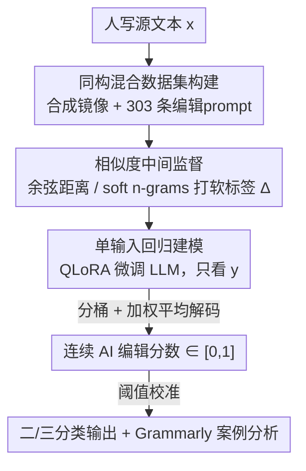

# EditLens: Quantifying the Extent of AI Editing in Text

**会议**: ICLR2026  
**OpenReview**: [https://openreview.net/forum?id=gOkitaPCfZ](https://openreview.net/forum?id=gOkitaPCfZ)  
**代码**: https://github.com/pangramlabs/EditLens  
**领域**: AIGC检测 / AI文本检测 / 作者归属  
**关键词**: AI编辑检测, 混合作者归属, 相似度监督, 回归检测, 内容审核

## 一句话总结
EditLens 不再把文本二分为"纯人写/纯 AI 生成"，而是用轻量相似度指标（余弦距离、soft n-grams）作为中间监督，微调一个回归模型来连续地预测"这段文本被 AI 改了多少"，在二分类（F1=95.6%）和三分类（macro-F1=90.4%）上都刷到 SOTA。

## 研究背景与动机
**领域现状**：现有 AI 文本检测器几乎都把任务框成二分类——一段文本要么"全是人写的"，要么"全是 AI 生成的"，代表方法有 FastDetectGPT、Binoculars、Pangram、GPTZero 等。

**现有痛点**：但 LLM 的真实主流用法早已不是"从零生成"。OpenAI 对 100 万条 ChatGPT 对话的统计显示，约三分之二的写作类请求是让模型**修改用户已有的文本**（编辑、润色、翻译、批评），而非凭空创作。二分类检测器在这种"人机共写"文本上表现很差：Saha & Feizi (2025) 发现，二分类器常把只是被 AI 轻度润色过的人类文本直接判为"AI 生成"，导致大量误报——这在学术诚信等高风险场景里是致命缺陷。

**核心矛盾**：作者区分了两种混合作者文本。**异构混合（heterogeneous）** 文本里每个 token 的作者是清晰可归的（比如人写第一段、AI 写第二段，存在明确边界）；**同构混合（homogeneous）** 文本里作者身份被编辑过程彻底纠缠——人写一段、让 AI 改写，即使 AI 把每个词都换成同义词，人类的思想仍然弥散在每个句子里，无法给任何词或句打上"人/AI"的离散标签。已有工作（边界检测、句级分类、人/AI/混合三分类）要么对同构混合文本根本不适用（边界、句级标签是 ill-posed 的），要么虽能识别"混合"这一类、却无法量化**改动了多少**：是只改了拼写语法，还是整篇被重写重构？这两者被一视同仁。

**本文目标**：直接预测一段同构混合文本里"AI 编辑的程度"，输出一个连续分数，而不是离散类别。

**核心 idea**：用一对（原始人写文本 $x$、AI 编辑后文本 $y$）算出的相似度差异作为"软标签"，把它当作中间监督信号，训练一个**只看 $y$** 就能回归出编辑幅度的检测器。

## 方法详解

### 整体框架
EditLens 的核心是把"AI 编辑了多少"建模成一个 $[0,1]$ 区间的连续标量，并通过"先用相似度造软标签、再蒸馏进一个单输入回归模型"两步走来学习它。

形式化地，编辑后的文本是把一个编辑算子 $E_\lambda$ 作用在原文 $x$ 上的结果：$y = E_\lambda(x; z)$，其中 $z$ 是一串隐含的微编辑序列（增、删、改、重排），$\lambda$ 概括编辑强度。在同构设定下，$z$ 里每一步是人还是 AI 做的并不可观测、训练/推理时也不需要。作者定义一个**改动幅度函数** $\Delta(x,y) = g(\text{sim}(x,y))$，由相似度经单调变换得到（如 $g(s)=1-s$）：两段文本完全相同时 $\Delta=0$，编辑越重 $\Delta$ 越大。

关键在于：真实部署时推理端通常**只有** $y$、拿不到原文 $x$。所以训练时用成对数据 $\{(x^{(i)}, y^{(i)})\}$ 算出目标 $\Delta^{(i)}$，但学的是一个单输入预测器 $f_\theta^{\text{ssi}}: y \mapsto [0,1]$，优化 $\min_\theta \frac1N\sum_i \mathcal{L}(f_\theta^{\text{ssi}}(y^{(i)}), \Delta(x^{(i)}, y^{(i)}))$。该目标的贝叶斯最优解是条件期望 $f^\star(y)=\mathbb{E}[\Delta(X,y)\mid Y=y]$，但模型不去重建 $x$，而是直接从 $y$ 里判别性地吸收"词汇波动、风格漂移、流畅度/一致性线索"来逼近它。整条流水线是：构造同构混合数据集 → 用相似度指标打软标签 → QLoRA 微调 LLM 回归头 → 推理时只喂编辑后文本输出分数。

### 关键设计

**1. 同构混合数据集构建：从无到有造一个"被 AI 改过"的语料**

由于此前没有大规模的同构混合 AI 文本数据集，作者得自己造。先收集纯人写文本（取 2022 年 LLM 普及前的数据以避污染），覆盖 4 个领域：Amazon/Google 评论、Reddit Writing Prompts 创意写作、FineWeb-EDU 教育网文、XSum 与 CNN/DailyMail 新闻，并额外留 Enron 邮件作分布外（OOD）领域。然后对每条人写样本，用 Emi & Spero (2024) 的"合成镜像"流程生成对应的 AI 文本，编辑用 GPT-4.1、Claude 4 Sonnet、Gemini 2.5 Flash，并留 Llama-3.3-70B 作 OOD 模型。编辑指令本身也是数据的一部分：作者让多个 LLM 加人工补写，凑出 **303 条编辑 prompt**（如"修正错误""改写""让它更有描述性"），并把 prompt 按训练/测试/验证切分，防止模型对特定 prompt 过拟合。最终训练/测试/验证集为 60k/6k/2.4k，造数据成本约 \$530。这一步是整套方法的地基——没有覆盖"全谱系编辑强度"的数据，连续回归就无从谈起。

**2. 相似度中间监督：用现成嵌入把"改动幅度"变成可学的软标签**

这是全文最巧的一招：人类没法直接标注"改了百分之多少"，于是作者用两种轻量相似度指标自动算出 $\Delta(x,y)$ 当软标签。第一种是**余弦距离**，即 $1-\cos$，在 Linq-Embed-Mistral（MTEB 上表现强）嵌入空间里算原文与编辑文的距离。第二种是 **soft n-grams**，类似嵌入版 ROUGE 的精确率指标：枚举原文和编辑文中所有长度在 $[a,b]$ 之间的短语（含重叠），对编辑文里每个短语，若它和原文某个短语的余弦相似度超过阈值 $\tau$ 就算"命中"，最终 $\text{soft n-grams} = \frac{\text{命中短语数}}{\text{编辑文短语总数}}$。当 $\tau=1$ 时它退化为普通 n-gram 重叠。选 soft n-grams 是因为它能容忍"AI 把短语换成语义近似词"这种改写，不要求字面精确匹配；但它有个特性是**对删减不变**——单纯删文本仍得分 1。两个指标的合理性靠人工验证：让 7 名标注者两两比较同一文本的两个 AI 编辑版本、选哪个"AI 味更重"，把每个指标当作第 8 个标注者，得到 Krippendorff's $\alpha=0.72$（余弦）和 $0.71$（soft n-grams），说明自动指标与专家感知高度一致。

**3. 单输入回归建模 + 加权平均解码：只看编辑后文本就输出连续分数**

有了软标签，作者用 **QLoRA** 微调 Mistral / Llama 家族 3B~24B 的模型，扫不同规模找在单卡 VRAM 内能跑的最大 backbone。建模上做了两种尝试：直接训一个回归头（MSE loss），或训一个 $n$-way 分类模型——把 $[0,1]$ 按软标签分成 $n$ 个桶，分类后**用加权平均解码而非 argmax** 把类别概率折回一个连续分数。后者保留了"相邻强度桶"之间的有序性和细腻度，比硬 argmax 更能体现渐变。最终最优配置是 24B 的 Mistral Small，做 4-way 分类，分别用余弦和 soft n-grams 监督数据各训一版。这一步把"软标签里编码的编辑幅度知识"蒸馏进一个**推理端只需 $y$** 的判别模型，落地友好。

### 损失函数 / 训练策略
回归版用 MSE 拟合软标签 $\Delta$；分类版做 $n$-way 交叉熵后用加权平均解码还原分数。全程 QLoRA 量化微调以适配单卡，其余架构选择留作未来工作。

## 实验关键数据

### 主实验
EditLens 用验证集校准阈值后，可灵活转成二分类或三分类。在二分类两种设定下都超过所有基线：

| 任务 | 模型 | Acc.(%) | F1 |
|------|------|---------|-----|
| 人 vs. 任意 AI | Pangram | 80.7 | 83.7 |
| 人 vs. 任意 AI | **EditLens (SNG)** | **94.0** | **95.6** |
| 纯 AI vs. AI编辑+人 | Pangram | 92.3 | 89.0 |
| 纯 AI vs. AI编辑+人 | **EditLens (Cosine)** | **96.4** | **94.1** |

三分类（人 / AI 生成 / AI 编辑）上优势更明显，比最好的二分类基线高约 8%、比三分类基线高约 16%（macro-F1）：

| 模型 | 类型 | Acc. | Macro-F1 | AI-Edited F1 |
|------|------|------|----------|--------------|
| Pangram | Binary | 73.0 | 69.5 | 43.2 |
| GPTZero | Ternary | 74.7 | 72.7 | 50.9 |
| **EditLens Cosine** | Regression | **90.2** | **90.4** | **86.8** |

最能说明问题的是 **AI Polish (APT-Eval)** 数据集上的相关性：EditLens 预测分与语义相似度的 Pearson $r=-0.606$、与 Levenshtein 距离 $r=0.799$、与 Jaccard 距离 $r=0.781$，而二分类器 Pangram 与编辑幅度的相关只有 0.491。直观上，Pangram 的预测几乎全挤在 0 或 1，EditLens 则能随润色强度递增平滑抬升分数——这正是"量化程度"而非"判有无"的核心价值。

### 消融与控制实验

| 配置 / 控制 | EditLens 分数 | 说明 |
|------|---------|------|
| 纯人写文本 | 0.009 | 基线，接近 0 |
| 人编辑人写文本（负控） | 0.012 | 与纯人文本几乎无差，说明只抓"AI 编辑"不抓"任何编辑" |
| AI 编辑人写文本 | 0.86 | 显著抬升 |
| 单次 AI 编辑人写文本（正控，分数差） | +0.38 | 人写文本被 AI 改后分数上升 |
| 单次 AI 编辑 AI 文本（正控，分数差） | −0.05 | AI 文本再被 AI 改，本就接近满分，几乎不变 |
| 人编辑 AI 文本（BEEMO 泛化） | −0.33±0.30 | 88.9% 文档分数下降，泛化到反向场景 |

### 关键发现
- **负控最关键**：人编辑人写文本仅得 0.012，与纯人文本（0.009）几乎相同，证明 EditLens 学到的是"AI 编辑特有的风格指纹"而非"是否被改过"——这是它区别于朴素相似度的根本。
- **Grammarly 案例反直觉**：在 1768 条真实 Grammarly 编辑样本上，"修正错误（Fix any mistakes）"被判为最轻微的编辑，而"总结一下""让它更详细"反而是最具侵入性的编辑（改动最大），这与余弦/soft n-grams 分数一致。
- **泛化扎实**：对未见过的 prompt、LLM、领域，以及人编辑 AI 文本（BEEMO）、AI 编辑 AI 文本、多轮编辑都能合理外推。

## 亮点与洞察
- **把"打标签"问题转化成"算相似度"问题**：最聪明的地方是发现"AI 编辑了多少"虽难直接人工标注，却可以用现成嵌入的距离来近似，再用 7 人标注研究反过来验证这个代理标签靠谱（$\alpha\approx0.72$）。这套"自动指标当软标签 + 小规模人工背书"的范式可迁移到任何"程度难标注"的任务。
- **推理端只需单输入**：训练用成对 $(x,y)$ 造标签，推理只看 $y$，绕开了"部署时拿不到原文"这一现实障碍，落地性远好于需要原文对照的方法。
- **加权平均解码保序**：用 $n$-way 分类 + 加权平均而非回归头或 argmax，在保留类别训练稳定性的同时还原出连续、有序的分数，是个值得复用的小 trick。
- **从"判有无"到"量程度"的政策意义**：连续分数让"允许轻度 AI 润色但禁止全 AI 代写"这类弹性政策可被一致执行，并能显著压低误报率——这是二分类器结构上做不到的。

## 局限与展望
- **作者承认**：把编辑压成一维标量是 reductive 的——调语气 vs. 加原创内容是性质完全不同的编辑，EditLens 却一视同仁，只说"改了多少"、说不清"怎么改的"。
- **嵌入未针对任务优化**：用的是检索/分类通用的现成嵌入，未必最贴合"人对 AI 编辑的感知"，可进一步针对检测任务或事实一致性等维度优化。
- **soft n-grams 对删减不变**：纯删文本得分仍为 1，意味着"大幅缩写"这类编辑在该指标下会被低估（虽然余弦距离能部分补偿）。
- **非零错误率的伦理风险**：AI 检测误判可能造成学术指控等严重后果，作者明确只开放非商业用途并谨慎放权。

## 相关工作与启发
- **vs 二分类检测器（FastDetectGPT / Binoculars / Pangram / GPTZero）**：它们只判"人 or AI"，对轻度 AI 润色的人写文本大量误报；EditLens 输出连续程度分，把误报转化为可调阈值。
- **vs 异构混合检测（RoFT / SeqXGPT / PaLD）**：它们做边界检测或 token 级归属，假设作者身份可清晰切分；EditLens 专攻作者身份被编辑纠缠、无法切分的同构混合文本。
- **vs 类别式混合检测（DetectAIve / HERO）**：它们加一个"混合"类别但所有混合文本同等对待、无法量化幅度；EditLens 的连续回归正是补上"量多少"这一维。
- **vs 释义器/humanizer 研究（DAMAGE 等）**：那些工作研究 AI 改写如何削弱检测，EditLens 反过来把"AI 改写幅度"本身作为可检测、可度量的信号。

## 评分
- 新颖性: ⭐⭐⭐⭐⭐ 首个把 AI 编辑量化成连续分数的检测器，问题定义（同构 vs 异构混合）本身就有贡献
- 实验充分度: ⭐⭐⭐⭐⭐ 二/三分类 SOTA + 正负控制 + 多维泛化 + Grammarly 真实案例，证据链完整
- 写作质量: ⭐⭐⭐⭐ 问题动机和形式化清晰，相似度监督一节稍密但可读
- 价值: ⭐⭐⭐⭐⭐ 直击二分类器误报痛点，对学术诚信/内容政策有现实落地价值，且开源数据与模型

<!-- RELATED:START -->

## 相关论文

- [\[ICLR 2026\] TSM-Bench: Detecting LLM-Generated Text in Real-World Wikipedia Editing Practices](tsm-bench_detecting_llm-generated_text_in_real-world_wikipedia_editing_practices.md)
- [\[ACL 2025\] Are We in the AI-Generated Text World Already? Quantifying and Monitoring AIGT on Social Media](../../ACL2025/aigc_detection/aigt_social_media_monitoring.md)
- [\[ICLR 2026\] D&R: Recovery-based AI-Generated Text Detection via a Single Black-box LLM Call](dr_recovery-based_ai-generated_text_detection_via_a_single_black-box_llm_call.md)
- [\[ICLR 2026\] Is Your Paper Being Reviewed by an LLM? Benchmarking AI Text Detection in Peer Review](is_your_paper_being_reviewed_by_an_llm_benchmarking_ai_text_detection_in_peer_re.md)
- [\[ICLR 2026\] All Patches Matter, More Patches Better: Enhance AI-Generated Image Detection via Panoptic Patch Learning](all_patches_matter_more_patches_better_enhance_ai-generated_image_detection_via_.md)

<!-- RELATED:END -->
