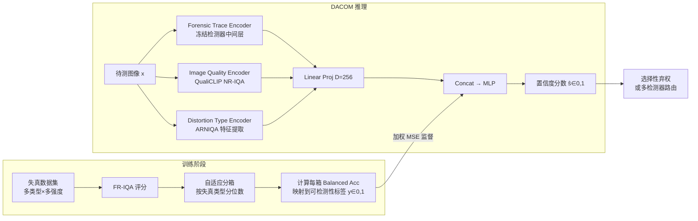

# Enabling Your Forensic Detector Know How Well It Performs on Distorted Samples

**会议**: ICLR 2026  
**OpenReview**: [https://openreview.net/forum?id=Jz5SA2KoFt](https://openreview.net/forum?id=Jz5SA2KoFt)  
**代码**: 待确认  
**领域**: AIGC 检测 / 图像取证  
**关键词**: 图像取证、置信度估计、图像失真、AIGC 检测、多检测器路由

## 一句话总结

提出 DACOM（失真感知置信度模型），让 AI 生成图像检测器能够输出样本级可信度分数，从而在失真严重时主动拒绝决策或将输入路由给更可靠的检测器，解决野外部署中检测器"哑巴式失败"问题。

## 研究背景与动机

**领域现状**：AI 生成图像检测（AIGI Detection）是当前内容安全的核心任务，各类基于 CNN 频域特征的检测器已具备相当精度。  
**现有痛点**：真实部署场景中，图像经过 JPEG 压缩、缩放、模糊、平台传输等失真后，取证痕迹被大幅削弱；而现有检测器仍输出高置信度的二元预测，无法感知自身决策的可靠性——即"哑巴式失败"（silent failure）。  
**核心矛盾**：全参考图像质量评估（FR-IQA）能精确量化失真严重程度并与检测精度高度相关，但测试时无原始参考图像可用；无参考 IQA（NR-IQA）虽可部署却基于人类感知设计，与取证性能相关性弱且不稳定；失真类型本身也会在同等 FR-IQA 分数下产生不同的精度影响。  
**本文目标**：在不访问原始图像的前提下，估计"检测器对当前失真样本能正确预测的概率"。  
**核心 idea**：用 FR-IQA 作为训练时的 oracle 标签，蒸馏出失真程度与检测精度之间的统计关系；推理时融合检测器中间特征、NR-IQA 描述符和失真类型嵌入，实现无参考置信度估计。

## 方法详解

### 整体框架

DACOM 是一个双阶段 pipeline：训练阶段用 FR-IQA oracle 生成逐样本可检测性标签，推理阶段由三路编码器融合特征预测置信度分数，整个过程不依赖原始参考图像。

### 关键设计

**1. FR-IQA 引导的自适应分箱标注：训练时蒸馏 oracle 信息**  
直接用 NR-IQA 分数做标签噪声太大，而 FR-IQA（SSIM/MS-SSIM/FSIM/DISTS）与检测精度呈近单调关系。作者对每种失真类型独立做分位数分箱（type-wise adaptive binning）：将同类失真的 FR-IQA 分数按分位数等频划分为 B 个桶，每桶内计算检测器的 Balanced Accuracy 并映射为可检测性标签 $y_{t,b} = 2\cdot\max(\text{BAcc}_{t,b}-0.5,\,0)$，使得随机猜测对应 0、完美检测对应 1。这样做有两个好处：一是分箱后统计量稳定，单样本噪声被平滑；二是等频分箱使不同失真类型之间样本数均衡，避免高质量图像主导训练。

**2. 三路特征融合：在测试时替代缺失的参考图像**  
推理时无法访问原始图像，DACOM 改为融合三种互补信号：（i）**取证痕迹编码器** $\phi_M$ 从冻结的目标检测器中间层提取特征，感知失真对取证线索的破坏程度；（ii）**图像质量编码器** $\phi_{IQ}$（QualiCLIP）提供自监督训练的无参考质量描述符，捕捉整体感知退化；（iii）**失真类型编码器** $\phi_{DT}$（ARNIQA backbone）识别失真类别，因为同等 FR-IQA 分数下不同失真类型对检测精度影响差异显著。三路特征各自线性投影到 256 维后拼接，经 MLP 回归输出置信度分数 $\hat{s}(x;M)\in[0,1]$，训练目标为加权 MSE（bin 内样本数的倒数为权重）。

**3. 置信度驱动的选择性弃权与多检测器路由：让置信度分数真正落地**  
置信度分数提供两种下游应用：选择性弃权（$\hat{s}$ 低于阈值时拒绝回答，优先保证留存样本的准确率）和多检测器路由（给定一组检测器 $\{M_j\}$，对每张输入图像选择对应 DACOM 分数最高的检测器作为 Top-1 专家）。后者尤为关键——不同检测器在不同失真类型上各有所长，DACOM 的置信度分数充当了动态路由的打分函数，效果远优于基于 logit 的静态校准。

## 实验关键数据

### 主实验（多检测器路由，Seen Distortion）

| 方法 | Average Acc (%) | Worst Acc (%) |
|------|----------------|---------------|
| 最佳单检测器 (C2P*) | 92.63 | 81.10 |
| Logit Calibration | 89.58 | 64.40 |
| DACOM-SSIM（本文） | 95.13 | 90.90 |
| DACOM-DISTS（本文） | **95.37** | **90.90** |

### 多检测器路由（Unseen Distortion）

| 方法 | Average Acc (%) | Worst Acc (%) |
|------|----------------|---------------|
| 最佳单检测器 (C2P*) | 91.52 | 74.90 |
| Logit Calibration | 90.31 | 77.20 |
| DACOM-SSIM（本文） | 92.70 | 84.00 |
| DACOM-DISTS（本文） | **92.97** | **84.00** |

### 置信度相关性验证

| 指标 | DACOM |
|------|-------|
| PLCC（Pearson 线性相关） | **97.73%** |
| SRCC（Spearman 秩相关） | **94.01%** |

### 关键发现

- 选择性弃权带来 **7.66%** 相对精度提升（覆盖率下降约 20% 的情况下）
- 多检测器路由比 Logit 校准基线提升 **5.84%** 绝对精度（Average Acc on Seen Distortions）
- DACOM 在 10 种未见失真类型（直方图均衡化、饱和度调整、WeChat/QQ 平台压缩等）上泛化良好，证明失真类型编码器的有效迁移
- 去掉失真类型编码器后置信度相关性下降最明显，验证失真类型是不可或缺的信号

## 亮点与洞察

- **问题定义清晰**：将"检测器是否可信"形式化为 DAC（Detector's Distortion-Aware Confidence），从"判真假"升级到"量可信度"，是取证系统设计范式的转变
- **FR-IQA 作为蒸馏 oracle**：巧妙地用有参考质量评估在训练期提供强监督，推理期完全不依赖参考图像，填补了 FR-IQA 可用性和 NR-IQA 准确性之间的鸿沟
- **即插即用**：DACOM 只需冻结目标检测器，无需重训检测器本身，可附加到任意已有取证系统
- **失真类型感知**：通过专门的 distortion type encoder 区分失真类型，解决了"同等图像质量分数但不同失真类型导致精度差异"这一关键问题

## 局限与展望

- 标注阶段仍需有参考图像的训练集来构建 oracle 标签，若某种失真在训练集中未覆盖则需重新标注
- 置信度阈值的选择（用于弃权策略）需要人工设定，尚无自适应方案
- 目前以 AIGI 检测为案例，推广到其他取证任务（人脸篡改、深度伪造视频等）还需额外验证
- 多检测器路由假设检测器集合已知且固定，在检测器频繁更新的实际环境中需重训 DACOM

## 相关工作与启发

- **vs 鲁棒性训练（Wang et al., 2020; Tao et al., 2025）**：鲁棒性训练试图让检测器在失真下保持精度，但失真组合爆炸使其难以覆盖所有情况，且未解决置信度估计问题；本文方向互补——无需改动检测器本身
- **vs 置信度校准（Guo et al., 2017）**：标准 Temperature Scaling 等方法假设输入分布平稳，失真会异质性地改变分布，破坏校准假设；DACOM 显式建模失真类型和强度
- **vs 取证可检测性研究（forensicability，Chu et al., 2015）**：已有理论分析数据的内在可检测性，但未与具体检测器性能绑定；DACOM 是检测器条件化的，对同一图像不同检测器会给出不同置信度
- **vs NR-IQA 直接代理（Kim et al., 2024）**：实验证明 NR-IQA 与检测精度相关性弱，不能直接替代取证置信度

## 评分

- 新颖性: ⭐⭐⭐⭐ 将置信度估计与失真感知结合引入取证领域，问题定义和 FR-IQA oracle 蒸馏思路新颖
- 实验充分度: ⭐⭐⭐⭐ 6 个检测器 × 18 种失真（含 4 个社交平台）× 多种 FR-IQA 变体，覆盖全面
- 写作质量: ⭐⭐⭐⭐ 问题分析透彻，三段发现（FR-IQA 相关、NR-IQA 不足、失真类型重要）逻辑严密
- 价值: ⭐⭐⭐⭐ 即插即用设计实用性强，多检测器路由场景有明显部署价值

<!-- RELATED:START -->

## 相关论文

- [\[ICLR 2026\] Is Your Paper Being Reviewed by an LLM? Benchmarking AI Text Detection in Peer Review](is_your_paper_being_reviewed_by_an_llm_benchmarking_ai_text_detection_in_peer_re.md)
- [\[ICML 2026\] ForensicConcept: Transferable Forensic Concepts for AIGI Detection](../../ICML2026/aigc_detection/forensicconcept_transferable_forensic_concepts_for_aigi_detection.md)
- [\[CVPR 2026\] Enabling Supervised Learning of Generative Signatures for Generalized AI-Generated Images Detection](../../CVPR2026/aigc_detection/enabling_supervised_learning_of_generative_signatures_for_generalized_ai-generat.md)
- [\[CVPR 2026\] Learning Where to Look and How to Judge: Resolution-agnostic Image Quality Assessment with Quality-aware Saliency](../../CVPR2026/aigc_detection/learning_where_to_look_and_how_to_judge_resolution-agnostic_image_quality_assess.md)
- [\[ACL 2026\] AEGIS: A Holistic Benchmark for Evaluating Forensic Analysis of AI-Generated Academic Images](../../ACL2026/aigc_detection/aegis_a_holistic_benchmark_for_evaluating_forensic_analysis_of_ai-generated_acad.md)

<!-- RELATED:END -->
