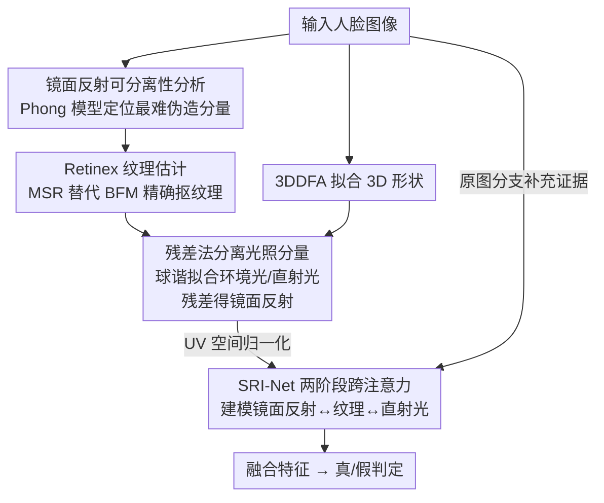

# Exploring Specular Reflection Inconsistency for Generalizable Face Forgery Detection

**会议**: ICLR 2026  
**OpenReview**: [https://openreview.net/forum?id=KwXkLYmZvR](https://openreview.net/forum?id=KwXkLYmZvR)  
**代码**: 无  
**领域**: AIGC检测 / 人脸伪造检测  
**关键词**: deepfake检测, 镜面反射, Phong光照模型, Retinex纹理, 跨注意力

## 一句话总结
这篇论文从人脸成像的物理原理出发，指出 Phong 光照模型里的「镜面反射」分量参数最多、非线性最强、最难被伪造方法复刻，于是用 Retinex 纹理估计精确分离出镜面反射，再用两阶段跨注意力网络 SRI-Net 建模「镜面反射↔纹理↔直射光」三者之间的不一致，在传统 deepfake 和扩散生成 deepfake 上都拿到 SOTA。

## 研究背景与动机

**领域现状**：当前人脸伪造检测主流是两条路线——空间域方法（看像素级的边界瑕疵、重建误差、LBP 等局部纹理痕迹）和频率域方法（用 DCT / 小波把图像拆成高低频去找伪造痕迹），近期还有人直接拿 CLIP 等大模型的预训练特征当判别依据。

**现有痛点**：扩散模型（SDXL、LoRA 等）能合成分辨率更高、纹理更逼真的「整张脸都是假的」伪造图，纹理不一致越来越细微，空间域方法快失效了；不同生成方法的伪造痕迹分布在不同频段，频率域方法泛化性差；而预训练特征缺乏针对伪造任务的领域知识、也不可解释。结果就是面对高质量合成脸时，现有方法检测性能集体下滑。

**核心矛盾**：伪造方法之所以越来越难抓，是因为它们能很好地拟合「容易学」的属性（3D 结构、低频光照），但有一条机器学习的基本约束绕不过去——**参数越多、非线性越强、物理约束越复杂的属性，模型越难从有限数据里学准**（偏差-方差权衡的体现）。现有方法盯的纹理/频率恰恰是伪造方法已经学得不错的部分。

**本文目标**：找到一个「物理上最难复刻、因此最具泛化性」的伪造证据，并把它从人脸图像里精确分离出来、有效地用起来。

**切入角度**：作者把人脸光照按 Phong 模型拆成环境光、直射光、镜面反射三部分。环境光均匀、直射光只跟法线夹角有关，都相对简单；唯独镜面反射 $\langle r_i, v\rangle^n \cdot \mathrm{Dir} * T_i$ 牵涉光线方向、顶点法线、视角方向、材质高光指数、直射光强度、纹理共六个参数，还带指数形式的强非线性——是三者里最难被准确复刻的。

**核心 idea**：把「镜面反射」当作泛化性最强的伪造指纹；不仅看镜面反射本身，还要看它与对应纹理、直射光之间的物理关系是否自洽——真脸三者满足光照物理方程，假脸往往对不上。

## 方法详解

### 整体框架
方法要解决的是「如何把最难伪造的镜面反射精确抠出来，并把它和纹理、直射光的关系用起来判真假」。整条管线是：输入一张人脸图，先用 3DDFA 实时拟合 3D 形状、用 Multi-Scale Retinex 估计精细纹理；在 Retinex 纹理约束下用球谐模型拟合环境光与直射光，再用残差法把镜面反射分离出来；把镜面反射、纹理、直射光三路都展开到 UV 空间归一化方向，送进带两阶段跨注意力的 SRI-Net，逐级建模「纹理↔直射光」「镜面反射↔(纹理-直射光)」的相关性；最后再并上一条原图分支补充未失真的伪造证据，融合后做真/假二分类。

### 关键设计

**1. 镜面反射作为泛化性伪造指纹：在 Phong 模型里挑出最难复刻的物理量**

这一步回应「现有空间/频率痕迹已被高质量伪造抹平」的痛点：与其去抓越来越细的纹理，不如换一个伪造方法本质上学不准的物理量。作者把人脸成像写成 $I_{syn} = R(S, C)$（渲染器、3D 形状、颜色信息），其中 3D 形状几乎不会出错、最易复刻，颜色信息 $C$ 则混合了纹理和光照。再按 Phong 模型把每个顶点的 RGB 展开为

$$C_i = \mathrm{Amb} * T_i + \langle n_i, l\rangle \cdot \mathrm{Dir} * T_i + \langle r_i, v\rangle^{n} \cdot \mathrm{Dir} * T_i,$$

三项分别是环境光、直射光、镜面反射。对比可见前两项参数少、形式线性，而镜面反射一项涉及反射方向 $r_i = 2\langle n_i, l\rangle n_i - l$、视角 $v$、高光指数 $n$ 等六个待估参数，且以指数形式呈现强非线性。因为 Phong 是有明确物理意义的通用模型，「镜面反射最难复刻」这个结论不绑定某种具体伪造方法，对扩散生成等新方法同样成立——所以它携带的是**跨方法泛化**的伪造证据，这正是本文区别于频率域方法（痕迹随生成方法漂移）的根本。

**2. Retinex 纹理估计：替掉 BFM 的 PCA 纹理，让镜面反射抠得又快又准**

要分离镜面反射，先得把光照和纹理分开。传统做法用 3DMM 的 analysis-by-synthesis，纹理由 BFM 的 PCA 模型 $T = \bar{T}_{bfm} + B\beta$ 表示，再迭代优化球谐系数 $\gamma$ 和纹理系数 $\beta$。问题在于 BFM 的 PCA 基只由 200 个 3D 扫描脸做特征分解得到，受降维和线性建模限制，重建不出身份级的精细纹理，真实纹理其实应是 $T = \bar{T}_{bfm} + B\beta + T_{id}$，残差项 $T_{id}$ 被丢掉；而纹理估不准会进一步污染光照估计，尤其会重创最精细的镜面反射。

作者改用 Retinex 理论：图像是光照与反照率之积 $I = L \cdot R$，取对数把乘性关系变加性 $\log I = \log L + \log R$，用高斯低通 $G_\sigma$ 估计平滑变化的光照，反照率即 $\log R = \log I - \log[G_\sigma(I)]$，纹理取 $T_{re} = \log R$。为同时兼顾全局与局部光照，再用多尺度 Retinex（MSR）

$$T_{msr} = \frac{1}{N}\sum_{i=1}^{N}\big(\log I - \log[G_{\sigma_i}(I)]\big),$$

大尺度核抓宽光照梯度、小尺度核补局部细节。把 $T = \bar{T}_{bfm}+B\beta$ 直接替换成 $T_{msr}$ 后，优化目标从同时优化 $\gamma, \beta$ 简化为只优化 $\gamma$，既更准又免去了 $\beta$ 的迭代——单张图的光照/纹理分离从 0.78s 降到 0.29s。注意：Retinex 在人脸取证里前人用过，但他们是把 Retinex 增强图当成新输入模态去找空域瑕疵；本文的新意是**把它当 3D 光照分解的精度工具**，用更准的纹理去约束镜面反射的提取。

**3. 残差法分离镜面反射：用低阶球谐拟合粗光照，残差即镜面反射**

有了 $T_{msr}$ 约束的球谐系数后，怎么从中拿到镜面反射？一个直觉是用高阶球谐基去拟合镜面反射，但高阶系数和 PCA 一样有残差、且计算量暴涨。作者改走残差路线：只用球谐模型的前 9 个基函数 $(H\gamma)_{(1-9)}$ 拟合**粗光照**（环境光 $h_1\gamma_1$ + 直射光 $[h_2\gamma_2,\dots,h_9\gamma_9]$），这 9 个低阶基对细粒度镜面反射不敏感、正好把它「漏」出来，于是

$$\mathrm{SPR} = \big(I - (H\gamma)_{(1-9)} \cdot T_{msr}\big) / T_{msr}.$$

也就是从原图里减掉「粗光照×纹理」的低频成分、再除以纹理归一化，剩下的就是镜面反射。可视化对比显示，用 $T_{msr}$ 约束相比 $\bar{T}_{bfm}$、$\bar{T}_{bfm}+B\beta$ 能在眼周、唇部更干净地剔除身份纹理，得到更符合物理真实的镜面反射。

**4. SRI-Net 两阶段跨注意力：建模镜面反射与纹理、直射光的不一致**

镜面反射的强度由式(2)里光向、法线、视角、高光指数、直射光强、纹理共同决定，所以伪造证据不只在镜面反射本身，更在它与这些属性的相关性里——真脸三者满足物理方程，假脸的相关性会被破坏。由于人脸都是皮肤、相对材质属性可由纹理近似，作者把镜面反射、纹理、直射光三路都展平到 UV 空间归一化方向，再用两阶段带残差的跨注意力建模相关性。第一阶段抓「纹理↔直射光」：

$$f_{td} = \mathrm{Softmax}\!\Big(\frac{f_{tex}f_{dl}^{\top}}{\sqrt{d}}\Big) f_{dl} + f_{tex} + f_{dl},$$

第二阶段再让镜面反射特征 $f_{spr}$ 去查询经中流处理的 $f'_{td}$：

$$f_{std} = \mathrm{Softmax}\!\Big(\frac{f'_{td}f_{spr}^{\top}}{\sqrt{d}}\Big) f_{spr} + f_{spr}.$$

骨干用 Xception。此外因为镜面反射提取过程可能损失原始细节，额外引入一条原图分支补充未失真的伪造证据，最后把镜面反射相关特征与图像特征融合做真/假判定。跨注意力相比简单拼接或 SE-block 通道加权，能动态算出全空间位置间的加权交互，更适合捕捉模态间细微、非局部的不一致。

### 损失函数 / 训练策略
训练集统一用 FF++ c23（轻压缩）版本以贴近真实场景；评测时传统数据集用帧级与视频级 AUC、生成数据集用帧级 AUC，视频级分数由所有帧的帧级分数平均得到。

## 实验关键数据

### 主实验

传统 deepfake 数据集帧级 AUC（%），FF++ c23 训练、跨库测试：

| 方法 | CDF-v1 | CDF-v2 | DFD | Avg |
|------|--------|--------|-----|-----|
| ProDet (NIPS'24) | 90.9 | 84.2 | 84.8 | 86.6 |
| LSDA (CVPR'24) | 86.7 | 83.0 | 88.0 | 85.9 |
| FIA-USA (ARXIV'25) | 90.1 | 86.7 | 82.1 | 86.3 |
| **SRI-Net (本文)** | **91.3** | **87.5** | **89.3** | **89.4** |

生成 deepfake 数据集帧级 AUC（%）：

| 数据集 | 子集均值 | 之前最好 | 本文 |
|--------|---------|---------|------|
| DF40（6 个换脸子集） | Avg | 87.8 (FIA-USA) | **90.9** |
| DiFF（T2I/I2I/FS/FE） | Avg | 83.3 (FIA-USA) | **86.8** |

视频级 AUC 上 CDF-v2 / DFD 也达到 95.5 / 93.1，在仅靠逐帧分数平均、不利用时序依赖的情况下仍领先。

### 消融实验

| 配置 | CelebDF-v2 | DF40 | DiFF | 说明 |
|------|-----------|------|------|------|
| (1) 仅 Img | 72.1 | 74.2 | 66.0 | 只用原图 |
| (2) 仅 SPR | 75.7 | 78.8 | 73.9 | 只用镜面反射，单分支已可观 |
| (3) 仅 MSR | 68.5 | 71.0 | 60.8 | 只用纹理，最差 |
| (4) Img + SPR | 84.5 | 87.2 | 83.9 | 原图+镜面反射 |
| (5) 完整 SRI-Net | **87.5** | **90.9** | **86.8** | +MSR/Dir 跨注意力 |
| (8) $T=T_{bfm}$ | 83.3 | 85.4 | 79.9 | 仅均值纹理约束 |
| (8) $T=T_{msr}$ | 87.5 | 90.9 | 86.8 | Retinex 纹理约束 |
| w/o shape norm | 82.1 | 83.7 | 81.0 | 去掉形状归一化 |
| SE-block 融合 | 86.9 | 88.6 | 84.5 | 替代跨注意力 |
| 拼接融合 | 85.6 | 88.1 | 83.7 | 替代跨注意力 |

### 关键发现
- **镜面反射单分支（SPR）就比原图单分支强**（如 DiFF 73.9 vs 66.0），证明它确实抠出了内在、可泛化的伪造痕迹；而纹理（MSR）单用最差，说明 MSR 的价值不在自身做特征，而在作为精确抽取镜面反射的「约束工具」——对比第(4)(5)行，加入 MSR/Dir 后明显提升。
- **Retinex 纹理约束优于 BFM**：$T_{msr}$ 相比 $T_{bfm}$ 在三个数据集分别提升约 4.2 / 5.5 / 6.9 个百分点，越是生成型数据（DiFF）收益越大。
- **物理驱动带来抗扰动鲁棒性**：在高斯模糊、JPEG 压缩、高斯噪声下 AUC 仅小幅下降（如 DF40 从 90.9 到最低 88.7），因为这些扰动主要损伤高频痕迹，而 SRI-Net 盯的是更深层的光照物理不一致，腐蚀后依然可检测。
- **跨注意力 > SE-block > 拼接**：动态全空间加权交互更能发现模态间细微的非局部不一致。

## 亮点与洞察
- **用机器学习的基本约束反推检测信号**：「参数多、非线性强的物理量最难被有限数据学准」这条偏差-方差直觉，被用来在 Phong 模型里精准定位「镜面反射」这个最脆弱点，思路干净且不绑定具体伪造方法，天然具备对未来新生成模型的泛化性。
- **把 Retinex 从「增强模态」改造成「3D 分解精度工具」**：同样用 Retinex，前人当输入增强、本文当纹理约束，并顺带省掉 $\beta$ 迭代把分离速度提了 2.7 倍，是一个"换用途即换价值"的巧妙复用。
- **从"看分量"升级到"看分量间关系"**：两阶段跨注意力显式建模镜面反射与纹理、直射光的物理一致性，这种「关系级伪造证据」可迁移到任何有物理生成机理的检测任务（如阴影、反射、材质一致性检测）。

## 局限与展望
- 整条管线依赖 3DDFA 形状拟合与球谐/Retinex 光照分解，对大姿态、强遮挡、极端光照下的人脸，3D 拟合和镜面反射分离可能不稳，论文未充分讨论这些极端情形。
- 方法本质针对「人脸 + 光照物理」，对纯非人脸的生成图像、或刻意做了物理一致光照渲染的高端伪造，镜面反射假设的有效性存疑。
- 视频级仅靠帧分数平均，没利用时序物理一致性（如镜面高光随头动的连续变化），这是一个明显可扩展方向。
- 残差法用前 9 阶球谐当「粗光照」是一个工程近似，9 这个阶数与镜面反射纯度之间的权衡缺少更系统的分析。

## 相关工作与启发
- **vs 空间/频率域方法（Face X-ray、F3Net、SRM 等）**：它们抓像素边界或频段痕迹，随着伪造质量提升和痕迹跨方法漂移而失效；本文抓物理光照不一致，跨数据集、跨生成方法更稳，对扩散生成脸优势尤其明显。
- **vs 既有光照检测（Lambertian 假设、角膜/鼻部局部高光）**：前者在 Lambertian 假设下解耦光照，但扩散模型已能生成逼真 shading 削弱其可靠性；本文把假设升级到更物理真实的 Phong 模型，并在 3D 约束下完整、精确地抽取镜面反射分量。
- **vs CLIP 等预训练特征方法（Fada）**：预训练特征缺领域知识、不可解释；本文每一步都有清晰物理含义，可解释性与泛化性兼得。

## 评分
- 新颖性: ⭐⭐⭐⭐⭐ 从 Phong 物理模型反推「镜面反射最难伪造」并建模分量间关系，视角独特且自洽。
- 实验充分度: ⭐⭐⭐⭐ 传统+生成多数据集、帧级/视频级、抗扰动与融合方式消融齐全；缺极端姿态/遮挡的鲁棒性分析。
- 写作质量: ⭐⭐⭐⭐⭐ 物理推导到网络设计一气呵成，公式与可视化支撑充分。
- 价值: ⭐⭐⭐⭐⭐ 面向扩散生成 deepfake 给出物理驱动、可泛化、可解释的检测范式，实用性强。

<!-- RELATED:START -->

## 相关论文

- [\[ICLR 2026\] Preserving Forgery Artifacts: AI-Generated Video Detection at Native Scale](preserving_forgery_artifacts_ai-generated_video_detection_at_native_scale.md)
- [\[CVPR 2026\] Learning Forgery-Aware Lip Representations Without Forgery Priors](../../CVPR2026/aigc_detection/learning_forgery-aware_lip_representations_without_forgery_priors.md)
- [\[CVPR 2026\] PPM-CLIP: Probabilistic Prompt Modeling for Generalizable AI-Generated Image Detection](../../CVPR2026/aigc_detection/ppm-clip_probabilistic_prompt_modeling_for_generalizable_ai-generated_image_dete.md)
- [\[CVPR 2026\] Inconsistency-aware Multimodal Schrodinger Bridge for Deepfake Localization](../../CVPR2026/aigc_detection/inconsistency-aware_multimodal_schrodinger_bridge_for_deepfake_localization.md)
- [\[ICLR 2026\] Semantic Visual Anomaly Detection and Reasoning in AI-Generated Images](semantic_visual_anomaly_detection_and_reasoning_in_ai-generated_images.md)

<!-- RELATED:END -->
