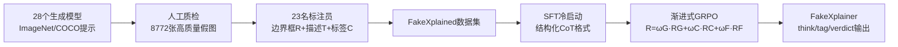

# FakeXplain: AI-Generated Image Detection via Human-Aligned Grounded Reasoning

**会议**: ICLR 2026  
**OpenReview**: [https://openreview.net/forum?id=UcpTOa8OnG](https://openreview.net/forum?id=UcpTOa8OnG)  
**代码**: [https://github.com/Gennadiyev/FakeXplain](https://github.com/Gennadiyev/FakeXplain)  
**领域**: AIGC 检测 / 多模态可解释推理  
**关键词**: AI生成图像检测, 视觉接地推理, MLLM, GRPO, 人类对齐标注, 伪影定位  

## 一句话总结
通过构建带人工标注边界框与描述的 FakeXplained 数据集，并用 SFT + 渐进式 GRPO 微调 MLLM，让模型在检测 AI 生成图像的同时，给出"哪里假、为什么假"的空间接地、人类对齐的解释，做到 98.2% 检测准确率与 36.0% IoU。

## 研究背景与动机
- **领域现状**：AI 生成图像（GAN→Diffusion→DiT）已逼近真实照片，催生大量检测需求。主流方法把检测当作二分类，用 CNN / ViT 抽取判别特征。
- **现有痛点**：传统分类器是黑箱，只给"真/假"标签，既不说明依据，又对分布外（OoD）生成器泛化差；而 MLLM 虽有推理能力却容易**幻觉**——给出无空间接地的笼统理由，或编造不存在的伪影。
- **核心矛盾**：可解释性要求模型回答"where & why"，但缺少**区域级人工标注**的高质量数据集——现有数据集（FakeBench、LOKI、So-Fake-Set 等）要么由 GPT-4V/4o 自动标注（弱接地、易幻觉），要么纯文本无区域定位，要么依赖外挂分割模块（SAM）而没用上 MLLM 自身的接地能力。
- **本文目标**：构建可信、可解释、可泛化的检测系统，既判真假，又**空间定位伪影区域**并给出**人类对齐**的自然语言解释。
- **核心 idea**：**数据驱动的人类对齐接地推理** —— 先用 23 名训练过的标注员为 8772 张 AI 生成图打上「边界框 + 描述 + 标签」的细粒度标注（FakeXplained 数据集），再用**渐进式强化学习**（SFT 冷启动 + pGRPO）把 MLLM 内在的接地能力对齐到人类标注，让解释由人工监督验证而非模型自由发挥。

## 方法详解

### 整体框架
方法分两大件：**FakeXplained 数据集**（图 2a）提供人类对齐的 (边界框, 描述, 标签) 监督信号；**FakeXplainer 训练管线**（图 2b）以 Qwen2.5-VL-Instruct 为底座，先 SFT 冷启动稳定结构化输出，再用渐进式 GRPO 以三种奖励（分类正确性、IoU 接地、格式合法性）对齐人类标注。推理时模型把推理写进 `<think>`、把图像级标签写进 `<tag>`、把最终判定写进 `<verdict>` 标记，输出结构化、可解析、带坐标的解释。

### 关键设计

**1. FakeXplained 数据集：把"假在哪"变成可监督信号。** 作者用 28 个跨架构（Diffusion / GAN / DiT / 自回归）的文生图模型，基于 1000 个 ImageNet 类别与 MS COCO 描述生成图像，人工筛掉无法识别的低质图后保留 8772 张。23 名经标准化培训的标注员对每张假图标出所有"看起来假"的区域——每个区域是一个元组 $(R_i, T_i)$，$R_i$ 是矩形边界框、$T_i$ 是异常描述（如"火烈鸟有三条腿""毛发呈金属质感"），平均每图 5.42 个 $(R_i, T_i)$ 对；同时打互相独立的图像级标签 $C_i$（纹理质量、属性正确性、可识别性等）。质量控制采用宽松的 IoU≥20% 与标签准确率≥1/3 阈值（在 5% 验证子集上对账参考标注），既保证标注保真度又容纳人类对边界的主观差异。真图不标注（因为没有合成缺陷）。

**2. SFT 冷启动：先学会"怎么说"再学"说得准"。** 直接上纯 RL 容易训练不稳，作者借鉴 DeepSeek-Math 先做 SFT。这一阶段微调 MLLM 视觉编码器、投影层、语言模型的全部线性层，重点教模型稳定产出带 `<think>` / `<tag>` / `<verdict>` 三段标记的结构化 Chain-of-Thought，让区域、标签、判定各归其位、可被正则解析。这一步本身对检测指标提升有限（32B 上 73.4%→89.3%），但为后续 RL 提供了格式稳定、不易崩的基座。

**3. 三元奖励 + 渐进式 IoU 加权的 pGRPO：用课程学习避免"碎框刷分"。** RLHF 阶段用 GRPO，总奖励为三项加权和：
$$R = \omega_G(t)\,R_G + \omega_C R_C + \omega_F R_F$$
其中分类奖励 $R_C$ 比对 `<verdict>` 里的判定与真值（对为 1）；接地奖励用松弛 IoU $R_G = \min(1,\ \eta\cdot \mathrm{IoU}(R(o), R_y))$（$\eta=1.1$，容忍标注员对边界的轻微分歧）；格式奖励 $R_F$ 要求 think/tag/verdict 及框、描述都能被正则解析。关键巧思在于**接地权重随训练线性递增**：
$$\omega_G(t) = 0.5 + 0.5\cdot (t/T)$$
而 $\omega_C=\omega_F=1.0$ 恒定。早期压低定位权重，避免模型为刷 IoU 输出大量"碎片化小框"（高分但无意义）；这天然形成课程学习——先学好格式与分类，待技能稳定后再逐步加重定位，连续插值还能避免奖励尖峰、稳住训练。消融证实它优于固定权重方案（含定位优先的 $\omega_G=1$）。

## 实验关键数据

底座 Qwen2.5-VL-Instruct，SFT/GRPO 各 3 epoch，$\eta=1.1$，GRPO 采样数 $G=4$，四折交叉验证。

### 主实验（检测准确率 + 定位 IoU）

| 类别 | FakeXplainer Acc | FakeXplainer IoU | ObjectFormer Acc/IoU | SegFormer Acc/IoU | FakeVLM Acc |
|------|------|------|------|------|------|
| Diffusion | 0.983 | 0.356 | 0.954 / 0.287 | 0.945 / 0.290 | 0.919 |
| GAN | 0.955 | 0.337 | 0.950 / 0.280 | 0.941 / 0.279 | 0.827 |
| DiT | 0.983 | 0.354 | 0.954 / 0.293 | 0.945 / 0.289 | 0.889 |
| Others | 0.978 | 0.348 | 0.953 / 0.369 | 0.944 / 0.287 | 0.870 |
| **Overall** | **0.982** | **0.360** | 0.954 / 0.299 | 0.945 / 0.289 | 0.828 |

检测准确率 98.2%、定位 IoU 36.0%，全面超越所有分割基线与分类基线。

### 不同底座 MLLM + 推理质量（Table 2，下划线为微调后）

| 指标 | InternVL3-8B | MiMo-VL-7B-RL | Qwen2.5-VL-32B | FakeShield | LEGION |
|------|------|------|------|------|------|
| Acc. | 0.584→0.928 | 0.515→0.920 | 0.734→0.982 | 0.801 | 0.583 |
| IoU. | 0.039→0.134 | — | 0.044→0.360 | 0.028 | 0.098 |
| BLEU-2 | 0.061→0.232 | 0.083→0.249 | 0.080→0.267 | 0.004 | 0.072 |
| ROUGE-L | 0.059→0.225 | 0.076→0.239 | 0.076→0.251 | 0.003 | 0.055 |

管线对有/无原生接地能力的多种架构都有一致增益，证明**模型无关性**。

### OoD 泛化（Table 3，Acc）

| 数据集 | FakeXplainer | NPR | DIRE | FakeShield | LEGION |
|------|------|------|------|------|------|
| FakeClue | 0.852 | 0.833 | 0.727 | 0.550 | 0.172 |
| Chameleon | 0.843 | 0.794 | 0.752 | 0.587 | 0.197 |
| GPT-Image-1 | 0.801 | 0.790 | 0.793 | 0.752 | 0.238 |
| FaceForensics++ | 0.864 | 0.861 | 0.850 | 0.773 | 0.395 |
| MMFR-Dataset | 0.874 | 0.569 | 0.624 | 0.710 | 0.193 |

五个 OoD 数据集上全面领先，验证接地推理带来的强泛化。

### 消融实验（Table 4）

| 配置 | Acc | IoU | BLEU-2 |
|------|------|------|------|
| 3B / 7B / 32B | 0.842 / 0.958 / 0.982 | 0.185 / 0.255 / 0.360 | 0.195 / 0.246 / 0.267 |
| No-FT (32B) | 0.734 | 0.044 | 0.080 |
| SFT only | 0.893 | 0.043 | 0.183 |
| GRPO ωG=1 (固定) | 0.937 | 0.265 | 0.257 |
| GRPO ωG=0.5 (固定) | 0.974 | 0.223 | 0.261 |
| no-bbox / no-caption / no-tags | 0.952 / 0.942 / 0.962 | — / 0.265 / 0.358 | 0.164 / — / 0.243 |
| label-only | 0.937 | — | — |

### 关键发现
- **模型尺寸**：3B 连传统方法都打不过且无法定位；7B 已达 95.8% Acc，是性能/速度的平衡点；32B 最佳。
- **两阶段缺一不可**：No-FT 73.4% → SFT 89.3% → +GRPO 98.2%。
- **caption 对定位最关键**：去掉描述使 IoU 掉 9.5%；去框/去描述各掉约 3.5% Acc；标签影响最小。
- **渐进权重 > 固定权重**：固定 $\omega_G=1$ 虽定位优先反而 IoU 更低（后期训不动），证明渐进奖励整形的必要性。
- **接近人类水平**：1525 张非中性投票中，人类标注仅 52.9% 场合被偏好（近平手）；与 LEGION/FakeShield 相比，FakeXplainer 被偏好率高达 99.75%。

## 亮点与洞察
- **把"可解释"落到可监督**：用真人区域级标注做监督，从根上压制 MLLM 的幻觉，让解释由人工验证而非模型自圆其说——这是与依赖 GPT 自动标注的数据集的本质区别。
- **渐进式 IoU 加权是点睛之笔**：发现"等权从头训会刷碎框"这一具体失败模式，并用线性课程优雅化解，是很接地气的工程洞见。
- **不外挂分割模块**：直接激活 MLLM 自身的接地能力输出坐标，比 FakeShield/LEGION 依赖 SAM 的方案更简洁、端到端。
- **结构化标记输出**（think/tag/verdict）让解释天然可解析、可评测，兼顾可读性与可验证性。

## 局限与展望
- **依赖"人类可感知伪影"**：作者自己承认，对于**完全逼真、没有可语义描述缺陷**的合成图，这类方法从原理上失效——这是所有可解释 AIGI 检测器的共性局限，属于另一类检测问题。
- **标注成本高**：23 名标注员、人均培训、平均每图 5.42 框，规模化到更大数据集成本不低。
- **底座/算力门槛**：最佳结果来自 32B + 16×A100 的 GRPO，落地推理成本需权衡（论文给出 7B 折中方案）。
- **生成器演进的军备竞赛**：虽 OoD 泛化好，但面对未来缺陷更少的生成模型，接地伪影线索仍可能逐步失效。

## 相关工作与启发
- **AIGI 检测**：从 CNN/ViT 二分类（Wang 2020, Ojha 2023）到细粒度/局部化检测（多分支、局部内在维度、Grad-CAM），本文补上"区域级人工接地 + 自然语言解释"的空白。
- **可解释检测数据集**：FakeBench（GPT-4V 初标 + 人工精修、纯文本）、LOKI、So-Fake-Set 等，本文 FakeXplained 以全人工区域标注 + 公开发布区别于它们。
- **可解释检测方法**：AIGI-Holmes（NPR+MLLM）、FakeShield、LEGION（依赖 SAM 外挂分割），本文用 MLLM 内在接地能力替代外挂模块。
- **RL 微调推理型 MLLM**：借鉴 DeepSeek-Math 的 SFT→GRPO 范式，并把 IoU 作为结构化奖励引入视觉接地任务，呼应"结构化奖励显著改善多模态对齐"的趋势。
- **启发**：在任何"需要可信解释"的视觉判别任务（医学影像、缺陷检测、内容审核），都可借鉴"人工区域标注 + 渐进式接地奖励"的范式，把模型解释钉死在人类可验证的证据上。

## 评分
- **新颖性**: ⭐⭐⭐⭐ —— 首个把全人工区域级标注、MLLM 内在接地、渐进式 IoU 奖励三者拼成端到端可解释检测管线；单项技术（GRPO、IoU 奖励）非首创，但组合与"碎框"失败模式的渐进式解法有清晰洞见。
- **实验充分度**: ⭐⭐⭐⭐⭐ —— 28 生成器主实验 + 5 个 OoD 数据集 + 多底座泛化 + 完整消融（尺寸/阶段/数据组件/奖励权重）+ 1525 票人类偏好研究，覆盖全面、对照充分。
- **写作质量**: ⭐⭐⭐⭐ —— 动机—痛点—方法逻辑清晰，图 2/3/4/5 信息量大；标记格式与奖励定义交代明确，仅大量表格密度偏高。
- **价值**: ⭐⭐⭐⭐ —— 数据集 + 代码开源，对可信媒体认证、内容审核有直接落地价值；"接地推理优于黑箱分类"的结论对方向选择有指导意义。

<!-- RELATED:START -->

## 相关论文

- [\[CVPR 2026\] Locate-Then-Examine: Grounded Region Reasoning Improves Detection of AI-Generated Images](../../CVPR2026/aigc_detection/locate-then-examine_grounded_region_reasoning_improves_detection_of_ai-generated.md)
- [\[ICLR 2026\] Unveiling Perceptual Artifacts: A Fine-Grained Benchmark for Interpretable AI-Generated Image Detection](unveiling_perceptual_artifacts_a_fine-grained_benchmark_for_interpretable_ai-gen.md)
- [\[ICML 2026\] Dissect and Prune: Enhancing Robustness in AI-Generated Image Detection](../../ICML2026/aigc_detection/dissect_and_prune_enhancing_robustness_in_ai-generated_image_detection.md)
- [\[ICLR 2026\] No Pixel Left Behind: A Detail-Preserving Architecture for Robust High-Resolution AI-Generated Image Detection](no_pixel_left_behind_a_detail-preserving_architecture_for_robust_high-resolution.md)
- [\[CVPR 2026\] PPM-CLIP: Probabilistic Prompt Modeling for Generalizable AI-Generated Image Detection](../../CVPR2026/aigc_detection/ppm-clip_probabilistic_prompt_modeling_for_generalizable_ai-generated_image_dete.md)

<!-- RELATED:END -->
