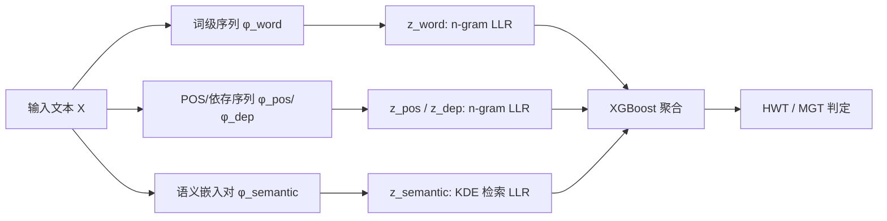

# HLD: Approximate Hierarchical Linguistic Distribution Modeling for LLM-Generated Text Detection

**会议**: ICLR 2026  
**OpenReview**: [https://openreview.net/forum?id=l9mqzHROGu](https://openreview.net/forum?id=l9mqzHROGu)  
**代码**: [https://github.com/nefugr/HLD-Detector](https://github.com/nefugr/HLD-Detector)  
**领域**: AIGC 检测 / LLM 生成文本检测  
**关键词**: LLM 生成文本检测, 分层语言学分布, n-gram, 贝叶斯似然比, 零样本检测, XGBoost  

## 一句话总结
HLD 用 n-gram 在词、句法、语义三个语言学层级上分别估计人写文本(HWT)与机器文本(MGT)的分布，靠贝叶斯对数似然比把多层级差异喂给 XGBoost 做分类，既不依赖代理大模型逼近黑盒源模型的 token 分布，又比单层级方法更鲁棒，在 DetectRL 上刷到 SOTA。

## 研究背景与动机
**领域现状**：LLM 生成文本检测目前分两派——一派是监督式分类器(如 RoBERTa、RADAR)，把文本编码成高维表示后直接二分类，数据内表现强；另一派是零样本检测器(DetectGPT、Fast-DetectGPT、Binoculars 等)，利用 LLM 倾向选高概率 token 这一统计偏好，在 token 概率曲率上做文章。

**现有痛点**：监督式方法本质是在拟合训练分布，一旦测试分布偏移性能就崩，而且决策完全依赖隐状态、可解释性差，是个黑盒。零样本方法虽然可解释，但只用浅层 token 分布，遇到同义词替换/改写攻击就失稳；更关键的是它需要代理模型(proxy model)去逼近源模型的 token 分布——而 GPT、Gemini 这类商用模型是黑盒，代理模型根本对不齐真实分布，且代理推理本身又慢又贵。

**核心矛盾**：LLM 写得太像人，靠**单一特征层级**(无论是 token 概率还是神经嵌入)都难以稳定区分 MGT 与 HWT，而依赖代理模型逼近黑盒分布的路线既不准又昂贵。

**本文目标**：摆脱对代理大模型的依赖，从文本本身用轻量统计方法刻画 MGT 与 HWT 的分布差异，并把这种差异从浅到深地堆叠起来以兼顾性能、泛化和鲁棒性。

**核心 idea**：**分层语言学分布建模 + n-gram 直接估计**——把语言学特征拆成词级、句法级(词性/依存)、语义级三层，每层用 n-gram(配马尔可夫截断)直接从少量离线语料估计 HWT 与 MGT 的条件分布，再按贝叶斯理论算各层对数似然比，最后用 XGBoost 聚合判定，全程不碰代理模型。

## 方法详解

### 整体框架
输入文本经滑动窗口切成"上下文-目标"对，在词、句法(POS/依存)、语义四类语言学特征序列上分别对照 AI 库与人写库计算对数似然比(LLR)，得到 $Z=[z_{\text{word}}, z_{\text{pos}}, z_{\text{dep}}, z_{\text{semantic}}]$ 四维特征，再交由 XGBoost 输出最终决策。所有分布都用 n-gram 从离线语料统计而来，推理时无需调用任何大模型。

### 关键设计

**1. 贝叶斯似然比 + 马尔可夫近似：把"要不要代理模型"这个问题绕过去。** 检测被建模为二分类，按贝叶斯定理和链式法则，类别后验比可分解为每个特征 token 的条件概率比连乘 $\frac{P(Y=1\mid F_j)}{P(Y=0\mid F_j)} \propto \prod_{i=1}^{n}\frac{P(f_i\mid Y=1, f_{<i})}{P(f_i\mid Y=0, f_{<i})}$。问题是全上下文条件概率的估计随长度指数爆炸，于是引入马尔可夫假设，把上下文截断到长度 $k$：$P(f_i\mid Y, f_{<i}) \approx P(f_i\mid Y, f_{i-k:i-1})$。这一步是全文的支点——它让分布可以用 n-gram 从少量样本直接估出来，彻底摆脱"用代理大模型在线逼近黑盒源模型"的旧范式，最终判据落到归一化对数似然比 $z=\frac{1}{n}\sum_{i=1}^{n}\log\frac{\hat P_{\text{HWT}}(f_i\mid f_{i-k:i-1})}{\hat P_{\text{MGT}}(f_i\mid f_{i-k:i-1})}$ 与阈值 $\epsilon$ 的比较。

**2. 词级与句法级 n-gram 建模：从浅层用词到深层结构层层加码泛化。** 词级上，受 Fast-DetectGPT "人和 LLM 在给定上文后选词偏好不同"的启发，HLD 对 MGT/HWT 分别建 n-gram 语言模型，并用加性平滑与回退(back-off)策略处理稀疏：$\hat P_Y(f_i\mid f_{i-k:i-1}) = \frac{C_Y(f_{i-k:i-1}, f_i)+\delta}{C_Y(f_{i-k:i-1})+\delta\cdot|V|}$，当上文计数为 0 时回退到更短的 $(k\!-\!1)$ 阶。句法级则把文本映射成词性(POS)序列和依存(Dep)关系序列，用同样的 n-gram 方式建模——词级抓的是基础用词差异负责把基本分类做对，句法级抓的是更通用的结构规律负责增强跨域泛化，这正解释了后面消融里去掉 word 特征会让跨域性能掉得最狠。

**3. 语义级核密度检索：在连续嵌入空间防住改写攻击。** 词级和句法级都怕同义改写，于是 HLD 借鉴 Dipper 的语义检索思路，把条件概率搬到连续语义空间。直接参数化估计高维分布不可行，作者改用非参数的核密度估计(KDE)思路：先用预训练编码器把文本转成"上下文嵌入-目标嵌入"对，离线为每类构建数据库 $D_Y^{\text{semantic}}$；检测时对查询对检索 $M$ 个最近上下文邻居，按全概率公式做插值 $\hat P_Y^{\text{semantic}}(f_i\mid f_{i-k:i-1}) = \sum_{m=1}^{M}\hat P(f_i\mid f_{i-k:i-1,m,Y})\cdot\hat P(m\mid f_{i-k:i-1})$，其中邻居权重和目标概率都由余弦相似度经温度为 $\tau_{ctx}=0.1$ 的 softmax 核给出。表层词被改了，深层语义分布仍然稳定，这是 HLD 在改写攻击下不崩的根本原因。

**4. XGBoost 聚合多层级证据：让四个层级互补而非简单平均。** 四层 LLR 拼成 $Z\in\mathbb{R}^4$ 后并不简单相加，而是训练一个 XGBoost $f_\theta(Z)=\sum_{s=1}^{S}T_s(Z)$，以 $\hat P(Y=1\mid Z)=\sigma(f_\theta(Z))$ 输出概率、用带正则的二分类交叉熵学习树结构。这样能让不同层级在不同场景下被自适应加权(比如跨域时句法/语义权重更高)，把四个本就互补的维度组合成比任何单层都强的判别器。

## 实验关键数据

### 主实验表格(AUROC %，DetectRL benchmark)

| Detector | Multi-LLM Avg. | Multi-Domain Avg. |
|---|---|---|
| Binoculars* | 83.31 | 86.45 |
| RADAR | 91.91 | 90.95 |
| RAIDAR | 88.48 | 92.61 |
| DPIC | 96.75 | 97.54 |
| RoBERTa-base | 98.24 | 98.94 |
| **HLD (Ours)** | **99.12** | **99.60** |

(* 为零样本方法；多-LLM 覆盖 GPT-3.5/Claude/PaLM-2/Llama-2，多-域覆盖 Arxiv/XSum/Writing/Review。零样本基线平均仅 ~60% 且波动剧烈，如 DetectGPT 在 PaLM-2 上只有 26.72%。)

### 泛化与鲁棒性表格(AUROC %)

| 场景 | 次优基线 | HLD |
|---|---|---|
| 跨域(Train Arxiv → Avg.) | 81.38 (RoBERTa) | **86.61** |
| 跨模型(Train GPT-3.5 → Avg.) | 91.93 (RoBERTa) | **92.46** |
| 对抗攻击 Avg. | 93.03 (DPIC) | **97.85** |
| 改写攻击(Paraphrase) | 大幅下滑 | **97.04** |

### 消融实验(Train Arxiv，Review 域 AUROC %)

| 配置 | Review AUROC |
|---|---|
| 完整 HLD | 91.45 |
| − Word | 84.43 |
| − POS / − Dependency / − Semantic | 均有下降 |

### 关键发现
- 去掉**词级特征**对跨域泛化伤害最大(Review 域从 91.45% 掉到 84.43%)，说明基础用词分布是泛化的底座；去句法/语义也都掉，四层互补且缺一不可。
- 对抗鲁棒性领先第二名(DPIC)绝对 4.82 个点，尤其改写攻击下所有基线大跌而 HLD 仍守住 97.04%，验证了"建模深层结构对抗浅层改动"的设计动机。
- 仅需少量离线语料估分布、推理不调大模型，计算开销显著低于依赖代理模型的零样本路线；在 GPT-5、DeepSeek-R1/V3、Claude-3.5 等新模型上仍保持 SOTA 平均性能。

## 亮点与洞察
- **把"代理模型逼近黑盒分布"这个老大难直接绕开**：用 n-gram 从文本统计分布 + 马尔可夫截断，既回避了对齐黑盒 LLM 分布的困难，又把推理从在线大模型调用降成离线查表，是方法论上最干净的一刀。
- **分层语言学分布是个可解释又能堆叠的好框架**：词/句法/语义对应不同攻击面(用词/结构/改写)，逐层加码同时改善性能、泛化、鲁棒，且每个 token 的 LLR 可画热力图做定性解释，比纯神经黑盒透明得多。
- **语义级用 KDE 检索而非参数化估计**，在高维嵌入空间用非参数插值绕过维度灾难，是防改写攻击的关键且工程上可离线预建库。

## 局限与展望
- **只在 DetectRL 上评测**：虽然覆盖多 LLM/多域/多攻击，但单一 benchmark 仍可能让结论的普适性打折扣，跨 benchmark 验证较少。
- **依赖离线语料的代表性**：n-gram 与语义库都从特定语料估计，若目标域的人写/机器分布与建库语料差异极大(全新写作风格、全新生成器范式)，统计估计可能失真，论文虽测了新模型但建库语料适配成本未深入讨论。
- **句法/语义特征依赖外部工具链**：POS/依存来自 spaCy、语义来自预训练编码器，工具或编码器质量会传导到检测性能，跨语种迁移时这条链路是否成立未验证。
- **马尔可夫截断丢长程依赖**：截断到长度 $k$ 牺牲了全上下文信息，对刻意构造长程一致性来伪装的文本可能存在被规避空间。

## 相关工作与启发
- **零样本检测**(DetectGPT/Fast-DetectGPT/Binoculars/Lastde++)：HLD 继承了"人和 LLM 选词偏好不同"的核心洞察，但用 n-gram 统计替换了代理模型逼近，把可解释性保留下来同时去掉了对源模型的依赖。
- **监督式检测**(RADAR/Ghostbuster/RAIDAR/DPIC/RoBERTa)：HLD 同样训练一个分类器(XGBoost)，但输入是可解释的分层 LLR 特征而非黑盒隐状态，兼得监督方法的性能和零样本方法的透明性。
- **改写防御**(Dipper 的语义检索)：语义级 KDE 检索库的设计直接受其启发，把"检索最近邻防攻击"迁移到了分布估计上。
- **启发**：当源模型是黑盒、代理逼近又贵又不准时，"从输出文本本身用轻量统计刻画分布差异 + 多语言学层级堆叠 + 树模型聚合"是一条值得推广到其他生成内容检测(图像/代码)的范式。

## 评分
- **新颖性**: ⭐⭐⭐⭐ 用 n-gram + 贝叶斯似然比绕开代理模型、并把语言学特征分三层堆叠的组合是新的，单点技术(n-gram/KDE/XGBoost)成熟但拼法巧妙。
- **实验充分度**: ⭐⭐⭐⭐ 多 LLM/多域/三类攻击/跨域跨模型/消融/新模型(GPT-5、DeepSeek)都测了，扎实；扣分在只用 DetectRL 单一 benchmark。
- **写作质量**: ⭐⭐⭐⭐ 动机-方法-实验逻辑顺，公式与架构图清楚，分层叙事易懂。
- **价值**: ⭐⭐⭐⭐ AIGC 检测是刚需，低开销 + 高鲁棒 + 可解释的组合实用性强，对黑盒源模型场景尤其有价值。

<!-- RELATED:START -->

## 相关论文

- [\[ICLR 2026\] DMAP: A Distribution Map for Text](dmap_a_distribution_map_for_text.md)
- [\[ACL 2026\] Beyond the Final Actor: Modeling the Dual Roles of Creator and Editor for Fine-Grained LLM-Generated Text Detection](../../ACL2026/aigc_detection/beyond_the_final_actor_modeling_the_dual_roles_of_creator_and_editor_for_fine-gr.md)
- [\[ICLR 2026\] Learn-to-Distance: Distance Learning for Detecting LLM-Generated Text](learn-to-distance_distance_learning_for_detecting_llm-generated_text.md)
- [\[ACL 2025\] KatFishNet: Detecting LLM-Generated Korean Text through Linguistic Feature Analysis](../../ACL2025/aigc_detection/katfishnet_detecting_llm-generated_korean_text_through_linguistic_feature_analys.md)
- [\[CVPR 2026\] PPM-CLIP: Probabilistic Prompt Modeling for Generalizable AI-Generated Image Detection](../../CVPR2026/aigc_detection/ppm-clip_probabilistic_prompt_modeling_for_generalizable_ai-generated_image_dete.md)

<!-- RELATED:END -->
