# HSIC Bottleneck for Cross-Generator and Domain-Incremental Synthetic Image Detection

**会议**: ICLR 2026  
**OpenReview**: [https://openreview.net/forum?id=msLnKDvhBx](https://openreview.net/forum?id=msLnKDvhBx)  
**代码**: 待确认  
**领域**: AIGC 检测 / 合成图像检测 / 持续学习  
**关键词**: 合成图像检测, HSIC 信息瓶颈, CLIP, 跨生成器泛化, 域增量持续学习, 3DGS 头部 avatar  

## 一句话总结
针对合成图像检测器难以跨生成器泛化、又要随新生成范式不断扩展的问题，本文在 CLIP ViT 中间特征上加一个 HSIC 信息瓶颈损失，把"鉴真无关"的文图对齐语义压掉，并配套一个 HSIC 引导的回放采样策略 HGR，实现 diffusion↔GAN 互相迁移的同时增量适应 3DGS 渲染人脸。

## 研究背景与动机
- **领域现状**：合成图像生成器迭代极快（diffusion、GAN、乃至 3D Gaussian Splatting 渲染的逼真头部 avatar），检测本质是开放世界问题——训练时永远见不到未来的生成器。基于 CLIP 视觉骨干的检测器在 diffusion 与 GAN 之间展现出不错的跨生成器迁移，成为当前主流路线。
- **现有痛点**：CLIP 的特征是为"文图对齐"优化的，其中嵌入了大量与"真/假"无关的 caption 语义。论文用 t-SNE 直接展示：原始 CLIP 特征主要按物体类别聚类，真实样本和合成样本在每个类别簇内混在一起，根本没有沿真/假边界分开。这种 nuisance 语义在纯图像鉴真任务里不仅无用，反而有害。
- **核心矛盾**：实用检测器需要两个能力同时具备——(i) 跨多种生成范式的鲁棒泛化；(ii) 在不灾难性遗忘旧域的前提下持续吸收新合成源。已有 CLIP 检测器满足 (i) 一半却忽视了 nuisance 抑制，更没有针对合成检测的持续学习方案；而 3DGS 渲染人脸又是现有检测器几乎无法可靠识别的新硬骨头。
- **本文目标**：在单一 pipeline 内同时解决"跨生成器泛化"和"域增量适应"，并为后者提供一个真实可用的 3DGS 测试基准。
- **核心 idea**：**用信息论塑形特征**——以 HSIC 作为统计独立度量，逼迫压缩后的潜表示既最大化依赖标签 $y$、又最小化依赖输入 $x$（连同其文图对齐 nuisance），得到"生成器无关却判别力强"的表示；再把同一套 HSIC 相关性度量复用到回放样本的挑选上，做出**紧凑且有代表性的记忆**对抗遗忘。

## 方法详解

### 整体框架
检测器写作 $h_\theta = g_{\theta_g}\circ f_{\theta_f}$：编码器 $f_{\theta_f}$ 把每张图的 CLIP 特征压成紧凑潜码 $z$，分类器 $g_{\theta_g}$ 输出真/假 logit。训练分两步走——先用 HSIC 瓶颈把 CLIP 中间特征重塑成生成器无关的判别表示（解决泛化），再用 HGR 挑选回放样本做域增量适应（解决遗忘）。整套评测按两阶段协议进行：Phase I 只在 diffusion 或 GAN 上训练、在两者并集上测，量化双向跨生成器迁移；Phase II 顺序引入三个 3DGS 头部 avatar 域，边适应边监控旧域精度。

```mermaid
flowchart LR
    A[图像] --> B[CLIP ViT<br/>拼接24个中间层+最终层特征 x]
    B --> C[编码器 f_θf<br/>压缩到潜码 z]
    C --> D[分类器 g_θg<br/>真/假 logit]
    C -. HSIC瓶颈损失 .-> E[min HSIC&#40;x,z&#41;<br/>max HSIC&#40;y,z&#41;]
    C --> F[HGR 回放采样<br/>相关性 + k-center 覆盖]
    F -. 紧凑记忆 .-> G[域增量适应 3DGS]
```

### 关键设计
**1. 中间层 CLIP 特征上的 HSIC 信息瓶颈：把"鉴真"和"语义"解耦。** 这是全文的根。HSIC 是核方法定义的统计依赖度量，经验估计用 V-statistic：$\widehat{\mathrm{HSIC}}(a,b)=\frac{1}{(n-1)^2}\mathrm{tr}(\bar K\bar L)$，其中 $\bar K=HKH$、$\bar L=HLH$ 是中心化的 Gram 矩阵，核取 RBF、带宽用 median heuristic，因而无需建密度模型即可估计任意两组特征的依赖度。与前作 DualHSIC 在 ResNet 所有中间层逐层施加 HSIC 不同，本文把 CLIP ViT 的 24 个中间层 + 最终层特征**先拼接成 $x$**，再压缩为 $z=f_{\theta_f}(x)$，只在这一个紧凑潜空间上施加瓶颈：

$$\mathcal{L}_{\text{HSIC-Bottleneck}}(\theta_f)=\lambda_x\,\widehat{\mathrm{HSIC}}(x,z)-\lambda_y\,\widehat{\mathrm{HSIC}}(y,z)$$

直觉是：$-\lambda_y\widehat{\mathrm{HSIC}}(y,z)$ 项把潜码往标签方向拉，$+\lambda_x\widehat{\mathrm{HSIC}}(x,z)$ 项压掉对输入的冗余依赖（其中就包含文图对齐这类 nuisance）。两项合力让真实图像聚到一起、合成图像聚到一起、跨越物体类别，从而把 CLIP 原本"按类别聚类"的语义结构改造成"按真/假可分"的决策边界。总损失再叠加二元交叉熵：$\mathcal{L}_{\text{total}}=\mathcal{L}_{\text{HSIC-Bottleneck}}+\mathcal{L}_{\text{BCE}}$。

**2. HSIC 引导的回放 HGR：相关性 × 覆盖度的混合打分。** 持续学习这边，作者认为回放法最关键的是"挑哪些样本进记忆"。HGR 按类别 $c\in\{0,1\}$ 独立选样，对每个候选 $i$ 算两个分量：一是 **HSIC 相关性（信息中心度）** $r_i=\lVert\bar K_{i,:}\rVert_2^2$，即该样本在中心化 Gram 矩阵中那一行的能量，越大说明它对整体依赖结构贡献越关键；二是 **k-center 覆盖度** $d_i(t)=\min_{j\in S_{t-1}}\lVert z_i-z_j\rVert_2^2$（首步用到类均值 $\mu$ 的距离），越大说明它离已选集合越远、越能扩展空间覆盖。最终按正则化打分

$$s_i(t)=\big(1-N(r_i)\big)+\lambda_{kc}\big(1-N(d_i(t))\big)$$

贪心地选 $i^\star_t=\arg\min_i s_i(t)$ 直到每类填满 $m_c$ 个样本（$N(\cdot)$ 为归一化，$\lambda_{kc}=0$ 退化为纯相关性选择，越大越偏覆盖）。这样选出的记忆**既包含信息中心样本、又铺开覆盖**，紧凑却能抑制对旧域的遗忘——而且相关性度量直接复用了 HSIC，与瓶颈共享同一套信息论语言。

**3. 三段式 3DGS 头部 avatar 基准：给"渲染假脸"提供持续学习测试床。** 作者自建并标准化了三个 3DGS 渲染数据集，对应三类渲染范式：多视角重建（Gaussian Head Avatar，基于 NeRSemble）、单视角重建（SplattingAvatar）、单图生成式（GAGAvatar，FFHQ 输入做姿态驱动重演）。每个集合提供成对真/合成帧、身份不相交划分和统一预处理。这些 3DGS 渲染图被现有检测器几乎无法可靠识别，因而成为 Phase II 域增量协议里的"新域"，与 diffusion/GAN 共同支撑系统化的跨生成器评测。作者称这是首个逼真 3DGS 合成图像基准。

## 实验关键数据

### 主实验：跨生成器泛化（ACC/AP %，仅列平均 Avg）
- **diffusion 训练（SDV1.4 起）**：在 14 个目标数据集上的平均 ACC——CNNSpot 60.51、LGrad 65.29、UniFD 65.37、NPR 76.50、RINE 64.59、VIB-Net 85.83、本文 91.69、**本文+中间层 93.86**（AP 98.89）。在 GAN 目标和多个 diffusion 目标上提升尤为稳健。

| 方法 | diffusion 训练 Avg ACC | GAN 训练 Avg ACC |
|------|----:|----:|
| VIB-Net | 85.83 | 82.97 |
| 本文（无中间层） | 91.69 | 86.66 |
| **本文 + 中间层** | **93.86** | **91.07** |

- **GAN 训练（ProGAN 起）**：本文+中间层平均 ACC 91.07，对 diffusion 目标迁移大幅改善（如 SDV1.4 98.82、Wukong 98.62），优于所有强基线。

### 域增量适应（mACC/mAP %，六种到达顺序平均，SDV1.4 起，Table 3）

| 方法 | GHA | SA | GAGAvatar | Average |
|------|----:|----:|----:|----:|
| base（不含3DGS） | 66.05 | 64.65 | 50.39 | 88.27 |
| iCaRL | 96.01 | 94.99 | 94.52 | 92.40 |
| CBRS | 95.23 | 96.58 | **96.02** | 92.66 |
| **HGR** | **97.06** | **98.07** | 95.18 | **94.38** |
| Oracle（联合训练） | 94.57 | 98.67 | 94.90 | 93.75 |

HGR 在采样法里总均值最高，**甚至超过非持续的 Oracle**；GHA、SA 上领先，GAGAvatar 上 CBRS 略高。ProGAN 起（Table 4）HGR 同样取得采样法最佳总均值（88.63），并显著提升 GANs 组。预训练 UniFD/RINE 对 3DGS 几乎失效。

### 消融（mACC/mAP %，SDV1.4 / ProGAN）
- 同时开启 HSIC(x,z) + HSIC(y,z) + 中间层特征达到最佳（93.86/91.07）；其中 **HSIC(y,z) 与中间层特征是主要增益来源**（单开 y 项 91.64/87.05，单开中间层 92.22/89.22）。
- 核选择：RBF + median heuristic 带宽最优，作为默认。

### 关键发现
- 把瓶颈施加在**拼接的中间层特征**上比只用最终层更稳更泛化——nuisance 抑制在中间层最有效。
- 信息论塑形（HSIC(y,z)）的单项贡献甚至大于压缩项 HSIC(x,z)，说明"对齐标签"比"压缩输入"更关键。
- 同一套 HSIC 度量横跨"特征塑形"和"回放选样"两个任务，方法学上自洽。

## 亮点与洞察
- **诊断到位**：用 t-SNE 把"CLIP 特征按类别聚类而非真/假聚类"这个痛点可视化得很直接，HSIC 瓶颈前后的对比图把方法动机讲清楚了。
- **一鱼两吃**：HSIC 既做瓶颈又做回放相关性打分，避免引入第二套异质机制，简洁优雅。
- **HGR 超越 Oracle**：采样法均值压过联合训练的 Oracle，说明好的回放选样能在持续学习里逼近甚至超过上界，这是个有意思的结论。
- **填补空白**：首个针对合成检测的持续学习设定 + 首个逼真 3DGS 合成图像基准，对社区有基础设施价值。

## 局限与展望
- **只测 3 域增量**：作者自承 5+ 域、全排列组合会带来阶乘级运算量而未做，长序列下遗忘是否依旧可控存疑。
- **依赖 CLIP 骨干**：方法建立在 CLIP ViT 中间特征上，对其他骨干（DINOv2 等）是否同样有效未充分验证。
- **个别目标偏弱**：Deepfake、Midjourney 等目标上本文并非最优，nuisance 抑制对某些 manipulation 类型收益有限。
- **3DGS 仅头部 avatar**：渲染假图只覆盖人脸 avatar，是否泛化到全身/场景级 3DGS 渲染待考。

## 相关工作与启发
- **CLIP 路线**：UniFD 在冻结 CLIP 特征空间做近邻/线性探针；RINE 取中间编码块表示；VIB-Net 用变分信息瓶颈抑制 task-irrelevant 因子——本文与 VIB-Net 思路相近但换成 HSIC（非参核度量，无需变分近似）。
- **forensic 线索**：LGrad 在梯度空间找生成器无关线索，NPR 用邻域像素关系，DIRE/DRCT 用 diffusion 重建误差——这些是手工/重建型 cue，与本文的信息论特征塑形互补。
- **持续学习**：本文回放选样建立在 iCaRL（类中心 herding）、CBRS（类均衡蓄水池）、k-center（Sener & Savarese）之上，并直接借鉴 DualHSIC 把 HSIC 引入 rehearsal 的思路。
- **启发**：信息论度量（HSIC）作为"通用胶水"可同时服务表示学习和样本选择，这种"一种度量贯穿多个子任务"的设计值得在其他 OOD/持续学习问题里复用。

## 评分
- **新颖性**: ⭐⭐⭐⭐ — 把 HSIC 瓶颈从 ResNet 逐层搬到 CLIP 拼接中间特征、并复用为回放打分，加上首个 3DGS 合成检测基准与持续学习设定，组合新颖；单项技术（HSIC、k-center）成熟。
- **实验充分度**: ⭐⭐⭐⭐ — 双向跨生成器（14+ 目标）、六种到达顺序平均的域增量、完整 HSIC 组件与核/带宽消融，覆盖到位；长序列与多骨干验证欠缺。
- **写作质量**: ⭐⭐⭐⭐ — 动机用 t-SNE 讲得清楚，公式与协议完整，表格信息密度高；部分表格阅读门槛偏高。
- **价值**: ⭐⭐⭐⭐ — 解决了合成检测"跨生成器 + 持续适应"的实用痛点，3DGS 基准对社区有长期价值。

<!-- RELATED:START -->

## 相关论文

- [\[ICLR 2026\] FakeXplain: AI-Generated Image Detection via Human-Aligned Grounded Reasoning](fakexplain_ai-generated_image_detection_via_human-aligned_grounded_reasoning.md)
- [\[ICLR 2026\] Unveiling Perceptual Artifacts: A Fine-Grained Benchmark for Interpretable AI-Generated Image Detection](unveiling_perceptual_artifacts_a_fine-grained_benchmark_for_interpretable_ai-gen.md)
- [\[CVPR 2026\] PPM-CLIP: Probabilistic Prompt Modeling for Generalizable AI-Generated Image Detection](../../CVPR2026/aigc_detection/ppm-clip_probabilistic_prompt_modeling_for_generalizable_ai-generated_image_dete.md)
- [\[ICLR 2026\] No Pixel Left Behind: A Detail-Preserving Architecture for Robust High-Resolution AI-Generated Image Detection](no_pixel_left_behind_a_detail-preserving_architecture_for_robust_high-resolution.md)
- [\[ICLR 2026\] Omni-IML: Towards Unified Interpretable Image Manipulation Localization](omni-iml_towards_unified_interpretable_image_manipulation_localization.md)

<!-- RELATED:END -->
