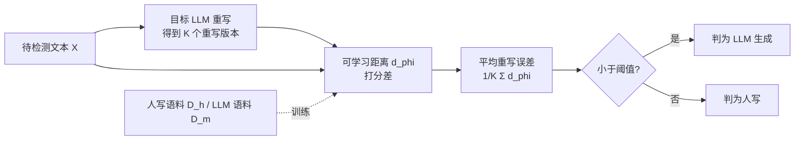

# Learn-to-Distance: Distance Learning for Detecting LLM-Generated Text

**会议**: ICLR 2026  
**OpenReview**: [https://openreview.net/forum?id=2ZUPeEM3FH](https://openreview.net/forum?id=2ZUPeEM3FH)  
**代码**: [https://github.com/Mamba413/L2D](https://github.com/Mamba413/L2D)  
**领域**: AIGC 检测 / LLM 生成文本检测  
**关键词**: rewrite-based detection, 距离学习, 几何视角, 重写误差, 零样本检测  

## 一句话总结
本文用几何投影视角解释了"重写式"LLM 文本检测方法的有效性，并据此提出 L2D——不再用固定距离衡量原文与重写文本的差异，而是自适应地**学习一个距离函数**，在 100+ 个设定上相对最强 baseline 取得 41.5%~75.4% 的平均提升。

## 研究背景与动机
- **领域现状**：被动式（无水印）LLM 文本检测大致分为 logits-based、rewrite-based、其他三类。rewrite-based 方法的核心观察是：让目标 LLM 重写一段文本后，机器生成文本与其重写版本更"接近"，而人写文本的重写误差更大，借此区分二者。
- **现有痛点**：① logits-based 方法（如 DetectGPT、Fast-DetectGPT）依赖边际分布 $\log q(x)$，当文本由**未知 prompt** 生成时条件分布 $\log q(x\mid \text{prompt})$ 与之失配，性能骤降；② rewrite-based 方法虽对 prompt 更鲁棒，但都用**手工固定距离**（N-gram、Levenshtein、BERTScore 等），无法跨不同目标 LLM / 数据集 / prompt 泛化。
- **核心矛盾**：最优距离函数本应随目标 LLM 的生成子空间而变，固定距离天然做不到自适应——对一个模型好用的距离换个模型就退化。
- **本文目标**：先从理论上把 rewrite-based 方法"为什么有效""为什么对未知 prompt 鲁棒"讲清楚，再用一个**可学习**的距离函数取代固定距离。
- **核心 idea**：**自适应距离学习** —— 把"原文 vs 重写文本"的距离参数化为一个可微的语言模型打分差，用人写 / LLM 语料端到端学习它，使人写文本与 LLM 文本的重写误差差距最大化。

## 方法详解

### 整体框架
L2D 沿用 rewrite-based 范式：给定待检测文本 $X$，先用目标 LLM 重写得到 $R(X)$，再度量两者距离作为统计量，距离小判为机器生成。关键区别在于这个距离不是固定的，而是用一个轻量微调的语言模型 $p_\phi$ 参数化，并在人写语料 $\mathcal{D}_h$ 与 LLM 语料 $\mathcal{D}_m$ 上学习，使两类文本的重写误差分布尽可能分开。

### 关键设计

**1. 几何投影视角：把"重写误差更小"证成定理。** 作者把文本嵌入到 Hilbert 空间，设人写文本与 LLM 文本分别落在子空间 $\mathcal{H}$、$\mathcal{M}$，并提出关键假设：LLM 文本分布 $q$ 是人写分布 $p$ 在 $\mathcal{M}$ 上的投影 $\Pi_\mathcal{M}$。重写过程则建模为先投影再加一个落在 $\mathcal{M}$ 内的小扰动，即 $R(x)=\Pi_\mathcal{M}(x)+e$。在此设定下，Proposition 1 证明 $\mathbb{E}_{X\sim p}[d^*(X,R(X))] \ge \mathbb{E}_{X\sim q}[d^*(X,R(X))]$——人写文本的重写误差平均更大，当且仅当 LLM 输出空间完美覆盖人写空间时取等。这把过去靠经验观察的现象第一次给了几何解释。

**2. 对未知 prompt 的鲁棒性证明。** 现实中 LLM 文本常由各种 prompt（"帮我润色""换个说法"）生成，导致分布从 $q$ 漂移到 $q_{\text{prompt}}$，这正是 logits-based 方法失灵之处。Proposition 2 给出下界：只要扰动满足 $|e|\le\epsilon$，则 $\mathbb{E}_{X\sim p}[d^*(X,R(X))]-\mathbb{E}_{X\sim q_{\text{prompt}}}[d^*(X,R(X))] \ge \mathbb{E}_{X\sim p}|X-\Pi_\mathcal{M}(X)|-O(\epsilon)$。也就是说只要重写不破坏语义（$e$ 足够小），即便 prompt 把生成文本"挪了位置"，人写文本的重写误差依然显著更大——解释了 rewrite-based 为何天然抗 prompt 漂移。

**3. 最优距离的形态与软松弛参数化。** Proposition 3 刻画了理想距离 $d_{\text{opt}}$：当原文与重写文本都在 $\mathcal{M}$ 内时取 0，当一个属于 $\mathcal{M}$、另一个属于人写空间时取最大值 $M$。这个最优距离**依赖目标 LLM**（不同 LLM 的 $\mathcal{M}$ 不同），固定距离根本无法逼近。作者据此把距离软松弛为可微形式：
$$d_\phi(X_1,X_2)=\left|\frac{\log p_\phi(X_1)}{\text{len}(X_1)}-\frac{\log p_\phi(X_2)}{\text{len}(X_2)}\right|,$$
其中 $p_\phi$ 是可学习语言模型。该形式满足非负、自反、三角不等式（伪距离），且当 $p_\phi$ 对任意 $X\in\mathcal{M}$ 赋予 $\propto \kappa^{\text{len}(X)}$ 的概率时两段 LLM 文本距离恰为 0，正好对应 $d_{\text{opt}}$ 的硬指示。

**4. 距离学习目标与稳定化推断。** 训练目标是最大化两类语料重写误差的间隔：$\mathbb{E}_{X\sim\mathcal{D}_h}[d(X,R(X))]-\mathbb{E}_{X\sim\mathcal{D}_m}[d(X,R(X))]$。理想的 $p_\phi$ 应当对人写文本赋低概率、对 LLM 文本在 token 间更均匀分布概率——这与"模仿人类、给人写文本高概率"的常规 LLM 恰好相反，所以必须微调而非用预训练模型。实现上用预训练 LLM 初始化 $p_\phi$，仅更新最后一层或用 LoRA 微调以降低开销；推断时为消解重写随机性，对每段文本生成 $K$ 个重写并取平均误差 $K^{-1}\sum_{k=1}^K d(X,\tilde{X}_k)$ 作为最终统计量。

## 实验关键数据

### 主实验（GPT-3.5 Turbo，21 领域 AUC，节选 + 平均）

| 检测器 | RAIDAR | ImBD | **L2D** |
|---|---|---|---|
| AcademicResearch | 0.812 | 0.919 | **0.948** |
| Code | 0.539 | 0.771 | **0.906** |
| PersonalCommunication | 0.653 | 0.755 | **0.922** |
| TechnicalWriting | 0.818 | 0.944 | **0.994** |
| **21 领域平均** | 0.745 | 0.890 | **0.948** |

- 在 21 个领域中，L2D 几乎全面领先，平均 AUC 0.948，相对最强 baseline（ImBD 0.890）仍有显著提升；个别领域相对增益（RG）高达 76.7%~89.4%。

### 消融实验（学习距离 vs 固定距离）

| 设定 | 固定距离（预训练 $p_\phi$） | 学习距离（L2D） |
|---|---|---|
| 平均相对提升 | — | **+96%** |

- 把可学习距离换回未微调的初始预训练模型作为固定距离，性能大幅下降；学习距离带来平均约 96% 的相对提升，直接验证 Proposition 3 的"距离必须自适应"论断。

### 关键发现
- **覆盖广**：24 个数据集、6~7 个目标 LLM（Llama-3-70B、Claude-3.5、GPT-3.5/4o、Gemini 1.5 Pro / 2.5 Flash）、3 类未知 prompt，共 100+ 设定，对 12 个 SOTA baseline 平均相对增益 41.5%~75.4%。
- **抗攻击**：在 paraphrasing 与 decoherence 对抗攻击下比现有方法更鲁棒。
- **公平性把控**：所有 rewrite-based 方法共用同一基座 `gemma-2-9b-it` 与同一组重写文本，微调类方法用同一超参，确保对比公平。

## 亮点与洞察
- **先解释再改进**：用几何投影 + 三个 Proposition 把 rewrite-based 方法"为什么有效""为什么抗 prompt 漂移""为什么需要学距离"逐一证成，理论动机非常完整，不是堆 trick。
- **可学习距离的巧妙参数化**：用语言模型打分差构造伪距离，既满足距离公理，又是最优硬指示距离的连续松弛，让原本组合式的最优形态变得可微可优化。
- **"反向 LLM"直觉**：理想 $p_\phi$ 要给人写文本低概率、给 LLM 文本均匀概率，与常规 LLM 目标相反，解释清楚了为什么非微调不可。

## 局限与展望
- 理论依赖较强的几何假设（LLM 文本是人写文本在子空间上的投影、重写=投影+小扰动），真实嵌入空间是否严格满足值得推敲。
- 需要目标 LLM 可被调用来生成重写文本与构造 $\mathcal{D}_m$，对完全黑盒 / 不可访问的目标模型适用性受限。
- 距离学习需对每个目标 LLM 微调 $p_\phi$，跨模型迁移与"一套距离打天下"的可行性尚未充分探讨。

## 相关工作与启发
- **rewrite-based 谱系**：RAIDAR、L2R、ImBD 等用重写误差或微调重写模型，本文的差异在于学的是"距离"而非"重写器"。
- **logits-based 对照**：DetectGPT / Fast-DetectGPT 揭示了 prompt 漂移下边际分布失配问题，正是本文几何视角要解决的痛点。
- **启发**：把"检测统计量该长什么样"先用理论刻画出最优形态，再用可微模型做软松弛去逼近，是一个值得迁移到其他检测 / 度量学习任务的范式。

## 评分
- 新颖性: ⭐⭐⭐⭐ 几何投影视角 + 可学习距离的组合在 rewrite-based 检测中是新颖且自洽的贡献。
- 实验充分度: ⭐⭐⭐⭐⭐ 24 数据集 / 7 LLM / 100+ 设定 / 12 baseline / 对抗攻击 / 消融，覆盖极广且公平性把控到位。
- 写作质量: ⭐⭐⭐⭐ 理论与方法衔接清晰，三个 Proposition 层层递进，叙述完整。
- 价值: ⭐⭐⭐⭐ 在 AIGC 检测这一高需求方向给出兼具理论解释与强性能的方案，代码开源，实用价值高。

<!-- RELATED:START -->

## 相关论文

- [\[ICLR 2026\] TSM-Bench: Detecting LLM-Generated Text in Real-World Wikipedia Editing Practices](tsm-bench_detecting_llm-generated_text_in_real-world_wikipedia_editing_practices.md)
- [\[ICLR 2026\] HLD: Approximate Hierarchical Linguistic Distribution Modeling for LLM-Generated Text Detection](hld_approximate_hierarchical_linguistic_distribution_modeling_for_llm-generated_.md)
- [\[ACL 2025\] Learning to Rewrite: Generalized LLM-Generated Text Detection](../../ACL2025/aigc_detection/learning_to_rewrite_generalized_llm-generated_text_detection.md)
- [\[ACL 2026\] GigaCheck: Detecting LLM-generated Content via Object-Centric Span Localization](../../ACL2026/aigc_detection/gigacheck_detecting_llm-generated_content_via_object-centric_span_localization.md)
- [\[ACL 2025\] KatFishNet: Detecting LLM-Generated Korean Text through Linguistic Feature Analysis](../../ACL2025/aigc_detection/katfishnet_detecting_llm-generated_korean_text_through_linguistic_feature_analys.md)

<!-- RELATED:END -->
