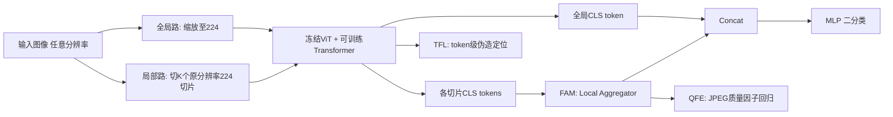

# No Pixel Left Behind: A Detail-Preserving Architecture for Robust High-Resolution AI-Generated Image Detection

**会议**: ICLR 2026  
**OpenReview**: [https://openreview.net/forum?id=9QQ3Kc2hj6](https://openreview.net/forum?id=9QQ3Kc2hj6)  
**代码**: 待确认  
**领域**: AIGC 检测 / 图像取证 / 高分辨率视觉  
**关键词**: AI 生成图像检测, 高分辨率, 全分辨率切片, 特征聚合, JPEG 鲁棒性, 伪造定位  

## 一句话总结
提出 HiDA-Net：用「全局缩略图 + 覆盖全图的原分辨率切片」双路输入，配合特征聚合、token 级伪造定位和 JPEG 质量因子估计三件套，做到"不漏掉任何一个像素"，在高分辨率 AI 生成图像检测上大幅刷新 SOTA。

## 研究背景与动机
- **领域现状**：AI 生成图像（AIGI）检测的主流做法是把图像缩放或中心裁剪到 224×224 喂给标准骨干网（CLIP/CNN），在低分辨率自动生成数据集上训练评估。
- **现有痛点**：网上真实流传的生成图是高分辨率、精修甚至超分过的，与训练分布严重不匹配。在 Chameleon 这类高分辨率基准上现有方法几乎全线崩到 60% 以下。作者把崩溃归因为两点——**输入退化**（Input Degradation）：缩放等价于在频域截断 DFT 只保留中心低频系数，**不可逆地抹掉了最能指示生成痕迹的高频指纹**；裁剪虽保留高频但只看局部少数区域，丢掉其余像素证据。**有限泛化**（Limited Generalization）：真假图 JPEG 压缩历史不一致，模型学成"压缩检测器"而非"合成检测器"；局部 inpainting 伪造又要求细粒度空间感知。
- **核心矛盾**：要看清高频生成痕迹必须保留原分辨率全部像素，但标准骨干网只吃固定低分辨率 → "全像素覆盖" vs "固定输入尺寸" 的冲突。
- **本文目标**：构建一个既不丢任何像素、又能对抗局部伪造和压缩噪声的高分辨率检测框架，并提供一个真正贴近真实分布的高分辨率基准。
- **核心 idea**：**全覆盖切片 + 聚合**——把整图切成若干 224×224 原分辨率切片**集体覆盖全图**（频域上多切片可重构完整频谱），用聚合模块融合局部细节与全局语义；再叠加两个辅助任务把"压缩"和"合成"解耦。

## 方法详解

### 整体框架
HiDA-Net 是一个双路检测器：**全局路**把整图缩放到 224×224 提供语义上下文，**局部路**把整图切成 K 个原分辨率 224×224 切片保留高频细节，两路共享一个**冻结的 ViT 骨干 + 轻量可训练 Transformer 精炼层**。所有切片与全局图的 [CLS] token 由特征聚合模块（FAM）融合做最终二分类，并联合训练 token 级伪造定位（TFL）与 JPEG 质量因子估计（QFE）两个辅助任务。

### 关键设计

**1. 全覆盖切片的频域理论依据：为什么裁剪能留住高频。** 这是全文动机的数学地基。缩放在频域等价于对 DFT 做中心截断，$Y[r_1,r_2]=\frac{M_1 M_2}{N_1 N_2}X[r_1,r_2]$ 只保留 $|r_1|<M_1/2,|r_2|<M_2/2$ 的低频区，外圈高频被**永久丢弃**。而裁剪一个切片等价于乘以窗函数 $W_k$，由卷积定理 $\mathcal{F}\{P_k\}=\mathcal{F}\{I\}*\mathcal{F}\{W_k\}$，窗函数的 Dirichlet 核会把**包括高频在内的所有频率成分扩散（spectral leakage）到整个频谱**，所以局部切片里仍藏着高频证据。更进一步，把整图划成 $n_0\times n_1$ 块，整图 DTFT 可由各切片 DTFT 经相位平移精确重构 $X=\sum_{a,b}e^{-j(\omega_1\Delta^{(1)}_a+\omega_2\Delta^{(2)}_b)}Y_{(a,b)}$——这就证明了**只要切片集合覆盖全图，就能保住完整频谱信息**，正是"no pixel left behind"的理论保证。

**2. 特征聚合模块 FAM：把变长切片细节融进全局语义。** 推理时按 $N=\lceil L/P\rceil$ 沿每维生成切片、最后一块贴边对齐（$x_N=L-P$）做到无缝全覆盖，训练时则随机采 $K\in[1,16]$ 个切片增强鲁棒性。FAM 收集所有切片的 [CLS] token 组成变长序列，前置一个可学习输出 token $t_{out}$ 送进轻量 Transformer 聚合器 $f_{detail}=\text{LocalAggregator}([t_{out},t^1_{cls},\dots,t^K_{cls}])[0]$，再与全局 [CLS] 拼接 $f_{final}=\text{Concat}(f_{global},f_{detail})$ 经 MLP 出二分类概率。这种变长 Transformer 聚合比 B-Free / TextureCrop 那种"各切片独立预测再平均"更能捕捉切片间的全局一致性，也让检测精度随切片数单调上升（1→16 块从 92.14% 涨到 96.10%）。

**3. token 级伪造定位 TFL：对局部 inpainting 的细粒度感知。** 针对局部伪造，作者用 **Random Patch Swap（RPS）** 增强：把一对真/假图（或随机真图与随机假图）按比例互换部分区域，合成出真假混合图，每个 ViT patch token 据其覆盖像素的二值标签均值得到软标签 $y_{token}\in[0,1]$。对所有非 [CLS] token 用共享线性头 + Sigmoid 预测伪造概率，损失为全 token 的平均 BCE $L_{tfl}=\frac{1}{M_{total}}\sum_{k,i}\text{BCE}(p^k_{token,i},y^k_{token,i})$。这让模型不仅判"整图真假"，还能定位"哪块被改"，从而对 AI inpainting 这类局部篡改保持鲁棒。

**4. JPEG 质量因子估计 QFE：把压缩噪声从生成痕迹里解耦出来。** 真假图压缩历史不一致会诱导模型学成压缩检测器。QFE 用富含高频、最受压缩影响的聚合局部特征 $f_{detail}$ 回归 JPEG 质量因子 $q_{pred}=\text{MLP}_{qf}(f_{detail})$。由于部分图被压缩后又存成 PNG 无法读元数据，作者用预训练的 FBCNN 估计器提供监督 $q_{true}$，损失 $L_{qfe}=\text{MSE}(q_{pred},q_{true})$。这迫使模型显式认出网格状量化伪影，把"内容/合成痕迹"与"压缩噪声"分开。总损失 $L_{all}=L_{cls}+\alpha L_{tfl}+\beta L_{qfe}$（默认 $\alpha=\beta=1$）。

## 实验关键数据

### 主实验
骨干为冻结的 CLIP ViT-L/14，切片 224×224，训练随机切 1–16 块、推理全覆盖。

| 基准 | 评测设置 | 前 SOTA | HiDA-Net | 增益 |
|------|----------|---------|----------|------|
| Chameleon | 全 GenImage 训练 (Acc) | 65.77 (AIDE) | **79.10** | +13.3% |
| HiRes-50K | 全 GenImage 训练 (Avg Acc) | 71.87 (SPAI) | **80.33** | +8.5% |
| GenImage | SDv1.4 训练 (Avg Acc) | 95.8 (C2P-CLIP) | **97.1** (含 VAE) | +1.3% |
| DRCT | SDv1.4 训练 (Avg Acc) | 96.6 (DRCT/SDv2) | **98.4** | +1.8% |

在 HiRes-50K 上随分辨率升高，SPAI 等方法逐步掉点，HiDA-Net 保持稳定（>5000px 仍 69.84%，多数区间 78–88%），凸显其高分辨率优势。

### 消融实验

| 切片数 (FAM) | 1 | 2 | 4 | 8 | 16 | FAM(1–16) |
|------|---|---|---|---|---|---|
| Acc (%) | 92.14 | 93.34 | 95.63 | 95.69 | 95.89 | **96.10** |

| 模块组合 | FAM | FAM+TFL | FAM+QFE | ALL |
|------|-----|---------|---------|-----|
| Acc (%) | 93.92 | 94.36 | 94.73 | **96.10** |

| 分支 | No Global | No Local | ALL |
|------|-----------|----------|-----|
| Acc (%) | 94.75 | 91.88 | **96.10** |

### 关键发现
- **切片越多越准**：FAM 让精度随覆盖切片数单调上升，验证"全像素覆盖"价值；局部分支贡献远大于全局分支（去掉局部掉到 91.88%）。
- **两辅助任务正交有效**：TFL、QFE 单加各 +0.4/+0.8%，全开 +2.2%，说明空间定位与压缩解耦互补。
- **强鲁棒性**：在 JPEG 压缩、高斯模糊、缩放、高斯噪声扰动下精度衰减平缓（噪声 std=0.01 仍 88.23%），QFE 显著拉高低质量 JPEG 下的曲线。

## 亮点与洞察
- **"无损覆盖"有理论支撑**：用 DFT 截断 vs 窗函数频谱泄漏 + 多切片相位重构，把"缩放丢高频、裁剪留高频、全覆盖留全频谱"讲成了可证明的频域命题，而不只是经验观察。
- **冻结骨干 + 轻量聚合**：复用冻结 CLIP ViT，只训练精炼层、聚合器和几个头，工程上可扩展到任意分辨率（推理时按需切片数随分辨率自适应）。
- **直击数据集偏置**：QFE 正面回应"模型学成压缩检测器"这一取证领域顽疾，HiRes-50K 还在构造时对齐真假图的尺寸与 JPEG 压缩级别，从数据侧消除快捷捷径。
- **新基准填空白**：HiRes-50K 共 50,568 张、长边从 <1K 到 >10K（最高 64 兆像素），来自真实 AIGI 社区且人工筛"人眼难辨"样本，比 Chameleon 更大更高清。

## 局限与展望
- 推理时高分辨率图要切很多块并逐块过 ViT，**计算/显存随图像面积线性增长**，超大图（64MP）成本不低，论文未充分讨论效率—精度权衡。
- QFE 依赖外部 FBCNN 估计 JPEG 质量作伪标签，监督质量受限于该估计器本身的准确度。
- 在 Mix Set（最高约 1MP）上仅略低于 SPAI 0.2%，说明方法的优势主要体现在真正的高分辨率场景，对低分辨率提升有限。
- TFL 依赖 Random Patch Swap 合成的混合图，与真实多样的 inpainting/编辑手法之间仍可能存在分布差距。

## 相关工作与启发
- **特征提取路线**：UnivFD/C2P-CLIP 走冻结 CLIP + 缩放（压制高频）；PatchCraft/AIDE/TextureCrop/SAFE 走纹理/频率选块裁剪（只看局部）；B-Free 多切片独立平均。本文以"端到端聚合全切片 + 全局上下文"统一两条线。
- **重构式检测**：DIRE/Aeroblade/DRCT 用扩散重构残差或 VAE 重构误差造难例；本文借鉴其 VAE 重构 + 随机切片交换造 token 级标签的思路服务 TFL。
- **泛化研究**：呼应"压缩历史错配"（Grommelt 等）与"源模型/提示快捷捷径"（Zheng 等）的偏置分析，用 QFE + 对齐基准对症下药。
- **启发**：在任何"高分辨率细节关键但骨干受限"的任务（医学影像、遥感、伪造取证）中，"全覆盖切片 + 变长聚合 + 频域保真证明"是一种可迁移范式。

## 评分
- 新颖性: ⭐⭐⭐⭐ — 全覆盖切片本身不算全新，但"频域可证明的无损覆盖 + FAM 变长聚合 + TFL/QFE 双辅助解耦"组合到位，动机清晰。
- 实验充分度: ⭐⭐⭐⭐⭐ — 五大基准（Chameleon/HiRes-50K/GenImage/DRCT/Mix）+ 多种扰动鲁棒性 + 完整消融，还自建高分辨率基准，证据扎实。
- 写作质量: ⭐⭐⭐⭐ — 动机—理论—方法—实验逻辑顺畅，频域推导是亮点；图表略密集。
- 价值: ⭐⭐⭐⭐ — 切中高分辨率 AIGI 检测真实痛点，SOTA 增益显著（Chameleon +13%），HiRes-50K 基准对社区有长期价值。

<!-- RELATED:START -->

## 相关论文

- [\[ICLR 2026\] Preserving Forgery Artifacts: AI-Generated Video Detection at Native Scale](preserving_forgery_artifacts_ai-generated_video_detection_at_native_scale.md)
- [\[ICLR 2026\] FakeXplain: AI-Generated Image Detection via Human-Aligned Grounded Reasoning](fakexplain_ai-generated_image_detection_via_human-aligned_grounded_reasoning.md)
- [\[ICLR 2026\] Unveiling Perceptual Artifacts: A Fine-Grained Benchmark for Interpretable AI-Generated Image Detection](unveiling_perceptual_artifacts_a_fine-grained_benchmark_for_interpretable_ai-gen.md)
- [\[ICML 2026\] Dissect and Prune: Enhancing Robustness in AI-Generated Image Detection](../../ICML2026/aigc_detection/dissect_and_prune_enhancing_robustness_in_ai-generated_image_detection.md)
- [\[ICLR 2026\] CLARC: C/C++ Benchmark for Robust Code Search](clarc_cc_benchmark_for_robust_code_search.md)

<!-- RELATED:END -->
