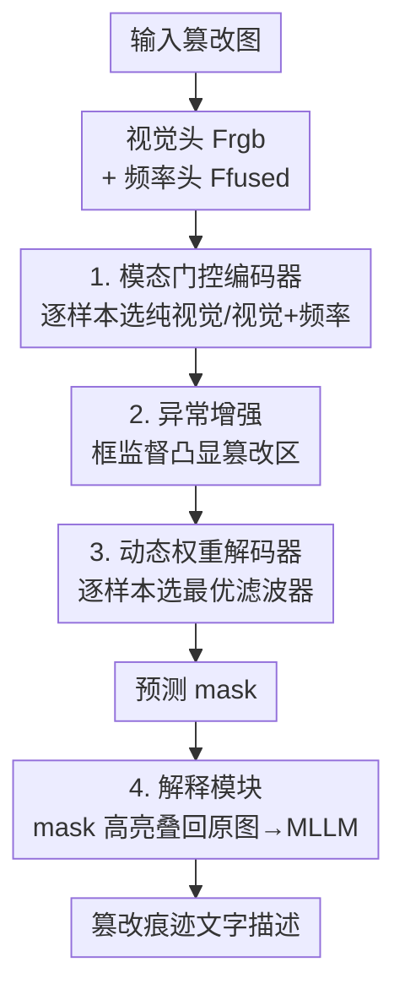

# Omni-IML: Towards Unified Interpretable Image Manipulation Localization

**会议**: ICLR 2026  
**OpenReview**: [https://openreview.net/forum?id=jBJkP5Fv0m](https://openreview.net/forum?id=jBJkP5Fv0m)  
**代码**: https://github.com/qcf-568/OmniIML  
**领域**: 图像取证 / 篡改定位 / 多模态VLM  
**关键词**: 图像篡改定位、通用模型、模态门控、动态权重、可解释取证

## 一句话总结
本文提出 Omni-IML——第一个能用**单个模型**同时在自然图像、文档、人脸、场景文字四大篡改定位（IML）任务上达到 SOTA 的通用模型，靠"模态门控编码器 + 动态权重解码器 + 异常增强"三个样本自适应模块解决联合训练掉点问题，并配套构建 Omni-273k 数据集与可解释模块，用自然语言描述篡改痕迹。

## 研究背景与动机
**领域现状**：图像篡改定位（Image Manipulation Localization, IML）要在像素级标出图像里被 PS/拼接/AI 生成的区域。目前主流做法是为每一类图像（自然图、文档、人脸、场景文字）单独设计专用模型——自然图依赖边缘异常增强和物体注意力，文档依赖视觉-频率早融合，人脸依赖度量学习或噪声滤波。

**现有痛点**：这种"一任务一模型"的模式维护成本极高，而且换个图像类型就失效。最直接的补救——把所有任务的数据放在一起联合训练——反而会带来**全任务明显掉点**：例如 HiFi-Net 联合训练后掉得太厉害，只能为自然图和人脸分别保留两套参数；TIFDM 在文档任务上单训 IoU 0.498，联合训练后掉到 0.428，掉了 7 个点。

**核心矛盾**：联合训练失败的根因有两个。其一，现有方法严重依赖**任务专属设计**——为自然图设计的边缘增强、噪声滤波在文档上几乎没用（文档边缘伪影不明显、物体特征不突出），文档用的频率融合搬到噪声丰富的自然图上又会严重退化。其二，现有方法**缺少区分不同任务篡改特征的机制**：各类篡改线索差异巨大（自然图看对比度/边缘，文档看频域 DCT 不连续，人脸看纹理不自然），一套固定参数的模型会被这些五花八门的特征搞混。

**本文目标**：造一个不依赖任务专属设计、能在四大 IML 任务上同时达到 SOTA 的通用模型，并进一步让它能用自然语言解释篡改痕迹。

**切入角度**：与其为每个任务硬塞专用模块，不如让模型**对每个输入样本自适应地选择**最优的编码模态和解码参数——既然不同图像类型需要不同处理，那就把"选择"这件事交给模型按样本动态决定。

**核心 idea**：用样本级自适应（模态门控 + 动态权重）替代任务专属设计，再用框级监督的异常增强抑制联合训练噪声，从而把"一任务一模型"统一成"一个通用模型"。

## 方法详解

### 整体框架
Omni-IML 分两个独立训练的部分：**定位模块**（左，编码器-解码器结构，输出像素级篡改 mask）和**解释模块**（右，一个 MLLM，输出自然语言的篡改痕迹描述）。

定位模块的数据流是：原图先分别过**视觉感知头**得到视觉特征 $F_{rgb}$、过**频率感知头**得到频率特征，二者用 conv 融合得 $F_{fused}$；$F_{rgb}$ 和 $F_{fused}$ 各自再生成一个粗预测 mask（$P_{rgb}$、$P_{fused}$）。**模态门控**观察这四者，逐样本判断该用纯视觉还是视觉+频率作为后续编码输入。选定的特征过 backbone 提多尺度高层特征，中间插一个**异常增强模块**用框监督凸显篡改区，最后送进**动态权重解码器**输出最终 mask。解释模块则把这张预测 mask 高亮叠回原图作为视觉提示，连同原图喂给 MLLM 生成痕迹描述。

### 关键设计

**1. 模态门控编码器：让模型逐样本决定要不要用频率特征**

频率特征对 IML 通用模型是把"双刃剑"——它能帮助发现视觉上完全一致的篡改（如文档里改过的文字，视觉看不出但频域 DCT 不连续），但当图像本身高度失真/噪声大时（很多自然图、人脸），频率特征反而会拉低性能。所以纯视觉和视觉+频率都无法在所有任务上稳定最优。模态门控（Modal Gate）是一个由几层卷积构成的二分类器：把 $F_{rgb}$、$F_{fused}$ 和它们各自的粗预测 $P_{rgb}$、$P_{fused}$ 沿通道拼接后输入，通过观察 $F_{fused}$ 的噪声水平、以及哪个粗预测更自信更准确，来判定该用 $F_{fused}$ 还是 $F_{rgb}$ 作为编码器输入。这等于把"频率到底帮不帮忙"这个判断从人工先验改成了模型按样本自动识别，从根上避免了文档专属频率融合被错误地套到噪声大的自然图上。

**2. 异常增强：用框监督凸显篡改区、学到任务无关特征**

不同图像类型的特征本就差异巨大，联合训练把更多噪声引入特征、让模型困惑。异常增强模块（Anomaly Enhancement）插在编码器和解码器之间，引入一个新颖的**框级监督**：用区域候选网络（RPN）+ RoI Align + BBox 头在训练时显式定位篡改框，增强被篡改区域的特征对比度。注意这部分（图中黑线）只在训练时存在、推理时移除，因此不增加推理开销。它的作用是抑制特征噪声、降低联合训练时的模型混淆，从而把跨域的共性篡改特征（任务无关特征）学得更干净——消融里去掉它平均 IoU 掉 4.6 点。

**3. 动态权重解码器：让解码器滤波器按样本"换刀"**

各类篡改线索导致编码后篡改区特征分布极广，解码器若只用一套固定滤波器，在统一训练下会被多样特征搞混。动态权重解码器（DWD）先把低层特征自顶向下与高层特征融合得到多尺度特征 $F_{1,2,3,4}$，对 $F_1$ 平均池化得全局向量 $V_g$；多尺度特征降维后过一串不同膨胀率的**动态权重滤波器（DWF）**。每个 DWF 先对输入特征平均得当前全局表示 $V_c$，再让 $V_c$ 与全局图像向量 $V_g$ 经全连接层交互，按 $A_i=\sigma(\mathrm{FC}(V_c,V_g))$ 给四个常规卷积核加权求和得到样本专属滤波器 $D_{opt}=\sum_{i=1}^{4} A_i \ast W_i$，再对输入做深度卷积 + $1\times1$ 点卷积。这样每张图都拿到一套"量身定制"的解码滤波器。消融显示 DWD 是贡献最大的模块——去掉它平均 IoU 掉 12.0 点；即便保留 DWD 结构但让权重对每个输入都固定（w.o. DW），也比完整模型低 4.0 点，证明"按样本选最优权重"本身有效。

**4. 解释模块：用高亮 mask 当视觉提示，引导 MLLM 看对地方**

要让模型不只定位、还能用语言解释，直接把篡改图丢给 MLLM 描述（如 FakeShield 的做法）在多目标、难样本（如篡改文档）上常把篡改区认错。本文把定位模块预测的 mask 高亮叠回原图构造视觉参考提示 $I_{ref}=(I_{input}+I_{mask})/2$，再把 $I_{ref}$ 与原图沿最长边拼接喂给 MLLM。之所以用半透明高亮而非直接给二值 mask，是因为在密集文字/密集人脸场景里相邻实例位置太接近、二值 mask 会有歧义。这个设计不改 MLLM 原结构，因而也能减少过拟合与遗忘。它把不同基座 MLLM（InternVL3、Qwen2.5-VL 等）的取证解释能力都显著拉高（见实验）。

### 损失函数 / 训练策略
定位模块和解释模块**完全独立训练**。定位侧的监督包含最终 mask 的分割损失、两个粗预测的辅助损失，以及异常增强分支的框检测损失（RPN/BBox，仅训练时）。解释侧用 Omni-273k 的结构化标注对基座 MLLM 做监督微调。

## 实验关键数据

### 主实验
单个 Omni-IML 在四大任务上同时取得 SOTA 平均表现（像素级 IoU）：

| 任务 | 数据集（部分） | Omni-IML | 之前最好 | 说明 |
|------|------|------|------|------|
| 自然图 IML | 平均（5 个集） | **.612** | APSC-Net .552 | 跨 CASIA1/Coverage/NIST16 等 |
| 文档 IML | DT-FCD | **.863** | DTD .749 | 视觉一致篡改靠频率 |
| 人脸 IML | OpenForensics | **.923** | MoNFAP .902 | uncut deepfake |
| 场景文字 IML | 平均（T-IC13/OSTF） | **.610** | ConvNeXt .543 | 任意风格场景文字 |

最关键的对照是"单任务训练 vs 全任务联合训练"（Table 3，平均 IoU）：

| 模型 | 单训各任务能力 | 联合训练平均 | 联合掉点情况 |
|------|------|------|------|
| TIFDM (Doc) | 文档 .498 | .533 | 文档掉 7.0 点 (.498→.428) |
| MoNFAP (Face) | 人脸 .902 | .552 | 跨任务严重退化 |
| **Omni-IML** | 各任务均强 | **.728** | 文档仅掉 0.8 点 (.774→.766) |

专用模型联合训练后平均只能到 .4~.6，而 Omni-IML 联合训练平均达 .728，且文档任务联合训练几乎不掉点，验证了"样本自适应 + 噪声抑制"对抗联合训练退化的有效性。

### 消融实验

| 配置 | 平均 IoU | 相对完整模型 |
|------|---------|------|
| Baseline（无任何模块） | .575 | −15.3 |
| w.o. MG（强制视觉+频率融合） | .629 | −9.9 |
| w.o. MG*（强制纯视觉） | .659 | −6.9 |
| w.o. DWD | .608 | −12.0 |
| w.o. DW（保留结构、权重固定） | .688 | −4.0 |
| w.o. AE | .682 | −4.6 |
| **Omni-IML（完整）** | **.728** | — |

可解释性侧（Table 6），把本文视觉提示加到各基座 MLLM 上，文档篡改文字识别等指标大幅提升：Qwen2.5-VL 7B 在文档上的文字识别/绝对位置/相对位置从 .312/.381/.429 跳到 .653/.576/.698，痕迹描述从 .521 升到 .689。

### 关键发现
- **DWD 是头号功臣**：去掉它掉 12.0 点，远超其他模块；说明"逐样本换解码滤波器"是统一多任务的核心。其中"按样本动态选权重"本身贡献 4.0 点（w.o. DW 对照）。
- **模态门控两面验证**：强制纯视觉掉 6.9 点（说明频率在文档等场景确实有用），强制融合掉 9.9 点（说明频率在噪声样本上确实有害）——只有让门控逐样本决定才两头都不亏。
- **视觉提示对难场景增益最大**：在多目标、密集文字的文档场景，FakeShield/SIDA 因冻结 SAM/LISA + 低分辨率 LLaVA(336) 表现差，而本文方法把多种基座 MLLM 都显著提升，体现通用性。

## 亮点与洞察
- **把"任务专属设计"换成"样本自适应选择"**：这是全文最巧的思路转换——不为每个任务堆模块，而是让模型按样本自己选模态/选滤波器，天然规避了"为 A 设计的东西在 B 上失效"的死结，对任何需要统一异构任务的场景都有借鉴价值。
- **框监督只在训练时用**：异常增强用 RPN/BBox 在训练时凸显篡改区、推理时直接移除，零推理开销地把跨域共性特征学干净，是一种"训练增强、推理零成本"的实用 trick。
- **半透明高亮 mask 当视觉提示**：$I_{ref}=(I_{input}+I_{mask})/2$ 比直接喂二值 mask 更适合密集实例场景，且不改 MLLM 结构、减少遗忘——可迁移到任何"先定位再让 VLM 解释"的两段式流水线。
- **CoT 三步标注 + 结构化 JSON**：把"逐实例识别 → 聚焦描述 → 自我检查"拆开避免 GPT-4o 在多目标时串台，再用结构化字段让闭集字段（位置/痕迹标题）用精确匹配、开集字段（痕迹描述）用模糊匹配，解决了旧无结构标注"识别全错也能拿高 ROUGE 分"的评测失真问题。

## 局限与展望
- 异常增强依赖**框级标注**，对只有 mask 或弱标注的数据集需额外处理（框可由连通域近似，但精度受限）。
- 解释模块与定位模块**完全独立训练**、串行级联，定位 mask 出错会直接误导后续语言描述，二者没有端到端联合优化的纠错回路。
- Omni-273k 的文本标注由 GPT-4o 自动生成，虽经 CoT 自检，但在极难样本上仍可能残留幻觉；论文未给出标注的人工核验准确率上界。
- 覆盖四大主流 IML 任务，但对视频篡改、3D/新型生成式篡改（如扩散修补）等更新场景的泛化未验证。

## 相关工作与启发
- **vs FakeShield / SIDA（可解释 IML）**：它们冻结 SAM/LISA、基座 LLaVA 分辨率仅 336 且不擅长非英文文字，在多目标文档/场景文字上失效；本文用可训练定位模块 + 半透明视觉提示，能适配多种现代 MLLM 且在难场景大幅领先，且 FakeShield 像素级定位仍局限自然图、并非真正的通用模型。
- **vs HiFi-Net（人脸 IML）**：HiFi-Net 因联合训练掉点只能对自然图/人脸各留一套参数；Omni-IML 用一套参数靠样本自适应同时覆盖四任务，联合训练几乎不掉点。
- **vs 文档专用频率融合（如 DTD/Qu et al.）**：这类早融合在文档上强、搬到噪声大的自然图上严重退化；本文用模态门控逐样本决定是否启用频率，保留了频率优势又规避了它的副作用。

## 评分
- 新颖性: ⭐⭐⭐⭐⭐ 首个统一四大 IML 任务的通用模型，样本自适应思路把任务专属设计彻底替换，方向清晰。
- 实验充分度: ⭐⭐⭐⭐⭐ 四任务主结果 + 单训/联合训练对照 + 完整消融 + 多基座可解释性评测，且自建大规模数据集。
- 写作质量: ⭐⭐⭐⭐ 动机推导和模块对应清楚，但部分模块细节压在附录，正文略简。
- 价值: ⭐⭐⭐⭐⭐ 一个模型替代多套专用模型，显著降低真实部署的维护成本，并配套数据集推动可解释取证。

<!-- RELATED:START -->

## 相关论文

- [\[ICLR 2026\] RelayFormer: A Unified Local-Global Attention Framework for Scalable Image and Video Manipulation Localization](relayformer_a_unified_local-global_attention_framework_for_scalable_image_and_vi.md)
- [\[ICLR 2026\] Unveiling Perceptual Artifacts: A Fine-Grained Benchmark for Interpretable AI-Generated Image Detection](unveiling_perceptual_artifacts_a_fine-grained_benchmark_for_interpretable_ai-gen.md)
- [\[ICLR 2026\] FakeXplain: AI-Generated Image Detection via Human-Aligned Grounded Reasoning](fakexplain_ai-generated_image_detection_via_human-aligned_grounded_reasoning.md)
- [\[ICLR 2026\] HSIC Bottleneck for Cross-Generator and Domain-Incremental Synthetic Image Detection](hsic_bottleneck_for_cross-generator_and_domain-incremental_synthetic_image_detec.md)
- [\[ICLR 2026\] No Pixel Left Behind: A Detail-Preserving Architecture for Robust High-Resolution AI-Generated Image Detection](no_pixel_left_behind_a_detail-preserving_architecture_for_robust_high-resolution.md)

<!-- RELATED:END -->
