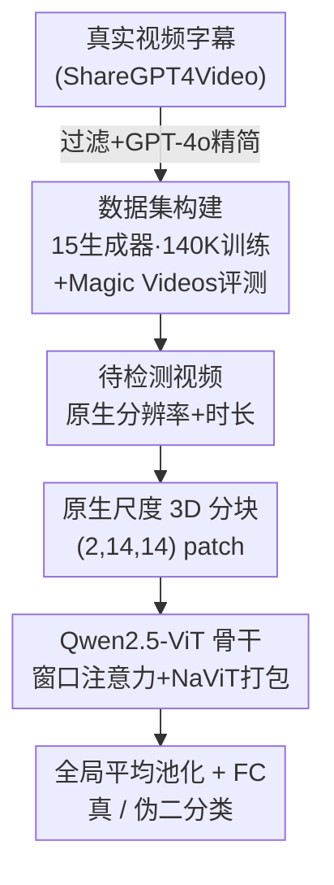

# Preserving Forgery Artifacts: AI-Generated Video Detection at Native Scale

**会议**: ICLR 2026  
**OpenReview**: [https://openreview.net/forum?id=XD43lfRCg6](https://openreview.net/forum?id=XD43lfRCg6)  
**代码**: https://github.com/mgiant/Qwen2.5ViT-AIGVDetection  
**领域**: AI 生成内容检测 / 视频理解  
**关键词**: AI 生成视频检测、原生分辨率、伪造痕迹、Qwen2.5-ViT、数据集构建

## 一句话总结
针对现有 AI 生成视频检测器普遍把输入帧缩放/裁剪到固定低分辨率（如 224×224）从而破坏关键伪造痕迹的问题，本文提出一套"原生尺度"检测框架——基于 Qwen2.5-VL 的视觉 Transformer 直接以任意原始分辨率和时长处理视频，并配套构建了覆盖 15 个生成器的 14 万级训练集和高真实度的 Magic Videos 评测基准，在多个 benchmark 上刷新 SOTA。

## 研究背景与动机
**领域现状**：随着 Sora、Wan、可灵等扩散/DiT 视频生成模型逼近照片级真实度，检测 AI 生成视频成为对抗虚假信息的刚需。现有检测器大多沿用图像伪造检测的范式：先把每帧 resize 或 crop 到固定低分辨率（典型 224×224），再喂给 CNN / CLIP-ViT / TimeSformer 等骨干提取特征做二分类。

**现有痛点**：伪造检测依赖两类线索——**细微的局部痕迹**（像素级高频伪影）和**全局语义不一致**。而固定分辨率预处理对两者都是破坏性的：resize 改变原始宽高比，逼着检测器去学"表面分布差异"而非可泛化的伪造特征；crop 会丢弃选区外的全局语义内容；而无论 resize 还是 crop，下采样都会抹掉对识别合成内容最关键的像素级高频伪影。

**核心矛盾**：作者通过跨生成器交叉验证实验（图 1）挖出两条经验规律。其一，检测器在与训练集**分辨率不同**的视频上评测时性能显著下滑——说明现有方法严重依赖分辨率这种表面统计量。其二，检测性能与**生成器质量**（VBench 分数）呈强正相关（Pearson ρ=0.86）——越逼真的生成器反而能提供越可迁移的训练数据。这两点共同指向：固定分辨率预处理 + 过时低质数据集，是当前检测器泛化差的根源。

**本文目标**：构建一个对分辨率漂移和生成器差异都鲁棒的统一检测框架，同时配套现代化、高质量、多样化的数据。

**切入角度**：既然预处理是元凶，那就干脆**取消固定下采样**，让模型原生处理任意空间分辨率和时间长度的视频，把高频伪影和时空不一致完整保留下来。Qwen2.5-VL 的视觉 Transformer 天然支持变分辨率/变时长输入，正好作为骨干。

**核心 idea**：用"原生尺度（native-scale）处理"代替"固定分辨率预处理"来保住伪造痕迹，并用覆盖最新 15 个生成器的高质量数据训练，从而获得跨生成器的强泛化检测能力。

## 方法详解

### 整体框架
本文的贡献分两条腿走路：一是**数据侧**——构建一个覆盖 15 个先进生成器、约 14 万视频的训练集，外加一个专为评测超真实合成内容设计的 Magic Videos 基准；二是**模型侧**——基于 Qwen2.5-ViT 搭一个原生分辨率检测框架，输入视频不做任何 resize/crop，直接做 3D patchify 后过 Transformer，末端接一个轻量分类头输出"真/伪"。整体 pipeline 是：真实视频 → 提炼字幕 → 喂给生成器产出合成视频（构成数据）；待检测视频 → 原生分辨率 3D 分块 → Qwen2.5-ViT 编码 → 全局平均池化 → FC 分类头 → 真/伪。

### 关键设计

**1. 原生尺度 3D 分块：不缩放、不裁剪地保留高频伪影**

这一设计直接针对"固定分辨率预处理抹掉伪造痕迹"这个核心痛点。传统 ViT 把每帧独立 resize 到 224×224 再切 patch，本文沿用 Qwen2.5-VL 的处理方式，把输入视频张量 $V \in \mathbb{R}^{T \times H \times W \times C}$ 按 $(P_t, P_h, P_w) = (2, 14, 14)$ 切成**非重叠的 3D patch**，再经线性投影矩阵 $E$ 得到嵌入序列：

$$X^{(0)} = \text{Unfold}(V; P_t, P_h, P_w)^{T} \cdot E$$

关键在于"原生"二字——分块在**原始分辨率和原始时长**上进行，不做 resize/padding，宽高比保持不变。这样像素级纹理伪影和帧间时序不一致都在 patch 粒度被原样保留，而不是在下采样里被平均掉。把分块同时扩展到时间维（$P_t=2$）也让模型能捕捉视频特有的时序伪影，这是静态图像检测器做不到的。

**2. Qwen2.5-ViT 骨干 + 高分辨率高效化：让变长输入既保真又跑得动**

光保留原生分辨率会带来注意力的二次复杂度爆炸，所以骨干本身的工程优化是这套方案能落地的前提。Qwen2.5-ViT 由 32 层 Transformer 组成，采用 pre-norm（RMSNorm 在注意力和 FFN 前）、SwiGLU 激活，并对 query/key 施加 **2D 旋转位置编码（RoPE）** 以增强跨分辨率的外推能力：

$$\hat{X}^{(l)} = X^{(l-1)} + \text{Attention}(\text{RMSNorm}(X^{(l-1)})), \quad X^{(l)} = \hat{X}^{(l)} + \text{FFN}_{\text{SwiGLU}}(\text{RMSNorm}(\hat{X}^{(l)}))$$

为应对高分辨率的算力开销，框架集成了三项优化：借鉴 NaViT 的 **batch packing** 把变长序列打包、免去 padding 和 attention mask；配合 **Flash Attention** 让 GPU 感知序列边界；并采用混合注意力——绝大多数层用 112×112 窗口注意力，使算力随 patch 数**线性**而非二次增长。正是这套优化让"原生分辨率"从理论可行变成工程可训。

**3. 轻量分类头 + 三种微调策略：把通用视觉骨干适配成伪造判别器**

末端的判别非常简洁：取最后一层 Transformer 的输出 token 做**全局平均池化**得到固定维特征向量，再过一个全连接层输出"real / generated"两类 logits。围绕如何适配预训练骨干，作者对比三种微调方式：**Full Finetuning**（骨干+分类头联合训练）、**Linear-Probing**（冻结骨干只训分类头，作 baseline）、**PEFT/LoRA**（往冻结骨干注入低秩矩阵只更新少量参数）。消融显示全量微调效果最好，说明伪造检测需要骨干特征也跟着任务走，而非仅靠通用视觉表征。

**4. 现代化数据构建：用最新生成器拉齐训练与评测的"真实度"**

模型再好也救不了过时数据——这是动机里"检测性能正比于生成器质量"的直接回应。训练侧汇集 VBench、Movie Gen 及多个开源/商用模型，共约 14 万视频（70K 真 + 70K 假），真实视频采自 MSVD、Kinetics、Panda-70M。评测侧构建 **Magic Videos** 基准：以 ShareGPT4Video 的高质量字幕为种子，聚焦风景、建筑、人物互动等易被滥用的高真实度场景，按时长（3–12 秒）和字幕长度（<1000 字符）过滤，再用 GPT-4o 把描述精简到 500 字符以内，喂给 Wan2.1、Hailuo、Seedance、StepVideo 等 6 个前沿生成器产出近乎以假乱真的视频。这样训练和评测都对齐到当下 AIGC 的真实度水平，避免"在老数据上虚高、遇新生成器崩盘"。

### 损失函数 / 训练策略
用二元交叉熵损失训练 5 个 epoch，AdamW 优化器；全量微调学习率 $1\times10^{-5}$，PEFT 为 $1\times10^{-4}$。每帧在 (min_pixels, max_pixels) 预算内保持宽高比缩放到最高可行分辨率，实验取两档分辨率范围 (224×224, 720×720) 与 (224×224, 448×448)。时序按 2 fps 解码，训练随机采样连续 $T=8$ 帧，评测取中心 $T=8$ 帧。

## 实验关键数据

### 主实验
在 Magic Videos（test）与 Movie Gen（val）上按生成器逐项报告 ACC 并取平均（mACC）。Qwen2.5-ViT 拿下最高 mACC，明显领先图像检测方法和 deepfake 方法。

| 方法 | 训练数据 | mACC | mAP |
|------|---------|------|-----|
| RINE† | ldm | 49.47 | 46.00 |
| Effort† | SD 1.4 | 62.79 | 78.60 |
| NPR | 15Model-140K | 71.74 | 88.82 |
| X-CLIP-L/14 | 15Model-140K | 80.63 | 94.39 |
| Moon-ViT | 15Model-140K | 76.60 | 89.66 |
| **Qwen2.5-ViT (Ours)** | 15Model-140K | **83.20** | 93.28 |

跨数据集泛化（同一权重直接迁移评测）：

| 基准 | 指标 | 本文 | 次优 |
|------|------|------|------|
| DVF-Test | AUC | **97.6** | 95.4 (TimeSformer) |
| GenVideo-Val | Overall ACC | **96.64** | 96.14 (DeMamba-CLIP) |
| DeepTraceReward | ACC | **97.2** | 92.9 (GPT-4.1) |

在 DeepTraceReward 上，本文 97.2% 大幅超过 GPT-5（90.7%）、Gemini 2.5 Pro（84.3%）等通用大模型，且 Fake ACC 96.3% / Real ACC 98.2% 相当均衡，说明没有过拟合到特定训练生成器。

### 消融实验
固定空间分辨率为 dynamic[224p,448p] 做时序与微调消融，报告 Magic 与 GenVideo 平均 ACC。

| 维度 | 配置 | Magic | GenVideo | Avg |
|------|------|-------|----------|-----|
| 空间 | random crop 224p | 62.62 | 93.50 | 78.06 |
| 空间 | random resize 224p | 73.69 | 95.52 | 84.61 |
| 空间 | dynamic [224p,448p] | 81.19 | 96.01 | 88.60 |
| 空间 | dynamic [224p,720p] | 83.20 | 96.64 | **89.92** |
| 时序 | T=2 | 71.15 | 94.70 | 82.93 |
| 时序 | T=8 | 81.19 | 96.01 | **88.60** |
| 微调 | LP | 70.60 | 91.91 | 81.26 |
| 微调 | LoRA(r=16) | 78.73 | 94.95 | 86.84 |
| 微调 | full | 81.19 | 96.01 | **88.60** |

### 关键发现
- **原生分辨率是涨点主力**：从 crop 224p（78.06）→ resize 224p（84.61）→ dynamic[224p,720p]（89.92），逐级提升，且增益主要体现在高分辨率的 Magic 上（62.62→83.20，+20.6），而低分辨率短时长的 GenVideo 对下采样不敏感（提升有限）——印证了"高频伪影被下采样抹掉"的核心论点。
- **更多帧更好**：T=2→T=8 在 Magic 上 71.15→81.19，时序信息对捕捉视频伪影确有帮助。
- **全量微调 > LoRA > LP**：伪造检测需要骨干特征随任务调整，仅训分类头（LP）明显掉点。
- **图像检测器迁移到视频普遍失效**：RINE、FatFormer、B-Free 等即便在视频数据上训练也表现平平，说明图像伪影与视频时空伪影存在本质差异。

## 亮点与洞察
- **"取消预处理"本身就是方法**：不少检测工作在设计花哨模块，本文反其道而行，指出固定分辨率预处理才是泛化瓶颈，靠原生尺度处理把被丢掉的高频线索捡回来——简单但切中要害。
- **两条经验规律有指导价值**：分辨率不匹配导致性能崩、生成器质量与可迁移性强正相关（ρ=0.86），这两点不仅支撑本文设计，也为后续"该用什么数据训检测器"提供了实证依据。
- **工程优化让原生分辨率可落地**：NaViT batch packing + Flash Attention + 窗口注意力把二次复杂度压成线性，是"原生尺度"从想法变成可训框架的关键，这套组合可迁移到其他变分辨率视觉任务。
- **数据与模型同步现代化**：Magic Videos 用最新生成器 + GPT-4o 精修 prompt 构建高真实度评测集，避免在老数据上自欺欺人，对整个检测社区是有用的资产。

## 局限与展望
- **依赖大骨干**：基于 32 层 Qwen2.5-ViT，原生高分辨率输入即使做了线性化优化，推理成本仍高于轻量 CNN 检测器，部署到大规模实时审核场景的开销值得关注。
- **泛化边界仍待验证**：虽然在 DeepTraceReward 等未见生成器上表现好，但视频生成模型迭代极快，面对未来全新架构（如更强的自回归长视频模型）能否持续鲁棒仍是开放问题。
- **真实视频来源单一**：训练用的真实视频主要来自 MSVD/Kinetics/Panda-70M，分布是否足够覆盖真实世界多样性、会不会引入"数据集偏置当伪造线索"，论文未深入分析。
- **鲁棒性虽测但有上限**：图 3 显示在 JPEG/H264 压缩、resize、crop 扰动下相对 ACC 仍较稳，但强压缩本身也会抹高频伪影，原生尺度的优势在重度压缩链路下可能被削弱。

## 相关工作与启发
- **vs 图像伪造检测（NPR / FatFormer / Effort）**：它们针对静态图像、依赖固定分辨率，迁移到视频时丢失时序伪影且被下采样削弱；本文做时序 3D 分块 + 原生分辨率，在视频任务上大幅领先。
- **vs deepfake 检测（F3Net / TALL）**：它们专攻人脸局部篡改，面对全合成视频时专长反成约束；本文检测的是通用时空伪影，覆盖面更广。
- **vs VLM-based 检测（MM-Det / 直接 prompt GPT-5、Gemini）**：通用大模型零样本判别合成视频准确率有限（GPT-5 仅 90.7%、Qwen2.5-VL 系列仅 ~50%）；本文专门微调的 Qwen2.5-ViT 达 97.2%，说明针对性训练仍不可替代。
- **vs Moon-ViT / DeMamba**：Moon-ViT 同样用 NaViT 思路但只处理静态图像、抓不到时序不一致；DeMamba 用了 15 倍训练数据却被本文反超，凸显数据质量与原生尺度处理比单纯堆数据量更重要。

## 评分
- 新颖性: ⭐⭐⭐⭐ 指出固定分辨率预处理是泛化瓶颈并用原生尺度处理破局，视角清晰；骨干借用 Qwen2.5-ViT，方法本身组装成分较多。
- 实验充分度: ⭐⭐⭐⭐⭐ 4 大基准 + 多维消融 + 压缩/扰动鲁棒性，对比方法覆盖四大类，跨数据集泛化验证扎实。
- 写作质量: ⭐⭐⭐⭐ 动机由两条经验规律驱动，逻辑顺畅；部分表述与实验细节略散。
- 价值: ⭐⭐⭐⭐⭐ 同时贡献现代化数据集（Magic Videos）和强 baseline，对 AI 生成视频检测社区实用价值高。

<!-- RELATED:START -->

## 相关论文

- [\[ICLR 2026\] Unveiling Perceptual Artifacts: A Fine-Grained Benchmark for Interpretable AI-Generated Image Detection](unveiling_perceptual_artifacts_a_fine-grained_benchmark_for_interpretable_ai-gen.md)
- [\[ICLR 2026\] No Pixel Left Behind: A Detail-Preserving Architecture for Robust High-Resolution AI-Generated Image Detection](no_pixel_left_behind_a_detail-preserving_architecture_for_robust_high-resolution.md)
- [\[CVPR 2026\] Learning Forgery-Aware Lip Representations Without Forgery Priors](../../CVPR2026/aigc_detection/learning_forgery-aware_lip_representations_without_forgery_priors.md)
- [\[ICLR 2026\] RelayFormer: A Unified Local-Global Attention Framework for Scalable Image and Video Manipulation Localization](relayformer_a_unified_local-global_attention_framework_for_scalable_image_and_vi.md)
- [\[ICLR 2026\] FakeXplain: AI-Generated Image Detection via Human-Aligned Grounded Reasoning](fakexplain_ai-generated_image_detection_via_human-aligned_grounded_reasoning.md)

<!-- RELATED:END -->
