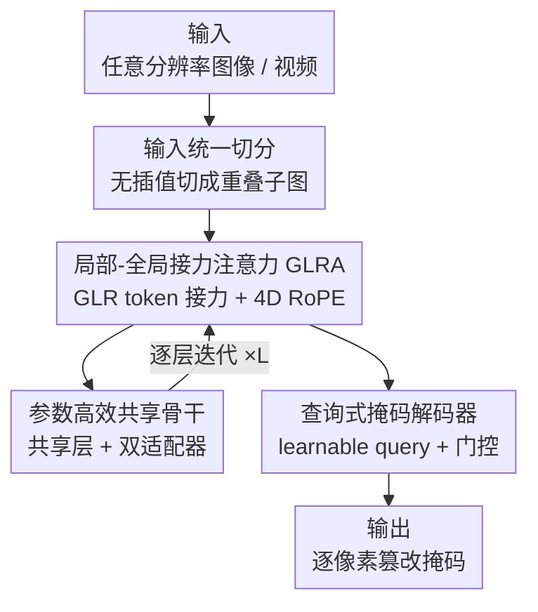

# RelayFormer: A Unified Local-Global Attention Framework for Scalable Image and Video Manipulation Localization

**会议**: ICLR 2026  
**OpenReview**: [https://openreview.net/forum?id=e61YQdLIam](https://openreview.net/forum?id=e61YQdLIam)  
**代码**: https://github.com/WenOOI/RelayFormer  
**领域**: AIGC检测 / 篡改定位 / 高效注意力  
**关键词**: 视觉篡改定位, 局部-全局接力注意力, 分辨率自适应, 图像视频统一建模, 参数高效

## 一句话总结
RelayFormer 把任意分辨率的图像/视频切成固定大小的子图，用一小撮 [GLR] 接力 token 在子图之间传递场景级的全局一致性线索，从而在不做插值、不堆全分辨率注意力的前提下，用同一套架构同时完成图像和视频的篡改区域定位，并在多个 benchmark 上拿到 SOTA 且 FLOPs 可随输入动态伸缩。

## 研究背景与动机

**领域现状**：视觉篡改定位（Visual Manipulation Localization, VML）要在图像或视频里精确圈出被 splice / copy-move / inpainting 等手段动过手脚的像素区域，是数字取证的基础任务。主流做法是把输入 resize 或 pad 到一个固定分辨率（如 512×512 或 1024×1024），再喂给一个高分辨率 ViT 或多尺度 CNN-Transformer 混合网络去预测掩码。

**现有痛点**：作者点出两个具体毛病。其一是**分辨率多样性**：真实内容从 256×256 到 4K 都有，而取证依赖的恰恰是噪声、压缩残差这类低层细微痕迹——插值会直接把这些痕迹抹掉，pad 到大画布又带来大量冗余计算，而且对 9:19.5 这种手机非标准长宽比，统一 resize 会严重扭曲内容。其二是**图像到视频的建模鸿沟**：图像模型用不上时序线索，视频模型又难以泛化到单张图，结果是实践中得维护两套独立模型，成本翻倍。

**核心矛盾**：篡改区域往往很小、视觉上很隐蔽（需要细粒度局部敏感性），但要可靠判定又依赖场景级的全局一致性（光照是否匹配、copy-move 的源区域在哪、帧间是否连贯）。稠密全局注意力理论上能抓这种依赖，但对高分辨率内容计算上不可行。

**切入角度**：作者观察到，取证所需的全局线索其实是**粗粒度**的——反映的是场景级规律（光照、物体语义、时序连贯），而非逐像素的精确对应。既然全局信息只需"稀疏但有效地传播"就够了，那就没必要为它付出稠密注意力的代价。

**核心 idea**：用一小撮可学习的 **Global-Local Relay（GLR）token** 当"信息瓶颈"，让它们在局部注意力里吸收局部证据、在全局注意力里和其他子图的 GLR token 交换压缩后的语义，再把富集的上下文回注到各自子图——用结构化的全局-局部接力，替代昂贵的全分辨率稠密注意力。

## 方法详解

### 整体框架

RelayFormer 是一个模块化的统一框架，输入是任意分辨率的图像或任意长度的视频，输出是逐像素的篡改掩码。整条流水线分三段：先把输入**无插值地**切成略有重叠的固定大小子图（Input Unification），把图像和视频都摊平成同一种"子图批"；然后用 GLRA 模块在子图内做局部注意力、在子图间用 GLR token 做接力式全局注意力，逐层迭代；最后用一个轻量的查询式掩码解码器把特征图解码成掩码。整个设计的关键在于：计算量随子图数量（即输入分辨率）动态分配，而全局信息只通过极少的 GLR token 流动，因此既能伸缩到大分辨率、又能自然地从静态图扩展到时序视频。

### 关键设计

**1. 输入统一切分：用重叠子图把图像和视频摊成同一种原子单元**

这一步针对的是"分辨率多样性 + 图像/视频两套模型"两个痛点。对一张图 $x\in\mathbb{R}^{C\times H_{img}\times W_{img}}$，作者用大小 $H_p\times W_p$、步长 $S_h,S_w$ 的滑窗把它切成略有重叠的子图，每个维度上的子图数为 $N_h=\lfloor (H_{img}-H_p)/S_h\rfloor+1$、$N_w=\lfloor (W_{img}-W_p)/S_w\rfloor+1$，只有边缘不足一块时才 pad，因此**几乎不引入冗余计算、也不做任何插值**，低层取证痕迹被原样保留。对视频 $x\in\mathbb{R}^{T\times C\times H_{vid}\times W_{vid}}$，先把 batch 和时间维合并，每一帧按同样方式切块。最后所有子图——无论来自图像还是视频——都被拼成一个形状为 $(B_{total},C,H_p,W_p)$ 的大批次，$B_{total}=\sum_{img}N_{img}+\sum_{vid}T\cdot N_{vid}$。这样在后续局部建模阶段，模型**根本不需要区分输入是图还是视频**，每个子图都是一个独立样本，可以大批量并行计算。统一表示是后面"单架构通吃图像视频"的根基。

**2. 局部-全局接力注意力（GLRA）：用少量 GLR token 当瓶颈做稀疏全局传播**

这是全文核心，针对"全局一致性 vs 稠密注意力代价"的矛盾。对每个子图 $U_i$，先用 ViT patch embedding 得到 patch token $X_i$，再拼上一小撮可学习的 GLR token $T_i\in\mathbb{R}^{m\times d}$（实验里 $m=2$ 就最好）。**局部感知注意力**在子图内做自注意力 $[T_i^{(l)},X_i^{(l)}]=\mathrm{SelfAttn}_{local}([T_i^{(l-1)};X_i^{(l-1)}])$，此时 GLR token 一边把上一层带来的全局信息转达给局部 patch、一边吸收新的局部证据。**接力式全局注意力**则把所有子图的 GLR token 聚到一起 $T_{flat}=\mathrm{Concat}_{j=1}^{N_i}T_j$，做一次跨子图自注意力 $T_{updated}=\mathrm{SelfAttn}_{global}(\mathrm{RoPE4D}(T_{flat}))$，再把更新后的 GLR token 回注到各自子图。如此局部↔全局逐层迭代：全局注意力只在 $N_i\cdot m$ 个 token 上做（而不是全部 patch），所以计算量极小却能传播场景级一致性。为支持变分辨率/变时长的外推，每个 GLR token 用 **4D RoPE** 编码时间索引、token 身份、垂直和水平位置——把隐维拆成 $[x_T,x_{id},x_H,x_W,x_{rem}]$ 五组，各组独立施加标准 1D RoPE（$\theta_i=10000^{-2i/d_g}$），剩余维不旋转，从而获得对未见分辨率的外推能力。

**3. 参数高效的共享骨干 + 双适配器：一层的参数干两层的活**

直接把局部和全局注意力做成两层独立 Transformer 最直观，但参数翻倍；而让两者共享同一套权重又会因为"局部要细粒度、全局要长程"的目标冲突而双双掉点。作者的假设是：局部与全局注意力虽然功能不同，但底层计算结构高度共享。于是只保留**一个共享的 Transformer 骨干层**，再为局部、全局各挂一个轻量适配模块（LoRA 或 Adapter）：共享骨干学注意力的通用基础特征，局部适配器学"专门处理细粒度模式"所需的残差变换，全局适配器学"长程上下文推理"所需的残差。这样既拿到接近两层模型的表达力，参数却只比单层基线多一点点（表 3 里 Relay-ViT 仅 +2.36M、Relay-Seg 仅 +2.39M），在性能和效率间取得更优权衡。

**4. 查询式掩码解码器：避免解码成为新的瓶颈**

切子图后特征图被重组成 $F\in\mathbb{R}^{H_f\times W_f\times d}$，若用重的解码头会抵消前面省下的算力。作者借鉴 Mask2Former，先把特征投影到低维 $\tilde F$，再用一小撮可学习 query $Q\in\mathbb{R}^{M_f\times d}$ 与之交互：每层先做交叉注意力 $Q^{(k)'}=\mathrm{CrossAttn}(Q^{(k-1)},\tilde F)$，再做带 RoPE 的自注意力 $Q^{(k)}=\mathrm{SelfAttn}(\mathrm{RoPE}(Q^{(k)'}))$，最后用一个门控 MLP 给每个 query 赋权、调制它对最终掩码的贡献。消融显示，把朴素 MLP 头换成这个查询式解码器，平均 F1 从 0.521（n=1 无解码器）提到 0.532。

### 损失函数 / 训练策略

沿用 IML-ViT 的做法，用 BCE 损失 + 边缘损失：$L=L_{BCE}(P,M)+\lambda\cdot L_{Edge}(P\odot M_e, M\odot M_e)$，其中 $P$ 是预测掩码、$M$ 是真值、$M_e$ 是边缘掩码、$\odot$ 是逐点乘，边缘损失就是在边缘区域上再算一遍 BCE 以强调边界精度。实现上用 ViT 和 SegFormer 两种骨干（记作 Relay-ViT / Relay-Seg），GLR token 数 $n=2$，图像子图 512×512、视频子图 256×256、clip 长度 4，AdamW + cosine 衰减，基础学习率 1e-4，训练 200 epoch。

## 实验关键数据

### 主实验

图像篡改定位（Protocol-MVSS，CASIAv2 训练、其余测试），像素级 F1（阈值 0.5）：

| 方法 | COVERAGE | Columbia | NIST16 | CASIAv1 | IMD2020 | 平均 |
|------|----------|----------|--------|---------|---------|------|
| TruFor | 0.419 | 0.865 | 0.311 | 0.721 | 0.317 | 0.527 |
| IML-ViT | 0.438 | 0.747 | 0.269 | 0.718 | 0.328 | 0.500 |
| SparseViT | 0.287 | 0.781 | 0.245 | 0.646 | 0.230 | 0.438 |
| **Relay-ViT** | 0.551 | 0.762 | 0.335 | 0.740 | 0.381 | **0.554** |
| **Relay-Seg** | 0.569 | 0.756 | 0.273 | 0.760 | 0.357 | 0.543 |

视频篡改定位（DAVIS 训练，MOSE 上三种 inpainting 测试），IoU/F1：

| 方法 | MOSE100 | E2FGVI | STTN |
|------|---------|--------|------|
| TruVIL | 0.521/0.674 | 0.557/0.699 | 0.462/0.612 |
| ViLocal | 0.485/0.620 | 0.597/0.721 | 0.393/0.524 |
| **Relay-ViT** | 0.552/0.689 | 0.561/0.695 | **0.549/0.684** |
| **Relay-Seg** | **0.561/0.698** | 0.554/0.692 | 0.534/0.674 |

效率（表 3）：Relay-Seg 仅 45.90+2.39M 参数，GFLOPs 随子图数 $N=1,2,4$ 在 52.7 / 105.4 / 210.8 之间动态伸缩，远低于 IML-ViT 的 576.78 GFLOPs（1024×1024 固定输入）。

### 消融实验

GLR token 数量与解码器（五 benchmark 平均 F1，表 5）：

| n（GLR token） | 解码器 | 平均 F1 | 说明 |
|----------------|--------|---------|------|
| 0 | - | 0.454 | 无 GLRA 模块（纯局部） |
| 1 | - | 0.521 | 加 1 个 GLR token |
| 1 | ✓ | 0.532 | 再换上查询式解码器 |
| **2** | ✓ | **0.554** | 完整模型，最优 |
| 3 | ✓ | 0.524 | token 冗余，反而掉点 |

GLRA 时空维度消融（MOSE100，表 6）：纯局部 F1=0.6124；加空间全局→0.6745；再加时序全局→0.6877。插值影响（IMD2020，表 7）：不 resize（2958×4437）F1=0.453，强行 resize 到 1024×1024 直接掉到 0.350。

### 关键发现
- **GLRA 是涨点主力**：从 n=0（0.454）到 n=2（0.554）平均 F1 提升 0.10，证明少量 GLR token 传播的全局线索贡献最大；但 token 不是越多越好，n=3 因冗余反而掉到 0.524。
- **插值是取证大敌**：表 7 显示，对高分辨率图强行 resize 会让 F1 从 0.453 暴跌到 0.350，直接验证了"无插值切分"的必要性。
- **图像帮视频、视频难帮图像（不对称迁移）**：统一训练实验（表 4）发现，加视频伪造数据几乎不提升图像域性能（因视频数据集多样性和标注质量不足），但高质量图像伪造能明显增强共享篡改类型的视频检测；当图像和视频篡改类型不重叠时则互不获益。

## 亮点与洞察
- **用"信息瓶颈"重新诠释全局注意力**：把全局一致性需求压缩到极少的 GLR token 上，是对"取证全局线索本质粗粒度"这一观察的精准工程落地——不是为了省算力而粗暴稀疏化，而是因为任务本身只需要粗粒度全局信息。这个 token 接力的范式可迁移到任何"局部细节敏感 + 需要全局一致性 + 输入分辨率多变"的任务（如高分辨率医学分割、遥感变化检测）。
- **共享骨干 + 双适配器**：用一套权重 + 两个轻量 LoRA/Adapter 同时承载"功能冲突"的局部和全局注意力，是参数高效化的巧妙用法，把"两层"的表达力压进"近一层"的参数量。
- **切子图天然统一图像/视频**：把时间维并进 batch、所有子图同等对待，一招抹平了图像和视频的架构鸿沟，这种"先碎片化再统一并行"的思路很值得借鉴。

## 局限与展望
- **依赖视频数据质量**：作者自己承认当前视频篡改数据集多样性和标注精度不足，导致视频→图像方向几乎无迁移收益，框架的视频侧上限受限于数据而非架构。
- **子图重叠与切分超参**：步长、子图大小、重叠程度需要人工设定，未给出自适应选择策略；对极端长宽比或超大分辨率下子图数量爆炸时的实际延迟，正文只给 GFLOPs、未充分讨论真实并行调度开销。
- **全局信息是否够用存疑**：把全局一致性压到 2 个 GLR token，对需要精细长程对应的篡改类型（如大范围 copy-move 的源-目标匹配）是否足够，论文未做针对性压力测试。

## 相关工作与启发
- **vs IML-ViT**：IML-ViT 证明高分辨率 ViT + 边缘监督有效，但全分辨率注意力内存代价高、难伸缩（576 GFLOPs）。RelayFormer 沿用其边缘损失，但用子图切分 + GLR 接力把全局注意力从全 patch 降到极少 token，FLOPs 随分辨率动态分配，且统一支持视频。
- **vs SparseViT / FOCAL**：这类方法主要靠稀疏注意力降算力，但稀疏化是"均匀地砍连接"。RelayFormer 不靠稀疏注意力，而是按输入分辨率动态分配计算、并做任务导向的全局信息传播，作者强调二者互补。
- **vs TruVIL / ViLocal（视频侧）**：它们靠对比学习或密集时序采样做视频取证，计算量大且多为视频专用。RelayFormer 用同一架构通吃图像和视频，在 STTN 等 inpainting 上反超它们。

## 评分
- 新颖性: ⭐⭐⭐⭐ GLR token 接力 + 共享骨干双适配器 + 4D RoPE 的组合在取证场景里是新颖且自洽的设计
- 实验充分度: ⭐⭐⭐⭐ 覆盖图像/视频多 benchmark、两种协议、详尽消融与效率分析，仅视频数据质量受限
- 写作质量: ⭐⭐⭐⭐ 动机推导清晰、图表完整，方法各组件交代到位
- 价值: ⭐⭐⭐⭐ 统一图像视频取证 + 分辨率自适应 + 高效，实用性强且范式可迁移

<!-- RELATED:START -->

## 相关论文

- [\[ICLR 2026\] Omni-IML: Towards Unified Interpretable Image Manipulation Localization](omni-iml_towards_unified_interpretable_image_manipulation_localization.md)
- [\[ICLR 2026\] Preserving Forgery Artifacts: AI-Generated Video Detection at Native Scale](preserving_forgery_artifacts_ai-generated_video_detection_at_native_scale.md)
- [\[ICLR 2026\] Unveiling Perceptual Artifacts: A Fine-Grained Benchmark for Interpretable AI-Generated Image Detection](unveiling_perceptual_artifacts_a_fine-grained_benchmark_for_interpretable_ai-gen.md)
- [\[ICLR 2026\] FakeXplain: AI-Generated Image Detection via Human-Aligned Grounded Reasoning](fakexplain_ai-generated_image_detection_via_human-aligned_grounded_reasoning.md)
- [\[ICLR 2026\] HSIC Bottleneck for Cross-Generator and Domain-Incremental Synthetic Image Detection](hsic_bottleneck_for_cross-generator_and_domain-incremental_synthetic_image_detec.md)

<!-- RELATED:END -->
