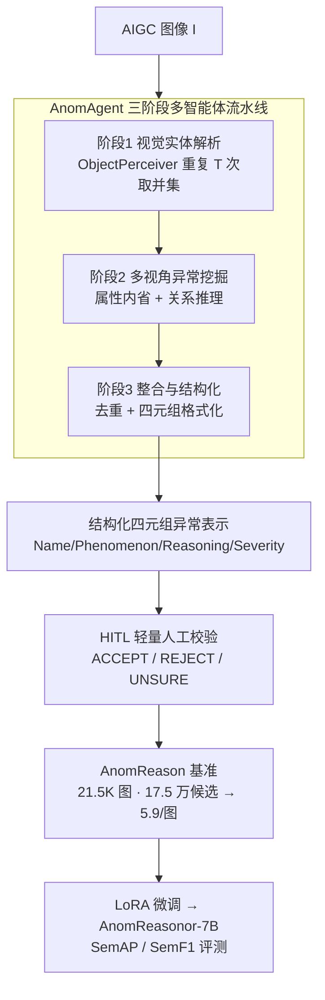

# Semantic Visual Anomaly Detection and Reasoning in AI-Generated Images

**会议**: ICLR 2026  
**OpenReview**: [https://openreview.net/forum?id=0iN4UKZwgn](https://openreview.net/forum?id=0iN4UKZwgn)  
**代码**: https://github.com/chuangchuangtan/Semantic-Visual-Anomaly-Detection-and-Reasoning  
**领域**: AIGC 检测 / 多模态VLM / 可解释 Deepfake  
**关键词**: 语义异常检测, AIGC 取证, 多智能体标注, 结构化推理, 可解释 Deepfake

## 一句话总结
针对 AI 生成图像里那些"看着真、细想假"的语义级异常（违反物理、常识、解剖逻辑），本文把它形式化成一个"检测 + 解释 + 评分"的任务，用多智能体流水线 AnomAgent 加轻量人工校验造出 21.5K 图、十几万条结构化四元组标注的 AnomReason 基准，并提出语义匹配指标 SemAP/SemF1；在此微调出的 AnomReasonor-7B 在语义检测上超过所有开源 VLM、逼近 GPT-4o。

## 研究背景与动机

**领域现状**：Stable Diffusion、Midjourney、Flux 等生成模型已经能合成以假乱真的照片级图像，相应地，AIGC 取证/Deepfake 检测成了刚需。现有取证方法大多盯着**低层伪造线索**——频域统计伪影、纹理重复、光照阴影不一致——来判真假。

**现有痛点**：这些低层线索有两个硬伤。一是**人看不见**：它们是统计层面的细微痕迹，和人类判断图像可信度的依据脱节；二是**只给标签不给理由**：模型输出"真/假"或"某区域可疑"，无法解释"哪里不对、为什么不对、有多严重"。而真正让人对 AIGC 失去信任的，恰恰是那些一眼能看出的**语义级荒谬**：足球和橄榄球混成一体、攀岩者悬空违反重力、镜中倒影对不上、一个人长三条胳膊。这类内容级异常传统取证完全捕捉不到。

**核心矛盾**：语义异常本质是"违反常识/物理/逻辑"，需要的是**对场景的理解与推理**，而不是对像素统计的拟合。但现有基准（如 FakeClue、Ivy-Fake）只提供粗粒度的真假标签或零散线索，缺乏能支撑"对象—属性—关系"层面推理的结构化标注，导致在其上训练的模型既做不了细粒度推理，也给不出严重程度评估。

**本文目标**：把问题拆成三件事——(i) 把"语义视觉异常检测与推理"形式化成一个可评测的任务；(ii) 造一个大规模、带结构化标注的基准；(iii) 设计能衡量"语义匹配"而非字面匹配的评测指标。

**切入角度**：作者观察到，语义异常天然是**以对象为中心**的——异常要么源于单个对象自身属性矛盾（材质/形状/功能），要么源于对象之间的关系不合理（空间/交互/物理）。于是与其让一个庞大 LLM 一口气吐出所有异常（容易幻觉、不可控），不如**模仿人类感知—推理过程**，把任务分解给多个专职智能体协作。

**核心 idea**：用"结构化四元组（Name、Phenomenon、Reasoning、Severity）"定义异常，用一条**分阶段多智能体流水线 + 轻量人工校验**大规模生产这种标注，从而把 AIGC 取证从"判真假"升级到"讲清楚哪里不真实、为什么、多严重"。

## 方法详解

### 整体框架

系统要解决的是：给定一张 AIGC 图像 $I$，输出一组结构化异常 $A=\{(y_i,o_i,r_i,v_i)\}_{i=1}^m$，其中 $y_i$ 是异常名称、$o_i$ 是现象描述、$r_i$ 是"为什么算异常"的推理、$v_i\in[0,100]$ 是严重度评分（0 表示完全不合理，100 表示完全真实）。作者特意要求模型给严重度打分并自证理由，因为"必须论证这个异常是轻微还是严重"会逼模型做更深的推理，进而产出更丰富的描述。

整条标注流水线 **AnomAgent** 是一个模块化多智能体框架，把异常发现拆成三个串行阶段：**阶段 1 视觉实体解析**抽取图中所有对象；**阶段 2 多视角异常挖掘**对每个对象做属性内省与关系推理、产出候选异常；**阶段 3 异常整合与结构化**去重、规范化成四元组。流水线产出的候选再经一道**轻量 HITL 人工校验**过滤幻觉，沉淀为 AnomReason 基准。最后在该基准上 LoRA 微调出检测模型 AnomReasonor-7B，并配套 SemAP/SemF1 指标评测。

### 关键设计

**1. 结构化四元组异常表示：把"判真假"重定义为"可解释的语义评估"**

本文最根本的贡献不在某个网络结构，而在**任务形式化**。它把每个异常表示成四元组 $(y,o,r,v)$：Name 一句话概括异常，Phenomenon 在语义层面详细描述"看到了什么不对"，Reasoning 解释"为什么这违反常识/物理"，Severity Score $v\in[0,100]$ 量化"有多不真实"。这直接针对前面"只给标签不给理由"的痛点：相比 FakeClue/Ivy-Fake 那种粗标签或零散线索，四元组把异常落到**对象—属性—关系**三个语义层级上，使异常分析既可解释又可机读，从而把任务从"检测"推进到"结构化推理"。让模型同时输出严重度并论证，是一个被反复强调的设计——它把"检测"和"解释"绑在一起训练，迫使模型对每个异常给出有依据的推理链而非事后合理化。

**2. AnomAgent 三阶段多智能体流水线：用分工模仿人类的感知—推理过程**

要在大规模上自动产出高质量四元组，单靠一个 monolithic LLM 直接 prompt 既容易幻觉又不可控。AnomAgent 把它分解为三阶段、多个专职智能体协作。**阶段 1（视觉实体解析）** 由 ObjectPerceiver 抽取所有语义对象，尤其关注人相关对象；由于 AIGC 图像里对象常常纠缠、扭曲、幻觉，单次检测不可靠，于是用不同 prompt 重复 $T$ 次再取并集降低漏检：$O=\bigcup_{t=1}^{T} O^{(t)}$，每个对象带名称和细节描述。**阶段 2（多视角异常挖掘）** 对每个对象 $o_i$ 做两路互补分析：AttributeAnalyzer 做**对象内属性分析**，检查形状/材质/功能等内部矛盾，得到候选 $C^{(i)}_{\text{attr}}=\text{AttributeAnalyzer}(o_i)$；RelationReasoner 做**对象间关系推理**，以该对象自身的属性异常作为上下文先验，评估它与场景其余部分的空间/语义/功能交互，$C^{(i)}_{\text{rel}}=\text{RelationReasoner}(o_i,\,O\setminus\{o_i\},\,C^{(i)}_{\text{attr}})$，先枚举成对/成组关系再过滤掉不合理的。两路汇成总候选集 $C=\bigcup_{i=1}^{|O|}(C^{(i)}_{\text{attr}}\cup C^{(i)}_{\text{rel}})$。这两个 agent 内部都用"先广撒网识别、再逐条核验输出"的两步法压低幻觉、减少漏报。**阶段 3（整合与结构化）** 由 AnomalyIntegrator 合并重复/冗余候选、剔噪得到 $\hat C$，再由 AnomalyFormatter 把每条 $c\in\hat C$ 映射成标准四元组。这种"对象 → 属性/关系 → 整合"的分解，让每一步都聚焦一个子问题、可解释且可扩展，比让一个模型一口气吐答案更可靠。

**3. 轻量 HITL 人工校验：用最小代价把自动标注的可信度顶上去**

纯自动生成会残留幻觉，纯人工标注又无法规模化。本文在流水线尾部加一道**单选式**人工校验：每条候选 $a$ 让标注员只回答一个问题"这条结构化描述对这张图正确吗？"，三选一 ACCEPT/REJECT/UNSURE，对应 $h(a)\in\{1,0,\perp\}$，最终只保留 $A_{\text{final}}=\{a\in A: h(a)=1\}$。这个协议成本极低却能滤掉不合理的幻觉：经 HITL 后每图平均有效标注从约 8 条降到 5.9 条，严重度分布也整体左移（更倾向较低分），说明语义焦点被收紧、标注更精炼。正是这道"多智能体 + 人工核验"的混合策略，让 AnomReason 在保证质量的同时做到了 21,539 图、174,872 条候选的空前规模（构建期消耗约 41.7 亿 GPT-4o token）。

**4. SemAP / SemF1 语义匹配指标：让评测看"意思对不对"而非"字面像不像"**

语义异常是开放式文本描述，传统精确匹配或 IoU 无从下手。本文提出基于 BERTScore 的结构感知指标：对每个四元组的 Phenomenon($o$) 和 Reasoning($r$) 字段，用 BERTScore 与真值比相似度，并定义 Phe、Rea、Full（两者融合）三个评测视图。在图像级做**一对一异常匹配**，相似度阈值取 $\tau\in\{0.7,0.8,0.9\}$，算 P/R 曲线后得到 $\text{SemAP}_v=\frac{1}{|D|}\sum_{I\in D}\text{AP}_v(I)$ 与 $\text{SemF1}_v=\frac{1}{|D|}\sum_{I\in D}\text{F1}_v(I)$，严重度 $v$ 可选作排序置信度。在 Deepfake 应用里进一步引入**分类感知**变体 CSemAP/CSemF1：解释只有在真假分类正确时才计分、否则记零，把解释质量和有效分类绑定，抑制"瞎猜对了再编理由"的事后合理化。

## 实验关键数据

### 主实验：AnomReason 语义异常检测与推理

在 AnomReason 测试集（10,774 图）上对比十余个开源/闭源 VLM。在 Qwen2.5-VL-7B 上 LoRA 微调得到 AnomReasonor-7B（AR-7B）。多数现成 VLM 的 SemAP$_{\text{Full}}$ 普遍低于 0.42，说明缺乏针对性监督时语义理解很有限。

| 模型 | SemAP$_{\text{Full}}$ | SemAP$_{\text{Rea}}$ | SemF1$_{\text{Full}}$ | SemF1$_{\text{Rea}}$ |
|------|------|------|------|------|
| Qwen2.5-VL-72B（开源最佳） | 0.4568 | 0.4353 | 0.4104 | 0.3912 |
| GPT-4o（闭源最强） | 0.4727 | 0.4562 | **0.5109** | 0.4930 |
| **AnomReasonor-7B（本文）** | **0.5162** | **0.5130** | 0.5009 | **0.4977** |

AR-7B 在所有 SemAP 指标上拿下新 SOTA，并**全面超过 GPT-4o 的 SemAP**；SemF1 上 GPT-4o 略占优（0.5109 vs 0.5009），但 AR-7B 在推理质量 SemF1$_{\text{Rea}}$ 上反超（0.4977 vs 0.4930）。一个有意思的现象：多数模型"观察（Phe）"强于"推理（Rea）"，如 InternVL3-8B 差距高达 0.4552 vs 0.3676——发现"哪里不对"比说清"为什么不对"容易；而 AR-7B 的观察与推理几乎齐平，体现结构化监督同时拉高了两端。

### 下游应用：可解释 Deepfake 检测

在 AnomReason-Deepfake（真图采自 LAION/reLAION-HR）上同时考核真假分类准确率（Acc）与分类感知的解释指标。

| 模型 | Acc(%) | CSemAP$_{\text{Rea}}$ | CSemF1$_{\text{Rea}}$ |
|------|------|------|------|
| Qwen2.5-VL-72B | 77.60 | 0.2337 | 0.2159 |
| GPT-4o | **87.76** | 0.3487 | 0.3770 |
| **AnomReasonor-7B** | 82.61 | **0.3574** | **0.3929** |

AR-7B 分类准确率（82.61%）虽不及 GPT-4o，但在因果性解释 CSemAP$_{\text{Rea}}$、CSemF1$_{\text{Rea}}$ 上反超闭源 GPT-4o，说明语义异常推理为传统 Deepfake 检测提供了**正交且互补**的信号。

### 关键发现
- **结构化监督是齐平观察与推理的关键**：去掉它的现成 VLM 普遍"会看不会说"，而 AR-7B 在仅 7B 规模、LoRA 微调（rank 8、每四层插一个 adapter、冻结视觉编码器、单 epoch）下就逼近百亿级闭源系统。
- **HITL 提纯有量化效果**：每图标注从 ~8 条降到 5.9 条、严重度分布左移，证明它确实在剔除幻觉而非随机删减。
- **生成器语义体检揭示新差异**：用 AR-7B/AnomAgent 作"评审"对 15 个文生图模型打 MAI/AF/CAP（越低越好），HunyuanImage-2.1、OmniGen V2 的 CAP 最低，Sana 1.5、SDXL Lightning 较高；且存在不同失败模式——Janus Pro 7B 异常多但轻微（高 AF 低 MAI），SDv3.5 Large 异常少但严重。说明**高感知质量不等于高语义合理性**。

## 亮点与洞察
- **把取证从"像素侦探"升级为"逻辑审稿人"**：盯统计伪影的路线终会被更强的生成器抹平，而违反物理/常识的语义破绽是生成模型短期内难以根除的，人也看得见——这个任务定义的视角转换本身比任何单一模块更有价值。
- **四元组 + 严重度的"强制自证"很巧**：要求模型论证严重程度，等于用输出格式逼出更深的推理链，是个可迁移到其他"检测 + 解释"任务的 prompt/监督设计。
- **多智能体 + 单选式 HITL 的性价比**：把标注员的工作压缩成"一道是非选择题"，在保住质量的同时把人力降到最低，是大规模结构化数据生产的实用范式。
- **AnomReasonor 与 AnomAgent 的互证**：微调小模型（带人工偏好）与全自动 agent（零样本）对生成器的排序高度一致，说明可以用全自动 agent 做可扩展的零样本审计。

## 局限与展望
- 作者承认数据集**规模中等且只覆盖静态图像**，未来将扩展到视频并继续提升标注质量。
- 标注流水线**依赖外部 API（GPT-4o）**，模型更新会带来可复现性波动；HITL 虽低成本但含主观判断，难以逐条精确复现（作者以释放全部中间产物来缓解）。
- 评测以 BERTScore 语义相似度为骨架，**指标本身受文本编码器偏置影响**；不同任务/难度下的分数不宜直接横比。
- 严重度评分 $v\in[0,100]$ 由 VLM 自评给出，缺乏独立的人类严重度真值锚定，校准程度存疑。

## 相关工作与启发
- **vs FakeClue / Ivy-Fake 等真假基准**：它们做真假分类或伪影线索解释，只给粗标签；本文在对象—属性—关系层级建模异常并给结构化四元组 + 严重度，支持细粒度推理与生成器合理性审计。
- **vs 直接 prompt monolithic LLM 标注**：本文用多智能体分阶段协作 + 人工核验，比单个大模型一口气出标注更一致、更可扩展、幻觉更少。
- **vs 传统 AIGC 图像质量评估（CLIP 对齐、感知质量）**：那类方法只看图文对齐与观感，忽略场景级语义合理性；本文的结构化、内容感知评测补上了"物理/常识/交互逻辑"这块短板。

## 评分
- 新颖性: ⭐⭐⭐⭐⭐ 把 AIGC 取证从低层伪影重定义为语义级"检测+解释+评分"，并配套任务、基准、指标三件套。
- 实验充分度: ⭐⭐⭐⭐⭐ 十余个 VLM 横评 + Deepfake 应用 + 15 个生成器体检 + 三项消融视角，覆盖面广。
- 写作质量: ⭐⭐⭐⭐ 任务动机和流水线讲得清楚，部分指标定义偏简、需配合附录。
- 价值: ⭐⭐⭐⭐⭐ 任务/基准/指标/模型将开源，对可解释 AIGC 取证与生成器对齐评估是可复用的基础设施。

<!-- RELATED:START -->

## 相关论文

- [\[CVPR 2026\] Locate-Then-Examine: Grounded Region Reasoning Improves Detection of AI-Generated Images](../../CVPR2026/aigc_detection/locate-then-examine_grounded_region_reasoning_improves_detection_of_ai-generated.md)
- [\[ICLR 2026\] FakeXplain: AI-Generated Image Detection via Human-Aligned Grounded Reasoning](fakexplain_ai-generated_image_detection_via_human-aligned_grounded_reasoning.md)
- [\[ICLR 2026\] Attack-Resistant Watermarking for AIGC Image Forensics via Diffusion-based Semantic Deflection](attack-resistant_watermarking_for_aigc_image_forensics_via_diffusion-based_seman.md)
- [\[CVPR 2026\] Enabling Supervised Learning of Generative Signatures for Generalized AI-Generated Images Detection](../../CVPR2026/aigc_detection/enabling_supervised_learning_of_generative_signatures_for_generalized_ai-generat.md)
- [\[ICLR 2026\] Preserving Forgery Artifacts: AI-Generated Video Detection at Native Scale](preserving_forgery_artifacts_ai-generated_video_detection_at_native_scale.md)

<!-- RELATED:END -->
