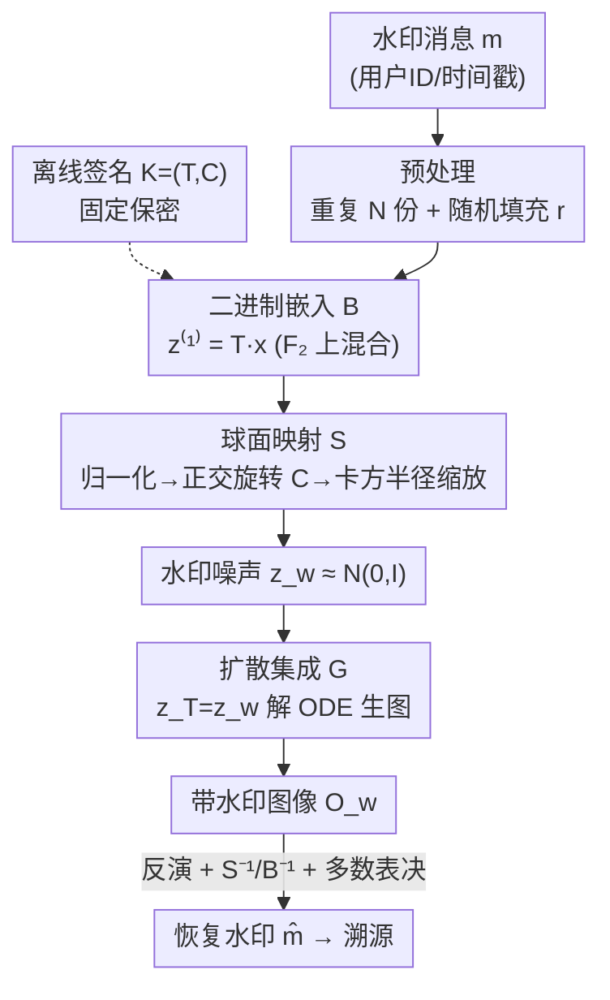

# Spherical Watermark: Encryption-Free, Lossless Watermarking for Diffusion Models

**会议**: ICLR 2026  
**OpenReview**: [https://openreview.net/forum?id=2eAGrunxVz](https://openreview.net/forum?id=2eAGrunxVz)  
**代码**: 无  
**领域**: AIGC检测 / 扩散模型水印 / 内容溯源  
**关键词**: 无损水印, 扩散模型, 球面映射, 内容溯源, 免加密

## 一句话总结
本文提出 Spherical Watermark：一种免加密、无损的扩散模型水印框架，把二进制水印先经矩阵混合成高熵码、再通过"投影到单位球面 → 正交旋转 → 卡方半径缩放"精确还原成标准高斯噪声，作为扩散初始噪声注入图像；既不改模型权重、不存逐图密钥，又在保真度、溯源精度、计算效率和抗攻击鲁棒性上同时超过有损与无损基线。

## 研究背景与动机

**领域现状**：扩散模型让 AIGC 图像泛滥，溯源与版权成为刚需。数字水印是主流手段，传统空域/频域水印或微调解码器的方法能嵌入标识，但都会改变生成分布、损伤画质。近期出现"无损水印"思路——不动预训练模型，只在潜空间把水印比特可逆地映射成标准高斯噪声，从源头注入。

**现有痛点**：现有无损方案各有硬伤。Gaussian Shading 用重复码 + 流密码采样，但需要为**每张图**存一份独立的 key 和 nonce，密钥管理开销在真实部署里不可承受；一旦改用固定 key，它就不再真正无损。PRC Watermark 改用固定密钥的伪随机纠错码，省了逐图密钥，但引入了重量级密码学构件：编码和置信传播解码计算量大、延迟高（提取慢约四个数量级），码率与纠错强度需要精细调参，且在强攻击/分布偏移下会撞上不可降低的错误地板而失效。

**核心矛盾**：无损性（水印噪声与标准高斯不可区分）、免密钥管理、强鲁棒性三者难以兼得——已有方法要么靠逐图密钥换无损，要么靠重密码学换免密钥，但都牺牲了效率或鲁棒性。

**本文目标**：设计一对潜空间 Embed/Extract，使水印噪声 $z_w$ 在计算意义上与标准高斯 $z\sim\mathcal{N}(0,I_{l_x})$ 不可区分（无损/不可检测），同时保证从被检图反演后能以可忽略错误恢复水印（可溯源），且不依赖任何逐图密钥或重密码学。

**切入角度**：作者注意到一个几何事实——标准多元高斯向量可做极分解 $n = r\cdot u$，其中半径 $r^2\sim\chi^2(l_x)$、方向 $u$ 均匀分布在单位球面且二者独立。如果能把离散水印比特构造成"球面上近似均匀"的方向，再乘上卡方半径，就能**精确**地拼回高斯噪声，整个过程纯线性代数、可逆、无需密码学。

**核心 idea**：用"二进制混合 + 球面映射"代替"密钥/纠错码"来把水印比特无损地变成高斯噪声——靠球面 3-design 的统计性质保证不可检测，靠固定签名矩阵 $(T,C)$ 省掉逐图密钥。

## 方法详解

### 整体框架
全流程从模型开发者视角构建溯源机制，分**离线构建期**与**在线运行期**。离线期开发者生成一份固定且保密的"签名" $\mathcal{K}=(T,C)$——一组可逆变换，把任意二进制水印编码成扩散模型的高斯噪声输入。在线期 API 收到生图请求时，自动用同一签名把与用户绑定的水印 $m$（如用户 ID、时间戳）嵌入潜码再送进扩散模型，使产出图天然携带可追踪标识；事后开发者对可疑图做反演即可提取水印、追到用户。

嵌入由三个可逆模块串行完成：**二进制嵌入模块 $\mathcal{B}$**（在 $\mathbb{F}_2$ 上做 $z^{(1)}=Tx$）→ **球面映射模块 $\mathcal{S}$**（归一化→旋转→卡方缩放，把 01 序列还原成高斯噪声 $z_w$）→ **扩散集成模块 $\mathcal{G}$**（以 $z_w$ 为初始噪声 $z_T$ 解 ODE 生图）。提取时按 $\mathcal{G}^{-1},\mathcal{S}^{-1},\mathcal{B}^{-1}$ 逆序还原，再对 $N$ 份重复比特做多数表决。

### 关键设计

**1. 二进制嵌入与离线签名：用固定可逆矩阵混合水印与填充，免逐图密钥又造出高熵码**

要无损就得让水印噪声统计上像随机高斯，但水印本身有结构（还要重复 $N$ 份做纠错），直接映射会暴露相关性。作者先把水印预处理成 $x=[m\,m\cdots m\,r]^\top\in\{0,1\}^{l_x}$，即重复 $N$ 块再拼一段每次新采的随机填充 $r\sim\text{Bernoulli}(1/2)$，$l_x=N\cdot l_m+l_r$。离线期开发者构造固定签名 $\mathcal{K}=(T,C)$：嵌入矩阵 $T=\begin{pmatrix}I_{l_{Nm}} & R\\ 0 & I_{l_r}\end{pmatrix}$，核心在稀疏二进制块 $R$——它把填充向量的随机性注入水印比特。Algorithm 1 保证每个水印比特的 $N$ 份拷贝与**互不相交**的填充子集混合，行稀疏度 $s$ 控制每个比特混入多少填充（$s$ 越大越难分辨但误差传播越严重）。其结果（Theorem 3.1）是 $z^{(1)}=Tx$ 的每一位都是 $\text{Bernoulli}(1/2)$ 且达到 **2-wise 与 3-wise 独立**的高熵码。$T$ 在 $\mathbb{F}_2$ 上自逆（$T^{-1}=T$），整个签名固定保密、对所有图复用，从根上消除了逐图密钥存储。

**2. 球面映射：把离散 01 码精确拼回高斯噪声，靠球面 3-design 实现不可检测**

这是全文核心，解决"如何把二进制序列无损变成连续高斯噪声"。给定 $z^{(1)}\in\{0,1\}^{l_x}$，先映到 $\pm1$ 得 $v=2z^{(1)}-1$，归一化到单位球面 $z^{(2)}=v/\|v\|_2$，再乘正交旋转矩阵 $z^{(3)}=Cz^{(2)}$，最后采半径 $r$（$r^2\sim\chi^2(l_x)$）缩放得 $z_w=r\,z^{(3)}$。理论链条层层递进：因 $z^{(1)}$ 是 3-wise 独立的，$z^{(2)}$ 的每个坐标取 $\pm1/\sqrt{l_x}$ 等概，构成单位球面上的**球面 3-design**（Theorem 3.2）——即与球面均匀分布在 ≤3 阶的所有多项式矩上完全一致，任何 3 阶以内统计量都无法区分；正交旋转保持 3-design 性质且各坐标边缘律随 $l_x\to\infty$ 收敛到 $\mathcal{N}(0,1/l_x)$（Lemma 3.3）；再由高斯极分解 $n=r\cdot u$（Lemma 3.4），方向均匀 × 卡方半径 = 标准高斯，于是 $z_w\approx\mathcal{N}(0,I_{l_x})$，并被证明保持目标先验到三阶矩。正交旋转 $C$ 由 i.i.d. 高斯矩阵做 QR 分解取正交因子得到，$C^{-1}=C^\top$，整条变换全可逆。和 PRC 的纠错码相比，这里没有任何密码学解码，只有矩阵乘法，所以提取快约四个数量级。

**3. 扩散集成与多数表决提取：把水印噪声当初始噪声，反演 + 投票稳健恢复**

有了 $z_w$，集成模块把它当作扩散初始噪声 $z_T=z_w$，沿概率流 ODE 从 $t=T$ 解到 $t=0$ 得干净潜码 $z_0$，再过 VAE 解码器得带水印图 $O_w=D_{\text{VAE}}(z_0)$；ODESolve 可换 DDIM / DPM-Solver++ 等求解器，因此水印不绑定具体采样器。提取时对可疑图 $\hat O_w$ 先用 VAE 编码器估 $\hat z_0$，再用空提示词做 DDIM 反演从 $t=0$ 解到 $t=T$ 得 $\hat z_T$，然后逆向走 $\hat z^{(2)}=C^{-1}\hat z_T$、$\hat z^{(1)}=\text{round}((\hat z^{(2)}+1)/2)$、$\hat x=T^{-1}\hat z^{(1)}$。$\hat x$ 前 $l_{Nm}$ 位正是 $N$ 份重复水印，对每组 $N$ 位做**多数表决**得最终 $\hat m$（$N$ 取奇数避免平票）。重复 + 投票把反演和攻击带来的比特错误压下去，是高精度溯源的兜底。

### 损失函数 / 训练策略
本方法无需训练任何网络、不改扩散模型权重，没有损失函数——签名 $(T,C)$ 离线一次性构造后固定复用。默认配置 $N=31$、$l_m=512$、$l_r=512$、$s=1$，得 $l_{Nm}=15872$、$l_x=16384$，恰好匹配 SD 的 $4\times64\times64$ 潜空间维度。

## 实验关键数据

### 主实验
骨干为 Stable Diffusion v1.5 / v2.1，512×512 图像，50 步 DPM-Solver++ 生成 + 50 步 DDIM 反演；潜空间方法均嵌 512 位水印（Tree-Ring 仅支持检测）。

**保真度（FID，越低越好，COCO/SDP × SD v1.5/v2.1）**：

| 方法 | COCO·v1.5 | COCO·v2.1 | SDP·v1.5 | SDP·v2.1 |
|------|-----------|-----------|----------|----------|
| Original | 48.13 | 46.81 | 49.70 | 46.41 |
| Gaussian Shading | 50.70 | 49.44 | 51.52 | 48.25 |
| PRC Watermark | 48.13 | 46.75 | 49.53 | 46.42 |
| **Ours** | **48.12** | **46.81** | **49.39** | **46.43** |

只有 PRC 和本文在 FID 上几乎贴合 Original，其余方法均引入可测分布偏移。

**溯源精度（COCO, SD v2.1, ACC / TPR@1%FPR）**：

| 方法 | ACC(Clean) | ACC(Post.) | ACC(Adv.) | TPR(Adv.) |
|------|-----------|-----------|-----------|-----------|
| Gaussian Shading | 100.00 | 98.43 | 88.06 | 99.23 |
| PRC Watermark | 100.00 | 93.52 | 97.69 | 95.38 |
| **Ours** | 99.99 | 95.02 | **98.12** | **99.83** |

干净与后处理场景下精度均 >95%；对抗攻击下有损方案（Gaussian Shading 88.06%）大幅下滑，无损方案明显占优，本文对抗 ACC 较有损方法提升 >10%。

### 消融实验

| 配置 | 现象 | 说明 |
|------|------|------|
| Full ($\mathcal{B}$+$\mathcal{S}$) | 潜级检测 ~50%、亮度攻击稳健 | 完整模型 |
| w/o $\mathcal{B}$（只球面映射） | 潜噪声变得**平凡可分** | 二进制嵌入负责施加独立性 |
| w/o $\mathcal{S}$（换 Gaussian Shading 变换） | 亮度调整下鲁棒性**骤降** | 球面映射是恢复鲁棒性的关键 |
| 变 $N,l_m,l_r,s$ | 潜级分类器准确率始终 ≈50% | 参数变化不损不可检测性 |

### 关键发现
- **不可检测性**：训练 MLP（潜级）和 ResNet-18（图级）分类器去区分有无水印，Tree-Ring 100%、Gaussian Shading（固定 key）97% 被轻易识破，而 PRC 和本文都接近随机猜测 50%，实证支撑了球面 3-design 的理论保证。
- **效率**：本文提取比 PRC 快约**四个数量级**，因为没有置信传播解码，只做矩阵逆运算。
- **容量**：JPEG-70 下随水印容量 $l_m$ 增大，PRC 在 $l_m>2000$ 后完全失效，本文在全容量区间仍保持高检测率。
- **参数权衡**：$s$ 越大越难分辨但误差传播越重；$N$ 越小冗余越少、多数表决纠错越弱——二者都会按设计降低精度（Table 3 验证），但都不影响不可检测性。
- **采样器无关**：DDIM / PNDM / DPM-Solver++ 三种 ODE 求解器下提取精度几乎一致（PNG 均 99.98%）。

## 亮点与洞察
- **用几何代替密码学**：把"水印→高斯噪声"这个老问题重新表述成"在球面上造一个近似均匀分布的方向 + 卡方半径"，借球面 $t$-design 这一经典组合数学工具拿到可证明的不可区分性，整条管线纯线性代数、全可逆，既快又免密钥——这是最"啊哈"的地方。
- **3-wise 独立是关键纽带**：Algorithm 1 让每个比特的 $N$ 份拷贝混入互不相交的填充子集，恰好把"重复码带来的相关性"消成 3-wise 独立，正好满足球面 3-design 所需的 3 阶矩条件，设计与理论咬合得很紧。
- **可迁移的思路**：极分解"方向 × 半径"这一拆法，可推广到任何需要把离散信息无损隐进连续高斯/球面分布的场景（如把元数据藏进其他生成模型的隐变量先验）。

## 局限与展望
- **可调参数 $s$ 带来鲁棒性折中**：相对 Gaussian Shading，引入 $s$ 在某些后处理下略损鲁棒性（如 Post. ACC 95.02% vs 98.43%），需要在不可检测性与抗攻击间权衡取值。
- **依赖扩散反演质量**：提取需先做 DDIM 反演恢复初始噪声，反演误差直接吃进比特错误；强分布偏移或高度非线性采样下反演精度可能成为瓶颈（作者主要在 SD 上验证）。
- **签名一旦泄露即可被去除**：$\mathcal{K}=(T,C)$ 固定保密是安全前提，文中未深入讨论签名泄露或被逆向后的防护，也未覆盖几何裁剪/旋转等空间几何攻击。
- **理论是渐近的**：高斯近似在 $l_x\to\infty$ 下成立、保持到三阶矩，有限维与更高阶矩的残余偏差是否被更强检测器利用值得进一步分析。

## 相关工作与启发
- **vs Gaussian Shading**：都走"水印→高斯噪声"的无损路线，但 Gaussian Shading 用流密码采样、需逐图存 key+nonce，固定 key 后丧失无损性；本文用固定签名矩阵 + 球面映射，免逐图密钥且固定 key 仍无损，对抗鲁棒性更高。
- **vs PRC Watermark**：都用固定密钥免逐图存储，但 PRC 靠伪随机纠错码 + 置信传播解码，计算重、需调码率、强攻击下撞错误地板；本文无密码学构件，提取快约四个数量级、大容量下不崩，鲁棒性与可靠性更优。
- **vs Tree-Ring / RingID 等模式水印**：它们在潜空间频域嵌环状模式，只能验证"有无水印"、不支持大规模多用户溯源，且引入可检测的分布偏移；本文支持 512 位用户级溯源且统计不可检测。

## 评分
- 新颖性: ⭐⭐⭐⭐⭐ 用球面 $t$-design + 极分解把无损水印重述为纯几何变换，视角新且理论扎实
- 实验充分度: ⭐⭐⭐⭐ 覆盖保真/不可检测/溯源/效率/多攻击/多求解器，唯对抗攻击面与几何攻击略欠
- 写作质量: ⭐⭐⭐⭐ 理论链条清晰、模块划分明确，部分定理证明置于附录
- 价值: ⭐⭐⭐⭐⭐ 同时拿下无损、免密钥、高效率、强鲁棒，对 AIGC 内容溯源落地价值高

<!-- RELATED:START -->

## 相关论文

- [\[ICLR 2026\] Attack-Resistant Watermarking for AIGC Image Forensics via Diffusion-based Semantic Deflection](attack-resistant_watermarking_for_aigc_image_forensics_via_diffusion-based_seman.md)
- [\[ICML 2026\] Generating Robust Portfolios of Optimization Models using Large Language Models](../../ICML2026/aigc_detection/generating_robust_portfolios_of_optimization_models_using_large_language_models.md)
- [\[CVPR 2026\] NOWA: Null-space Optical Watermark for Invisible Capture Fingerprinting and Tamper Localization](../../CVPR2026/aigc_detection/nowa_null-space_optical_watermark_for_invisible_capture_fingerprinting_and_tampe.md)
- [\[ICML 2026\] Deep Residual Injection for Full-Spectrum Forensic Signal Perception in Multimodal Large Language Models](../../ICML2026/aigc_detection/deep_residual_injection_for_full-spectrum_forensic_signal_perception_in_multimod.md)
- [\[CVPR 2025\] Enhancing Few-Shot Class-Incremental Learning via Training-Free Bi-Level Modality Calibration](../../CVPR2025/aigc_detection/enhancing_few-shot_class-incremental_learning_via_training-free_bi-level_modalit.md)

<!-- RELATED:END -->
